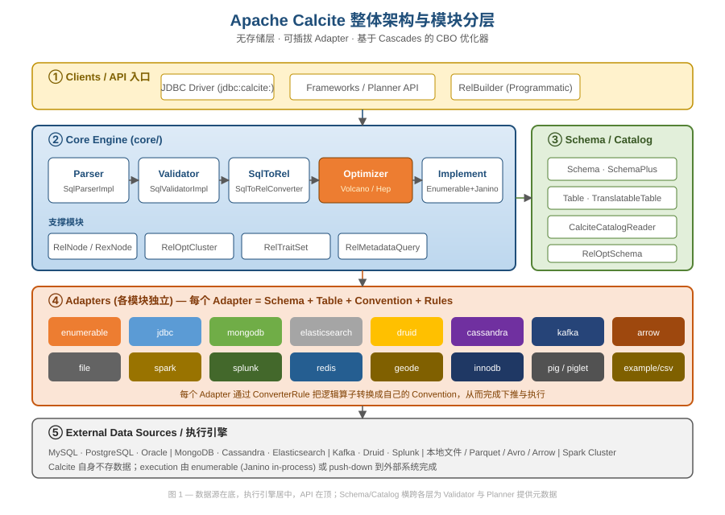
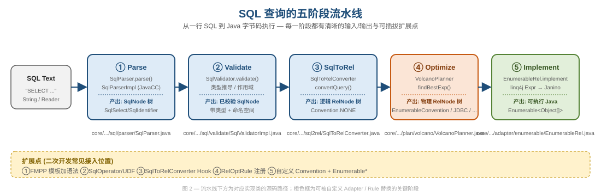
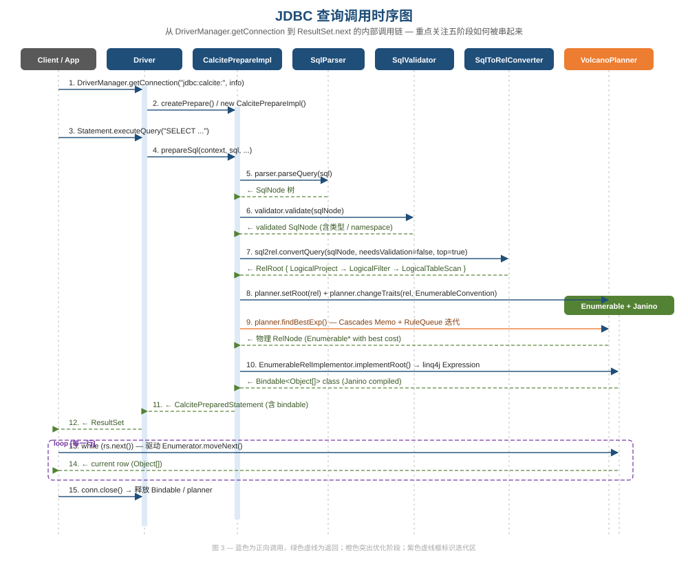
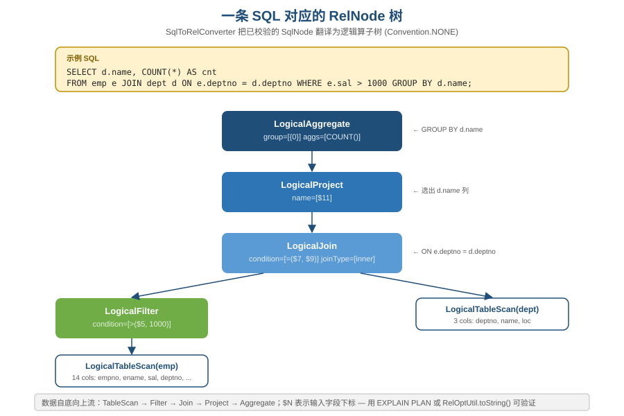
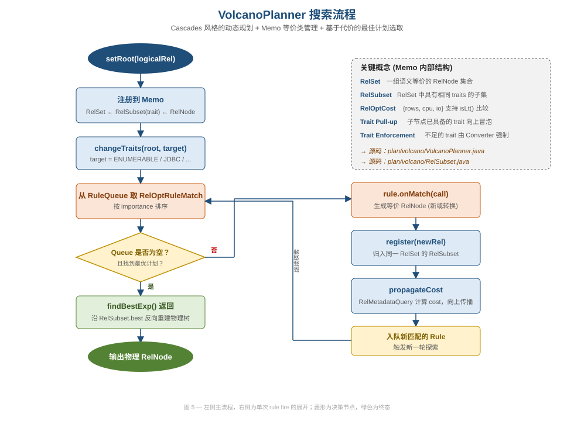
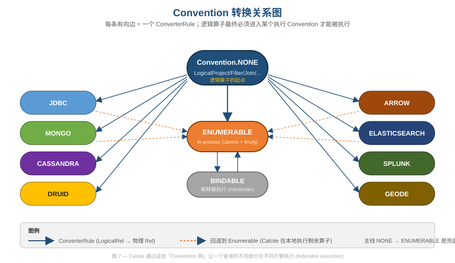
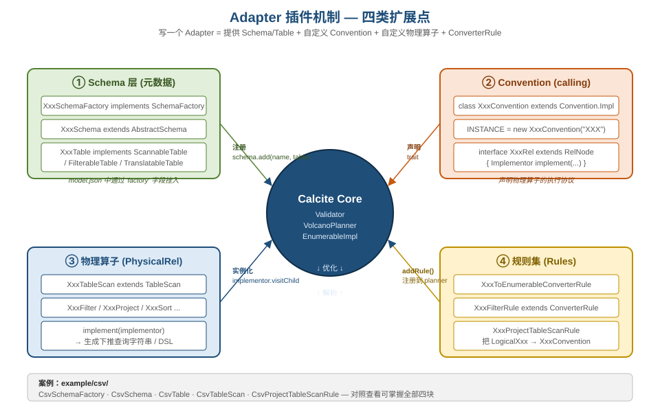
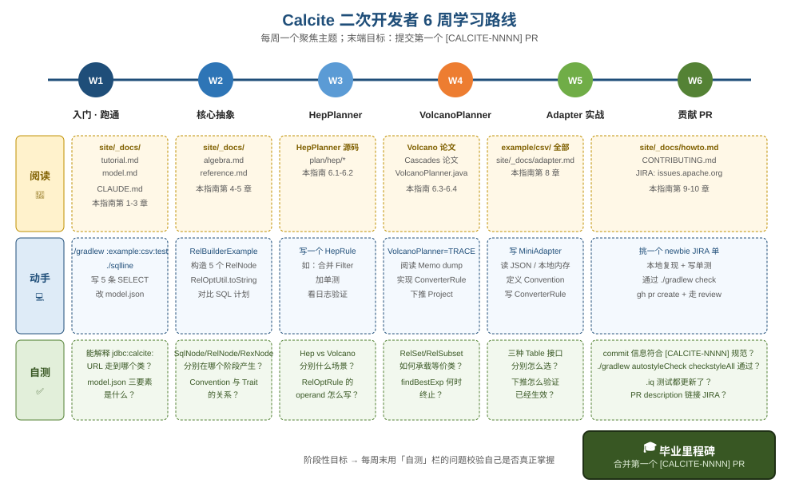

# Apache Calcite 全面入门与源码导览指南

> 面向想做 **二次开发 / 社区贡献** 的工程师。
> 中文为主，关键类名、方法名、SQL 关键字保留英文。
> 与官方 `site/_docs/` 互补：官方文档面向使用者，本指南面向「读源码 / 改源码 / 扩展 Adapter」的开发者。

---

## 目录

- [第 0 章 · 写在前面](#第-0-章--写在前面)
- [第 1 章 · Calcite 是什么 / 不是什么](#第-1-章--calcite-是什么--不是什么)
- [第 2 章 · 五分钟跑通第一个查询](#第-2-章--五分钟跑通第一个查询)
- [第 3 章 · 模块地图（速查表）](#第-3-章--模块地图速查表)
- [第 4 章 · 查询的五阶段流水线](#第-4-章--查询的五阶段流水线)
- [第 5 章 · 核心抽象（必懂概念）](#第-5-章--核心抽象必懂概念)
- [第 6 章 · 优化器内核](#第-6-章--优化器内核)
- [第 7 章 · RelBuilder 与编程式查询构造](#第-7-章--relbuilder-与编程式查询构造)
- [第 8 章 · Adapter 二次开发实战](#第-8-章--adapter-二次开发实战)
- [第 9 章 · 测试体系与代码贡献](#第-9-章--测试体系与代码贡献)
- [第 10 章 · 调试技巧速查](#第-10-章--调试技巧速查)
- [第 11 章 · 学习路线图（6 周）](#第-11-章--学习路线图6-周)
- [附录 A · 关键文件索引（One-Page Cheat Sheet）](#附录-a--关键文件索引one-page-cheat-sheet)
- [附录 B · 官方资源与社区](#附录-b--官方资源与社区)

---

## 第 0 章 · 写在前面

### 阅读对象

- **已有** Java 基础、了解 SQL / JDBC / 关系代数概念
- **目标** 是看懂 Calcite 源码、能写 Adapter / RelOptRule、能提交 patch 到 ASF
- **不是** 用 Calcite 当 SQL 库的浅尝用户（那种场景请直接看 `site/_docs/tutorial.md`）

### 与官方文档的关系

| 官方文档 | 定位 | 与本指南的关系 |
|---------|------|--------------|
| `site/_docs/tutorial.md` | 用 CSV adapter 跑通 | 本指南第 2 章引用，不复述 |
| `site/_docs/algebra.md` | RelBuilder + 关系代数 | 本指南第 5、7 章互补 |
| `site/_docs/adapter.md` | 各 adapter 使用说明 | 本指南第 8 章互补 |
| `site/_docs/howto.md` | 开发者操作手册 | 本指南第 9、10 章互补 |
| `site/_docs/reference.md` | SQL 方言 / 配置参数 | 本指南不复述，直接查阅 |
| `CLAUDE.md` | 整个仓库的 LLM 协作约定 | 与本指南骨架一致，是上层视图 |

### 阅读建议

通读 1 遍约 90 分钟；每章末尾的 **延伸阅读** 与 **动手作业** 是落地关键，不要跳过。

---

## 第 1 章 · Calcite 是什么 / 不是什么



**一句话定位**：Apache Calcite = SQL 解析 + 校验 + 关系代数 + 基于代价的优化器（CBO）+ 多源 Adapter；**不含存储层**、**不含执行引擎**（默认 Janino 在进程内执行，但完全可以下推到外部系统）。

### Calcite 的典型角色

| 项目 | Calcite 在其中做什么 |
|------|------------------|
| Apache Hive | 复用 Calcite 的解析与 CBO（HiveSql + HiveRel） |
| Apache Drill / Phoenix | 解析 + 计划生成 |
| Apache Flink (Table API) | SQL 解析、关系代数、规则优化 |
| Apache Beam (SQL) | 解析 + 翻译为 Beam Pipeline |
| Apache Kylin | Cube 路由 + 查询改写 |
| Dremio / Apache Druid | 查询解析与执行计划生成 |

### 与"亲戚"项目的关系

- **Avatica** — Calcite 的 JDBC/ODBC 远程协议层；`jdbc:calcite:` URL 本质上走 `avatica.UnregisteredDriver` 派生类（`org.apache.calcite.jdbc.Driver`）。
- **linq4j** — Calcite 自带的 LINQ-Java 表达式库；优化器输出后由它生成 Java 代码。
- **Janino** — 内嵌的 Java 源码到字节码的编译器；linq4j 把表达式拼成 Java 源码后交给 Janino。
- **FMPP + JavaCC** — 解析器生成工具链；Calcite 的 SQL 方言通过 `core/src/main/codegen/templates/Parser.jj` 模板生成。

> **一句话记忆**：Calcite 不存数据、不跑数据，但帮你 **看懂 SQL 并产生最优计划**；执行交给 Enumerable（本地）或外部 Adapter（远端）。

### 延伸阅读

- `site/_docs/background.md`
- 论文：*Apache Calcite: A Foundational Framework for Optimized Query Processing Over Heterogeneous Data Sources*（SIGMOD 2018）

### 动手作业

- 找出 3 个使用 Calcite 的开源项目，写下它们用到的阶段（仅解析？还是含 CBO？还是含 Adapter？）

---

## 第 2 章 · 五分钟跑通第一个查询

### 路线 A：JDBC + 模型文件（推荐入门）

```bash
# 1. 编译
./gradlew :example:csv:assemble

# 2. 跑示例测试
./gradlew :example:csv:test --tests org.apache.calcite.test.CsvTest

# 3. 交互式：用 sqlline + CSV adapter
./sqlline
sqlline> !connect jdbc:calcite:model=example/csv/src/test/resources/model.json admin admin
0: jdbc:calcite:> SELECT * FROM EMPS;
```

模型文件 `example/csv/src/test/resources/model.json` 是入口；其 `factory` 字段指向 `CsvSchemaFactory`，Calcite 在连接时反射加载它。

### 路线 B：Frameworks API（无模型文件）

```java
FrameworkConfig config = Frameworks.newConfigBuilder()
    .defaultSchema(rootSchema.add("S", new ReflectiveSchema(new Hr())))
    .parserConfig(SqlParser.config())
    .build();

Planner planner = Frameworks.getPlanner(config);
SqlNode parsed = planner.parse("SELECT * FROM emps WHERE empid > 100");
SqlNode validated = planner.validate(parsed);
RelNode rel = planner.rel(validated).rel;
System.out.println(RelOptUtil.toString(rel));
```

参见 `core/src/test/java/org/apache/calcite/examples/FrameworksTest.java`。

### 解读关键源码

- `core/src/main/java/org/apache/calcite/jdbc/Driver.java` — 注册 `jdbc:calcite:` 协议；在 static block 中向 `DriverManager` 注册自身。
- `core/src/main/java/org/apache/calcite/jdbc/CalcitePrepare.java` — 五阶段的总调度接口。
- `core/src/main/java/org/apache/calcite/prepare/CalcitePrepareImpl.java` — 默认实现，把 SQL 推过五阶段。

### 延伸阅读

- `site/_docs/tutorial.md`（最权威的 CSV adapter 教程）
- `example/csv/src/test/java/org/apache/calcite/test/CsvTest.java`（看完之后基本能"画"出全流程）

### 动手作业

- 用 `sqlline` 在 CSV adapter 上跑一条带 `GROUP BY` + `JOIN` 的查询
- 改 `model.json`，新加一个 CSV 文件作为表

---

## 第 3 章 · 模块地图（速查表）

| 模块 | 定位 | 首要源码入口 | 测试入口 |
|------|------|------------|---------|
| `core/` | SQL 解析、Validator、RelNode、Planner、JDBC | `org.apache.calcite.jdbc.Driver` | `core/src/test/java/org/apache/calcite/test/JdbcTest.java` |
| `linq4j/` | LINQ-Java 表达式 + Janino 调用 | `org.apache.calcite.linq4j.tree.Expressions` | `linq4j/src/test/java/.../Linq4jTest.java` |
| `testkit/` | 共享测试 Fixture | `org.apache.calcite.test.SqlOperatorFixture` | — |
| `babel/` | 宽容方言解析器 | `org.apache.calcite.sql.babel.BabelParser` | `babel/src/test/.../BabelParserTest.java` |
| `server/` | DDL 扩展 (`CREATE TABLE` 等) | `org.apache.calcite.server.DdlExecutor` | `server/src/test/.../ServerTest.java` |
| `example/csv` | 教学 adapter | `org.apache.calcite.adapter.csv.CsvSchemaFactory` | `example/csv/.../CsvTest.java` |
| `example/function` | 教学 UDF / Table function | `org.apache.calcite.example.maze.MazeTable` | `example/function/.../ExampleFunctionTest.java` |
| `adapter-*` | 各数据源 adapter (mongodb / jdbc / druid / es / ...) | 各模块的 `*SchemaFactory` | 各模块的 `*Test.java` 与 `*IT.java` |
| `bom/` | 依赖版本平台 | `bom/build.gradle.kts` | — |
| `buildSrc/` | Gradle 自定义插件 (`calcite.fmpp`, `calcite.javacc`) | `buildSrc/.../FmppPlugin.kt` | — |
| `site/` | Jekyll 文档站 | `site/_docs/*.md` | — |
| `ubenchmark/` | JMH 微基准 | — | `./gradlew ubenchmark:jmh` |

### 模块依赖大方向

```
buildSrc ← (所有需要 fmpp/javacc 的模块)
linq4j ← core
core ← {testkit, babel, server, adapter-*, example/*}
testkit ← {core 的测试, adapter-* 的测试}
```

### 延伸阅读

- 仓库根 `settings.gradle.kts` — 看完整模块清单与启用条件

### 动手作业

- 用 `./gradlew :core:dependencies` 列出 core 的传递依赖，找出 `linq4j` / `avatica` 的版本
- 列出你最感兴趣的 3 个 adapter，给每个找到 `*SchemaFactory` 类

---

## 第 4 章 · 查询的五阶段流水线

> 这是整本指南最核心的一章。所有后续工作（写规则、做下推、改解析、扩 SQL 方言）都在这条流水线上某个位置插入或替换组件。



### 4.0 五阶段一句话总览

| 阶段 | 输入 | 关键类 | 入口方法 | 输出 |
|------|------|-------|---------|------|
| ① Parse | SQL 文本 | `SqlParser` / `SqlParserImpl` | `parse()` | `SqlNode` 树 |
| ② Validate | `SqlNode` | `SqlValidatorImpl` | `validate()` | 带类型 + 命名空间的 `SqlNode` |
| ③ SqlToRel | 已校验 `SqlNode` | `SqlToRelConverter` | `convertQuery()` | 逻辑 `RelNode` 树（`Convention.NONE`） |
| ④ Optimize | 逻辑 `RelNode` | `VolcanoPlanner` / `HepPlanner` | `findBestExp()` | 物理 `RelNode` 树（带 `EnumerableConvention` 或 adapter convention） |
| ⑤ Implement | 物理 `RelNode` | `EnumerableRelImplementor` + Janino | `implement()` | 可执行 `Bindable` / `Enumerable<Object[]>` |

### 4.1 时序：JDBC 调用如何穿过五阶段



`DriverManager.getConnection("jdbc:calcite:", info)` 后的内部调用链：
1. `Driver.connect()` → `CalciteConnectionImpl`
2. `Statement.executeQuery(sql)` → `CalcitePrepareImpl.prepareSql()`
3. `prepareSql()` 依次调用 Parser / Validator / SqlToRel / Planner
4. 优化输出后 `EnumerableRelImplementor.implementRoot()` 产生 LINQ Expression
5. Janino 编译为 `Bindable` 子类
6. `ResultSet.next()` 驱动底层 `Enumerator.moveNext()`

### 4.2 Parse 阶段细节

- 解析器 **不是手写的**：由 `core/src/main/codegen/templates/Parser.jj`（FMPP 模板）+ JavaCC 在 `./gradlew generateSources` 时生成。
- 生成产物：`core/build/javacc/javaCCMain/org/apache/calcite/sql/parser/impl/SqlParserImpl.java`
- 要扩 SQL 方言：改 `Parser.jj` 而不是改生成代码；同时维护 `core/src/main/codegen/config.fmpp` 决定生成时合并的 token / production。
- 测试解析的便捷工具：`SqlParserTest`、`SqlValidatorFixture`。

### 4.3 Validate 阶段细节

- `SqlValidatorImpl` 用 Visitor 模式遍历 `SqlNode`，调用 `validateCall()`, `validateSelect()`, `validateExpr()` 等。
- 名称解析依靠 `SqlValidatorScope`（按层级嵌套）和 `SqlValidatorNamespace`（每个 SELECT / FROM 子句一个）。
- 类型推导依赖 `SqlOperator.deriveType()` 与 `RelDataTypeFactory`。
- Catalog 通过 `Prepare.CatalogReader`（实现 `SqlValidatorCatalogReader`）注入。

### 4.4 SqlToRel 阶段细节

- `SqlToRelConverter.convertQuery()` 是入口；对 SELECT 走 `convertSelectImpl()`。
- 内部使用 `Blackboard` 维护当前可见列；`RexBuilder` 构造行级表达式（`RexNode`）。
- 子查询会触发 `SubQuery` 改写（如 `IN → SemiJoin`、`EXISTS → SemiJoin`），由 `SubQueryRemoveRule` 等规则在后续阶段细化。
- 此阶段的输出全部位于 `Convention.NONE`，并以 `LogicalProject / LogicalFilter / LogicalAggregate / LogicalJoin / LogicalUnion / LogicalTableScan` 等节点表示。

### 4.5 Optimize 与 Implement

后两个阶段在第 6 章详解。这里只强调一点：**Optimize 的入参是逻辑树，出参是物理树（带具体 Convention 的 RelNode）**；Implement 把物理树翻译为代码。

### 延伸阅读

- `core/src/main/java/org/apache/calcite/prepare/PlannerImpl.java` — 把五阶段串起来的"门面"类，**通读这一个文件 = 看懂整个流水线**。
- `core/src/main/java/org/apache/calcite/jdbc/CalcitePrepare.java`
- `site/_docs/algebra.md`

### 动手作业

- 跑一条 SQL，用 `-Dcalcite.debug=true` 打开调试，把每个阶段的中间产物（SqlNode、validated SqlNode、RelNode、optimized RelNode、Generated Java）保存到一个文件，对照本章流水线读
- 在 `SqlToRelConverter.convertSelectImpl()` 入口加断点，看 `Blackboard` 的内容变化

---

## 第 5 章 · 核心抽象（必懂概念）

### 5.1 三类节点：SqlNode / RelNode / RexNode

| 抽象 | 表示什么 | 在哪个阶段出现 | 父类 |
|------|---------|--------------|------|
| `SqlNode` | SQL 语法树节点 | Parse → Validate | `org.apache.calcite.sql.SqlNode` |
| `RelNode` | 关系算子（处理整张表/集合） | SqlToRel 之后 | `org.apache.calcite.rel.RelNode` |
| `RexNode` | 行级标量表达式（条件、字段引用、字面量） | 出现在 RelNode **内部**（如 Filter.condition、Project.exps） | `org.apache.calcite.rex.RexNode` |

**记忆口诀**：
- SqlNode 长得像 **SQL**（带子句结构）
- RelNode 长得像 **执行计划节点**（带 `getInputs()`）
- RexNode 长得像 **表达式**（带 `getKind()` 与 `accept(RexVisitor)`）

### 5.2 一条 SQL 对应的 RelNode 树



`$N` 表示输入字段的下标（不是 SQL 列名）。一旦走入 RelNode 世界，列就是 **位置敏感** 的；这是写 Rule 的常见坑。

### 5.3 Convention 与 RelTraitSet

- `Convention`（位于 `org.apache.calcite.plan.Convention`）声明 **如何执行**：`EnumerableConvention.INSTANCE` = 本地 Janino；`JdbcConvention` = 翻译成 SQL 推到远端 DB；`MongoConvention` = 翻译为 Mongo aggregation pipeline。
- `RelTraitSet`（位于 `org.apache.calcite.plan.RelTraitSet`）是一个**有序、不可变**的 trait 集合：始终包含一个 `Convention`，可选 `RelCollation`（排序）、`RelDistribution`（数据分布）等。
- 优化器通过 **ConverterRule** 在不同 Convention 间转换，通过 **trait enforcement** 把缺失的 trait 加上去（如插入 Sort 来满足 RelCollation）。

### 5.4 RelOptCluster — 优化期上下文

`org.apache.calcite.plan.RelOptCluster` 是整个 plan 共享的"上下文容器"，包含：
- `RelOptPlanner` 当前 planner 实例
- `RexBuilder` 表达式工厂
- `RelMetadataProvider` 元数据查询（行数估计、谓词、唯一键等）
- `RelDataTypeFactory` 类型系统
- 相关 correlation id 计数器

每个 RelNode 都持有 cluster 引用；写 Rule 时通过 `call.builder()` 获取关联的 RelBuilder。

### 5.5 元数据：RelOptSchema / CatalogReader / Schema / Table

| 接口 | 谁实现 | 作用 |
|------|------|------|
| `Schema` | adapter 提供（如 `CsvSchema`） | 列出 tables / sub-schemas / functions |
| `Table` | adapter 提供（如 `CsvTable`） | 提供 row type、统计；可实现 `ScannableTable` / `FilterableTable` / `TranslatableTable` 决定执行方式 |
| `RelOptSchema` | Calcite 内部 `CalciteCatalogReader` | 给 planner 用：按多段名查表 |
| `SqlValidatorCatalogReader` | 同上 | 给 validator 用：解析标识符 |

### 5.6 RelBuilder — 编程式构造

`org.apache.calcite.tools.RelBuilder` 提供链式 API：

```java
final RelNode node = builder
    .scan("EMP")
    .filter(builder.call(SqlStdOperatorTable.GREATER_THAN,
        builder.field("SAL"), builder.literal(1000)))
    .aggregate(builder.groupKey("DEPTNO"),
        builder.count(false, "C"),
        builder.sum(false, "S", builder.field("SAL")))
    .build();
System.out.println(RelOptUtil.toString(node));
```

写测试 / 调试 Rule 时极有用，因为不用走 SQL 解析。

### 延伸阅读

- `core/src/main/java/org/apache/calcite/rel/RelNode.java`（核心 90 行接口定义）
- `core/src/main/java/org/apache/calcite/rex/RexNode.java`
- `core/src/main/java/org/apache/calcite/plan/RelTraitSet.java`
- `site/_docs/algebra.md`

### 动手作业

- 用 RelBuilder 构造第 5.2 节那张图对应的 RelNode 树，用 `RelOptUtil.toString()` 打印验证
- 写一个最简的 `RexVisitor`，遍历某 RexNode 并统计 `RexCall` 的个数

---

## 第 6 章 · 优化器内核

### 6.1 RelOptRule 的两种形态

| 形态 | 用途 | 典型例子 |
|------|------|--------|
| Transformation rule | 同 Convention 内部改写（保留语义、改变结构） | `FilterMergeRule`、`ProjectMergeRule`、`AggregateProjectMergeRule` |
| Converter rule (`ConverterRule` 子类) | 跨 Convention 转换 | `EnumerableProjectRule`、`JdbcProjectRule` |

写一条规则的骨架：

```java
public class MyRule extends RelOptRule {
  public static final MyRule INSTANCE = new MyRule();
  private MyRule() {
    super(operand(LogicalFilter.class, operand(LogicalProject.class, any())));
  }
  @Override public void onMatch(RelOptRuleCall call) {
    LogicalFilter filter = call.rel(0);
    LogicalProject project = call.rel(1);
    // ... 构造新 RelNode 并 call.transformTo(newRel)
  }
}
```

> Calcite 推荐用 `RelRule + Config` 的新形式（详见 `RelRule.Config`），老的 `RelOptRule(operand)` 形式仍在过渡中。

### 6.2 HepPlanner — 启发式优化

- 位于 `core/src/main/java/org/apache/calcite/plan/hep/HepPlanner.java`
- 按 `HepProgram` 中预设的 **规则执行顺序** 跑，每条规则在匹配点反复触发直到稳定（fixed point）
- 适合归一化阶段：常量折叠、谓词下推、子查询消除等"几乎总是正向"的改写
- 不基于代价模型，不做枚举搜索

### 6.3 VolcanoPlanner — 基于 Cascades 的 CBO



#### Memo 结构（深度记忆）

- **RelSet** — 一组语义等价的 `RelNode` 集合（例如：`SELECT a FROM t WHERE b=1` 与 `SELECT a FROM (t WHERE b=1)` 经过 Filter pushdown 后属于同一 RelSet）。
- **RelSubset** — RelSet 中具有相同 `RelTraitSet` 的子集；每个 subset 记一个当前最优物理实现 (`best`) 和最低代价 (`bestCost`)。
- **每个 RelNode 进入 Memo 后被注册到某个 RelSubset**；planner 后续操作都是基于 subset，而不是 RelNode 本身。

#### 搜索循环

1. `setRoot(rel)` → 把根注册成 RelSet
2. `changeTraits(rel, target)` → 声明"我要 ENUMERABLE 这个 trait"
3. 把所有匹配的 `RelOptRuleMatch` 入 RuleQueue（按 importance 排序，importance ∝ subset 的 cost 估计）
4. 循环：取出 match → `rule.onMatch(call)` → 新的等价 RelNode 注册回 Memo → 触发新的 match 入队
5. `findBestExp()` 在每个 subset 取 `best`，重建物理树

#### Trait 传播

- **Pull-up**：子节点已具备的 trait（如已排序）自然向上冒泡
- **Enforcement**：缺失的 trait 由 converter 强制（例如插入 `Sort` 节点来满足 RelCollation 要求）

### 6.4 Convention 网络（federated execution 的本质）



Volcano 在 Memo 中同时维护"在哪个 convention 下执行"的多个候选；每条 ConverterRule 增加一条转换边。同一条查询可能：
- 整体下推到 JDBC（远端 DB 执行）
- 部分下推（如 filter 在 Mongo 执行，join 拉回到 Enumerable）
- 完全本地（Enumerable + Janino）

### 6.5 Cost 与 Metadata 框架

- `RelOptCost` —— Calcite 的 cost 接口；默认实现 `VolcanoCost` 比较 `{rows, cpu, io}`，`isLt()` 用于挑最优。
- `RelMetadataQuery`（`RMQ`）—— 元数据查询门面，提供 `getRowCount()`, `getDistinctRowCount()`, `getPredicates()`, `getUniqueKeys()`...
- `RelMdRowCount`, `RelMdSelectivity` 等 `RelMd*` 类按 RelNode 类型分发实现
- 缓存：`RelMetadataProvider` chain + `JaninoRelMetadataProvider`（生成代码加速 metadata dispatch）

### 调试小技巧

- 把 `org.apache.calcite.plan.volcano.VolcanoPlanner` 调到 `TRACE`，能看到 Memo 状态与每条 rule fire
- 把 `org.apache.calcite.plan.RelOptPlanner` 调到 `DEBUG` 可看 cost 选择过程
- `RelOptListener` 接口可挂回调，监听 ruleAttempted / ruleProductionSucceeded 等事件

### 延伸阅读

- 论文：Graefe, *The Cascades Framework for Query Optimization*（1995）
- `core/src/main/java/org/apache/calcite/plan/volcano/VolcanoPlanner.java`
- `core/src/main/java/org/apache/calcite/plan/volcano/RelSubset.java`
- `core/src/main/java/org/apache/calcite/plan/hep/HepPlanner.java`
- `core/src/main/java/org/apache/calcite/rel/metadata/RelMetadataQuery.java`

### 动手作业

- 写一个 HepRule：合并相邻的两个 LogicalFilter（参考 `FilterMergeRule`）
- 给 Rule 加单测：用 `RelOptFixture`（在 `testkit/`）或 Quidem
- 把 VolcanoPlanner 日志调到 TRACE，对照一个具体 SQL 的 Memo dump 找出 `best` 是怎么变化的

---

## 第 7 章 · RelBuilder 与编程式查询构造

`RelBuilder` 是 Calcite 提供的"不写 SQL，也能构造 RelNode 树"的流式 API。**写 Rule、写 Adapter、写测试** 时都离不开它。

最完整的入门样例在：`core/src/test/java/org/apache/calcite/examples/RelBuilderExample.java`。

### 基本套路

```java
FrameworkConfig config = Frameworks.newConfigBuilder()
    .defaultSchema(rootSchema)
    .build();
RelBuilder builder = RelBuilder.create(config);

// SELECT ename FROM emp WHERE deptno = 10
RelNode r1 = builder
    .scan("EMP")
    .filter(builder.equals(builder.field("DEPTNO"), builder.literal(10)))
    .project(builder.field("ENAME"))
    .build();

// SELECT deptno, COUNT(*) FROM emp GROUP BY deptno
RelNode r2 = builder
    .scan("EMP")
    .aggregate(builder.groupKey("DEPTNO"),
        builder.count(false, "C"))
    .build();

System.out.println(RelOptUtil.toString(r2));
```

### 与 SQL 走法的对照

| 操作 | SQL | RelBuilder |
|------|-----|----------|
| 选列 | `SELECT a, b` | `.project(b.field("a"), b.field("b"))` |
| 过滤 | `WHERE c > 1` | `.filter(b.greaterThan(b.field("c"), b.literal(1)))` |
| 分组聚合 | `GROUP BY d` | `.aggregate(b.groupKey("d"), b.count(...))` |
| Join | `JOIN ... ON ...` | `.join(JoinRelType.INNER, b.call(...))` |
| 排序 | `ORDER BY e` | `.sort(b.field("e"))` |

### 延伸阅读

- `site/_docs/algebra.md`
- `core/src/main/java/org/apache/calcite/tools/RelBuilder.java`（API 全集）
- `core/src/test/java/org/apache/calcite/tools/RelBuilderTest.java`（覆盖率最高的实战样例）

### 动手作业

- 用 RelBuilder 构造 5.2 节的示例计划，并对比由 SQL 走 `Frameworks` 产生的 RelNode 树是否字段一致

---

## 第 8 章 · Adapter 二次开发实战



写一个 Adapter = 同时提供：
1. **Schema 层**：`SchemaFactory` + `Schema` + `Table`，告诉 Calcite "这里有哪些表，每张表什么 schema"
2. **Convention**：一个自定义的 `Convention` 实例，声明本 adapter 的"执行约定"
3. **物理算子**：一组实现自定义 RelNode 接口（如 `MongoRel`）的类，对应你想下推的算子（Scan / Filter / Project / Sort / ...）
4. **规则集**：一组 `ConverterRule`，把 `LogicalXxx` 转换到本 adapter 的 Convention

### 8.1 拆解 `example/csv/`

```
example/csv/src/main/java/org/apache/calcite/adapter/csv/
├── CsvSchemaFactory.java       ① 入口（model.json 指向这里）
├── CsvSchema.java              ② 列出 tables（每个 CSV 文件 = 一张表）
├── CsvTable.java               ③ 抽象基类
├── CsvScannableTable.java       └─ 简单全表扫描
├── CsvFilterableTable.java      └─ 支持 filter pushdown（不优化器参与）
├── CsvTranslatableTable.java    └─ 接入 Volcano，能配合 Project pushdown
├── CsvTableScan.java           ④ Translatable 模式下的 RelNode 实现
├── CsvProjectTableScanRule.java ⑤ 把 LogicalProject + CsvTableScan 合并下推
└── CsvEnumerator.java          ⑥ 实际读 CSV → Object[] 的 Enumerator
```

跟着 `model.json` → `CsvSchemaFactory.create()` → `CsvSchema.getTableMap()` → `CsvTable.toRel()` → `CsvTableScan.register()` 一路走，能把上图四个扇区全摸一遍。

### 8.2 三种 Table 接口的选择决策

| 接口 | 何时选 | 谁负责下推 | 代价 |
|------|------|---------|------|
| `ScannableTable` | 最简单；adapter 只能交出全表 | Calcite 在内存做 filter / project | 远端读全表，本地过滤 |
| `FilterableTable` | adapter 能消费简单 predicate | Calcite 把能识别的 predicate 交给你；剩下的本地做 | 不参与 CBO，规则固定 |
| `TranslatableTable` | adapter 要参与 Volcano 优化 | 你写一组 ConverterRule，决定哪些算子下推 | 最灵活，写起来最复杂 |

> 经验法则：能用 `TranslatableTable` 就用它；其他两种是新手友好版本。

### 8.3 写一个 Adapter 的 Checklist

- [ ] 新建 Gradle 模块 `:adapter-xxx`，加入 `settings.gradle.kts`
- [ ] `XxxSchemaFactory implements SchemaFactory`
- [ ] `XxxSchema extends AbstractSchema`
- [ ] `XxxTable extends AbstractTable implements TranslatableTable`
- [ ] `XxxConvention extends Convention.Impl`
- [ ] `interface XxxRel extends RelNode { void implement(Implementor implementor); }`
- [ ] 每个想下推的算子：`XxxTableScan / XxxFilter / XxxProject / ...`
- [ ] 每个算子对应一条 `XxxXxxRule extends ConverterRule`
- [ ] `XxxToEnumerableConverter` 用来回退到本地执行
- [ ] `model.json` 样例 + 单元测试（参考 `example/csv` 的 `CsvTest`）
- [ ] 注册 SPI：`META-INF/services/org.apache.calcite.schema.SchemaFactory`

### 延伸阅读

- `site/_docs/adapter.md`
- 已有 adapter 的源码：`mongodb/`、`elasticsearch/`、`druid/` —— 三种不同复杂度的样本
- `core/src/main/java/org/apache/calcite/rel/convert/ConverterRule.java`（基类抓住它的设计意图）

### 动手作业

- 把 CSV adapter 的 `TranslatableTable` 分支改成支持 `Sort` 下推（理论上 CSV 排序意义不大，但作为练习极佳）
- 写一个"内存表" adapter：从 Java `List<Map<String,Object>>` 直接喂数据

---

## 第 9 章 · 测试体系与代码贡献

### 9.1 Quidem `.iq` 测试

`.iq` 文件是 Calcite 大量 SQL 行为测试的载体，位于 `core/src/test/resources/sql/`（如 `agg.iq`, `join.iq`, `winagg.iq`）。

```
!use scott
SELECT deptno, COUNT(*) FROM emp GROUP BY deptno;
+--------+--------+
| DEPTNO | EXPR$1 |
+--------+--------+
|     10 |      3 |
|     20 |      5 |
|     30 |      6 |
+--------+--------+
!ok
```

- 改完 SQL 行为或新增用例时，跑测试加 `-Dquidem.write=true` 让 Calcite **自动回写** 期望输出，然后 `git diff` 检查变化。
- 由 `CoreQuidemTest` / `CoreQuidemTest2` 等类分发。

### 9.2 单测分层

- `*Test.java` —— 单元测试，跑 `./gradlew test`
- `*IT.java` —— 集成测试，依赖 vlsi/calcite-test-dataset 的 Vagrant VM
- `testkit/` —— 共享 fixture（`SqlOperatorFixture`、`Matchers` 等）

### 9.3 修改解析器的正确姿势

```
✗  错：直接改 core/build/javacc/.../SqlParserImpl.java
✓  对：改 core/src/main/codegen/templates/Parser.jj
      改 core/src/main/codegen/config.fmpp（如需新关键字、新方法）
      ./gradlew generateSources 触发再生成
```

### 9.4 Null Safety 边界

- 主代码默认非空；用 `@Nullable`（**checker-framework** 的版本，不是 `javax.annotation`）标注可空。
- 信任内部代码：内部不要重复 `requireNonNull`。
- 边界处用 `Objects.requireNonNull(x, "x")`，运行时确认。
- "我确定非空" 用 `org.apache.calcite.linq4j.Nullness.castNonNull(x)`，告诉 Checker。
- `@MonotonicNonNull` —— 字段初始 null、之后只能赋非空。
- `@RequiresNonNull` —— 方法承诺调用方已检查过字段。
- 校验：`./gradlew -PenableCheckerframework :linq4j:classes :core:classes`

### 9.5 Commit / PR 规范

- 主题：`[CALCITE-NNNN] Imperative description.` （首字母大写、无句号、祈使句）
- 一个 JIRA 对应一个 PR；多次推送应当 squash 成单个 commit。
- PR 建立超过 10 分钟或已有讨论后，**避免 force-push**，除非 reviewer 要求。
- 整个工程把 Java warnings 当 error（`werror=true`）—— 新的 deprecation/unchecked 会编译失败。

### 延伸阅读

- `CONTRIBUTING.md` / `site/_docs/howto.md`
- `core/src/test/resources/sql/`（直接读几个 `.iq` 文件）
- 已合入的近期 PR：`git log --oneline | head -20` 是最好的风格教材

### 动手作业

- 用 `-Dquidem.write=true` 跑一遍 `core:test` 的某个 Quidem 测试，故意改一条 SQL 看输出更新
- 跑 `./gradlew autostyleCheck checkstyleAll`，把任意一条 warning 修干净

---

## 第 10 章 · 调试技巧速查

| 目标 | 操作 |
|------|------|
| 看生成的 Java 代码 | `-Dcalcite.debug=true` 直接 print 到 stdout |
| 单步进入生成代码 | `-Dorg.codehaus.janino.source_debugging.enable=true`，可加 `-Dorg.codehaus.janino.source_debugging.dir=/tmp/janino` 把源码留盘 |
| 看 Volcano 决策 | `core/src/test/resources/log4j2-test.xml` 把 `org.apache.calcite.plan.volcano.VolcanoPlanner` 调到 `TRACE` |
| 看 HepPlanner 决策 | 同上文件里调高 `org.apache.calcite.plan.hep.HepPlanner` |
| 打 Memo dump | TRACE 日志里会自动 dump；或调用 `planner.dump()` |
| 监听 rule 触发 | 自定义 `RelOptListener` → `planner.addListener(...)` |
| 在 SqlToRel 之间插桩 | 用 `Hook` SPI：`Hook.PROGRAM`, `Hook.PLAN_BEFORE_IMPLEMENTATION`, ... |
| 跑单测时只看一个 case | `./gradlew :core:test --tests org.apache.calcite.test.JdbcTest.testWinAgg` |
| 复现 quidem 失败 | 把 `.iq` 单独提出来跑：`./gradlew :core:test --tests CoreQuidemTest --info -Dquidem.write=false` |

### 看代码计划的 4 个常用工具

```java
// 1. ASCII tree
System.out.println(RelOptUtil.toString(rel));

// 2. 带 cost 的 dump
System.out.println(RelOptUtil.toString(rel, SqlExplainLevel.ALL_ATTRIBUTES));

// 3. Mermaid / DOT（Calcite 没自带，自己用 GraphViz 拼）

// 4. 直接看 explain
ResultSet rs = conn.createStatement().executeQuery("EXPLAIN PLAN FOR " + sql);
```

### 延伸阅读

- `core/src/main/java/org/apache/calcite/runtime/Hook.java`
- `core/src/test/resources/log4j2-test.xml`

---

## 第 11 章 · 学习路线图（6 周）



| 周 | 主题 | 阅读 📖 | 动手 💻 | 自测 ✅ |
|---|------|--------|---------|--------|
| W1 | 入门 · 跑通 | `tutorial.md`、`model.md`、本指南 1-3 章 | 跑 `:example:csv:test`；`sqlline` 改 model.json 加表 | 解释 `jdbc:calcite:` 走哪个类；模型文件三要素 |
| W2 | 核心抽象 | `algebra.md`、本指南 4-5 章 | `RelBuilderExample`：用 RelBuilder 构造 5 个 RelNode | SqlNode / RelNode / RexNode 在哪个阶段产生？ |
| W3 | HepPlanner | `plan/hep/*`、本指南 6.1-6.2 | 写一条 HepRule（如合并 Filter），加单测 | Hep vs Volcano 各自适用场景？ |
| W4 | VolcanoPlanner | Volcano / Cascades 论文、`VolcanoPlanner.java`、本指南 6.3-6.4 | 把 VolcanoPlanner 日志调 TRACE 阅读 Memo dump；实现一条 ConverterRule | RelSet / RelSubset 如何承载等价类？findBestExp 何时终止？ |
| W5 | Adapter 实战 | `example/csv/`、`adapter.md`、本指南第 8 章 | 写 MiniAdapter（内存表 / JSON 文件均可） | 三种 Table 接口怎么选？怎么验证下推生效？ |
| W6 | 贡献 PR | `howto.md`、`CONTRIBUTING.md`、JIRA、本指南 9-10 章 | 挑 newbie 单 → 本地复现 → 写单测 → `./gradlew check` → `gh pr create` | commit 是否符合 `[CALCITE-NNNN]` 规范？`.iq` 更新了？ |

**毕业里程碑**：合并第一个 `[CALCITE-NNNN]` PR。

### 找 newbie JIRA 的方法

- https://issues.apache.org/jira/projects/CALCITE → Filter: `labels = newbie` 或 `priority = Trivial`
- `dev@calcite.apache.org` 邮件列表里搜 "good first issue"

---

## 附录 A · 关键文件索引（One-Page Cheat Sheet）

### 入口
- `core/src/main/java/org/apache/calcite/jdbc/Driver.java`
- `core/src/main/java/org/apache/calcite/jdbc/CalcitePrepare.java`
- `core/src/main/java/org/apache/calcite/prepare/CalcitePrepareImpl.java`
- `core/src/main/java/org/apache/calcite/prepare/PlannerImpl.java`
- `core/src/main/java/org/apache/calcite/tools/Frameworks.java`
- `core/src/main/java/org/apache/calcite/tools/Planner.java`

### 五阶段
- Parse: `core/src/main/java/org/apache/calcite/sql/parser/SqlParser.java`
- Parse 模板: `core/src/main/codegen/templates/Parser.jj`
- Validate: `core/src/main/java/org/apache/calcite/sql/validate/SqlValidatorImpl.java`
- SqlToRel: `core/src/main/java/org/apache/calcite/sql2rel/SqlToRelConverter.java`
- Optimize: `core/src/main/java/org/apache/calcite/plan/volcano/VolcanoPlanner.java`
- Optimize (Hep): `core/src/main/java/org/apache/calcite/plan/hep/HepPlanner.java`
- Implement: `core/src/main/java/org/apache/calcite/adapter/enumerable/EnumerableConvention.java`

### 核心抽象
- `core/src/main/java/org/apache/calcite/rel/RelNode.java`
- `core/src/main/java/org/apache/calcite/rex/RexNode.java`
- `core/src/main/java/org/apache/calcite/sql/SqlNode.java`
- `core/src/main/java/org/apache/calcite/plan/RelTraitSet.java`
- `core/src/main/java/org/apache/calcite/plan/RelOptCluster.java`
- `core/src/main/java/org/apache/calcite/plan/RelOptRule.java`
- `core/src/main/java/org/apache/calcite/rel/convert/ConverterRule.java`
- `core/src/main/java/org/apache/calcite/tools/RelBuilder.java`

### 测试样例
- `core/src/test/java/org/apache/calcite/examples/RelBuilderExample.java`
- `core/src/test/java/org/apache/calcite/test/JdbcTest.java`
- `core/src/test/resources/sql/*.iq`
- `example/csv/src/test/java/org/apache/calcite/test/CsvTest.java`

### 调试钩子
- `core/src/main/java/org/apache/calcite/runtime/Hook.java`
- `core/src/test/resources/log4j2-test.xml`

---

## 附录 B · 官方资源与社区

### 文档
- 官网：https://calcite.apache.org/
- 文档站源：`site/_docs/`（tutorial / algebra / adapter / reference / howto / model / api 等）
- JavaDoc：https://calcite.apache.org/javadocAggregate/

### 社区
- JIRA：https://issues.apache.org/jira/projects/CALCITE
- dev 邮件列表：`dev@calcite.apache.org`（订阅：发空邮件到 `dev-subscribe@calcite.apache.org`）
- user 邮件列表：`user@calcite.apache.org`
- GitHub：https://github.com/apache/calcite

### 经典论文与读物
- Edmon Begoli, Jesús Camacho-Rodríguez, et al. *Apache Calcite: A Foundational Framework for Optimized Query Processing Over Heterogeneous Data Sources*. SIGMOD 2018.
- Goetz Graefe. *The Cascades Framework for Query Optimization*. IEEE Data Eng. Bulletin, 1995.
- Goetz Graefe, William J. McKenna. *The Volcano Optimizer Generator: Extensibility and Efficient Search*. ICDE 1993.

### 同类工具的对比阅读（拓展视野）
- Trino（原 Presto）的 planner
- Spark Catalyst（同样基于 Scala 的规则优化器）
- 论文：*Cascades* / *Orca* / *Spark Catalyst* 系列对比

---

> **结语**：能读到这里、并把每章的「动手作业」都做掉，恭喜你 — 离合并第一个 `[CALCITE-NNNN]` 已经不远了。Calcite 的乐趣在于：你写的每一条 Rule、每一个 Adapter、每一段 Parser.jj 模板的小改动，可能都会被全世界十几个大数据项目复用。Happy hacking!
