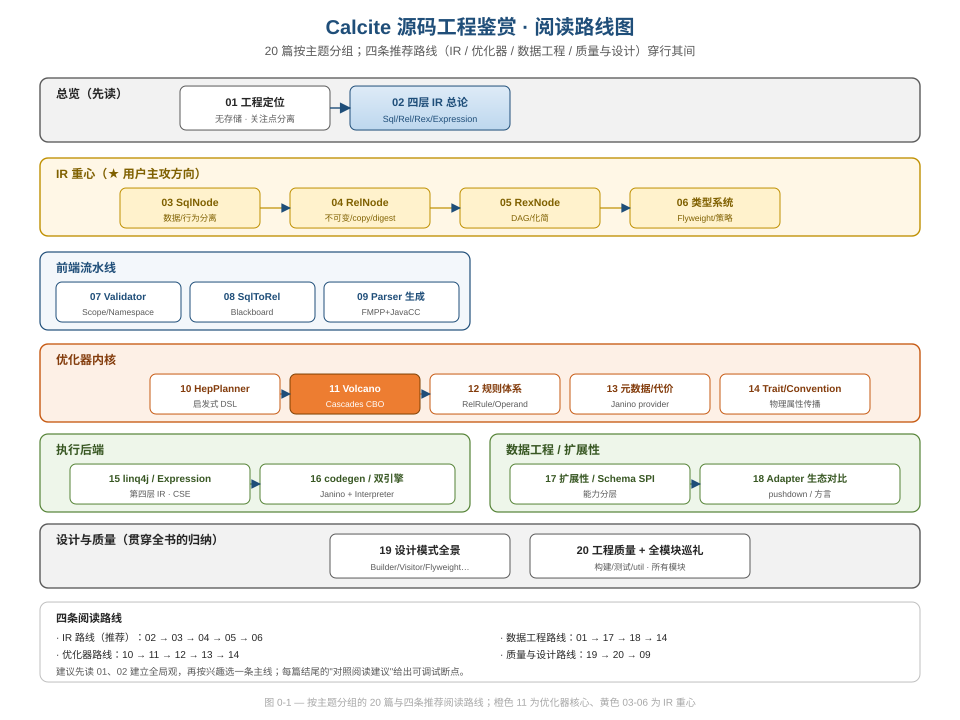

# Apache Calcite 源码工程鉴赏

> 一套从**软件工程 / 数据工程 / 设计模式 / 代码质量**视角，逐主题剖析 Apache Calcite 源码"**有哪些值得学习之处**"的中文深度分析文档。
> 基线 commit：`111030383` · 共 20 篇 + 58 张手写 SVG（架构图 / 类图 / 流程图 / 时序图 / 对比矩阵）。

## 这套文档是什么

它**不是**入门教程，也**不是**"一条查询如何流过五阶段"的流程叙事——这两件事分别由仓库里已有的 [`docs/calcite-guide/`](../calcite-guide/README.md)（11 章入门教材）承担。

本系列的定位是「**源码工程鉴赏**」：每讲一个机制，落点都回到三问之一——

- **软件工程**：关注点分离、不可变性、可测试性、可扩展性、复杂度治理；
- **数据工程**：pushdown、类型系统、SQL 方言、联邦查询、代价模型；
- **设计与代码质量**：用了什么设计模式、为什么这么设计、有什么坑（pitfall）。

源码引用以**类名 / 方法名锚点**为主，行号均经核实（基于上述基线 commit，主干持续提交后行号可能漂移）。每篇结尾都给出可操作的「**对照阅读建议**」——断点位置（file + Class#method）+ 该观察什么。



## 目录（20 篇）

| # | 篇名 | 一句话定位 |
|---|---|---|
| 01 | [工程定位与「无存储」架构哲学](articles/01-positioning.md) | 关注点分离如何成就可复用的 SQL 基础设施 |
| 02 | [为什么是四层 IR](articles/02-ir-overview.md) ★ | SqlNode/RelNode/RexNode/Expression 分层的收益与代价 |
| 03 | [SqlNode AST：数据/行为分离](articles/03-sqlnode.md) ★ | SqlOperator 策略对象、SqlKind 消灭 instanceof、Visitor |
| 04 | [RelNode：不可变 + copy() + digest](articles/04-relnode.md) ★ | 身份/等价分离、结构共享、Shuttle 引用相等短路 |
| 05 | [RexNode 行表达式与 RexProgram DAG](articles/05-rexnode.md) ★ | RexBuilder 规范化、DAG 共享、RexSimplify 化简 |
| 06 | [类型系统：Flyweight + 策略](articles/06-type-system.md) ★ | Factory interning、可定制 TypeSystem、三策略对象 |
| 07 | [Validator：Scope/Namespace 双抽象](articles/07-validator.md) | 位置语境 vs 数据源行类型的关注点分离 |
| 08 | [SqlToRel：Blackboard + Convertlet](articles/08-sql-to-rel.md) | 共享状态容器、注册表+反射、子查询去关联 |
| 09 | [Parser 代码生成工程（FMPP+JavaCC）](articles/09-parser-codegen.md) | 用代码生成解决语法可扩展性 |
| 10 | [HepPlanner：程序化 DSL + DAG 启发式](articles/10-hep-planner.md) | 组合模式 DSL、DAG vs Memo、原位替换 |
| 11 | [VolcanoPlanner：Cascades CBO 内核](articles/11-volcano.md) ★ | Memo(RelSet/RelSubset)、双驱动、动规成本、循环防护 |
| 12 | [规则体系：RelRule + Operand + CoreRules](articles/12-rules.md) | Immutables 配置化、模式匹配树、中央注册表 |
| 13 | [元数据与代价：RMQ + Janino provider](articles/13-metadata-cost.md) | 运行时生成 handler、强类型门面、循环防护 |
| 14 | [Trait/Convention 与物理属性传播](articles/14-trait-convention.md) | 内存池 interning、satisfies 偏序、联邦查询的本质 |
| 15 | [linq4j 与 Expression Tree（第四层 IR）](articles/15-linq4j.md) | Enumerator vs Iterator、表达式树、BlockBuilder CSE |
| 16 | [RelNode→Java：codegen + Janino + Interpreter](articles/16-codegen-exec.md) | 实现者模式、PhysType/RowFormat、双引擎权衡 |
| 17 | [扩展性架构：Schema SPI 能力分层](articles/17-extensibility.md) | 标记接口渐进能力、声明式装配、Wrapper |
| 18 | [Adapter 生态对比（数据工程视角）](articles/18-adapters.md) | 四件套、pushdown 能力边界、RelToSql 方言 |
| 19 | [设计模式全景](articles/19-design-patterns.md) | Builder/Factory/Strategy/Registry/Template/Visitor/Flyweight/Immutables |
| 20 | [工程质量保障 + 全模块巡礼](articles/20-quality-and-modules.md) | 构建/静态检查/测试体系/util 精品 + 所有模块短评 |

★ = IR 重心篇。

## 四条阅读路线

- **IR 路线（推荐先走）**：02 → 03 → 04 → 05 → 06 — 把四层中间表示的设计吃透。
- **优化器路线**：10 → 11 → 12 → 13 → 14 — 从启发式到 Cascades CBO 到规则/元数据/Trait。
- **数据工程路线**：01 → 17 → 18 → 14 — 从定位到 SPI 到 adapter 下推到联邦本质。
- **质量与设计路线**：19 → 20 → 09 — 设计模式归纳、工程质量体系、代码生成构建。

建议先读 01、02 建立全局观，再按兴趣选一条主线深入。

## 与仓库其他资料的关系

- [`docs/calcite-guide/`](../calcite-guide/README.md) — 11 章中文**入门教材**（怎么上手、怎么跑通），本系列与之**互补**：入门用前者，鉴赏用本系列。
- 官方文档 `site/_docs/`：`tutorial.md`（CSV adapter）、`algebra.md`（RelBuilder）、`adapter.md`、`howto.md`。

## 校验

文档自带只读校验脚本，从仓库根运行：

```
bash docs/source-analysis/assets/verify.sh
```

它校验：所有 SVG 的 XML well-formedness（`xmllint`）、无 `foreignObject`、图片引用零悬挂、篇间链接闭环、源码引用路径 100% 存在、风格骨架完整。治理文件（大纲 / 边界 / 风格 / 探索结论）见 [`assets/`](assets/)。
