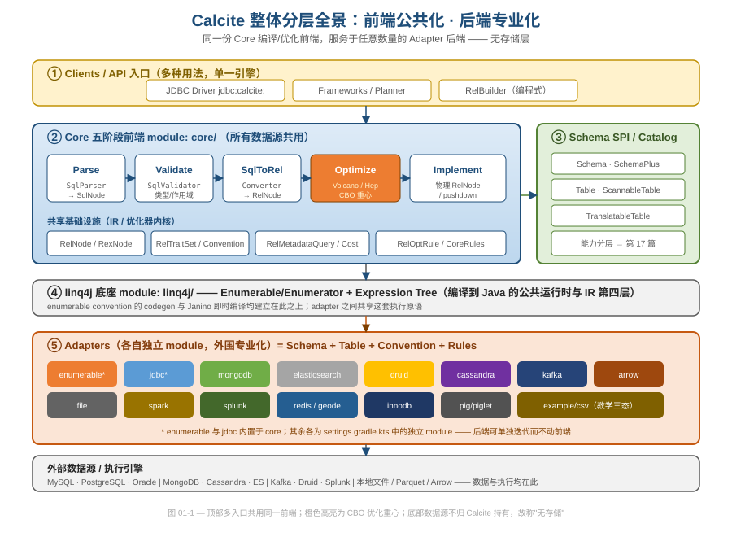
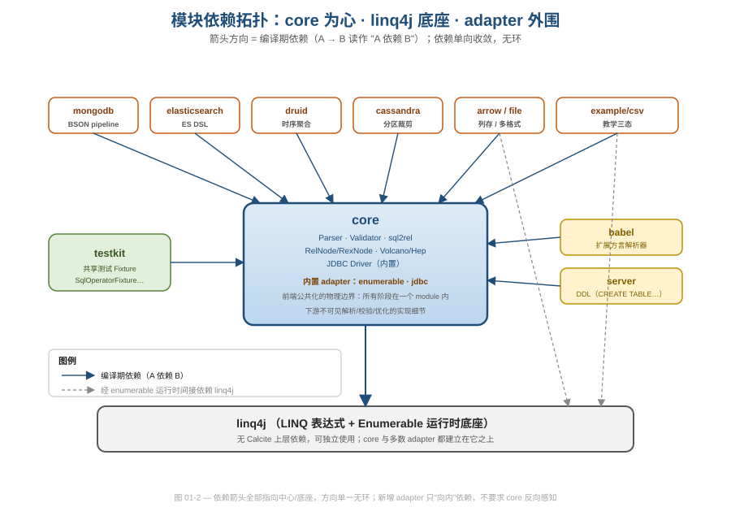

# 第 01 篇 · 工程定位与「无存储」架构哲学

> 本篇从**软件工程**视角回答一个问题：为什么一个"不存数据、不跑数据"的框架，反而能成为 Druid、Hive、Flink、Kylin 等一票引擎共同的 SQL 大脑？答案藏在它的关注点切分方式里——**前端公共化、后端专业化**。读完你会知道：哪条边界是 Calcite 的承重墙，它如何用模块依赖把这条边界焊死，以及这套设计可借鉴在哪、坑在哪。
> 本篇是全系列的坐标系：它只讲"分层本身作为一个工程决策好在哪"，不展开任何阶段的内部算法（那些是后续 19 篇的事）。建议把它当作一张地图，读后续每一篇时回头对照"这个机制在加固承重墙的哪一侧"。
> 基线 commit `111030383` · 前置阅读：无（本篇是系列起点）

## TL;DR

- Calcite 把"理解 SQL、做关系代数变换、基于代价择优"这套**与数据源无关的脑力活**统一收进 `core`，把"怎么取数、怎么执行、怎么下推"这套**与数据源强相关的体力活**外推给各 adapter。这就是"前端公共化、后端专业化"。
- 它**没有存储层**：`package-info.java` 自称 "dynamic data management platform"，所有真实数据都在外部系统里。Calcite 只产出执行计划，要么编译成进程内 Java（enumerable convention + linq4j + Janino），要么下推（pushdown）给外部引擎执行。
- 对照传统 DBMS：Calcite **整层拿掉了存储/事务/恢复**，只保留"解析 + 校验 + 优化 + 兜底执行"。少做这几件事换来的是对任意数据源的中立性——这正是它能被 N 个引擎复用的根因。
- 这条边界靠**模块依赖方向**物理焊死：`settings.gradle.kts` 列出 25 个 module，依赖箭头单向收敛到 `core` 与底座 `linq4j`；adapter 只"向内"依赖，core 永远不感知任何具体 adapter。
- 入口侧也做了公共化：JDBC `Driver`、Planner Framework、`RelBuilder` 三种用法共用同一套前端，区别只在"从哪一层进入流水线"。
- 后端接入靠 SPI（`schema.Table` 家族）+ 一个虚拟约定 `Convention.NONE` 收口。能力可按需分层声明（`ScannableTable` → `FilterableTable` → `ProjectableFilterableTable` → `TranslatableTable`），不实现的能力由 core 兜底。
- 能力分层还顺带规避了"胖接口"反模式：不是给 `Table` 塞满 `scan/filter/project/...` 一堆方法逼所有人实现，而是拆成一组小接口按需 `implements`——接口隔离原则（ISP）的标准用法。
- 代价/权衡：这种极致解耦换来了"一处修复、处处受益"，但也意味着 core 是个巨型 module（SQL 全功能都在里面）、新 adapter 要理解的契约面不小，且"无存储"使得 Calcite 把性能命运部分交给了下游引擎、把代价模型的准确性交给了外部统计。

---

## 1. 先把"它到底是什么"钉死：一份自述与一条承重墙

很多人第一次接触 Calcite 会困惑：它既不是数据库，也不是单纯的 SQL 解析器，文档里却敢叫 "platform"。源码里这句自我定位写得相当克制：

```java
// core/src/main/java/org/apache/calcite/package-info.java
/**
 * Main package for Calcite, the dynamic data management platform.
 */
@CalciteImmutable
package org.apache.calcite;
```

注意两个词。**dynamic**：schema、函数、甚至语法都可以运行时装配（后面会看到 `SchemaFactory` 用 JSON model 声明式注入）。**management platform** 而非 "database"：它**管理**对数据的访问与计算计划，但**不拥有**数据。这一字之差就是本篇要讲的"无存储"哲学——Calcite 的全部代码都围绕"如何把一句 SQL 变成一个可执行/可下推的计划"展开，没有一行是关于"数据落在哪个磁盘块"的。

把这件事讲成软件工程语言：Calcite 在系统里画了一条**承重墙**，墙的一侧是"与数据源无关的语言/代数/优化逻辑"，另一侧是"与数据源强相关的取数/执行逻辑"。前者做成公共件放进 `core`，后者做成可插拔件放进各 adapter。整本源码的组织、模块的切分、接口的设计，本质都在维护这堵墙不漏。

为什么这条墙值得花一整篇去讲？因为它决定了 Calcite 的**复用经济学**。SQL 标准本身极其庞大——解析、名字解析、类型推导、上百条等价变换规则、代价模型，任何一个引擎自己实现一遍都是数人年的工程。如果这套逻辑和"数据存在哪"耦合在一起，那么每接一个新数据源就要重写一遍前端，复用率为零。Calcite 的赌注是：**只要把"与数据源无关"的部分干净地隔离出来，它就能被任意多个后端摊薄复用**。Druid、Hive、Flink、Kylin、Beam 之所以都用 Calcite 当 SQL 层，正是因为它们不想各造一遍编译器/优化器轮子——它们要的就是墙的"公共"那一侧。这条墙画得越干净，这个赌注的回报越大。

> 关注点分离（Separation of Concerns）是老生常谈，但 Calcite 的示范价值在于：它选对了切分维度。不是按"功能模块"切（那样会切出无数纵向竖井），而是按"是否依赖具体数据源"这个**正交维度**横切——切出一个能被 N 个后端复用的前端。这是本篇最值得带走的一句话。

下图先建立全局坐标系，后续每节都会落到图上的某一层。



图 01-1 自顶向下五层：① 多种 API 入口；② `core` 的五阶段前端（Parse → Validate → SqlToRel → Optimize → Implement，橙色高亮的优化是 CBO 重心）；③ 横跨在侧的 Schema SPI/Catalog；④ `linq4j` 底座；⑤ 外围 adapter，最下是真正持有数据的外部系统。**关键读法**：顶部三个入口、中间一整套前端、底座，全是"公共"的（一份代码服务所有数据源）；只有最外圈的 adapter 是"专业"的（每种数据源一套）。注意 enumerable 与 jdbc 两个 adapter 带星号——它们内置在 `core` 里，是 core 自带的"默认后端"，下一节会解释为什么。

本篇严格不展开任何阶段的内部算法：五阶段的连贯叙事与"为什么是四层 IR"留给 [第 02 篇](02-ir-overview.md)，各阶段细节分散在第 03–16 篇。这里只看"分层本身"作为一个工程决策好在哪。

## 2. 拿掉哪一块？——与传统 DBMS 的架构对照

理解"无存储"最快的方式，是把一台传统数据库拆开看 Calcite **保留了什么、扔掉了什么**。一台经典 RDBMS 大致是这么几层叠起来的：

| 传统 DBMS 的层 | 职责 | Calcite 怎么处理 |
|---|---|---|
| SQL 解析 / 校验 | 把文本变成可分析的语义树 | **完整保留**（Parser / Validator） |
| 查询优化器 | 等价变换 + 代价择优 | **完整保留且是重心**（Volcano / Hep） |
| 执行引擎 | 真正算出结果 | **只保留兜底版**（enumerable 进程内），主力交给下游 |
| 存储引擎 / 缓冲池 / 页管理 | 数据的物理组织与读写 | **整层拿掉** |
| 事务 / 并发控制 / WAL / 恢复 | ACID 保证 | **整层拿掉** |
| 元数据目录（catalog） | 表/列/统计信息 | **抽象成 SPI**（Schema/Table），数据由外部供给 |

一句话：**Calcite 拿掉了"拥有并管理数据"所需的一切（存储、事务、恢复），只保留"理解并优化对数据的计算"这部分大脑**。它甚至把执行引擎也只留一个兜底实现——真正的执行能力优先借给下游（pushdown）。这就是它敢自称 platform 而非 database 的底气，也是它能被那么多引擎复用的前提：一个不抢你存储、不管你事务、只帮你把 SQL 优化好的中立组件，谁都愿意嵌。

反过来想就更清楚了：恰恰因为拿掉了存储与事务，Calcite 才**不必为任何一种数据布局/一致性模型做假设**，于是它的优化逻辑能对所有数据源保持中立。"少做一件事"在这里不是功能缺失，而是换取了"通用性"这个更稀缺的属性——这是架构取舍里很反直觉、却极具借鉴价值的一点：**有时把一整层职责显式地推出去，比把它做进来更有价值**。

> 取舍要讲透。**收益**：把最难复用、最值钱、又与具体存储无关的"编译+优化"独立出来，做成可被 N 个引擎共享的公共件；任何引擎都能在数周内拥有一个工业级 SQL 优化器，而非数人年自研。**代价**：① Calcite 把性能命运的一部分交给了下游——它能产出绝佳计划，但若下游执行引擎拉胯或下推不充分，整体仍慢；② 没有存储与统计信息的"所有权"，代价模型只能依赖外部喂进来的统计（[第 13 篇](13-metadata-cost.md) 会看到 `RelMetadataQuery` 如何向 SPI 要这些数字），统计不准则优化决策受限；③ 没有事务层，Calcite 自身不为一致性负责。这些不是缺陷，而是"做编译器而不做数据库"这一定位的必然边界。

## 3. 前端公共化（一）：入口收口——三种用法，一套流水线

"公共化"首先体现在**入口侧**。Calcite 不为每种使用方式各写一套引擎，而是把不同入口都收口到同一条流水线的不同进入点上。最典型的是 JDBC 驱动:

```java
// core/src/main/java/org/apache/calcite/jdbc/Driver.java
public class Driver extends UnregisteredDriver {
  public static final String CONNECT_STRING_PREFIX = "jdbc:calcite:";

  static {
    new Driver().register();          // 类加载即向 DriverManager 注册
  }

  public CalcitePrepare createPrepare() {
    if (prepareFactory != null) {
      return prepareFactory.get();
    }
    return CalcitePrepare.DEFAULT_FACTORY.apply();   // 默认的"准备"工厂
  }
```

`jdbc:calcite:` 这个前缀把 Calcite 伪装成"一个标准 JDBC 数据库"，于是任何 BI 工具、ORM、`DriverManager` 都能零改造地把它当数据库连。但它背后并不存数据——`createPrepare()` 拿到的 `CalcitePrepare` 才是真正驱动五阶段前端的对象。

那个 `static { new Driver().register(); }` 静态块也别小看：它利用 JDBC 自己的 SPI 机制，让 `Driver` 在类加载的一刻就把自己注册进 `DriverManager`。这意味着用户只要让这个类被加载（写下 `jdbc:calcite:` 连接串即可触发），就完成了接入，**无需任何显式 `Class.forName` 或配置**。这是"把接入成本压到接近零"的一个细节——`Driver extends UnregisteredDriver`（来自 Avatica），把 JDBC 协议这层苦工也复用了 Avatica 的公共实现，core 只填 Calcite 特有的部分（连接串前缀、`createPrepare`、model 处理）。"公共化"在这里甚至跨越了 module 边界，复用到了上游 Avatica 项目。

注意 `Driver` 这里就埋了一个值得学的扩展点设计：它不让你"子类化 Driver 才能换实现"，而是提供 `withPrepareFactory(Supplier<CalcitePrepare>)` 返回一个新 `Driver`（不可变变换风格），用注入而非继承来替换准备逻辑。这是"对扩展开放、对修改关闭"的一个干净实现。

除了 JDBC，还有两条入口（图 01-1 顶部）：

- **Planner Framework**（`tools.Planner` / `FrameworkConfig`）：嵌入式用法，调用方自己掌控解析、校验、优化的节奏。
- **`RelBuilder`**（`tools.RelBuilder`）：**绕过 SQL 文本**，直接编程构造 `RelNode` 树喂给优化器——它本质上是从流水线的第三阶段（SqlToRel 产物）"半路插入"。`RelBuilder` 的 Builder 模式细节归 [第 19 篇](19-design-patterns.md) 主讲，这里只强调它印证了"前端是分阶段、可从中途接入的公共件"。

> 三种入口的共性是：**它们差异只在"从哪一层进入流水线"，而非"用哪套引擎"**。这正是公共化的收益——新增一种用法（比如未来某种 GraphQL 前端）只需在流水线某层挂一个适配，不必重写校验器和优化器。能借鉴的设计准则：当你发现自己在为"同一套核心逻辑的不同触发方式"复制代码时，应该把核心逻辑抽成分阶段管线，让不同入口共享它。

## 4. 前端公共化（二）：物理边界——core 是一个 module

入口收口是逻辑上的公共化；真正把它焊死的是**物理上的模块边界**。看构建脚本怎么切 module：

```kotlin
// settings.gradle.kts
include(
    "bom", "release",
    "arrow", "babel", "cassandra",
    "core",                    // 五阶段前端 + IR + 优化器 + JDBC Driver 全在这里
    "druid", "elasticsearch",
    "example:csv", "example:function",
    "file", "geode", "innodb", "kafka",
    "linq4j",                  // 执行底座，无 Calcite 上层依赖
    "mongodb", "pig", "piglet", "plus", "redis",
    "server", "spark", "splunk",
    "testkit", "ubenchmark"
)
```

25 个 module，但**整个 SQL 前端、关系代数 IR、两个优化器（Volcano/Hep）、JDBC 驱动，全部塞在单个 `core` 里**。这不是偷懒，而是一个刻意的工程判断：解析器、校验器、`SqlToRelConverter`、优化器之间共享大量的 IR 与工具类（`RelNode`/`RexNode`/`RelOptCluster`/`RelTraitSet`），它们彼此高内聚、改动常常联动，硬拆成多 module 只会制造跨 module 的循环依赖与版本地狱。**高内聚的东西就该放在一起**——这是模块化的第一性原则，而不是"module 越多越解耦"。

而真正与数据源相关、彼此独立的 adapter，则一个一个拆成独立 module（`mongodb`、`druid`、`cassandra`…）。它们之间几乎零耦合：删掉 `druid` module 不会影响 `mongodb` 编译。这就是"后端专业化"的物理形态——每种专业能力封进自己的 module，独立演进、独立发版、独立测试。

`linq4j` 作为底座单列一个 module，且**不依赖任何 Calcite 上层**（它甚至可以脱离 Calcite 当作一个独立的 LINQ-for-Java 库使用）。core 与多数 adapter 的执行路径都建立在它之上。它在 IR 体系里是"第四层"，细节归 [第 15 篇](15-linq4j.md)。

剩下几个 module 也都各安其位、印证同一套哲学：

- **`testkit`** 把测试 Fixture（`SqlOperatorFixture`、`Matchers`…）单列成 module，让 core 与各 adapter 共享同一套测试基建——这是"公共化"思想在**测试维度**的延伸：测试脚手架也是一种可复用基础设施。完整结构归 [第 20 篇](20-quality-and-modules.md)。
- **`babel`** 是一个独立的"扩展方言解析器"module，它在不改动 core 标准语法的前提下，叠加更宽松的多方言关键字/语法。这恰恰是"前端公共化"的反向印证——**当公共前端不够用时，扩展也走"另起 module 叠加"而非"改 core"的路子**。它与 core 共用同一套代码生成机制（FMPP + JavaCC，[第 09 篇](09-parser-codegen.md) 主讲），只是喂不同的语法配置：一份模板、多种方言，前端的"可扩展但不可侵入"在语法层也成立。
- **`server`** 把 DDL（`CREATE TABLE` 等）作为独立 module 叠加在 core 之上，同理。

这三者的共性是：**它们都"向内"依赖 core，扩展能力靠新增 module，而非修改既有公共件**——开闭原则在 module 粒度上的反复体现。

下图把这些 module 的依赖方向画出来：



图 01-2 的读法只有一句：**所有依赖箭头都指向中心 `core` 或底座 `linq4j`，方向单一、收敛、无环**。adapter（外环）依赖 core，core 依赖 linq4j，testkit/babel/server 也依赖 core。**没有任何一条箭头从 core 指向某个具体 adapter**——这是承重墙不漏的证据：core 在编译期完全不知道 `druid`、`mongodb` 的存在。

> 这是依赖倒置原则（DIP）在 module 粒度上的落地：core 定义抽象（`Schema`/`Table`/`Convention` 等 SPI），adapter 实现抽象并依赖 core，而非反过来。可借鉴点：**判断一个解耦设计是否真的成立，最硬的指标不是"接口画得多漂亮"，而是"编译期依赖图是否单向无环"**。接口可以画得很美却被一条偷偷的反向 import 毁掉；依赖图不会撒谎。
>
> 代价要诚实说：`core` 因此成为一个**巨型 module**——SQL 标准的全部功能、两个优化器、整套 IR 都在里面，单 module 编译时间长、新人理解曲线陡。这是"高内聚优先于细粒度模块化"这一取舍必然付出的代价，Calcite 选择承受它。

## 5. "无存储"的真正含义：要么编译进程内，要么下推

"无存储"不只是"不落盘"这么简单，它决定了**执行**这件事怎么发生。Calcite 优化出最佳 `RelNode` 计划后，有两条出路：

**出路一：进程内执行（enumerable convention）。** core 自带一个默认后端，把逻辑算子编译成 Java 代码、用 Janino 即时编译、在 JVM 内跑。它的"约定"是这个枚举单例：

```java
// core/src/main/java/org/apache/calcite/adapter/enumerable/EnumerableConvention.java
public enum EnumerableConvention implements Convention {
  INSTANCE;

  @Override public String getName() {
    return "ENUMERABLE";
  }

  @Override public Class getInterface() {
    return EnumerableRel.class;
  }
```

这就是图 01-1 里带星号、内置于 core 的 enumerable adapter。它的存在保证了：**即便数据源本身啥都不会（只能整表扫描），Calcite 也能把 Filter/Join/Aggregate 等算子在自己进程里补齐执行**。codegen + Janino 的细节归 [第 16 篇](16-codegen-exec.md)，这里只确认它的工程角色——**兜底执行器**。

`EnumerableConvention` 还顺手示范了一处"约定要会自己补物理算子"的契约。它实现的 `enforce(input, required)` 负责在需要时插入物理强制算子——比如当上层要求某种排序而输入没提供时，自动塞一个 `EnumerableSort`：

```java
// core/src/main/java/org/apache/calcite/adapter/enumerable/EnumerableConvention.java
@Override public RelNode enforce(final RelNode input, final RelTraitSet required) {
  RelNode rel = input;
  if (input.getConvention() != INSTANCE) {
    rel = ConventionTraitDef.INSTANCE.convert(
        input.getCluster().getPlanner(), input, INSTANCE, true);
    // ...
  }
  RelCollation collation = required.getCollation();
  if (collation != null && collation != RelCollations.EMPTY) {
    rel = EnumerableSort.create(rel, collation, null, null);   // 缺排序就补一个
  }
  return rel;
}
```

这正是"后端专业化"落到代码上的样子：**core 只提出物理要求（required traits），由具体 convention 自己决定怎么满足**。enumerable 用"插 `EnumerableSort`"满足排序要求；换成 jdbc convention，同样的排序要求会被翻译成 SQL 里的 `ORDER BY` 下推给数据库。同一个"补齐物理属性"的接口，每个后端给出自己专业的答案——`enforce`/物理属性传播的完整机制归 [第 14 篇](14-trait-convention.md)。

**出路二：下推到外部系统（pushdown）。** 每个 adapter 注册自己的 `Convention`（如 jdbc 的 `JdbcConvention`、mongodb 的约定），并提供 `ConverterRule` 把逻辑算子翻译成自己能执行的形式（JDBC 翻成方言 SQL、MongoDB 翻成 BSON pipeline），让外部引擎去算。下推能力的差异与各 adapter 对比归 [第 18 篇](18-adapters.md)。

这两条出路并非二选一，而是**在一条计划里混合并存**：能下推的子树下推（让数据库/ES/Druid 去算，省掉海量数据搬运），不能下推的部分用 enumerable 在进程内补算。决定"哪段下推、哪段进程内"的，不是人写死的规则，而是 CBO 的代价比较——下推通常显著省 I/O，于是优化器在代价驱动下自然偏好把算子尽量推下去。这就是"无存储"框架的执行哲学落地：**Calcite 不替你执行，而是为你把计算切成"该下推的"和"该自己兜底的"两摊，并让代价模型自动找到那条切线**。

> 数据工程视角的要点：pushdown 是联邦/异构查询省钱的命门——把过滤、投影、聚合尽量推到数据所在地，传输量呈数量级下降。但下推能力**因后端而异**（关系库几乎全能下推，CSV 几乎不能），且受方言差异、函数支持度制约。"无存储"把这部分性能弹性显式暴露给了 adapter 作者：你的 adapter 下推越充分，整体越快。这也是为什么 [第 18 篇](18-adapters.md) 要专门用一张矩阵对比各后端的下推能力——它直接决定了数据工程上的可用性。

把这两条出路统一起来的，是一个看似不起眼但**极其关键的虚拟约定** `Convention.NONE`：

```java
// core/src/main/java/org/apache/calcite/plan/Convention.java
public interface Convention extends RelTrait {
  /**
   * Convention that for a relational expression that does not support any
   * convention. It is not implementable, and has to be transformed to
   * something else in order to be implemented.
   *
   * <p>Relational expressions generally start off in this form.
   *
   * <p>Such expressions always have infinite cost.
   */
  Convention NONE = new Impl("NONE", RelNode.class);
```

读这段注释里的三句话，正是无存储架构的执行哲学浓缩：

1. **"does not support any convention"**——刚从 SqlToRel 出来的逻辑算子（`LogicalProject`/`LogicalJoin`…）属于 `NONE`，它表达"做什么"，不表达"在哪算、怎么算"。
2. **"has to be transformed to something else in order to be implemented"**——`NONE` 不可执行，**必须**被某条 `ConverterRule` 转换成某个具体 convention（ENUMERABLE 或某 adapter 的）才能落地。这就强制了"逻辑/物理分离"。
3. **"always have infinite cost"**——`NONE` 的代价是无穷大。这是个精妙的工程技巧：CBO 优化器天然追求最小代价，于是它会**自动**把所有 `NONE` 节点替换掉，无需写"必须消灭 NONE"的硬规则。用代价模型表达约束，而不是用 if-else——这是声明式优化器设计的典型手法。

`Convention` 接口本身也是"前端定契约、后端填实现"的范本。它给了一组 `default` 方法当作合理缺省，让后端只覆写自己关心的：`NONE`（`Impl`）让 `enforce` 抛"未实现"、`canConvertConvention` 返回 `false`——因为它压根不该被执行；而 `EnumerableConvention` 覆写 `enforce` 去真正插入物理算子，并让 `useAbstractConvertersForConversion` 返回 `true`（`NONE` 返回 `false`），声明"我愿意用抽象转换器去处理 collation/distribution 等 trait 的转换"。**同一组接口方法，不同 convention 给出不同答案**——这就是策略由后端各自负责、前端只认接口的最小可工作示范。这些 trait 转换语义的全貌归 [第 14 篇](14-trait-convention.md)，本篇只点出"接口给缺省、后端按需覆写"这一工程手法。

> `Convention` 是 trait 体系的一员，其网络与传播机制由 [第 14 篇](14-trait-convention.md) 主讲。本篇只取它一个角色：**`NONE` 是连接"前端公共逻辑"与"后端专业执行"的咬合齿轮**。前端只管产出 `NONE` 算子（不关心后端是谁），后端各自提供把 `NONE` 转成自己 convention 的规则（不关心前端怎么来的），优化器靠"无穷代价"把两边自动咬合。整个握手过程里前后端互不知晓对方实现——这正是承重墙存在的意义。

## 6. 后端专业化：用 SPI 能力分层接住"无存储"

"无存储"意味着 Calcite 必须有一套机制去**问外部系统要数据、要元数据、要执行能力**。这套机制就是 `org.apache.calcite.schema` 包下的 SPI（Service Provider Interface）。它的设计精髓是**能力按需分层、不实现的由 core 兜底**。

最基础的 `Table` 只要求你能报出行类型：

```java
// core/src/main/java/org/apache/calcite/schema/Table.java
public interface Table {
  /** Returns this table's row type. */
  RelDataType getRowType(RelDataTypeFactory typeFactory);

  Statistic getStatistic();
  Schema.TableType getJdbcTableType();
  // ...
}
```

这里有个值得停一秒的设计抉择：`Table` 故意**没有** `scan` 方法。换句话说，"能不能扫、能不能下推过滤"统统不是 `Table` 的固有职责，而是上浮成独立的能力接口。这就避免了"胖接口"反模式——如果把 `scan/scanWithFilter/scanWithProject/toRel` 全塞进 `Table`，那么每个数据源都被迫给一堆自己根本不支持的能力写空实现或抛 `UnsupportedOperationException`，调用方还得靠"调了才知道支不支持"。Calcite 反其道而行：能力即类型，**支持哪档就 `implements` 哪个接口**，core 用 `instanceof` 一查便知（如 `if (table instanceof FilterableTable)`），既无空实现、也无运行时试探。这是接口隔离原则（ISP）的干净落地。

往上是一组**标记性的能力接口**，按"你愿意承担多少活"递进。最省事的是只声明"我能整表扫描"：

```java
// core/src/main/java/org/apache/calcite/schema/ScannableTable.java
public interface ScannableTable extends Table {
  /** Returns an enumerator over the rows in this Table. Each row is represented
   * as an array of its column values. */
  Enumerable<@Nullable Object[]> scan(DataContext root);
}
```

实现 `ScannableTable` 的表，把每一行交成一个 `Object[]`，过滤/投影/连接全部由 core 的 enumerable 兜底——这就是上一节"出路一"的接入点。注意返回的是 `linq4j` 的 `Enumerable`，再次印证 linq4j 是公共底座。

如果数据源能自己干掉一部分谓词（比如带索引），可以多承担一点，实现 `FilterableTable`。这个接口的 Javadoc 把"协作式下推"的协议写得极其清楚：

```java
// core/src/main/java/org/apache/calcite/schema/FilterableTable.java
public interface FilterableTable extends Table {
  /** ...
   * <p>The list of filters is mutable.
   * If the table can implement a particular filter, it should remove that
   * filter from the list.
   * If it cannot implement a filter, it should leave it in the list.
   * Any filters remaining will be implemented by the consuming Calcite
   * operator. */
  Enumerable<@Nullable Object[]> scan(DataContext root, List<RexNode> filters);
}
```

这是一处教科书级的接口设计：**用一个可变 `List<RexNode>` 同时充当"输入"和"回执"**。core 把候选谓词放进 list；表能下推哪个就从 list 里 `remove` 哪个（表示"我接了"），剩下的留在 list 里，core 自动用 enumerable 补算。没有复杂的"能力查询协议"，没有"先问能不能再下推"的两段握手——一次调用、一个可变集合，就完成了前后端的能力协商。

再往上 `ProjectableFilterableTable` 把列投影也纳入同样的协议，签名只多一个投影下标数组：

```java
// core/src/main/java/org/apache/calcite/schema/ProjectableFilterableTable.java
public interface ProjectableFilterableTable extends Table {
  /** ...
   * @param projects List of projects. Each is the 0-based ordinal of the column
   *                 to project. Null means "project all columns". */
  Enumerable<@Nullable Object[]> scan(DataContext root, List<RexNode> filters,
      int @Nullable [] projects);
}
```

`projects` 用"列序号数组"而非 `RexNode` 表达投影，刻意把这一档的契约压到最简——只支持"选哪几列"，不支持"算表达式列"，把复杂投影留给上层。这体现了能力分层的克制：**每一档只承诺它真正能高效做的事**，不为了接口"看起来强大"而强行扩面。其 Javadoc 还点了一句务实的话："If you wish to write a table that can apply projects but not filters, simply decline all filters."——只想下推投影、不想下推过滤？把所有 filter 留在 list 里不动即可。同一个协议，两种能力可独立开关。

能力金字塔的顶端是 `TranslatableTable`，它把"我自己接管到 RelNode 层"的钥匙交给数据源：

```java
// core/src/main/java/org/apache/calcite/schema/TranslatableTable.java
public interface TranslatableTable extends Table {
  /** Converts this table into a {@link RelNode relational expression}. */
  RelNode toRel(RelOptTable.ToRelContext context, RelOptTable relOptTable);
}
```

它的 Javadoc 还顺手交代了**默认兜底路径**："It is optional for a Table to implement this interface. If Table does not implement this interface, it will be converted to an `EnumerableTableScan`." 也就是说——**你什么能力接口都不实现，Calcite 也能跑**，只是退化为最朴素的整表扫描 + 进程内执行。实现 `TranslatableTable` 则能产出自定义 `RelNode` 子类并挂上自己的优化规则，深度接入优化器。

把四档能力按"承担的活/接入的成本"排一下，金字塔就很清楚了（从底向上，越往上能力越强、实现成本越高、回报也越大）：

| 档位 | 接口 | 承诺能做的事 | 实现成本 | 没实现时的兜底 |
|---|---|---|---|---|
| 基座 | `Table` | 报出行类型 | 1 个方法 | —（这是最低要求） |
| ① | `ScannableTable` | 整表扫描 | +1 方法 `scan(root)` | 由 enumerable 全程兜底 |
| ② | `FilterableTable` | 扫描 + 协作式下推过滤 | +1 方法（带可变 list） | 未接的过滤 enumerable 补算 |
| ③ | `ProjectableFilterableTable` | 再加列投影下推 | +`int[] projects` 参数 | 未接的投影 enumerable 补算 |
| ④ | `TranslatableTable` | 自定义 `RelNode` + 自带规则，深度接入优化器 | 需懂关系代数与规则 | 退化为 `EnumerableTableScan` |

`example/csv` 这个教学 adapter 刻意把 ①③④ 三档各做了一个实现类（`CsvScannableTable` / `CsvFilterableTable` / `CsvTranslatableTable`），就是为了让初学者亲手感受"同一张 CSV 表，接入档位不同、执行路径不同"——这也是本篇"对照阅读建议"里推荐的现场。

> 这套"渐进式能力声明"（progressive capability interfaces）是本篇最值得直接抄进自己系统的模式。它的好处可量化：① **接入成本与收益成正比**——只想跑起来就实现 `ScannableTable`（一个方法），想要性能再逐级加码；② **非侵入**——`core` 不需要为"某表会不会下推"写任何条件分支，靠 `instanceof` 检测能力接口即可，新增能力接口不破坏老实现；③ **永远可降级**——任何未实现的能力都有 enumerable 兜底，系统不会因为某个 adapter 偷懒而崩。SPI 接口家族的完整结构与各能力的优化器接入归 [第 17 篇](17-extensibility.md) 主讲，具体 adapter 实现的横向对比归 [第 18 篇](18-adapters.md)。
>
> 坑也要点明：可变 list 的协议虽简洁，却把"哪些谓词被接管"的状态藏在副作用里，实现者若忘记 `remove` 已下推的谓词，会导致**谓词被重复执行**（既下推又在 enumerable 里再算一遍），逻辑上结果正确但悄悄变慢——这是协作式下推典型的隐性 bug，且不会报错。

## 7. "dynamic" 的兑现：声明式装配与执行上下文解耦

回到第 1 节那句自述里的 **dynamic**。一个"无存储"的框架如果还要求用户改代码、重编译才能接一个新数据源，那它就配不上"dynamic"。Calcite 把"接数据源"做成了**声明式装配**：一份 JSON model 就能在运行时拼出整个 schema 树。这套机制由 `SchemaFactory` 收口：

```java
// core/src/main/java/org/apache/calcite/schema/SchemaFactory.java
public interface SchemaFactory {
  /** Creates a Schema.
   *
   * @param parentSchema Parent schema
   * @param name Name of this schema
   * @param operand The "operand" JSON property */
  Schema create(
      SchemaPlus parentSchema,
      String name,
      Map<String, Object> operand);
}
```

注意第三个参数 `Map<String, Object> operand`——它就是 JSON model 里 `"operand": {...}` 那一块的反序列化结果。`SchemaFactory` 的 Javadoc 直接给了完整范例：用户写一份 model，声明 `"factory": "...CsvSchemaFactory"` 与 `"operand": { directory: "sales" }`，Calcite 在连接初始化时反射实例化这个工厂、把 operand 喂进去，schema 就装配好了。换句话说，**"接哪个数据源、参数是什么"是数据（JSON），不是代码**。这正是 "dynamic data management" 的字面兑现。

更妙的是，连"不写 model 文件"的场景也被收敛进同一条路径。回看第 2 节的 `Driver`：当用户只在连接串里塞了 `schemaFactory=...` 而没给 model 文件时，`Driver.createHandler()` 内部会**临时拼出一份等价的 inline JSON model** 再走标准装配流程（源码里那段 `json.map()` / `"inline:" + json.toJsonString(root)`）。即"无 model"被实现成"程序自动生成 model"，而非另起一套分支逻辑——一条路径，多种入口，又一次收口。

> 这是"配置即数据"（configuration-as-data）+ 工厂模式的组合拳。可借鉴点：把"系统要接什么外部能力"建模成**声明式数据**而非命令式代码，扩展就从"改代码+发版"降级为"改配置"。`SchemaFactory`/`Schema`/JSON model 的完整装配链归 [第 17 篇](17-extensibility.md) 主讲，本篇只确认它是"dynamic"一词的代码落点。

装配解决了"接进来"，还有一个常被忽略却同样体现解耦的细节：**执行期上下文**。注意第 5 节所有 `scan(...)` 方法的首参都是 `DataContext root`：

```java
// core/src/main/java/org/apache/calcite/DataContext.java（节选签名）
public interface DataContext {
  @Nullable SchemaPlus getRootSchema();
  JavaTypeFactory getTypeFactory();
  QueryProvider getQueryProvider();
  @Nullable Object get(String name);   // 取运行期变量（如当前时间、参数绑定）
}
```

`DataContext` 是优化期与执行期之间的"信封"：优化阶段产出的计划是**纯函数式**的（不绑定任何具体连接/会话），到执行阶段才由 `DataContext` 注入 root schema、类型工厂、查询参数、当前时间等运行期状态。这让同一个编译好的计划理论上可被不同上下文复用，也让 codegen 出来的代码不必把这些全局物硬编码进去——它们都从 `DataContext` 这一个入口取。**把"编译期不变量"与"执行期变量"显式分到两个对象里**，是这套架构在并发与可复用上的一处关键防御。

最后补一个贯穿全系统的小接口——它解决"我拿到一个抽象 `Table`/`Schema`，但想问它要点底层专有能力"的尴尬：

```java
// core/src/main/java/org/apache/calcite/schema/Wrapper.java
public interface Wrapper {
  /** Finds an instance of an interface implemented by this object,
   * or returns null if this object does not support that interface. */
  <C extends Object> @Nullable C unwrap(Class<C> aClass);
}
```

`Wrapper.unwrap(Class)` 是一个**类型安全的逃生舱**：上层只依赖抽象接口，但需要时可以"向下问"——比如从一个 JDBC schema `unwrap(DataSource.class)` 拿到底层连接池、`unwrap(SqlDialect.class)` 拿到方言。它把"抽象优先但偶尔需要具体能力"这个永恒矛盾，收敛成一个统一的、可返回 `null`（而非抛 `ClassCastException`）的协商方法。这是承重墙上一扇**受控的门**：不破坏抽象边界，又不堵死必要的逐级穿透。

## 8. 把承重墙串起来：一句 SQL 的旅程视角

把前几节落到一次查询上，承重墙两侧的分工就一目了然（每个阶段的算法都留给后续篇，这里只标"它属于墙的哪一侧"）：

| 阶段 | 入口/类（锚点） | 墙的哪一侧 | 它知道数据源是谁吗 |
|---|---|---|---|
| Parse | `SqlParser` → `SqlNode` | 公共前端 | 不知道 |
| Validate | `SqlValidator`（借 Catalog 元数据） | 公共前端 | 只通过 Schema SPI 问元数据 |
| SqlToRel | `SqlToRelConverter` → `RelNode`(`NONE`) | 公共前端 | 不知道 |
| Optimize | `VolcanoPlanner`/`HepPlanner` | 公共前端 + 后端规则 | 通过 adapter 注册的 `ConverterRule` 间接咬合 |
| Implement | enumerable codegen **或** pushdown | 后端专业化 | 知道（此处才落到具体 convention） |

表里有一行值得多看一眼：Validate 阶段标的是"只通过 Schema SPI 问元数据"。校验器要解析 `emp.deptno` 这样的标识符、要做类型检查，必然得知道表有哪些列、列是什么类型——但它**不直接碰任何数据源**，而是通过 `Schema#getTable` / `Table#getRowType` 这组 SPI 向 catalog 要这些信息（回看 `Table` 接口，`getRowType` 正是为此而设）。于是同一个校验器，面对 MySQL 表和 MongoDB 表的行为完全一致——差异被 SPI 实现吸收掉了。这就是"前端只依赖抽象、不依赖具体数据源"在校验阶段的具体形态（校验器内部的 Scope/Namespace 机制归 [第 07 篇](07-validator.md)）。

关键观察：**前四个阶段几乎完全在墙的"公共"一侧**，它们对"数据在 MySQL 还是 MongoDB"一无所知，只通过 Schema SPI 拿元数据、通过 `ConverterRule` 让后端在优化阶段悄悄介入。直到最后的 Implement 阶段，计划才真正落到某个具体 convention 上。这就是"前端公共化"能成立的全部秘密——**把"与数据源相关"的决策尽可能往后推迟，推到优化的最后一刻**。越往后推，前面可复用的代码就越多。

> 数据工程读者会注意到这正是"逻辑计划 / 物理计划分离"的经典范式，但 Calcite 把分离做到了极致：物理 convention 的选择本身也是 CBO 的一部分（靠 `Convention.NONE` 的无穷代价驱动），而非一个独立的"物理化"阶段。这条 SQL 旅程的连贯叙事与各阶段产物形态，是 [第 02 篇](02-ir-overview.md) 的主题。

把全篇收成一句可带走的判断：**Calcite 的全部架构智慧，都是为了把"与数据源无关的脑力活"压缩成一份可被任意后端复用的公共件，并把"与数据源相关的体力活"延迟到最后一刻、外包给专业后端。** 这条"前端公共化、后端专业化"的承重墙，靠四样东西同时维护——逻辑上的入口收口、物理上的单向无环依赖、`Convention.NONE` 的代价驱动咬合、SPI 的渐进式能力分层。任何一样松动，墙都会漏。理解了这堵墙，后面 19 篇讲的每一个机制（四层 IR、Volcano、trait、codegen、adapter）就都能各归其位：它们要么在加固墙的某一侧，要么在打磨墙上那扇受控的门。

## 设计模式与工程小结

| 机制 / 模式 | 在本篇的体现（锚点） | 三问落点 | 好在哪 / 坑在哪 |
|---|---|---|---|
| 关注点分离（正交横切） | 按"是否依赖数据源"横切出 core 前端 vs adapter 后端 | 软件工程 | 选对切分维度才能换来 N 后端复用一份前端；坑：core 成巨型 module |
| 依赖倒置（module 粒度） | `settings.gradle.kts` 依赖单向收敛到 core/linq4j | 软件工程 | 编译期依赖图无环=承重墙不漏；比"接口画得美"更硬的指标 |
| 高内聚优先于细粒度 | 整个 SQL 前端塞进单个 `core` module | 软件工程 | 联动改动放一起，避免跨 module 循环依赖；代价：编译慢、上手陡 |
| 入口收口（管线分阶段接入） | JDBC `Driver` / Planner / `RelBuilder` 共用前端 | 软件工程 | 新用法只挂一层适配，不重写引擎 |
| 注入优于继承（扩展点） | `Driver#withPrepareFactory` 返回新 Driver | 设计与质量 | 换实现无需子类化；不可变变换风格 |
| 虚拟标记 + 代价驱动约束 | `Convention.NONE` 无穷代价自动被消灭 | 设计与质量 | 用代价模型表达"必须物理化"，替代 if-else 硬规则 |
| 渐进式能力接口（SPI 分层） | `ScannableTable`→…→`TranslatableTable` | 数据工程 | 接入成本与收益成正比、非侵入、永远可降级兜底 |
| 协作式下推协议 | `FilterableTable` 可变 `List<RexNode>` 回执 | 数据工程 | 一次调用完成能力协商；坑：忘 remove 导致谓词重复执行 |
| 兜底执行器 | enumerable convention + linq4j + Janino | 数据工程 | 任何数据源都能跑起来；"无存储"靠它兜底进程内执行 |
| 配置即数据 + 工厂 | `SchemaFactory.create(.., operand)` + JSON model | 数据工程 | 接数据源从"改代码发版"降为"改配置"；"dynamic" 的兑现 |
| 编译期/执行期上下文分离 | `DataContext` 注入 root schema/参数/时间 | 软件工程 | 计划保持纯函数式、可复用；执行期变量集中一处取 |
| 类型安全逃生舱 | `Wrapper.unwrap(Class)` 返回 null 而非抛异常 | 设计与质量 | 抽象优先又允许受控逐级穿透；不堵死底层专有能力 |

## 对照阅读建议（动手）

建议带着"我现在在墙的哪一侧"这个问题去下断点，亲眼看 `NONE` 算子如何被换成物理 convention。

- **断点**：`core/src/main/java/org/apache/calcite/jdbc/Driver.java` → `Driver#createPrepare`
  - **观察**：`jdbc:calcite:` 连接建立时，`CalcitePrepare` 实例如何被创建；这是整条前端流水线的总入口。在 `static { new Driver().register(); }` 处看驱动如何自注册进 `DriverManager`。
  - **运行**：`./gradlew :core:test --tests org.apache.calcite.test.JdbcTest`

- **断点**：`example/csv/src/test/java/org/apache/calcite/test/CsvTest.java` 中任一查询用例
  - **观察**：CSV adapter 分别以 `CsvScannableTable` / `CsvFilterableTable` / `CsvTranslatableTable` 三种"能力档位"接入时，执行路径有何不同——尤其 `FilterableTable.scan(root, filters)` 里 `filters` 这个可变 list 在调用前后元素是否减少（表是否接走了谓词）。这是第 6 节"协作式下推协议"与能力金字塔最直观的现场。
  - **运行**：`./gradlew :example:csv:test --tests org.apache.calcite.test.CsvTest`

- **断点**：`core/src/main/java/org/apache/calcite/adapter/enumerable/EnumerableConvention.java` → `EnumerableConvention#enforce`
  - **观察**：当某查询带 `ORDER BY` 而输入未提供该排序时，`enforce` 是否走进 `EnumerableSort.create(...)` 这一支——亲眼看"后端自己补齐 core 提出的物理要求"。对照 `Convention.NONE`（`Impl#enforce` 返回 null / 抛异常），体会"同一接口、不同 convention 不同答案"。
  - **运行**：`./gradlew :core:test --tests org.apache.calcite.test.JdbcTest` 中带排序的用例，或任一 `EnumerableSort` 相关测试。

- **断点**：`core/src/test/java/org/apache/calcite/examples/RelBuilderExample.java` 的 `main`
  - **观察**：完全不写 SQL 文本、直接用 `RelBuilder` 构造 `RelNode` 树，验证"前端是可从中途接入的分阶段管线"。对比 `JdbcTest` 从 SQL 文本进入，体会两条入口最终汇入同一个 `RelNode` 表示。
  - **运行**：直接运行该类的 `main()`（或 `./gradlew :core:test` 相关用例）。

- **观察点（无需断点）**：用 `RelOptUtil.toString(rel)` 或 `EXPLAIN PLAN` 打印优化前后的计划，对比优化前算子带 `LogicalXxx`（属于 `Convention.NONE`）、优化后变成 `EnumerableXxx` 或 `JdbcXxx`——亲眼见证"无穷代价的 NONE 被自动消灭、落到具体 convention"。

## 延伸阅读

本系列其余篇目可视作"对承重墙某一侧的逐机制放大"。按本篇的两侧划分，推荐这样接续：

**理解前端公共化（墙的公共侧）：**

- [第 02 篇 · 为什么是四层 IR](02-ir-overview.md)——本篇画了坐标系，第 02 篇把五阶段流水线讲成一个连贯的"四层降级"工程决策；是从本篇进入细节的第一站。
- [第 07 篇 · Validator：Scope/Namespace 双抽象](07-validator.md)——本篇第 8 节提到的"校验只经 SPI 问元数据"在此展开。
- [第 09 篇 · Parser 代码生成工程](09-parser-codegen.md)——`babel` 如何"叠加 module 而非改 core"扩展语法，前端可扩展性的语法层证据。

**理解后端专业化与无存储（墙的专业侧）：**

- [第 14 篇 · Trait/Convention 与物理属性传播](14-trait-convention.md)——`Convention.NONE` 的咬合机制、`enforce`、convention 转换网络、trait 传播的完整故事。
- [第 17 篇 · 扩展性架构：Schema SPI 能力分层](17-extensibility.md)——`Table` 能力金字塔的完整结构、JSON model 装配链与每层如何接入优化器。
- [第 18 篇 · Adapter 生态对比](18-adapters.md)——JDBC/MongoDB/Druid/ES/CSV 五个后端的 pushdown 能力横向对比（"后端专业化"的实证矩阵）。
- [第 16 篇 · RelNode→Java 执行](16-codegen-exec.md)——enumerable convention 如何 codegen + Janino 即时编译，"无存储"的进程内兜底执行细节。
- [第 13 篇 · 元数据与代价](13-metadata-cost.md)——本篇所说"代价模型依赖外部统计"在此落到 `RelMetadataQuery`。
- [第 20 篇 · 工程质量保障 + 全模块巡礼](20-quality-and-modules.md)——`settings.gradle.kts` 里 25 个 module 的逐个短评与定位。

**外部资料：**

- 官方文档：`site/_docs/adapter.md`（adapter 概念）、`site/_docs/howto.md`（开发指南）、`site/_docs/index.md`（项目自述与"无存储"定位）、`site/_docs/model.md`（JSON model 语法）。
- 入门教材（第 1 卷）：[../../calcite-guide/README.md](../../calcite-guide/README.md)，可与本系列"源码工程鉴赏"视角对照阅读。
- 论文：Begoli et al., *Apache Calcite: A Foundational Framework for Optimized Query Processing Over Heterogeneous Data Sources* (SIGMOD 2018)——"异构数据源之上的统一查询处理"正是"无存储 + 前端公共化"的学术表述。
