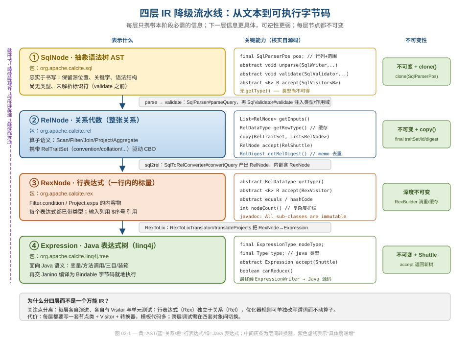
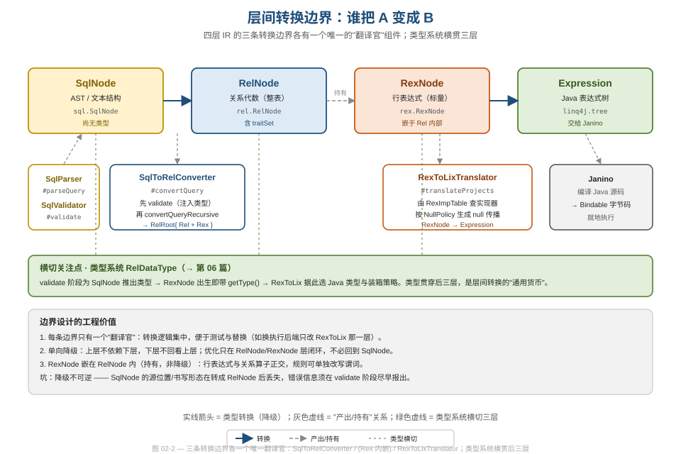

# 第 02 篇 · 为什么是四层 IR（SqlNode / RelNode / RexNode / Expression）

> 一句话导语：很多人以为编译器/优化器只有"AST + 逻辑计划"两层。Calcite 却把中间表示（IR）切成了**四层**——这不是过度设计，而是一组刻意的关注点分离决策。本篇回答"为什么分这么多层、每层的边界在哪、各自付出了什么代价"。
> 基线 commit `111030383` · 前置阅读：[第 01 篇 · 工程定位](01-positioning.md)

## TL;DR

- Calcite 的查询表示一路降级经过四层 IR：`SqlNode`（AST）→ `RelNode`（关系代数）→ `RexNode`（行表达式）→ `Expression`（linq4j 的 Java 表达式树），最后交 Janino 编译成字节码。
- **分层的本质是关注点分离**：每层只携带本阶段必需的信息，拥有独立的节点类、独立的 Visitor、独立的单元测试，可以各自演进。
- **`RexNode` 不是 `RelNode` 的下一层降级，而是被 `RelNode` "持有"**：行内标量表达式（谓词、投影项）与关系算子正交——这是 Calcite IR 设计里最容易被忽视、却最关键的一刀。
- **每层节点都不可变**，且转换单向（上层不依赖下层、下层不回看上层）。优化在 `RelNode`/`RexNode` 层闭环，永远不必回到 `SqlNode`。
- 代价是真实存在的：四套节点类 + 四套 Visitor + 三个转换器，模板代码量大，跨层调试要在四种对象间切换。

## 1. 先看全景：一条 SQL 的四次"降级"

把同一个查询 `SELECT name FROM emp WHERE sal > 1000` 放到显微镜下，它在 Calcite 内部会被表达四次，每次都比上一次更接近"机器怎么执行"，也更难还原回 SQL 原文。



图 02-1 把四层并排摆开，右侧两列分别标注了"关键能力"（核实自源码）和"不可变性保证"。读图时抓三条主线：

1. **信息逐层变具体**（左侧紫色虚线）。`SqlNode` 阶段连列 `name` 指向哪张表、是什么类型都还不知道；到 `RexNode` 阶段，每个表达式都已带类型、输入列用 `$0`/`$1` 这样的序号引用；到 `Expression` 阶段，已经是 `a + b`、三目运算、装箱拆箱这类纯 Java 语义。
2. **可逆性逐层变弱**。`SqlNode` 能原样 `unparse()` 回 SQL；`RelNode` 能通过 `rel2sql` 大致还原（见[第 18 篇](18-adapters.md)）；到 `Expression` 就基本是单向的了。
3. **每层都不可变**。这点贯穿全系列，是 Calcite 优化器能够大胆"试错"的根基（详见下文第 3 节）。

四层各自的"户口"非常清晰，看包名即知归属：

| 层 | 包 | 角色 | 类型信息 |
|---|---|---|---|
| `SqlNode` | `org.apache.calcite.sql` | 抽象语法树，忠实于书写 | 无（validate 前） |
| `RelNode` | `org.apache.calcite.rel` | 关系代数，描述"整张关系" | 有 `getRowType()` |
| `RexNode` | `org.apache.calcite.rex` | 行表达式，描述"一行内的标量" | 出生即带 `getType()` |
| `Expression` | `org.apache.calcite.linq4j.tree` | Java 表达式树 | Java `Type` |

源码本身就把这条"类型在哪一层才出现"的分界写进了 javadoc。`RexNode` 的类注释明确把自己和 `SqlNode` 对照：

```java
// core/src/main/java/org/apache/calcite/rex/RexNode.java
/**
 * Row expression.
 *
 * <p>Every row-expression has a type.
 * (Compare with {@link org.apache.calcite.sql.SqlNode}, which is created before
 * validation, and therefore types may not be available.)
 * ...
 * <p>All sub-classes of RexNode are immutable.
 */
public abstract class RexNode {
```

而 `SqlNode` 这边，连构造器都只接收一个源位置 `SqlParserPos`，根本没有类型字段——因为这一层的使命只是"忠实记录用户写了什么"：

```java
// core/src/main/java/org/apache/calcite/sql/SqlNode.java
public abstract class SqlNode implements Cloneable {
  protected final SqlParserPos pos;

  SqlNode(SqlParserPos pos) {
    this.pos = requireNonNull(pos, "pos");
  }
```

> 软件工程视角：**让"是否拥有类型"成为层与层之间的硬边界**，是一个极克制的设计。它逼着每个开发者在写代码时回答"我现在手里这个东西，validate 过了没有？"——类型系统的不变量被编码进了类的身份里，而不是靠注释或约定维系。

## 2. 关键一刀：RexNode 是被持有，不是被降级

四层里有三条降级边界，但 `RelNode` → `RexNode` 这条**根本不是降级**。`RexNode` 不替代 `RelNode`，而是**嵌在 `RelNode` 内部**：`Filter` 的过滤条件是一个 `RexNode`，`Project` 的每个投影项也是 `RexNode`。



图 02-2 把这件事画得很清楚：`SqlNode→RelNode` 和 `RexNode→Expression` 是两条实线（真正的类型转换/降级），各自有唯一的"翻译官"组件；而 `RelNode↔RexNode` 之间是一条灰色虚线，标着"持有"。源码里一眼可证——`Filter` 把条件存成一个 `RexNode` 字段，`Project` 把投影项存成一个 `RexNode` 不可变列表：

```java
// core/src/main/java/org/apache/calcite/rel/core/Filter.java
public abstract class Filter extends SingleRel implements Hintable {
  protected final RexNode condition;
```

```java
// core/src/main/java/org/apache/calcite/rel/core/Project.java
public abstract class Project extends SingleRel implements Hintable {
  protected final ImmutableList<RexNode> exps;
```

为什么这一刀如此关键？因为**关系算子（join/aggregate/project）和行内标量表达式（`a + b`、`sal > 1000`、`CASE WHEN`）是两套完全正交的演化维度**：

- 优化器可以**只改写谓词**而不动算子结构——例如把 `sal > 1000 AND sal > 500` 化简成 `sal > 1000`（见[第 05 篇 · RexSimplify](05-rexnode.md)），整个过程发生在 `RexNode` 层内部，`Filter` 这个 `RelNode` 的"骨架"纹丝不动。
- 反过来，优化器可以**只重排算子**（如把 `Filter` 推过 `Join`）而把里面的 `RexNode` 当作黑盒搬运。

如果把标量表达式和关系算子糅在一层（像某些"一切皆 AST 节点"的设计），这两类优化就会互相纠缠，规则写起来要时刻提防"我改的到底是关系还是表达式"。Calcite 用类型系统在编译期就把它们隔开了。

> 设计视角：这是"**沿变化轴切分**"的范例。两个会独立变化的概念，就给它们独立的类型体系和独立的 Visitor（`RelShuttle` vs `RexShuttle`，见[第 19 篇](19-design-patterns.md)）。

## 3. 共同的两条基因：不可变 + Visitor

四层节点类长得很不一样，但共享两条贯穿始终的设计基因。

### 3.1 不可变（immutable）

每一层的节点都不可变。`RexNode` 的 javadoc 直接写 "All sub-classes of RexNode are immutable"；`RelNode` 通过 `copy(traitSet, inputs)` 协议表达"要改就生成新对象"（见[第 04 篇](04-relnode.md)）；`Expression` 的 `accept(Shuttle)` 返回新树而非原地修改。

不可变带来的三个直接红利，正是优化器赖以运转的前提：

- **可回溯**：优化器尝试一条规则失败了，原对象还在，不用回滚。
- **可去重/可缓存**：`RelNode` 的 `digest`、`RexNode` 的常量缓存、类型对象的 interning（[第 06 篇](06-type-system.md)）都依赖"对象一旦造出就不变"。
- **可共享**：同一个子表达式/子计划可以被多个父节点安全地共用，不怕被某一方改坏。

### 3.2 每层一套 Visitor

每层都配了自己的访问者：`SqlVisitor`（[第 03 篇](03-sqlnode.md)）、`RelShuttle`（[第 04 篇](04-relnode.md)）、`RexShuttle`（[第 05 篇](05-rexnode.md)）、linq4j 的 `Shuttle`（[第 15 篇](15-linq4j.md)）。"Shuttle"是 Calcite 对"返回新树的 Visitor"的命名——它既遍历又改写，配合不可变性，遍历时如果某棵子树没变就原样返回（引用相等短路），只有真正改动的路径才重建。

> 这套"不可变 + Shuttle"的组合拳，是全系列反复出现的主旋律。把它当作阅读后续每一篇的"公共前缀"。三层 Visitor 的统一对照，归在[第 19 篇 · 设计模式全景](19-design-patterns.md)集中讲。

## 4. 类型系统：横切四层的"通用货币"

图 02-2 底部那条绿色横带画的是：类型系统（`RelDataType`）并不属于任何单独一层，而是**横切**后三层的公共基础设施。

- `validate` 阶段为 `SqlNode` 推导出类型；
- 转成 `RexNode` 时，每个表达式**出生即带类型**（`getType()` 是 `RexNode` 唯一的抽象方法之一）；
- `RexToLixTranslator` 再据此为 `Expression` 选择 Java 类型与装箱策略（[第 16 篇](16-codegen-exec.md)）。

类型是层间传递的"通用货币"。它的实现（Flyweight interning + 可定制的 `RelDataTypeSystem` 策略）本身就是一篇值得专门讲的工程范例——见[第 06 篇 · 类型系统](06-type-system.md)。

## 5. 为什么不是两层、不是一层？——收益与代价

把分层决策摊开算一笔账：

**分四层的收益**

- 每层独立演进：给 `RexNode` 加一种新表达式，不必动 `RelNode` 的任何代码。
- 每层独立测试：行表达式化简（`RexSimplify`）有自己的 fuzz 测试，关系改写规则有自己的 `RelOptFixture`（[第 20 篇](20-quality-and-modules.md)）。
- 优化闭环下沉：绝大多数优化只在 `RelNode`/`RexNode` 两层进行，`SqlNode` 在 `convertQuery` 之后就功成身退。
- 后端可替换：换一个执行引擎，理论上只需替换 `RexNode→Expression` 这条边界（或干脆用 `rel2sql` 把 `RelNode` 翻回 SQL 下推，见[第 18 篇](18-adapters.md)），上面三层原封不动。

**分四层的代价**（如实记下，不美化）

- **模板代码多**：四套节点类、四套 Visitor、三个转换器（`SqlToRelConverter` / Rex 内嵌构造 / `RexToLixTranslator`），新增一个算子往往要在多处同步改动。
- **跨层调试成本高**：跟一个 bug 可能要在 `SqlNode`、`RelNode`、`RexNode` 三种对象之间反复横跳，每种又有各自的 `toString`/digest 表示。
- **学习曲线陡**：初学者最常见的困惑就是"`RelNode` 和 `RexNode` 到底有什么区别"——本系列把 IR 拆成 02–06 五篇，正是为了摊平这条曲线。

> 结论：四层 IR 是 Calcite 用"更多的结构"换"更强的可演进性与可优化性"的典型权衡。对于一个要同时服务 Flink/Hive/Druid/Beam 等几十个上层系统、还要支持任意 adapter 下推的框架，这笔账是划算的；但若只是给单一引擎写一个 SQL 前端，四层可能就偏重了。

## 设计模式与工程小结

| 手法 | 在四层 IR 中的体现 | 工程价值 |
|---|---|---|
| 关注点分离 | 每层独立的节点类/Visitor/测试；类型"有没有"成为层边界 | 各层独立演进与验证 |
| 沿变化轴切分 | `RexNode`（标量）与 `RelNode`（关系）正交、前者被后者持有 | 谓词改写与算子重排互不干扰 |
| 不可变对象 | 四层节点全部 immutable，改动靠 `copy()`/`accept()` 返回新树 | 可回溯、可去重、可共享 |
| Visitor / Shuttle | 每层一套；Shuttle = 遍历 + 改写 + 引用相等短路 | 算法与数据结构解耦 |
| 横切关注点 | `RelDataType` 横贯后三层 | 类型作为层间通用货币 |
| 单一翻译官 | 每条降级边界只有一个转换器组件 | 转换逻辑集中、易测试、易替换后端 |

## 对照阅读建议（动手）

- **断点**：`core/src/main/java/org/apache/calcite/sql2rel/SqlToRelConverter.java` → `SqlToRelConverter#convertQuery`
  - **观察**：传入的是 `SqlNode`，返回的 `RelRoot.rel` 是 `RelNode`；展开返回值，注意 `LogicalFilter` 的 `condition` 字段是一个 `RexNode`——亲眼确认"持有"关系。
  - **运行**：调试 `core/src/test/java/org/apache/calcite/examples/RelBuilderExample.java` 或 `JdbcExample.java` 的 `main()`。
- **断点**：`core/src/main/java/org/apache/calcite/rex/RexNode.java` → 任一子类构造处
  - **观察**：构造出的 `RexNode` 立即可以 `getType()`；对比同一查询里 `SqlNode` 的节点此时 `getType` 不可用（需经 validate）。
- **小实验**：对 `SELECT name FROM emp WHERE sal > 1000` 分别打印 `SqlNode.toString()` 与 `RelOptUtil.toString(rel)`，对照"文本结构"与"关系代数"两种表示的差异。

## 延伸阅读

- 本系列：[03 · SqlNode](03-sqlnode.md)｜[04 · RelNode](04-relnode.md)｜[05 · RexNode](05-rexnode.md)｜[06 · 类型系统](06-type-system.md)｜[15 · linq4j 与 Expression Tree](15-linq4j.md)｜[16 · codegen 与执行](16-codegen-exec.md)
- 设计模式角度的三层 Visitor 对照：[19 · 设计模式全景](19-design-patterns.md)
- 入门视角的查询流程叙事：`../calcite-guide/README.md`
- 官方文档：`site/_docs/algebra.md`（RelBuilder 与关系代数）
