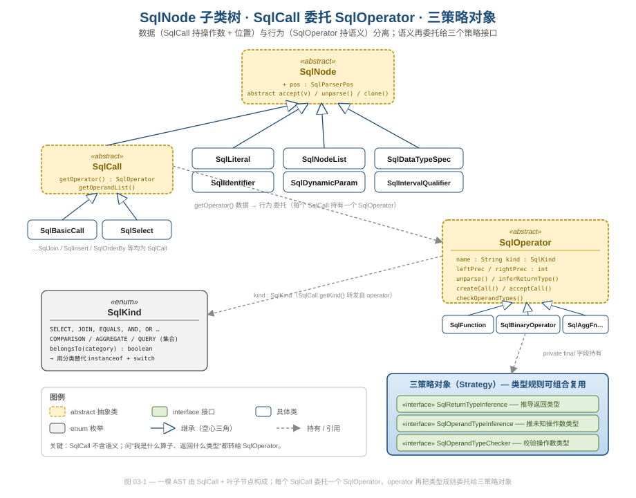
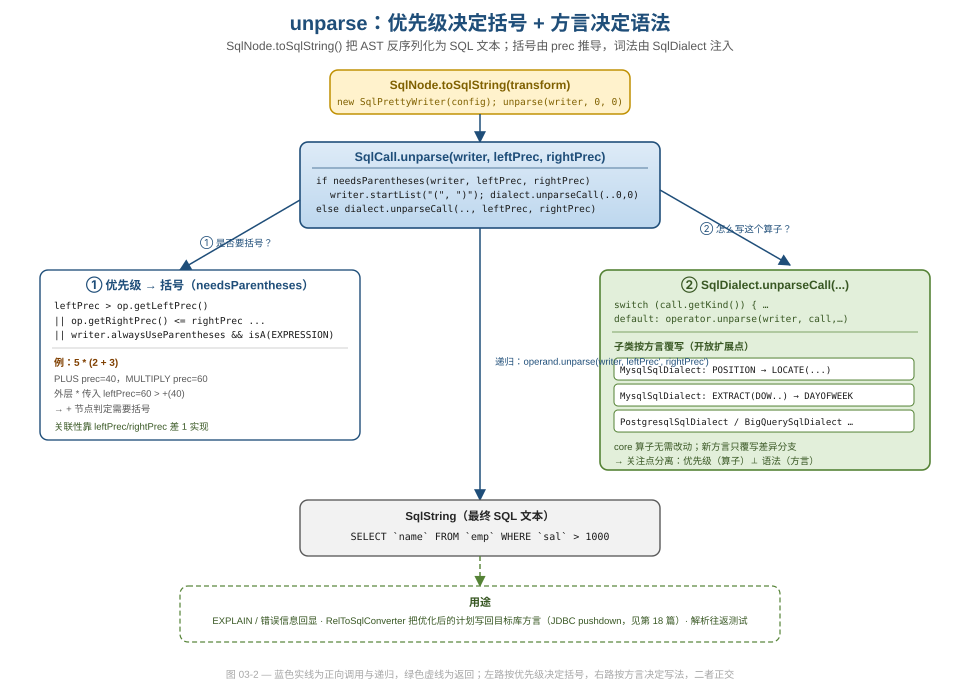
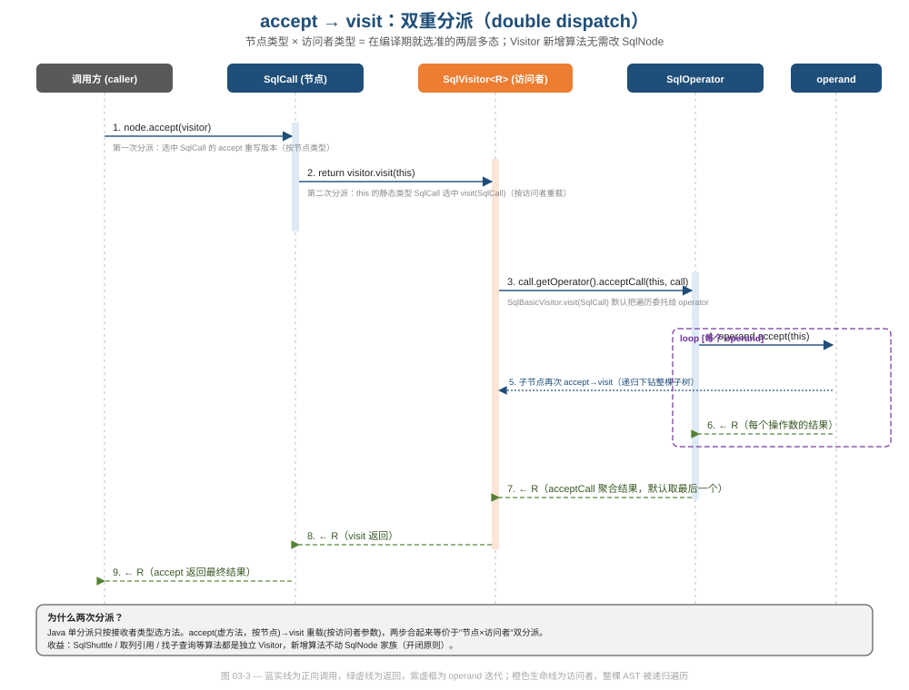

# 第 03 篇 · SqlNode AST：数据/行为分离

> 一棵 SQL 语法树有几百种节点形态、上千个算子、十几种方言，还要随时能反序列化回 SQL、被任意算法遍历。Calcite 用一组朴素到几乎"无聊"的面向对象手法把这件事压到了可控规模。本篇拆解 `SqlNode` 这一层的设计骨架：数据/行为分离、策略对象、分类枚举、Visitor 双重分派——看它好在哪、为什么这么设计、有什么坑。
> 基线 commit `111030383` · 前置阅读：[第 02 篇 · 为什么是四层 IR](02-ir-overview.md)

## TL;DR

- **数据/行为分离**：`SqlCall` 只存"操作数 + 源位置"这类**数据**，把"我是什么算子、返回什么类型、怎么打印"这类**行为**全部委托给它持有的 `SqlOperator`。一个算子单例服务于成千上万个 call 实例。
- **三策略对象**：`SqlOperator` 自己也不实现类型规则，而是把"返回类型推导 / 操作数类型推导 / 操作数类型校验"拆成三个策略接口的字段，按需组合复用——类型规则的实现细节归 [第 06 篇](06-type-system.md)，本篇只讲算子如何持有。
- **分类枚举 `SqlKind`**：把"这是不是一个比较 / 聚合 / 查询"做成枚举集合的 `belongsTo` 判断，系统性替代散落各处的 `instanceof + 强转`。
- **unparse**：AST 能反向打印成 SQL，**括号由优先级推导、语法由方言注入**，两条关注点正交。
- **Visitor 双重分派**：`accept(visitor) → visitor.visit(this)` 两步，等价于"节点类型 × 访问者类型"的双分派；遍历/改写算法以独立 Visitor 形式增量加入，不动 `SqlNode` 家族（开闭原则）。`SqlShuttle` 仅把泛型返回类型从 `Void` 换成 `SqlNode`，同一骨架即从只读遍历变为不可变改写。
- **专用比较与复制协议**：`equalsDeep(node, Litmus)` 绕开 `Object.equals`（不污染哈希语义、用 `Litmus` 把"不等时怎么办"参数化）；`clone(SqlParserPos)` 让复制顺带换源位置，绕开 `Object.clone` 的历史包袱。
- **坑**：`SqlCall` 提供了 `setOperand` 这一可变后门；`getOperandList` 因历史原因把"元素可空"的类型注解吞掉了；`unparse` 的优先级算法用"奇偶 +1"编码关联性，可读性差。

---

## 1. 一层 IR 的边界：SqlNode 是什么、不是什么

`SqlNode` 是解析阶段的产物，是一棵忠实于 SQL 书写形式的语法树（AST）。它**还没有类型、还没有解析名字**——那是 Validator（[第 07 篇](07-validator.md)）和 SqlToRel（[第 08 篇](08-sql-to-rel.md)）后续的工作。本篇只看这棵树本身的结构设计，不碰校验与降级。

打开 `core/src/main/java/org/apache/calcite/sql/SqlNode.java`，类声明只有一行值得记住的状态：

```java
public abstract class SqlNode implements Cloneable {
  protected final SqlParserPos pos;

  SqlNode(SqlParserPos pos) {
    this.pos = requireNonNull(pos, "pos");
  }
```

`SqlNode` 的全部"自有"字段就是一个 `pos`（源位置）。其余都是抽象方法——它定义的是**协议**而非实现：

```java
public abstract SqlNode clone(SqlParserPos pos);          // 复制
public abstract void unparse(SqlWriter w, int l, int r);   // 反序列化为 SQL
public abstract void validate(SqlValidator v, SqlValidatorScope s);
public abstract <R> R accept(SqlVisitor<R> visitor);       // Visitor 入口
public abstract boolean equalsDeep(@Nullable SqlNode n, Litmus l);
```

这套抽象方法清单本身就是一份"AST 节点必须能干什么"的契约：能复制、能打印、能校验、能被访问、能结构比较。下面几节逐个拆。

> **工程视角（关注点分离）**：`SqlNode` 把"位置信息"作为唯一的公共状态下沉到基类，是个小而精的决策。源位置是**所有**节点都需要、且语义无关的横切关注点（错误报告要用），放在基类避免每个子类各自实现；而真正承载语义的字段（操作数、操作符、字面量值）留给子类，基类不做任何假设。

`SqlNode` 的子类大致分两类（见图 03-1）：**叶子节点**（`SqlLiteral` 字面量、`SqlIdentifier` 标识符、`SqlDataTypeSpec` 类型说明、`SqlIntervalQualifier`、`SqlDynamicParam`）和**调用节点** `SqlCall`。`SqlNodeList`（节点列表）也是一种特殊节点。其中 `SqlCall` 是整个设计的核心。



如上图，左半是数据侧（`SqlNode` 家族），右半是行为侧（`SqlOperator` 家族 + 三策略接口）。两半之间只有一条 `getOperator()` 的弱引用。这条分界线就是本篇的主角。

---

## 2. 数据/行为分离：SqlCall 存数据，SqlOperator 存行为

SQL 里几乎所有"非叶子"结构都是一次"算子调用"：`a + b` 是调用 `+`，`COUNT(*)` 是调用 `COUNT`，甚至 `SELECT ... FROM ...` 是调用 `SqlSelectOperator`。`SqlCall` 的 Javadoc 直接点明了这一点：

> 操作符可以描述任何语法结构，所以实践中，SQL 语法树里**每一个非叶子节点都是某种 SqlCall**。

`SqlCall`（`core/src/main/java/org/apache/calcite/sql/SqlCall.java`）的接口出奇地小，核心只有两个抽象方法：

```java
@Pure
public abstract SqlOperator getOperator();

public abstract List</*Nullable*/ SqlNode> getOperandList();
```

注意这里的设计选择：`SqlCall` 自己**不知道**它是什么算子、有几个操作数的语义、返回什么类型。它只知道"我有一串操作数（数据）"和"我背后挂着一个 operator（指针）"。所有语义问题都转手：

```java
@Override public SqlKind getKind() {
  return getOperator().getKind();          // 我是什么 → 问 operator
}

@Override public void validate(SqlValidator v, SqlValidatorScope s) {
  v.validateCall(this, scope);             // 怎么校验 → 走 operator 那套
}
```

具体的数据载体是 `SqlBasicCall`（`core/src/main/java/org/apache/calcite/sql/SqlBasicCall.java`），它的字段一目了然：

```java
public class SqlBasicCall extends SqlCall {
  private SqlOperator operator;
  private List<@Nullable SqlNode> operandList;
  // ...
  @Override public SqlOperator getOperator() { return operator; }
  @Override public List<SqlNode> getOperandList() { return operandList; }
}
```

行为侧的 `SqlOperator`（`core/src/main/java/org/apache/calcite/sql/SqlOperator.java`）则把语义全揽下来。它的核心字段是不变的元数据：

```java
private final String name;          // "OVERLAY" / "+" / "TRIM"
public  final SqlKind kind;         // 分类枚举（见 §4）
private final int leftPrec;         // 左结合优先级（见 §5）
private final int rightPrec;        // 右结合优先级
```

**这就是经典的数据/行为分离（也可视作 Flyweight 的一种）。** 关键收益在于：算子是**单例**。整张 `SqlStdOperatorTable` 里 `PLUS`、`MULTIPLY`、`COUNT` 都是一份静态常量：

```java
// core/src/main/java/org/apache/calcite/sql/fun/SqlStdOperatorTable.java
public static final SqlBinaryOperator PLUS =
    new SqlMonotonicBinaryOperator("+", SqlKind.PLUS, 40, true,
        ReturnTypes.NULLABLE_SUM, InferTypes.FIRST_KNOWN,
        OperandTypes.PLUS_OPERATOR);

public static final SqlBinaryOperator MULTIPLY =
    new SqlMonotonicBinaryOperator("*", SqlKind.TIMES, 60, true,
        ReturnTypes.PRODUCT_NULLABLE, InferTypes.FIRST_KNOWN,
        OperandTypes.MULTIPLY_OPERATOR);
```

无论一条 SQL 里出现多少个 `+`，AST 里有多少个 call 节点，它们都**共享同一个 `PLUS` 单例**。每个 call 只携带"两个操作数 + 位置"这点轻量数据，重量级的语义（类型规则、打印规则、优先级）集中在一份 operator 上。

> **设计与代码质量视角（好在哪）**：把"高频实例化的轻数据"和"低频、可共享的重行为"切开，是控制内存与认知复杂度的杠杆。如果反过来——让每个 call 节点各自携带一份类型推导逻辑——既浪费内存，又会让"修改 `+` 的类型规则"变成要改所有实例的噩梦。现在改 `PLUS` 的语义只需改一处单例。

> **坑（诚实写）**：`SqlCall` 留了一个可变后门：
> ```java
> public void setOperand(int i, @Nullable SqlNode operand) {
>   throw new UnsupportedOperationException();
> }
> ```
> 默认抛异常，但 `SqlBasicCall` 覆写实现了它。注释直言"允许 Validator 做一些重写；**请谨慎使用**（use sparingly）"。也就是说，这棵"看似不可变"的 AST 在校验阶段会被原地改写（例如算子重解析、`ROW` 重写）。相比下游 `RelNode` 的严格不可变契约（[第 04 篇](04-relnode.md)），`SqlNode` 层的可变性是一处真实的权衡：换取校验期改写的便利，代价是失去"AST 一旦建好就不变"的强保证。读源码时若发现 `((SqlBasicCall) call).setOperator(...)`（如 `SqlOperator#deriveType` 中），不要惊讶。

---

## 3. 三策略对象：SqlOperator 也不亲自实现类型规则

`SqlOperator` 揽下了语义，但它没有把类型推导写成一堆 `if/else` 或要求每个算子子类化。它再做一次委托——把类型相关的三件事拆成三个**策略接口**的字段：

```java
// SqlOperator.java
/** Used to infer the return type of a call to this operator. */
private final @Nullable SqlReturnTypeInference returnTypeInference;

/** Used to infer types of unknown operands. */
private final @Nullable SqlOperandTypeInference operandTypeInference;

/** Used to validate operand types. */
private final @Nullable SqlOperandTypeChecker operandTypeChecker;
```

- **`SqlReturnTypeInference`**：给定操作数类型，推出返回类型（`SUM(int)→bigint`、`a = b → boolean`）。
- **`SqlOperandTypeInference`**：反向推导——给定期望的返回类型，回填未知操作数（如动态参数 `?`）的类型。
- **`SqlOperandTypeChecker`**：校验实参类型是否合法（`SUBSTRING` 要 `(string, int, int)`）。

回看上一节 `PLUS` 的构造：`ReturnTypes.NULLABLE_SUM` / `InferTypes.FIRST_KNOWN` / `OperandTypes.PLUS_OPERATOR` 正好对应这三个槽位。`SqlOperator` 在推导返回类型时不写任何业务逻辑，只是转发给策略对象：

```java
public RelDataType inferReturnType(SqlOperatorBinding opBinding) {
  if (returnTypeInference != null) {
    RelDataType returnType = returnTypeInference.inferReturnType(opBinding);
    if (returnType == null) {
      throw opBinding.newError(/* cannotInferReturnType */);
    }
    // ...
    return returnType;
  }
  // 没配策略 → 子类必须覆写本方法
  throw Util.needToImplement(this);
}
```

构造器里还有一个值得注意的小默认：如果只给了 `operandTypeChecker` 而没给 `operandTypeInference`，会自动从 checker 派生一个：

```java
if (operandTypeInference == null && operandTypeChecker != null) {
  operandTypeInference = operandTypeChecker.typeInference();
}
```

> **设计模式视角（为什么这么设计）**：这是教科书式的 **Strategy 模式**，而且是"组合优于继承"的活样本。SQL 标准函数有几百个，类型规则却高度重复（无数函数都是"返回 BOOLEAN、可空"或"返回首参类型"）。如果每个算子用子类化表达类型规则，会爆炸出几百个只为改一行类型逻辑的子类；用三个可复用的策略对象自由组合，`ReturnTypes`/`OperandTypes`/`InferTypes` 这几个静态工厂提供积木，算子在构造时"配置"而非"继承"。这三个策略的**实现细节**（`chain`/`cascade` 组合器、Flyweight 类型缓存）是 [第 06 篇](06-type-system.md) 的主场，本篇到此为止。

---

## 4. SqlKind：用分类枚举系统性消灭 instanceof

判断"这个节点是不是一次相等比较 / 是不是聚合 / 是不是查询"是优化器和校验器里极高频的操作。朴素写法是 `node instanceof SqlBasicCall && ((SqlBasicCall) node).getOperator() == EQUALS`——既啰嗦又脆弱。Calcite 用 `SqlKind`（`core/src/main/java/org/apache/calcite/sql/SqlKind.java`）这一枚举把它收编了。

`SqlKind` 的 Javadoc 把设计意图写得很清楚（罕见地坦诚）：

> 只有常用节点才有自己的 kind，其余都是 `OTHER`……如果我们用 Scala，`SqlOperator` 会是 case class，就不需要 `SqlKind` 了。但我们不是。

也就是说 `SqlKind` 是在 Java 缺少模式匹配（pattern matching）背景下的务实补偿。它的两大用法：

**用法一：`switch` 替代 `instanceof` 链。** 因为 `SqlNode.getKind()` 是虚方法，可以直接对节点 `switch`：

```java
switch (exp.getKind()) {
case EQUALS:     ...
case NOT_EQUALS: ...
default: throw new AssertionError("unexpected");
}
```

**用法二：分类集合 + `belongsTo`。** `SqlKind` 预定义了一批**枚举集合**表示"类别"：

```java
public static final Set<SqlKind> COMPARISON =
    EnumSet.of(IN, NOT_IN, EQUALS, NOT_EQUALS,
        LESS_THAN, GREATER_THAN,
        GREATER_THAN_OR_EQUAL, LESS_THAN_OR_EQUAL);

public static final EnumSet<SqlKind> AGGREGATE =
    EnumSet.of(COUNT, SUM, SUM0, MIN, MAX, LEAD, LAG, FIRST_VALUE, /* … */);

public static final EnumSet<SqlKind> QUERY =
    EnumSet.of(SELECT, UNION, INTERSECT, EXCEPT, VALUES, WITH, ORDER_BY, /* … */);
```

判断归属只是一次集合 `contains`：

```java
public final boolean belongsTo(Collection<SqlKind> category) {
  return category.contains(this);
}
```

而 `SqlNode.isA(...)` 就是它的语法糖：

```java
public final boolean isA(Set<SqlKind> category) {
  return getKind().belongsTo(category);   // node.isA(SqlKind.QUERY)
}
```

于是"是不是一个比较算子"被写成 `node.isA(SqlKind.COMPARISON)`——一次 `EnumSet.contains`，在 JVM 里近乎位运算，且语义自解释。

> **设计与代码质量视角（可借鉴）**：这是把"类型判断"从**实现类的身份**（脆弱、随重构漂移）解耦到**稳定的语义标签**（`SqlKind`）的范例。一个新算子只要声明自己的 `kind`，就自动获得"被归类、被 switch、被 isA 命中"的能力，所有遍历该类别的代码无需改动。这种"用数据驱动分类、用集合表达类别"的手法，在你自己的代码里凡是出现"一长串 `instanceof` 判断某种属性"时都值得借鉴。
>
> 注意 `SqlOperator.kind` 与实际类型可以**不一致**：源码注释明说"name 可以和 kind 不匹配"。`kind` 表达的是语义类别而非 Java 类身份，这正是它比 `instanceof` 更灵活的地方——例如多个方言专属的 `+` 算子（`SqlBinaryOperator` 实例）可以共享 `SqlKind.PLUS`，归类逻辑一处命中。

---

## 5. unparse：括号靠优先级，语法靠方言

AST 不仅要能被解析**进来**，还要能打印**出去**——`EXPLAIN`、错误信息回显、以及把优化后的计划改写回目标库 SQL（JDBC pushdown，见 [第 18 篇](18-adapters.md)）都依赖它。这个方向叫 `unparse`。入口在 `SqlNode.toSqlString`：

```java
public SqlString toSqlString(UnaryOperator<SqlWriterConfig> transform) {
  final SqlWriterConfig config = transform.apply(SqlPrettyWriter.config());
  SqlPrettyWriter writer = new SqlPrettyWriter(config);
  unparse(writer, 0, 0);
  return writer.toSqlString();
}
```

难点是**括号**。`a + b * c` 不需要括号，但 `(a + b) * c` 需要。Calcite 没有维护一棵"显式括号节点"的树（那样会污染 AST），而是在打印时**按算子优先级动态判断**。看 `SqlCall.unparse`：

```java
@Override public void unparse(SqlWriter writer, int leftPrec, int rightPrec) {
  final SqlDialect dialect = writer.getDialect();
  if (needsParentheses(writer, leftPrec, rightPrec)) {
    final SqlWriter.Frame frame = writer.startList("(", ")");
    dialect.unparseCall(writer, this, 0, 0);     // 包了括号 → 内部从 0 优先级重新打
    writer.endList(frame);
  } else {
    dialect.unparseCall(writer, this, leftPrec, rightPrec);
  }
}
```

`needsParentheses` 把"父算子的优先级"和"本算子的优先级"对比：

```java
private boolean needsParentheses(SqlWriter writer, int leftPrec, int rightPrec) {
  if (getKind() == SqlKind.SET_SEMANTICS_TABLE) {
    return false;
  }
  final SqlOperator operator = getOperator();
  return leftPrec > operator.getLeftPrec()
      || (operator.getRightPrec() <= rightPrec && (rightPrec != 0))
      || writer.isAlwaysUseParentheses() && isA(SqlKind.EXPRESSION)
      || (operator.getRightPrec() <= rightPrec + 1 && isA(SqlKind.COMPARISON));
}
```

回顾 §2 里的常量：`PLUS` 优先级 `40`，`MULTIPLY` 优先级 `60`。当打印 `5 * (2 + 3)` 时，外层 `*` 在递归打印左/右操作数时会把自己的优先级 `60` 作为 `leftPrec` 传下去；轮到 `+` 节点，`leftPrec(60) > operator.getLeftPrec()(≈40)` 成立，于是判定"需要括号"。结合性（左结合 vs 右结合）则通过 `leftPrec`/`rightPrec` 相差 1 来编码——这也是 `SqlOperator` 那对静态辅助方法在做的事：

```java
protected static int leftPrec(int prec, boolean leftAssoc) {
  assert (prec % 2) == 0;
  if (!leftAssoc) { ++prec; }
  return prec;
}
protected static int rightPrec(int prec, boolean leftAssoc) {
  assert (prec % 2) == 0;
  if (leftAssoc) { ++prec; }
  return prec;
}
```

约定所有声明优先级是偶数，再按结合性给其中一侧 `+1`，让左右优先级产生 1 的差，从而在 `needsParentheses` 里区分 `a - b - c` 与 `a - (b - c)`。

第二条正交的关注点是**方言**。注意上面 `unparse` 真正打印时调用的是 `dialect.unparseCall(...)`，而不是直接 `operator.unparse(...)`。`SqlDialect.unparseCall`（`core/src/main/java/org/apache/calcite/sql/SqlDialect.java`）的默认实现只是转发：

```java
public void unparseCall(SqlWriter writer, SqlCall call, int leftPrec, int rightPrec) {
  SqlOperator operator = call.getOperator();
  switch (call.getKind()) {
  case ROW:
    // 若方言不允许 ROW 关键字，换一个不打印 ROW 的内部算子 …
  default:
    operator.unparse(writer, call, leftPrec, rightPrec);
  }
}
```

而每个方言子类可以覆写它，把特定算子改写成本方言的写法。例如 `MysqlSqlDialect`：

```java
// core/src/main/java/org/apache/calcite/sql/dialect/MysqlSqlDialect.java
@Override public void unparseCall(SqlWriter writer, SqlCall call,
    int leftPrec, int rightPrec) {
  switch (call.getKind()) {
  case POSITION:
    final SqlWriter.Frame f = writer.startFunCall("LOCATE");   // POSITION → LOCATE
    // ...
  case EXTRACT:
    // EXTRACT(DOW FROM x) → DAYOFWEEK(x) …
  default:
    super.unparseCall(writer, call, leftPrec, rightPrec);       // 其余交回基类
  }
}
```



如上图，`unparse` 把两个本可纠缠的问题拆成了两条正交的轴：**纵向（左路）是"要不要括号"，由算子的优先级数据决定；横向（右路）是"这个算子怎么写"，由方言决定。** 二者互不干扰。

> **数据工程视角（可借鉴）**：方言定制点 `unparseCall` 是 Calcite 联邦查询能力的关键工程支点。`RelToSqlConverter`（见 [第 18 篇](18-adapters.md)）把优化后的关系代数翻译回 SQL 文本下推给外部库时，正是靠每个 `SqlDialect` 子类覆写这些方法来吸收方言差异。新增一种方言只需写一个 `SqlDialect` 子类、覆写差异分支，**完全不动 core 里的算子定义**——这正是开闭原则在数据工程场景的兑现。

> **坑（诚实写）**：优先级用"偶数基准 + 奇偶 +1 编码结合性"是个相当隐晦的技巧，`assert (prec % 2) == 0` 是它的隐性前提。新增算子时若把优先级写成奇数，断言会在开发期炸掉，但生产期（assert 默认关闭）可能静默产生错误的括号。`needsParentheses` 里那串四段 `||` 条件（尤其对 `COMPARISON` 多一个 `rightPrec + 1` 的特判）也几乎没有注释，属于"读懂要花时间、改动要小心"的区域。

---

## 6. Visitor 双重分派：算法与数据解耦

最后一块拼图是遍历。一棵 AST 要被无数种算法处理：找出所有列引用、收集子查询、做结构改写（`SqlShuttle`）……如果把每种算法都写成 `SqlNode` 的一个方法，节点类会无限膨胀，且每加一种算法要改所有节点。Calcite 用 **Visitor 模式**把"算法"从"数据结构"里拆出来。

接口 `SqlVisitor<R>`（`core/src/main/java/org/apache/calcite/sql/util/SqlVisitor.java`）为每种节点形态声明一个重载的 `visit`：

```java
public interface SqlVisitor<R> {
  R visit(SqlLiteral literal);
  R visit(SqlCall call);
  R visit(SqlNodeList nodeList);
  R visit(SqlIdentifier id);
  R visit(SqlDataTypeSpec type);
  R visit(SqlDynamicParam param);
  R visit(SqlIntervalQualifier intervalQualifier);
}
```

每个节点的 `accept` 负责"把自己交回给访问者的正确重载"。这就是**双重分派**的两步——以 `SqlCall` 和 `SqlLiteral` 为例：

```java
// SqlCall.java
@Override public <R> R accept(SqlVisitor<R> visitor) {
  return visitor.visit(this);     // this 的静态类型是 SqlCall → 命中 visit(SqlCall)
}

// SqlLiteral.java
@Override public <R> R accept(SqlVisitor<R> visitor) {
  return visitor.visit(this);     // this 的静态类型是 SqlLiteral → 命中 visit(SqlLiteral)
}
```

两行代码长得一模一样，但因为它们处在不同的类里，`this` 的**静态类型**不同，编译器为各自选中了不同的 `visit` 重载。配合 `accept` 自身是虚方法（运行期按节点真实类型分派），整体效果是：

1. **第一次分派**（动态、按节点类型）：`node.accept(v)` 落到 `SqlCall.accept` 还是 `SqlLiteral.accept`。
2. **第二次分派**（静态、按访问者重载）：`v.visit(this)` 落到 `visit(SqlCall)` 还是 `visit(SqlLiteral)`。

两步合起来等价于"节点类型 × 访问者类型"的双分派——这正是 Java 单分派语言模拟 multiple dispatch 的标准手法。

`SqlBasicVisitor<R>`（`core/src/main/java/org/apache/calcite/sql/util/SqlBasicVisitor.java`）提供一个"什么都不做"的基类，遍历下钻的逻辑藏在 `visit(SqlCall)` 里——它把对子节点的遍历委托给了 operator：

```java
public class SqlBasicVisitor<@Nullable R> implements SqlVisitor<R> {
  @Override public R visit(SqlCall call) {
    return call.getOperator().acceptCall(this, call);   // 委托回 operator 去遍历操作数
  }
  @Override public R visit(SqlLiteral literal) { return null; }   // 叶子默认啥也不做
  // ...
}
```

而 `SqlOperator.acceptCall` 负责逐个操作数递归：

```java
// SqlOperator.java
public <R> @Nullable R acceptCall(SqlVisitor<R> visitor, SqlCall call) {
  for (SqlNode operand : call.getOperandList()) {
    if (operand == null) { continue; }
    operand.accept(visitor);          // 子节点再次 accept → visit，递归下钻
  }
  return null;
}
```



如上图的时序，一次 `accept` 引发"节点 → 访问者 → operator → 各操作数"的递归链，整棵子树被遍历。子类只需覆写感兴趣的 `visit` 重载（比如只想统计列引用，就覆写 `visit(SqlIdentifier)`），其余继承默认行为。

> **设计模式视角（好在哪 / 注意 Visitor 的固有代价）**：Visitor 的核心收益是**开闭**——`SqlShuttle`（改写型 Visitor）、找子查询、收集列引用等算法各自是独立的 `SqlVisitor` 实现，新增一种算法**完全不动** `SqlNode` 家族。代价是 Visitor 的经典短板：**新增一种节点类型**要往 `SqlVisitor` 接口添一个 `visit` 重载、并改所有实现类。Calcite 接受这个权衡，因为 SQL 的节点形态相对稳定（叶子就那几种、其余皆 `SqlCall`），而"要在 AST 上跑的算法"才是真正会持续增长的维度——把易变的维度（算法）做成可插拔，把稳定的维度（节点种类）固定下来，这就是 Visitor 适用与否的判断标准。
>
> Calcite 在三层 IR 各有一套对应的访问者：本层 `SqlVisitor`/`SqlShuttle`、`RelNode` 层 `RelShuttle`（[第 04 篇](04-relnode.md)）、`RexNode` 层 `RexShuttle`（[第 05 篇](05-rexnode.md)）、`linq4j` 层 `tree.Shuttle`（[第 15 篇](15-linq4j.md)）。"三层 Visitor 的横向对照"归 [第 19 篇 · 设计模式全景](19-design-patterns.md) 统一讲，本篇只讲 SqlVisitor 这一层。

值得单独点一下"改写型 Visitor"`SqlShuttle`（`core/src/main/java/org/apache/calcite/sql/util/SqlShuttle.java`）。它的类声明就把"返回类型"这一槽位用足了：

```java
public class SqlShuttle extends SqlBasicVisitor<@Nullable SqlNode> {
  @Override public @Nullable SqlNode visit(SqlLiteral literal) { return literal; }
  @Override public @Nullable SqlNode visit(SqlIdentifier id)    { return id; }
  // ...
  @Override public @Nullable SqlNode visit(final SqlCall call)  { /* 重建子节点 */ }
}
```

`SqlVisitor<R>` 的泛型返回类型 `R` 在普通遍历里常被设成 `Void`（只为副作用），而 `SqlShuttle` 把 `R` 取成 `SqlNode`——于是"访问"变成了"返回一个（可能被替换过的）节点"，整棵树的不可变改写就此成立：访问到 `SqlCall` 时，它先用一个 `ArgHandler` 逐个 `accept` 子节点拿到新子节点，若有变化就重建一个新 call，否则原样返回。这正是 §6 里 `SqlBasicVisitor.ArgHandler` 那个看似多余的抽象的用武之地——它把"如何收集并组合子节点的访问结果"也变成了可定制的策略。

> **设计与代码质量视角（可借鉴）**：同一个 Visitor 骨架，靠把泛型返回类型从 `Void` 换成 `SqlNode`，就从"只读遍历"切换成"不可变改写"，无需另起一套继承体系。这是泛型 + Visitor 协同的高杠杆点：返回类型即语义。

---

## 7. SqlParserPos：点 + 范围的双精度源位置

回到 §1 提到的那个唯一公共字段 `pos`。它的类型 `SqlParserPos`（`core/src/main/java/org/apache/calcite/sql/parser/SqlParserPos.java`）不只是"行号 + 列号"，而是一个**范围**：

```java
private final int lineNumber;
private final int columnNumber;
private final int endLineNumber;
private final int endColumnNumber;
```

最常用的构造器把"点"展开成"零宽范围"：

```java
public SqlParserPos(int lineNumber, int columnNumber) {
  this(lineNumber, columnNumber, lineNumber, columnNumber);   // 起点=终点
}
```

而 `plus` 能把多个位置合并成一个覆盖区间：

```java
public SqlParserPos plus(SqlParserPos pos) {
  return new SqlParserPos(getLineNum(), getColumnNum(),
      pos.getEndLineNum(), pos.getEndColumnNum());
}
```

这正是 `SqlOperator.createCall` 的 Javadoc 所说的"结果 call 的位置是 `pos` 与所有操作数位置的并集"——一个 `a + b` 表达式的位置覆盖从 `a` 的起点到 `b` 的终点。

> **软件工程视角（可借鉴）**：把位置建模为**区间而非点**，是为高质量错误诊断买的一份保险。校验器报"第 3 行第 12 列类型不匹配"只需点，但 IDE 要给一整个子表达式画波浪线、或精确高亮"`e.sal > 1000`"这一段，就需要起止范围。`ZERO` 常量（`new SqlParserPos(0, 0)`）则给"非源自真实 SQL 文本"的合成节点（如优化器生成的节点）一个统一的占位位置，避免到处判 null。这种"为诊断信息预留结构、并为合成场景准备零值"的小设计，是成熟编译器/解析器的共性。

---

## 8. equalsDeep 与 clone：结构等价与位置无关的复制协议

`SqlNode` 还定义了两个容易被忽略、却体现 AST 设计取舍的协议：**结构等价**与**复制**。

先看结构等价 `equalsDeep`。注意 Calcite 没有覆写 `Object.equals`，而是另起一个 `equalsDeep(SqlNode, Litmus)`：

```java
// SqlNode.java
public abstract boolean equalsDeep(@Nullable SqlNode node, Litmus litmus);
```

为什么不直接用 `equals`？因为"两个 AST 节点相等"在不同场景下含义不同：有时要逐字段深比较，有时（如放进 `HashSet`）只想要引用相等。把深比较显式命名为 `equalsDeep`，避免了与集合框架对 `equals/hashCode` 的隐式契约冲突。它的实现以 `SqlCall` 为例：

```java
// SqlCall.java
@Override public boolean equalsDeep(@Nullable SqlNode node, Litmus litmus) {
  if (node == this) { return true; }
  if (!(node instanceof SqlCall)) { return litmus.fail("{} != {}", this, node); }
  SqlCall that = (SqlCall) node;
  // 按名字（不区分大小写）比较算子，因为此时算子可能还没解析完成
  if (!this.getOperator().getName().equalsIgnoreCase(that.getOperator().getName())) {
    return litmus.fail("{} != {}", this, node);
  }
  // ... 比较 functionQuantifier 与操作数列表（递归 equalDeep）
  return equalDeep(this.getOperandList(), that.getOperandList(), litmus);
}
```

两个细节值得品：

- **算子按名字而非身份比较**，注释解释"因为它们可能还没被解析（resolve）"——AST 早期算子可能是个未绑定的占位符，用身份比较会误判。这再次呼应 §4 里"`kind`/算子身份不是稳定锚点、语义标签才是"的思路。
- **`Litmus` 参数**是 Calcite 一个小而美的工具（详见 [第 20 篇](20-quality-and-modules.md)）。它把"不相等时怎么办"参数化：`Litmus.IGNORE` 返回 `false`，`Litmus.THROW` 抛出带 `{}` 占位详情的断言错误。同一份比较逻辑既能做安静的判断、又能做带详细 diff 的断言，测试里尤其好用。

再看复制协议 `clone`。`SqlNode` 实现了 `Cloneable`，但把 JDK 的 `Object.clone()` 标了 `@Deprecated`，推荐用静态工具方法：

```java
// SqlNode.java
/** Clones a SqlNode with a different position. */
public abstract SqlNode clone(SqlParserPos pos);

@SuppressWarnings("AmbiguousMethodReference")
public static <E extends SqlNode> E clone(E e) {
  return (E) e.clone(e.pos);    // 保留原位置
}
```

关键设计是：**复制时位置是一个显式参数**。`clone(SqlParserPos)` 让你在复制一棵子树时顺便替换它的源位置——这在"把同一个表达式模板实例化到 SQL 不同位置"（如展开宏、重写算子）时很自然。`SqlCall.clone` 干脆借道算子重建：

```java
// SqlCall.java
@Override public SqlNode clone(SqlParserPos pos) {
  return getOperator().createCall(getFunctionQuantifier(), pos, getOperandList());
}
```

它没有逐字段拷贝，而是"用同一个算子、同一批操作数、新位置"重新 `createCall`——又一次把"怎么构造一个 call"的知识收口到 `SqlOperator`。

> **软件工程视角（好在哪）**：`equalsDeep` 与 `clone` 都刻意**绕开**了 JDK 的 `Object.equals`/`Object.clone` 默认契约。前者避免污染哈希语义，后者避免 `Object.clone` "浅拷贝 + 异常签名"的历史包袱（基类注释原话："this method brings along too much baggage from early versions of Java"）。这是成熟库面对 JDK 历史缺陷时的常见姿态：不硬蹭语言内置协议，而是定义语义清晰的专用方法。代价是调用方要记得用 `SqlNode.clone(x)` 而非 `x.clone()`——一处需要靠 API 文档与代码评审守住的约定。

---

## 设计模式与工程小结

| 机制 | 模式 / 手法 | 三问落点 | 收益 / 代价 |
|---|---|---|---|
| `SqlCall` 持操作数、委托 `SqlOperator` | 数据/行为分离（含 Flyweight 味道） | 软件工程：关注点分离 + 内存 | 算子单例服务海量 call；改语义只改一处 / `setOperand` 可变后门 |
| `SqlOperator` 持三策略字段 | Strategy（组合优于继承） | 设计质量：可扩展、避免子类爆炸 | 类型规则积木式复用 / 三个槽位需正确配齐 |
| `SqlKind` 分类集合 + `belongsTo` | 数据驱动的类型分类 | 设计质量：消灭 instanceof | `isA` 自解释、近位运算；新算子自动归类 / kind 可与类身份不符 |
| `unparse` 优先级括号 | 上下文传播（prec 下递） | 设计质量：AST 不存显式括号 | 树更干净 / 奇偶编码结合性晦涩，assert 依赖 |
| `SqlDialect.unparseCall` | Template Method + 覆写扩展点 | 数据工程：方言/联邦 | 新方言不动 core / 覆写分支需谨慎 fall through |
| `accept → visit` | Visitor 双重分派 | 设计质量：算法与数据解耦 | 新算法不动节点（开闭）/ 新节点要改 Visitor 接口 |
| `SqlShuttle`（R=SqlNode） | Visitor + 泛型返回类型即语义 | 设计质量：只读↔改写复用骨架 | 一套继承体系两用 / 改写需正确重建子树 |
| `equalsDeep(node, Litmus)` | 专用比较 + 验证策略参数化 | 软件工程：不污染哈希语义 | 同逻辑既判断又断言 / 不能直接用 `equals` |
| `clone(SqlParserPos)` | 位置可替换的复制协议 | 软件工程：绕开 Object.clone 包袱 | 复制即换位置 / 须用 `SqlNode.clone(x)` |
| `SqlParserPos` 点+范围 | 区间建模 + 零值占位 | 软件工程：可诊断性 | 精确高亮子表达式 / 合成节点用 ZERO |

---

## 对照阅读建议（动手）

- **断点**：`core/src/main/java/org/apache/calcite/sql/SqlCall.java` → `SqlCall#unparse`
  - **观察**：对 `5 * (2 + 3)` 这类表达式，在 `needsParentheses` 内打断点，看 `leftPrec` / `operator.getLeftPrec()` 的取值如何让 `+` 节点判定需要括号；对比 `2 + 3 * 5` 时 `+` 不加括号。
  - **运行**：用 `SqlParser.create("VALUES (5 * (2 + 3))").parseExpression()` 拿到 `SqlNode`，再调 `node.toSqlString(c -> c.withDialect(AnsiSqlDialect.DEFAULT))`。

- **断点**：`core/src/main/java/org/apache/calcite/sql/SqlOperator.java` → `SqlOperator#inferReturnType`
  - **观察**：`returnTypeInference` 字段非空时如何把推导转发给策略对象；对 `PLUS` 看它指向 `ReturnTypes.NULLABLE_SUM`。验证"算子不亲自实现类型规则"。
  - **运行**：参照 `core/src/test/java/org/apache/calcite/sql/test/` 下的操作符测试，或在 Validator 测试里对一个算术表达式求值类型。

- **断点**：`core/src/main/java/org/apache/calcite/sql/util/SqlBasicVisitor.java` → `SqlBasicVisitor#visit(SqlCall)`
  - **观察**：写一个匿名 `SqlBasicVisitor<Void>` 只覆写 `visit(SqlIdentifier)` 打印标识符名，对一棵含 JOIN/WHERE 的 `SqlSelect` 调 `select.accept(visitor)`，跟踪 `accept → visit → acceptCall → operand.accept` 的递归栈，确认双重分派路径。

- **断点**：`core/src/main/java/org/apache/calcite/sql/dialect/MysqlSqlDialect.java` → `MysqlSqlDialect#unparseCall`
  - **观察**：对含 `POSITION(...)` 的表达式，在 `case POSITION` 处看它如何改写成 `LOCATE`；与 ANSI 方言下的输出对比，体会"方言只覆写差异、其余 `super` 兜底"。

- **断点**：`core/src/main/java/org/apache/calcite/sql/SqlCall.java` → `SqlCall#equalsDeep`
  - **观察**：分别用 `Litmus.IGNORE` 和 `Litmus.THROW` 比较 `1 + 2` 与 `(1 + 2)`（应相等）、`1 + 2 + 3` 与 `1 + (2 + 3)`（应不等，左结合）；看算子按名字比较、操作数递归 `equalDeep` 的过程，以及 `Litmus.THROW` 如何产出带 `{}` 详情的失败信息。

---

## 延伸阅读

- 系列内：
  - [第 02 篇 · 为什么是四层 IR](02-ir-overview.md)——理解 `SqlNode` 在四层降级中的位置与"为什么分层"。
  - [第 06 篇 · 类型系统：Flyweight + 策略](06-type-system.md)——本篇略过的三策略对象（`ReturnTypes`/`OperandTypes`/`InferTypes`）的实现细节与组合器。
  - [第 07 篇 · Validator：Scope/Namespace 双抽象](07-validator.md)——`SqlNode.validate` 之后发生了什么。
  - [第 08 篇 · SqlToRel：Blackboard + Convertlet](08-sql-to-rel.md)——`SqlNode` 如何降级为 `RelNode`。
  - [第 18 篇 · Adapter 生态对比](18-adapters.md)——`SqlDialect.unparseCall` + `RelToSqlConverter` 在 JDBC pushdown 中的角色。
  - [第 19 篇 · 设计模式全景](19-design-patterns.md)——三层 Visitor/Shuttle 的横向对照与模式归纳。
- 官方文档：`site/_docs/howto.md`（开发指南）、`site/_docs/adapter.md`（方言与 adapter）。
- 入门教材：[../../calcite-guide/README.md](../../calcite-guide/README.md)（第 1 卷，查询流程叙事视角）。
