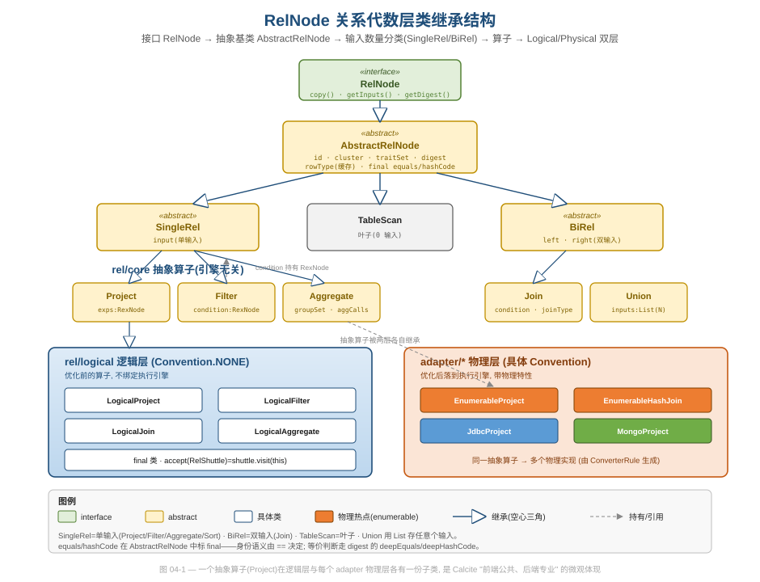
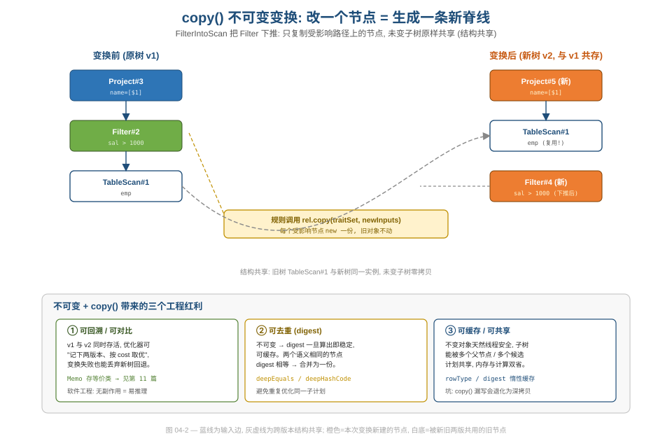
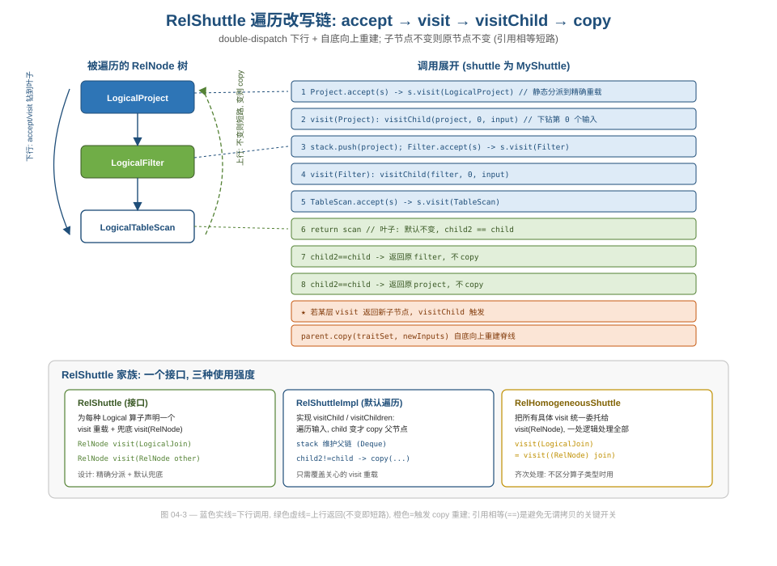

# 第 04 篇 · RelNode 关系代数层：不可变 + copy() + digest

> 一句话导语：`RelNode` 是 Calcite 的"逻辑/物理计划"节点。它的设计有三件事值得反复品味——**强制不可变**、**用 `copy()` 协议表达"变更即新建"**、**用 `digest` 把"结构等价"变成可哈希的一等公民**。本篇讲这三件事好在哪、怎么协同支撑起整个优化器。
> 基线 commit `111030383` · 前置阅读：[第 02 篇 · 四层 IR 总论](02-ir-overview.md)

## TL;DR

- `RelNode`（接口）→ `AbstractRelNode`（抽象基类）→ 按输入数量分类的 `SingleRel`/`BiRel` → 各算子（`Project`/`Filter`/`Join`/`Aggregate`…）→ `Logical*`/`Physical*` 双层实现。
- `AbstractRelNode` 把 `equals`/`hashCode` 声明为 **`final`**，**故意禁止**子类重定义身份语义——身份归 `==`，等价归 `digest`。这是一个极有主见的设计决定。
- `copy(traitSet, inputs)` 是不可变世界里的"变更协议"：要改 trait 或输入，就返回一个新节点，原节点保留。
- `digest`（`RelDigest`）把"两个 `RelNode` 结构上等价"做成可哈希、可比较的对象，是 Volcano memo 去重的基石（机制详见[第 11 篇](11-volcano.md)）。
- `RelShuttle`（关系遍历）与 `accept(RexShuttle)`（行表达式遍历）配合**引用相等短路**，让"只重建真正变了的那条脊线"成为默认行为。

## 1. 继承结构：一个抽象算子，多个物理身体



图 04-1 自上而下展示了四级分化，每一级都对应一个设计意图：

1. **接口 `RelNode`**：定义契约（`copy()` / `getInputs()` / `getRowType()` / `getRelDigest()` / `accept(RelShuttle)`）。
2. **抽象基类 `AbstractRelNode`**：放公共状态——`id`、`cluster`、`traitSet`、`digest`、缓存的 `rowType`，以及 `final` 的 `equals`/`hashCode`。
3. **按输入数量分类**：`SingleRel`（单输入，如 `Project`/`Filter`/`Aggregate`）、`BiRel`（双输入，如 `Join`）、`TableScan`（叶子，零输入）、`Union`（用 `List` 存任意多个输入）。这层分类把"我有几个孩子"这件遍历时高频用到的信息提到了类型层面。
4. **`Logical*` / `Physical*` 双层**：`rel/core` 下是引擎无关的抽象算子（如 `Project`），`rel/logical` 下是优化前的逻辑实现（`LogicalProject`，`Convention.NONE`），各 adapter 下是物理实现（`EnumerableProject`/`JdbcProject`/`MongoProject`…）。

这第 4 层正是[第 01 篇](01-positioning.md)讲的"前端公共、后端专业"在**微观**上的体现：**同一个抽象算子 `Project`，在逻辑层有一份子类，在每个 adapter 物理层各有一份子类**，由 `ConverterRule`（[第 12 篇](12-rules.md)）在优化中生成。新增一个数据源，就是给这套抽象算子补一组物理子类，核心代码零改动。

## 2. 故意 final 的 equals/hashCode：身份与等价的分离

这是 `AbstractRelNode` 里最值得单独拎出来讲的一处设计。`equals` 和 `hashCode` 都被声明为 `final`，而且 javadoc 把理由写得斩钉截铁：

```java
// core/src/main/java/org/apache/calcite/rel/AbstractRelNode.java
/**
 * <p>This method (and {@link #hashCode} is intentionally final. We do not want
 * sub-classes of {@link RelNode} to redefine identity. Various algorithms
 * (e.g. visitors, planner) can define the identity as meets their needs.
 */
@Override public final boolean equals(@Nullable Object obj) {
  return super.equals(obj);
}

@Override public final int hashCode() {
  return super.hashCode();
}
```

注意 `super.equals` 走的是 `Object` 的**引用相等**。也就是说：

- **身份（identity）= 对象引用**：两个 `RelNode` 相等当且仅当它们是同一个对象。`HashMap<RelNode, ...>` 里用的是引用语义。
- **等价（equivalence）= digest**：要判断"两棵子树在语义上是不是同一个东西"，走 `deepEquals`/`deepHashCode`，最终体现为 `RelDigest`（见第 3 节）。

> 设计视角：这是把"identity"和"equality"两个概念**显式分开**的教科书案例。如果允许子类自由重写 `equals`，那么"同一个计划对象"和"两个语义相同的计划"就会混为一谈，planner 里到处是的 `Map<RelNode,...>` 语义会变得不可预测。Calcite 的选择是：**身份这件事不容子类置喙（final 锁死），等价这件事交给专门的 `digest`**。各种算法（visitor、planner）各取所需。

## 3. digest：把"结构等价"做成一等公民

每个 `AbstractRelNode` 持有一个 `final RelDigest digest`，在构造时创建：

```java
// core/src/main/java/org/apache/calcite/rel/AbstractRelNode.java
protected final RelDigest digest;
protected final int id;
protected final RelTraitSet traitSet;

protected AbstractRelNode(RelOptCluster cluster, RelTraitSet traitSet) {
  // ...
  this.digest = new InnerRelDigest();
}
```

`digest` 是这个节点的"结构签名"：由算子类型、各输入的 digest、trait 以及算子自身的属性共同决定。它的价值在于——**两个不同对象但结构等价的 `RelNode`，digest 相等**。Volcano 优化器正是靠它在 memo 里做去重：同一个等价类只保留一份（机制详见[第 11 篇 · Memo](11-volcano.md)，此处不展开）。

digest 是**惰性 + 可失效**的。`copy` 出来的新节点会 `recomputeDigest()`，实现只是把缓存清空、下次用到时再算：

```java
@Override public void recomputeDigest() {
  digest.clear();
}

@Override public String toString() {
  return "rel#" + id + ':' + getDigest();   // 调试时看到的 rel#42:LogicalFilter(...) 即来自此
}
```

> 性能视角：digest 字符串/哈希一旦算出就缓存，避免在规则匹配、memo 查找的热路径上反复重算——这是"不可变 + memoization"组合的又一次出现（[第 02 篇](02-ir-overview.md)已点题）。

## 4. copy()：不可变世界里的"变更协议"

`RelNode` 不可变，那"修改"怎么表达？答案是 `copy(traitSet, inputs)`：返回一个新节点。`AbstractRelNode` 给了一个**只处理"什么都没变"的兜底实现**，其余情况强制子类自己实现：

```java
// core/src/main/java/org/apache/calcite/rel/AbstractRelNode.java
@Override public RelNode copy(RelTraitSet traitSet, List<RelNode> inputs) {
  // Note that empty set equals empty set, so relational expressions
  // with zero inputs do not generally need to implement their own copy
  // method.
  if (getInputs().equals(inputs) && traitSet == getTraitSet()) {
    return this;            // 没变化：直接复用自己
  }
  throw new AssertionError("Relational expression should override copy. ...");
}
```

这段代码藏着两个细节：

- `traitSet == getTraitSet()` 用的是 **`==`**——因为 `RelTraitSet` 是 interning 过的（[第 14 篇](14-trait-convention.md)），相同的 trait 集合是同一个对象，引用相等即可判等，省掉深比较。
- 叶子节点（`TableScan` 等零输入）天然命中 `getInputs().equals(emptyList)`，所以**不必各自实现 `copy`**——一个小而美的默认行为复用。



图 04-2 揭示了不可变结构的关键红利：**结构共享（structural sharing）**。当你改写一棵计划树中的某个节点时，只需新建从该节点到根的那条"脊线"，树的其余部分（兄弟子树）被新旧两个版本**共享**，无需复制。这正是函数式数据结构的经典手法——既保留了旧版本（可回溯），又不付出全树深拷贝的代价。

## 5. Shuttle 遍历：只重建变了的那条路径

`RelNode` 持有两类可遍历对象：子 `RelNode`（关系结构）和内嵌的 `RexNode`（行表达式）。对应两套遍历入口。

`RelShuttle` 是关系层的访问者，为每个逻辑算子提供特化的 `visit` 重载，并以 `visit(RelNode other)` 兜底：

```java
// core/src/main/java/org/apache/calcite/rel/RelShuttle.java
RelNode visit(LogicalFilter filter);
RelNode visit(LogicalProject project);
RelNode visit(LogicalJoin join);
RelNode visit(LogicalAggregate aggregate);
// ... 十多个特化重载 ...
RelNode visit(RelNode other);          // 兜底
```

如果你的遍历逻辑根本不关心算子的具体类型，`RelHomogeneousShuttle`（齐次 Shuttle）把所有特化 `visit` 统一转发到 `visit(RelNode)`，省掉一堆样板：

```java
// core/src/main/java/org/apache/calcite/rel/RelHomogeneousShuttle.java
public class RelHomogeneousShuttle extends RelShuttleImpl {
  @Override public RelNode visit(LogicalFilter filter) {
    return visit((RelNode) filter);
  }
  // ... 其余 visit 同样收敛到 visit(RelNode) ...
}
```

而改写**行表达式**走 `accept(RexShuttle)`，这里能看到不可变 + Shuttle 配合的精髓——**引用相等短路**：

```java
// core/src/main/java/org/apache/calcite/rel/core/Project.java
@Override public RelNode accept(RexShuttle shuttle) {
  List<RexNode> exps = shuttle.apply(this.exps);
  if (this.exps == exps) {
    return this;                       // 表达式一个没变 → 整个 Project 原样返回
  }
  final RelDataType rowType = RexUtil.createStructType(...);
  return copy(traitSet, getInput(), exps, rowType);   // 真的变了，才 copy 重建
}
```



图 04-3 把这条链路画成了"下行调用（蓝实线）+ 上行返回（绿虚线）"，并用橙色标出真正触发 `copy` 重建的节点。**引用相等（`==`）是整套机制的开关**：子树没变就原样返回同一引用，父节点据此判断"我也不用重建"。于是一次遍历后，未受影响的子树被完整共享，只有改动路径上的节点被重建——这与图 04-2 的结构共享是同一个故事的两面。

> 工程价值：把"是否发生改变"用引用相等来传递，省去了大量无谓的对象分配和深比较。这要求 Shuttle 实现遵守一个隐性契约——**没改动就必须返回入参原对象**。这是不可变设计里一条值得内化的纪律。

## 6. RelWriter：同一棵树的多种"外观"

`RelNode` 把"如何把自己渲染出来"也抽象成了回调接口 `RelWriter`，从而一棵树可以有多种外观：

- 人读的解释计划（`RelWriterImpl`，即 `EXPLAIN` 看到的缩进树）；
- 机器读的 JSON（`externalize/RelJsonWriter`，可把计划持久化、跨进程传输再反序列化回来）；
- digest 内部也借用 `RelWriter`（`RelDigestWriter`）来生成结构签名。

> 设计视角：节点不自己拼字符串，而是把字段"喂"给一个 `RelWriter` 回调，由 writer 决定输出成缩进文本还是 JSON。这是"数据与表现分离"的又一次应用，和 `SqlNode` 把 unparse 交给 `SqlDialect`（[第 03 篇](03-sqlnode.md)）异曲同工。

## 设计模式与工程小结

| 手法 | 在 RelNode 中的体现 | 工程价值 |
|---|---|---|
| 身份/等价分离 | `equals`/`hashCode` 标 `final`（引用语义）；等价走 `digest` | planner 的 `Map<RelNode,...>` 语义可预测 |
| 不可变 + 变更协议 | `copy(traitSet, inputs)` 返回新节点 | 可回溯、可共享 |
| 结构共享 | `copy`/Shuttle 只重建改动路径，兄弟子树复用 | 避免全树深拷贝 |
| memoization | `digest` 惰性计算 + 缓存，`recomputeDigest` 仅清缓存 | 热路径不重算签名 |
| Visitor / Shuttle + 引用相等短路 | `RelShuttle` / `accept(RexShuttle)` 没变就返回原引用 | 遍历改写零冗余分配 |
| 输入数量分类 | `SingleRel`/`BiRel`/叶子/`List` 多输入 | 把高频遍历信息提到类型层 |
| 数据与表现分离 | `RelWriter`（文本/JSON/digest 三种 writer） | 一棵树多种外观 |
| 抽象算子/物理实现分层 | `Project` → `LogicalProject` / `EnumerableProject` / `JdbcProject` | 后端可插拔 |

## 对照阅读建议（动手）

- **断点**：`core/src/main/java/org/apache/calcite/rel/AbstractRelNode.java` → `AbstractRelNode#copy`
  - **观察**：什么情况下命中 `return this`（没变化就复用）；子类（如 `LogicalProject.copy`）如何新建对象。
- **断点**：`core/src/main/java/org/apache/calcite/rel/core/Project.java` → `Project#accept(RexShuttle)`
  - **观察**：`this.exps == exps` 这一行——构造一个"不改动任何表达式"的 `RexShuttle`，确认它返回的是**同一个** `Project` 引用（引用相等短路）；再构造一个会改写表达式的 Shuttle，确认触发了 `copy`。
- **断点**：`AbstractRelNode#getDigest` / `toString`
  - **观察**：调试时 `rel#42:LogicalFilter(condition=...)` 这串描述的来源；对同一查询造两个结构相同的 `RelNode`，比较它们的 `getRelDigest()` 是否相等、而 `==` 是否为 false——亲眼区分"等价"与"身份"。
- **运行**：`core/src/test/java/org/apache/calcite/examples/RelBuilderExample.java` 的 `main()`，用 `RelOptUtil.toString(rel)` 打印计划树。

## 延伸阅读

- 本系列：[02 · 四层 IR 总论](02-ir-overview.md)｜[05 · RexNode](05-rexnode.md)（Project/Filter 内嵌的行表达式）｜[11 · Volcano](11-volcano.md)（digest 如何驱动 memo 去重）｜[12 · 规则体系](12-rules.md)（ConverterRule 如何生成物理子类）｜[14 · Trait/Convention](14-trait-convention.md)（traitSet 的 interning）｜[19 · 设计模式全景](19-design-patterns.md)（三层 Visitor 对照）
- 官方文档：`site/_docs/algebra.md`（RelBuilder 构造 RelNode）
- 入门视角：`../calcite-guide/README.md`
