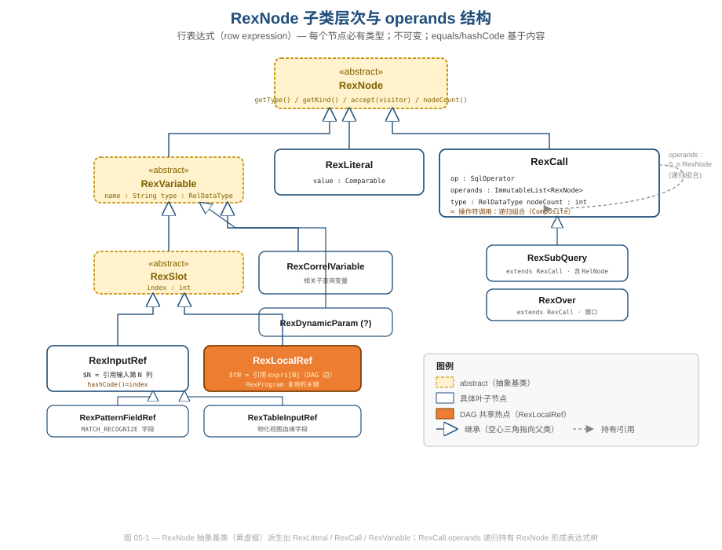
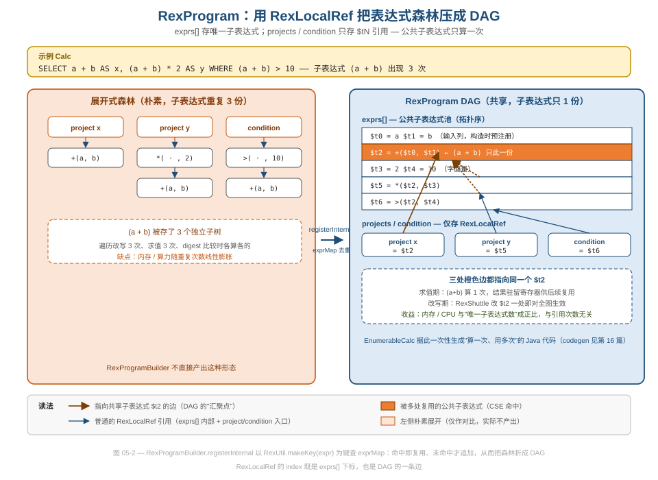
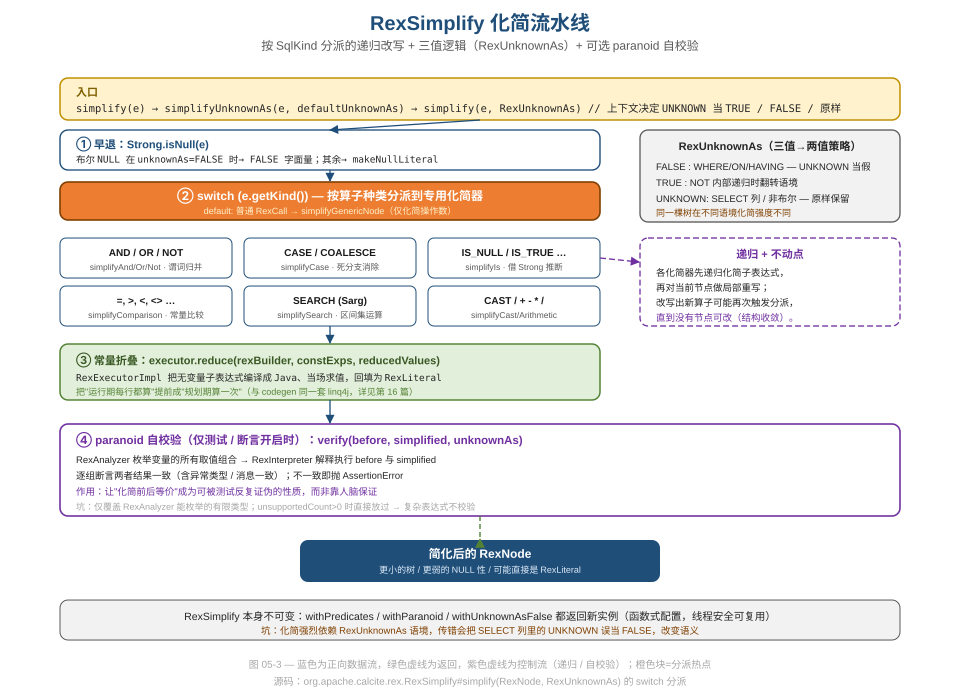

# 第 05 篇 · RexNode 行表达式与 RexProgram DAG

> 关系算子（RelNode）描述"对哪些表做什么变换"，但 `a + b > 10`、`COUNT(*)`、`CASE WHEN … END` 这些**行级标量表达式**由谁承载？答案是 `RexNode`。本篇从设计与性能两条线，讲清 Calcite 如何用 `RexBuilder` 规范化消重、用 `RexProgram` 把表达式森林压成共享 DAG、用 `RexSimplify` 在三值逻辑下做可验证的化简。
> 基线 commit `111030383` · 前置阅读：[第 02 篇 · 四层 IR](02-ir-overview.md)、[第 04 篇 · RelNode](04-relnode.md)

## TL;DR

- `RexNode` 是行表达式的不可变抽象基类，三大具体子类是 `RexLiteral`（常量）、`RexVariable`（变量族，含 `RexInputRef`/`RexLocalRef`）、`RexCall`（算子调用，递归组合）。**每个 RexNode 必有类型**——这是它与 `SqlNode` 最本质的区别。
- `RexCall` 的 `equals`/`hashCode` 走 `RexNormalize`：对称算子的操作数会被排序、`<` 与 `>` 会被统一，于是 `a=b` 与 `b=a`、`a>b` 与 `b<a` 拥有相同 digest，**天然去重**。
- `RexProgram` 用 `exprs[]` 存唯一子表达式、用 `RexLocalRef($tN)` 当"指针"，把 project/condition 引用到同一份子表达式上，**把表达式森林折成 DAG**。公共子表达式只算一次、改一处即全图生效。
- `RexProgramBuilder.registerInternal` 以 `RexUtil.makeKey(expr)` 为键查 `exprMap`，命中即复用——这是 DAG 共享（也即 CSE，公共子表达式消除）的落点。
- `RexSimplify` 按 `SqlKind` 分派到专用化简器，递归化简到收敛；`RexExecutor` 负责常量折叠；`RexUnknownAs` 把 SQL 三值逻辑（TRUE/FALSE/UNKNOWN）显式建模，决定化简强度。
- `RexSimplify` 的 **paranoid 模式**会枚举变量取值、解释执行化简前后两棵树并断言结果一致——把"等价"做成可被测试反复证伪的性质，是工程质量的范本（也有覆盖盲区）。

---

## 1. RexNode：每个表达式都带类型的不可变树

`RexNode` 的类注释一句话点破了它的定位（`core/src/main/java/org/apache/calcite/rex/RexNode.java`）：

```java
/**
 * Row expression.
 *
 * <p>Every row-expression has a type.
 * (Compare with {@link org.apache.calcite.sql.SqlNode}, which is created before
 * validation, and therefore types may not be available.)
 * ...
 * <p>All sub-classes of RexNode are immutable.
 */
public abstract class RexNode {
  // Effectively final. Set in each sub-class constructor, and never re-set.
  protected @MonotonicNonNull String digest;

  public abstract RelDataType getType();
  public SqlKind getKind() { return SqlKind.OTHER; }
  public int nodeCount() { return 1; }
  public abstract <R> R accept(RexVisitor<R> visitor);

  @Override public abstract boolean equals(@Nullable Object obj);
  @Override public abstract int hashCode();
}
```

四个设计决策都写在脸上：

- **每个表达式都带类型**（`getType()` 是抽象方法，强制子类提供）。`SqlNode` 诞生于校验之前，类型可能未知；`RexNode` 诞生于 `SqlToRelConverter` 之后，类型已定。这让后续所有规则、化简、codegen 都能直接信任 `getType()`，不必反复回查校验器。
- **不可变**（"All sub-classes of RexNode are immutable"）。任何"修改"都通过构造新节点完成，原节点保留——与 `RelNode#copy()` 的不可变契约同源（见 [第 04 篇](04-relnode.md)）。
- **digest 缓存**：`digest` 是 `@MonotonicNonNull`，在子类构造时算一次、之后只读，`toString()` 直接返回它。digest 是表达式的字符串指纹，去重和打印计划都靠它。
- **强制 `equals`/`hashCode`**：基类把这两个方法声明为 `abstract`，逼每个子类基于内容（而非对象身份）实现——这是去重能成立的前提。

`getKind()` 返回 `SqlKind` 枚举（如 `EQUALS`/`AND`/`CAST`），配合 `isA(SqlKind)` / `isA(Collection<SqlKind>)`，让规则用**集合归属判断**代替满地的 `instanceof`：

```java
public boolean isA(Collection<SqlKind> kinds) {
  return getKind().belongsTo(kinds);
}
```

**软件工程视角**：这是典型的"把分支判断数据化"。`SqlKind` 把"这是什么算子"从类型系统（需要 `instanceof RexCall && ((RexCall)e).op == ...`）下沉成一个枚举字段，规则代码因此短得多、也更好测。`SqlKind` 本身的设计归 [第 03 篇](03-sqlnode.md) 主讲，这里只用它。

### 1.1 子类层次：三条主线



如图 05-1，从 `RexNode` 派生出三条主线：

- **`RexLiteral`**——常量值（`value : Comparable`）。
- **`RexVariable`**（抽象）——所有"引用某处的值"的节点，持有 `name` 与 `type`。它又分出：
  - **`RexSlot`**（抽象，含 `index : int`）：`RexInputRef`（`$N`，引用算子输入的第 N 列）、`RexLocalRef`（`$tN`，引用 `RexProgram.exprs[N]`，本篇主角之一）、`RexPatternFieldRef`、`RexTableInputRef`。
  - **`RexCorrelVariable`**（相关子查询变量，见 [第 08 篇](08-sql-to-rel.md)）、**`RexDynamicParam`**（动态参数 `?`）。
- **`RexCall`**——对算子的调用，是**组合（Composite）模式**的体现：它的 `operands` 是 `ImmutableList<RexNode>`，递归持有子表达式，从而能表达任意深度的 `+(*(a, b), 2)`。`RexSubQuery`、`RexOver` 都继承自它。

`RexCall` 的字段印证了"行为在算子、数据在调用"的分离（`core/src/main/java/org/apache/calcite/rex/RexCall.java`）：

```java
public final SqlParserPos pos;
public final SqlOperator op;             // 语义在这里
public final ImmutableList<RexNode> operands;  // 操作数在这里
public final RelDataType type;
public final int nodeCount;
```

类注释里有一句很值得品味的工程判断：

```
 * <p>It's not often necessary to sub-class this class. The smarts should be in
 * the operator, rather than the call. ...
```

**设计视角**：与 `SqlCall` 一样，`RexCall` 刻意做"瘦"。"聪明"（类型推导、求值、unparse）放进 `SqlOperator`，调用本身只是"算子 + 操作数 + 类型"的不可变记录。好处是：新增一个函数只需注册一个 `SqlOperator`，不必派生 `RexCall` 子类——扩展点收敛在算子注册表（[第 03 篇](03-sqlnode.md) / [第 06 篇](06-type-system.md)）。

### 1.2 nodeCount：用一个 int 防住组合爆炸

`RexCall` 构造时预算了 `nodeCount`：

```java
this.nodeCount = RexUtil.nodeCount(1, this.operands);
```

`RexNode#nodeCount()` 的注释说明了它的用途：

```
 * <p>Node count is a measure of expression complexity that is used by some
 * planner rules to prevent deeply nested expressions.
```

**性能视角**：化简、谓词下推等规则在反复改写表达式时，可能把一个表达式越展越大（比如把 `CASE` 拆成嵌套 `OR`）。`nodeCount` 给规则一个 O(1) 的"复杂度刹车"——超过阈值就放弃这次重写，避免表达式树指数膨胀。它在构造时算好、之后只读，是"用一次计算换无数次廉价查询"的典型缓存。

---

## 2. RexBuilder：常量缓存 + makeCall 规范化

几乎所有 `RexNode` 都不直接 `new`，而是经 `RexBuilder` 工厂创建（`core/src/main/java/org/apache/calcite/rex/RexBuilder.java`）。类注释只一行，却是性能关键：

```java
/**
 * Factory for row expressions.
 *
 * <p>Some common literal values (NULL, TRUE, FALSE, 0, 1, '') are cached.
 */
public class RexBuilder {
```

构造器里把几个高频常量**预创建并驻留**：

```java
public RexBuilder(RelDataTypeFactory typeFactory) {
  this.typeFactory = typeFactory;
  this.booleanTrue  = makeLiteral(Boolean.TRUE,  ..., SqlTypeName.BOOLEAN);
  this.booleanFalse = makeLiteral(Boolean.FALSE, ..., SqlTypeName.BOOLEAN);
  this.charEmpty    = makeLiteral(new NlsString("", null, null), ...);
  this.constantNull = makeLiteral(null, ..., SqlTypeName.NULL);
}
```

于是布尔字面量永远命中同一对象：

```java
public RexLiteral makeLiteral(boolean b) {
  return b ? booleanTrue : booleanFalse;
}
```

**数据工程视角**：优化器一轮跑下来会创建数以万计的 `RexLiteral`，而 `TRUE`/`FALSE`/`NULL`/空串占了很大比例。把它们做成单例既省内存，又让"是不是 TRUE"退化成引用比较——化简里 `e.isAlwaysTrue()` 之类的判断因此极快。这是 Flyweight 思路在表达式层的一次小应用（Flyweight 模式的系统归纳见 [第 19 篇](19-design-patterns.md)，类型系统里的 interning 见 [第 06 篇](06-type-system.md)）。

`makeCall` 是另一条规范化入口。当调用方不预先给定返回类型时，`RexBuilder` 会**就地推导**：

```java
public RexNode makeCall(SqlParserPos pos, SqlOperator op,
    List<? extends RexNode> exprs) {
  final RelDataType type = deriveReturnType(op, exprs);
  return new RexCall(pos, type, op, exprs);
}

public RelDataType deriveReturnType(SqlOperator op, List<? extends RexNode> exprs) {
  return op.inferReturnType(
      new RexCallBinding(typeFactory, op, exprs, ImmutableList.of()));
}
```

**设计视角**：类型推导被委托给 `SqlOperator.inferReturnType`（三策略对象之一，[第 06 篇](06-type-system.md) 主讲），`RexBuilder` 只负责"把操作数和算子组装成调用、顺手把推导出的类型钉上去"。这保证了**无论谁构造 RexCall，返回类型都由同一套规则算出**——不会出现两处手写类型推导逻辑漂移。`makeCast` 还会顺手把"对字面量的 CAST"折叠成新字面量（`canRemoveCastFromLiteral` 一长串分支），把规范化提前到了构造期。

---

## 3. RexNormalize：让 `a=b` 和 `b=a` 长成一个样

去重的前提是"语义相同的表达式有相同的 `equals`/`hashCode`"。但 `a=b` 与 `b=a`、`a>b` 与 `b<a` 在语义上等价、写法却不同。`RexCall` 把这件事交给 `RexNormalize`（`core/src/main/java/org/apache/calcite/rex/RexNormalize.java`），并把结果**缓存**起来：

```java
// RexCall
private @Nullable Pair<SqlOperator, List<RexNode>> normalized;

private Pair<SqlOperator, List<RexNode>> getNormalized() {
  if (this.normalized == null) {
    this.normalized = RexNormalize.normalize(this.op, this.operands);
  }
  return this.normalized;
}

@Override public boolean equals(@Nullable Object o) {
  // ...
  Pair<SqlOperator, List<RexNode>> x = getNormalized();
  Pair<SqlOperator, List<RexNode>> y = ((RexCall) o).getNormalized();
  return x.left.equals(y.left) && x.right.equals(y.right)
      && type.equals(rexCall.type);
}
```

`RexNormalize.normalize` 的核心逻辑：

```java
final SqlKind kind = operator.getKind();
final SqlKind reversedKind = kind.reverse();
final int x = reversedKind.compareTo(kind);
if (x < 0) {
  // '<' == 60, '>' == 62, 优先 '<'：把 a > b 归一成 b < a
  return Pair.of(requireNonNull(operator.reverse()),
      ImmutableList.of(operand1, operand0));
}
// ...
if (!isSymmetricalCall(operator, operand0, operand1)) {
  return original;
}
if (reorderOperands(operand0, operand1) < 0) {
  // a = b 与 b = a 归一成同一序，保证 digest 相同
  return Pair.of(requireNonNull(operator.reverse()),
      ImmutableList.of(operand1, operand0));
}
```

两条规则：

1. **算子方向归一**：`>` 统一翻成 `<`、`>=` 翻成 `<=`（按 SqlKind 枚举序，`<`(60) 比 `>`(62) 小，优先 `<`）。
2. **对称算子操作数排序**：对 `=`、`AND`、`OR` 等对称算子，按 `reorderOperands` 把两个操作数排成确定顺序（先比 `SqlKind`，再用 hashCode 兜底）。

注释里有一句关键的一致性约束：

```
 * <p>Note that the logic to decide whether operands need reordering
 * should be strictly same with {@link #normalize}.
```

`hashCode` 与 `normalize` 必须用**完全相同**的排序逻辑，否则会出现"`equals` 相等但 `hashCode` 不等"的灾难性 bug。

**设计与质量视角**：这是把"语义等价类"显式收敛成"语法规范型"的经典做法。好处立竿见影——优化器里两个等价谓词的 digest 一致，memo 去重（[第 04 篇](04-relnode.md) / [第 11 篇](11-volcano.md)）和 `RexProgram` 的 CSE 才能命中。坑也很实在：`hashCode` 与 `normalize` 是**强耦合的一对**，任何一方改了排序规则、另一方不跟着改，就会破坏 hash 一致性——所以源码里专门用注释把这条不变量钉死。`RexNormalizeTest` 就是为这条不变量准备的回归网。

---

## 4. RexProgram：把表达式森林压成共享 DAG

到这里，单棵表达式的去重已经解决。但一个 `Project`/`Filter`/`Calc` 里往往有**多棵**表达式，它们之间还会共享子表达式。`RexProgram` 就是为此而生的容器。

### 4.1 三段式结构：exprs / projects / condition

`RexProgram`（`core/src/main/java/org/apache/calcite/rex/RexProgram.java`）的字段：

```java
/** First stage of expression evaluation. The expressions in this array can
 * refer to inputs (using input ordinal #0) or previous expressions in the
 * array (using input ordinal #1). */
private final List<RexNode> exprs;

/** With {@link #condition}, the second stage of expression evaluation. */
private final List<RexLocalRef> projects;

/** The optional condition. If null, the calculator does not filter rows. */
private final @Nullable RexLocalRef condition;
```

注意 `projects` 和 `condition` 的类型是 **`RexLocalRef`**，不是 `RexNode`——它们**不直接持有表达式树，只持有指向 `exprs[]` 的下标**。`exprs[]` 是按拓扑序排列的公共子表达式池：后面的表达式可以用 `$tN` 引用前面的。

类注释把它和 `RexProgramBuilder` 的关系讲得很形象：

```
 * <p>Programs are immutable. It may help to use a {@link RexProgramBuilder},
 * which has the same relationship to {@link RexProgram} as {@link StringBuilder}
 * has to {@link String}.
```



图 05-2 用 `SELECT a+b AS x, (a+b)*2 AS y WHERE (a+b) > 10` 对比了两种形态：

- **左侧（朴素森林）**：三处 `(a+b)` 各存一棵独立子树。遍历改写要做 3 次、求值要算 3 次，内存与算力随重复次数线性膨胀。
- **右侧（RexProgram DAG）**：`(a+b)` 只在 `exprs[]` 里存一份（图中橙色的 `$t2`）。project x = `$t2`、project y 经 `$t5=*($t2,$t3)` 间接引用 `$t2`、condition 经 `$t6=>($t2,$t4)` 引用 `$t2`——三处橙色边汇聚到同一个节点。这正是 **DAG（有向无环图）**：`exprs[]` 是节点集，`RexLocalRef` 的 index 是边。

### 4.2 expandLocalRef：DAG 与树之间的可逆转换

需要"展开"成树时（比如规则要看完整谓词），`expandLocalRef` 用一个 `RexShuttle` 递归把 `$tN` 替换回 `exprs[N]`：

```java
public RexNode expandLocalRef(RexLocalRef ref) {
  return ref.accept(new ExpansionShuttle(exprs));
}

static class ExpansionShuttle extends RexShuttle {
  private final List<RexNode> exprs;
  @Override public RexNode visitLocalRef(RexLocalRef localRef) {
    RexNode tree = exprs.get(localRef.getIndex());
    return tree.accept(this);   // 递归展开
  }
}
```

注释把它的语义说得很准——"reversing the effect of common subexpression elimination"（逆转公共子表达式消除的效果）。

**软件工程视角**：DAG 形态省内存、利于求值与改写；树形态利于规则做模式匹配。Calcite 让二者**可逆互转**：平时存 DAG，需要时 `expandLocalRef` 展开成树、改完再 `RexProgramBuilder` 折回 DAG。这是"内部紧凑表示 + 外部友好视图"的分离，和数据库列存/行存按场景切换是一个思路。

### 4.3 registerInternal：DAG 共享（CSE）的落点

DAG 是怎么被构造出来的？关键在 `RexProgramBuilder.registerInternal`（`core/src/main/java/org/apache/calcite/rex/RexProgramBuilder.java`）：

```java
private final Map<Pair<RexNode, String>, RexLocalRef> exprMap = new HashMap<>();
private final List<RexNode> exprList = new ArrayList<>();

private RexLocalRef registerInternal(RexNode expr) {
  final RexSimplify simplify =
      new RexSimplify(rexBuilder, RelOptPredicateList.EMPTY, RexUtil.EXECUTOR);
  expr = simplify.simplifyPreservingType(expr);   // ① 先化简

  RexLocalRef ref;
  final Pair<RexNode, String> key;
  if (expr instanceof RexLocalRef) {
    key = null;
    ref = (RexLocalRef) expr;
  } else {
    key = RexUtil.makeKey(expr);   // ② 以 (digest, type) 为键
    ref = exprMap.get(key);        // ③ 命中即复用
  }
  if (ref == null) {
    // ④ 未命中才真正追加到 exprList，并登记进 exprMap
    ref = addExpr(expr);
    exprMap.put(requireNonNull(key, "key"), ref);
  }
  // ⑤ 若引用又指向另一个 RexLocalRef，顺着链找到最终目标（消除间接层）
  for (;;) {
    int index = ref.index;
    final RexNode expr2 = exprList.get(index);
    if (expr2 instanceof RexLocalRef) {
      ref = (RexLocalRef) expr2;
    } else {
      return ref;
    }
  }
}
```

这段代码是整篇的"题眼"：

- **`exprMap` 是去重表**，键是 `RexUtil.makeKey(expr)`（基于 digest + type）。第二次注册同一个 `(a+b)` 时，`exprMap.get(key)` 命中，直接返回已有的 `RexLocalRef`——子表达式不会被重复追加。这就是 **CSE（公共子表达式消除）的实现**。
- 构造器一开始就把输入列预注册成 `exprs[0..n]`（`registerInternal(RexInputRef.of(i, fields))`），所以 `$t0`/`$t1` 总是输入列。
- 注册前先 `simplifyPreservingType` 化简——化简把等价表达式归一成相同形态，**进一步提高 `exprMap` 的命中率**（比如 `a+0` 化简成 `a`，就能和别处的 `a` 共享）。化简与去重在这里咬合得很紧。
- 最后那个 `for (;;)` 循环在"压平"间接引用：如果一个 slot 又指向另一个 slot，就顺链找到真正的表达式，避免 DAG 里出现"指针的指针"。

**性能视角**：`exprMap` 用 `HashMap` + digest 把"这个子表达式我见过吗"做成 O(1) 查询。整个 `RexProgram` 的内存/算力开销因此与**唯一子表达式数量**成正比，而与**引用次数**无关。一个谓词被 project、condition 同时用到，只占一份；codegen（[第 16 篇](16-codegen-exec.md)）据此生成"算一次、用多次"的 Java，运行期不会重复计算。

---

## 5. RexShuttle：表达式的不可变改写器

要把"列重映射""谓词下推"这类批量改写施加到表达式树上，靠的是 `RexShuttle`（`core/src/main/java/org/apache/calcite/rex/RexShuttle.java`）。它实现 `RexVisitor<RexNode>`——访问每个节点、返回一个（可能是新的）节点：

```java
public class RexShuttle implements RexVisitor<RexNode> {
  @Override public RexNode visitCall(final RexCall call) {
    boolean[] update = {false};
    List<RexNode> clonedOperands = visitList(call.operands, update);
    if (update[0]) {
      return call.clone(call.getType(), clonedOperands);
    } else {
      return call;   // 子节点没变 → 原样返回，不新建对象
    }
  }
}
```

注意那个 `boolean[] update` 技巧：`visitList` 逐个访问操作数，**只有当某个操作数真的被改写**（`clonedOperand != operand`，引用不等）时才置 `update[0]=true`。如果所有子节点都没变，`visitCall` 直接返回原 `call`。

**设计与性能视角**：这是不可变数据结构上做"结构共享改写"的标准手法——**未改动的子树被原样复用**，只有从被改节点到根的这条路径上的节点会被重建。一次列重映射不会克隆整棵树，只会克隆受影响的脊柱。叶子节点（`RexInputRef`/`RexLiteral`/`RexLocalRef`）的 `visitXxx` 默认直接返回自身（见 `visitInputRef`/`visitLocalRef`/`visitLiteral`），更印证了这一点。

`apply`/`mutate` 提供了对列表的便捷入口，且用 `@PolyNull` 精确表达"输入 null 则输出 null"的可空契约：

```java
public final @PolyNull List<T> apply(@PolyNull List<T> exprList) {
  if (exprList == null) return exprList;
  final List<T> list2 = new ArrayList<>(exprList);
  if (mutate(list2)) {
    return list2;       // 有改动 → 返回新列表
  } else {
    return exprList;    // 无改动 → 返回原列表（结构共享）
  }
}
```

`RexShuttle` 是三层 Visitor/Shuttle 体系中的"行表达式层"。`SqlVisitor`（[第 03 篇](03-sqlnode.md)）、`RelShuttle`（[第 04 篇](04-relnode.md)）、`linq4j` 的 `tree.Shuttle`（[第 15 篇](15-linq4j.md)）各管一层，"三层 Shuttle 对照"的总归纳归 [第 19 篇](19-design-patterns.md)，这里只讲它在 Rex 层的用法。

---

## 6. RexSimplify：三值逻辑下的可验证化简

`RexSimplify`（`core/src/main/java/org/apache/calcite/rex/RexSimplify.java`）是把表达式"算得更小"的引擎：常量折叠、谓词消除、强度削减。



### 6.1 不可变配置 + 按 SqlKind 分派

`RexSimplify` 自身是不可变的，所有配置走 `withXxx` 返回新实例：

```java
public RexSimplify withPredicates(RelOptPredicateList predicates) {
  return predicates == this.predicates ? this
      : new RexSimplify(rexBuilder, predicates, defaultUnknownAs,
          predicateElimination, paranoid, executor);
}
public RexSimplify withParanoid(boolean paranoid) { /* 同上 */ }
```

**软件工程视角**：不可变 + `withXxx` 让一个 `RexSimplify` 可以被多线程安全共享、可以"基于默认配置临时调一个开关"而不污染原对象。这与 `RelSimplify` 调用方常见的 `simplify.withPredicates(preds).simplify(e)` 链式写法天然契合。

核心是 `simplify(RexNode, RexUnknownAs)` 的 `switch` 分派：

```java
RexNode simplify(RexNode e, RexUnknownAs unknownAs) {
  if (isSafeExpression(e) && STRONG.isNull(e)) {
    // 仅布尔 NULL 可在 unknownAs=FALSE/TRUE 时折叠成字面量
    if (e.getType().getSqlTypeName() == SqlTypeName.BOOLEAN) {
      switch (unknownAs) {
      case FALSE: case TRUE:
        return rexBuilder.makeLiteral(unknownAs.toBoolean());
      default: break;
      }
    }
    return rexBuilder.makeNullLiteral(e.getType());
  }
  switch (e.getKind()) {
  case AND:  return simplifyAnd((RexCall) e, unknownAs);
  case OR:   return simplifyOr((RexCall) e, unknownAs);
  case NOT:  return simplifyNot((RexCall) e, unknownAs);
  case CASE: return simplifyCase((RexCall) e, unknownAs);
  case CAST: case SAFE_CAST: return simplifyCast((RexCall) e);
  case IS_NULL: case IS_NOT_NULL: /* … */ return simplifyIs((RexCall) e, unknownAs);
  case EQUALS: case GREATER_THAN: /* … */ return simplifyComparison((RexCall) e, unknownAs);
  case SEARCH: return simplifySearch((RexCall) e, unknownAs);
  // …
  default:
    if (e.getClass() == RexCall.class) {
      return simplifyGenericNode((RexCall) e);  // 只化简操作数
    } else {
      return e;
    }
  }
}
```

每个 `case` 对应一个专用化简器，先递归化简子节点、再对当前节点做局部重写；重写产出的新算子可能再次触发分派，直到结构收敛。`simplifyGenericNode` 是兜底：对没有专属规则的普通调用，只递归化简操作数、若有变化才重建调用。

### 6.2 RexUnknownAs：把 SQL 三值逻辑显式建模

化简布尔表达式最大的陷阱是 SQL 的**三值逻辑**：`NULL`（UNKNOWN）既不是 TRUE 也不是 FALSE。`a > 10` 当 `a IS NULL` 时返回 UNKNOWN，而非 FALSE。`RexUnknownAs`（`core/src/main/java/org/apache/calcite/rex/RexUnknownAs.java`）把"当前语境如何对待 UNKNOWN"显式编码：

```java
public enum RexUnknownAs {
  FALSE,    // WHERE/ON/HAVING/CHECK：UNKNOWN 视同 FALSE
  TRUE,     // 内部递归（如 NOT 翻转语境）时用
  UNKNOWN;  // SELECT 列 / 非布尔 / NOT NULL 布尔：原样保留
}
```

它的注释把适用场景写得很细：`WHERE`、`ON`、`HAVING`、`FILTER (WHERE)`、`CASE` 的 `WHEN`、`CHECK` 约束都把 UNKNOWN 当 FALSE，所以这些位置传 `FALSE`；而 `SELECT` 列要把 UNKNOWN 原样吐出，传 `UNKNOWN`。`simplifyUnknownAsFalse(e)` 与 `simplify(e)` 的区别就在这个参数。

**数据工程视角**：这是 Calcite 对 SQL 语义忠实度的一个缩影。同一棵 `a > 10` 在 `WHERE` 里能被更激进地化简（UNKNOWN 反正等于 FALSE），在 `SELECT` 里却不能（用户要看到 NULL）。把"语境"做成显式参数沿调用链传递，而不是埋在某个全局开关里，才能保证化简既激进又**不改变语义**。

**坑**：这也意味着调用方传错 `RexUnknownAs` 是一类隐蔽 bug——在 `SELECT` 上下文误用 `FALSE`，会把本该是 NULL 的结果折叠成 FALSE，悄悄改变查询语义。图 05-3 底部把这条坑标了出来。

### 6.3 常量折叠：把运行期工作提前到规划期

无变量的子表达式（如 `1 + 2`、`UPPER('x')`）可以在规划期直接算出。`RexSimplify` 把它委托给 `RexExecutor`：

```java
// RexExecutor 接口
void reduce(RexBuilder rexBuilder, List<RexNode> constExps,
    List<RexNode> reducedValues);
```

`RexSimplify` 内部调用 `executor.reduce(rexBuilder, ImmutableList.of(simplifiedExpr), reducedValues)`，由 `RexExecutorImpl` 把常量子表达式**编译成 Java 字节码、当场执行、回填为 `RexLiteral`**。

**性能视角**：`1 + 2` 如果不折叠，运行期对每一行都要做一次加法；折叠成 `3` 后零成本。这条优化复用的是和 codegen 同一套 linq4j 编译设施——化简和执行后端共享基础能力，避免重造轮子（codegen 本体见 [第 16 篇](16-codegen-exec.md)）。

### 6.4 paranoid：让"等价"成为可证伪的性质

化简最危险的地方是：你以为等价的重写其实不等价，而这种错误很难靠肉眼发现。`RexSimplify` 给了一个极漂亮的答案——**paranoid 自校验**：

```java
public RexNode simplifyUnknownAs(RexNode e, RexUnknownAs unknownAs) {
  final RexNode simplified = withParanoid(false).simplify(e, unknownAs);
  if (paranoid) {
    verify(e, simplified, unknownAs);   // 化简前后必须等价
  }
  return simplified;
}

private void verify(RexNode before, RexNode simplified, RexUnknownAs unknownAs) {
  // …明显矛盾直接抛：always true 化简成 always false 等
  final RexAnalyzer foo0 = new RexAnalyzer(before, predicates);
  final RexAnalyzer foo1 = new RexAnalyzer(simplified, predicates);
  if (foo0.unsupportedCount > 0 || foo1.unsupportedCount > 0) {
    return;   // 分析器搞不定的表达式，跳过
  }
  // 枚举 before 的所有变量取值组合
  for (Map<RexNode, Comparable> map : foo0.assignments()) {
    // …
    Pair<Comparable, RuntimeException> p0 = evaluate(foo0.e, map);
    Pair<Comparable, RuntimeException> p1 = evaluate(foo1.e, map);
    // 逐组断言 before 与 simplified 求值结果一致（含异常类型/消息一致）
  }
}
```

`verify` 用 `RexAnalyzer` 枚举出表达式里所有变量的取值组合，再用 `RexInterpreter` 把化简前后两棵树**逐组解释执行**，断言结果完全一致——连抛出的异常类型和消息都要对得上。

**质量视角**：这是把"化简正确性"从"靠开发者脑补"升格成"可被穷举测试反复证伪的性质"。打开 paranoid（测试里默认开），任何一个写错的化简规则都会在某组变量取值上现形，抛 `AssertionError`。`RexProgramTest` 里上百个 `testSimplifyXxx` 就建立在这个机制上。

**但要诚实地写出它的边界**（图 05-3 底部已标）：

1. `verify` 只覆盖 `RexAnalyzer` 能枚举的有限类型；遇到它搞不定的表达式（`unsupportedCount > 0`）会**直接 return 放过**——复杂表达式可能根本没被校验。
2. paranoid 默认**只在断言开启时**才打开（生产环境通常关闭），它是开发期的安全网而非运行期保证。
3. 枚举变量组合本身有成本，所以不可能在生产路径常开。

这条"强大但有覆盖盲区"的自校验，正是本系列想呈现的真实工程权衡——不是银弹，但把可验证的部分牢牢钉住了。

---

## 设计模式与工程小结

| 机制 | 模式 / 手法 | 好在哪 / 为什么这么设计 | 坑 / 权衡 |
|---|---|---|---|
| `RexNode` 不可变 + digest 缓存 | Immutable Object + Memoization | 可安全共享、可回溯；digest 算一次供去重与打印 | 任何"修改"都新建对象，依赖结构共享降摊销 |
| `RexCall.operands` 递归持有 RexNode | Composite | 任意深度表达式统一表示；新函数无需派生子类 | "聪明"必须放进 `SqlOperator`，调用保持瘦 |
| `RexBuilder` 常量缓存 + makeCall | Factory + Flyweight | 高频常量单例省内存、引用比较快；类型推导收敛一处 | 必须经工厂创建才享受规范化 |
| `RexNormalize` 算子/操作数归一 | Canonical Form | `a=b`/`b=a`、`a>b`/`b<a` 同 digest，去重/CSE 命中 | `hashCode` 与 `normalize` 强耦合，须同步改 |
| `RexProgram` exprs + RexLocalRef | DAG / 公共子表达式消除(CSE) | 子表达式只存一份；改一处全图生效；codegen 算一次用多次 | 需 `expandLocalRef`/`Builder` 在 DAG↔树间来回转 |
| `RexProgramBuilder.exprMap` | Hash-based 去重表 | O(1) 判断"子表达式见过吗"；先化简再去重提命中率 | 命中依赖 digest 一致性（即依赖 RexNormalize） |
| `RexShuttle` + `update[]` | Visitor/Shuttle + 结构共享 | 只重建被改路径，未变子树原样复用 | 改写不更新返回类型（注释明示，需调用方注意） |
| `RexSimplify` withXxx | Immutable 配置 | 线程安全可共享；临时调开关不污染原对象 | 每次配置都新建实例 |
| `RexUnknownAs` | 三值逻辑显式建模 | 同一表达式按语境化简强度不同、不改语义 | 传错语境会悄悄改变查询语义 |
| `RexSimplify.verify` | Property-based 自校验 | 化简等价性可被穷举测试证伪 | 仅覆盖可枚举类型；默认仅断言期开启 |

---

## 对照阅读建议（动手）

- **断点**：`core/src/main/java/org/apache/calcite/rex/RexProgramBuilder.java` → `RexProgramBuilder#registerInternal`
  - **观察**：第二次注册同一个 `(a+b)` 时 `exprMap.get(key)` 是否命中、返回的 `RexLocalRef` 是否复用了已有 index；`exprList` 的长度是否因命中而**不增长**。这是 DAG 共享/CSE 发生的瞬间。
  - **运行**：`./gradlew :core:test --tests org.apache.calcite.rex.RexProgramTest`

- **断点**：`core/src/main/java/org/apache/calcite/rex/RexSimplify.java` → `RexSimplify#simplify(RexNode, RexUnknownAs)` 的 `switch (e.getKind())`
  - **观察**：传入一个 `CASE WHEN TRUE THEN a ELSE b END`，看它如何走到 `simplifyCase` 并被折叠成 `a`；切换 `unknownAs` 为 `FALSE` / `UNKNOWN`，观察同一谓词化简结果的差异。
  - **运行**：`./gradlew :core:test --tests org.apache.calcite.rex.RexProgramTest --tests "*testSimplify*"`

- **断点**：`core/src/main/java/org/apache/calcite/rex/RexSimplify.java` → `RexSimplify#verify`
  - **观察**：`foo0.assignments()` 枚举出的变量取值组合；`p0`/`p1` 对每组的求值结果是否相等；故意写一个错误化简，看它在哪组取值上抛 `AssertionError`。
  - **运行**：同上（paranoid 在测试中默认开启）。

- **断点**：`core/src/main/java/org/apache/calcite/rex/RexNormalize.java` → `RexNormalize#normalize`
  - **观察**：构造 `a > b` 与 `b < a` 两个 `RexCall`，看 `getNormalized()` 是否产出相同的 `(op, operands)`、`equals` 是否返回 true、`hashCode` 是否相等。
  - **运行**：`./gradlew :core:test --tests org.apache.calcite.rex.RexNormalizeTest`

---

## 延伸阅读

- 本系列：
  - [第 02 篇 · 为什么是四层 IR](02-ir-overview.md) —— RexNode 在四层降级中的位置与"为什么分层"。
  - [第 04 篇 · RelNode 关系代数层](04-relnode.md) —— `Project`/`Filter` 如何用 `RexNode` 表达条件与投影；不可变 `copy()` 契约。
  - [第 06 篇 · 类型系统](06-type-system.md) —— `RexBuilder.deriveReturnType` 委托的 `inferReturnType` 三策略对象、Flyweight interning 的系统实现。
  - [第 03 篇 · SqlNode AST](03-sqlnode.md) —— `SqlOperator` / `SqlKind` / 数据-行为分离（RexCall 的"瘦调用"同源）。
  - [第 16 篇 · RelNode→Java codegen](16-codegen-exec.md) —— `RexToLixTranslator` 如何把 RexNode 翻译成可执行 Java，以及 `RexProgram` DAG 在 `EnumerableCalc` 里"算一次用多次"的落地。
  - [第 19 篇 · 设计模式全景](19-design-patterns.md) —— 三层 Shuttle 对照、Flyweight / Factory / Composite 的横向归纳。
- 官方文档：
  - `site/_docs/algebra.md` —— 关系代数与 `RelBuilder`，含直接构造表达式的 API。
  - `site/_docs/reference.md` —— SQL 算子参考（化简规则常以此为语义基准）。
