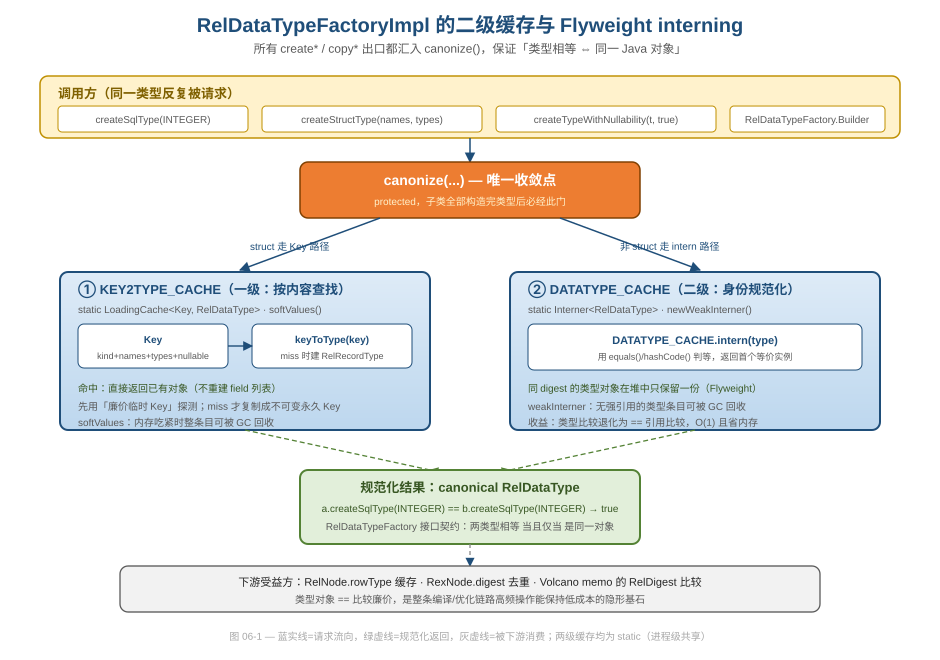
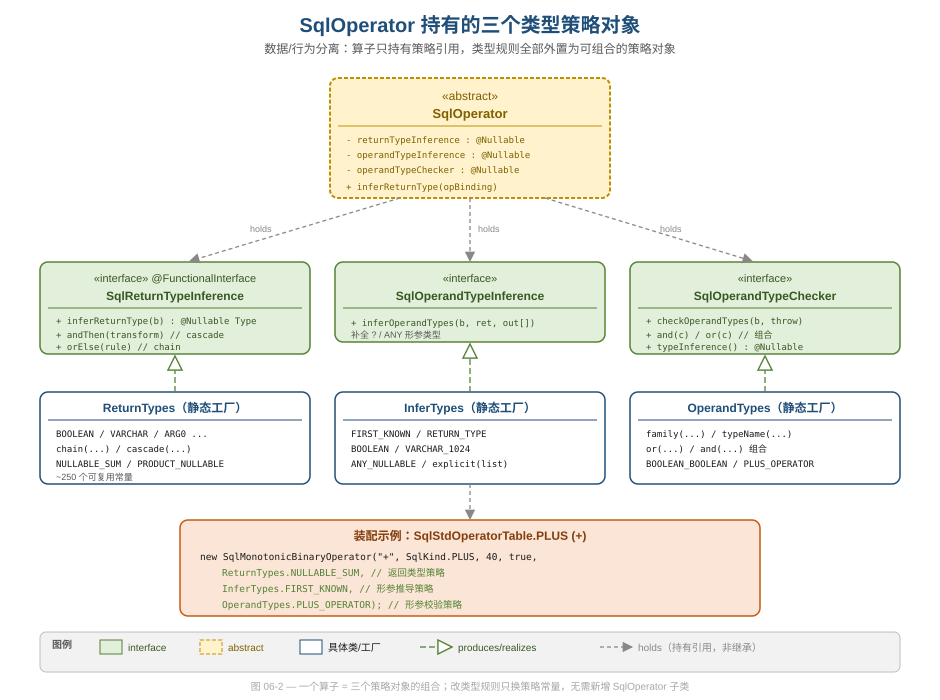
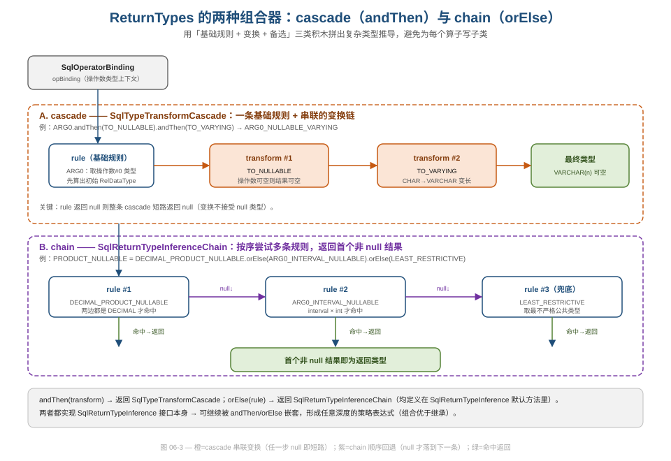

# 第 06 篇 · 类型系统：Flyweight interning + TypeSystem 策略

> 一个编译器/优化器要在 parse、validate、sql2rel、optimize 四个阶段里反复创建、比较、传播类型对象。Calcite 用两招把这件高频的事压到极致：用 Flyweight interning 让「类型相等」退化为 `==` 引用比较，用一组可组合的策略对象把「某算子的返回类型怎么算」从核心代码里外置出来。本篇拆解这两套机制的实现，以及它们各自的工程权衡与坑。
> 基线 commit `111030383` · 前置阅读：[第 02 篇 · 四层 IR](02-ir-overview.md)、[第 03 篇 · SqlNode AST](03-sqlnode.md)

## TL;DR（要点速览）

- **类型对象是 Flyweight**：`RelDataTypeFactoryImpl` 用两级 static 缓存（`KEY2TYPE_CACHE` 一级按内容查、`DATATYPE_CACHE` 二级身份 interner）把所有 `create*`/`copy*` 出口收敛到 `canonize()`，保证「两类型相等 ⇔ 是同一个 Java 对象」。下游因此能用 `==` O(1) 比较类型。
- **类型规则被外置为三个策略对象**：每个 `SqlOperator` 持有 `SqlReturnTypeInference`（返回类型）、`SqlOperandTypeInference`（形参类型补全）、`SqlOperandTypeChecker`（形参合法性）三个可空引用，而不是为每个算子写一个子类去 override 类型方法。
- **策略用 chain/cascade 组合**：`ReturnTypes` 提供 ~250 个可复用常量 + `cascade(rule, transforms…)`（串联变换，任一步 null 即短路）和 `chain(rules…)`（顺序回退，取首个非 null）两个组合器，用积木拼出复杂推导，体现「组合优于继承」。
- **方言差异收口在 `RelDataTypeSystem`**：DECIMAL 最大精度、SUM/AVG 派生类型、rounding mode 等「会因 SQL 方言而异」的策略集中在一个接口里，Hive/SQL Server 风格只需派生覆盖几个方法，不动核心。
- **坑要诚实记**：interning 依赖 `equals`/`hashCode` 正确，否则缓存失效或对象泄漏；`RelDataType` 是个「胖接口」（作者自己在注释里承认 inelegant）；策略链一旦三条规则都返回 null 会抛 `cannotInferReturnType`，调试时要顺着 chain 逐条看。

---

## 1. 为什么类型系统值得单独一篇

在 [第 02 篇](02-ir-overview.md) 我们看到，一条 SQL 要经过 `SqlNode → RelNode → RexNode → Expression` 的逐层降级。这四层里，**每一层的每个节点都带类型**：`RexNode#getType()`、`RelNode#getRowType()`、`SqlValidator` 给每个 `SqlNode` 推导出的类型。也就是说，类型对象的创建和比较是贯穿全流程的高频操作。

这带来两个独立的工程问题：

1. **类型对象怎么存才不爆内存、比较才够快？** 一张 14 列的 `emp` 表，它的 `INTEGER`、`VARCHAR(20)` 这些列类型会在解析、校验、每条规则匹配、每次 digest 计算时被反复引用。如果每次都 `new` 一个，既浪费内存又让比较变成深度遍历。Calcite 的答案是 **Flyweight interning**（§2）。
2. **「`SUBSTRING(x, y, z)` 的返回类型怎么算」这种规则放哪？** 全 SQL 有上千个内置算子，每个的类型规则各不相同。若给每个算子写子类去 override，会爆炸出上千个类。Calcite 的答案是**把类型规则抽成三个策略对象**，再用组合器拼装（§3–§5）。

这两点分别对应「数据工程的类型系统」和「设计与代码质量的策略模式」两个鉴赏视角。注意：本篇只讲类型机制本身——算子是怎么注册进 `SqlStdOperatorTable` 的、`SqlOperator` 作为 AST 节点行为载体的角色，归 [第 03 篇](03-sqlnode.md)；Flyweight 作为设计模式的横向总结归 [第 19 篇](19-design-patterns.md)；本篇只讲类型这一处的 interning 实现。

---

## 2. Flyweight interning：让「相等」退化为「==」

### 2.1 接口契约先行

`RelDataTypeFactory` 的类注释把规则写死成了**接口契约**，这点很关键——它不是实现细节，而是所有实现者必须遵守的约定：

```java
// core/src/main/java/org/apache/calcite/rel/type/RelDataTypeFactory.java
/**
 * This interface is an example of the abstract factory pattern.
 * Any implementation of RelDataTypeFactory must ensure that type
 * objects are canonical: two types are equal if and only if they are
 * represented by the same Java object. This reduces memory consumption
 * and comparison cost.
 */
public interface RelDataTypeFactory {
```

「two types are equal **if and only if** they are represented by the same Java object」——这一句就是整个类型系统能高速运转的地基。下游代码（`RelNode` 的 rowType 比较、Volcano 的 digest 去重）可以放心用 `==` 而不是 `equals` 来比类型，因为契约保证了二者等价。

### 2.2 两级缓存的实现

抽象基类 `RelDataTypeFactoryImpl` 在 `core/src/main/java/org/apache/calcite/rel/type/RelDataTypeFactoryImpl.java` 里维护了两个 **static**（进程级共享）缓存：

```java
// RelDataTypeFactoryImpl.java:68-77
/** Global cache for Key to RelDataType. Uses soft values to allow GC. */
private static final LoadingCache<Key, RelDataType> KEY2TYPE_CACHE =
    CacheBuilder.newBuilder()
        .softValues()
        .build(CacheLoader.from(RelDataTypeFactoryImpl::keyToType));

/** Global cache for RelDataType. */
private static final Interner<RelDataType> DATATYPE_CACHE =
    Interners.newWeakInterner();
```

- `KEY2TYPE_CACHE`：**一级缓存，按内容查找**。键是一个 `Key`（`kind + names + types + nullable`），值是构建好的结构类型。专用于 struct（行类型），因为构造一个 `RelRecordType` 要建一整列 `RelDataTypeField`，开销大，缓存收益高。`softValues()` 让条目在内存吃紧时可被 GC 回收。
- `DATATYPE_CACHE`：**二级缓存，身份规范化**。这是一个 Guava `Interner`（弱引用版），就是教科书里的 Flyweight 池——把内容相等的对象在堆中收敛成一份。

所有创建类型的出口都收敛到 `canonize()`，这是设计上的「唯一收敛点」。非结构类型走简单版：

```java
// RelDataTypeFactoryImpl.java:446-448
protected RelDataType canonize(final RelDataType type) {
  return DATATYPE_CACHE.intern(type);
}
```

`intern(type)` 用 `type` 自己的 `equals()`/`hashCode()` 在池里找等价对象：找到就返回池里那一份、把刚 new 的丢弃；找不到就把它存进池并返回。结果就是：无论你在哪个 `SqlTypeFactoryImpl` 实例上 `createSqlType(INTEGER)`，拿到的都是同一个对象。

结构类型走两段式查找，注释把意图讲得很清楚——**先用廉价的临时 Key 探测，miss 了才付出构造不可变永久 Key 的代价**：

```java
// RelDataTypeFactoryImpl.java:458-470
protected RelDataType canonize(final StructKind kind,
    final List<String> names, final List<RelDataType> types,
    final boolean nullable) {
  final RelDataType type =
      KEY2TYPE_CACHE.getIfPresent(new Key(kind, names, types, nullable));
  if (type != null) {
    return type;                       // 命中：连 field 列表都不用重建
  }
  final ImmutableList<String> names2 = ImmutableList.copyOf(names);
  final ImmutableList<RelDataType> types2 = ImmutableList.copyOf(types);
  return KEY2TYPE_CACHE.getUnchecked(new Key(kind, names2, types2, nullable));
}
```

第一次用调用者传进来的 `names`/`types` 直接做临时 Key 探测（不复制）；只有 miss 才 `ImmutableList.copyOf` 出永久不可变 Key 去触发 `CacheLoader`（即 `keyToType`，会真正 `new RelRecordType(...)`）。这是一个很值得借鉴的「快路径/慢路径」分离技巧：热路径（缓存命中）零额外分配，冷路径（首次构造）才付不可变化的代价。



如上图所示，无论调用方走 `createSqlType`、`createStructType`、`createTypeWithNullability` 还是 `Builder`，最终都汇入 `canonize`；struct 走 `KEY2TYPE_CACHE` 路径、其余走 `DATATYPE_CACHE.intern`，两路都产出 canonical 对象供下游 `==` 比较。

### 2.3 好在哪 / 为什么这么设计

- **软件工程角度（复杂度治理）**：把「保证规范化」这件横切关注点收敛到 `canonize` 一个 protected 方法，子类（`SqlTypeFactoryImpl` 等）只管把类型对象 new 出来、最后调一次 `canonize`，不用各自操心去重。这是「单一出口」的典型应用。
- **数据工程角度（类型系统）**：类型比较是优化器的内循环操作。`==` 比 `equals` 快一个数量级，又省内存。两级缓存都是 static，意味着跨多次查询、跨多个 factory 实例共享同一份类型对象池。
- **可借鉴**：「临时键探测 + 命中即返回 / miss 才生成不可变永久键」是处理「键本身构造昂贵」场景的好范式——别为了查缓存先付出建永久键的代价。

### 2.4 坑与权衡（如实写）

1. **interning 的正确性完全依赖 `equals`/`hashCode`**。`Key.equals` 比较 `kind/names/types/nullable` 四项（`RelDataTypeFactoryImpl.java:772` 起），而 `types` 的相等又递归依赖每个 `RelDataType` 的 `equals`。如果某个自定义类型忘了正确实现 `equals`/`hashCode`，会出现两种灾难：要么相等对象进不了同一池槽（缓存失效、内存膨胀），要么不等对象被误判相等（类型错乱）。这是 Flyweight 的通用代价，[第 14 篇](14-trait-convention.md) 里 `RelTraitSet` 的内存池踩的是同一类坑。
2. **static 缓存是进程级的**。好处是跨查询复用，坏处是它的生命周期不跟随任何一个 `RelDataTypeFactory`，弱/软引用是唯一的回收手段。在长生命周期 JVM 里这没问题，但你不能假设「换个 factory 就清空了类型池」。
3. **`RelDataType` 是个胖接口**。作者在 `RelDataType.java:37-40` 的类注释里直言不讳：「This is a somewhat "fat" interface which unions the attributes of many different type classes into one. Inelegant, but since our type system was defined before the advent of Java generics, it avoids a lot of typecasting.」——`getComponentType`/`getKeyType`/`getValueType`/`getIntervalQualifier`/`getCharset` 全塞在一个接口里，多数对具体类型返回 null。这是历史包袱换来的「少 typecast」的务实取舍，鉴赏时不该美化成优点。

### 2.5 不可变 + 写时复制：createTypeWithNullability 的递归

类型对象是**不可变**的（这与 [第 04 篇](04-relnode.md) 讲的 RelNode 不可变同源），所以「把类型变成可空」不是原地改字段，而是构造一个新对象再 `canonize`。`createTypeWithNullability` 把这件事处理得很细致——对结构类型要递归下钻：

```java
// RelDataTypeFactoryImpl.java:388-413（节选）
@Override public RelDataType createTypeWithNullability(
    final RelDataType type, final boolean nullable) {
  requireNonNull(type, "type");
  RelDataType newType;
  if (type.isNullable() == nullable) {
    newType = type;                              // 快路径：本就如此，原样返回
  } else if (type instanceof RelRecordType) {
    newType = copyRecordType((RelRecordType) type, !nullable, nullable);  // 递归复制
  } else {
    newType = copySimpleType(type, nullable);
  }
  return canonize(newType);                       // 仍走 interner
}
```

三点值得品：

- **快路径短路**：`type.isNullable() == nullable` 时直接返回原对象，连 new 都省了——而原对象已是 canonical 的，链路天然闭合。
- **不可变迫使复制**：要改可空性只能造新对象，但因为最后过 `canonize`，新对象若与池中已有等价仍会被收敛成一份。不可变 + interning 在这里完美互补。
- **诚实的历史注释**：源码里那段 `REVIEW: angel 18-Aug-2005 dtbug 336 workaround` 坦白说明对 struct 的可空性处理「doubtful」——可空时深拷贝把所有字段设为可空，非可空时只在顶层设非空。这是 SQL 标准「struct 可空性只定义在列级」的妥协，且作者明说「不动它怕引入回归」。这种带历史伤疤的注释正是大型代码库的真实样貌，值得当反面教材：边界语义一旦埋下，后人只能绕。

---

## 3. 算子的三策略对象：数据/行为分离的延伸

第二个核心机制是把「类型规则」从算子里外置。`SqlOperator` 不自己实现类型逻辑，而是持有三个可空的策略引用：

```java
// core/src/main/java/org/apache/calcite/sql/SqlOperator.java:117-123
private final @Nullable SqlReturnTypeInference returnTypeInference;
// …
private final @Nullable SqlOperandTypeInference operandTypeInference;
// …
private final @Nullable SqlOperandTypeChecker operandTypeChecker;
```

三者职责正交：

| 策略接口 | 回答的问题 | 何时被调用 |
|---|---|---|
| `SqlReturnTypeInference` | 这次调用的**返回**类型是什么？ | 校验/推导返回类型时 |
| `SqlOperandTypeInference` | 某个**形参**类型未知（`?`/`ANY`）时，该补成什么？ | 形参里有未知类型时 |
| `SqlOperandTypeChecker` | 实参类型**合法**吗？签名长什么样？ | 校验阶段检查参数 |

构造器里还藏了一个体贴的默认推断——如果你只给了 checker 没给 inference，它会试着从 checker 推一个出来：

```java
// SqlOperator.java:147-152
if (operandTypeInference == null
    && operandTypeChecker != null) {
  operandTypeInference = operandTypeChecker.typeInference();
}
this.operandTypeInference = operandTypeInference;
this.operandTypeChecker = operandTypeChecker;
```

这是「合理默认 + 可覆盖」的小手法：大多数算子的形参推导可以从校验规则反推，省得开发者重复声明。



如上图，`SqlOperator`（抽象类）**持有**（holds，非继承）三个策略接口的引用；三个静态工厂类 `ReturnTypes`/`InferTypes`/`OperandTypes` 各自产出对应接口的可复用常量。一个具体算子的定义就是把三个常量塞进构造器。

### 3.1 一个真实的装配例子

`SqlStdOperatorTable` 里加法算子 `+` 的定义就是三策略组合的活样本：

```java
// core/src/main/java/org/apache/calcite/sql/fun/SqlStdOperatorTable.java:653-661
public static final SqlBinaryOperator PLUS =
    new SqlMonotonicBinaryOperator(
        "+", SqlKind.PLUS, 40, true,
        ReturnTypes.NULLABLE_SUM,    // 返回类型：见 §4
        InferTypes.FIRST_KNOWN,      // 形参推导：从第一个已知类型反推未知形参
        OperandTypes.PLUS_OPERATOR); // 形参校验：数值/区间/日期时间等可加组合
```

逻辑与（`AND`）则配了一套完全不同的常量，但代码结构一模一样：

```java
// SqlStdOperatorTable.java:178-186
public static final SqlBinaryOperator AND =
    new SqlBinaryOperator("AND", SqlKind.AND, 24, true,
        ReturnTypes.BOOLEAN_NULLABLE_OPTIMIZED, // BOOLEAN，任一操作数可空则结果可空
        InferTypes.BOOLEAN,                      // 未知形参补成 BOOLEAN
        OperandTypes.BOOLEAN_BOOLEAN);           // 两个操作数都必须是 BOOLEAN
```

**这就是策略对象相对于继承的胜利**：要新增一个「返回 BIGINT、形参补 VARCHAR(1024)、只接受两个字符串」的算子，你拼三个现成常量即可，无需新建任何 `SqlOperator` 子类。规则的笛卡尔积被「组合」消化掉，而不是「继承」爆炸。这与 [第 03 篇](03-sqlnode.md) 讲的「`SqlCall` 存数据、`SqlOperator` 存行为」的数据/行为分离一脉相承——这里进一步把「行为」也拆成了可插拔的策略。

### 3.2 三个策略接口都自我声明是策略模式

值得注意的是，这三个接口的 Javadoc 都明确写了 `strategy pattern` 字样并链到 `Glossary.STRATEGY_PATTERN`。例如：

```java
// core/src/main/java/org/apache/calcite/sql/type/SqlReturnTypeInference.java:28-37
/**
 * This interface is an example of the strategy pattern. This makes
 * sense because many operators have similar, straightforward strategies,
 * such as to take the type of the first operand.
 */
@FunctionalInterface
public interface SqlReturnTypeInference {
  @Nullable RelDataType inferReturnType(SqlOperatorBinding opBinding);
```

`@FunctionalInterface` 的标注也很有意思——它意味着一条返回类型策略可以直接写成 lambda（`ReturnTypes` 里大量常量正是 `opBinding -> …` 形式），而不必是个具名类。这是「策略对象」在 Java 8 之后最轻量的实现形态。

### 3.3 OperandTypes 也有自己的组合器

三个策略接口的组合能力是对称的。返回类型有 `chain`/`cascade`，校验侧 `OperandTypes` 则提供 `or`/`and`：

```java
// core/src/main/java/org/apache/calcite/sql/type/OperandTypes.java:204-219（节选）
/** Creates a checker that passes if any one of the rules passes. */
public static SqlOperandTypeChecker or(SqlOperandTypeChecker... rules) {
  return composite(CompositeOperandTypeChecker.Composition.OR, …);
}
/** Creates a checker that passes if all of the rules pass. */
public static SqlOperandTypeChecker and(SqlOperandTypeChecker... rules) {
  return and_(ImmutableList.copyOf(rules));
}
```

`SqlOperandTypeChecker` 接口同样把 `and`/`or` 做成默认方法（`SqlOperandTypeChecker.java:96-103`），于是 `OperandTypes.NUMERIC.or(OperandTypes.INTERVAL)` 这种表达式读起来就像布尔代数。`OperandTypes` 类头还留了一条很有意思的开发约定（`OperandTypes.java:76-79`）：

> 「avoid anonymous inner classes here except for unique, non-generalizable strategies… If you find yourself copying and pasting an existing strategy's anonymous inner class, you're making a mistake.」

这句注释把「策略要可复用、别复制粘贴」的纪律写进了源码——它解释了为什么这三个工厂类里几乎全是具名常量而非散落的匿名类。**鉴赏点**：好的策略库不只是给接口，还要给一套「常量 + 组合器」的词汇表，让使用者拼装而非重写。

---

## 4. ReturnTypes 的 chain 与 cascade：组合器登场

光有三个策略接口还不够漂亮，真正体现工程审美的是 `ReturnTypes` 提供的两个**组合器**，它们让你把简单规则拼成复杂规则。

### 4.1 cascade —— 一条规则后接一串变换

```java
// core/src/main/java/org/apache/calcite/sql/type/ReturnTypes.java:73-76
public static SqlTypeTransformCascade cascade(SqlReturnTypeInference rule,
    SqlTypeTransform... transforms) {
  return new SqlTypeTransformCascade(rule, transforms);
}
```

`SqlTypeTransformCascade` 先用基础 rule 算出一个类型，再依次过一串 `SqlTypeTransform`（如「转可空」「转变长」）：

```java
// core/src/main/java/org/apache/calcite/sql/type/SqlTypeTransformCascade.java:57-69
@Override public @Nullable RelDataType inferReturnType(
    SqlOperatorBinding opBinding) {
  RelDataType ret = rule.inferReturnType(opBinding);
  if (ret == null) {
    // inferReturnType may return null; transformType does not accept or
    // return null types
    return null;                       // 基础规则 null → 整条 cascade 短路
  }
  for (SqlTypeTransform transform : transforms) {
    ret = transform.transformType(opBinding, ret);
  }
  return ret;
}
```

注意短路逻辑：基础规则一旦返回 null，整条 cascade 立刻返回 null，因为变换不接受 null 类型。这就是为什么 `ARG0_NULLABLE_VARYING` 能这样优雅地拼出来：

```java
// ReturnTypes.java:171-173
public static final SqlReturnTypeInference ARG0_NULLABLE_VARYING =
    ARG0.andThen(SqlTypeTransforms.TO_NULLABLE)
        .andThen(SqlTypeTransforms.TO_VARYING);
```

读作：「取操作数 #0 的类型，然后让它跟随操作数可空性，然后转成变长」。`TO_NULLABLE` 的实现也很短小——它看所有操作数，任一可空则结果可空：

```java
// core/src/main/java/org/apache/calcite/sql/type/SqlTypeTransforms.java:50-54
public static final SqlTypeTransform TO_NULLABLE =
    (opBinding, typeToTransform) ->
        SqlTypeUtil.makeNullableIfOperandsAre(opBinding.getTypeFactory(),
            opBinding.collectOperandTypes(),
            requireNonNull(typeToTransform, "typeToTransform"));
```

### 4.2 chain —— 多条规则按序回退

```java
// ReturnTypes.java:64-67
public static SqlReturnTypeInferenceChain chain(
    SqlReturnTypeInference... rules) {
  return new SqlReturnTypeInferenceChain(rules);
}
```

`SqlReturnTypeInferenceChain` 按顺序试每条规则，**返回首个非 null 结果**：

```java
// core/src/main/java/org/apache/calcite/sql/type/SqlReturnTypeInferenceChain.java:54-62
@Override public @Nullable RelDataType inferReturnType(SqlOperatorBinding opBinding) {
  for (SqlReturnTypeInference rule : rules) {
    RelDataType ret = rule.inferReturnType(opBinding);
    if (ret != null) {
      return ret;
    }
  }
  return null;
}
```

`PLUS` 用的 `NULLABLE_SUM` 和乘法用的 `PRODUCT_NULLABLE` 都是 chain：

```java
// ReturnTypes.java:1057-1058 与 967-969
public static final SqlReturnTypeInference NULLABLE_SUM =
    new SqlReturnTypeInferenceChain(DECIMAL_SUM_NULLABLE, LEAST_RESTRICTIVE);

public static final SqlReturnTypeInference PRODUCT_NULLABLE =
    DECIMAL_PRODUCT_NULLABLE.orElse(ARG0_INTERVAL_NULLABLE)
        .orElse(LEAST_RESTRICTIVE);
```

`NULLABLE_SUM` 读作：「先试 DECIMAL 加法规则（两边都是 decimal 时命中并算出精度/标度）；不命中（返回 null）则退到 `LEAST_RESTRICTIVE`，取两操作数的最不严格公共类型」。这正是 SQL 里 `INT + DECIMAL`、`INT + INT`、`DECIMAL + DECIMAL` 都能算出合理结果的根源。



上图把两个组合器画在一起：橙色行是 cascade（基础规则 + 串联变换，任一步 null 即短路）；紫色行是 chain（多规则顺序回退，null 才落到下一条，命中即返回）。

### 4.3 组合器自身也是策略——可无限嵌套

最妙的一点：`andThen`/`orElse` 是定义在 `SqlReturnTypeInference` 接口上的**默认方法**，而它们的返回值（`SqlTypeTransformCascade`、`SqlReturnTypeInferenceChain`）又都实现了 `SqlReturnTypeInference` 本身：

```java
// SqlReturnTypeInference.java:52-60
default SqlReturnTypeInference andThen(SqlTypeTransform transform) {
  return ReturnTypes.cascade(this, transform);
}

default SqlReturnTypeInference orElse(SqlReturnTypeInference transform) {
  return ReturnTypes.chain(this, transform);
}
```

闭合性带来无限嵌套能力：`DECIMAL_PRODUCT_NULLABLE.orElse(LEAST_RESTRICTIVE).andThen(SqlTypeTransforms.FORCE_NULLABLE)` 这种「chain 完再 cascade」的表达式完全合法（见 `ReturnTypes.PRODUCT_FORCE_NULLABLE`，`ReturnTypes.java:957-958`）。这是「组合优于继承」原则的教科书级落地：策略接口对自身闭合，于是任意复杂的类型规则都能用积木拼出来，而代码量是线性的、可读的。

### 4.4 一处手写优化：诚实记录的「不那么优雅」

`ReturnTypes` 里也有为性能牺牲优雅的地方。`BOOLEAN_NULLABLE_OPTIMIZED`（`AND` 用的那条）的注释直接承认它是手写展开的：

```java
// ReturnTypes.java:294-309
public static final SqlReturnTypeInference BOOLEAN_NULLABLE_OPTIMIZED =
    opBinding -> {
      // Equivalent to
      //   cascade(ARG0, SqlTypeTransforms.TO_NULLABLE);
      // but implemented by hand because used in AND, which is a very common
      // operator.
      final int n = opBinding.getOperandCount();
      RelDataType type1 = null;
      for (int i = 0; i < n; i++) {
        type1 = opBinding.getOperandType(i);
        if (type1.isNullable()) {
          break;
        }
      }
      return type1;
    };
```

这是一个值得记的权衡：组合器虽优雅，但每层 cascade/chain 都有方法调用和集合遍历开销；`AND` 是极高频算子，于是这里**手写循环替代组合**。鉴赏时要看到：抽象不是免费的，热路径上 Calcite 会有选择地放弃抽象换性能——并且它诚实地在注释里标注「等价于 cascade(ARG0, TO_NULLABLE)」，让维护者知道语义对齐点在哪。

---

## 5. RelDataTypeSystem：方言差异的单点收口

前面讲的是「算子级」的类型规则。还有一类规则是「方言级」的——比如 DECIMAL 的最大精度、`SUM` 的派生类型、除法的舍入模式，这些会随目标 SQL 方言而变。Calcite 把它们集中到 `RelDataTypeSystem` 接口：

```java
// core/src/main/java/org/apache/calcite/rel/type/RelDataTypeSystem.java:36-38
public interface RelDataTypeSystem {
  /** Default type system. */
  RelDataTypeSystem DEFAULT = new RelDataTypeSystemImpl() { };
```

接口注释把设计意图说得很直白（`RelDataTypeSystem.java:30-34`）：「Provides behaviors concerning type limits and behaviors. For example, in the default system, a DECIMAL can have maximum precision 19, but **Hive overrides to 38**.」

默认实现 `RelDataTypeSystemImpl` 给出 SQL 标准的参数。DECIMAL 最大精度就是写死的 19：

```java
// core/src/main/java/org/apache/calcite/rel/type/RelDataTypeSystemImpl.java:185-188
@Override public int getMaxPrecision(SqlTypeName typeName) {
  switch (typeName) {
  case DECIMAL:
    return 19;
  // …
```

要换成 SQL Server / Hive 风格的 38，**只需派生覆盖一个方法**，核心代码一行不动。仓库自带的 `RelDataTypeSystemTest` 里就有这样的自定义示例：

```java
// core/src/test/java/org/apache/calcite/sql/type/RelDataTypeSystemTest.java（CustomTypeSystem）
private static final class CustomTypeSystem extends RelDataTypeSystemImpl {
  @Override public int getMaxPrecision(SqlTypeName typeName) {
    switch (typeName) {
    case DECIMAL:
      return 38;                       // 覆盖默认的 19
    default:
      return super.getMaxPrecision(typeName);
    }
  }
}
```

### 5.1 系统级策略如何反哺算子级推导

`RelDataTypeSystem` 不只是参数表，它还承载了一批 `derive*` 方法（`deriveSumType`、`deriveDecimalMultiplyType` 等）。这些方法又被 `ReturnTypes` 里的算子级策略回调。例如乘法返回类型策略 `DECIMAL_PRODUCT` 直接把活转包给 type system：

```java
// ReturnTypes.java:936-941
public static final SqlReturnTypeInference DECIMAL_PRODUCT = opBinding -> {
  RelDataTypeFactory typeFactory = opBinding.getTypeFactory();
  RelDataType type1 = opBinding.getOperandType(0);
  RelDataType type2 = opBinding.getOperandType(1);
  return typeFactory.getTypeSystem().deriveDecimalMultiplyType(typeFactory, type1, type2);
};
```

而 `deriveDecimalMultiplyType` 的默认实现（`RelDataTypeSystem.java:282` 起）按 SQL:2003 规则算 `p = p1 + p2, s = s1 + s2` 并用 `getMaxNumericPrecision()`/`getMaxNumericScale()` 封顶。于是一条链路就串起来了：**算子的策略对象 → 调用 type system 的 derive 方法 → type system 的精度上限受方言子类控制**。换个 type system，所有依赖它的算子返回类型推导自动跟着变。这是「策略嵌套策略」的漂亮分层——算子级策略管「该走哪条规则」，系统级策略管「规则里的参数和上限」。

### 5.2 这套设计的工程价值与坑

- **可扩展性（软件工程）**：新增方言不改核心，只派生一个 type system 子类覆盖差异点——这是开闭原则的实践。`RelDataTypeSystem.DEFAULT` 提供合理基线，子类只表达「差异」。
- **数据工程角度**：DECIMAL 精度、舍入、是否把不等长 CHAR 联合成 VARCHAR（`shouldConvertRaggedUnionTypesToVarying`）等，恰恰是跨数据库迁移时最容易出错的语义差异。把它们收口在一个接口，等于给「方言兼容」划出了一块明确的扩展面。
- **坑**：`deriveDecimalDivideType` 的默认实现里贴了一长段 SQL Server 的精度/标度规则注释（`RelDataTypeSystem.java:375` 起），并自承「In multiplication and division operations…」要按整数部分位数调整 scale，可能丢精度或溢出。这说明 DECIMAL 算术的「正确答案」本身就因方言而异、且充满边界。覆盖这些方法时务必带上你自己的测试，别假设默认实现适配你的目标库。另外，`getMaxNumericPrecision()`/`getMaxNumericScale()` 已标 `@Deprecated`，推荐改用带 `SqlTypeName` 参数的 `getMaxPrecision(DECIMAL)`/`getMaxScale(DECIMAL)`——但默认实现里仍有代码调用废弃方法，迁移时要留意。

---

## 6. 一次返回类型推导的全景串联

把前面的碎片拼起来，看 `SqlOperator#inferReturnType` 怎么把策略串成一次完整推导：

```java
// SqlOperator.java:559-584（节选）
public RelDataType inferReturnType(SqlOperatorBinding opBinding) {
  if (returnTypeInference != null) {
    RelDataType returnType = returnTypeInference.inferReturnType(opBinding);
    if (returnType == null) {
      throw opBinding.newError(
          RESOURCE.cannotInferReturnType(
              opBinding.getOperator().toString(),
              opBinding.collectOperandTypes().toString()));
    }
    // … 若有未知形参且本算子是 SqlFunction，再用 operandTypeInference 回填 …
    return returnType;
  }
  throw Util.needToImplement(this);   // 既没给策略也没 override → 强制报错
}
```

以 `1 + CAST(? AS DECIMAL(5,2))` 为例，整条链是：

1. `inferReturnType` 调用算子持有的 `returnTypeInference`，即 `NULLABLE_SUM`（一个 `chain`）。
2. chain 先试 `DECIMAL_SUM_NULLABLE`（cascade：`DECIMAL_SUM` + `TO_NULLABLE`）；`DECIMAL_SUM` 调 `typeSystem.deriveDecimalPlusType`，按精度规则算出 `DECIMAL(p, s)`，再被 `TO_NULLABLE` 标成可空。命中，返回。
3. 算出的 `DECIMAL` 类型经由 type factory 的 `createSqlType` → `canonize` → interner，拿到的是 canonical 对象。
4. 这个对象成为外层 `RexCall` 的类型，存入它的 digest；后续优化器若要比较两个 `+` 表达式的类型，直接 `==`。

四个机制（三策略 / chain / type system / interning）在这条不到 10 行的方法里全部登场。注意末行 `Util.needToImplement(this)`——这是一个防御式设计：如果某算子既没给 `returnTypeInference` 又没 override `inferReturnType`，会立刻在开发期抛出明确异常，而不是返回 null 让错误潜伏到下游。

---

## 设计模式与工程小结

| 机制 / 代码 | 模式 / 手法 | 好在哪（鉴赏落点） |
|---|---|---|
| `RelDataTypeFactoryImpl` 的 `DATATYPE_CACHE` interner | **Flyweight** | 类型相等退化为 `==`，省内存、比较 O(1)，是全流程高频类型操作的隐形地基 |
| `KEY2TYPE_CACHE` 临时键探测 + 永久键生成 | 快/慢路径分离 | 缓存命中零额外分配，miss 才付不可变化代价 |
| `canonize()` 单一出口 | 单一收敛点 | 把「保证规范化」收敛到一个 protected 方法，子类只管 new |
| `RelDataTypeFactory` 接口 | **Abstract Factory**（注释自承） | 类型对象的创建与具体实现解耦，契约强制规范化 |
| 三策略对象 + `@FunctionalInterface` | **Strategy**（接口自承） | 类型规则外置，组合代替继承，避免上千算子子类 |
| `ReturnTypes.cascade` / `chain` | 组合器 / 闭合策略 | 简单规则拼复杂规则，接口对自身闭合可无限嵌套，体现组合优于继承 |
| `RelDataTypeSystem` + `DEFAULT` 基线 | Strategy + 开闭原则 | 方言差异单点收口，派生覆盖即可，核心零改动 |
| `BOOLEAN_NULLABLE_OPTIMIZED` 手写循环 | 抽象的有选择放弃 | 高频算子热路径上为性能牺牲组合器优雅（并注释标注等价语义） |
| `Util.needToImplement` / `cannotInferReturnType` | 防御式编程 | 缺策略在开发期即报错，错误不下沉 |

横向坑清单（如实）：interning 正确性绑死 `equals`/`hashCode`；static 缓存进程级、靠弱/软引用回收；`RelDataType` 是承认的胖接口；DECIMAL 算术默认实现含方言相关边界、且仍调用已废弃方法。

---

## 对照阅读建议（动手）

- **断点**：`core/src/main/java/org/apache/calcite/rel/type/RelDataTypeFactoryImpl.java` → `RelDataTypeFactoryImpl#canonize(RelDataType)`
  - **观察**：在 `return DATATYPE_CACHE.intern(type)` 处下断。对同一个 factory 连续 `createSqlType(INTEGER)` 两次，确认第二次传入的 `type` 与返回值**不是**同一对象（被 interner 替换成了池里那一份）。再用 `==` 比较两次调用的返回值，应为 true。
  - **运行**：`./gradlew :core:test --tests org.apache.calcite.sql.type.SqlTypeFactoryTest`

- **断点**：`core/src/main/java/org/apache/calcite/sql/type/SqlReturnTypeInferenceChain.java` → `SqlReturnTypeInferenceChain#inferReturnType`
  - **观察**：用 `1 + 2.5`（INT + DECIMAL）触发 `NULLABLE_SUM`。看 chain 的第一条 `DECIMAL_SUM_NULLABLE` 是否命中（返回非 null 即 break），还是落到 `LEAST_RESTRICTIVE`。把表达式换成 `1 + 2`（两个 INT）再看落点变化。
  - **运行**：`./gradlew :core:test --tests org.apache.calcite.sql.type.SqlTypeUtilTest`（或在 `SqlOperatorFixture` 里跑相关算子用例）

- **断点**：`core/src/main/java/org/apache/calcite/rel/type/RelDataTypeSystemImpl.java` → `RelDataTypeSystemImpl#getMaxPrecision`
  - **观察**：DECIMAL 分支返回 19。再跑 `RelDataTypeSystemTest` 里的 `CustomTypeSystem`，确认覆盖后乘法/除法返回类型的精度上限随之变到 38/28，而 `ReturnTypes.DECIMAL_PRODUCT` 等算子级策略代码完全没改。
  - **运行**：`./gradlew :core:test --tests org.apache.calcite.sql.type.RelDataTypeSystemTest`

---

## 延伸阅读

- 本系列内：
  - [第 02 篇 · 为什么是四层 IR](02-ir-overview.md)——类型贯穿四层降级的全局视角。
  - [第 03 篇 · SqlNode AST](03-sqlnode.md)——`SqlOperator` 作为 AST 行为载体如何持有这三策略（本篇讲实现，03 讲算子侧）。
  - [第 05 篇 · RexNode 与 RexProgram](05-rexnode.md)——`RexBuilder.makeCall` 如何调用 `inferReturnType` 把类型钉到表达式上。
  - [第 07 篇 · Validator](07-validator.md)——`SqlValidatorImpl#deriveType` 在校验阶段如何驱动这套类型推导。
  - [第 14 篇 · Trait/Convention](14-trait-convention.md)——`RelTraitSet` 的内存池是本篇 interning 的「同构姊妹」。
  - [第 19 篇 · 设计模式全景](19-design-patterns.md)——Flyweight / Strategy / Abstract Factory 的横向归纳与跨模块对照。
- 官方文档：
  - `site/_docs/adapter.md`、`site/_docs/reference.md`——SQL 类型与方言行为参考。
  - `site/_docs/howto.md`——自定义 `RelDataTypeSystem` / planner 框架的配置入口（`Frameworks`/`SqlParser.Config`）。
- 标准与 JIRA：
  - SQL:2003 Part 2 §6.26/§6.27——DECIMAL 加/乘/除/模的精度标度规则（`RelDataTypeSystem` 默认实现的依据）。
  - [CALCITE-5757]——`ARG0_EXCEPT_DATE` 的来由（BigQuery `TRUNC` 返回类型），可见策略常量如何随真实方言需求增长。
