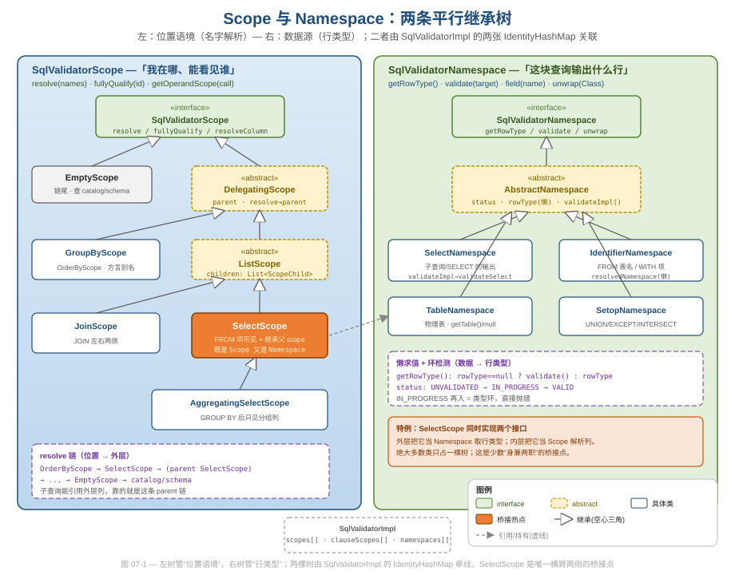
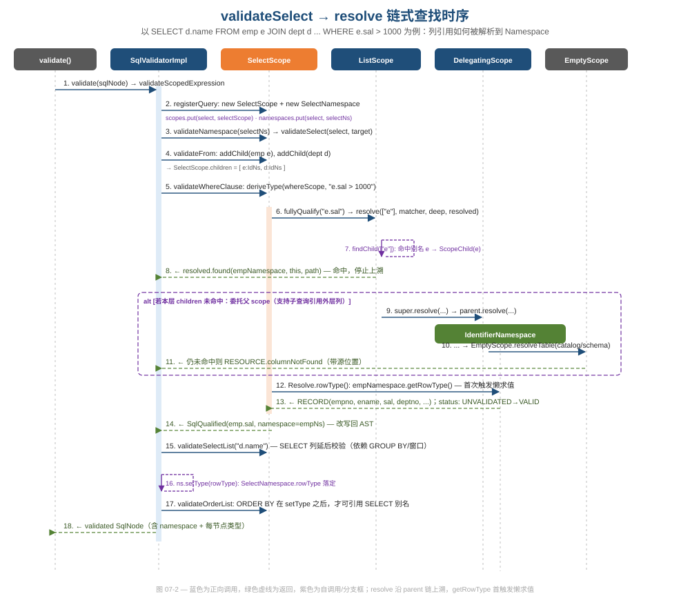

# 第 07 篇 · Validator：Scope/Namespace 双抽象

> 校验阶段要同时回答两个看似缠在一起、实则正交的问题：「这个名字在这里指的是谁」和「这块查询输出什么行类型」。Calcite 用两条平行的接口树——`SqlValidatorScope` 与 `SqlValidatorNamespace`——把它们彻底拆开。本篇讲这套关注点分离为什么是 Validator 这个「大类」唯一能被人读懂的原因。
> 基线 commit `111030383` · 前置阅读：[第 03 篇 · SqlNode AST](03-sqlnode.md)、[第 06 篇 · 类型系统](06-type-system.md)

## TL;DR

- 校验 = **名字解析** + **类型推导**，二者正交。Calcite 用 `SqlValidatorScope`（位置语境）与 `SqlValidatorNamespace`（数据源行类型）两个接口分别承载，互不污染。
- `Scope` 回答「我站在 SQL 的哪个位置、能看见哪些表/列」；`Namespace` 回答「这段查询/这张表产出什么 `RelDataType`」。一个 `SELECT` 同时拥有多个 scope（WHERE / SELECT / ORDER 各一），但只对应一个 select namespace。
- `resolve()` 是名字解析的核心：本层 `children` 找不到就 `super.resolve()` 委托 `parent`，一路上溯到 `EmptyScope` 查 catalog。**这条 parent 链就是「子查询能引用外层列」的全部秘密**。
- `Namespace.getRowType()` 是**懒求值**：行类型在第一次被问到时才推导，用 `status` 三态机（`UNVALIDATED → IN_PROGRESS → VALID`）顺手做了类型环检测。
- `SelectScope` 是唯一**同时实现两个接口**的桥接点：外层把它当 Namespace 取行类型，内层把它当 Scope 解析列。
- 方言差异（`GROUP BY` 用别名、`ORDER BY` 用序号、字符串别名……）不写死在算法里，而是收敛到 `SqlConformance` 的一组布尔开关，由 scope 在解析时查询——一份代码服务几十种方言。

---

## 1. 校验到底在解决什么

把一棵已经语法正确的 `SqlNode` 树交给 Validator，它要做的事可以浓缩成两类：

1. **名字解析（name resolution）**：`SELECT d.name FROM emp e JOIN dept d` 里的 `d`、`e` 是谁？`name` 属于哪张表？`sal` 不写表前缀时落到哪个 `children`？歧义了要报错。
2. **类型推导（type derivation）**：每个表达式节点的 `RelDataType` 是什么？`e.sal > 1000` 两边类型相容吗？整段 `SELECT` 的输出行类型长什么样？

新手很容易把这两件事揉在一个大对象里——「校验上下文」既存可见的表、又存推导出的类型。Calcite 没有。它发现这两个问题的「坐标系」根本不同：

- 名字解析是**按位置**的。同一张 `emp` 表，在 WHERE 子句里可见的列集合，和在 `GROUP BY` 之后的 SELECT 子句里可见的列集合，是不一样的（聚合后只剩分组列）。坐标是「你站在 SQL 文本的哪个位置」。
- 类型推导是**按数据源**的。`emp` 这张表无论被哪个子句引用，它的行类型 `RECORD(empno, ename, sal, ...)` 都是同一个。坐标是「这块数据从哪来」。

于是 Calcite 给出两个接口：`SqlValidatorScope` 管前者，`SqlValidatorNamespace` 管后者。这是本篇最重要的一句话——**位置语境与数据源行类型，是两个正交维度，各用一棵继承树。**



上图左树是 `Scope`，右树是 `Namespace`。注意两棵树几乎不交叉：`Scope` 的子类（`SelectScope`/`JoinScope`/`GroupByScope`/...）都在讲「这里能看见谁」，`Namespace` 的子类（`SelectNamespace`/`IdentifierNamespace`/`TableNamespace`/...）都在讲「这里输出什么行」。唯一横跨两侧、被涂成橙色的 `SelectScope`，是少数「身兼两职」的桥接点（见 §5）。两棵树通过 `SqlValidatorImpl` 里的几张 `IdentityHashMap` 牵线（见 §3）。

> 工程视角（关注点分离）：这套拆分的收益不在「少写代码」，而在「每个类只为一个问题负责」。当你读 `SelectScope` 时不用关心类型怎么推；读 `SelectNamespace` 时不用关心 `d` 这个别名怎么找到。`SqlValidatorImpl` 是个上万行的大类，正是这两条接口把它的复杂度切成了可独立理解的两摞。

---

## 2. Scope：位置语境与 resolve 链

`SqlValidatorScope` 的 javadoc 把它定义为「parse tree 中表达式可以出现的任意位置，或任意带列的位置」。它的核心方法只有一个：

```java
// core/src/main/java/org/apache/calcite/sql/validate/SqlValidatorScope.java
/**
 * Looks up a node with a given name. Adds the match(es) to the resolved if found.
 */
void resolve(List<String> names, SqlNameMatcher nameMatcher, boolean deep,
    Resolved resolved);
```

`resolve` 是个**回调式**接口（结果写进 `Resolved`，而非返回值），这让它能记录「找到了几个匹配」用于歧义检测。配套的 `Resolved`/`Resolve`/`Path` 都是 `SqlValidatorScope` 的内部类——`Path` 是「一个标识符被解析时走过的步骤序列」，`Resolve` 把命中的 `namespace`、是否 nullable、命中所在的 `scope`、以及 `path` 打包在一起（见 `SqlValidatorScope.java` 末尾的 `class Resolve`）。

### 2.1 委托链：parent 不是 AST 的父节点

scope 的继承结构由 `DelegatingScope` 统领。它的字段注释一句话点破了精髓：

```java
// core/src/main/java/org/apache/calcite/sql/validate/DelegatingScope.java
/**
 * Parent scope. This is where to look next to resolve an identifier; it is
 * not always the parent object in the parse tree.
 *
 * <p>This is never null: at the top of the tree, it is an {@link EmptyScope}.
 */
protected final SqlValidatorScope parent;
```

`parent` 是「解析名字时下一个该去问的 scope」，**不等于** AST 的父节点。`DelegatingScope.resolve` 的默认实现就是把请求原样转交父级：

```java
// DelegatingScope.java
@Override public void resolve(List<String> names, SqlNameMatcher nameMatcher,
    boolean deep, Resolved resolved) {
  parent.resolve(names, nameMatcher, deep, resolved);
}
```

`ListScope`（`SelectScope`/`JoinScope` 的共同基类）则在转交前先查自己的 `children`：

```java
// core/src/main/java/org/apache/calcite/sql/validate/ListScope.java
@Override public void resolve(List<String> names, SqlNameMatcher nameMatcher,
    boolean deep, Resolved resolved) {
  // First resolve by looking through the child namespaces.
  final ScopeChild child0 = findChild(names, nameMatcher);
  if (child0 != null) {
    final Step path = Path.EMPTY.plus(child0.namespace.getRowType(),
        child0.ordinal, child0.name, StructKind.FULLY_QUALIFIED);
    resolved.found(child0.namespace, child0.nullable, this, path,
        ImmutableList.of());
    return;
  }
  // ... deep 模式递归进 record 字段 ...

  // Then call the base class method, which will delegate to the parent scope.
  super.resolve(names, nameMatcher, deep, resolved);
}
```

这就是经典的责任链（Chain of Responsibility）：**本层命中就停，未命中就 `super.resolve()` 把球抛给 `parent`，一路传到链尾 `EmptyScope`**。`EmptyScope.resolve` 是空实现（链终止），但它的 `resolveTable` 会去 catalog/schema 里找表。

### 2.2 子查询为什么能引用外层列

这条 parent 链不是为了好看。它直接解释了 SQL 一个最反直觉的能力——**相关子查询**：

```sql
SELECT * FROM emp e
WHERE e.sal > (SELECT avg(sal) FROM emp WHERE deptno = e.deptno)
```

内层子查询里的 `e.deptno`，在内层自己的 `children`（只有内层那个 `emp`）里找不到。`ListScope.resolve` 走到 `super.resolve()`，沿 `parent` 链上溯到外层 `SelectScope`，在那里命中别名 `e`。**没有任何一行专门处理「相关子查询」的代码**——它是 parent 链的自然涌现。

> 设计与代码质量：把「外层可见性」实现成数据结构（一条 parent 链）而非控制流（一堆 if 判断在不在子查询里），是这套设计最漂亮的地方。新增一种 scope 类型，只要接上 parent 链，就自动获得「能看见外层」的能力。

`SelectScope` 的类注释用一个例子把可见性规则写得明明白白：

```
SELECT expr1 FROM t1, t2, (SELECT expr2 FROM t3) AS q3
WHERE c1 IN (SELECT expr3 FROM t4) ORDER BY expr4
```
- expr1 能看见 t1, t2, q3
- expr2 只能看见 t3
- expr3 能看见 t4，**以及** t1, t2（相关子查询上溯）
- expr4 能看见 t1, t2, q3，**外加（取决于方言）SELECT 子句里定义的别名**

最后一条「取决于方言」是 §6 的伏笔。

### 2.3 ScopeChild：别名 + 序号 + nullable 三合一

`ListScope` 的 `children` 不是裸的 namespace 列表，而是一串 `ScopeChild`——每个 child 记着「序号、别名、namespace、是否 nullable」四元组。`addChild` 在登记时一次性把这些信息钉死：

```java
// core/src/main/java/org/apache/calcite/sql/validate/ListScope.java:61
@Override public void addChild(SqlValidatorNamespace ns, String alias,
    boolean nullable) {
  requireNonNull(alias, "alias");
  children.add(new ScopeChild(children.size(), alias, ns, nullable));
}
```

`nullable` 这一位看着不起眼，却扛着一个 SQL 正确性的硬骨头——**外连接的「补 null」语义**。`isChildNullable` 的注释把它讲得很具体：

```java
// ListScope.java:101
/**
 * Whether the ith child namespace produces nullable result.
 *
 * <p>For example, in below query, SELECT * FROM EMPS LEFT OUTER JOIN DEPT,
 * the namespace which corresponding to 'DEPT' is nullable.
 */
public boolean isChildNullable(int i) {
  return children.get(i).nullable;
}
```

关键洞察：`DEPT` 这张表**本身**的列不是可空的（它的 `IdentifierNamespace.getRowType()` 给出的是表定义的原始类型），但在 `LEFT JOIN` 的右侧，匹配不上时整行要补 null。Calcite 没有去改 `DEPT` 的 namespace（那会污染数据源的真实行类型），而是把「在这个位置可空」这条**位置相关**的信息放进 `ScopeChild.nullable`。`resolve` 命中后由 `Resolve.rowType()` 现场叠加可空性：

```java
// SqlValidatorScope.java （class Resolve 内）
public RelDataType rowType() {
  return namespace.getValidator().getTypeFactory()
      .createTypeWithNullability(namespace.getRowType(), nullable);
}
```

这是双抽象分工的又一处教科书示例：**namespace 给「数据源的本征行类型」，scope 给「这个位置叠加的可空性」**，两者在 `Resolve` 处合成最终类型。如果当初把可空性塞进 namespace，同一张表在 inner join 与 left join 两侧就得是两个 namespace，数据源行类型的「唯一性」就破了。

> 设计与代码质量：可空性是「位置属性」不是「数据属性」——这个判断决定了它该归 scope 而非 namespace。把易混的属性放对维度，是双抽象能保持干净的前提；放错一个，两棵树就会开始互相渗透。

### 2.4 一个 SELECT，多个 scope

值得强调：一条 `SELECT` 不是只对应一个 scope。`SqlValidatorImpl` 用一张 `clauseScopes` 表把「(select, 子句) → scope」一一映射：

```java
// core/src/main/java/org/apache/calcite/sql/validate/SqlValidatorImpl.java:1357
@Override public SqlValidatorScope getWhereScope(SqlSelect select) {
  return getScope(select, Clause.WHERE);
}
@Override public SqlValidatorScope getSelectScope(SqlSelect select) {
  return getScope(select, Clause.SELECT);
}
@Override public SqlValidatorScope getGroupScope(SqlSelect select) {
  // Yes, it's the same as getWhereScope
  return getScope(select, Clause.WHERE);
}
@Override public SqlValidatorScope getOrderScope(SqlSelect select) {
  return getScope(select, Clause.ORDER);
}
```

注意那行带着自嘲的注释 `// Yes, it's the same as getWhereScope`——`GROUP BY` 和 `WHERE` 共用一个 scope（分组前都能看见 FROM 的全部列），而 SELECT 子句在聚合查询里会换成 `AggregatingSelectScope`（聚合后只剩分组列可见）。这些 scope 在 `registerQuery` 里一次性建好：

```java
// SqlValidatorImpl.java:3049 （registerQuery 的 SELECT 分支）
final SqlValidatorScope selectScope2 =
    isAggregate(select)
        ? new AggregatingSelectScope(selectScope, select, false)
        : selectScope;
clauseScopes.put(IdPair.of(select, Clause.SELECT), selectScope2);
// ...
if (select.getGroup() != null) {
  GroupByScope groupByScope =
      new GroupByScope(selectScope, select.getGroup(), select);
  clauseScopes.put(IdPair.of(select, Clause.GROUP_BY), groupByScope);
}
```

> 数据/位置精确性：「不同子句、不同可见列集合」是 SQL 语义里最容易出 bug 的地方（典型：`SELECT count(*), name FROM emp` 该不该报错）。Calcite 把它建模成「每个子句一个 scope 对象」，于是「能不能引用这个列」退化成「这个 scope 的 resolve 能不能命中」——一个统一机制，覆盖所有子句规则。

---

## 3. Namespace：数据源行类型与懒求值

`SqlValidatorNamespace` 的 javadoc 第一句：「namespace 描述一段 SQL 查询返回的关系」。它的核心方法是 `getRowType()`：

```java
// core/src/main/java/org/apache/calcite/sql/validate/SqlValidatorNamespace.java
/**
 * Returns the row type of this namespace... If the scope's type has not yet
 * been derived, derives it.
 * @return Row type of this namespace, never null, always a struct
 */
RelDataType getRowType();
```

注意注释里那句 "If ... has not yet been derived, derives it"——这是**懒求值**的接口契约。具体实现在 `AbstractNamespace`：

```java
// core/src/main/java/org/apache/calcite/sql/validate/AbstractNamespace.java:123
@Override public RelDataType getRowType() {
  if (rowType == null) {
    validator.validateNamespace(this, validator.unknownType);
    requireNonNull(rowType, "validate must set rowType");
  }
  return rowType;
}
```

第一次问 `getRowType()` 时 `rowType == null`，触发一次完整校验把它算出来并缓存；之后再问就直接返回。子查询的行类型不会在「构造时」算，而是「第一次被引用时」才算——这对深层嵌套查询是关键的性能与正确性保证（没被引用的分支可能根本不需要推类型）。

### 3.1 status 三态机：顺手做环检测

`getRowType` 背后的 `validate` 用一个三态 `status` 字段把「懒求值」「幂等」「环检测」三件事一并解决：

```java
// AbstractNamespace.java:89
@Override public final void validate(RelDataType targetRowType) {
  switch (status) {
  case UNVALIDATED:
    try {
      status = SqlValidatorImpl.Status.IN_PROGRESS;
      checkArgument(rowType == null,
          "Namespace.rowType must be null before validate has been called");
      RelDataType type = validateImpl(targetRowType);
      requireNonNull(type, "validateImpl() returned null");
      setType(type);
    } finally {
      status = SqlValidatorImpl.Status.VALID;
    }
    break;
  case IN_PROGRESS:
    throw new AssertionError("Cycle detected during type-checking");
  case VALID:
    break;
  default:
    throw Util.unexpected(status);
  }
}
```

读法：
- `UNVALIDATED`：首次进入，置 `IN_PROGRESS`，调子类的 `validateImpl`（模板方法）算类型。
- `IN_PROGRESS`：如果在 `validateImpl` 的递归里又回到了同一个 namespace，说明类型推导成环（A 的行类型依赖 B、B 又依赖 A），直接抛 `Cycle detected`。
- `VALID`：已算过，幂等返回。

`validate` 被声明为 `final`，子类只能改写 `protected abstract RelDataType validateImpl(...)`——这是教科书式的**模板方法（Template Method）**：父类锁死「状态机骨架 + 环检测」，子类只填「这块到底怎么推类型」。

```java
// SelectNamespace.java:61 — 子类只关心「怎么推」
@Override public RelDataType validateImpl(RelDataType targetRowType) {
  validator.validateSelect(select, targetRowType);
  return requireNonNull(rowType, "rowType");
}
```

> 设计与代码质量：把环检测做成「进入时标 `IN_PROGRESS`、退出时标 `VALID`」的 try/finally 模式，比维护一个「正在校验集合」的 `Set` 更轻、更难写错。代价是这个保护**只在单个 namespace 的 validate 边界生效**——跨更复杂结构的环（例如元数据层）需要别的机制（参见 [第 13 篇 · 元数据与代价](13-metadata-cost.md) 的 `CyclicMetadataException`）。这是个真实的边界，不是 bug，但读者要知道它的作用范围。

### 3.2 Namespace 可能被层层包裹：别 instanceof

`SqlValidatorNamespace` 的 javadoc 有一段很重要的告诫：

```
... if you are looking at a SELECT query and call getNamespace(node), you may
not get a SelectNamespace. Why? Because the validator is allowed to wrap
namespaces in other objects ... Don't try to cast the namespace or use
instanceof; use unwrap(Class) and isWrapperFor(Class) instead.
```

也就是说，外面可能把你的 `SelectNamespace` 包了一两层（比如带别名列表的 `AS t(c1,c2)`）。所以 `validateSelect` 里取自己的 namespace 用的是 `unwrap` 而不是强转：

```java
// SqlValidatorImpl.java:4187
final SelectNamespace ns =
    getNamespaceOrThrow(select).unwrap(SelectNamespace.class);
```

`unwrap`/`isWrapperFor` 是 Calcite 全仓贯穿的「能力查询」惯用法（schema 层的 `Wrapper` 同理，见 [第 17 篇 · 扩展性架构](17-extensibility.md)）。它把「我需要的是哪种 namespace」从「它的具体运行时类是什么」里解耦出来——装饰链可以任意加层，调用方代码不动。

### 3.3 两棵树怎么牵线

`SqlValidatorImpl` 用两张以**对象身份**为键的 `IdentityHashMap` 把 scope 与 namespace 关联到具体的 `SqlNode`：

```java
// SqlValidatorImpl.java:224
/** Maps query node objects to the scope created from them. */
protected final IdentityHashMap<SqlNode, SqlValidatorScope> scopes =
    new IdentityHashMap<>();
// SqlValidatorImpl.java:244
/** Maps a node to the namespace which describes what columns they contain. */
protected final IdentityHashMap<SqlNode, SqlValidatorNamespace> namespaces =
    new IdentityHashMap<>();
```

用 `IdentityHashMap` 而非 `HashMap` 是刻意的：AST 里两个结构相等的子表达式（比如两处 `x + 1`）是**不同实例**，必须按引用区分；用 `equals` 哈希会把它们错配成同一个 scope/namespace。同一文件里缓存「节点 → 推导类型」的 `nodeToTypeMap` 也用 `IdentityHashMap`，注释专门说了 null 字面量必须按实例区分——理由一脉相承。`registerNamespace` 负责把 namespace 落进表里，并在有 `usingScope` 时把它登记为某个 scope 的 child：

```java
// SqlValidatorImpl.java:2469
protected void registerNamespace(@Nullable SqlValidatorScope usingScope,
    @Nullable String alias, SqlValidatorNamespace ns, boolean forceNullable) {
  SqlValidatorNamespace namespace = namespaces.get(requireNonNull(ns.getNode()));
  if (namespace == null) {
    namespaces.put(requireNonNull(ns.getNode()), ns);
    namespace = ns;
  }
  if (usingScope != null) {
    // ... alias 非空校验 ...
    usingScope.addChild(namespace, alias, forceNullable);
  }
}
```

`addChild` 落到 `ListScope`，把 namespace 包成一个带序号和别名的 `ScopeChild` 加入 `children`——这正是 §2.1 里 `findChild` 遍历的那个列表。两棵树就此咬合：**scope 的 `children` 里装的是 namespace**。

---

## 4. 一次完整的 resolve：把图读活

把前面拆开的零件串起来，看 `SELECT d.name FROM emp e JOIN dept d ON e.deptno = d.deptno WHERE e.sal > 1000 GROUP BY d.name` 是怎么走完校验的。



对照上图的关键步骤：

1. **建表（步骤 2-4）**：`registerQuery` 为这个 `SELECT` 造一个 `SelectScope` 和一个 `SelectNamespace`，写进 `scopes`/`namespaces`。`validateFrom` 把 `emp e`、`dept d` 各包成 `IdentifierNamespace`，通过 `addChild` 登记为 `SelectScope.children`。
2. **解析 `e.sal`（步骤 5-8）**：校验 WHERE 时 `deriveType` 要给 `e.sal` 定类型，先 `fullyQualify("e.sal")`，内部 `resolve(["e"])`。`ListScope.findChild` 在 `children` 里按别名匹配命中 `e` 对应的 namespace，`resolved.found(...)` 写回结果，**本层命中、不再上溯**。
3. **未命中的回退（步骤 9-11，alt 框）**：如果引用的是个本层没有的列（典型：相关子查询里的外层列），`ListScope.resolve` 走 `super.resolve()` → `parent.resolve()`，沿链直到 `EmptyScope` 查 catalog。全程没命中才抛 `RESOURCE.columnNotFound`——而且报错带源位置（`SqlParserPos`，见 [第 03 篇](03-sqlnode.md)）。
4. **懒求出行类型（步骤 12-13）**：`Resolve.rowType()` 调 `namespace.getRowType()`，**这是 `emp` 行类型第一次被真正推导**，`status` 从 `UNVALIDATED` 翻到 `VALID`。
5. **改写回 AST（步骤 14）**：`fullyQualify` 返回 `SqlQualified`，把 `e.sal` 规范化成完全限定形式（必要时纠正大小写、补全表别名），方便后续 sql2rel 直接按下标取列。
6. **SELECT 列延后校验（步骤 15-18）**：注意 `validateSelect` 里 SELECT 列表是**最后**才校验的，注释说得很直白：

```java
// SqlValidatorImpl.java:4254
// Validate the SELECT clause late, because a select item might
// depend on the GROUP BY list, or the window function might reference
// window name in the WINDOW clause etc.
final RelDataType rowType = validateSelectList(selectItems, select, targetRowType);
ns.setType(rowType);
validateHavingClause(select);
// ...
// Validate ORDER BY after we have set ns.rowType because in some
// dialects you can refer to columns of the select list, e.g.
// "SELECT empno AS x FROM emp ORDER BY x"
validateOrderList(select);
```

校验子句的顺序（WHERE → GROUP → SELECT → HAVING → ORDER）不是随意排的，而是被「谁依赖谁」约束着：SELECT 列可能引用 `GROUP BY` 结果，`ORDER BY` 可能引用 SELECT 别名——所以 `ns.setType(rowType)` 必须在 `validateOrderList` 之前完成。这是把「SQL 子句的逻辑求值顺序」显式编码进了校验流程。

> 软件工程（可读性）：`validateSelect` 是个长方法，但它从头到尾是一条线性的子句序列，每个子句一个 `validateXxxClause` 调用。复杂度被「按子句切函数」摊平了，没有深层嵌套的控制流——这是大方法仍然可读的关键。

### 4.1 fullyQualify：解析顺带做规范化

上面步骤 5 一笔带过的「改写回 AST」其实是 `DelegatingScope.fullyQualify` 这个近 300 行方法在干活。它远不止「找到列」——它在解析成功后**就地把标识符改写成规范形式**，把后续阶段的麻烦提前消化掉。`fullyQualify` 的 javadoc 给的例子：

```java
// core/src/main/java/org/apache/calcite/sql/validate/DelegatingScope.java:255
/**
 * Converts an identifier into a fully-qualified identifier. For example,
 * the "empno" in "select empno from emp natural join dept" becomes
 * "emp.empno". If the identifier cannot be resolved, throws. Never returns null.
 */
```

它顺手做掉的规范化至少有四类，都是真实出现在源码里的分支：

1. **补全表前缀**：`empno` → `emp.empno`。`case 1`（无前缀单段）分支先 `findQualifyingTableNames` 找唯一拥有该列的表，命中多个则抛 `columnAmbiguous`。
2. **大小写纠正**：当 catalog 大小写敏感、但用户写错了大小写，会用 `SqlNameMatchers.liberal()` 再试一次，命中就抛带 "Did you mean" 提示的友好错误（`columnNotFoundDidYouMean` / `tableNameNotFoundDidYouMean`）。
3. **别名大小写对齐**：`SELECT e.empno FROM Emp AS E` 里，把 `e.empno` 改成定义时的 `E.empno`，源码注释直接写了这个例子。
4. **去掉过度限定**：`schema.emp.deptno` 简化成 `emp.deptno`（`if (i > 1)` 分支），注释解释了为何这样安全。

歧义处理还有个微妙之处：当多条解析路径都命中时，它用一个 `Comparator<Resolve>` 排序——**「用更少隐式步骤的解析胜出」**，相同再比 path 长度：

```java
// DelegatingScope.java:479 （fullyQualify 内，多命中时）
final Comparator<Resolve> c = new Comparator<Resolve>() {
  @Override public int compare(Resolve o1, Resolve o2) {
    // Name resolution that uses fewer implicit steps wins.
    int c = Integer.compare(worstKind(o1.path), worstKind(o2.path));
    if (c != 0) {
      return c;
    }
    return Integer.compare(o1.path.stepCount(), o2.path.stepCount());  // Shorter path wins
  }
  // worstKind: path 里 StructKind 最差（最隐式）的那一步
};
```

`Path`/`Step` 这套结构（见 §2 提到的 `SqlValidatorScope` 内部类）在这里收获回报：每个解析结果都带着「我走了哪几步、每步是显式列还是 PEEK 字段（record 隐式展开）」的轨迹，于是「哪条解析最不绕」可以被量化比较，而不是靠拍脑袋的优先级常量。

> 软件工程（把麻烦前移）：`fullyQualify` 在校验期把标识符一次性钉成规范形式，意味着下游 sql2rel（[第 08 篇](08-sql-to-rel.md)）拿到的列引用都是干净、无歧义、大小写正确的。这是「在最有上下文的地方解决问题」的典型——大小写、隐式前缀、记录字段展开这些方言/语义细节，越往后越难处理，校验期是收口的最佳时机。代价是 `fullyQualify` 本身成了个巨型方法，分支密集、可读性偏低——这是「集中复杂度」换「下游简单」的真实权衡。

---

## 5. SelectScope：唯一的桥接点

前面说两棵树几乎不交叉，唯一的例外是 `SelectScope`。它的类注释把这件事讲得很清楚：

```java
// core/src/main/java/org/apache/calcite/sql/validate/SelectScope.java:42
/**
 * This object is both a {@link SqlValidatorScope} and a
 * {@link SqlValidatorNamespace}. In the query
 *   SELECT name FROM (SELECT * FROM emp WHERE gender = 'F')
 * we need to use the SelectScope as a SqlValidatorNamespace when resolving
 * 'name', and as a SqlValidatorScope when resolving 'gender'.
```

> 注：`SelectScope extends ListScope`（一棵 Scope 树），它能「兼任 Namespace」靠的是与之配对的 `SelectNamespace`，二者经由 `scopes`/`namespaces` 两张表挂在同一个 `SqlSelect` 节点上。换言之，「同一段子查询既是位置语境又是数据源」这件事，在实现上是「一个 `SqlSelect` 同时有一个 SelectScope 和一个 SelectNamespace」。

为什么这个桥接是必要的？因为子查询天生横跨两个维度：

- 站在**子查询内部**看 `gender = 'F'`，子查询是个「位置语境」——你在这里能看见 `emp` 的列。这是 Scope 视角。
- 站在**外层**看 `SELECT name FROM (...)`，子查询是个「数据源」——它产出 `name` 这一列供外层引用。这是 Namespace 视角。

同一段 `SELECT` 文本，换个观察位置就换一种身份。Calcite 用「同一个 `SqlSelect` 节点既登记 SelectScope 又登记 SelectNamespace」来表达这种双重性，而不是硬造一个「既是位置又是数据」的混合类型。`SelectNamespace.validateImpl` 直接回调 `validator.validateSelect(select, ...)`，校验逻辑只有一份，两个身份共享。

这也回收了 §1 的论断：拆成两棵树，并不妨碍「确实需要双重身份」的对象存在——它只是要求你**显式承认**它身兼两职，而不是让所有对象都默认混杂。

---

## 6. 方言容差：把差异收敛成开关

§2.2 留了个尾巴：「ORDER BY 能否引用 SELECT 别名，取决于方言」。标准 SQL 不允许 `GROUP BY x`（x 是 SELECT 别名），但 MySQL、BigQuery 允许；`GROUP BY 2`（按序号分组）也是非标准但常见。Calcite 不在解析算法里写死任何一种方言，而是把所有这类差异收敛到一个接口——`SqlConformance`：

```java
// core/src/main/java/org/apache/calcite/sql/validate/SqlConformance.java
/** Whether to allow aliases from the SELECT clause to be used as column
 *  names in the GROUP BY clause. ... true in BABEL, BIG_QUERY, LENIENT,
 *  MYSQL_5; false otherwise. */
boolean isGroupByAlias();

/** Whether 'GROUP BY 2' is interpreted to mean 'group by the 2nd column
 *  in the select list'. ... */
boolean isGroupByOrdinal();

/** Whether to allow aliases from the SELECT clause to be used in HAVING. */
boolean isHavingAlias();

/** Whether this dialect allows character literals as column aliases. */
boolean allowCharLiteralAlias();
```

这些方法返回的不是「怎么做」，而是「这个方言允不允许」。`GroupByScope.validateExpr` 在校验 `GROUP BY` 表达式时，会先调 `validator.extendedExpandGroupBy(...)`，后者内部根据 `isGroupByAlias()` / `isGroupByOrdinal()` 决定要不要把别名/序号展开成真正的列引用：

```java
// core/src/main/java/org/apache/calcite/sql/validate/GroupByScope.java:58
@Override public void validateExpr(SqlNode expr) {
  SqlNode expanded = validator.extendedExpandGroupBy(expr, this, select);
  // expression needs to be valid in parent scope too
  parent.validateExpr(expanded);
}
```

而 `DelegatingScope` 里那个 `qualifyUsingAlias` 工具方法（用于 ORDER BY/measure 引用 SELECT 别名）也是同一思路——它的 javadoc 明说「Used when resolving ORDER BY items (when the conformance allows order by alias)」。

> 数据工程视角（方言）：Calcite 是个要同时服务 MySQL、PostgreSQL、Oracle、BigQuery、Spark…… 的联邦前端。如果方言差异散落在解析算法的各个 `if` 里，加一个方言就要改几十处。`SqlConformance` 把这些差异**全部上提成接口上的布尔开关**：核心算法只问「这个开关开没开」，新增方言 = 实现一个 `SqlConformance`（或选一个 `SqlConformanceEnum` 预设），核心代码零改动。这是策略对象（Strategy）在「容差」场景的标准用法。
>
> 坑（要诚实写）：`SqlConformance` 是个**胖接口**——随版本演进不断加方法（`isSelectAlias` 返回的甚至是个三值枚举 `SelectAliasLookup{UNSUPPORTED, LEFT_TO_RIGHT, ANY}`）。自定义实现一个 `SqlConformance` 而不是继承 `SqlConformanceEnum`/`SqlAbstractConformance`，会随升级不断撞上新增的抽象方法。实践中应继承现成基类、只覆写关心的几个开关，否则容易被接口膨胀反噬。方言相关的解析侧细节归 [第 09 篇 · Parser 代码生成](09-parser-codegen.md)，本篇只讲校验侧如何消费这些开关。

---

## 设计模式与工程小结

| 模式 / 手法 | 出现位置 | 解决什么 | 可借鉴点 / 坑 |
|---|---|---|---|
| 关注点分离（双接口正交） | `SqlValidatorScope` vs `SqlValidatorNamespace` | 把「名字解析」与「类型推导」两个正交维度拆成两棵树 | 大类（`SqlValidatorImpl` 万行）的复杂度被两条接口切成可独立理解的两摞 |
| 责任链 Chain of Responsibility | `ListScope.resolve` → `super.resolve` → `parent.resolve` → `EmptyScope` | 名字解析自本层向外层逐级查找 | 相关子查询「能看见外层列」是 parent 链的自然涌现，无专门分支 |
| 委托 / 装饰 | `DelegatingScope`、namespace 的 wrap + `unwrap(Class)` | scope 默认转交父级；namespace 可层层包裹 | 用 `unwrap`/`isWrapperFor` 做能力查询，不要 `instanceof`/强转 |
| 懒求值 Lazy evaluation | `AbstractNamespace.getRowType()` | 行类型第一次被问到才推导并缓存 | 未被引用的子查询分支不必推类型；按需计算省一遍遍历 |
| 模板方法 Template Method | `AbstractNamespace.validate`(final) + `validateImpl`(abstract) | 父类锁死状态机骨架，子类只填类型推导 | try/finally 标 `IN_PROGRESS`/`VALID` 顺手做环检测；注意保护只在单 namespace 边界 |
| 三态状态机 | `status: UNVALIDATED→IN_PROGRESS→VALID` | 幂等 + 懒求值 + 类型环检测一并解决 | 比维护「正在校验集合」更轻、更难写错 |
| 身份哈希表 IdentityHashMap | `scopes` / `namespaces` / `nodeToTypeMap` | 按对象引用而非 `equals` 把 scope/ns/type 挂到 AST 节点 | 结构相等但实例不同的子表达式必须区分，否则错配 |
| 策略对象 Strategy（容差） | `SqlConformance` 的布尔/枚举开关 | 把方言差异上提为开关，核心算法只问开没开 | 新增方言零改核心；坑：胖接口随版本膨胀，应继承基类只覆写关心项 |
| 桥接 Bridge（双身份） | `SelectScope`（同时是 Scope 与 Namespace） | 子查询天生横跨「位置语境」与「数据源」两维 | 显式承认双重身份，而非造一个混杂类型 |

---

## 对照阅读建议（动手）

- **断点**：`core/src/main/java/org/apache/calcite/sql/validate/ListScope.java` → `ListScope#resolve`
  - **观察**：对相关子查询（如 `WHERE e.sal > (SELECT avg(sal) FROM emp WHERE deptno = e.deptno)`），内层解析 `e.deptno` 时 `findChild` 返回 `null`，单步进 `super.resolve()`，看 `parent` 指向的是外层 `SelectScope`；对比解析内层自己的 `sal` 时 `findChild` 当场命中。
  - **运行**：`./gradlew :core:test --tests org.apache.calcite.test.SqlValidatorTest`

- **断点**：`core/src/main/java/org/apache/calcite/sql/validate/AbstractNamespace.java` → `AbstractNamespace#validate`
  - **观察**：在 `case UNVALIDATED` 处看 `status` 如何被置 `IN_PROGRESS` 再 `VALID`；给一个互相引用的 WITH/视图构造类型环，确认会命中 `case IN_PROGRESS` 抛 `Cycle detected`。同时在 `getRowType()` 设条件断点 `rowType == null`，数它对同一个子查询只触发一次。

- **断点**：`core/src/main/java/org/apache/calcite/sql/validate/SqlValidatorImpl.java` → `SqlValidatorImpl#validateSelect`
  - **观察**：单步走过 `validateWhereClause → validateGroupClause → validateSelectList → ns.setType → validateOrderList` 的固定顺序；在 `ns.setType(rowType)` 处看 `SelectNamespace.rowType` 从 null 变为完整 RECORD，确认它发生在 `validateOrderList` 之前（这样 ORDER BY 才能引用 SELECT 别名）。

- **断点**：`core/src/main/java/org/apache/calcite/sql/validate/GroupByScope.java` → `GroupByScope#validateExpr`
  - **观察**：用不同 `SqlConformance`（DEFAULT vs MYSQL_5）跑 `GROUP BY x`（x 为 SELECT 别名），看 `extendedExpandGroupBy` 是否把别名展开成真实列引用；DEFAULT 下应报错，MYSQL_5 下应通过。

---

## 延伸阅读

- 本系列：
  - [第 03 篇 · SqlNode AST：数据/行为分离](03-sqlnode.md) —— Validator 校验的输入就是 `SqlNode` 树；`SqlParserPos` 的源位置正是本篇错误信息能精确定位的来源。
  - [第 06 篇 · 类型系统：Flyweight + 策略](06-type-system.md) —— 本篇只讲「何时触发类型推导」；`ReturnTypes`/`OperandTypes` 这套推导策略本体归 06。
  - [第 08 篇 · SqlToRel：Blackboard + Convertlet](08-sql-to-rel.md) —— 校验后的 namespace/scope 与已规范化的 `SqlQualified` 是 sql2rel 的直接输入。
  - [第 09 篇 · Parser 代码生成](09-parser-codegen.md) —— 方言在解析侧的体现（关键字/语法扩展）；`SqlConformance` 的解析侧用法归 09。
  - [第 13 篇 · 元数据与代价](13-metadata-cost.md) —— 另一处环检测（`CyclicMetadataException`），可与本篇 namespace 的 `status` 环检测对照其作用范围差异。
  - [第 17 篇 · 扩展性架构](17-extensibility.md) —— schema 层的 `Wrapper.unwrap(Class)` 与本篇 namespace 的 `unwrap` 是同一能力查询惯用法。
- 官方文档：
  - `site/_docs/reference.md` —— SQL 参考与各 `SqlConformanceEnum` 行为差异。
  - `site/_docs/adapter.md` —— 方言/适配器如何配合校验与下推。
