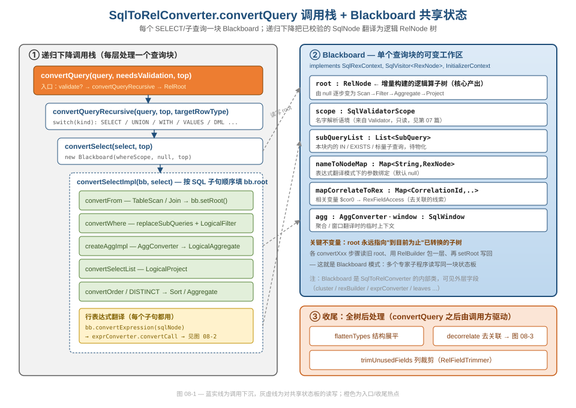
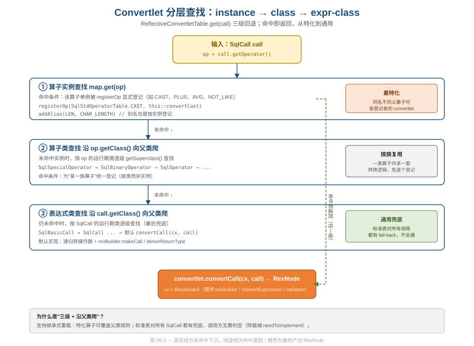
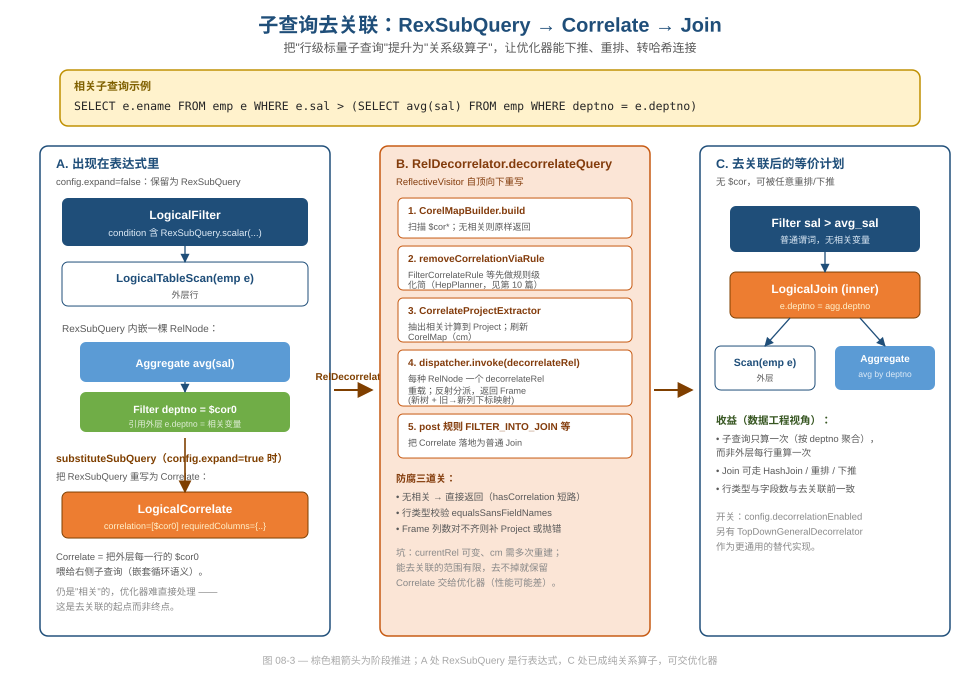

# 第 08 篇 · SqlToRel：Blackboard + Convertlet 注册表

> 已校验的 `SqlNode` 树如何变成关系代数 `RelNode` 树？本篇拆解 `SqlToRelConverter` 的三件核心装置——共享状态板 `Blackboard`、反射式 Convertlet 注册表、子查询去关联——看 Calcite 如何用三个经典设计模式驯服"AST→关系代数"这道脏活。
> 基线 commit `111030383` · 前置阅读：[第 02 篇 · 四层 IR](02-ir-overview.md)、[第 03 篇 · SqlNode](03-sqlnode.md)、[第 07 篇 · Validator](07-validator.md)

## TL;DR（要点速览）

- **职责**：`SqlToRelConverter.convertQuery` 把 Validator 产出的、带类型与作用域信息的 `SqlNode`，降级为逻辑算子树（`Convention.NONE` 的 `RelNode`）。这是四层 IR 中第二次降级，输出交给优化器。
- **Blackboard 模式**：每个 `SELECT`（含子查询）对应一块 `Blackboard`——一个**可变的共享状态板**。`root` 字段从 `null` 开始，被 `convertFrom`/`convertWhere`/`convertSelectList` 等"专家子程序"轮流读旧值、包一层、写回，最终长成完整的算子树。
- **Convertlet 注册表 + 反射**：行级表达式（`SqlCall`→`RexNode`）的翻译规则被登记在 `StandardConvertletTable` 里，查找走"实例→算子类→表达式类"三级回退，支持继承式重载；构造期用反射扫描 `convertXxx` 方法自动注册。
- **子查询去关联**：`IN`/`EXISTS`/标量子查询先被表示为 `RexSubQuery` 或 `Correlate`，再由 `RelDecorrelator` 把"行级相关"提升为"关系级 `Join`"，让优化器能下推、重排。
- **边界**：本篇只讲"`SqlNode` 怎么变成 `RelNode`"，不讲这些算子之后如何被优化（→[第 10–14 篇](10-hep-planner.md)）。

---

## 1. 定位：第二次降级，从"句法树"到"关系代数"

[第 02 篇](02-ir-overview.md)讲过四层 IR 的降级链：`SqlNode → RelNode → RexNode → Expression`。其中 `SqlNode → RelNode` 这一步由 `org.apache.calcite.sql2rel.SqlToRelConverter` 完成，是整条前端流水线里**最重、最脏**的一段——它要同时处理：

- 关系级结构：`FROM`/`JOIN`/`WHERE`/`GROUP BY`/`SELECT`/`ORDER BY` 各自映射到 `LogicalTableScan`/`LogicalJoin`/`LogicalFilter`/`LogicalAggregate`/`LogicalProject`/`Sort`；
- 行级表达式：`e.sal > 1000`、`COUNT(*)`、`CAST(x AS INT)` 这类标量要降为 `RexNode`；
- 子查询：`IN`/`EXISTS`/标量子查询要么内联成 `RexSubQuery`，要么物化成 `Correlate`，最后去关联成 `Join`。

入口方法 `convertQuery` 的主干非常克制（`core/src/main/java/org/apache/calcite/sql2rel/SqlToRelConverter.java:622`）：

```java
public RelRoot convertQuery(SqlNode query, final boolean needsValidation,
    final boolean top) {
  if (needsValidation) {
    query = validator().validate(query);
  }
  RelNode result = convertQueryRecursive(query, top, null).rel;
  // ... unwrapMeasures / stream / collation ...
  final RelDataType validatedRowType = validator().getValidatedNodeType(query);
  // ... 收集 hints、propagateRelHints ...
  return RelRoot.of(result, validatedRowType, query.getKind())
      .withCollation(collation)
      .withHints(hints);
}
```

注意两点工程取舍。其一，`convertQuery` **不**自己处理去关联和列裁剪——它只产出"裸"的逻辑树，去关联/`flattenTypes`/`trimUnusedFields` 是收尾步骤，由更上层（`Prepare` 或测试 fixture）按需调用。这种"主流程只管核心降级、后处理可插拔"的切法，让 `convertQuery` 既能服务于完整编译，也能被视图展开、子查询内联等场景复用。其二，返回的是 `RelRoot` 而非裸 `RelNode`——它额外携带 `validatedRowType`（字段名与类型，因为内部算子只认 `$0/$1` 下标）、`kind`、`collation`、`hints`。这是一处关注点分离：算子树负责"算什么"，`RelRoot` 负责"对外契约长什么样"。

`convertQueryRecursive` 是一个朴素的按 `SqlKind` 分派的 `switch`（`SqlToRelConverter.java:4118`）：

```java
protected RelRoot convertQueryRecursive(SqlNode query, boolean top,
    @Nullable RelDataType targetRowType) {
  final SqlKind kind = query.getKind();
  switch (kind) {
  case SELECT:  return RelRoot.of(convertSelect((SqlSelect) query, top), kind);
  case INSERT:  return RelRoot.of(convertInsert((SqlInsert) query), kind);
  case UNION: case INTERSECT: case EXCEPT:
                return RelRoot.of(convertSetOp((SqlCall) query), kind);
  case WITH:    return convertWith((SqlWith) query, top);
  case VALUES:  return RelRoot.of(convertValues((SqlCall) query, targetRowType), kind);
  // ... DELETE / UPDATE / MERGE ...
  default:      throw new AssertionError("not a query: " + query);
  }
}
```

> 这里用 `SqlKind` 做分派而非 `instanceof` 链，是[第 03 篇](03-sqlnode.md)讲过的"分类化避免 instanceof"在 sql2rel 层的延续——`SqlKind` 是稳定的枚举契约，新增节点类型时这张 `switch` 是显式的扩展点。

### 1.1 三个装置怎么分工

`SqlToRelConverter` 是一个超过六千行的大类，但它的复杂度被三个相互正交的装置切开了，本篇的三节正对应它们：

| 装置 | 解决什么问题 | 处理粒度 |
|---|---|---|
| **Blackboard** | 关系级结构的增量构建（一连串依赖前序结果的局部变换怎么传上下文） | 关系级（`RelNode`） |
| **Convertlet 注册表** | 海量行表达式的可扩展翻译（成千上万算子怎么不写成 if/else 山） | 行级（`SqlCall→RexNode`） |
| **子查询去关联** | 把"行级相关"提升为"关系级 Join"（避免 O(n²) 重算） | 跨层（`RexNode` 内嵌 `RelNode`） |

三者在 `convertWhere` 这一个方法里就同时露面（见 2.3）：Blackboard 提供 `root` 与 `convertExpression`，convertlet 表把 `WHERE` 里的标量谓词翻成 `RexNode`，`replaceSubQueries` 在条件含子查询时启动去关联前置处理。读懂它们的接合点，比孤立地看任何一个都重要。

---

## 2. Blackboard：每个查询块一块共享状态板

### 2.1 模式动机

把一个 `SELECT` 翻译成算子树，本质是**一连串依赖前序结果的局部变换**：`convertFrom` 先建好 `Join` 子树，`convertWhere` 在它上面叠 `Filter`，聚合再叠 `Aggregate`，投影再叠 `Project`……每一步都要读"到目前为止已转换的子树"，再产出新的"已转换的子树"。

如果把这些中间结果用方法参数层层传递，签名会爆炸（每个 `convertXxx` 都要带十几个上下文对象）；如果做成 `SqlToRelConverter` 的实例字段，又会因为子查询递归而互相踩踏（外层和内层的 `root` 不是同一个）。Calcite 的答案是 **Blackboard 模式**：为每个查询块开一块独立的、可变的"状态板"，所有专家子程序读写同一块板。



图 08-1 左侧是递归下降的调用栈：`convertQuery → convertQueryRecursive → convertSelect → convertSelectImpl`，最里层按 SQL 子句顺序逐个填充 `bb.root`；右侧是 `Blackboard` 的字段清单，灰虚线表示"调用栈里的各步骤读写同一块状态板"。

### 2.2 状态板上有什么

`Blackboard` 是 `SqlToRelConverter` 的内部类（`SqlToRelConverter.java:5280`），它的 javadoc 一句话点题：**"Workspace for translating an individual SELECT statement (or sub-SELECT)"**。核心字段：

```java
protected class Blackboard implements SqlRexContext, SqlVisitor<RexNode>,
    InitializerContext {
  public final SqlValidatorScope scope;            // 名字解析语境（来自 Validator，只读）
  private final @Nullable Map<String, RexNode> nameToNodeMap;  // 表达式翻译模式的参数绑定
  public @Nullable RelNode root;                   // ★ 增量构建的逻辑算子树
  private @Nullable List<RelNode> inputs;
  private final Map<CorrelationId, RexFieldAccess> mapCorrelateToRex = ...; // 相关变量映射
  private final List<SubQuery> subQueryList = new ArrayList<>();  // 本块内的 IN/EXISTS/标量子查询
  @Nullable AggConverter agg;                       // 聚合翻译临时上下文
  @Nullable SqlWindow window;                       // 窗口翻译临时上下文
  final boolean top;
}
```

`root` 是整块板的心脏。`convertSelect` 创建 `Blackboard` 后立刻把它交给 `convertSelectImpl`（`SqlToRelConverter.java:732`、`754`），后者就是那条"按 SQL 语义顺序"的流水线：

```java
public RelNode convertSelect(SqlSelect select, boolean top) {
  final SqlValidatorScope selectScope = validator().getWhereScope(select);
  final Blackboard bb = createBlackboard(selectScope, null, top);
  // ...
  convertSelectImpl(bb, measureBb, select);
  return castNonNull(bb.root);   // 流水线跑完，root 就是完整算子树
}
```

`root` 的写入统一走 `setRoot`（`SqlToRelConverter.java:5517`）——这是一处刻意的封装：每次替换根算子都顺带维护 `inputs`、`systemFieldList`、`columnMonotonicities` 等附属状态，避免各步骤直接 `bb.root = xxx` 而漏掉同步：

```java
public void setRoot(RelNode root, boolean leaf) {
  setRoot(Collections.singletonList(root), root, root instanceof LogicalJoin);
  if (leaf) {
    leaves.put(root, root.getRowType().getFieldCount());
  }
  this.columnMonotonicities.clear();
}
```

### 2.3 实地走一遍 convertSelectImpl

把抽象的"流水线"落到真实代码，`convertSelectImpl` 几乎是 SQL 逻辑子句顺序的逐字翻译（`SqlToRelConverter.java:754`）：

```java
protected void convertSelectImpl(final Blackboard bb, final Blackboard measureBb,
    SqlSelect select) {
  convertFrom(bb, select.getFrom());          // ① FROM/JOIN → bb.root 初始化为 Scan/Join
  // ... 视图 ORDER BY 的 isPureOrder 剥离（见下文）...
  convertWhere(bb, select.getWhere());        // ② WHERE → 在 bb.root 上叠 Filter
  // ... gatherOrderExprs 收集 ORDER BY 表达式 ...
  convertSelectList(bb, measureBb, select,    // ③ GROUP BY/聚合 + SELECT → Aggregate/Project
      orderExprList, ImmutableList.of(), select.getQualify());
  if (select.isDistinct()) {
    distinctify(bb, true);                     // ④ DISTINCT → 退化成无聚合函数的 Aggregate
  }
  convertOrder(select, bb, collation, ...);    // ⑤ ORDER BY/OFFSET/FETCH → Sort
  // ... attach hints ...
  bb.setRoot(bb.root(), true);                 // ⑥ 收尾：标记为 leaf
}
```

每一步都遵循同一节律——**读旧 `root`、包一层新算子、写回 `root`**。`convertWhere` 是最干净的样本（`SqlToRelConverter.java:1226`）：

```java
private void convertWhere(final Blackboard bb, final @Nullable SqlNode where) {
  if (where == null) return;
  SqlNode newWhere = pushDownNotForIn(bb.scope, where);
  replaceSubQueries(bb, newWhere, RelOptUtil.Logic.UNKNOWN_AS_FALSE);  // 先处理子查询
  final RexNode convertedWhere = bb.convertExpression(newWhere);        // SqlNode → RexNode（走 convertlet）
  final RexNode convertedWhere2 = simplifyPredicate(convertedWhere);
  if (convertedWhere2.isAlwaysTrue()) return;                           // 条件恒真，不建 Filter
  final RelNode filter =
      filterFactory.createFilter(bb.root(), convertedWhere2, ImmutableSet.of());  // 读旧 root
  // ... 若条件含相关变量，改造成带 correlationId 的 LogicalFilter ...
  bb.setRoot(r, false);                                                 // 写回 root
}
```

三件事在这二十行里同框：Blackboard 的"读旧 root / 写新 root"节律（`bb.root()` → `setRoot`）、子查询的预处理入口（`replaceSubQueries`，第 4 节展开）、行表达式翻译入口（`bb.convertExpression`，第 3 节展开）。把这段读懂，本篇三个机制的接合点就全在眼前了。

顺带一提 `convertSelectImpl` 开头那段 `isPureOrder` 逻辑（`SqlToRelConverter.java:782`）：当一个带 `ORDER BY` 的视图被嵌进更大的查询、且外层有自己的排序/聚合/`DISTINCT` 时，内层视图的"纯排序"是无意义的，会被剥掉。注释用五个例子把"何时保留、何时剥离"讲得很细——这种把语义边界用注释钉死的写法，是阅读 Calcite 时常见的"代码即规范"风格，值得在自己的复杂分支里学。

### 2.4 工程视角：好在哪、坑在哪

**好在哪（软件工程）**：Blackboard 把"上下文传递"从方法签名里抽出来，集中成一个对象。`convertFrom`/`convertWhere`/`createAggImpl` 的签名只需 `(Blackboard bb, ...)`，新增一种上下文（比如窗口、measure）只要往板上加字段，不改调用链。子查询递归时各开一块板，外层内层天然隔离——这正是把"全局可变状态"约束成"块级可变状态"的关键。

**坑在哪（设计与代码质量）**：Blackboard 是**可变**的，且 `root` 在流水线中途处于"半成品"状态（可能为 `null`，可能只转了一半）。这就要求各 `convertXxx` 严格按约定顺序调用、严格通过 `setRoot` 写回，否则状态会错乱。这是典型的"用可变状态换简洁签名"的权衡——代价是新手很难只看单个方法就理解全貌，必须把整条 `convertSelectImpl` 流水线连起来读。Calcite 用 `root()`（带 `requireNonNull`）和 `castNonNull(bb.root)` 这类边界检查兜底，但本质上这是一段"靠纪律维持正确性"的代码。

> 对比记忆点：[第 19 篇](19-design-patterns.md)会把 Blackboard 与 `RelBuilder` 的 `Frame` 栈放在一起看——两者都是"增量构建关系树"的状态容器，但 `RelBuilder` 是**栈式不可变 Frame**（用户 API，强调链式安全），Blackboard 是**单块可变状态**（内部引擎，强调灵活）。同一问题的两种工程姿态，各有取舍。

---

## 3. Convertlet 注册表：行表达式翻译的可扩展查找

关系级结构由 `convertXxx` 方法硬编码处理，但**行级表达式**（`SqlCall → RexNode`）数量极大、且随方言不断增长（`CAST`、`AVG`、`NOT LIKE`、`SQRT`、`SUBSTR` 的各方言变体……）。如果每个算子都写一个 `if/else` 分支，`SqlToRelConverter` 会膨胀到无法维护。Calcite 的解法是**注册表模式**：把每条翻译规则封装成一个 `SqlRexConvertlet`，集中登记在一张表里。

### 3.1 最小接口

`SqlRexConvertlet` 是个单方法函数接口（`core/src/main/java/org/apache/calcite/sql2rel/SqlRexConvertlet.java`）——它的 javadoc 称自己为 "Thunk"（延迟求值的小函数）：

```java
public interface SqlRexConvertlet {
  RexNode convertCall(SqlRexContext cx, SqlCall call);
}
```

`SqlRexConvertletTable` 更简单——一张表只需回答"给定一个 `SqlCall`，用哪个 convertlet"（`SqlRexConvertletTable.java`）：

```java
public interface SqlRexConvertletTable {
  @Nullable SqlRexConvertlet get(SqlCall call);
}
```

两个接口都极薄：一个负责"怎么转"，一个负责"用哪个转"。`cx`（`SqlRexContext`）是 convertlet 与外界交互的唯一通道，提供 `convertExpression`（递归转操作数）、`getRexBuilder`、`getValidator`、`getTypeFactory`——而 `Blackboard` 正是 `SqlRexContext` 的实现。于是 convertlet 不需要知道 Blackboard 的存在，只依赖这个窄接口，可测性和解耦都很好。

### 3.2 三级查找：instance → class → expr

`ReflectiveConvertletTable.get(call)` 是查找的核心（`core/src/main/java/org/apache/calcite/sql2rel/ReflectiveConvertletTable.java:152`）：

```java
@Override public @Nullable SqlRexConvertlet get(SqlCall call) {
  SqlRexConvertlet convertlet;
  final SqlOperator op = call.getOperator();

  // ① 算子实例（如 SqlStdOperatorTable.PLUS）
  convertlet = (SqlRexConvertlet) map.get(op);
  if (convertlet != null) return convertlet;

  // ② 算子类（如 SqlBinaryOperator），沿父类向上爬
  Class<?> clazz = op.getClass();
  while (clazz != null) {
    convertlet = (SqlRexConvertlet) map.get(clazz);
    if (convertlet != null) return convertlet;
    clazz = clazz.getSuperclass();
  }

  // ③ 表达式类（如 SqlCall），沿父类向上爬
  clazz = call.getClass();
  while (clazz != null) {
    convertlet = (SqlRexConvertlet) map.get(clazz);
    if (convertlet != null) return convertlet;
    clazz = clazz.getSuperclass();
  }
  return null;
}
```



图 08-2 把三级回退画成一条"命中即返回、未命中下沉"的链：蓝实线是逐级下沉，绿虚线是任一级命中后直接返回。三级的语义层次很清楚：

- **① 实例级（最特化）**：同名不同义的算子可以各登记各的。`CAST`、`PLUS`、`AVG` 都是按实例 `registerOp` 登记的；别名也走这一级。
- **② 算子类级（按族复用）**：为"某一族算子"统一登记一套规则，沿 `getSuperclass()` 向上找，免去逐个实例登记。
- **③ 表达式类级（通用兜底）**：最后落到 `SqlCall` 的默认 `convertCall`——递归转操作数 + `rexBuilder.makeCall`。`StandardConvertletTable` 对所有可能的 `SqlCall` 都有兜底，所以调用方几乎不必判空。

实际调用从 `Blackboard.visit(SqlCall)` 触发（`SqlToRelConverter.java:6106`），转交给 `SqlNodeToRexConverterImpl.convertCall`（`core/src/main/java/org/apache/calcite/sql2rel/SqlNodeToRexConverterImpl.java:60`）：

```java
@Override public RexNode convertCall(SqlRexContext cx, SqlCall call) {
  final SqlRexConvertlet convertlet = convertletTable.get(call);
  if (convertlet != null) {
    return convertlet.convertCall(cx, call);
  }
  // No convertlet was suitable. (Unlikely, because the standard
  // convertlet table has a fall-back for all possible calls.)
  throw Util.needToImplement(call);
}
```

### 3.3 反射式自动注册

`ReflectiveConvertletTable` 的构造器扫描自身所有 `public` 方法，凡是签名形如 `RexNode convertXxx(SqlRexContext, SqlNode子类)` 或 `RexNode convertXxx(SqlRexContext, SqlOperator子类, SqlCall子类)` 的，自动登记到 `map`（`ReflectiveConvertletTable.java:53-58`、`68-102`）：

```java
public ReflectiveConvertletTable() {
  for (final Method method : getClass().getMethods()) {
    registerNodeTypeMethod(method);   // 按方法第二参数的 SqlNode 子类登记
    registerOpTypeMethod(method);     // 按方法第二参数的 SqlOperator 子类登记
  }
}
```

子类只要按命名约定写 `convertXxx` 方法，就被自动收编——这是"约定优于配置"。但同时，对**特定算子实例**的精细控制仍走显式登记。`StandardConvertletTable` 的构造器就是一长串声明式登记（`core/src/main/java/org/apache/calcite/sql2rel/StandardConvertletTable.java:123` 起）：

```java
// 别名：行为等同于另一个算子
addAlias(SqlLibraryOperators.LEN, SqlStdOperatorTable.CHAR_LENGTH);
addAlias(SqlStdOperatorTable.IS_UNKNOWN, SqlStdOperatorTable.IS_NULL);

// 显式登记 convertlet
registerOp(CAST, this::convertCast);
registerOp(SqlStdOperatorTable.PLUS, this::convertPlus);
registerOp(SqlStdOperatorTable.AVG, new AvgVarianceConvertlet(SqlKind.AVG));

// 重写为等价表达式（句法糖展开）
registerOp(SqlStdOperatorTable.SQRT,
    (cx, call) -> cx.convertExpression(
        SqlStdOperatorTable.POWER.createCall(call.getParserPosition(),
            call.operand(0),
            SqlLiteral.createExactNumeric("0.5", SqlParserPos.ZERO))));
```

这段代码集中体现了 convertlet 的三种典型用法：

1. **别名归一**：`addAlias(LEN, CHAR_LENGTH)` 把方言函数 `LEN` 重写成标准 `CHAR_LENGTH` 的调用，让后续只需实现一套语义（`ReflectiveConvertletTable.java:206`）。
2. **结构性展开**：`AvgVarianceConvertlet` 把 `AVG(x)` 展开成 `CAST(SUM(x)/COUNT(x) AS type)`（`StandardConvertletTable.java:1804`），把"统计函数"降解为"基础聚合的算术组合"——这样下游只需实现 `SUM`/`COUNT`，无需为每个统计函数单独写执行算子。
3. **句法糖消解**：`SQRT(x)` → `POWER(x, 0.5)`、`x NOT LIKE y` → `NOT(x LIKE y)`、`+x` → `x`（`StandardConvertletTable.java:281`），用一行 lambda 重写成已有算子的组合，**减少需要实现的算子数量**。

`convertCast` 是一个更"重"的 convertlet 例子（`StandardConvertletTable.java:742`），它要处理区间字面量、集合类型、`NULL` 字面量、`SAFE_CAST`/`TRY_CAST` 等多种情形，最终落到 `rexBuilder.makeCast`。这类复杂逻辑封装在独立 convertlet 里，与简单的 lambda 登记共存于同一张表——表只关心"键→thunk"，不关心 thunk 内部多复杂。

### 3.4 工程视角

**好在哪（可扩展性）**：注册表 + 反射让"加一个新函数的翻译"变成"加一行 `registerOp` 或一个 `convertXxx` 方法"，无需改 `get` 的查找逻辑，也无需碰 `SqlToRelConverter` 主流程。`SqlToRelConverter` 构造时接收 `SqlRexConvertletTable convertletTable`（`SqlToRelConverter.java:361`、`373`），默认是 `StandardConvertletTable.INSTANCE`，但调用方可以**整张替换或包装**——这是面向扩展开放、面向修改关闭的标准做法。

**好在哪（复杂度治理）**：三级回退把"成千上万的算子"压缩成"少数特化 + 大量复用 + 一个兜底"。大多数算子根本不需要专门的 convertlet，靠默认 `convertCall` 就够；只有需要特殊语义（`CAST`/`AVG`）或句法糖（`SQRT`/`NOT LIKE`）的才登记。

**坑在哪（设计与代码质量）**：反射自动注册依赖**方法命名约定**（必须叫 `convertXxx`）和**精确的参数签名**。写错方法名或参数类型，方法会被静默忽略——既不报错也不生效，调试时极难定位（你以为登记了，其实没扫到）。这是"约定优于配置"的固有代价：约定隐式，违反约定时没有编译期保护。此外，三级查找每次都 `getClass()` 沿父类链遍历，对热点表达式是有开销的——`HashMap` 查找虽快，但"沿父类爬"是线性的；好在算子类层级通常很浅。

> 注册表模式在 Calcite 里不止这一处：优化器规则用 `CoreRules` 常量池登记（[第 12 篇](12-rules.md)），执行期函数用 `RexImpTable` 登记（[第 16 篇](16-codegen-exec.md)）。模式视角的横向归纳见[第 19 篇](19-design-patterns.md)。

### 3.5 一处细节：visit(SqlCall) 与"聚合模式"

`Blackboard.visit(SqlCall)` 在转交 convertlet 表之前，先看一眼自己是否处于聚合模式（`SqlToRelConverter.java:6106`）：

```java
@Override public RexNode visit(SqlCall call) {
  if (agg != null) {                       // 当前 Blackboard 正在翻译聚合查询
    final SqlOperator op = call.getOperator();
    if (window == null
        && (op.isAggregator()
        || op.getKind() == SqlKind.FILTER
        || op.getKind() == SqlKind.WITHIN_GROUP ...)) {
      return requireNonNull(agg.lookupAggregates(call), ...);  // 聚合函数走 AggConverter
    }
  }
  return exprConverter.convertCall(this,
      new SqlCallBinding(validator(), scope, call).permutedCall());  // 普通调用走 convertlet 表
}
```

这揭示了 Blackboard 的另一面：它不只是状态容器，还是一个**带模式的 `SqlVisitor<RexNode>`**。聚合查询翻译时，`convertAgg` 会把一个临时的 `AggConverter` 挂到 `bb.agg`（`SqlToRelConverter.java:3683`、`3739`），让 `COUNT(*)`、`SUM(sal)` 这类聚合调用改道到 `AggConverter.lookupAggregates`——因为聚合函数不能像普通标量那样就地翻译成 `RexCall`，它要被收集进 `LogicalAggregate` 的聚合列、并在投影里用一个引用代替。翻译完聚合后 `bb.agg` 被清回 `null`（`SqlToRelConverter.java:3865`）。

这是"临时模式字段"的典型用法：与其为聚合翻译开一条独立代码路径，不如在共享状态板上加一个临时开关，让同一套 `convertExpression` 入口根据开关分流。`AggConverter` 借助 Validator 阶段算好的 `AggregatingSelectScope`（[第 07 篇](07-validator.md)）来识别哪些是 `GROUP BY` 键、哪些是聚合——又一次印证"校验阶段攒的元数据，sql2rel 阶段直接复用"的分工。注意末尾的 `.permutedCall()`：它按算子的命名参数把操作数重排成位置顺序，是把"用户写法"归一成"内部规范形态"的一步。

### 3.6 addAlias：一个值得抄的 7 行实现

`addAlias` 是 convertlet 设计里最精致的小零件，把它单独拎出来看（`ReflectiveConvertletTable.java:206`）：

```java
protected void addAlias(final SqlOperator alias, final SqlOperator target) {
  map.put(alias, (SqlRexConvertlet) (cx, call) -> {
    checkArgument(call.getOperator() == alias, "call to wrong operator");
    final SqlCall newCall =
        target.createCall(SqlParserPos.ZERO, call.getOperandList());   // 换算子，留操作数
    cx.getValidator().setValidatedNodeType(newCall,
        cx.getValidator().getValidatedNodeType(call));                 // 搬运已校验类型
    return cx.convertExpression(newCall);                              // 递归走 target 的 convertlet
  });
}
```

它做的事是：把对 `alias`（如 MySQL 的 `LEN`）的调用，原地换成对 `target`（标准 `CHAR_LENGTH`）的调用，保留操作数列表，**把 Validator 已经算好的类型搬过去**（避免重新推导），再递归 `convertExpression`。于是 `target` 的 convertlet 自动接管，`alias` 一行代码就拥有了和 `target` 完全一致的语义。

为什么值得抄？它示范了"在已有处理链上**插入一个归一化适配器**"的最小成本写法——不复制 `target` 的逻辑，而是把输入重写成 `target` 认识的形态后委托回去。这正是适配器模式（Adapter）的精髓，且利用了 convertlet 表"递归调用 `convertExpression` 会重新走三级查找"的特性形成闭环。`StandardConvertletTable` 用十几个 `addAlias` 一口气抹平了 `LEN`/`LENGTH`/`CHARACTER_LENGTH` → `CHAR_LENGTH`、`IS_UNKNOWN` → `IS_NULL`、`%` → `MOD` 等方言差异（`StandardConvertletTable.java:128-146`），全部零执行成本——因为别名在翻译期就消失了，下游永远只见标准算子。

> 句法糖展开（`SQRT`→`POWER`）和别名归一（`LEN`→`CHAR_LENGTH`）合起来，回答了一个数据工程问题：Calcite 为什么能支持几百种方言函数，却不需要为每个函数写执行算子？答案是**绝大多数方言函数在 sql2rel 阶段就被重写成了少数核心算子的组合**，真正需要执行器实现的算子集合被压得很小。这是"前端公共化、后端专业化"（[第 01 篇](01-positioning.md)）在表达式层的具体兑现。

---

## 4. 子查询去关联：从行级相关到关系级 Join

子查询是 `SqlNode → RelNode` 最棘手的部分。一个标量子查询 `WHERE sal > (SELECT avg(sal) FROM emp WHERE deptno = e.deptno)`，里层引用了外层的 `e.deptno`——这叫**相关子查询**（correlated subquery）。如果照字面执行，外层每扫一行就要把整个子查询重算一遍，是 O(n²) 的灾难。去关联（decorrelation）就是把这种"行级相关"改写成"关系级 `Join`"，让子查询只算一次、并能走哈希连接、被优化器重排下推。

### 4.0 两条路线：expand=false（新）vs expand=true（旧）

理解这一节前要先知道：Calcite 处理子查询有两种历史路线，由 `config.isExpand()` 切换，**默认 `false`**（`SqlToRelConverter.java:6668`）。`Config` 的 javadoc 把这层取舍说得很直白：

> "Controls whether to expand sub-queries. If false (the default), each sub-query becomes a `RexSubQuery`. ... Setting `expand` to true is deprecated."

- **`expand = false`（推荐）**：子查询在表达式翻译期被原样包成 `RexSubQuery`，挂在 `RexNode` 树里，**不**立即物化成关系算子。真正的去关联推迟到后面，由 `RelDecorrelator` 或专门的子查询展开规则（`SubQueryRemoveRule`，属优化器范畴）统一处理。好处是 sql2rel 阶段产物更"原汁原味"、优化器有更多重写自由。
- **`expand = true`（已废弃）**：子查询在 sql2rel 阶段就被 `substituteSubQuery` 立即物化（`SqlToRelConverter.java:1271`），翻译期就把它接成 `Correlate`/`Join`。这条路代码更老、维护投入在减少。

源码里随处可见 `if (!config.isExpand()) { ... return RexSubQuery.xxx(...); }` 的分叉（`SqlToRelConverter.java:5763` 等六处），就是这两条路的接缝。本篇主线讲 `expand=false` 下"先 `RexSubQuery`、后由 `RelDecorrelator` 去关联"的现代路径，图 08-3 的 A→B→C 即沿此展开。

> 工程启示：当一个机制有"立即物化"和"延迟处理"两种实现时，Calcite 选择把决策点延后（保留 `RexSubQuery` 这个中间表示），换取下游更大的优化空间——这与优化器整体"尽量晚做决定"的哲学一致。代价是引入了 `RexSubQuery` 这种"行表达式里挂关系树"的混血节点，增加了 IR 的复杂度。

### 4.1 第一步：子查询先变成 RexSubQuery 或 Correlate

`Blackboard.convertExpression` 在 `config.isExpand()` 为 `false` 时，会把子查询表达式直接包成 `RexSubQuery`（`SqlToRelConverter.java:5728` 起）：

```java
case EXISTS:
  call = (SqlCall) expr;
  query = Iterables.getOnlyElement(call.getOperandList());
  root = convertQueryRecursive(query, false, null);
  RelNode rel = root.rel;
  CorrelationUse correlationUse = getCorrelationUse(this, root.rel);
  if (correlationUse != null) {
    rel = correlationUse.r;
  }
  // ... 剥掉无意义的 Project/Sort ...
  return RexSubQuery.exists(rel);

case SCALAR_QUERY:
  // ... 同样 convertQueryRecursive，最后 ...
  return RexSubQuery.scalar(rel);
```

`RexSubQuery` 是一个**内嵌了 `RelNode` 的 `RexNode`**——一个"行表达式里挂着一棵关系树"的混血节点。它出现在 `Filter` 的条件里，条件内部又引用相关变量 `$cor0`。当 `config.isExpand()` 为 `true` 时，`replaceSubQueries`/`substituteSubQuery` 会更进一步，把子查询物化成 `Correlate` 算子（`SqlToRelConverter.java:1261`、`1271`）。无论哪条路，此刻的计划仍带着相关变量，优化器很难直接处理。

上面 `EXISTS` 分支里两个细节值得留意。其一，`getCorrelationUse(this, root.rel)`——它扫描子查询树，发现对外层的引用就分配一个 `CorrelationId`，并把子查询包成带 `correlationId` 的形态；这是后续去关联能找到"哪些变量是相关的"的前提。其二，那段 `while (rel instanceof Project || rel instanceof Sort ...)` 把 `EXISTS` 子查询顶上无意义的 `Project`/`Sort` 剥掉——因为 `EXISTS` 只关心"有没有行"，投影哪些列、按什么排序都无关紧要。这种"按语义裁掉冗余算子"的就地优化，散落在 sql2rel 各处，是减小后续优化器搜索空间的廉价手段。

### 4.2 第二步：RelDecorrelator 提升为 Join



图 08-3 三段式呈现了去关联：A 处子查询还是行表达式（`RexSubQuery`）或相关 `Correlate`，B 处 `RelDecorrelator` 自顶向下重写，C 处已是纯关系算子（`Join` + `Aggregate`），可交优化器。

去关联由 `SqlToRelConverter.decorrelate` 触发（`SqlToRelConverter.java:548`），实际工作在 `RelDecorrelator.decorrelateQuery`（`core/src/main/java/org/apache/calcite/sql2rel/RelDecorrelator.java:247`）。`RelDecorrelator` 的类 javadoc 把意图说得很清楚：

> "replaces all correlated expressions (corExp) ... with non-correlated expressions that are produced from joining the RelNode that produces the corExp with the RelNode that references it."

它的主入口逻辑：

```java
public static RelNode decorrelateQuery(RelNode rootRel,
    RelBuilder relBuilder, @Nullable RuleSet decorrelationRules,
    @Nullable RuleSet preDecorrelateRules) {
  final CorelMap corelMap = new CorelMapBuilder().build(rootRel);
  if (!corelMap.hasCorrelation()) {
    return rootRel;                          // ① 无相关：短路返回
  }
  final RelDecorrelator decorrelator = new RelDecorrelator(corelMap, ...);
  RelNode newRootRel = decorrelationRules == null
      ? decorrelator.removeCorrelationViaRule(rootRel)   // ② 规则级先化简
      : decorrelator.removeCorrelationViaRule(rootRel, decorrelationRules);
  if (!decorrelator.cm.mapCorToCorRel.isEmpty()) {
    newRootRel = decorrelator.decorrelate(newRootRel, preDecorrelateRules);  // ③ 主去关联
  }
  Litmus.THROW.check(
      rootRel.getRowType().equalsSansFieldNames(newRootRel.getRowType()),  // ④ 行类型守卫
      "Decorrelation produced a relation with a different type; ...");
  newRootRel = RelOptUtil.propagateRelHints(newRootRel, true);
  return newRootRel;
}
```

主去关联用的是**反射分派**——和 convertlet 表的反射注册异曲同工。`RelDecorrelator implements ReflectiveVisitor`，构造一个 `MethodDispatcher` 把每种 `RelNode` 路由到对应的 `decorrelateRel` 重载（`RelDecorrelator.java:154`、`172`）:

```java
protected final ReflectUtil.MethodDispatcher<@Nullable Frame> dispatcher =
    ReflectUtil.<RelNode, @Nullable Frame>createMethodDispatcher(
        Frame.class, getVisitor(), "decorrelateRel",
        RelNode.class, boolean.class, boolean.class);
```

每个 `decorrelateRel(Sort/Aggregate/Project/Filter/...)` 重载返回一个 `Frame`——`Frame` 打包了"重写后的新树"和"旧列下标→新列下标"的映射。整个去关联是自底向上重建一棵新树，同时维护列的对应关系，最后用 post 规则（如 `FILTER_INTO_JOIN`）把 `Correlate` 落地为普通 `Join`（`RelDecorrelator.java:300` 起的 `decorrelate` 方法）。

### 4.3 工程视角

**好在哪（数据工程）**：去关联是把相关子查询从 O(行数 × 子查询代价) 降到 O(一次聚合 + 一次连接) 的关键变换，且去关联后子查询变成普通 `Join`/`Aggregate`，可被优化器自由重排、下推、选哈希连接。这是 Calcite 能让"写法朴素的子查询"也跑出好计划的底气。

**好在哪（防御式编程）**：三道防腐关很值得学。第一道 `hasCorrelation()` 短路——无相关变量直接原样返回，零成本。第二道 `equalsSansFieldNames` 行类型守卫——去关联是高风险变换，一旦改变了输出列的数量或类型就 `Litmus.THROW` 立即报错，把 bug 拦在编译期而非运行期。第三道在 `decorrelate` 内部检查 `Frame` 的列数是否对齐，多了补 `Project`、少了抛错（`RelDecorrelator.java:366-384`）。这种"高风险变换 + 强不变量校验"的组合，是处理复杂改写时的范本。

**坑在哪（如实写）**：

- **能力有限**：`RelDecorrelator` 只能去掉一部分相关结构，去不掉的 `Correlate` 会保留下来交给优化器——而带 `Correlate` 的计划往往性能不佳。这是"尽力而为"的去关联，不是"保证消除"。
- **可变状态难维护**：`RelDecorrelator` 的 `currentRel` 字段是可变的，`CorelMap`（`cm`）在 `CorrelateProjectExtractor` 改动计划后需要**重建**（`RelDecorrelator.java:357`）。类 javadoc 自己挂了 TODO："make `currentRel` immutable (would require a fresh RelDecorrelator for each node)"——作者明知这是技术债，但代价（每个节点都 new 一个 decorrelator）暂时没还。这是一处诚实的"已知坑"。
- **存在并行实现**：还有一个 `TopDownGeneralDecorrelator`（`SqlToRelConverter.java:4092`）作为更通用的替代，由 `config.isTopDownGeneralDecorrelationEnabled()` 切换。两套去关联并存，意味着这块逻辑仍在演进、没有定型。
- **依赖辅助规则**：`RelDecorrelator` 内部并非纯手写改写，它会跑一个内嵌的 `HepProgram`（`FilterCorrelateRule`、`FilterJoinRule`、`AdjustProjectForCountAggregateRule` 等，`RelDecorrelator.java:300` 起）做规则级预处理与后处理。这意味着去关联实际是"手写遍历 + 规则引擎"的混合体——读这块代码需要同时具备本篇与 [第 10 篇 HepPlanner](10-hep-planner.md) 的背景，单看任何一边都不完整。

---

## 5. 收尾：convertQuery 之后还发生了什么

`convertQuery` 产出裸逻辑树后，典型的完整编译还会按需做三步后处理（图 08-1 底部）：

- **`flattenTypes`**（`RelStructuredTypeFlattener`）：把结构化类型（嵌套行、UDT）展平成扁平列，方便后续算子处理。
- **`decorrelate`**：本篇第 4 节的去关联。
- **`trimUnusedFields`**（`RelFieldTrimmer`，`SqlToRelConverter.java:578`）：列裁剪。它的 javadoc 解释了为什么不交给优化器做——"optimizer rules must preserve the number and type of fields"，而列裁剪会改变字段数，所以必须作为一次性的整树变换，在进优化器之前完成。这是一处关注点划分：会改变 `rowType` 的变换走整树 transform，保持 `rowType` 的变换才交给规则。

这三步都是可配置开关（`config.isTrimUnusedFields()`、`config.isDecorrelationEnabled()`），呼应第 1 节说的"主流程只管核心降级、后处理可插拔"。

---

## 6. 可借鉴：整张 convertlet 表都是可替换的

`SqlToRelConverter` 的构造器把 `SqlRexConvertletTable` 当作**注入参数**接收（`SqlToRelConverter.java:361`），内部包成 `SqlNodeToRexConverterImpl` 持有（`:373`）：

```java
public SqlToRelConverter(RelOptTable.ViewExpander viewExpander,
    @Nullable SqlValidator validator, Prepare.CatalogReader catalogReader,
    RelOptCluster cluster, SqlRexConvertletTable convertletTable, Config config) {
  // ...
  this.exprConverter = new SqlNodeToRexConverterImpl(convertletTable);
  // ...
}
```

默认传 `StandardConvertletTable.INSTANCE`（一个私有构造的单例，`StandardConvertletTable.java:118`），但调用方完全可以传入自己的实现。这给出了三种扩展姿态，对应不同的"借鉴场景"：

1. **包装委托**：写一个 `SqlRexConvertletTable`，`get(call)` 先看自己有没有特化 convertlet，没有就委托给 `StandardConvertletTable.INSTANCE`。这样在不改框架的前提下，为自家 UDF 或方言函数插入翻译规则——典型的装饰器叠加。
2. **子类扩展**：继承 `StandardConvertletTable`，在子类里加 `convertXxx` 方法，反射注册自动收编。
3. **整张替换**：极端情况下完全自定义一套翻译规则（很少需要）。

值得学的点是：**把"规则集合"做成可注入的接口，而非硬编码在主流程里**。`SqlToRelConverter` 不知道也不关心具体有哪些 convertlet，它只依赖 `SqlRexConvertletTable.get` 这个单方法契约。这种"主流程依赖抽象、具体规则可替换"的结构，是把一个大类的"易变部分"（函数翻译规则一直在加）和"稳定部分"（递归下降骨架）分离的标准手法——和优化器把规则做成可注入的 `RuleSet`（[第 12 篇](12-rules.md)）是同一种思路在不同阶段的体现。

反过来看一个坑：`StandardConvertletTable.INSTANCE` 是全局单例，且构造期一次性反射注册完毕。这意味着 convertlet 集合**在 JVM 生命周期内基本是固定的**，无法按查询动态切换（要切换只能在构造 `SqlToRelConverter` 时换整张表）。对绝大多数场景这没问题，但若想做"同一进程内不同租户用不同方言规则"这类需求，就得在更外层（每个租户各持一个配好表的 converter）解决，而不是指望运行期改这张单例表。

---

## 设计模式与工程小结

| 机制 | 模式 / 手法 | 落点（好在哪 / 坑） | 源码锚点 |
|---|---|---|---|
| `Blackboard` 共享状态板 | Blackboard / 块级可变状态 | 好：把上下文从签名抽出，子查询递归天然隔离。坑：可变 + 半成品 root，靠纪律维持正确 | `SqlToRelConverter$Blackboard`（`:5280`） |
| `setRoot` 统一写入 | 封装 / 不变量维护 | 好：替换根算子时同步附属状态，杜绝漏更新 | `Blackboard#setRoot`（`:5517`） |
| Convertlet 注册表 | Registry + Strategy（thunk） | 好：加函数只加一行/一方法，主流程不动。坑：依赖命名约定，写错静默失效 | `SqlRexConvertletTable` / `StandardConvertletTable` |
| 三级查找 instance→class→expr | 责任链式回退 + 继承重载 | 好：少特化 + 多复用 + 兜底。坑：沿父类爬是线性遍历 | `ReflectiveConvertletTable#get`（`:152`） |
| 反射自动注册 | 约定优于配置 + 反射 | 好：子类按约定写 `convertXxx` 即收编。坑：违反约定无编译期保护 | `ReflectiveConvertletTable` 构造器（`:53`） |
| 句法糖 / 别名展开 | 降解到已有算子 | 好：减少需实现的算子数（SQRT→POWER、AVG→SUM/COUNT） | `StandardConvertletTable` 构造器（`:123`） |
| `SqlRexContext` 窄接口 | 接口隔离 | 好：convertlet 只依赖窄接口，不知 Blackboard 存在 | `SqlRexContext.java` |
| 子查询去关联 | 高风险变换 + 强不变量守卫 | 好：O(n²)→Join，三道防腐关。坑：能力有限、currentRel 可变、双实现并存 | `RelDecorrelator#decorrelateQuery`（`:247`） |
| 反射方法分派 | ReflectiveVisitor + MethodDispatcher | 好：每种 RelNode 一个 `decorrelateRel` 重载，路由自动 | `RelDecorrelator`（`:154`、`:172`） |
| convertlet 表可注入 | 依赖倒置 / 注入 | 好：主流程依赖窄接口，规则集可替换/包装。坑：标准表是全局单例，运行期不可动态切换 | `SqlToRelConverter` 构造器（`:361`） |
| 后处理可插拔 | 关注点分离 + 配置开关 | 好：改 rowType 的变换走整树 transform，保 rowType 的交规则；各步可配开关 | `trimUnusedFields`（`:578`）/`decorrelate`（`:548`） |

回看这张表，`SqlToRelConverter` 这个六千行大类之所以没有失控，靠的是把三类易变性各自封进一个装置：**关系结构的构建顺序**封进 Blackboard（加上下文只加字段）、**行函数的翻译规则**封进可注入的 convertlet 表（加函数只加一行）、**子查询的相关性处理**封进独立的 `RelDecorrelator`（且默认走延迟的 `RexSubQuery` 路线）。三者都遵循同一条原则——**把"会一直增长/变化"的部分做成数据或可替换组件，把"骨架"做成稳定代码**。这是阅读任何大型编译器/优化器源码时都值得反复印证的工程母题，也是本系列"源码工程鉴赏"视角想反复强调的东西。

---

## 对照阅读建议（动手）

- **断点**：`core/src/main/java/org/apache/calcite/sql2rel/SqlToRelConverter.java` → `SqlToRelConverter#convertSelect`
  - **观察**：在 `castNonNull(bb.root)` 那行设断点，单步进 `convertSelectImpl`，看 `bb.root` 如何从 `null` 依次变为 `LogicalTableScan` → `LogicalFilter` → `LogicalAggregate` → `LogicalProject`。同时观察 `bb.subQueryList` 在 `convertWhere` 后是否非空。
  - **运行**：`./gradlew :core:test --tests org.apache.calcite.test.SqlToRelConverterTest`

- **断点**：`core/src/main/java/org/apache/calcite/sql2rel/ReflectiveConvertletTable.java` → `ReflectiveConvertletTable#get`
  - **观察**：用一个含 `AVG(sal)` 或 `x NOT LIKE y` 的查询触发，看三级查找在哪一级命中（实例 / 算子类 / 表达式类），以及 `map.get(op)` 返回的是哪个 convertlet。再换 `e.sal + 100`，看它命中 `PLUS` 的实例级 convertlet。

- **断点**：`core/src/main/java/org/apache/calcite/sql2rel/RelDecorrelator.java` → `RelDecorrelator#decorrelateQuery`
  - **观察**：用相关标量子查询（如本篇示例 SQL）触发。看 `corelMap.hasCorrelation()` 是否为 `true`；在 `equalsSansFieldNames` 守卫处比较去关联前后的 `rowType`；对照 `newRootRel` 里 `Correlate` 是否已被 `Join` 取代。开 `-Dcalcite.debug=true` 可看到 "Plan after decorrelation" 的计划转储。

- **断点**：`core/src/main/java/org/apache/calcite/sql2rel/ReflectiveConvertletTable.java` → `ReflectiveConvertletTable#addAlias`（构造期）
  - **观察**：在 `StandardConvertletTable` 构造器的 `addAlias(LEN, CHAR_LENGTH)` 处看 `map.put` 把哪个 key 映到哪个 lambda；再到运行期，用含 `LEN('abc')` 的查询触发该 lambda，确认它先 `target.createCall` 换算子、再 `convertExpression` 递归——别名在翻译后就消失了。

- **可运行入口**：`core/src/test/java/org/apache/calcite/examples/RelBuilderExample.java`（直接构造 RelNode，对照 sql2rel 的产物）。配合 `core/src/test/java/org/apache/calcite/test/SqlToRelConverterTest.java` 的 `.iq` 期望文件，可直观比对各类 SQL 的翻译结果。

---

## 延伸阅读

- 本系列：[第 02 篇 · 四层 IR 降级](02-ir-overview.md)（本篇是第二次降级的实现）、[第 03 篇 · SqlNode AST](03-sqlnode.md)（输入侧：`SqlKind` 分类、`SqlOperator`）、[第 05 篇 · RexNode 与 RexProgram](05-rexnode.md)（convertlet 的产出物）、[第 07 篇 · Validator 的 Scope/Namespace](07-validator.md)（Blackboard 的 `scope` 来源）。
- 下游：[第 10 篇 · HepPlanner](10-hep-planner.md)（去关联内部用到的规则级化简）、[第 12 篇 · 规则体系与 CoreRules](12-rules.md)（注册表模式在优化器侧的对应）、[第 19 篇 · 设计模式全景](19-design-patterns.md)（Registry / Visitor / Blackboard vs RelBuilder 的横向归纳）。
- 官方文档：`site/_docs/algebra.md`（关系代数与 RelBuilder）、`site/_docs/adapter.md`（自定义 convertlet 表的扩展点）。
