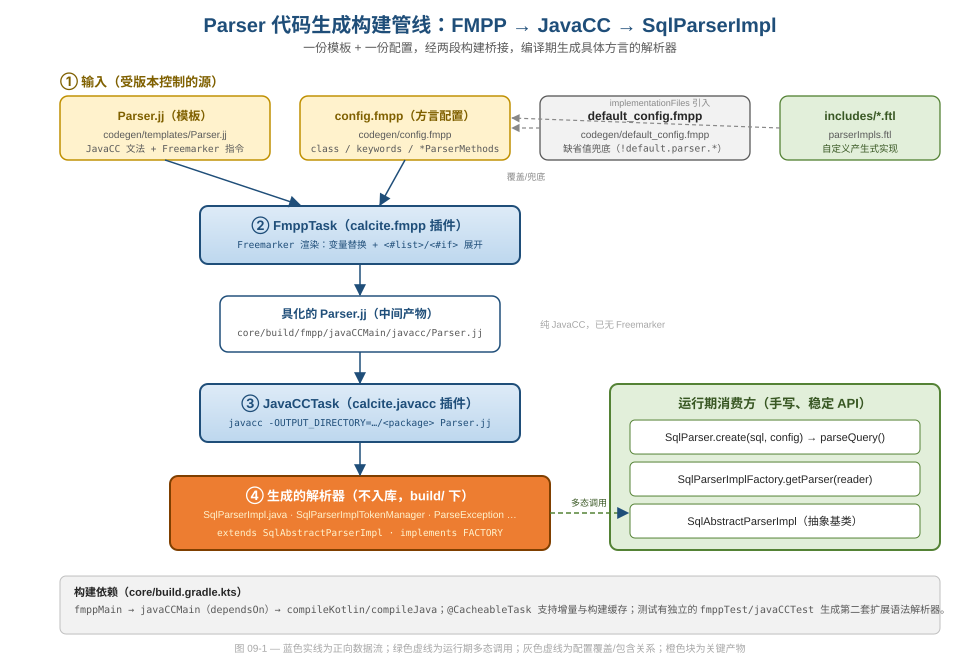
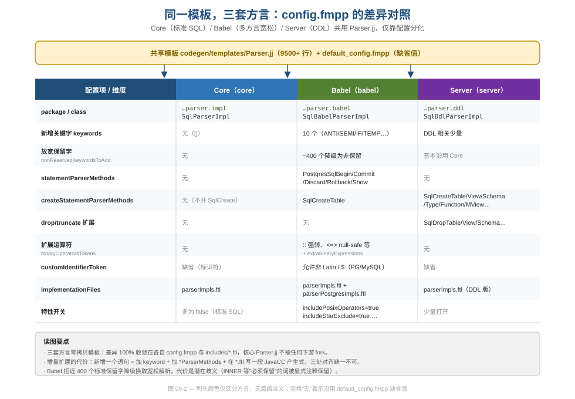

# 第 09 篇 · Parser 代码生成工程（FMPP + JavaCC）

> 本篇回答一个纯工程问题：当你想让一个 SQL 解析器**既严格遵守标准、又能被几十个下游模块按需扩展方言**时，怎么用"代码生成"把"语法可扩展性"做成构建期的事，而不是运行期的反射或手写 fork。Calcite 的答案是 FMPP（Freemarker）+ JavaCC 两段流水线，一份模板派生出 Core / Babel / Server 三套以上的解析器。
> 基线 commit `111030383` · 前置阅读：[第 02 篇 · 四层 IR](02-ir-overview.md)（Parser 的产物是第一层 IR `SqlNode`）、[第 03 篇 · SqlNode AST](03-sqlnode.md)

## TL;DR（要点速览）

- **解析器是生成的，不是手写的。** 你在 `org.apache.calcite.sql.parser.impl.SqlParserImpl` 里看到的几万行代码不在 git 里，它由 `core/src/main/codegen/templates/Parser.jj` 在构建期生成。直接改生成结果是徒劳的。
- **两段桥接：FMPP 先、JavaCC 后。** 第一段 Freemarker 把模板里的 `${parser.class}`、`<#list>`、`<#if>` 按 `config.fmpp` 渲染成纯 JavaCC 的 `.jj`；第二段 JavaCC 再把 `.jj` 编译成 Java。两段分别由 buildSrc 里的 `calcite.fmpp`、`calcite.javacc` 插件驱动。
- **可扩展性是配置出来的，不是继承出来的。** 下游模块（Babel/Server/各 adapter）**不 fork 模板**，只写自己的 `config.fmpp`：换类名/包名、加关键字、登记 `statementParserMethods`/`createStatementParserMethods` 等"钩子方法"，再在 `includes/*.ftl` 里补一段 JavaCC 产生式。
- **三层配置叠加：default → config → includes。** `default_config.fmpp` 给所有缺省值兜底，`config.fmpp` 只声明差异，`*.ftl` 提供产生式实现体。模板用 `parser.x!default.parser.x` 的写法实现"未声明则回退缺省"。
- **稳定 API 与生成实现解耦。** 手写的 `SqlParser`（门面）和 `SqlAbstractParserImpl`（抽象基类）是稳定契约，生成的 `SqlParserImpl extends SqlAbstractParserImpl`。调用方永远只碰门面，看不到生成代码。
- **代价要诚实记账：** 一处新语法要在"关键字 + ParserMethods 列表 + .ftl 产生式"三个地方对齐；模板调试体验差（错误行号指向生成产物而非模板）；Babel 为了宽松把近 400 个保留字降级，换来潜在歧义，必须靠人工注释守住"绝不能放"的词。

---

## 1. 问题：一个解析器，N 种方言，怎么不写 N 份代码

SQL 不是一种语言，而是一族方言。标准 SQL、PostgreSQL 的 `::` 强转、MySQL 的 `<=>`、各家的 DDL（`CREATE TABLE` 的私有语法）、流式 SQL 的 `TUMBLE`/`HOP`……如果每个方言都手写一个解析器，那是几十份高度重复、又必须各自维护的巨型状态机。

Calcite 的核心约束摆在 `config.fmpp` 文件头部的注释里，说得很直白：

```
# Calcite's parser grammar file (Parser.jj) is written in javacc
# with Freemarker variables to allow clients to:
#   1. have custom parser implementation class and package name.
#   2. insert new parser method implementations written in javacc to parse
#      custom: a) SQL statements. b) literals. c) data types.
#   3. add new keywords to support custom SQL constructs added as part of (2).
#   4. add import statements needed by inserted custom parser implementations.
```

—— `core/src/main/codegen/config.fmpp`（文件头注释）

这四条就是整套设计的"需求规格"。注意它不是"让用户运行期注册算子"，而是"让用户**在构建期把扩展织进文法**"。这是一个关键的工程取舍：**把可扩展性从运行期前移到了编译期**。好处是生成出来的解析器仍是一个普通的、被 JavaCC 静态优化过的、零反射开销的递归下降解析器；代价是扩展必须重新跑构建。对一个"语法相对稳定、但需要被多模块复用"的场景，这个取舍是对的——解析是热路径，不能为了扩展性牺牲运行期性能。

> **数据工程视角**：方言（dialect）在 Calcite 里是贯穿首尾的概念——解析端用 FMPP 生成不同 Parser，反序列化端用 `SqlDialect.unparseCall` 输出不同 SQL（见 [第 18 篇 · Adapter 生态](18-adapters.md)）。本篇只管"读进来"这一侧。

---

## 2. 全景：从模板到 SqlParserImpl 的两段流水线

先看整条管线，再逐段拆。



如图 09-1，输入有四类受版本控制的源：模板 `Parser.jj`、方言配置 `config.fmpp`、缺省兜底 `default_config.fmpp`、产生式实现 `includes/*.ftl`。它们经过两个 Gradle 任务：

1. **FmppTask**：Freemarker 渲染。把模板里的所有 `${...}` 变量替换、`<#list>`/`<#if>` 展开，得到一份**纯 JavaCC 文法**（已无任何 Freemarker 痕迹），落在 `core/build/fmpp/javaCCMain/javacc/Parser.jj`。
2. **JavaCCTask**：JavaCC 编译。把上一步的 `.jj` 编译成 Java 解析器类，落在 `core/build/javacc/javaCCMain/<package>/`。

最终产物 `SqlParserImpl`（橙色块，关键路径热点）**不入库**——它每次构建重新生成。运行期消费它的，是右侧手写、稳定的 `SqlParser` 门面与 `SqlAbstractParserImpl` 抽象基类。

这里值得品味的工程决策是**"中间产物可见"**：FMPP 不是直接吐 Java，而是先吐一份人能读的 `.jj`。这让"FMPP 写得对不对"和"JavaCC 文法写得对不对"成为两个可分别排查的问题——调试时你可以打开 `build/fmpp/.../Parser.jj` 看 Freemarker 到底展开成了什么。这是经典的"用一个可检视的中间表示切分复杂度"，和 Calcite 在执行端先生成 Janino 源码再编译（[第 16 篇](16-codegen-exec.md)）是同一种工程审美。

---

## 3. 第一段：FMPP（Freemarker）—— 模板里的扩展点长什么样

### 3.1 模板顶部：类名、包名、import 全部参数化

打开模板 `core/src/main/codegen/templates/Parser.jj`，最顶上就是 Freemarker 在改写 JavaCC 的样板：

```
PARSER_BEGIN(${parser.class})

package ${parser.package};

<#list (parser.imports!default.parser.imports) as importStr>
import ${importStr};
</#list>
```

—— `core/src/main/codegen/templates/Parser.jj:28-34`

`${parser.class}` / `${parser.package}` 来自 `config.fmpp` 的 `parser.class` / `parser.package` 字段。Core 填的是 `SqlParserImpl` / `…sql.parser.impl`，Babel 填 `SqlBabelParserImpl` / `…sql.parser.babel`。一行模板，三套类名，互不冲突——这就是"一份模板多方言"最朴素的实现。

注意 `parser.imports!default.parser.imports` 这个写法：`!` 是 Freemarker 的"默认值运算符"，意思是"若 `config.fmpp` 没声明 `imports`，就用 `default_config.fmpp` 里的 `default.parser.imports`"。**整份模板里几乎每个可配置项都是这个 `x!default.x` 结构**，它把"三层配置叠加"（default 兜底 → config 覆盖）做成了模板里随处可见的惯用法。这种"显式兜底"比"配置文件继承"更透明：你在模板里就能看到每个变量的回退来源。

### 3.2 钩子点：把"扩展语句"织进顶层产生式

真正体现扩展性的，是顶层语句产生式 `SqlStmt()`。它用 `<#list>` 把下游登记的自定义语句方法插在标准语句之前：

```
SqlNode SqlStmt() :
{
    SqlNode stmt;
}
{
    (
<#-- Add methods to parse additional statements here -->
<#list (parser.statementParserMethods!default.parser.statementParserMethods) as method>
        LOOKAHEAD(2) stmt = ${method}
    |
</#list>
        stmt = ${parser.setOptionParserMethod!default.parser.setOptionParserMethod}(Span.of(), null)
    |
        stmt = SqlAlter()
    |
<#if (parser.createStatementParserMethods!default.parser.createStatementParserMethods)?size != 0>
        stmt = SqlCreate()
    |
</#if>
        ...
        stmt = OrderedQueryOrExpr(ExprContext.ACCEPT_QUERY)
    |
        ...
    )
    { return stmt; }
}
```

—— `core/src/main/codegen/templates/Parser.jj:1162-1209`

这一段把 FMPP 的两类指令都用上了：

- `<#list … as method>`：对 `statementParserMethods` 列表里的每个方法名，生成一个 `LOOKAHEAD(2) stmt = <method> |` 分支。Babel 登记了 `PostgresSqlBegin()`/`PostgresSqlCommit()` 等，于是 Babel 的解析器能识别 PG 的事务语句，而 Core 的列表是空的，这几个分支根本不会被生成。
- `<#if … ?size != 0>`：**只有当下游登记了 `createStatementParserMethods` 时，才把 `stmt = SqlCreate()` 这一分支编进文法**。Core 不开 DDL，所以 Core 的 `SqlStmt()` 里压根没有 `SqlCreate` 分支——这不是运行期判空，而是"这段代码在 Core 里从未存在"。条件编译用对了地方：未启用的特性零成本。

与之配套的是 `SqlCreate()` 自身的产生式，它同样被 `<#if>` 整体包裹，并用 `<#list>` + `<#sep>` 把多个 create 方法用 `LOOKAHEAD(2)` 分隔开：

```
<#if (parser.createStatementParserMethods!default.parser.createStatementParserMethods)?size != 0>
SqlCreate SqlCreate() :
{
    final Span s;
    boolean replace = false;
    final SqlCreate create;
}
{
    <CREATE> { s = span(); }
    [ LOOKAHEAD(2) <OR> <REPLACE> { replace = true; } ]
    (
<#list (parser.createStatementParserMethods!default.parser.createStatementParserMethods) as method>
        create = ${method}(s, replace)
        <#sep>| LOOKAHEAD(2) </#sep>
</#list>
    )
    { return create; }
}
</#if>
```

—— `core/src/main/codegen/templates/Parser.jj:4672-4702`

模板里这种"钩子列表"成体系，覆盖了语法的各个注入点。下表是模板里出现的主要 `<#list>`/`<#if>` 注入点（行号经 Read 复核）：

| 钩子（config 字段） | 模板注入点 | 注入什么 |
|---|---|---|
| `statementParserMethods` | `Parser.jj:1169` | 顶层自定义语句 |
| `createStatementParserMethods` | `Parser.jj:4693` | `CREATE …` 变体 |
| `dropStatementParserMethods` | `Parser.jj:4718` | `DROP …` 变体 |
| `truncateStatementParserMethods` | `Parser.jj:4742` | `TRUNCATE …` 变体 |
| `alterStatementParserMethods` | `Parser.jj:4654` | `ALTER <scope> …` 变体 |
| `literalParserMethods` | `Parser.jj:4791` | 自定义字面量 |
| `dataTypeParserMethods` | `Parser.jj:6088` | 自定义数据类型 |
| `builtinFunctionCallMethods` | `Parser.jj:6779` | 内建函数调用语法 |
| `joinTypes` | `Parser.jj:2107` | 额外 JOIN 类型 |
| `keywords` | `Parser.jj:9042` | 新增 TOKEN |
| `nonReservedKeywords(ToAdd)` | `Parser.jj:9081/9097/9113` | 非保留字白名单 |
| `binaryOperatorsTokens` | `Parser.jj:9243` | 二元运算符 token |
| `extraBinaryExpressions` | `Parser.jj:4054` | 运算符表达式接入 |
| `implementationFiles` | `Parser.jj:1226` | 把 `*.ftl` 产生式实现整体 include 进来 |
| `customIdentifierToken` | `Parser.jj:9430` | 替换标识符词法 |

### 3.3 产生式实现体：用 include 把 .ftl 接进模板

光在列表里登记方法名还不够——方法得有实现。`implementationFiles` 列表会在模板里被逐个 `<#include>`：

```
<#-- Add implementations of additional parser statement calls here -->
<#list (parser.implementationFiles!default.parser.implementationFiles) as file>
    <#include "/@includes/"+file />
</#list>
```

—— `core/src/main/codegen/templates/Parser.jj:1225-1228`

Babel 的 `parserImpls.ftl` 里就放着 `SqlCreateTable` 的真身（注意它本身又是 Freemarker 文件，但内容是 JavaCC 产生式）：

```
SqlCreate SqlCreateTable(Span s, boolean replace) :
{
    final TableCollectionType tableCollectionType;
    final boolean volatile_;
    ...
    final SqlNode query;
}
{
    tableCollectionType = TableCollectionTypeOpt()
    volatile_ = VolatileOpt()
    <TABLE>
    ifNotExists = IfNotExistsOpt()
    id = CompoundIdentifier()
    ( columnList = ExtendColumnList() | { columnList = null; } )
    ( <AS> query = OrderedQueryOrExpr(ExprContext.ACCEPT_QUERY) | { query = null; } )
    {
        return new SqlBabelCreateTable(s.end(this), replace,
            tableCollectionType, volatile_, ifNotExists, id, columnList, query);
    }
}
```

—— `babel/src/main/codegen/includes/parserImpls.ftl:152-181`

至此，扩展一个语句的完整闭环就清楚了，它**必须三处对齐**：

1. 在 `config.fmpp` 的 `keywords` 里加上 `TABLE` 之外要用到的关键字（如 Babel 的 `IF`、`TEMP`、`VOLATILE`）；
2. 在 `createStatementParserMethods` 里登记 `SqlCreateTable`（让 §3.2 的 `<#list>` 把分支编进 `SqlCreate()`）；
3. 在 `parserImpls.ftl` 里写出 `SqlCreateTable` 的 JavaCC 产生式（让 §3.3 的 `<#include>` 把方法体带进来）。

> **设计与代码质量视角（坑）**：这三处对齐是这套机制最大的认知负担。漏掉任何一处，错误都不会指向你改的源文件——漏登记方法名，错误是 JavaCC 报"产生式未被引用"；漏关键字，错误是词法报"未定义 token"。而且因为代码是生成的，编译错误的行号指向 `build/fmpp/.../Parser.jj` 而非你写的 `.ftl`。新人改语法的第一道坎，几乎都栽在"为什么我改了却没生效"——答案往往是"你改的是生成产物"或"三处没对齐"。

---

## 4. 关键字与保留字：为什么要拆成三个产生式

关键字管理是这套模板里最"密集"的一段，也最能体现 FMPP 的取巧。新增 token 很直白：

```
<#-- additional parser keywords are included here -->
<#list (parser.keywords!default.parser.keywords) as keyword>
|   < ${keyword}: "${keyword}" >
</#list>
```

—— `core/src/main/codegen/templates/Parser.jj:9041-9044`

有意思的是非保留字。SQL 的保留字不能当列名/表名用，非保留字可以。Calcite 维护一个庞大的非保留字白名单（`default_config.fmpp` 里 `nonReservedKeywords` 数百项），模板要把它们拼成一个"可作为标识符的关键字"产生式。但 Babel 把近 400 个标准保留字降级为非保留字后，这个产生式会膨胀到上千分支——而模板作者发现，**单个超大产生式会让 javac 因 if 嵌套过深而 `StackOverflowError`**。解法是把它拆成三段，用 `keyword?index % 3` 取模分流：

```
String NonReservedKeyWord() :
{}
{
    (   NonReservedKeyWord0of3()
    |   NonReservedKeyWord1of3()
    |   NonReservedKeyWord2of3()  )
    { return unquotedIdentifier(); }
}

void NonReservedKeyWord0of3() :
{}
{
    (
<#list (parser.nonReservedKeywords!default.parser.nonReservedKeywords)
       + (parser.nonReservedKeywordsToAdd!default.parser.nonReservedKeywordsToAdd) as keyword>
<#if keyword?index == 0>
        <${keyword}>
<#elseif keyword?index % 3 == 0>
    |   <${keyword}>
</#if>
</#list>
    )
}
```

—— `core/src/main/codegen/templates/Parser.jj:9061-9089`

模板里这段紧贴着一条解释性注释，把"为什么拆"写进了代码：

> *The method is broken up into several sub-methods; without this decomposition, parsers such as Babel with more than ~1,000 non-reserved keywords would generate such deeply nested 'if' statements that javac would fail with a StackOverflowError.*

—— `core/src/main/codegen/templates/Parser.jj:9050-9053`

这是个绝佳的"代码生成踩过的坑"案例：**生成代码的体量本身会触碰下游编译器的实现极限**。手写代码你不会写出 1000 层 if，但生成器会忠实地把 1000 个关键字铺成一棵深树。模板作者用 Freemarker 的 `?index % 3` 把负载切成三份，是在"生成器侧"为"编译器侧"的限制做的妥协——这类约束在普通业务代码里几乎遇不到，是代码生成工程特有的。

注意列表用 `(A) + (B)` 把 `nonReservedKeywords` 和 `nonReservedKeywordsToAdd` 两个列表**在模板里拼接**后再分片。Babel 正是往 `nonReservedKeywordsToAdd` 里塞了那 ~400 个词，把它们从保留字降级。

---

## 5. 第二段：JavaCC —— 以及 buildSrc 怎么把两段串起来

FMPP 渲染完，轮到 JavaCC。两段任务由 buildSrc 里两个自定义 Gradle 插件实现，逻辑很薄。

FMPP 任务的核心是调 fmpp 的 Ant Task，把 `config` 和 `defaultConfig` 作为两份 TDD 数据喂进去，输出到 `build/fmpp/<name>`：

```kotlin
"fmpp"(
    "configuration" to config.get(),
    "sourceRoot" to templates.get().asFile,
    "outputRoot" to output.get().asFile,
    "data" to "tdd(${config.get().toString().tddString()}), " +
        "default: tdd(${defaultConfig.get().toString().tddString()})"
)
```

—— `buildSrc/subprojects/fmpp/src/main/kotlin/org/apache/calcite/buildtools/fmpp/FmppTask.kt:76-82`

`default_config.fmpp` 是通过 `templates.file("../default_config.fmpp")` 自动定位的（`FmppTask.kt:53-54`），所以下游模块只提供 `config.fmpp` 即可，缺省值自动接上。任务标了 `@CacheableTask` 并对输入声明了路径敏感度，意味着模板/配置不变时构建缓存直接命中——对一个动辄重跑的代码生成步骤，这是必要的增量优化。

JavaCC 任务更简单，直接 `javaexec` 调 javacc 主类：

```kotlin
project.javaexec {
    classpath = javaCCClasspath.get()
    getMainClass().set("javacc")
    args("-STATIC=${static.get()}")
    args("-LOOKAHEAD:${lookAhead.get()}")
    args("-OUTPUT_DIRECTORY:${output.get()}/${packageName.get().replace('.', '/')}")
    args(inputFile.singleFile)
}
```

—— `buildSrc/subprojects/javacc/src/main/kotlin/org/apache/calcite/buildtools/javacc/JavaCCTask.kt:62-72`

两段在 `core/build.gradle.kts` 里被显式串成依赖链——这是整套机制的"装配总线"：

```kotlin
val fmppMain by tasks.registering(...FmppTask::class) {
    config.set(file("src/main/codegen/config.fmpp"))
    templates.set(file("src/main/codegen/templates"))
}
val javaCCMain by tasks.registering(...JavaCCTask::class) {
    dependsOn(fmppMain)
    val parserFile = fmppMain.map {
        it.output.asFileTree.matching { include("**/Parser.jj") }
    }
    inputFile.from(parserFile)
    packageName.set("org.apache.calcite.sql.parser.impl")
}
tasks.compileKotlin {
    dependsOn(versionClass)
    dependsOn(javaCCMain)
}
```

—— `core/build.gradle.kts:165-182`

`javaCCMain` 通过 `dependsOn(fmppMain)` 拿到上一步输出的 `.jj` 当输入，`compileJava/compileKotlin` 再 `dependsOn(javaCCMain)`——一条干净的 `fmpp → javacc → compile` 链。这正是 CLAUDE.md 里 `./gradlew generateSources` 跑的东西。

特别值得一提的是紧随其后的 `fmppTest`/`javaCCTest`（`core/build.gradle.kts:184-200`）：**同一份模板，用 `src/test/codegen/config.fmpp` 再生成一套独立的扩展语法解析器**，包名 `org.apache.calcite.sql.parser.parserextensiontesting`。这套测试解析器专门用来验证"扩展机制本身能不能用"——Calcite 把自己的可扩展性做成了被测试覆盖的契约，而不是靠文档承诺。这是"可扩展性也要可测试"的范例。

> **工程边界**：这两个插件是 Calcite 整个 build 工具链的一小部分。werror、Checker、forbiddenapis、autostyle 等全局质量门禁的全貌见 [第 20 篇 · 工程质量保障](20-quality-and-modules.md)，本篇只聚焦 Parser 这一段构建桥接。

---

## 6. 稳定 API 与生成实现的隔离层

生成代码是会变的、不入库的、由工具吐出的；而调用方需要一个不变的契约。Calcite 用一对手写类把两者隔开。

`SqlParser` 是门面，对外只暴露 `create(...)` 与 `parseQuery()`/`parseStmtList()` 等少数方法，内部持有一个 `SqlAbstractParserImpl`：

```java
public class SqlParser {
  private final SqlAbstractParserImpl parser;

  public static SqlParser create(Reader reader, Config config) {
    SqlAbstractParserImpl parser =
        config.parserFactory().getParser(reader);
    return new SqlParser(parser, config);
  }

  public SqlNode parseQuery() throws SqlParseException {
    try {
      return parser.parseSqlStmtEof();
    } catch (Throwable ex) {
      throw handleException(ex);
    }
  }
}
```

—— `core/src/main/java/org/apache/calcite/sql/parser/SqlParser.java:69-79, 170-176`

要换解析器实现，靠 `Config.parserFactory()`——它默认返回生成类里的 `SqlParserImpl.FACTORY`，但你可以替换成 `SqlBabelParserImpl.FACTORY`，门面代码一行不动：

```java
@Value.Default default SqlParserImplFactory parserFactory() {
  return SqlParserImpl.FACTORY;
}
```

—— `core/src/main/java/org/apache/calcite/sql/parser/SqlParser.java:345-347`

生成类则反向继承到手写的 `SqlAbstractParserImpl`，并在模板里实现工厂：

```
public class ${parser.class} extends SqlAbstractParserImpl
{
    public static final SqlParserImplFactory FACTORY = new SqlParserImplFactory() {
        public SqlAbstractParserImpl getParser(Reader reader) {
            final ${parser.class} parser = new ${parser.class}(reader);
            ...
            return parser;
        }
    };
}
```

—— `core/src/main/codegen/templates/Parser.jj:149-202`

这就形成了一个干净的依赖倒置：**手写的抽象层在下，生成的具体层在上，门面只依赖抽象层 + 工厂**。生成代码可以随构建任意重生，调用方与 `SqlParser`/`Config` 这层稳定 API 之间隔着一道工厂边界。`SqlAbstractParserImpl` 还承担了所有跨方言通用的逻辑——SQL-92 保留字集合（`SqlAbstractParserImpl.java:64`）、`Metadata` 接口与 `MetadataImpl`（`SqlAbstractParserImpl.java:654, 706`，回答"某词是不是保留字")、`warnings` 列表收集非标准用法告警等。生成器只需吐出"文法相关"的那部分，通用基础设施留在手写基类里，避免被反复生成。

> **方言容差的归属**：`Config.conformance()` 接受一个 `SqlConformance`（`SqlParser.java:305-310`），用来在解析期做"宽松/严格"的容差判断（如 `allowHyphenInUnquotedTableName`）。`SqlConformance` 本体的设计是 [第 07 篇 · Validator](07-validator.md) 的主场，本篇不展开——这里只需知道：**词法/文法差异由 FMPP 在构建期固化，行为级容差由 conformance 在运行期判断**，两条扩展轴各管一段。

---

## 7. 三套方言的对照：差异 100% 收敛在 config

把前面所有机制落到一张表上，就能直观看到"一份模板多方言"到底省了多少重复。



图 09-2 把 Core / Babel / Server 三套解析器的 `config.fmpp` 逐项对齐。读图三个要点：

- **核心模板零 fork。** 三套解析器共用同一个 9500+ 行的 `Parser.jj`，差异 100% 收敛在各自的 `config.fmpp` 和 `includes/*.ftl`。Babel 加了 10 个关键字、登记了 5 个 PG 语句方法、开了 `::`/`<=>` 运算符和非 Latin 标识符词法；Server 把 DDL 的 `createStatementParserMethods`/`dropStatementParserMethods` 填满（`SqlCreateTable/View/Schema/Type/Function/MaterializedView` 等）；而 Core 这些列表大多是空的。
- **增量扩展的代价是"三处对齐"。** 新增一条语句 = 加 keyword + 加 `*ParserMethods` 列表项 + 在 `*.ftl` 写产生式，正如 §3.4 总结。配置越声明，模板里被 `<#if>` 激活的分支越多。
- **Babel 的宽松是有代价的。** 它往 `nonReservedKeywordsToAdd` 塞了近 400 个词，把标准保留字降级以"什么 SQL 都能凑合解析"。但 `babel/src/main/codegen/config.fmpp` 里有一长串**被注释掉**的词（`# "INNER"`、`# "FROM"`、`# "SELECT"`……），并配注释解释："若 `INNER` 不保留，则 `select * from emp inner join dept` 里的 `inner` 会被当成 `emp` 的表别名，SQL 无法被无歧义解析"。

```
# Words that are commented out (e.g. "AND") are still reserved.
# These are the most important reserved words, and SQL cannot be
# unambiguously parsed if they are not reserved. For example, if
# "INNER" is not reserved then in the query
#   select * from emp inner join dept using (deptno)"
# "inner" could be a table alias for "emp".
```

—— `babel/src/main/codegen/config.fmpp:72-83`

这段注释是诚实的工程记账：**宽松解析不是免费的午餐，它在"能解析更多方言"和"保持文法无歧义"之间走钢丝，能放和不能放的边界靠人工逐词审定**。`#` 注释掉的词就是"虽然在某些方言里不保留，但 Calcite 决定守住的底线"。把这种取舍连同理由写在配置里，是比写在 wiki 上更不易腐烂的做法——配置和决策放在一起。

---

## 8. 扩展一个运算符：token、表达式接入、产生式三件套

语句扩展之外，方言常常还要加运算符。PostgreSQL 的 `::` 强转、MySQL 的 `<=>` null-safe 等号，就是 Babel 通过这套机制接进去的。运算符扩展比语句扩展多一步——它要同时改"词法"和"表达式解析"两层，恰好把 §3.4 的"三处对齐"具体化。

第一处，在 `config.fmpp` 的 `binaryOperatorsTokens` 里声明 token，这会被模板插进运算符 token 段：

```
<#list (parser.binaryOperatorsTokens!default.parser.binaryOperatorsTokens) as operator>
|   ${operator}
</#list>
```

—— `core/src/main/codegen/templates/Parser.jj:9243-9245`，对应 Babel 的声明 `binaryOperatorsTokens: ["< INFIX_CAST: \"::\" >", "< NULL_SAFE_EQUAL: \"<=>\" >"]`（`babel/src/main/codegen/config.fmpp:582-585`）。

第二处，在 `extraBinaryExpressions` 里登记表达式接入方法名，模板把它织进核心表达式产生式 `AddExpression2b` 的分支链：

```
            |
<#list (parser.extraBinaryExpressions!default.parser.extraBinaryExpressions) as extra >
                ${extra}(list, exprContext, s)
            |
</#list>
                LOOKAHEAD(3) op = BinaryRowOperator() { ... }
```

—— `core/src/main/codegen/templates/Parser.jj:4053-4061`。Babel 登记 `extraBinaryExpressions: ["InfixCast", "NullSafeEqual"]`，于是 `InfixCast`/`NullSafeEqual` 成为表达式解析的合法分支，紧挨在标准 `BinaryRowOperator()` 之前。

第三处，在 `parserImpls.ftl` 里写出这两个方法的 JavaCC 实现。注意它们不返回 `SqlNode`，而是往传入的 `list` 里塞 `ToTreeListItem`——因为运算符优先级是在 `list` 攒齐后统一用 Shunting-yard 算法重排的：

```
void InfixCast(List<Object> list, ExprContext exprContext, Span s) :
{
    final SqlDataTypeSpec dt;
}
{
    <INFIX_CAST> {
        checkNonQueryExpression(exprContext);
    }
    dt = DataType() {
        list.add(
            new SqlParserUtil.ToTreeListItem(SqlLibraryOperators.INFIX_CAST,
                s.pos()));
        list.add(dt);
    }
}
```

—— `babel/src/main/codegen/includes/parserImpls.ftl:197-211`

这里有两个值得借鉴的细节：

- **扩展点的契约是"签名约定"，不是接口。** 模板里写死了调用形如 `${extra}(list, exprContext, s)`，所以你的方法**必须**是 `void Xxx(List<Object> list, ExprContext exprContext, Span s)` 这个签名。这是一种"约定式接口"——没有 Java interface 来强制它，约束写在模板的调用点上。这换来灵活（产生式可以是任意 JavaCC 片段），代价是约定不满足时报错在生成代码里，不在你的 `.ftl` 里。
- **源位置 `Span`/`s.pos()` 一路透传。** 注意 `list.add(new ToTreeListItem(op, s.pos()))` 把运算符的 `SqlParserPos` 也塞进去了。解析期对源位置的精确记录，是后续 Validator 报错能指到具体列、`SqlNode` 能 `unparse` 回等价 SQL 的基础（`SqlNode`/`SqlParserPos` 的设计见 [第 03 篇](03-sqlnode.md)）。代码生成没有偷工——生成出来的产生式和手写的一样在意位置信息。

把运算符扩展和语句扩展放一起看，会发现整套机制的统一性：**所有扩展都是"在 config 列表里登记名字 + 在模板既定注入点被 `<#list>` 展开 + 在 .ftl 给出产生式实现"这同一个三段式**，只是注入点和签名约定不同。理解了一个，其余（literal/dataType/joinType/builtinFunction）都是同构的。

---

## 设计模式与工程小结

| 机制 | 模式 / 手法 | 好在哪 / 借鉴点 | 代价 / 坑 |
|---|---|---|---|
| `${parser.class}`、`<#list>`、`<#if>` 注入扩展点 | 模板方法 + 编译期"条件编译" | 未启用特性零运行期成本，分支根本不生成 | 改的是模板不是产物；新人常误改 `build/` 下生成文件 |
| `x!default.parser.x` 三层叠加 | 配置缺省值兜底（显式默认） | 下游只声明差异，缺省自动接上，回退来源可见 | 模板里到处是 `!default`，可读性下降 |
| 先 FMPP 出 `.jj`、再 JavaCC 出 Java | 两段桥接 + 可检视中间表示 | 两类错误可分别排查；中间 `.jj` 人可读 | 多一层产物，构建链更长 |
| `statementParserMethods` 等钩子列表 | 注册表 / 钩子方法 | 扩展语句无需碰核心产生式 | 三处（keyword/列表/.ftl）必须对齐 |
| `extraBinaryExpressions(list, exprContext, s)` | 约定式接口（签名约定，非 Java interface） | 产生式可为任意 JavaCC 片段，最灵活 | 约定不满足时错误落在生成代码，不在 .ftl |
| `NonReservedKeyWord` 拆 3 段 | 生成负载分片 | 规避 javac 深层 if 的 StackOverflow | 代码生成特有的"为下游编译器极限让步" |
| `SqlParser` 门面 + `parserFactory()` | 门面 + 工厂 + 依赖倒置 | 调用方只碰稳定 API，实现可整套替换 | 多一层间接 |
| `SqlAbstractParserImpl` 收通用逻辑 | 抽象基类提取共性 | 保留字集合/Metadata/告警不被重复生成 | 基类与生成类的职责切分需谨慎 |
| `fmppTest`/`javaCCTest` 生成测试解析器 | 把可扩展性做成被测契约 | 扩展机制本身有回归保护 | 构建里多维护一套生成目标 |
| `@CacheableTask` + `dependsOn` 链 | 增量构建 / 任务编排 | 模板不变则缓存命中 | 输入声明写错会导致缓存失效或脏数据 |

一句话提炼：**Calcite 把"语法可扩展性"实现成了一个构建期的、可缓存的、可测试的代码生成管线，用配置叠加而非源码 fork 来分化方言，用门面 + 工厂把不稳定的生成产物挡在稳定 API 之后。**

---

## 对照阅读建议（动手）

- **看 FMPP 到底展开成了什么**
  - **运行**：`./gradlew generateSources`，然后打开 `core/build/fmpp/javaCCMain/javacc/Parser.jj`。
  - **观察**：搜索 `SqlStmt()`，对照模板 `Parser.jj:1162-1209`，看 `<#list statementParserMethods>` 在 Core 里展开成了几个分支（应为 0 个，因为 Core 列表为空）；再去 `babel/build/fmpp/.../Parser.jj` 同位置，看 PG 语句分支被生成了出来。这是理解"条件编译"最直接的方式。

- **断点：解析入口如何走到生成代码**
  - **断点**：`core/src/main/java/org/apache/calcite/sql/parser/SqlParser.java` → `SqlParser#parseQuery`（行 170）。
  - **观察**：单步进入 `parser.parseSqlStmtEof()`，会跳进生成类 `SqlParserImpl`（注意此时 IDE 打开的是 `build/` 下生成文件）。看 `parser` 的实际类型——把 `Config.parserFactory()` 换成 `SqlBabelParserImpl.FACTORY`，同一行 SQL 会走进不同的生成类。
  - **运行**：`./gradlew :core:test --tests org.apache.calcite.sql.parser.SqlParserTest`。

- **断点：保留字判定走的是哪条路**
  - **断点**：`core/src/main/java/org/apache/calcite/sql/parser/SqlAbstractParserImpl.java` → `MetadataImpl#isReservedWord`（约行 863）。
  - **观察**：传入 `"INNER"`，在 Core 解析器里返回 `true`；在 Babel 解析器里因被 `nonReservedKeywordsToAdd` 降级，分类不同。对照 `babel/src/main/codegen/config.fmpp:72-83` 那段"为何 INNER 仍保留"的注释体会取舍。

- **改一条语法，体会三处对齐**
  - **运行**：在 `core/src/test/codegen/config.fmpp` + `core/src/test/codegen/includes/parserImpls.ftl` 里加一个玩具语句，跑 `./gradlew :core:test --tests org.apache.calcite.sql.parser.parserextensiontesting.*` 验证扩展生效。故意漏掉关键字或方法登记，观察报错指向 `build/` 下生成产物——亲历"为什么改了没生效"。

---

## 延伸阅读

- 本系列：
  - [第 02 篇 · 为什么是四层 IR](02-ir-overview.md)——Parser 产出的 `SqlNode` 是四层降级的起点。
  - [第 03 篇 · SqlNode AST](03-sqlnode.md)——解析产生式 `return new SqlXxx(...)` 构造的就是这些节点；`SqlParserPos` 的源位置也在解析期填好。
  - [第 07 篇 · Validator](07-validator.md)——`SqlConformance` 方言容差的主讲篇；解析之后的下一棒。
  - [第 18 篇 · Adapter 生态](18-adapters.md)——`SqlDialect.unparseCall` 是"写回 SQL"侧的方言定制，与本篇的"读入"侧对称。
  - [第 20 篇 · 工程质量保障](20-quality-and-modules.md)——buildSrc 构建插件、werror、Checker 等全局工具链的全景。
- 官方文档与源内注释：
  - `site/_docs/adapter.md`、`site/_docs/howto.md`——下游如何提供自定义 `config.fmpp` 扩展解析器的官方说明。
  - `core/src/main/codegen/config.fmpp` 文件头注释——四条扩展能力的"需求规格"。
  - `core/src/main/codegen/templates/Parser.jj:9050-9053`——`NonReservedKeyWord` 拆分原因的源内注释。
  - JavaCC（javacc.github.io）与 FMPP（fmpp.sourceforge.net）官方手册——理解 `LOOKAHEAD` 与 TDD 数据格式。
