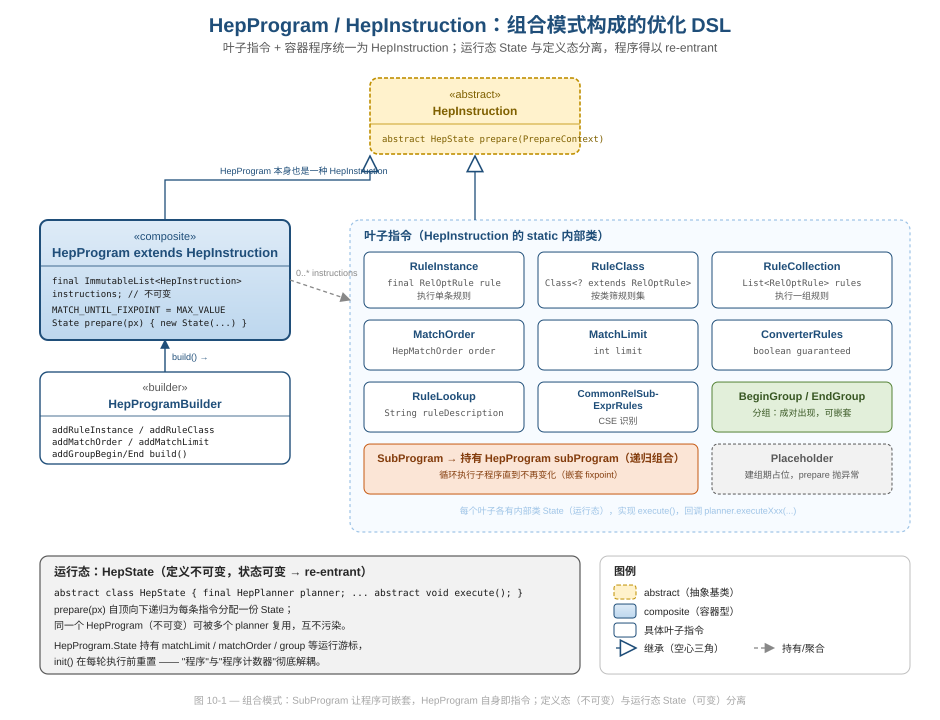
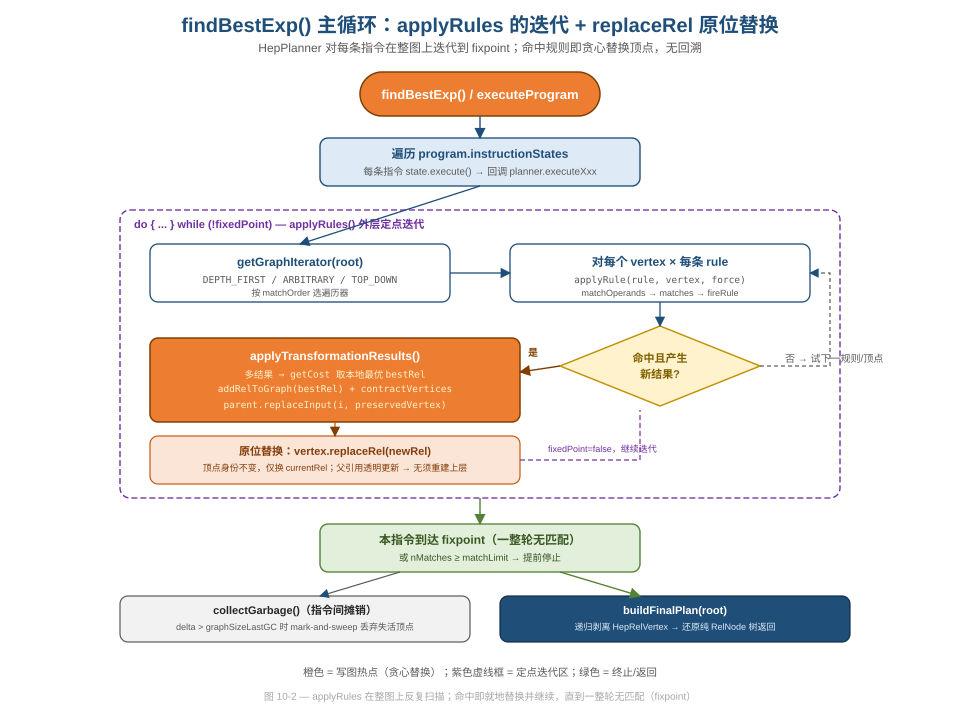
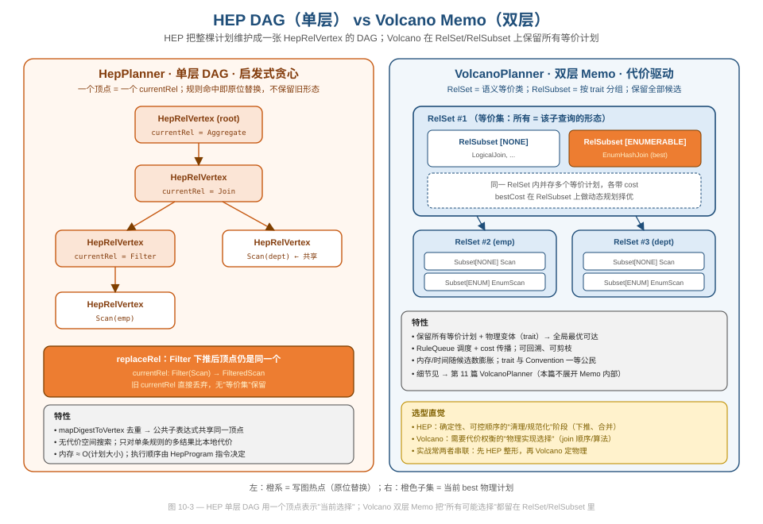

# 第 10 篇 · HepPlanner：程序化 DSL + DAG 启发式

> 优化器不一定要"穷举搜索 + 代价比价"。Calcite 的 `HepPlanner` 走的是另一条路：你把要做的事**写成一段程序**（先下推 Filter、再合并 Project、然后展开 distinct……），它就按你给的顺序在一张 DAG 上**贪心地原位替换**，到达定点（fixpoint）就停。本篇讲清三件事：这段"程序"是怎么用组合模式拼出来的、主循环 `applyRules` 如何在整图上迭代到 fixpoint、以及为什么 HEP 是单层 DAG 而 Volcano 是双层 Memo。
> 基线 commit `111030383` · 前置阅读：[第 04 篇 · RelNode](04-relnode.md)、[第 12 篇 · 规则体系](12-rules.md)（可后读）

## TL;DR

- `HepPlanner` 是 `RelOptPlanner` 的**启发式**实现：不做代价空间搜索，而是按一段 `HepProgram`（指令序列）依次施加规则。它适合"确定性、可控顺序"的整形阶段（下推、合并、规范化）。
- `HepProgram` 由 `HepInstruction` 列表组成，而 `HepProgram` 自身又 `extends HepInstruction`——这是教科书式的**组合模式（Composite）**：`SubProgram` 让程序可嵌套，叶子指令（`RuleInstance`/`RuleClass`/`MatchOrder`/`MatchLimit`/`BeginGroup`/`EndGroup`……）与容器统一对待。
- **定义态不可变、运行态可变**：`HepProgram`/`HepInstruction` 是 immutable 的；所有可变游标（`matchLimit`/`matchOrder`/`group`）都装进 `prepare()` 临时生成的 `HepState` 里，于是一份程序可被多个 planner 复用（re-entrant）。
- 整个查询计划被维护成一张 `HepRelVertex` 的 **DAG**：顶点是 `RelNode` 的轻量包装，`mapDigestToVertex` 做去重让公共子表达式共享同一顶点（这就是"DAG"而非"树"的由来）。
- 主循环 `applyRules` 对当前指令的规则集，在整图上**反复扫描直到一整轮无匹配**（fixpoint）。命中规则时 `applyTransformationResults` 走"加新顶点 → 收缩（contract）→ 父引用 `replaceInput`"完成**原位替换**，旧形态直接丢弃，**无回溯**。
- 坑（pitfall，如实写）：指令序列是**静态**的，无法根据中间结果动态改策略；`HepRelVertex` 包装会挡住元数据查询，需 `HepRelMetadataProvider`/`DelegatingMetadataRel` 中介；`noDag=true` 时丢失去重、会重复优化同形子树而退化。

---

## 1. 它在优化器家族里的位置

Calcite 有两个 `RelOptPlanner` 实现：代价驱动的 `VolcanoPlanner`（[第 11 篇](11-volcano.md) 主讲）和启发式的 `HepPlanner`。后者的类注释只有一句话，但定位很准（`core/src/main/java/org/apache/calcite/plan/hep/HepPlanner.java`）：

```java
/**
 * HepPlanner is a heuristic implementation of the {@link RelOptPlanner}
 * interface.
 */
public class HepPlanner extends AbstractRelOptPlanner {
```

"heuristic"（启发式）这个词是理解 HEP 的钥匙。它**不搜索计划空间**、**不做全局代价比价**，而是接受一个"该怎么优化"的剧本（`HepProgram`），照着演。最典型的用法是 `Interpreter` 在初始化时跑的一段下推程序（`core/src/main/java/org/apache/calcite/interpreter/Interpreter.java`，`optimize` 方法）：

```java
final HepProgram hepProgram = new HepProgramBuilder()
    .addRuleInstance(CoreRules.CALC_SPLIT)
    .addRuleInstance(CoreRules.FILTER_SCAN)
    .addRuleInstance(CoreRules.FILTER_INTERPRETER_SCAN)
    .addRuleInstance(CoreRules.PROJECT_TABLE_SCAN)
    // ...
    .build();
final HepPlanner planner = new HepPlanner(hepProgram);
planner.setRoot(rootRel);
rootRel = planner.findBestExp();
```

读这段就能体会 HEP 的气质：你**列出**要做的变换、**指定顺序**，planner 保证按序施加到 fixpoint。这是一种声明式的"优化脚本"。规则本身（`CoreRules.*`、`RelOptRule`、operand 匹配树）归 [第 12 篇](12-rules.md) 主讲，本篇只把它们当作"被调度的对象"。

**软件工程视角**：把"做什么"（规则）与"按什么顺序、迭代多少次做"（程序）分离，是关注点分离的一个漂亮落点。同一批 `CoreRules` 既能被 HEP 按固定脚本驱动，也能丢给 Volcano 让代价模型自由组合——规则对"谁在调度我"一无所知。

---

## 2. HepProgram：用组合模式拼出来的优化 DSL

### 2.1 一切皆 HepInstruction

`HepProgram` 的核心结构简单到只有一个字段（`core/src/main/java/org/apache/calcite/plan/hep/HepProgram.java`）：

```java
public class HepProgram extends HepInstruction {
  public static final int MATCH_UNTIL_FIXPOINT = Integer.MAX_VALUE;

  final ImmutableList<HepInstruction> instructions;

  HepProgram(List<HepInstruction> instructions) {
    this.instructions = ImmutableList.copyOf(instructions);
  }
```

注意第一行：`HepProgram extends HepInstruction`。一个**程序本身就是一条指令**。这正是**组合模式**的签名形态——容器（composite）与叶子（leaf）实现同一抽象，于是"指令的列表"里可以放别的"指令的列表"。

`HepInstruction` 是个包私有的抽象类，它把整个指令集都用 `static` 内部类定义在自己肚子里（`core/src/main/java/org/apache/calcite/plan/hep/HepInstruction.java`）：

```java
abstract class HepInstruction {
  /** Creates runtime state for this instruction. ...
   * @return Initialized state */
  abstract HepState prepare(PrepareContext px);

  /** Instruction that executes a given rule. */
  static class RuleInstance extends HepInstruction {
    final RelOptRule rule;          // 一条规则
    // ...
  }
  /** Instruction that executes all rules of a given class. */
  static class RuleClass extends HepInstruction {
    final Class<? extends RelOptRule> ruleClass;  // 按类筛
    // ...
  }
  /** Instruction that sets match order. */
  static class MatchOrder extends HepInstruction { final HepMatchOrder order; ... }
  /** Instruction that sets match limit. */
  static class MatchLimit extends HepInstruction { final int limit; ... }
  /** Instruction that executes a sub-program. */
  static class SubProgram extends HepInstruction { final HepProgram subProgram; ... }
  /** Instruction that begins a group. */
  static class BeginGroup extends HepInstruction { final EndGroup endGroup; ... }
  static class EndGroup extends HepInstruction { ... }
  // RuleCollection / RuleLookup / ConverterRules / CommonRelSubExprRules / Placeholder
}
```



图 10-1 把这套继承关系画全了。值得逐条品的设计点：

- **叶子各司其职、字段极少**。`RuleInstance` 只持一条 `rule`、`MatchLimit` 只持一个 `int`、`MatchOrder` 只持一个枚举。每条指令是一个**不可变值对象**，语义全在类型里——这让"程序"成为一个可以打印、可以复用、可以静态推理的数据结构，而不是一坨命令式代码。
- **`SubProgram` 是组合模式的关键叶子**：它持有一个 `HepProgram subProgram`，于是程序能**任意深度嵌套**。后面 §2.4 会看到嵌套带来的语义差异（独立 fixpoint）。
- **`BeginGroup`/`EndGroup` 成对出现**，把一段规则"打包"成无序整体——这是分组语义的载体。
- **类注释里有一句很诚实的工程自省**："The actual instruction set is defined here via inner classes; if these grow too big, they should be moved out to top-level classes."（指令集先内嵌，长大了再拆出去。）这是务实的演进式设计，不为"将来"过度抽象。

**设计与代码质量视角**：组合模式在这里不是炫技，而是**直接解决了"程序要能嵌套"这个真实需求**。如果没有"程序也是指令"，`SubProgram` 就得特殊处理，分组、子程序、限流都得各写一套调度——统一抽象把调度代码压成了"遍历 instructions，逐条 execute"。

### 2.2 Builder 把 DSL 做成流式 API

用户不直接 new 这些内部类（它们大多包私有），而是通过 `HepProgramBuilder` 的流式方法（`core/src/main/java/org/apache/calcite/plan/hep/HepProgramBuilder.java`）：

```java
public HepProgramBuilder addRuleInstance(RelOptRule rule) {
  return addInstruction(new HepInstruction.RuleInstance(rule));
}
public <R extends RelOptRule> HepProgramBuilder addRuleClass(Class<R> ruleClass) {
  return addInstruction(new HepInstruction.RuleClass(ruleClass));
}
public HepProgramBuilder addMatchOrder(HepMatchOrder order) {
  checkArgument(group < 0);
  return addInstruction(new HepInstruction.MatchOrder(order));
}
public HepProgram build() {
  checkArgument(group < 0);          // 组必须闭合
  HepProgram program = new HepProgram(instructions);
  clear();
  return program;
}
```

每个 `addXxx` 返回 `this`，于是能链式书写；`build()` 一次性冻结成 `ImmutableList`。这是标准的 **Builder 模式**（模式总述归 [第 19 篇](19-design-patterns.md)）。两个细节体现了防御式编程：

- `addMatchOrder`/`addMatchLimit`/`addConverters` 都先 `checkArgument(group < 0)`——**在分组期间禁止设置全局开关**，从 API 层面挡掉非法组合。
- `build()` 也校验 `group < 0`，确保 `addGroupBegin` 一定配了 `addGroupEnd`，不留半开的组。

分组的实现有个巧思：`addGroupBegin` 先塞一个 `Placeholder` 占位，`addGroupEnd` 时再回填成真正的 `BeginGroup`（它需要指向尚未创建的 `EndGroup`）：

```java
public HepProgramBuilder addGroupBegin() {
  checkArgument(group < 0);
  group = instructions.size();
  return addInstruction(new HepInstruction.Placeholder());   // 占位
}
public HepProgramBuilder addGroupEnd() {
  checkArgument(group >= 0);
  final HepInstruction.EndGroup endGroup = new HepInstruction.EndGroup();
  instructions.set(group, new HepInstruction.BeginGroup(endGroup));  // 回填
  group = -1;
  return addInstruction(endGroup);
}
```

`Placeholder.prepare()` 直接 `throw new UnsupportedOperationException()`——它只该活在"建组中"的瞬态，绝不该进入运行期。这是用"故意爆炸"标记不可达状态的防御式写法。

### 2.3 定义态不可变，运行态进 HepState

`HepProgram` 的类注释点破了一个关键约束：

```
 * Note that the structure of a program is immutable, but the planner uses it
 * as read/write during planning, so a program can only be in use by a single
 * planner at a time.
```

程序结构不可变，但"执行到第几条、当前 matchOrder 是什么"这类**游标是可变的**。Calcite 的解法是把可变状态从指令里彻底剥离，装进运行期临时对象 `HepState`（`core/src/main/java/org/apache/calcite/plan/hep/HepState.java`）：

```java
/** ... The goal is that programs are re-entrant - they can be used by more than
 * one thread at a time. We achieve this by making instructions and programs
 * immutable. All mutable state is held in the state objects. */
abstract class HepState {
  final HepPlanner planner;
  final HepProgram.State programState;
  abstract void execute();
  void init() { }
}
```

执行前，`prepare()` 自顶向下递归，给每条指令配一份 `State`。`HepProgram.State` 持有真正的运行游标：

```java
class State extends HepState {
  final ImmutableList<HepState> instructionStates;
  int matchLimit = MATCH_UNTIL_FIXPOINT;
  HepMatchOrder matchOrder = HepMatchOrder.DEPTH_FIRST;
  HepInstruction.EndGroup.@Nullable State group;

  @Override void init() {     // 每轮执行前重置游标
    matchLimit = MATCH_UNTIL_FIXPOINT;
    matchOrder = HepMatchOrder.DEPTH_FIRST;
    group = null;
  }
  @Override void execute() { planner.executeProgram(HepProgram.this, this); }
}
```

**软件工程视角**：这是"不可变 + 外置可变状态"的范式，和 [第 04 篇](04-relnode.md) 讲的 RelNode 不可变契约同源。好处是显式的：(1) 同一份 `HepProgram` 能被多个 planner / 线程并发复用，互不污染（注释里的 re-entrant 目标）；(2) "程序"成了纯数据，可被缓存——`MaterializedViewFilterScanRule` 就用 `Suppliers.memoize(...)` 把一段 HepProgram 缓存为静态单例。代价是多了一层 `prepare()` 的对象分配，以及"定义类 + State 内部类"成对出现的样板代码。

### 2.4 一个隐藏语义：直接 add vs 包成 SubProgram

`addSubprogram` 的注释揭示了一个容易踩的语义差异：

```
 * Adds an instruction to execute a subprogram. Note that this is different
 * from adding the instructions from the subprogram individually. When added
 * as a subprogram, the sequence will execute repeatedly until a fixpoint is
 * reached, whereas when the instructions are added individually, the
 * sequence will only execute once (with a separate fixpoint for each
 * instruction).
```

也就是说：把规则 A、B、C **逐条** add 进主程序，是"A 跑到定点、B 跑到定点、C 跑到定点"各一遍；而把 A、B、C 打包成 `SubProgram`，则是"A→B→C 作为一个整体反复跑，直到一整轮 A→B→C 都不再产生变化"。后者能捕捉"B 的输出让 A 又能匹配"这类**跨规则的相互触发**。`executeSubProgram` 的实现把这个语义写得很直白（`HepPlanner.java`）：

```java
void executeSubProgram(...) {
  for (;;) {
    int nTransformationsBefore = nTransformations;
    state.programState.execute();
    if (nTransformations == nTransformationsBefore) {
      break;   // 这一遍整体没产生任何变化，到达嵌套 fixpoint
    }
  }
}
```

**坑（pitfall）**：这个差异不写在 API 名字上，只藏在 Javadoc 里。新手很容易"逐条 add 一堆相互依赖的规则"，结果某些本该被反复触发的优化只做了一遍就停了。如果你的规则之间有相互喂数据的关系，要么用 `SubProgram` 包起来、要么用 `addMatchLimit(MATCH_UNTIL_FIXPOINT)` 配合，否则结果取决于 add 的顺序。

---

## 3. DAG：HepRelVertex 与公共子表达式共享

HEP 不直接在 `RelNode` 树上改，而是先把整棵计划"搬"进一张内部图。每个 `RelNode` 被包成一个 `HepRelVertex`（`core/src/main/java/org/apache/calcite/plan/hep/HepRelVertex.java`）：

```java
/**
 * HepRelVertex wraps a real {@link RelNode} as a vertex in a DAG representing
 * the entire query expression.
 */
public class HepRelVertex extends AbstractRelNode implements DelegatingMetadataRel {
  /** Wrapped rel currently chosen for implementation of expression. */
  private RelNode currentRel;

  void replaceRel(RelNode newRel) { currentRel = newRel; }     // 原位替换的落点
  public RelNode getCurrentRel() { return currentRel; }
  @Override public RelNode stripped() { return currentRel; }
}
```

顶点很"薄"：它只持有一个 `currentRel`——"当前为这个表达式选中的实现"。它自己也是个 `RelNode`（`extends AbstractRelNode`），所以能无缝插进 `RelNode` 的输入位置：一个父算子的 `getInputs()` 返回的全是 `HepRelVertex`。

图存在 `HepPlanner.graph` 里，注释说明了方向与"单根 DAG"性质：

```java
/**
 * Query graph, with edges directed from parent to child. This is a
 * single-rooted DAG, possibly with additional roots corresponding to
 * discarded plan fragments which remain to be garbage-collected.
 */
private final DirectedGraph<HepRelVertex, DefaultEdge> graph = DefaultDirectedGraph.create();
```

### 3.1 为什么是 DAG 而不是树

关键在 `addRelToGraph` 里的去重逻辑：每个 rel 加入图前先算 digest，命中 `mapDigestToVertex` 就**复用已有顶点**（`HepPlanner.java`）：

```java
// Compute digest first time we add to DAG,
// otherwise can't get equivVertex for common sub-expression
rel.recomputeDigest();

// try to find equivalent rel only if DAG is allowed
if (!noDag) {
  // Now, check if an equivalent vertex already exists in graph.
  HepRelVertex equivVertex = mapDigestToVertex.get(rel.getRelDigest());
  if (equivVertex != null) {
    return equivVertex;          // 共用同一顶点 => 这就是 DAG
  }
}
```

于是**两处结构相同的子表达式会指向同一个顶点**，整张图从"树"退化成"DAG"。digest 去重的机制本身归 [第 04 篇](04-relnode.md) 主讲，这里只用它的结果：公共子表达式共享。共享带来两个好处——内存省、且对该子表达式做一次替换会让所有引用它的父节点同时受益（`CommonRelSubExprRules` 这条指令正是要靠"一个顶点有 ≥2 个父亲"来识别公共子表达式）。

`noDag` 是构造参数，默认 `false`（即默认开启 DAG）。**坑**：把 `noDag=true` 会关掉去重，相同形态的子树各占一个顶点，相同的优化会被重复做——注释和 RESEARCH 都点了这个退化点。除非你明确需要"树"语义（比如某些不能共享的副作用场景），否则别动它。

### 3.2 包装的代价：元数据要绕一层

`HepRelVertex` 把真 rel 藏在 `currentRel` 里，这就带来一个问题：当规则或代价模型对一个顶点调 `mq.getRowCount(...)` 时，拿到的是 `HepRelVertex` 而不是真正的 `Join`/`Filter`，元数据 handler 会无所适从。Calcite 用两层机制化解：

`HepRelVertex implements DelegatingMetadataRel`，把元数据请求转发给真 rel：

```java
@Override public RelNode getMetadataDelegateRel() { return currentRel; }

@Override public double estimateRowCount(RelMetadataQuery mq) {
  return mq.getRowCount(currentRel);     // 转发给被包装的真 rel
}
```

另外还有一个 `HepRelMetadataProvider` 作为兜底中介，它的 `apply` 把请求 `stripped()` 到真 rel 再求元数据（`core/src/main/java/org/apache/calcite/plan/hep/HepRelMetadataProvider.java`）：

```java
return (rel, mq) -> {
  if (!(rel instanceof HepRelVertex)) { return null; }
  final RelNode rel2 = rel.stripped();        // 剥掉包装
  UnboundMetadata<M> function = ...getMetadataProvider().apply(rel2.getClass(), metadataClass);
  return function.bind(rel2, mq);
};
```

不过这个类已标 `@Deprecated // to be removed before 2.0`，主路径已是 `DelegatingMetadataRel`。`HepRelVertex.computeSelfCost` 的注释把这层无奈写得很直白：

```java
@Override public @Nullable RelOptCost computeSelfCost(...) {
  // HepRelMetadataProvider is supposed to intercept this
  // and redirect to the real rels. But sometimes it doesn't.
  return planner.getCostFactory().makeTinyCost();
}
```

**坑（pitfall）**："包装一层"是为图算法服务的，但它给元数据/代价查询埋了一个"透明性"债务——必须靠 `DelegatingMetadataRel` 把请求穿透回去，且历史上有过"有时穿不透"的兜底（那句注释）。这是"为了优化器内部数据结构而牺牲对象一致性"的典型权衡：图好用了，但谁拿到 `HepRelVertex` 都得记得它不是真节点。元数据/RMQ 的体系本身归 [第 13 篇](13-metadata-cost.md)。

---

## 4. 主循环：applyRules 到 fixpoint + 原位替换

### 4.1 顶层编排

`findBestExp()` 是入口，它跑主程序、收垃圾、还原计划（`HepPlanner.java`）：

```java
@Override public RelNode findBestExp() {
  requireNonNull(root, "'root' must not be null");
  executeProgram(mainProgram);
  collectGarbage();                  // 丢掉不在最终计划里的一切
  dumpRuleAttemptsInfo();
  return buildFinalPlan(requireNonNull(root, "..."));
}
```

`executeProgram` 把程序 `prepare` 成 State 再 `execute`；`HepProgram.State.execute()` 回调 `planner.executeProgram(program, state)`，后者遍历每条指令的 State 并逐条执行：

```java
void executeProgram(HepProgram instruction, HepProgram.State state) {
  state.init();
  state.instructionStates.forEach(instructionState -> {
    instructionState.execute();
    int delta = nTransformations - nTransformationsLastGC;
    if (!isLargePlanMode() && delta > graphSizeLastGC) {
      // 自上次 GC 以来的变换数 > 当时图的顶点数 => 该有不少垃圾了
      collectGarbage();              // 在指令之间摊销 GC 成本
    }
  });
}
```

每条指令（如 `RuleInstance`）的 `execute()` 最终都汇入 `applyRules`。

### 4.2 applyRules：整图扫描到 fixpoint



如图 10-2，`applyRules` 是 HEP 的心脏。它对给定规则集，在整张图上反复扫描，直到一整轮都没有匹配（fixpoint）：

```java
private void applyRules(HepProgram.State programState,
    Collection<RelOptRule> rules, boolean forceConversions) {
  // ...（分组收集分支略）...
  final boolean fullRestartAfterTransformation =
      programState.matchOrder != HepMatchOrder.ARBITRARY
          && programState.matchOrder != HepMatchOrder.DEPTH_FIRST;
  int nMatches = 0;
  boolean fixedPoint;
  do {
    Iterator<HepRelVertex> iter = getGraphIterator(programState, requireNonNull(root, "root"));
    fixedPoint = true;
    while (iter.hasNext()) {
      HepRelVertex vertex = iter.next();
      for (RelOptRule rule : rules) {
        HepRelVertex newVertex = applyRule(rule, vertex, forceConversions);
        if (newVertex == null || newVertex == vertex) {
          continue;                          // 没匹配或没变化
        }
        ++nMatches;
        if (nMatches >= programState.matchLimit) {
          return;                            // 限流：到上限即停
        }
        if (fullRestartAfterTransformation) {
          iter = getGraphIterator(programState, requireNonNull(root, "root"));  // 整图重扫
        } else {
          iter = getGraphIterator(programState, newVertex);                     // 从新顶点续扫
          // ...
          fixedPoint = false;                // 这一轮改过图，得再来一轮
        }
        break;
      }
    }
  } while (!fixedPoint);
}
```

几个关键决策值得拆开看：

- **fixpoint 语义**：外层 `do { ... } while (!fixedPoint)`。只要某一轮里发生过一次变换，就把 `fixedPoint` 置 false、再来一整轮；直到一整轮零匹配才停。这保证了"规则的相互触发"被吃干净——前一条规则的输出可能让后面（或自己）再次匹配。
- **遍历策略随 matchOrder 切换**：`TOP_DOWN`/`BOTTOM_UP` 需要稳定的拓扑序，所以每次变换后**整图重扫**（`fullRestartAfterTransformation`）；`DEPTH_FIRST`/`ARBITRARY` 则**从新顶点续扫**以提高效率（避免每次都从 root 重新走）。
- **`matchLimit` 限流**：`nMatches >= matchLimit` 直接 `return`。`addMatchLimit(n)` 能把"最多触发 n 次"做成硬上限，对易抖动或可能不收敛的规则是一道安全阀。

`DEPTH_FIRST` 分支还会调 `depthFirstApply` 递归处理新顶点的子树，注释解释了它的动机：

```java
// To the extent possible, pick up where we left
// off; have to create a new iterator because old
// one was invalidated by transformation.
```

`DEPTH_FIRST` 是默认 match order，原因写在 `HepMatchOrder` 的枚举注释里（`core/src/main/java/org/apache/calcite/plan/hep/HepMatchOrder.java`）：

```java
/**
 * Match in depth-first order.
 * <p>It avoids applying a rule to the previous {@link RelNode} repeatedly
 * after new vertex is generated in one rule application. It can therefore be
 * more efficient than {@link #ARBITRARY} in cases such as
 * {@link org.apache.calcite.rel.core.Union} with large fan-out.
 */
DEPTH_FIRST
```

四种序——`ARBITRARY`（默认最省）、`BOTTOM_UP`（叶到根）、`TOP_DOWN`（根到叶）、`DEPTH_FIRST`——给了规则作者控制"先看哪、避免重复触发"的旋钮。

### 4.3 applyRule：匹配 → 防重复 → fireRule

单个顶点上施加一条规则走 `applyRule`：先按 operand 匹配，再过 `firedRulesCache` 防重复，再 `rule.matches` 检查侧条件，最后 `fireRule`：

```java
boolean match = matchOperands(rule.getOperand(), vertex.getCurrentRel(), bindings, nodeChildren);
if (!match) { return null; }

// Cache the fired rule before constructing a HepRuleCall.
ImmutableIntList relIds = null;
if (enableFiredRulesCache) {
  // ... 用 bindings 的 RelNode id 列表当 key
  Collection<RelOptRule> rules = firedRulesCache.get(relIds);
  if (rules.contains(rule)) {
    return null;                  // 这条规则已经在这组节点上点过火，跳过
  }
}
HepRuleCall call = new HepRuleCall(this, rule.getOperand(), ...);
if (!rule.matches(call)) { return null; }   // 规则自己的侧条件
fireRule(call);
// ...
if (!call.getResults().isEmpty()) {
  return applyTransformationResults(vertex, call, parentTrait);
}
```

`firedRulesCache` 以"匹配到的 RelNode id 列表"为键，记录"已在这组节点上点过火的规则"，避免同一规则在同一组节点上反复触发（这是 HEP 自己的循环防护，对应注释 "to avoid firing the same rule repeatedly"）。注意它默认关闭（`enableFiredRulesCache = false`），是给多阶段/大计划场景的可选优化。

`ConverterRule` 有特判：guaranteed converter 只在"真有父节点要这个 trait"时才放行（`doesConverterApply`），否则"它们会 fire to infinity and beyond"（注释原话）——这是把 Volcano 的 trait 转换机制塞进 HEP 时必须打的补丁。Trait/Convention 归 [第 14 篇](14-trait-convention.md)。

### 4.4 applyTransformationResults：原位替换的真相

命中后真正改图的是 `applyTransformationResults`。它的逻辑分三步：选最优结果、加新顶点、收缩（contract）让父亲改指向：

```java
RelNode bestRel = null;
if (call.getResults().size() == 1) {
  // No costing required; skip it to minimize the chance of hitting
  // rels without cost information.
  bestRel = call.getResults().get(0);
} else {
  RelOptCost bestCost = null;
  final RelMetadataQuery mq = call.getMetadataQuery();
  for (RelNode rel : call.getResults()) {
    RelOptCost thisCost = getCost(rel, mq);
    if (bestRel == null || thisCost.isLt(castNonNull(bestCost))) {
      bestRel = rel; bestCost = thisCost;       // 仅在多结果间比"本地"代价
    }
  }
}
```

这里有一个关键的、容易被误解的事实：**HEP 不是完全无视代价**，但它只在"一条规则一次触发产生多个候选结果"时，挑本地代价最低的那个。它**不**在不同规则、不同形态之间做全局比价。代码上方那段 TODO 注释把这个局限说得最清楚：

```java
// TODO jvs 5-Apr-2006:  Take the one that gives the best
// global cost rather than the best local cost.  That requires
// "tentative" graph edits.
```

选定 `bestRel` 后，新顶点加入图，然后 `contractVertices` 把旧顶点的父亲改指向新顶点：

```java
HepRelVertex newVertex = addRelToGraph(bestRel, null);
// ...
int iParentMatch = parents.indexOf(newVertex);
if (iParentMatch != -1) {
  newVertex = parents.get(iParentMatch);     // 防自环：新顶点恰是某个父亲
} else {
  contractVertices(newVertex, vertex, parents, garbageVertexSet);
}
```

`contractVertices` 的核心就是让父节点 `replaceInput` 指向保留顶点：

```java
for (HepRelVertex parent : parents) {
  RelNode parentRel = parent.getCurrentRel();
  List<RelNode> inputs = parentRel.getInputs();
  for (int i = 0; i < inputs.size(); ++i) {
    if (inputs.get(i) != discardedVertex) { continue; }
    parentRel.replaceInput(i, preservedVertex);    // 父引用就地改指
  }
  // ...
}
if (discardedVertex == root) { root = preservedVertex; }
garbageVertexSet.add(discardedVertex);
```

**这就是"原位替换贪心"的全部真相**：

1. 旧顶点不被等价集保留，而是被加入垃圾集、等 mark-and-sweep 回收；
2. 替换是**贪心的、不可回溯的**——一旦把 Filter 下推进 Scan，那个"Filter 在上面"的形态就没了，不像 Volcano 会把它留在 RelSet 里以备代价比较；
3. 替换发生在图层面，父节点透明地改指向新顶点，**上层不需要重建**——这是用"可变的图引用"换"不可变树需要逐层 copy"的效率。

**数据工程视角**：贪心 + 无回溯让 HEP 又快又确定，特别适合那些"做了一定更好、不存在权衡"的规范化变换（谓词下推、投影合并、常量折叠）。但对"join 顺序""hash 还是 merge join"这类**本质上需要权衡**的决策，HEP 的本地贪心会得到次优解——那是 Volcano 的活儿（[第 11 篇](11-volcano.md)）。

### 4.5 收尾：GC 与还原纯 RelNode 树

优化完，图里还残留着被丢弃的子树（那些"additional roots"）。`collectGarbage` 做标准 mark-and-sweep——从 root 可达即保留，其余清除，并顺手清理 `mapDigestToVertex`、元数据缓存、`firedRulesCache`：

```java
// Yer basic mark-and-sweep.
final Set<HepRelVertex> rootSet = new HashSet<>();
BreadthFirstIterator.reachable(rootSet, graph, root);
if (rootSet.size() == graph.vertexSet().size()) {
  return;                       // 全可达，无垃圾
}
// ... 把不可达的扫进 sweepSet 并 removeAllVertices
```

GC 的触发是**摊销式**的（§4.1 那段 `delta > graphSizeLastGC`），把回收成本均摊到多条指令之间，同时把内存高水位控制在与图大小成正比的范围——是个很克制的工程权衡。

最后 `buildFinalPlan` 递归地把 `HepRelVertex` 包装层剥掉，还原成纯 `RelNode` 树交回给调用方：

```java
private RelNode buildFinalPlan(HepRelVertex vertex) {
  RelNode rel = vertex.getCurrentRel();
  notifyChosen(rel);
  List<RelNode> inputs = rel.getInputs();
  for (int i = 0; i < inputs.size(); ++i) {
    RelNode child = inputs.get(i);
    if (!(child instanceof HepRelVertex)) { continue; }
    child = buildFinalPlan((HepRelVertex) child);
    rel.replaceInput(i, child);
  }
  if (rel instanceof HepRelVertex) {
    throw new AssertionError("post-condition failed: " + rel);   // 不该有残留包装
  }
  return rel;
}
```

那句 `throw new AssertionError` 是一道后置条件断言：返回的计划里绝不能还有 `HepRelVertex`。**设计与代码质量视角**：内部表示（DAG + 包装）只活在 planner 边界之内，进来是树、出去也是树——这种"内部复杂、边界干净"的封装，让 HEP 对调用方完全透明。

---

## 5. HEP DAG vs Volcano Memo：一张图说清两条路线



图 10-3 把两种 planner 的内部表示并排放。一句话概括差异：**HEP 用一个顶点表示"当前的选择"，Volcano 用 RelSet/RelSubset 把"所有可能的选择"都留着。**

| 维度 | HepPlanner（单层 DAG） | VolcanoPlanner（双层 Memo） |
|---|---|---|
| 内部结构 | 一张 `HepRelVertex` DAG，每顶点一个 `currentRel` | `RelSet`（等价类）→ `RelSubset`（按 trait 分组），保留全部等价/物理变体 |
| 等价计划 | 不保留，原位替换即丢弃旧形态 | 全部保留，供代价比较与回溯 |
| 代价使用 | 仅在一条规则的多结果间比本地代价 | 全局 cost 传播 + 动规择优 |
| 调度方式 | `HepProgram` 指令序列，确定性顺序 | `RuleQueue` 驱动，顺序由匹配/代价决定 |
| trait/Convention | 二等公民（converter 需特判防爆炸） | 一等公民（`AbstractConverter` enforcer） |
| 内存 | ≈ O(计划大小) | 随候选数膨胀 |
| 适用场景 | 确定性整形：下推、合并、规范化、去关联 | 物理实现选择：join 顺序、算法选择 |

注意：本篇只画 Memo 的轮廓以作对照，**`RelSet`/`RelSubset`/`RuleQueue`/双驱动的内部机制归 [第 11 篇](11-volcano.md) 主讲**，这里不展开。

**实战上两者常串联使用**：先用 HEP 跑一段确定性的"清理"程序（把计划整形到规范形态），再把结果交给 Volcano 做代价驱动的物理选择。`Programs`、各 adapter 的优化流程都能看到这种分工。`RelDecorrelator`（子查询去关联，[第 08 篇](08-sql-to-rel.md)）内部也用 HEP 跑固定的去关联规则序列——因为去关联是确定性变换，没有代价权衡，正是 HEP 的主场。

---

## 设计模式与工程小结

| 模式 / 手法 | 在 HEP 中的落点 | 好在哪 / 坑在哪 |
|---|---|---|
| 组合模式（Composite） | `HepProgram extends HepInstruction`；`SubProgram` 持有 `HepProgram` | 程序可任意嵌套；叶子与容器统一调度，调度代码极简 |
| Builder | `HepProgramBuilder.addXxx().build()` 流式构建不可变 `HepProgram` | DSL 可读；`checkArgument(group<0)` 防非法组合。模式总述→[19](19-design-patterns.md) |
| 不可变 + 外置可变状态 | 定义态 `HepProgram`/`HepInstruction` immutable；运行态进 `HepState` | 程序 re-entrant、可缓存为静态单例；代价是 `prepare()` 分配 + State 样板 |
| Flyweight / 去重 | `mapDigestToVertex` 让公共子表达式共享同一 `HepRelVertex` | 省内存、改一处全图生效；`noDag=true` 关掉它会退化 |
| 装饰/代理 + 委托 | `HepRelVertex` 包装真 rel；`DelegatingMetadataRel`/`HepRelMetadataProvider` 穿透元数据 | 图算法好写；但破坏对象一致性，元数据要绕一层（曾有"穿不透"兜底） |
| 状态机 + 定点迭代 | `applyRules` 的 `do/while(!fixedPoint)` + `matchOrder` 切换遍历 | 吃干净规则的相互触发；`matchLimit` 防不收敛 |
| 原位替换贪心 | `applyTransformationResults` → `replaceRel`/`contractVertices` | 快、确定、无回溯；但只取本地最优，复杂权衡得交给 Volcano |
| 摊销式 GC | `delta > graphSizeLastGC` 才 mark-and-sweep | 内存高水位 ∝ 图大小；回收成本均摊 |

**一句话评价**：HEP 把"优化"建模成"在 DAG 上按脚本贪心改写到定点"，用组合模式让脚本可嵌套、用不可变让脚本可复用、用 DAG 去重让改写高效。它放弃了全局最优，换来了确定性、可控性和速度——这是一个边界清晰、定位精准的工程选择，而不是 Volcano 的"残缺版"。

---

## 对照阅读建议（动手）

- **断点**：`core/src/main/java/org/apache/calcite/plan/hep/HepPlanner.java` → `HepPlanner#applyRules`
  - **观察**：外层 `do/while` 的 `fixedPoint` 如何在每次变换后被置 false；`nMatches` 与 `programState.matchLimit` 的关系；`iter` 在 `DEPTH_FIRST` 下如何"从新顶点续扫"而非整图重扫。
  - **运行**：`./gradlew :core:test --tests org.apache.calcite.test.HepPlannerTest`

- **断点**：`HepPlanner#applyTransformationResults` 与 `HepPlanner#contractVertices`
  - **观察**：`call.getResults()` 大小为 1 时如何跳过 costing；多结果时 `getCost` 如何只比"本地"代价；`parentRel.replaceInput(i, preservedVertex)` 这一行就是"原位替换"的实锤——看父顶点的输入引用如何透明改指。
  - **运行**：同上，或在 `RelOptRulesTest` 里跑任一基于 `HepProgram` 的用例。

- **断点**：`HepPlanner#addRelToGraph`
  - **观察**：`mapDigestToVertex.get(rel.getRelDigest())` 命中时返回 `equivVertex`——这一刻"树"变成"DAG"。把构造参数 `noDag` 改成 true，对比相同子树是否还共享顶点、`nTransformations` 是否变大。
  - **运行**：`new HepPlanner(program, null, /*noDag=*/true, null, RelOptCostImpl.FACTORY)` 自建一个跑同一查询对比。

- **断点**：`core/src/main/java/org/apache/calcite/plan/hep/HepProgram.java` → `HepProgram.State` 构造器（`prepare` 路径）
  - **观察**：`BeginGroup` 如何先放占位 State、等遇到 `EndGroup` 再回填（`actions` map 的 deferred 回调）；体会"定义不可变、State 可变"的分离。
  - **运行**：构造一个含 `addGroupBegin/addGroupEnd` 的程序并 `executeProgram`。

---

## 延伸阅读

- 本系列：
  - [第 11 篇 · VolcanoPlanner：Cascades CBO 内核](11-volcano.md) —— Memo（RelSet/RelSubset）、双驱动、代价传播，HEP 的"代价驱动对照组"。
  - [第 12 篇 · 规则体系：RelRule.Config + Operand + CoreRules](12-rules.md) —— 被 HEP 调度的"规则"本体与 operand 匹配树。
  - [第 13 篇 · 元数据与代价](13-metadata-cost.md) —— `RelMetadataQuery` 与 `HepRelVertex` 的元数据穿透为何需要 `DelegatingMetadataRel`。
  - [第 04 篇 · RelNode 关系代数层](04-relnode.md) —— digest 去重、`copy()`/`replaceInput` 契约，HEP DAG 共享的底座。
  - [第 08 篇 · SqlToRel](08-sql-to-rel.md) —— `RelDecorrelator` 用 HEP 跑确定性去关联序列的实例。
  - [第 19 篇 · 设计模式全景](19-design-patterns.md) —— Composite / Builder / Flyweight 的跨模块归纳。
- 官方文档：
  - `site/_docs/algebra.md` —— 关系代数与 `RelBuilder`，HEP 操作的对象。
  - `site/_docs/adapter.md` —— 各 adapter 的 planner program 装配方式（HEP 与 Volcano 串联的实例）。
- 源码起点：`org.apache.calcite.plan.hep` 包（`HepPlanner` / `HepProgram(Builder)` / `HepInstruction` / `HepRelVertex` / `HepMatchOrder` / `HepState` / `HepVertexIterator`）。
