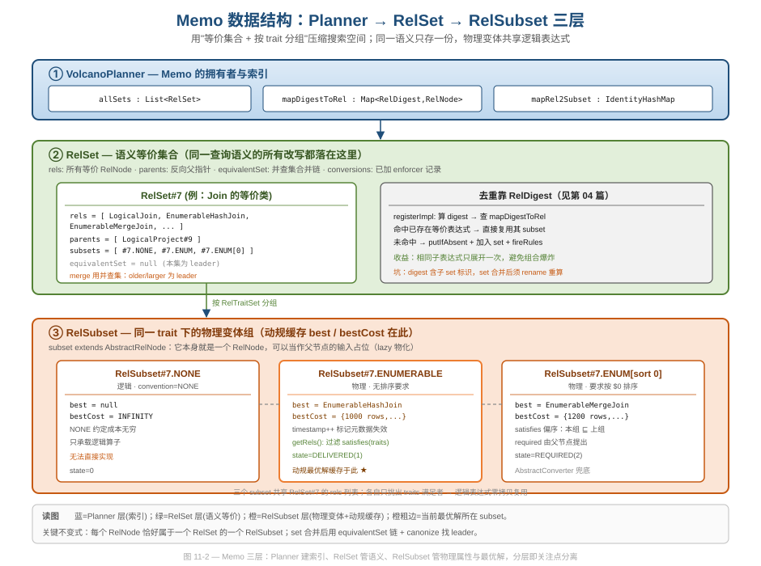
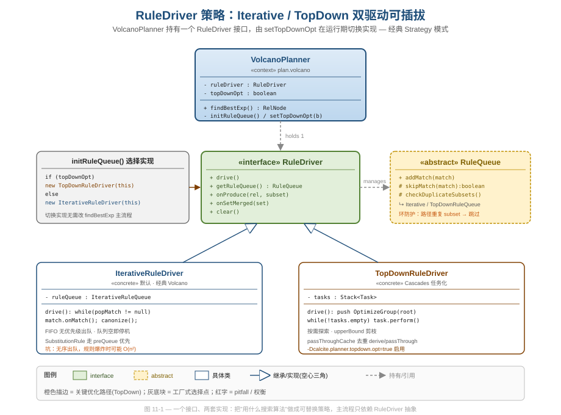
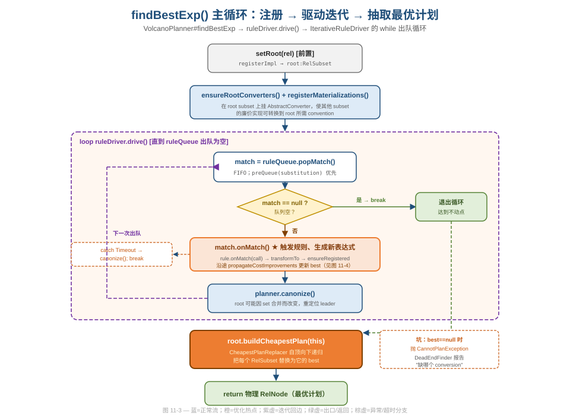
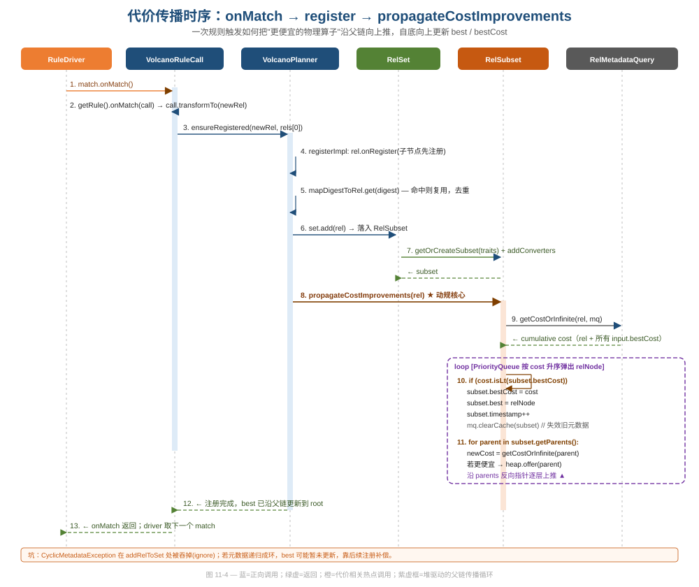

# 第 11 篇 · VolcanoPlanner：Cascades CBO 内核

> 上一篇的 `HepPlanner` 用一份固定指令序列贪心地改写一棵 DAG——简单、可控，但只能"走到哪算哪"。当我们要在"哈希连接还是归并连接""先聚合还是先过滤""要不要为父节点的排序要求加一个 Sort"这些**互相耦合的物理选择**里找全局最优时，贪心就不够了。`VolcanoPlanner` 是 Calcite 基于 Cascades 框架的成本驱动优化器（CBO）：它用一套叫 **Memo** 的数据结构压缩整个搜索空间，用动态规划自底向上维护"每个等价类在每种物理属性下的最优解"，并把"用什么搜索算法驱动规则"抽象成可插拔的 `RuleDriver`。本篇从工程实现切入，讲透 Memo 三层结构、双驱动策略、动规成本传播，以及那些藏在注释里的循环防护与坑。
> 基线 commit `111030383` · 前置阅读：[第 04 篇 · RelNode](04-relnode.md)、[第 10 篇 · HepPlanner](10-hep-planner.md)

## TL;DR

- **Memo 三层**：`VolcanoPlanner` 持有 `allSets`（所有等价集合）；每个 `RelSet` 是一个**语义等价类**（同一查询语义的所有改写）；每个 `RelSubset` 是 set 内**物理属性（trait）相同**的一组变体，动规的 `best`/`bestCost` 缓存就挂在 subset 上。三层即"索引 / 语义 / 物理"的关注点分离。
- **去重靠 digest**：`registerImpl` 注册前先算 `RelDigest` 查 `mapDigestToRel`，命中即复用已有表达式的 subset——相同子表达式只展开一次，从根上压住组合爆炸（digest 机制本身见 [第 04 篇](04-relnode.md)）。
- **双驱动可插拔**：`RuleDriver` 是接口，`IterativeRuleDriver`（默认，经典 Volcano，队列出空即停）与 `TopDownRuleDriver`（Cascades 任务化，按需探索 + 上界剪枝）是两套实现，`setTopDownOpt` 在运行期切换，主流程 `findBestExp` 只依赖抽象——教科书式的 Strategy 模式。
- **动规成本传播**：`propagateCostImprovements` 用一个按成本排序的优先队列，从"刚变便宜的节点"出发，沿 `parents` 反向指针逐层上推，更新每个 subset 的 `best`/`bestCost`，并 `clearCache` 失效旧元数据。
- **循环防护有两道**：`RuleQueue.skipMatch` → `checkDuplicateSubsets` 在操作数树的同一路径上发现重复 subset 就跳过（防止"消费自己输出"的死循环）；`equivRoot` 用快慢指针检测等价链成环。
- **坑要诚实写**：`AbstractConverter` 自身成本为**无穷大**，靠规则把它替换成真实转换链——它是兜底 enforcer，过度依赖会掩盖真实转换成本；`IterativeRuleQueue` 是 FIFO 无优先级出队，规则爆炸时退化；`CyclicMetadataException` 在多处被 `ignore` 吞掉，best 可能暂时滞后。

---

## 1. 为什么需要 Memo：从"一棵树"到"一片等价空间"

`HepPlanner` 优化的对象是一棵确定的 RelNode DAG，规则原位替换顶点（见 [第 10 篇](10-hep-planner.md)）。`VolcanoPlanner` 的对象完全不同——它要在**指数级的等价改写空间**里搜索。考虑 `A ⋈ B ⋈ C` 三表连接：连接顺序有多种、每个连接可以是哈希/归并/嵌套循环、每张表可能要不要排序……如果把每种组合都展开成一棵完整的树，内存会瞬间爆掉。

Memo（memoization 的缩写）的核心思想是：**把"语义等价"和"物理变体"两个维度都做成共享结构**。`VolcanoPlanner` 的类注释只有一句话，却点破了全部（`core/src/main/java/org/apache/calcite/plan/volcano/VolcanoPlanner.java`）：

```java
/**
 * VolcanoPlanner optimizes queries by transforming expressions selectively
 * according to a dynamic programming algorithm.
 */
public class VolcanoPlanner extends AbstractRelOptPlanner {
  protected @MonotonicNonNull RelSubset root;
  /** List of all sets. Used only for debugging. */
  final List<RelSet> allSets = new ArrayList<>();
  /** Canonical map from digest to the unique RelNode with that digest. */
  private final Map<RelDigest, RelNode> mapDigestToRel = new HashMap<>();
  /** Map each registered RelNode to its equivalence set (RelSubset). */
  private final IdentityHashMap<RelNode, RelSubset> mapRel2Subset = new IdentityHashMap<>();
  // ...
  RuleDriver ruleDriver;
}
```

四个字段就是 Memo 的索引层：`allSets` 是所有等价类的容器，`mapDigestToRel` 是"按内容指纹去重"的字典，`mapRel2Subset` 是"从节点反查它属于哪个 subset"的身份字典，`ruleDriver` 是可插拔的搜索引擎。注意 `mapRel2Subset` 特意用 `IdentityHashMap`——注释里解释了原因：大多数 RelNode 靠 digest 标识，而 digest 又包含子节点所属 set 的标识，如果用基于内容的 HashMap，set 合并时容易"乱伦"（incestuous），故这里只按对象身份索引。这是一个非常细的工程权衡：**索引该用内容还是身份，取决于这个索引在合并期是否需要稳定**。



上图把三层摊开。最关键的不变式是：**每个 RelNode 恰好属于一个 RelSet 的一个 RelSubset**；RelSet 持有一份 `rels` 列表（该语义类的所有等价表达式），各 RelSubset 并不复制这些节点，而是通过 `getRels()` 按自己的 trait 过滤出"满足者"——逻辑表达式因此被多个物理 subset **零拷贝复用**。

---

## 2. RelSet：语义等价类与并查集合并

`RelSet` 是"一组语义完全相同的表达式"。它的字段直接对应 Memo 的语义层（`core/src/main/java/org/apache/calcite/plan/volcano/RelSet.java`）：

```java
class RelSet {
  final List<RelNode> rels = new ArrayList<>();
  /** RelNodes that have a subset in this set as a child (multi-set). */
  final List<RelNode> parents = new ArrayList<>();
  final List<RelSubset> subsets = new ArrayList<>();
  /** Set to the superseding set when this is found to be equivalent to another set. */
  @MonotonicNonNull RelSet equivalentSet;
  /** Records conversions / enforcements already added. */
  final Set<Pair<RelTraitSet, RelTraitSet>> conversions = new HashSet<>();
  // ...
}
```

三个列表分工明确：`rels` 是成员，`subsets` 是按 trait 切出来的物理分组，`parents` 是**反向父指针**（哪些节点把本 set 的某个 subset 当作输入）。`parents` 是动规向上传播成本的高速路——没有它，每次成本变化都要全图扫描找父节点。

### 2.1 等价集合合并：并查集 + leader 选择

优化过程中，两个原本独立的 set 经常被发现其实等价（例如某条规则把 `Filter(Join)` 改写成 `Join(Filter)`，而后者已经独立存在）。此时要把两个 set 合并成一个。Calcite 用**并查集**实现：`equivalentSet` 字段是指向 leader 的链，`merge` 决定谁吞并谁。

```java
private RelSet merge(RelSet set1, RelSet set2) {
  set1 = equivRoot(set1);  // 找各自等价链的根
  set2 = equivRoot(set2);
  if (set2 == set1) return set1;  // 已等价，啥也不做
  // 选择 swap 方向：尽量把"新的/小的/popular 低的"并入"老的/大的"
  // ... 处理 parent 关系与 1-环 ...
  if (swap) { RelSet t = set1; set1 = set2; set2 = t; }
  set1.mergeWith(this, set2);   // set2 失效，equivalentSet 指向 set1
  // ...
  ruleDriver.onSetMerged(set1);
  return set1;
}
```

`swap` 方向的选择（`isSmaller`）是个性能细节：优先把 parent 数少（不那么 popular）、成员少、id 大（更年轻）的 set 并入对方。**为什么？** 因为合并意味着要给被并方的所有 parent 调用 `rename` 重算 digest——把工作量小的一方当被并方，重命名的代价就最小。这是"把摊销代价压到更便宜的一侧"的典型决策。

### 2.2 合并的连锁反应：rename + propagate

`mergeWith` 是 Memo 里最重的一段，因为合并会触发一连串连锁更新（`RelSet#mergeWith`）：

```java
void mergeWith(VolcanoPlanner planner, RelSet otherSet) {
  otherSet.equivalentSet = this;                 // 标记 otherSet 死亡
  planner.allSets.remove(otherSet);
  // 合并 subsets，收集 best 需要变更的 rel
  for (RelSubset otherSubset : otherSet.subsets) { /* getOrCreateSubset + 合 passThroughCache */ }
  for (RelNode otherRel : otherSet.rels) { planner.reregister(this, otherRel); }
  // 子节点被改名了，更新所有引用 otherSet 的 parent 的 digest
  for (RelNode parentRel : previousParents) { planner.rename(parentRel); }
  // 把合并带来的成本变化向上传播
  for (RelNode parentRel : getParentRels()) { planner.propagateCostImprovements(parentRel); }
  // parent 变了，旧规则可能重新可触发——重新 fireRules
  for (RelNode rel : rels) { planner.fireRules(rel); }
}
```

**设计与代码质量视角**：注意它对**重入**的防御——方法中三次 `assert equivalentSet == null`，因为 `rename` 过程本身可能再次触发合并，使"这个 set"在方法执行中途变成被并方。代码显式判断 `if (equivalentSet != null) return;` 提前退出，避免对已死亡的 set 继续更新子节点（注释直言"indeed, it could be dangerous"）。这种"在自身可能被并发改写的递归里随时检查自己是否已失效"的写法，是处理图合并这类自引用结构时的标准防御姿势。

---

## 3. RelSubset：动规缓存与"subset 也是 RelNode"

`RelSubset` 是 Memo 里最精妙的一层。它代表 set 内**物理属性（RelTraitSet）相同**的一组等价表达式，而动规的最优解就缓存在它身上（`core/src/main/java/org/apache/calcite/plan/volcano/RelSubset.java`）：

```java
public class RelSubset extends AbstractRelNode {
  /** Cost of best known plan (it may have improved since). */
  RelOptCost bestCost;
  /** The set this subset belongs to. */
  final RelSet set;
  /** Best known plan. */
  @Nullable RelNode best;
  /** Timestamp for metadata validity. */
  long timestamp;
  // ...
}
```

最重要的一行是 `extends AbstractRelNode`：**RelSubset 本身就是一个 RelNode**。这意味着父节点可以把一个 subset 当作输入占位符，而不必绑定到某个具体的子算子。父节点说"我要一个'按 deptno 排序的、ENUMERABLE 约定的 Join 结果'"，它指向的就是那个 trait 的 RelSubset；至于这个 subset 最终用哈希连接还是归并连接实现，等动规收敛后由 `buildCheapestPlan` 替换。**这就是 Memo 实现"延迟物化 + 共享"的关键技巧**：用一个轻量占位节点解耦"需求"与"实现"。

### 3.1 best / bestCost 的维护

`computeBestCost` 在构造时扫一遍现有 rels 取最小成本；此后 `best`/`bestCost` 由 `propagateCostImprovements` 和 `mergeWith` **增量维护**（注释写得很清楚）。`getBestOrOriginal` 提供降级路径——没有 best 就退回原始逻辑节点（用于 explain 等场景）：

```java
public RelNode getBestOrOriginal() {
  RelNode result = getBest();
  if (result != null) return result;
  return requireNonNull(getOriginal(), "both best and original nodes are null");
}
```

### 3.2 delivered / required：物理属性的供需双向

`RelSubset` 用一个 `state` 位图区分 subset 是"被交付的"（DELIVERED，由子算子或自身产出）还是"被要求的"（REQUIRED，由父算子提出需求），或两者皆是：

```java
private static final int DELIVERED = 1;
private static final int REQUIRED = 2;
private int state = 0;
void setDelivered() { triggerRule = !isDelivered(); state |= DELIVERED; }
void setRequired()  { triggerRule = false;          state |= REQUIRED;  }
public boolean isDelivered() { return (state & DELIVERED) == DELIVERED; }
public boolean isRequired()  { return (state & REQUIRED)  == REQUIRED;  }
```

**数据工程视角**：这套"供需双向"建模正是物理属性传播（property enforcement）的基础——当一个 REQUIRED subset（父节点要求按某列排序）遇不到能满足它的 DELIVERED subset 时，`addConverters` 会插入一个 enforcer（如 Sort/Exchange），或在兜底情况下插入 `AbstractConverter`。trait 满足关系（`satisfies` 偏序）与 Convention 网络的细节归 [第 14 篇](14-trait-convention.md) 主讲，这里只看 subset 如何承载需求与交付两个角色。

---

## 4. 双驱动：把"搜索算法"做成可替换策略

到这里 Memo 的"数据"讲完了，接下来是"算法"。Calcite 把"用什么算法驱动规则匹配"抽象成 `RuleDriver` 接口——这是本篇工程层面最值得借鉴的一处设计。



接口本身极简（`core/src/main/java/org/apache/calcite/plan/volcano/RuleDriver.java`）：

```java
interface RuleDriver {
  RuleQueue getRuleQueue();
  void drive();                          // 应用规则的主循环
  void onProduce(RelNode rel, RelSubset subset);  // 新 RelNode 产出回调
  void onSetMerged(RelSet set);          // set 合并回调
  void clear();
}
```

`VolcanoPlanner` 只持有 `RuleDriver ruleDriver` 字段，由 `initRuleQueue` 根据开关选择实现：

```java
@EnsuresNonNull("ruleDriver")
private void initRuleQueue() {
  if (topDownOpt) {
    ruleDriver = new TopDownRuleDriver(this);
  } else {
    ruleDriver = new IterativeRuleDriver(this);
  }
}

public void setTopDownOpt(boolean value) {
  if (topDownOpt == value) return;
  topDownOpt = value;
  initRuleQueue();    // 运行期切换实现
}
```

**软件工程视角**：这是 Strategy 模式的标准落地——`findBestExp` 主流程从头到尾只调用 `ruleDriver.drive()`，对"是经典 Volcano 还是 Cascades 自顶向下"一无所知。两套搜索算法各自封装在独立的类里（`IterativeRuleDriver` 84 行、`TopDownRuleDriver` 上千行），互不污染。新增第三种搜索策略，只需实现接口、改 `initRuleQueue` 一处。`onProduce`/`onSetMerged` 是给 driver 留的观察钩子——`IterativeRuleDriver` 把它们实现为空方法（它不需要在产出/合并时做额外簿记），`TopDownRuleDriver` 则用它们重置任务状态。**接口里塞了某些实现用不到的方法，是策略模式的常见张力**：好处是 driver 可插拔，代价是空实现略显冗余，这是个可接受的权衡。

### 4.1 IterativeRuleDriver：朴素而正确

默认驱动的主循环只有十几行，朴素到近乎天真（`core/src/main/java/org/apache/calcite/plan/volcano/IterativeRuleDriver.java`）：

```java
@Override public void drive() {
  while (true) {
    VolcanoRuleMatch match = ruleQueue.popMatch();
    if (match == null) break;                 // 队列空 → 不动点 → 停机
    assert match.getRule().matches(match);
    try {
      match.onMatch();                         // 触发规则，可能产出新表达式并入队
    } catch (VolcanoTimeoutException e) {
      planner.canonize();
      break;                                   // 超时则 canonize 后退出
    }
    planner.canonize();    // root 可能因 set 合并而改变，重定位 leader
  }
}
```

它的不动点判据简单粗暴：**队列出空就停**。每次 `onMatch` 触发规则、生成新表达式，新表达式注册时又会 `fireRules` 把更多 match 入队，直到没有规则能产出新东西。

`IterativeRuleQueue` 的 `MatchList` 用两个 `ArrayDeque` 实现优先级——`SubstitutionRule`（物化视图替换这类"几乎总是更好"的规则）走 `preQueue` 先出，其余走 `queue`，并用一个 `names` 集合做**去重**（同名 match 不重复入队）：

```java
void offer(VolcanoRuleMatch match) {
  if (match.getRule() instanceof SubstitutionRule) {
    preQueue.offer(match);
  } else {
    queue.offer(match);
  }
}
@Nullable VolcanoRuleMatch poll() {
  VolcanoRuleMatch match = preQueue.poll();
  if (match == null) match = queue.poll();
  return match;
}
```

**坑（pitfall）**：注释明说"The rules are not sorted in any way"——除了 substitution 的两级优先，出队完全是 **FIFO，没有按"哪个 match 更可能带来收益"排序**。在规则集很大、产生海量 match 的查询上，这种无优先级出队可能做很多无效功，复杂度退化。这正是 `TopDownRuleDriver` 试图改进的地方。

### 4.2 TopDownRuleDriver：任务化 + 按需探索

自顶向下驱动把"优化一个 group"拆成一棵任务树，用显式栈管理（`core/src/main/java/org/apache/calcite/plan/volcano/TopDownRuleDriver.java`）：

```java
@SuppressWarnings("JdkObsolete")
class TopDownRuleDriver implements RuleDriver {
  private final Stack<Task> tasks = new Stack<>(); // TODO: replace with Deque
  private final Set<RelNode> passThroughCache = new HashSet<>();

  @Override public void drive() {
    tasks.push(new OptimizeGroup(requireNonNull(planner.root), planner.infCost));
    exploreMaterializationRoots();
    try {
      while (!tasks.isEmpty()) {
        Task task = tasks.pop();
        task.perform();
      }
    } catch (VolcanoTimeoutException ex) {
      LOGGER.warn("Volcano planning times out, cancels the subsequent optimization.");
    }
  }
}
```

与 Iterative 的区别在于**控制流形态**：Iterative 是"被动的"——所有可能的 match 都被入队，然后无差别地一个个执行；TopDown 是"主动的"——从 root 的 `OptimizeGroup` 出发，按需把子任务（`OptimizeMExpr`/`ApplyRule`/`OptimizeInputs`…）压栈，并携带 `upperBound`（上界），一旦某条路径的下界已经超过已知上界就剪枝。`passThroughCache` 记录哪些 RelNode 已经做过 `passThrough`/`derive`（物理属性的上推/下推），避免重复。

`TopDownRuleQueue` 的入队策略也体现了"任务化"的精细——它把 match 按 `rel` 分组存在 `Map<RelNode, Deque<...>>`，并刻意安排 substitution 规则的执行顺序：

```java
// 非 substitution 放队首，substitution 放队尾；
// ApplyRule 任务按 first→last 取出并压栈，于是 substitution 的 ApplyRule
// 因后压栈而先弹出 —— 最终 substitution 反而最先执行。
if (!planner.isSubstituteRule(match)) {
  queue.addFirst(match);
} else {
  queue.addLast(match);
}
```

这段"用栈的 LIFO 翻转队列顺序来调度优先级"的小技巧，读起来绕，但注释完整解释了意图。**可借鉴点**：当执行顺序由"双层容器（队列入 / 栈出）"共同决定时，务必像这里一样把推导链写进注释，否则后人无从复现这个 LIFO 翻转的设计意图。

> 提示：`topDownOpt` 默认值取自 `CalciteSystemProperty.TOPDOWN_OPT`（系统属性 `calcite.planner.topdown.opt`），默认关闭。两套驱动产出的最优计划应当一致，差异只在搜索效率与剪枝能力。

---

## 5. findBestExp 主循环：注册、驱动、抽取

把前面的零件串起来，就是优化的全过程入口 `findBestExp`：

```java
@Override public RelNode findBestExp() {
  requireNonNull(root, "root");
  ensureRootConverters();          // 给 root 挂转换器，让其他 subset 能转到 root 约定
  registerMaterializations();      // 注册物化视图候选
  ruleDriver.drive();              // ★ 把搜索委托给可插拔 driver
  dumpRuleAttemptsInfo();
  RelNode cheapest = root.buildCheapestPlan(this);  // 自顶向下抽取最优计划
  return cheapest;
}
```



主循环结构如上图。三个阶段值得逐一看。

### 5.1 注册：registerImpl 是 Memo 的"入口闸"

任何进入 Memo 的 RelNode 都要过 `registerImpl`。它依次做：检查约定接口合规 → 递归注册子节点（`rel.onRegister(this)`）→ **算 digest 查 `mapDigestToRel` 去重** → 放入合适的 RelSet/RelSubset → `fireRules` 把新可触发的规则入队。去重那段是整个搜索空间不爆炸的命门：

```java
RelDigest digest = rel.getRelDigest();
RelNode equivExp = mapDigestToRel.get(digest);
if (equivExp == null) {
  // do nothing —— 新表达式，继续注册
} else if (equivExp == rel) {
  return getSubsetNonNull(equivExp);   // 同一对象已注册，直接返回
} else {
  // 内容等价的表达式已存在 → 复用它的 subset，不重复展开
  RelSet equivSet = getSet(equivExp);
  if (equivSet != null) {
    return registerSubset(set, getSubsetNonNull(equivExp));
  }
}
```

**数据工程视角**：digest 去重是 Memo 把"指数空间"压成"多项式存储"的关键。同一个子表达式无论被多少条规则、多少个父节点引用，在 Memo 里只存一份、只展开一次。digest 的构造（基于算子类型 + 子 set 标识 + trait 签名）归 [第 04 篇](04-relnode.md) 主讲；**坑在于**：digest 含子 set 标识，所以 set 合并后必须调用 `rename` 重算 digest（见 §2.2），否则字典会失准。

### 5.2 驱动：见 §4，由 `ruleDriver.drive()` 完成

### 5.3 抽取：buildCheapestPlan 把 subset 替换成 best

搜索收敛后，root 仍是一棵"以 RelSubset 为节点"的树。`buildCheapestPlan` 用 `CheapestPlanReplacer` 自顶向下递归，把每个 subset 替换成它缓存的 `best`：

```java
if (p instanceof RelSubset) {
  RelSubset subset = (RelSubset) p;
  RelNode cheapest = subset.best;
  if (cheapest == null) {
    // 没有可实现的最优解 —— 抛 CannotPlanException，并用 DeadEndFinder
    // 报告"缺哪些 conversion / 哪些 subset 是空的"
    throw new RelOptPlanner.CannotPlanException(dump);
  }
  p = cheapest;
}
```

**设计与代码质量视角**：`CannotPlanException` 的错误信息工程做得相当用心——`DeadEndFinder` 会找出所有"叶子级不可实现"的 subset，按出现频次排序，告诉你"Missing conversion is X"。这把优化器最难调的失败（"为什么找不到计划"）从一句空泛报错，变成可定位的诊断。`CheapestPlanReplacer.visit` 还用 `visited` map 做了**记忆化**——同一个 subset 在 DAG 里被多个父节点引用时只展开一次，避免共享子计划被复制。这与 Memo 的共享哲学一以贯之。

### 5.4 闭环：fireRules 如何把"新表达式"变回"新 match"

主循环之所以能自我延续，靠的是注册与规则触发之间的闭环。`registerImpl` 末尾会对新节点和新 subset 调用 `fireRules`：

```java
void fireRules(RelNode rel) {
  for (RelOptRuleOperand operand : classOperands.get(rel.getClass())) {
    if (operand.matches(rel)) {
      final VolcanoRuleCall ruleCall = new DeferringRuleCall(this, operand);
      ruleCall.match(rel);
    }
  }
}
```

注意它用的是 `DeferringRuleCall`——名字点破了关键：它**不立即执行规则**，而是构造一个 `VolcanoRuleMatch` 丢进 `ruleDriver.getRuleQueue().addMatch(match)`：

```java
private static class DeferringRuleCall extends VolcanoRuleCall {
  @Override protected void onMatch() {
    final VolcanoRuleMatch match =
        new VolcanoRuleMatch(volcanoPlanner, getOperand0(), rels, nodeInputs);
    volcanoPlanner.ruleDriver.getRuleQueue().addMatch(match);   // 入队，延后执行
  }
}
```

`classOperands` 是一个 `Multimap<Class<? extends RelNode>, RelOptRuleOperand>`，在 `addRule` 时按"哪些具体子类能匹配某 operand"预建索引——于是 `fireRules` 只需 `get(rel.getClass())` 就能 O(1) 拿到候选 operand，不必遍历所有规则。**这条闭环就是 Memo 的引擎**：注册新表达式 → fireRules 找出可触发的规则 → 延迟封装成 match 入队 → driver 出队执行 → 产出更多新表达式 → 再注册……直到队列出空（不动点）。`DeferringRuleCall`（延迟执行）与 `IterativeRuleQueue` 的去重（同名 match 不重复入队）共同保证这个循环会终止而非空转。

值得一提的是 `IterativeRuleQueue` 还维护一个 `matchMap`（`Multimap<RelSubset, VolcanoRuleMatch>`），把每个 match 与其首操作数所在 subset 关联——这样 set 合并/节点剪枝时能快速定位受影响的 match。这是用一点额外索引换"失效时不必全队列扫描"的典型空间换时间。

---

## 6. 动规成本传播：propagateCostImprovements

这是 Memo 的"动态规划"名副其实的地方。当一条规则产出了一个更便宜的物理算子，它的成本改进必须沿父链向上传播——因为父节点的最优解依赖子节点的最优解。



`propagateCostImprovements` 用一个**按成本升序的优先队列**实现 Dijkstra 风格的松弛传播（`VolcanoPlanner#propagateCostImprovements`）：

```java
void propagateCostImprovements(RelNode rel) {
  RelMetadataQuery mq = rel.getCluster().getMetadataQuery();
  Map<RelNode, RelOptCost> propagateRels = new HashMap<>();
  PriorityQueue<RelNode> propagateHeap = new PriorityQueue<>(/* 按 propagateRels 里的 cost 比较 */);
  propagateRels.put(rel, getCostOrInfinite(rel, mq));
  propagateHeap.offer(rel);

  RelNode relNode;
  while ((relNode = propagateHeap.poll()) != null) {
    RelOptCost cost = requireNonNull(propagateRels.get(relNode));
    for (RelSubset subset : getSubsetNonNull(relNode).set.subsets) {
      if (!relNode.getTraitSet().satisfies(subset.getTraitSet())) continue;
      if (relNode != subset.best && !cost.isLt(subset.bestCost)) continue;   // 没更便宜，跳过
      if (relNode == subset.best && cost.equals(subset.bestCost)) continue;  // 没变化，跳过

      subset.timestamp++;            // 元数据版本号 +1
      subset.bestCost = cost;
      subset.best = relNode;         // 更新最优解
      mq.clearCache(subset);         // best 变了，旧元数据必须失效

      for (RelNode parent : subset.getParents()) {
        mq.clearCache(parent);
        RelOptCost newCost = getCostOrInfinite(parent, mq);
        RelOptCost existingCost = propagateRels.get(parent);
        if (existingCost == null || newCost.isLt(existingCost)) {
          propagateRels.put(parent, newCost);
          if (existingCost != null) propagateHeap.remove(parent); // 强制堆重排序
          propagateHeap.offer(parent);
        }
      }
    }
  }
}
```

几处实现细节值得品：

- **为什么用优先队列而不是普通 BFS？** 因为成本传播本质是最短路径松弛——优先处理当前已知成本最小的节点，能更快收敛、减少重复松弛。`getParents()` 提供反向边，整张图就是一个 DAG。
- **`timestamp++` 与 `clearCache` 配对**：每次 best 变化都给 subset 的元数据版本号 +1，并主动失效该 subset 及其父节点缓存的元数据。这是因为成本/行数等元数据可能依赖 best，best 一变它们就过期。元数据缓存与失效的完整机制归 [第 13 篇](13-metadata-cost.md)。
- **诚实的反常注释**：代码里有一段长注释承认"理论上成本只应变小，但实测（JdbcAdapterTest 的某个用例）发现 cost 有时会变大，所以这里照样更新"。这是工程现实——理想模型与真实代码的偏差被坦白记录，而不是掩盖。

`getCostOrInfinite` / `getCost` 负责把"自身成本 + 所有输入的 bestCost"累加成**累积成本**（cumulative cost），这正是动规的状态转移方程：父节点最优成本 = 自身成本 + Σ 子 subset 最优成本。

```java
@Override public @Nullable RelOptCost getCost(RelNode rel, RelMetadataQuery mq) {
  if (rel instanceof RelSubset) return ((RelSubset) rel).bestCost;
  if (noneConventionHasInfiniteCost
      && rel.getTraitSet().getTrait(ConventionTraitDef.INSTANCE) == Convention.NONE) {
    return costFactory.makeInfiniteCost();   // 逻辑算子成本无穷 → 强制被物理实现替换
  }
  RelOptCost cost = mq.getNonCumulativeCost(rel);
  if (cost == null) return null;
  for (RelNode input : rel.getInputs()) {
    RelOptCost inputCost = getCost(input, mq);
    if (inputCost == null) return null;
    cost = cost.plus(inputCost);    // 累加子节点最优成本
  }
  return cost;
}
```

注意 `noneConventionHasInfiniteCost`：`Convention.NONE`（纯逻辑算子）的成本被设为**无穷大**。这是一个聪明的"用成本模型表达约束"的手法——优化器不需要特殊判断"这是逻辑节点不能执行"，只要给它无穷成本，动规就自然永远不会选它作为最终计划，逼着规则把它转成物理算子。

---

## 7. 成本模型：VolcanoCost 与常量池

成本比较的依据是 `RelOptCost`，Volcano 的默认实现是 `VolcanoCost`（三元组 rowCount/cpu/io）。它有两个工程亮点（`core/src/main/java/org/apache/calcite/plan/volcano/VolcanoCost.java`）：

```java
class VolcanoCost implements RelOptCost {
  static final VolcanoCost INFINITY = new VolcanoCost(POSITIVE_INFINITY, ...) { ... };
  static final VolcanoCost HUGE     = new VolcanoCost(MAX_VALUE, ...) { ... };
  static final VolcanoCost ZERO     = new VolcanoCost(0.0, 0.0, 0.0) { ... };
  static final VolcanoCost TINY     = new VolcanoCost(1.0, 1.0, 0.0) { ... };

  @Override public boolean isLt(RelOptCost other) {
    if (true) {                                  // ← 当前生效分支
      VolcanoCost that = (VolcanoCost) other;
      return this.rowCount < that.rowCount;      // 只比 rowCount！
    }
    return isLe(other) && !equals(other);        // ← 被 if(true) 短路的"理想"实现
  }
}
```

**亮点一：常量池（Flyweight）**。`INFINITY`/`HUGE`/`ZERO`/`TINY` 是预建单例，配合 `==` 身份比较加速热路径（`plus`/`isInfinite` 里大量用 `this == INFINITY` 短路）。这是 [第 19 篇](19-design-patterns.md) 归纳的 Flyweight 模式在成本对象上的应用。

**坑（pitfall）：`if (true)` 短路**。`isLt`/`isLe` 里都有 `if (true) { 只比 rowCount }`，把后面"同时比较 rowCount/cpu/io"的完整实现彻底短路掉了——也就是说**默认成本比较只看 rowCount**。这是 Calcite 一个长期存在的简化（历史上多维比较会导致偏序不全、计划不稳定）。它的现实含义是：默认成本模型相当粗糙，只用行数估算驱动决策；想要更精细的 cpu/io 权衡，得自定义 `RelOptCostFactory`。`RelOptCost` 抽象本身、自定义工厂的用法归 [第 13 篇](13-metadata-cost.md)。

---

## 8. AbstractConverter 与循环防护：两个必须诚实的坑

### 8.1 AbstractConverter：无穷成本的兜底 enforcer

当一个 REQUIRED subset（父要求某 trait）找不到能满足它的 DELIVERED subset 时，Memo 会插入一个 `AbstractConverter` 占位（`core/src/main/java/org/apache/calcite/plan/volcano/AbstractConverter.java`）：

```java
public class AbstractConverter extends ConverterImpl {
  @Override public @Nullable RelOptCost computeSelfCost(RelOptPlanner planner, RelMetadataQuery mq) {
    return planner.getCostFactory().makeInfiniteCost();   // 自身成本无穷大
  }
  @Override public boolean isEnforcer() { return true; }
}
```

它的成本是**无穷大**——故意的。`AbstractConverter` 只是个"这里需要一次转换"的标记，真正的转换链由内部规则 `ExpandConversionRule.onMatch` 通过 `changeTraitsUsingConverters` 沿 Convention 转换图（已预建传递闭包，走最短链）展开成真实的 ConverterRule 节点：

```java
@Override public void onMatch(RelOptRuleCall call) {
  AbstractConverter converter = call.rel(0);
  RelNode converted = planner.changeTraitsUsingConverters(
      converter.getInput(), converter.traitSet);
  if (converted != null) call.transformTo(converted);
}
```

**坑**：类注释自己承认"AbstractConverters can be messy"。无穷成本意味着只要还有 `AbstractConverter` 没被展开，对应 subset 的 best 就上不去；而它能否被替换成功，依赖 Convention 转换图里**存不存在那条转换路径**——如果某个 trait 组合没有对应的 ConverterRule，subset 就永远是无穷成本，最终 `buildCheapestPlan` 抛 `CannotPlanException`。也就是说，**AbstractConverter 把"缺转换规则"的错误从注册期推迟到了抽取期**，调试时要靠 `DeadEndFinder` 的诊断回溯。这是"用兜底节点换取注册期宽容"的典型权衡。

### 8.2 循环防护：checkDuplicateSubsets

Memo 里最危险的是**自引用环**——一个表达式消费它自己的输出。比如 `Project(A, X = X + 0)` 若与 `A` 在同一 subset，规则会无限产出 `X = X+0+0`、`X = X+0+0+0`……`RuleQueue.skipMatch` 在出队前做防护（`core/src/main/java/org/apache/calcite/plan/volcano/RuleQueue.java`）：

```java
protected boolean skipMatch(VolcanoRuleMatch match) {
  for (RelNode rel : match.rels) {
    if (planner.prunedNodes.contains(rel)) return true;   // 被剪枝的节点跳过
  }
  // 沿操作数树检查：同一路径上若出现重复 subset，即成环 → 跳过
  final Deque<RelSubset> subsets = new ArrayDeque<>();
  try {
    checkDuplicateSubsets(subsets, match.rule.getOperand(), match.rels);
  } catch (Util.FoundOne e) {
    return true;
  }
  return false;
}

private void checkDuplicateSubsets(Deque<RelSubset> subsets,
    RelOptRuleOperand operand, RelNode[] rels) {
  final RelSubset subset = planner.getSubsetNonNull(rels[operand.ordinalInRule]);
  if (subsets.contains(subset)) throw Util.FoundOne.NULL;   // 同一路径重复 → 环
  if (!operand.getChildOperands().isEmpty()) {
    subsets.push(subset);
    for (RelOptRuleOperand childOperand : operand.getChildOperands()) {
      checkDuplicateSubsets(subsets, childOperand, rels);
    }
    subsets.pop();
  }
}
```

注释里的判据很微妙：**重复 subset 只有在"操作数树的同一条根到叶路径上"才算环**；如果是 `Join(X, X)` 这种左右孩子都是 X 但不在同一路径，则是合法匹配（自连接）。这个区分靠递归时用栈维护"当前路径"实现——`push`/`pop` 精确划定路径边界。

另一道防护是等价链成环检测：`equivRoot` 用**快慢指针**（Floyd 判圈）走 `equivalentSet` 链，一旦慢指针追上快指针就抛 `AssertionError("cycle in equivalence tree")`。并查集合并若实现有 bug 导致环，这里能立刻暴露。

**可借鉴点**：处理图/合并这类自引用结构时，把"环检测"做成廉价的运行期断言（快慢指针、路径栈），是低成本高回报的防御——它把"理论上不该发生"的不变式违反，变成了可立即定位的崩溃，而非沉默的死循环。

---

## 设计模式与工程小结

| 机制 | 模式 / 手法 | 好在哪 | 坑 / 权衡 |
|---|---|---|---|
| `RuleDriver` 接口 + 双实现 | **Strategy** | 主流程只依赖抽象，搜索算法可运行期切换、独立演进 | 接口含部分实现用不到的回调（空实现） |
| `RelSet`/`RelSubset` 三层 | **关注点分离 + 共享(Flyweight 思想)** | 语义/物理两维度都共享，指数空间压成多项式存储 | 三层耦合紧，合并连锁更新复杂 |
| `mapDigestToRel` 去重 | **规范化 + 字典** | 相同子表达式只展开一次，压住组合爆炸 | digest 含子 set 标识，合并后须 rename |
| `equivalentSet` 合并 | **并查集 + leader 选择** | O(α) 合并；按 popularity/size/age 选 leader 最小化重命名代价 | mergeWith 需反复自检 `equivalentSet==null` 防重入 |
| `propagateCostImprovements` | **动态规划 + 优先队列松弛** | 成本改进沿父链增量上推，避免全图重算 | CyclicMetadataException 被吞，best 可能短暂滞后 |
| `VolcanoCost` 常量 | **Flyweight 常量池** | `==` 身份比较加速热路径 | `isLt` 的 `if(true)` 只比 rowCount，成本模型粗糙 |
| `Convention.NONE` 无穷成本 | **用成本表达约束** | 无需特判逻辑节点，动规自然排除 | 依赖成本模型正确性 |
| `AbstractConverter` | **兜底 enforcer + 延迟展开** | 注册期宽容，转换链按需最短展开 | 无穷成本掩盖真实转换代价；缺规则报错推迟到抽取期 |
| `checkDuplicateSubsets` / `equivRoot` | **路径栈 + 快慢指针环检测** | 廉价运行期断言，死循环→可定位崩溃 | 仅防特定形态的环 |

---

## 对照阅读建议（动手）

- **断点**：`core/src/main/java/org/apache/calcite/plan/volcano/VolcanoPlanner.java` → `VolcanoPlanner#findBestExp`
  - **观察**：进入时 `root` 是哪个 RelSubset、它的 `bestCost` 是不是 `INFINITY`；`ruleDriver` 的实际类型（默认应是 `IterativeRuleDriver`）；`ruleDriver.drive()` 返回后 `root.best` 是否已是 `Enumerable*` 物理算子。
  - **运行**：`./gradlew :core:test --tests org.apache.calcite.plan.volcano.VolcanoPlannerTest`

- **断点**：`VolcanoPlanner.java` → `VolcanoPlanner#propagateCostImprovements`（`subset.bestCost = cost` 那一行）
  - **观察**：`propagateHeap` 弹出顺序是否按 cost 升序；某个 subset 的 `best` 从 null/逻辑算子变成物理算子的时刻；`timestamp` 是否随之 +1；`subset.getParents()` 返回的父节点是否被重新 `offer` 进堆。

- **断点**：`core/src/main/java/org/apache/calcite/plan/volcano/RuleQueue.java` → `RuleQueue#checkDuplicateSubsets`
  - **观察**：构造一个会产生自引用的查询（或跑 `VolcanoPlannerTest` 里相关用例），看 `subsets` 栈在递归中如何 push/pop 划定路径，何时抛 `Util.FoundOne` 触发 `skipMatch` 返回 true。

- **断点**：`core/src/main/java/org/apache/calcite/plan/volcano/RelSet.java` → `RelSet#mergeWith`
  - **观察**：`otherSet.equivalentSet` 被赋值的瞬间；随后 `rename` 与 `propagateCostImprovements` 的连锁调用；方法中途 `if (equivalentSet != null) return;` 是否被触发（说明本 set 在合并中又被并掉了）。
  - **运行**：`./gradlew :core:test --tests org.apache.calcite.plan.volcano.RelSetTest`

---

## 延伸阅读

- 本系列：
  - [第 04 篇 · RelNode 关系代数层](04-relnode.md)——`copy()` 不可变契约与 `RelDigest` 去重的本体（本篇 Memo 去重直接依赖它）。
  - [第 10 篇 · HepPlanner](10-hep-planner.md)——程序化 DSL + DAG 启发式优化器，与本篇 Memo 双层对照（"DAG vs Memo"）。
  - [第 12 篇 · 规则体系](12-rules.md)——`RelRule.Config`/Operand 匹配树/CoreRules；本篇只讲 driver 如何调度规则，规则类设计在彼。
  - [第 13 篇 · 元数据与代价](13-metadata-cost.md)——`RelMetadataQuery`/`RelOptCost`/`VolcanoCost` 多维度成本与缓存失效的完整机制。
  - [第 14 篇 · Trait/Convention](14-trait-convention.md)——`satisfies` 偏序、Convention 转换图、物理属性传播（本篇 delivered/required 与 AbstractConverter 的上游）。
  - [第 19 篇 · 设计模式全景](19-design-patterns.md)——Strategy/Flyweight 等模式的横向归纳。
- 官方文档：
  - `site/_docs/algebra.md`——关系代数与 RelBuilder。
  - `site/_docs/adapter.md`——Convention 与下推（理解物理实现的去向）。
- 论文 / 背景：Goetz Graefe, *The Cascades Framework for Query Optimization*（VolcanoPlanner 的理论母本，理解 Memo/group/任务化的来历）。
