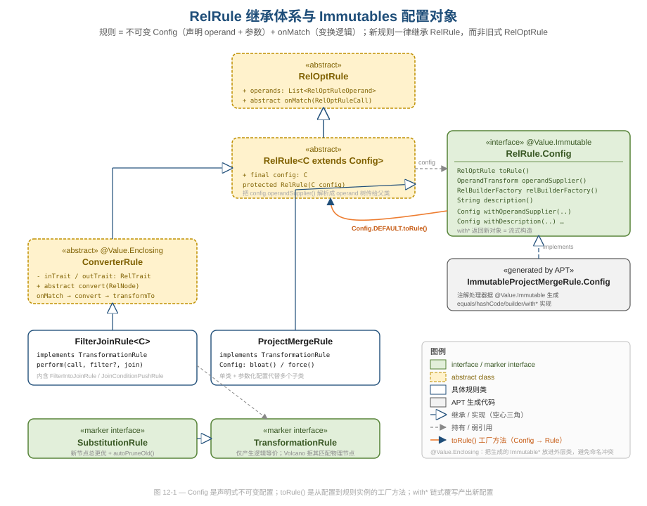
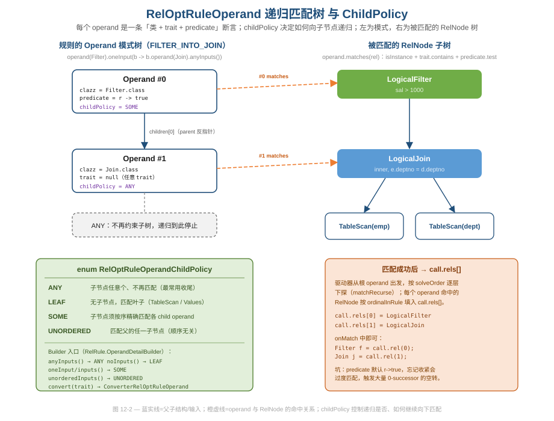
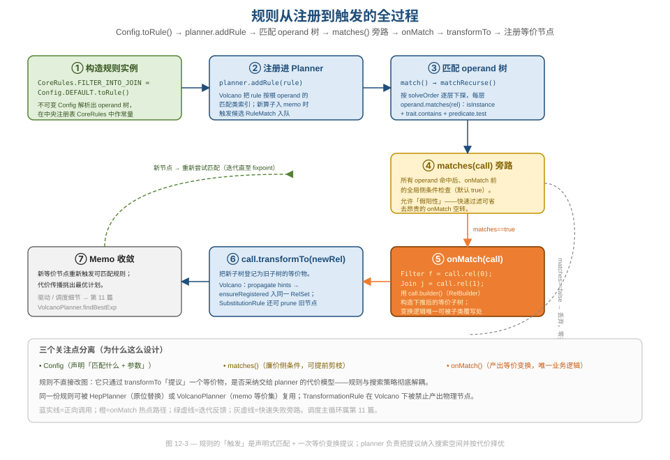

# 第 12 篇 · 规则体系：RelRule.Config + Operand + CoreRules

> 优化器的「智能」不在搜索引擎里，而在一条条可插拔的规则里。本篇拆解 Calcite 如何用「不可变配置 + 递归匹配树 + 中央注册表」三件套，把上百条变换规则做得既声明式、又可组合、还能在两套 planner 之间复用。
> 基线 commit `111030383` · 前置阅读：[第 11 篇 · VolcanoPlanner](11-volcano.md)、[第 04 篇 · RelNode](04-relnode.md)

## TL;DR（要点速览）

- 一条规则 = **不可变 `Config`（声明匹配什么 + 携带参数）** + **`onMatch`（产出一个等价变换的提议）**。两者关注点分离，规则与搜索策略彻底解耦。
- `Config` 用 Immutables（`@Value.Immutable`）生成 `equals`/`hashCode`/builder/`with*`，规则作者只写接口；`Config.DEFAULT.toRule()` 是从配置到实例的工厂方法。
- `RelOptRuleOperand` 是一棵「类 + trait + predicate」断言树，靠 `RelOptRuleOperandChildPolicy`（`ANY`/`LEAF`/`SOME`/`UNORDERED`）控制如何向子节点递归匹配。
- `CoreRules` 是一张中央注册表，把 160+ 条规则做成 `public static final` 常量，命名按算子前缀（`AGGREGATE_`/`FILTER_`/`JOIN_`）分组——既是清单，也是文档。
- `FilterJoinRule` 用一个 `perform` 方法 + 两个 `Config` 子类，同时覆盖「Filter 下推进 Join」和「Join 条件再下推」两种模式，是「单类多配置」的范本。
- `TransformationRule`/`SubstitutionRule` 是标记接口，向 planner 表达「我只产逻辑等价」「我产的总更优」，让搜索引擎据此剪枝。
- 坑：Immutables 忘配注解处理器会在运行时 `ClassNotFoundException`；operand 的 `predicate` 默认 `r -> true`，忘收紧会过度匹配、空转。

---

## 1. 一条规则长什么样：Config 与 onMatch 的二分

先看最直观的对象关系。下图是 `RelRule` 的继承体系与它所依赖的 Immutables 配置对象。



Calcite 里「规则」这个概念被切成了两半：

- **配置半**（`RelRule.Config`）：声明「这条规则匹配什么形状的子树、带哪些可调参数」。它是**不可变值对象**。
- **行为半**（`RelRule.onMatch`）：拿到匹配中的节点后，构造一个等价的新子树并提交。它是**唯一需要写业务逻辑的方法**。

`RelRule` 本身是个抽象类，构造时把配置里声明的 operand 解析出来交给父类（`core/src/main/java/org/apache/calcite/plan/RelRule.java`）：

```java
public abstract class RelRule<C extends RelRule.Config> extends RelOptRule {
  public final C config;

  protected RelRule(C config) {
    super(OperandBuilderImpl.operand(config.operandSupplier()),
        config.relBuilderFactory(), config.description());
    this.config = config;
  }
```

注意继承链：`RelRule` 仍然 `extends RelOptRule`——后者是旧式基类。类注释里写得很直白：「Constructors of `RelOptRule` are deprecated, so new rule classes should extend `RelRule`, not `RelOptRule`」。这是一次进行中的迁移：旧规则在构造函数里手写 operand，新规则把 operand 挪进了声明式的 `Config`。**为什么值得这么折腾？** 因为把「匹配条件」从命令式构造函数升级成不可变数据，规则就能被序列化、被 `with*` 微调、被注解处理器自动补全样板代码——配置即数据，是后面一切灵活性的根。

这次迁移本身是个值得学习的**渐进式重构**样本：Calcite 没有一刀切删掉 `RelOptRule`，而是让 `RelRule` 继承它、把旧构造函数标 `@Deprecated`（注释里 `to be removed before 2.0`），新旧规则在同一棵继承树下共存。旧规则不用立即改写、新规则享受配置化的好处，迁移成本被摊薄到多个版本。`FilterJoinRule` 和 `ConverterRule` 里那些 `@Deprecated` 的构造函数就是这个过渡期的痕迹——它们把老签名桥接到新的 `Config` 路径上，保证下游代码不破。对一个被无数项目依赖的库来说，「能演进而不破坏」本身就是顶级的工程能力。

`Config` 接口本身很小，核心就几个方法（同文件）：

```java
public interface Config {
  /** Creates a rule that uses this configuration. Sub-class must override. */
  RelOptRule toRule();

  @Value.Default default OperandTransform operandSupplier() { ... }
  Config withOperandSupplier(OperandTransform transform);

  @Value.Default default RelBuilderFactory relBuilderFactory() {
    return RelFactories.LOGICAL_BUILDER;
  }
  @javax.annotation.Nullable @Nullable String description();
}
```

`toRule()` 是关键的**工厂方法**：每个具体规则的 `Config` 子接口用 `default` 方法把自己变成规则实例。`onMatch` 在基类 `RelOptRule` 里是抽象方法（`core/src/main/java/org/apache/calcite/plan/RelOptRule.java`）：

```java
public abstract void onMatch(RelOptRuleCall call);
```

> **设计与代码质量视角**：这种「数据（Config）与行为（onMatch）分离」和我们在 [第 03 篇 · SqlNode](03-sqlnode.md) 看到的 `SqlCall`/`SqlOperator` 分离一脉相承——Calcite 反复用「把易变的描述抽成不可变值、把稳定的算法留在类里」来治理复杂度。

## 2. Immutables：让规则作者只写接口

`Config` 上的 `@Value.Immutable`（来自 `org.immutables:value`）不是装饰。看 `ProjectMergeRule` 的配置（`core/src/main/java/org/apache/calcite/rel/rules/ProjectMergeRule.java`）：

```java
@Value.Immutable
public interface Config extends RelRule.Config {
  Config DEFAULT = ImmutableProjectMergeRule.Config.of()
      .withOperandFor(Project.class);

  @Override default ProjectMergeRule toRule() {
    return new ProjectMergeRule(this);
  }

  @Value.Default default int bloat() { return RelOptUtil.DEFAULT_BLOAT; }
  Config withBloat(int bloat);

  @Value.Default default boolean force() { return true; }
  Config withForce(boolean force);
}
```

注意作者**只写了接口**：`ImmutableProjectMergeRule.Config` 这个具体类、它的 `equals`/`hashCode`/`builder`/`withBloat`/`withForce` 全部由注解处理器在编译期生成。`@Value.Default` 标注的方法给出默认值，`with*` 方法的返回类型仍是 `Config`——所以可以链式覆写：`Config.DEFAULT.withBloat(200).withForce(false)`，每次返回一个新的不可变对象。

外层类 `ProjectMergeRule` 上还有个 `@Value.Enclosing`（`ConverterRule` 也用了）。类注释解释了它的用途：把生成的 `Immutable*` 嵌进一个新的 Immutable 外层类里，避免多个内部 `Config` 在同一包下生成同名类时撞车。

**好在哪：** 一条规则原本要写的 `equals`/`hashCode`/builder/防御式拷贝，是出 bug 的高发区（漏一个字段、可变字段逃逸）。Immutables 把这块全自动化，作者只声明「有哪些参数、默认值是什么」。值对象天然安全共享，规则实例可以做成全局 `static final` 常量而无并发顾虑。

> **坑（如实记录）**：这套机制依赖编译期注解处理器。`core/build.gradle.kts` 里专门声明了 `annotationProcessor("org.immutables:value")`。**如果在自己的工程里写规则却忘了配这个处理器**，`ImmutableXxx.Config` 根本不会被生成，运行到 `Config.DEFAULT` 初始化时就 `ClassNotFoundException`——而且报错点离根因很远，排查体验很差。这是「编译期魔法」的固有代价：省了样板，但把一类配置错误从编译期推迟到了类加载期。

`ConverterRule` 把 Immutables 用出了另一种花样——它的 `Config` 不携带 operand 形状，而是携带 `inTrait`/`outTrait` 和一个 `ruleFactory`（`core/src/main/java/org/apache/calcite/rel/convert/ConverterRule.java`）：

```java
@Value.Immutable(singleton = false)
public interface Config extends RelRule.Config {
  RelTrait inTrait();
  Config withInTrait(RelTrait trait);
  RelTrait outTrait();
  Config withOutTrait(RelTrait trait);
  Function<Config, ConverterRule> ruleFactory();

  default <R extends RelNode> Config withConversion(Class<R> clazz,
      Predicate<? super R> predicate, RelTrait in, RelTrait out,
      String descriptionPrefix) {
    return withInTrait(in).withOutTrait(out)
        .withOperandSupplier(b -> b.operand(clazz).predicate(predicate).convert(in))
        .withDescription(createDescription(descriptionPrefix, in, out))
        .as(Config.class);
  }
}
```

这里 `withConversion` 是一个**便利构造器**：它把「匹配某类、做 trait 转换」这种 ConverterRule 的固定模式封进一个 `default` 方法，调用方只填类和 in/out trait。Convention/trait 的转换语义本身属于 [第 14 篇 · Trait/Convention](14-trait-convention.md)，这里只看它如何复用同一套 Config 机制。

链尾那个 `.as(Config.class)` 也值得一提——`Config` 接口提供了一个类型安全的向下转型助手（`RelRule.java`）：

```java
default <T extends Object> T as(Class<T> class_) {
  if (class_.isAssignableFrom(this.getClass())) {
    return class_.cast(this);
  } else {
    throw new UnsupportedOperationException(...);
  }
}
```

因为 `with*` 系列方法的返回类型只能是基类型 `Config`（接口契约固定），链式调用到中途想拿回子类型 `Config` 来继续调子类专有的 wither，就得 `.as(MyConfig.class)`。这是 fluent 接口与 Java 泛型受限继承之间的一个常见摩擦点，`as` 把强制转型的丑陋封装成了一个有意义的方法、并带越界检查——比裸 `(MyConfig) cfg` 更安全、更自解释。

## 3. Operand：一棵递归的「类 + trait + predicate」匹配树

规则怎么知道自己该在树的哪个位置开火？答案是 `RelOptRuleOperand`——一棵和被匹配的 RelNode 子树同构的断言树。



单个 operand 的匹配判定非常克制，就三件事（`core/src/main/java/org/apache/calcite/plan/RelOptRuleOperand.java`）：

```java
public boolean matches(RelNode rel) {
  if (!clazz.isInstance(rel)) {
    return false;
  }
  if ((trait != null) && !rel.getTraitSet().contains(trait)) {
    return false;
  }
  return predicate.test(rel);
}
```

类是否匹配（`isInstance`）、trait 是否满足（可为 `null` 表示不关心）、自定义谓词是否通过。三层短路，便宜的判断在前。

operand 之间的父子关系由 `childPolicy` 决定，它是一个四值枚举（`core/src/main/java/org/apache/calcite/plan/RelOptRuleOperandChildPolicy.java`）：

| 取值 | 含义 | Builder 入口 |
|---|---|---|
| `ANY` | 子节点任意，不再向下匹配（最常见的收尾） | `anyInputs()` |
| `LEAF` | 无子节点，匹配叶子（TableScan/Values） | `noInputs()` |
| `SOME` | 子节点须按序精确匹配各 child operand | `oneInput()` / `inputs()` |
| `UNORDERED` | 匹配父的任一子节点（顺序无关） | `unorderedInputs()` |

构造 operand 不靠手写，而靠 `RelRule.OperandBuilder` 这套流式 API。构造的入口是 `operandSupplier`，被 `OperandBuilderImpl.operand()` 在规则构造时执行一次（`RelRule.java`）：

```java
static RelOptRuleOperand operand(OperandTransform transform) {
  final OperandBuilderImpl b = new OperandBuilderImpl();
  requireNonNull(transform.apply(b), "done");
  if (b.operands.size() != 1) {
    throw new IllegalArgumentException("operand supplier must call one of "
        + "the following methods: operand or exactly");
  }
  return b.operands.get(0);
}
```

`OperandDetailBuilder` 里每个收尾方法都对应一种 childPolicy。例如 `oneInput` 先递归构建子 operand、再以 `SOME` 收尾：

```java
@Override public Done oneInput(OperandTransform transform) {
  final Done done = transform.apply(inputBuilder);
  requireNonNull(done, "done");
  return done(RelOptRuleOperandChildPolicy.SOME);
}
```

于是 `ProjectMergeRule` 的 operand 声明读起来就像在描述树的形状（`ProjectMergeRule.java`）：

```java
default Config withOperandFor(Class<? extends Project> projectClass) {
  return withOperandSupplier(b0 ->
      b0.operand(projectClass).oneInput(b1 ->
          b1.operand(projectClass).anyInputs()))
      .as(Config.class);
}
```

「一个 Project，它的单个输入又是一个 Project，再往下任意」——这正是「合并相邻两个 Project」要找的形状。

`OperandBuilder` 还留了个逃生舱 `exactly(RelOptRuleOperand)`，允许直接塞入一个手工构造好的 operand（`RelRule.java`）。绝大多数规则用不到它，但它的存在体现了 API 设计的一个分寸：流式 Builder 覆盖 95% 的常见形状、读起来声明式又安全，同时为极少数需要完全控制 operand 的场景保留出口，而不是把所有人都锁死在 Builder 的表达能力里。这种「常见路径优雅、极端路径可达」的双层设计在 Calcite 的 fluent API 里反复出现（`RelBuilder` 也有类似的 `push(RelNode)` 后门，见 [第 19 篇](19-design-patterns.md)）。

**Builder 模式的妙处**在于：嵌套的 lambda 既表达了树的层级，又强制了「每个 operand 必须以一个收尾方法结束」（返回类型 `Done` 是个空标记接口，不调收尾方法就编译不过/运行时报错）。这是用类型系统兜住「形状必须完整」这个约束。

> **坑（如实记录）**：`OperandDetailBuilderImpl` 里 `predicate` 的默认值是 `r -> true`。如果规则的命中条件其实需要额外判断（比如「只匹配非空 Join 条件」），却忘了调 `.predicate(...)`，operand 树会**过度匹配**——大量本不该触发的子树进入 `onMatch`，绝大多数又因为构造不出更优的等价物而「generated 0 successors」空转。`RelOptRule#matches` 的 Javadoc 甚至附了一段 awk 脚本，专门用来从日志里揪出这类「常放空炮」的规则。这提醒我们：声明式匹配很爽，但「匹配过宽」的成本是隐性的、要靠 profiling 才看得见。

`convert(trait)` 收尾会产出一个特殊的 `ConverterRelOptRuleOperand`，它重写了 `matches` 以避免「转换器去转换同类转换器」的 n² 爆炸（`RelOptRule.java`）：

```java
@Override public boolean matches(RelNode rel) {
  if (rel instanceof Converter) {
    if (((ConverterRule) getRule()).getTraitDef()
        == ((Converter) rel).getTraitDef()) {
      return false;   // 不让 converter 套 converter
    }
  }
  return super.matches(rel);
}
```

这是个小而精的防御式编程：匹配规则里内建了「别和自己同类纠缠」的护栏。

### 3.1 operand 树是怎么被展平和索引的

operand 树在规则构造时会被**展平成一个数组**，并预计算每个 operand 的索引和「求解顺序」。这一步发生在 `RelOptRule` 的构造函数里——`flattenOperands` 做前序展平，`assignSolveOrder` 算遍历序（`RelOptRule.java`）：

```java
private void flattenRecurse(List<RelOptRuleOperand> operandList,
    RelOptRuleOperand parentOperand) {
  int k = 0;
  for (RelOptRuleOperand operand : parentOperand.getChildOperands()) {
    operand.setRule(this);
    operand.setParent(parentOperand);     // 子 operand 反指父
    operand.ordinalInParent = k++;        // 在父中的位置（第几个输入）
    operand.ordinalInRule = operandList.size();  // 在整条规则里的全局序号
    operandList.add(operand);
    flattenRecurse(operandList, operand);
  }
}
```

`ordinalInRule` 就是 `call.rel(i)` 里那个 `i`：前序展平意味着「根 operand 是 0，它的第一个子是 1……」。`ordinalInParent` 记录「我是父的第几个输入」，匹配时据此去 `parentRel.getInputs().get(ordinalInParent)` 精确定位（`SOME` 策略）。`assignSolveOrder` 则为每个 operand 算一条遍历顺序——「先自己、再父、一路到根，然后补上剩余 operand」。

**为什么要预计算这些？** 因为同一条规则会被匹配成千上万次（memo 里每来一个新算子都可能触发）。把「树形结构 → 数组索引」「遍历顺序」这些纯函数式的派生信息在构造期算一次、存进 `final` 字段，匹配热路径上就只剩数组下标访问，没有任何树遍历开销。这是典型的「**把不变量从热路径挪到冷路径**」性能手法——和 [第 04 篇](04-relnode.md) 里 `digest`/`rowType` 的缓存是同一思路。

## 4. 从匹配到提议：onMatch → transformTo 的全过程

operand 树只回答「能不能匹配」。真正把匹配串成一次变换，要看驱动器如何遍历 operand 树、以及 `onMatch` 如何回写。



匹配的递归发生在 `VolcanoRuleCall.matchRecurse`（`core/src/main/java/org/apache/calcite/plan/volcano/VolcanoRuleCall.java`）。当所有 operand 都命中后，它会先问一句「规则自己同不同意」：

```java
private void matchRecurse(int solve) {
  // ...
  if (solve == operands.size()) {
    // We have matched all operands. Now ask the rule whether it
    // matches; this gives the rule chance to apply side-conditions.
    if (getRule().matches(this)) {
      onMatch();
    }
  }
  // ...
}
```

`matches(RelOptRuleCall)` 是规则的**全局侧条件**钩子，默认返回 `true`。它的 Javadoc 明确说：允许给假阳性（说匹配，但 `onMatch` 后续不产出任何 successor），它的价值是「在昂贵的 `onMatch` 之前廉价地剪掉一批」。这是「分层校验」的工程手法：operand 树做结构匹配，`matches()` 做跨节点的语义侧条件，`onMatch` 才做真正的构造。

值得一提的是 `matchRecurse` 的遍历方向是**双向**的。匹配从根 operand 命中的那个 RelNode 出发，但根据 `solveOrder` 里相邻两个 operand 的全局序号大小，下一步可能是「下探到子节点」也可能是「上溯到父节点」（`VolcanoRuleCall.java`）：

```java
boolean ascending = operandOrdinal < previousOperandOrdinal;
// ...
if (ascending) {
  // 上溯：从子的 RelSubset 找它的 parentRels
  final RelSubset subset = volcanoPlanner.getSubsetNonNull(previous);
  successors = subset.getParentRels();
} else {
  // 下探：从父的 inputs 里按 ordinalInParent / childPolicy 取子
  // ...
}
```

之所以需要上溯，是因为 Volcano 可能先碰到树中间某个算子（比如先有个新的 Join 入 memo），需要反向找它的父 Filter 才能凑齐整条规则的 operand。memo 里 `RelSubset` 保存了反向的 `parentRels` 指针正是为此。这一段也解释了 `UNORDERED` 策略的代价：它要遍历父的**所有**输入子集里的所有 rel 去逐个试匹配，所以 `unorderedInputs` 虽然方便（如 Union 的任意一支），但匹配开销明显高于按序的 `SOME`。memo/RelSubset 的结构属于 [第 11 篇](11-volcano.md)，此处只点到规则匹配如何借用它。

`onMatch` 里拿节点、构造新树、提交。看 `FilterJoinRule.FilterIntoJoinRule` 的入口（`core/src/main/java/org/apache/calcite/rel/rules/FilterJoinRule.java`）：

```java
@Override public void onMatch(RelOptRuleCall call) {
  Filter filter = call.rel(0);
  Join join = call.rel(1);
  perform(call, filter, join);
}
```

`call.rel(i)` 按 operand 在规则里的序号取出命中的 RelNode——序号正是 operand 树深度优先展平后的位置。最后 `perform` 用 `call.builder()` 拿到一个 `RelBuilder` 构造下推后的子树，并调 `call.transformTo(...)`（`FilterJoinRule.java` 末尾）：

```java
relBuilder.push(newJoinRel);
relBuilder.convert(join.getRowType(), false);
relBuilder.filter(/* 剩余的 above filters */);
call.transformTo(relBuilder.build());
```

`transformTo` 不是「替换」，而是「登记一个等价物」。在 Volcano 里它把新子树注册进同一个 `RelSet`（`VolcanoRuleCall.java`）：

```java
@Override public void transformTo(RelNode rel, Map<RelNode, RelNode> equiv,
    RelHintsPropagator handler) {
  if (rel instanceof PhysicalNode && rule instanceof TransformationRule) {
    throw new RuntimeException(
        rel + " is a PhysicalNode, which is not allowed in " + rule);
  }
  rel = handler.propagate(rels[0], rel);
  // ...
  if (this.getRule() instanceof SubstitutionRule
      && ((SubstitutionRule) getRule()).autoPruneOld()) {
    volcanoPlanner.prune(rels[0]);
  }
  RelSubset subset = volcanoPlanner.ensureRegistered(rel, rels[0]);
}
```

**这是整套设计的枢纽：规则永远不直接改图，只「提议」一个等价物，采不采纳由 planner 的代价模型说了算。** 规则与搜索策略由此彻底解耦——同一条规则，HepPlanner 会原位替换、VolcanoPlanner 会塞进 memo 等价集，规则作者完全不需要知道自己跑在哪套引擎下。代价模型与搜索主循环属于 [第 11 篇](11-volcano.md) 与 [第 13 篇 · 元数据与代价](13-metadata-cost.md)，此处不展开。

`transformTo` 开头那段 `PhysicalNode` 检查也透露出一个**跨引擎语义差异的坑**：同一条 `TransformationRule`，在 Volcano 下被禁止匹配/产出物理节点（这里直接抛异常），但在 Hep 下却可以（`TransformationRule` 注释明说 HepPlanner 会忽略该接口）。这意味着「一条规则两边都能跑」并非完全透明——若你写的规则在 Hep 里依赖了匹配物理算子的行为，搬到 Volcano 会直接炸。规则与搜索策略「解耦」是设计目标，但物理/逻辑的分层约束让这层解耦留了个有意的缺口，使用时要清楚自己的规则归属哪一类。这也是为什么 §7 的标记接口要把「我只产逻辑等价」钉死在类型上：它既是给 planner 的剪枝提示，也是给规则作者的纪律。

## 5. CoreRules：一张可读的中央注册表

写好的规则放哪？Calcite 用 `CoreRules` 把所有逻辑变换规则做成 `public static final` 常量（`core/src/main/java/org/apache/calcite/rel/rules/CoreRules.java`，本类含 160+ 条规则常量）：

```java
public class CoreRules {
  private CoreRules() {}

  public static final AggregateProjectMergeRule AGGREGATE_PROJECT_MERGE =
      AggregateProjectMergeRule.Config.DEFAULT.toRule();

  public static final FilterJoinRule.FilterIntoJoinRule FILTER_INTO_JOIN =
      FilterJoinRule.FilterIntoJoinRule.FilterIntoJoinRuleConfig.DEFAULT.toRule();

  public static final ProjectMergeRule PROJECT_MERGE =
      ProjectMergeRule.Config.DEFAULT.toRule();
}
```

命名遵循「算子前缀 + 动作」：`AGGREGATE_*`、`FILTER_*`、`JOIN_*`、`PROJECT_*`、`SORT_*`。这张表既是规则清单，又是文档——每个常量上的 Javadoc 描述它匹配什么、做什么变换。私有构造函数确保它只是命名空间，不会被实例化。

**为什么用常量而非枚举或反射扫描？** 因为规则实例是不可变值对象，做成常量既能跨 planner 共享一份、又能让 IDE 的「查找用法」直接显示哪些规则集引用了它。`HepProgram` 和 `RelOptRuleSet` 直接引用这些常量来组装规则集，引用关系是静态可查的——这比「按名字字符串注册」要可维护得多。

同一条规则常常有「变体」，靠**不同的 `Config` 常量 + 同一个 `toRule()`** 产出。`AggregateExpandDistinctAggregatesRule` 是典型（`core/src/main/java/org/apache/calcite/rel/rules/AggregateExpandDistinctAggregatesRule.java`）：

```java
@Value.Immutable
public interface Config extends RelRule.Config {
  Config DEFAULT = ImmutableAggregateExpandDistinctAggregatesRule.Config.of()...;
  Config JOIN = DEFAULT.withUsingGroupingSets(false);
}
```

对应 `CoreRules` 里两个常量，一个展开成 grouping sets、一个展开成 Join：

```java
public static final AggregateExpandDistinctAggregatesRule
    AGGREGATE_EXPAND_DISTINCT_AGGREGATES =
    AggregateExpandDistinctAggregatesRule.Config.DEFAULT.toRule();

public static final AggregateExpandDistinctAggregatesRule
    AGGREGATE_EXPAND_DISTINCT_AGGREGATES_TO_JOIN =
    AggregateExpandDistinctAggregatesRule.Config.JOIN.toRule();
```

一个规则类、两份配置、两个具名实例——这正是「配置化」省下子类爆炸的红利。

### 5.1 description：规则的「身份证」与去重契约

每条规则都有一个 `description` 字符串，它不只是日志可读性，而是 planner 内部的**唯一标识**。`RelOptRule` 构造时强制校验，并在缺省时从类名推断（`RelOptRule.java`）：

```java
if (!description.matches("[A-Za-z][-A-Za-z0-9_.(),\\[\\]\\s:]*")) {
  throw new RuntimeException("Rule description '" + description + "' is not valid");
}
```

`guessDescription` 取类名最后一段（`com.foo.Bar$Baz` → `Baz`），还专门拦截了「匿名内部类导出数字名」的情况并抛错，逼作者显式命名。`RelOptRule#equals` 也把 `description` 纳入相等判定：

```java
return this == that
    || this.getClass() == that.getClass()
    && this.description.equals(that.description)
    && this.operand.equals(that.operand);
```

**为什么要把字符串描述当主键？** 因为同一个规则类可能有多个配置变体同时注册进 planner（回看 `FILTER_INTO_JOIN` 与 `FILTER_INTO_JOIN_DUMB`），planner 用 description 去重、用它在 `RuleQueue` 里给 `RuleMatch` 命名、在 trace 日志里定位「是哪条规则放了空炮」。注意旧式 deprecated 构造里那些 `withDescription("FilterJoinRule:filter")`——人工命名的好处是 trace 里一眼能区分变体。这是一个常被低估的可观察性设计：**给每个可调度单元一个稳定、人类可读、且参与相等性的名字**。

### 5.2 注册表分层：CoreRules 与它的伙伴

`CoreRules` 的类注释指向了 `MaterializedViewRules`——物化视图改写规则单独成表。这种「按主题切分注册表」的做法（核心逻辑规则、物化视图规则、各 adapter 的 `JdbcRules`/`EnumerableRules` 等）让规则集成为可组合的乐高块：`HepProgram` 或 `RelOptRuleSet` 按需挑常量拼装，而不是面对一个上千条规则的大杂烩。**坑**：正因为注册是「显式引用常量」而非自动扫描，自己拼规则集时**漏注册**某条关键规则，表现是「优化没生效但也不报错」——这类沉默失败只能靠对照预期计划（EXPLAIN）排查。这是「显式优于隐式」的取舍：放弃了自动发现的便利，换来了可追溯和可控。

## 6. 一类两用：FilterJoinRule 的「单类多配置」

`FilterJoinRule` 把「配置化」用到极致：一个抽象类承载全部下推算法，两个 `Config` 子类只声明 operand 形状的差异（`FilterJoinRule.java`）。

```java
public abstract class FilterJoinRule<C extends FilterJoinRule.Config>
    extends RelRule<C> implements TransformationRule {

  protected void perform(RelOptRuleCall call, @Nullable Filter filter, Join join) {
    // ... 200 行下推主逻辑，filter 可空
  }
}
```

注意 `perform` 的 `filter` 参数是 `@Nullable`——这是把两种场景统一进一个方法的关键设计。两个子类的差别只在「有没有 Filter」：

```java
// 变体一：Filter 在 Join 之上 → 把 where 谓词推进 join
public static class FilterIntoJoinRule extends FilterJoinRule<...> {
  @Override public void onMatch(RelOptRuleCall call) {
    Filter filter = call.rel(0);
    Join join = call.rel(1);
    perform(call, filter, join);
  }
  public interface FilterIntoJoinRuleConfig extends FilterJoinRule.Config {
    FilterIntoJoinRuleConfig DEFAULT = ...
        .withOperandSupplier(b0 ->
            b0.operand(Filter.class).oneInput(b1 ->
                b1.operand(Join.class).anyInputs()))
        .withSmart(true);
  }
}

// 变体二：只匹配 Join → 把 on 条件再下推到输入
public static class JoinConditionPushRule extends FilterJoinRule<...> {
  @Override public void onMatch(RelOptRuleCall call) {
    Join join = call.rel(0);
    perform(call, null, join);     // filter == null
  }
}
```

`onMatch` 各自取出对应节点、用 `null` 区分「有没有外层 Filter」，剩下的下推逻辑两者共用一份。

**好在哪：** 「Filter 下推进 Join」和「Join 条件再下推」在算法上 90% 重合（都要把谓词按列归属切分到左/右/join 三处，处理外连接的语义边界）。如果做成两个独立类，这段棘手的 `classifyFilters` + 外连接简化逻辑就得复制两份，将来修一处漏一处。`FilterJoinRule` 用「抽象类放共享算法 + Config 子类放差异」把重复压到最小。

`FilterJoinRule.Config` 还演示了**带参数的规则配置**——`isSmart()`（是否尝试收紧外连接类型）和一个 `Predicate`（哪些谓词允许留在 ON 子句）：

```java
public interface Config extends RelRule.Config {
  @Value.Default default boolean isSmart() { return false; }
  Config withSmart(boolean smart);

  @Value.Parameter
  Predicate getPredicate();
  Config withPredicate(Predicate predicate);
}
```

`@Value.Parameter` 让这个字段进入生成类的 `of(...)` 构造方法，使 `ImmutableFilterIntoJoinRuleConfig.of(predicate)` 成为可能。同一份下推算法，靠不同参数就能调出「激进/保守」「等值/任意谓词」等多种行为——这是策略对象注入配置的又一例。

这里的 `Predicate` 本身是 `FilterJoinRule` 自定义的函数式接口（`@FunctionalInterface boolean apply(Join, JoinRelType, RexNode)`），而非配置项里那个 operand 用的 `java.util.function.Predicate`。两者同名不同物，初读容易混淆，但职责清晰：operand 的 predicate 决定「这个节点要不要进 onMatch」，而 `FilterJoinRule.Predicate` 决定「ON 子句里这个谓词能不能留下、还是要被推回 Join 之上」——前者是匹配期的结构断言，后者是变换期的语义策略。一条复杂规则同时用到「匹配策略」和「变换策略」两层可注入的行为，是 Strategy 模式在真实代码里少见的密集应用。子类配置上的 `@Value.Immutable(singleton = false)` 则是告诉注解处理器「这个配置带参数、不能做成单例常量」——和 `ProjectMergeRule.Config` 那种无必填参数、可生成 `of()` 单例的情况相对照。

## 7. 标记接口：把「规则的性质」告诉 planner

`FilterJoinRule` 还 `implements TransformationRule`。这是个**空标记接口**（`core/src/main/java/org/apache/calcite/rel/rules/TransformationRule.java`）：

```java
public interface TransformationRule {
}
```

它不带任何方法，纯粹用来给规则「打标签」。语义全在 Javadoc 里：实现它表示「我只产生逻辑等价的替代，不产物理算子」。`VolcanoPlanner` 据此剪枝——`TransformationRule` 在 Volcano 下不会去匹配实现了 `PhysicalNode` 的物理算子（前面 `transformTo` 那段抛异常的检查正是这条规矩的强制执行）。而 `HepPlanner` 会忽略这个接口（HepPlanner 细节见 [第 10 篇](10-hep-planner.md)）。

`SubstitutionRule` 在它之上再加一层语义（`core/src/main/java/org/apache/calcite/rel/rules/SubstitutionRule.java`）：

```java
public interface SubstitutionRule extends TransformationRule {
  /** Whether the planner should automatically prune old node ... */
  default boolean autoPruneOld() {
    return false;
  }
}
```

它表示「我产出的新节点通常严格更优」，planner 可以优先跑完所有 substitution 规则、甚至 `autoPruneOld()` 时直接剪掉旧节点（回看 §4 的 `transformTo`：它确实查了 `instanceof SubstitutionRule` 并 prune）。

**为什么用标记接口而不是配置字段？** 因为「是 transformation 还是 substitution」是规则的**类型级**性质，不随实例配置变化；用接口表达，planner 能用一次 `instanceof` 判断，且这条性质在整个继承体系里被静态约束（子类天然继承标记）。这是「用类型系统编码不变量」的典型——相比一个布尔配置字段，标记接口让「这条规则是什么」在编译期就钉死了。

## 8. 把这套约定串起来：写一条规则的五步法

`RelRule` 的类注释（`RelRule.java` 头部）给出了一套官方「写规则五步法」，它正好把前面所有机制串成一条流水线。提炼如下：

1. **若是 `ConverterRule` 且无额外参数**：不必写内部 `Config`，只在类里建一个 `public static final Config DEFAULT_CONFIG`，直接跳到第 5 步。
2. **否则建内部接口 `Config extends RelRule.Config` 并标 `@Value.Immutable`**；类两层深时给外层标 `@Value.Enclosing`（避免生成类同名冲突）。用 `default` 方法实现 `toRule()`：`return new MyRule(this);`。
3. **每个参数配一对方法**：`int foo();` + `Config withFoo(int x);`，让注解处理器生成不可变 getter/wither。
4. **建 `Config DEFAULT` 常量**，用生成的 `ImmutableXxx.Config.builder()...build()` 把 operand 形状和默认参数固化下来。
5. **不要在规则类里建 `INSTANCE` 常量**——注释特意警告这点：把命名实例放进一个**非** `RelOptRule` 子类的 holder 类（约定叫 `XxxRules`，如 `CsvRules`），用 `Config.DEFAULT.toRule()` 产出。

第 5 步的「holder 类不能是 `RelOptRule` 子类」是个容易忽视的坑：如果把规则常量直接挂在规则类自己身上，会引入**类加载循环**（类初始化时要构造自己的实例，而构造又依赖类已初始化）。`CoreRules` 是个独立的、私有构造的命名空间类，正是为规避这个问题——这也解释了为什么注册表要和规则类分家。

> **数据工程视角**：这套约定的真正回报在 adapter 上。一个新数据源（见 [第 17 篇 · 扩展性](17-extensibility.md)、[第 18 篇 · Adapter 生态](18-adapters.md)）要把算子下推到外部系统，本质就是写若干 `ConverterRule`/`TransformationRule` 把逻辑算子改写成自己 Convention 的物理算子。因为规则与搜索引擎解耦、配置又是声明式的，adapter 作者几乎不碰优化器内核，只声明「我的 Filter 能下推、长这样」，剩下的择优交给 planner。这就是 Calcite「无存储、靠规则联邦」架构能成立的微观基础。

回头看，本篇拆出的几条工程主线其实彼此咬合：不可变 `Config` 让规则成为可安全共享的值对象，于是能放进 `CoreRules` 当常量；operand 树把「匹配什么」做成声明式数据，于是能在构造期展平索引、在热路径上零开销；`onMatch`/`transformTo` 的「提议-采纳」分离让规则不必关心搜索策略，于是同一条规则能在 Hep 与 Volcano 间复用；标记接口把规则性质钉在类型上，于是 planner 能据此剪枝。每一处「好在哪」都不是孤立技巧，而是为了让「一个上千条规则、可被任意拼装、且能跨引擎运行的变换体系」在工程上可维护——这正是值得借鉴的地方：把一个本质上很发散的扩展点（任意多的优化规则），用「不可变数据 + 声明式匹配 + 解耦提交」三板斧收敛成了一套人人能照模板写、机器能高效调度的契约。

## 设计模式与工程小结

| 机制 | 模式 | 落点 | 好在哪 / 坑 |
|---|---|---|---|
| `RelRule.Config` + `@Value.Immutable` | Immutables 值对象 / Builder | `RelRule.java`、各规则 `Config` | 作者只写接口，APT 生成 equals/hashCode/with*；坑：忘配注解处理器 → 运行期 ClassNotFound |
| `Config.DEFAULT.toRule()` | 工厂方法 | `Config#toRule` | 配置到实例的单一入口；同类多配置产多个具名变体，免子类爆炸 |
| `with*` 链式覆写 | 流式接口 / 不可变变换 | `withSmart`/`withBloat`… | 微调配置返回新对象，规则实例可安全做全局常量 |
| `RelOptRuleOperand` 树 + `ChildPolicy` | 组合模式 / 模式匹配树 | `RelOptRuleOperand.java` | 声明式描述子树形状；坑：predicate 默认 true，匹配过宽空转 |
| `OperandBuilder` 嵌套 lambda | Builder + 类型驱动约束 | `RelRule.java` 内部类 | `Done` 标记接口强制每 operand 收尾完整 |
| `onMatch` / `transformTo` 分离 | 模板方法 + 提议-采纳解耦 | `RelOptRule#onMatch`、`VolcanoRuleCall#transformTo` | 规则只提议等价物，搜索策略可换；HEP/Volcano 复用同一规则 |
| `matches(call)` 侧条件 | 分层校验 / 提前剪枝 | `RelOptRule#matches` | 廉价旁路省去昂贵 onMatch；允许假阳性 |
| `CoreRules` 常量池 | 中央注册表 | `CoreRules.java` | 规则即清单即文档，引用静态可查；坑：手写规则集时易漏注册 |
| `TransformationRule`/`SubstitutionRule` | 标记接口 / 类型级元数据 | 同名接口 | 把规则性质编进类型，planner 据此剪枝；比布尔字段更稳 |
| `FilterJoinRule` 一类两用 | 抽象类共享算法 + 配置差异 | `FilterJoinRule.java` | 重合算法只写一份；`@Nullable filter` 统一两场景 |
| `description` 作主键 | 稳定标识 / 可观察性 | `RelOptRule#equals`、`guessDescription` | 参与去重与 trace 命名；强制命名规范，拦截匿名类数字名 |
| `Config#as(Class)` | 类型安全向下转型 | `RelRule.Config#as` | 绕过 fluent 接口的泛型受限继承，带越界检查 |
| `exactly(operand)` 逃生舱 | 常见路径优雅 + 极端路径可达 | `RelRule.OperandBuilder` | Builder 覆盖 95%，余下场景仍可手工塞 operand |

> Immutables、Builder、Registry、Strategy 等模式在本系列的「模式视角」总览见 [第 19 篇 · 设计模式全景](19-design-patterns.md)；本篇只讲它们在规则体系里的具体落地。

## 对照阅读建议（动手）

- **断点**：`core/src/main/java/org/apache/calcite/plan/volcano/VolcanoRuleCall.java` → `VolcanoRuleCall#matchRecurse`
  - **观察**：`solve` 从 0 逐层递增；`operands` 的 `solveOrder`/`ordinalInRule` 如何决定下探顺序；`solve == operands.size()` 时 `getRule().matches(this)` 的返回值。
  - **运行**：`./gradlew :core:test --tests org.apache.calcite.test.RelOptRulesTest`（任一含 Filter+Join 的用例都会命中 `FILTER_INTO_JOIN`）。

- **断点**：`core/src/main/java/org/apache/calcite/rel/rules/FilterJoinRule.java` → `FilterJoinRule#perform`
  - **观察**：`aboveFilters`/`leftFilters`/`rightFilters`/`joinFilters` 四个列表如何被 `RelOptUtil.classifyFilters` 重分配；外连接时 `joinType` 是否被 `simplifyJoin` 收紧；末尾 `call.transformTo(...)` 提交的子树形状。
  - **运行**：同上，或针对 `JOIN_CONDITION_PUSH` 写一条带复合 ON 条件的 SQL。

- **断点**：`core/src/main/java/org/apache/calcite/plan/RelOptRuleOperand.java` → `RelOptRuleOperand#matches`
  - **观察**：`clazz.isInstance(rel)`、`trait` 判定、`predicate.test(rel)` 三层短路；把一个 predicate 故意写成总 false，看 `onMatch` 是否就不再被调用。

- **冒烟实验**：在 `CoreRules` 里随便取一个常量（如 `CoreRules.PROJECT_MERGE`），在 IDE 里「查找用法」，观察它被哪些 `RelOptRuleSet`/`HepProgram` 引用——直观感受中央注册表的可追溯性。

## 延伸阅读

- 本系列：[第 11 篇 · VolcanoPlanner](11-volcano.md)（规则被谁、按什么顺序调度）、[第 10 篇 · HepPlanner](10-hep-planner.md)（同一规则在启发式 planner 下的原位替换）、[第 13 篇 · 元数据与代价](13-metadata-cost.md)（采不采纳规则提议的依据）、[第 14 篇 · Trait/Convention](14-trait-convention.md)（ConverterRule 的 trait 转换语义）、[第 19 篇 · 设计模式全景](19-design-patterns.md)（Immutables/Registry/Strategy 的模式归纳）。
- 官方文档：`site/_docs/algebra.md`（RelBuilder，规则在 `onMatch` 里用它造树）、`site/_docs/adapter.md`（自定义规则与 Convention）。
- 源码自带教学规则：`example/csv` 中的 `CsvProjectTableScanRule`——`RelRule` 类注释里的「写规则五步法」就是以它为模板。
