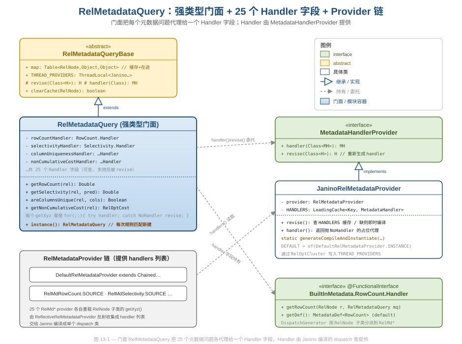
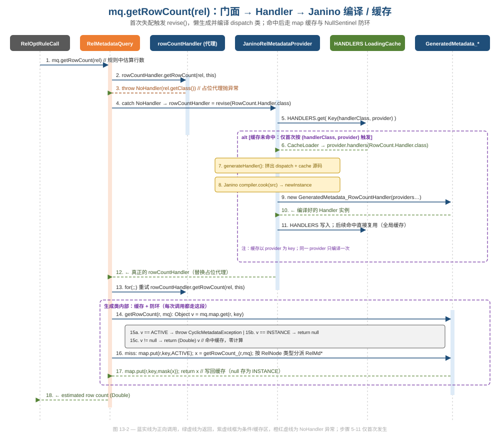
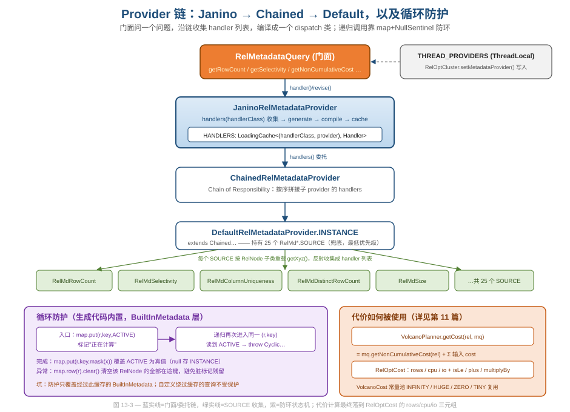

# 第 13 篇 · 元数据与代价：RelMetadataQuery + Janino provider

> 优化器要做代价决策，靠的不是某个 RelNode 自己报数，而是一个能对任意算子提问"行数多少、谓词选择度多少、列是否唯一、代价多大"的元数据子系统。本篇讲清这个子系统的工程实现：一个强类型门面、25 个运行时编译出来的 dispatch handler、一套基于线程本地与全局缓存的装配，以及把递归元数据计算从无限循环里救出来的防护。
> 基线 commit `111030383` · 前置阅读：[第 11 篇 · VolcanoPlanner](11-volcano.md)、[第 12 篇 · 规则体系](12-rules.md)

## TL;DR（要点速览）

- **门面（Facade）**：`RelMetadataQuery`（下称 RMQ）把"问关系表达式的统计信息"收敛成约 25 个 `getXyz(rel)` 方法。调用者永远只跟门面打交道，不碰反射、不碰 provider 链。
- **运行时代码生成**：每种元数据（RowCount/Selectivity/…）对应一个 `Handler` 接口，其分派实现不是手写的，而是 `JaninoRelMetadataProvider` 在运行时用 Janino **拼源码 + 即时编译**出来的 `GeneratedMetadata_*` 类——用一串 `if (r instanceof XxxRel)` 取代昂贵的反射分派。
- **懒装配 + 自愈**：门面字段初始时是会抛 `NoHandler` 的占位代理；首次调用失败后 `for(;;)` 循环里 `revise()` 触发编译，把真 handler 装回字段，然后重试。这是一种"先用假货、缺了再补"的惰性初始化。
- **两层缓存**：`JaninoRelMetadataProvider.HANDLERS`（编译产物按 provider 缓存，全局）+ `RelMetadataQueryBase.map`（单次查询内按 `(RelNode, key)` 缓存结果，会话级）。
- **循环防护**：元数据计算天然递归（RowCount 要问子节点的 RowCount）。生成代码用 `NullSentinel.ACTIVE` 在 `map` 里打"正在计算"标记，重入时抛 `CyclicMetadataException` 打断环。
- **代价（Cost）**：`RelOptCost` 是 `rows/cpu/io` 三元组的抽象接口，`VolcanoCost` 是默认实现。代价本身也是一种元数据（`getNonCumulativeCost`），由优化器累加成累积代价用于剪枝（主循环用法见[第 11 篇](11-volcano.md)）。
- **坑**：`HANDLERS` 缓存全局且以 provider 身份为 key——自定义 provider 若没正确实现 `equals/hashCode` 会缓存错乱；防环只覆盖经过 `map` 缓存的 BuiltInMetadata 查询；`THREAD_PROVIDERS` 没被设置时门面构造会 NPE。

---

> 阅读地图：本篇先讲"为什么要有元数据门面"（§1），再讲门面背后的契约 Handler（§2），然后是全篇核心——它如何用 Janino 在运行时把反射换成 `instanceof` 分派（§3）、如何懒装配并自愈（§4）、如何用两层缓存与 sentinel 防环（§5）、handler 列表如何沿 provider 链凑齐（§6），最后落到代价这一特殊元数据（§7）。每一节都尽量回到"这段代码好在哪、为什么这么写、有什么坑"。

## 1. 问题：优化器需要"对任意算子提问"的能力

回顾一下代价驱动优化的处境。`FilterIntoJoinRule` 想知道"把谓词推到 join 下面值不值"，得估算谓词的选择度；`VolcanoPlanner` 要在等价的物理计划里挑最便宜的，得知道每个候选的行数和代价。这些信息有一个共同形态：**给定一个 `RelNode`，回答一个关于它的统计问题**。

最朴素的做法是把这些方法塞进 `RelNode` 接口——事实上 `RelNode#estimateRowCount` 就是这么干的。但很快会失控：选择度、唯一键、列大小、并行度、列血缘……几十个问题全挂到 `RelNode` 上，接口爆炸，而且每加一个问题都要改所有算子。Calcite 的选择是把这套能力**抽出来独立成一个子系统**，入口就是 `RelMetadataQuery`：

```java
// core/.../rel/metadata/RelMetadataQuery.java:272
public /* @Nullable: CALCITE-4263 */ Double getRowCount(RelNode rel) {
  for (;;) {
    try {
      Double result = rowCountHandler.getRowCount(rel, this);
      return RelMdUtil.validateResult(castNonNull(result));
    } catch (MetadataHandlerProvider.NoHandler e) {
      rowCountHandler = revise(BuiltInMetadata.RowCount.Handler.class);
    }
  }
}
```

注意这个方法的签名有多干净：进 `RelNode`，出 `Double`。调用方（规则、planner）完全看不见后面那套反射、Janino、缓存、provider 链的机器。这就是 **Facade 模式**的标准收益——把一个复杂子系统的全部入口收敛到一个窄接口上。这里的 `this` 作为第二个参数传给 handler，是为了让 handler 在递归时能继续用同一个 RMQ（同一份缓存、同一套防环状态）。

规则代码里拿 RMQ 的标准姿势是 `call.getMetadataQuery()`（在 `RelOptRuleCall` 上），它返回的就是当前这一轮规则匹配绑定的那个 RMQ 实例——所以一条规则在 `onMatch` 里多次 `mq.getRowCount(...)` 会共享同一份缓存。门面的静态 `instance()`（`RelMetadataQuery.java:240`，内部 `new RelMetadataQuery()`）则是给规则上下文之外的场景兜底用的。无论哪条路，调用方接触到的都只是 `getXyz(rel)` 这层皮，下面的装配与缓存全被门面挡住。

> 软件工程视角：RMQ 是"窄腰（narrow waist）"。上游有几十个规则、几个 planner，下游有 25 个 provider、每个 provider 又重载十几个 RelNode 子类。把所有交互压到一个门面上，两侧都能独立演化——加一个新算子只需在 provider 里加一个重载，加一个新规则只需调一个 `getXyz`。

门面里这 25 个方法长得高度一致，几乎都是同一个模板的复制：

```java
// core/.../rel/metadata/RelMetadataQuery.java（节选 getSelectivity / areColumnsUnique）
public @Nullable Double getSelectivity(RelNode rel, @Nullable RexNode predicate) {
  for (;;) {
    try {
      Double result = selectivityHandler.getSelectivity(rel, this, predicate);
      return RelMdUtil.validatePercentage(result);
    } catch (MetadataHandlerProvider.NoHandler e) {
      selectivityHandler = revise(BuiltInMetadata.Selectivity.Handler.class);
    }
  }
}
```

`getRowCount`、`getSelectivity`、`areColumnsUnique`、`getDistinctRowCount`……都是这个骨架：`for(;;)` 包一个 `try { handler 调用 + 校验 } catch (NoHandler) { 字段 = revise(...) }`。少量方法在门面层多做一点派生计算而非纯代理——例如 `areRowsUnique`（`RelMetadataQuery.java:562`）先用 `getMaxRowCount(rel) <= 1` 短路（一行最多的关系当然行唯一），不满足才落到 `areColumnsUnique`；`getColumnOrigin`（`RelMetadataQuery.java:429`）在 `getColumnOrigins` 之上做"恰好一个来源"的收窄。这种"门面层薄派生 + handler 层重计算"的分工，把跨多种元数据的组合逻辑放在门面（一处），把单一元数据的算法放在 provider（可重载），是清晰的职责划分。



图 13-1 给出全貌。门面 `RelMetadataQuery`（橙色高亮，因为它是优化器热点路径）持有约 25 个 `Handler` 字段，每个字段对应一种元数据。它继承自 `RelMetadataQueryBase`（抽象基类，持有缓存 `map` 和线程本地 `THREAD_PROVIDERS`）。右侧是装配侧：`MetadataHandlerProvider` 接口负责"给我某种 handler"，`JaninoRelMetadataProvider` 是其 Janino 实现；最下面是 provider 链（`DefaultRelMetadataProvider` 收集 25 个 `RelMd*.SOURCE`），它们提供原始的、按 RelNode 子类重载的实现。

---

## 2. Handler：每种元数据一个函数式接口

门面的每个方法背后是一个 `Handler`。看 RowCount 的定义：

```java
// core/.../rel/metadata/BuiltInMetadata.java:274
public interface RowCount extends Metadata {
  MetadataDef<RowCount> DEF =
      MetadataDef.of(RowCount.class, RowCount.Handler.class,
          BuiltInMethod.ROW_COUNT.method);

  @Nullable Double getRowCount();

  /** Handler API. */
  @FunctionalInterface
  interface Handler extends MetadataHandler<RowCount> {
    @Nullable Double getRowCount(RelNode r, RelMetadataQuery mq);

    @Override default MetadataDef<RowCount> getDef() {
      return DEF;
    }
  }
}
```

这里有个值得停下看的设计。`Metadata`（`RowCount`）和 `Handler` 是两个角色：`Metadata` 表达"这是关于行数的元数据"，`Handler` 表达"如何对一个具体 `RelNode` 算出行数"。Handler 方法比 Metadata 方法多了 `RelNode r` 和 `RelMetadataQuery mq` 两个参数——因为真正干活时既要知道对谁算（`r`），也要能递归地问别人（`mq`）。`@FunctionalInterface` 标记让 handler 可以是 lambda 或方法引用，也让生成的分派代码可以直接 `new` 一个实现类。

`BuiltInMetadata` 是一个纯接口容器，里面嵌套了 20 多个这样的 `Metadata + Handler` 对，每一个都是同样的"双接口 + DEF"结构。按用途大致分四类：

| 类别 | 代表元数据 | 优化器拿它干什么 |
|---|---|---|
| 基数估计 | `RowCount` / `MaxRowCount` / `MinRowCount` / `DistinctRowCount` / `PopulationSize` | 估算中间结果规模，是代价的基础输入 |
| 谓词与选择度 | `Selectivity` / `Predicates` / `AllPredicates` | 估算过滤后剩多少行、能下推哪些谓词 |
| 唯一性与依赖 | `UniqueKeys` / `ColumnUniqueness` / `FunctionalDependency` | 判断能否去重、能否消除冗余聚合 |
| 物理属性与代价 | `Collation` / `Distribution` / `Size` / `Memory` / `Parallelism` / `NonCumulativeCost` / `CumulativeCost` / `LowerBoundCost` | 排序/分布属性、内存/代价估算，驱动物理计划选择 |
| 血缘与解释 | `ColumnOrigin` / `ExpressionLineage` / `TableReferences` / `NodeTypes` / `ExplainVisibility` | 列血缘、计划解释、物化视图匹配等 |

这些就是门面那 25 个字段、`DefaultRelMetadataProvider` 那 25 个 `SOURCE`（`DefaultRelMetadataProvider.java:42`）一一对应的全集。注意它们粒度不一：有的接收额外参数（`getSelectivity(predicate)`、`areColumnsUnique(columns, ignoreNulls)`、`getColumnOrigins(column)`），这正是 §5.1 缓存键策略要按参数类型分流的原因。

> 设计与代码质量视角：这是一个把"数据形态"和"计算策略"分离的范例（与 [第 03 篇](03-sqlnode.md) 讲的数据/行为分离同源）。`RowCount` 描述结果类型，`Handler` 描述计算契约，`MetadataDef` 把两者 + 反射用的 `Method` 绑成一个可被框架机械处理的三元组。正是这个机械可处理性，让下一节的运行时代码生成成为可能——生成器不需要硬编码每种元数据，它对着 `MetadataDef` 和 `Handler` 反射就能拼代码。

---

## 3. 运行时代码生成：用 Janino 把反射换成 instanceof

这是本篇最硬核的部分，也是 Calcite 这套设计的精华。

### 3.1 为什么不直接用反射

一个 provider（比如 `RelMdRowCount`）会重载很多个 `getRowCount`：`getRowCount(Filter, mq)`、`getRowCount(Join, mq)`、`getRowCount(Aggregate, mq)`……当门面拿到一个具体 `RelNode`，需要找到匹配其运行时类型的那个重载来调用。"按运行时类型选重载"正是反射的典型场景。

朴素的反射方案有两笔开销。一笔是**查找**：拿 `rel.getClass()` 去 provider 的方法表里找匹配重载，还得沿继承链向上回退（`LogicalFilter` 没有专属重载就退到 `Filter`，再退到 `RelNode`），这个"按类型 + 继承回退选重载"的逻辑本身就不便宜。另一笔是**调用**：`Method.invoke` 要装箱参数成 `Object[]`、做访问检查、再反射调用，比直接方法调用慢一个量级。而元数据查询在一次优化里会被调用**成千上万次**（每个候选计划的每个节点都可能被反复问行数、选择度、代价），这两笔开销会被放大成可观的总成本。

Calcite 的解法：在运行时**生成一个普通 Java 类**，把"按类型选重载 + 继承回退"这件事一次性编译成一长串 `if (r instanceof XxxRel) return providerN.getRowCount((XxxRel) r, mq);`，然后用 Janino 编译成字节码。生成一次，之后每次调用都是纯虚方法调用 + `instanceof` 判断，没有反射查找、没有 `invoke`。本质上是把"运行时重复做的类型分派"提前固化成"一次性生成的代码"——用编译期（这里是首次运行时）的一次性成本，换掉每次调用的重复成本。

### 3.2 生成什么

分派代码由 `DispatchGenerator` 拼出，核心在 `dispatchMethod`：

```java
// core/.../rel/metadata/janino/DispatchGenerator.java:100
private StringBuilder ifInstanceThenDispatch(Method method, ...,
    Class<? extends RelNode> clazz) {
  String handlerName = findProvider(metadataHandlers, handlersToClasses, clazz);
  StringBuilder buff = new StringBuilder()
      .append("(r instanceof ").append(clazz.getName()).append(") {\n")
      .append("      return ");
  dispatchedCall(buff, handlerName, method, clazz);
  return buff;
}
```

生成的方法体形如（简化）：

```java
private Double getRowCount_(RelNode r, RelMetadataQuery mq) {
  if (r instanceof Aggregate) {
    return provider3.getRowCount((Aggregate) r, mq);
  } else if (r instanceof Filter) {
    return provider3.getRowCount((Filter) r, mq);
  } else if (r instanceof RelNode) {
    return provider3.getRowCount((RelNode) r, mq);
  } else {
    throw new IllegalArgumentException("No handler for method [...] ...");
  }
}
```

这里有个不能忽视的细节：`if/else if` 链的顺序。`DispatchGenerator.topologicalSort`（约 `DispatchGenerator.java:177`）对候选 RelNode 类做拓扑排序，保证**子类排在父类前面**——否则 `r instanceof RelNode` 会先命中，把所有具体算子都吞掉。这是手写 instanceof 链最容易踩的坑，生成器用拓扑排序系统性地避免了它。兜底的 `RelNode` 分支对应"catch-all handler"，这也是为什么 `DefaultRelMetadataProvider` 注释里强调它必须"always be given lowest priority when chaining"。

这个排序算法值得多看一眼：`topologicalSort` 不是按继承深度排，而是每轮从候选里挑一个"没有任何其他候选是它子类"的类先输出（`n.isAssignableFrom(other)` 检查），找不到就把它放回队尾继续。效果等价于"最具体的类最先匹配，最泛化的 `RelNode` 最后兜底"。如果某种元数据连 `RelNode` 的 catch-all 重载都没提供，且传入的算子又没有专属重载，分派链会走到最后的 `else`，抛出一条相当友好的 `IllegalArgumentException`——`DispatchGenerator.throwUnknown`（`DispatchGenerator.java:124`）生成的消息直接建议你"create a catch-all (RelNode) handler"。把"缺 handler"的错误消息也做成可操作的提示，是这套生成器在工程友好性上的一处用心。

### 3.3 编译与实例化

拼好的源码字符串交给 `JaninoRelMetadataProvider.compile`：

```java
// core/.../rel/metadata/JaninoRelMetadataProvider.java:168（节选）
compiler.cook(generatedCode);
final Constructor constructor;
final Object o;
try {
  constructor = compiler.getClassLoader().loadClass(className)
      .getDeclaredConstructors()[0];
  o = constructor.newInstance(argList.toArray());
} catch (...) { throw new RuntimeException(e); }
return handlerClass.cast(o);
```

生成类的构造器参数就是底层那些 `RelMd*` provider 实例（`provider0`、`provider1`…），分派代码里的 `providerN.getRowCount(...)` 就是调到它们。如果开了 `-Dcalcite.debug=true`，`compile` 会把生成源码打印到 stdout——想看它到底长什么样，这是最快的办法（`JaninoRelMetadataProvider.java:162-166`）。

### 3.4 一个生成类的完整骨架

把上面的碎片拼起来，看 `RelMetadataHandlerGeneratorUtil.generateHandler`（`RelMetadataHandlerGeneratorUtil.java:58`）实际产出的类长什么样。类名是 `GeneratedMetadata_` 加 handler 简名，类结构按"缓存属性 → provider 字段 → 构造器 → getDef → 每个方法（缓存版 + 分派版）"顺序拼出：

```java
public final class GeneratedMetadata_RowCountHandler
    implements org.apache.calcite.rel.metadata.BuiltInMetadata.RowCount.Handler {
  // 1) 缓存键属性（CacheGeneratorUtil.cacheProperties 拼）
  private final Object methodKey0 =
      new ...DescriptiveCacheKey("Double getRowCount()");
  // 2) provider 字段：底层 RelMd* 实例
  public final org.apache.calcite.rel.metadata.RelMdRowCount provider0;
  // 3) 构造器：把 provider 实例注入
  public GeneratedMetadata_RowCountHandler(...RelMdRowCount provider0) {
    this.provider0 = provider0;
  }
  // 4) getDef()：转发到任一 provider 的 def
  public ...MetadataDef getDef() { return provider0.getDef(); }
  // 5a) 缓存版：剥包装 → 查 map → 防环 → 调分派版 → 写回（§5 详解）
  public java.lang.Double getRowCount(RelNode r, RelMetadataQuery mq) { ... }
  // 5b) 分派版：if (r instanceof ...) 链（§3.2）
  private java.lang.Double getRowCount_(RelNode r, RelMetadataQuery mq) { ... }
}
```

注意每个元数据方法被拆成**两个方法**：公开的 `getRowCount`（带缓存与防环外壳）和私有的 `getRowCount_`（纯分派）。`CacheGeneratorUtil.cachedMethod` 生成前者，`DispatchGenerator.dispatchMethod` 生成后者，两者由 `generateHandler` 里的 `Ord.forEach(...)` 循环（`RelMetadataHandlerGeneratorUtil.java:119`）交替拼到同一个 `StringBuilder`。一个 handler 接口可能声明多个方法（如 `Size` 有 `averageRowSize` 和 `averageColumnSizes`），它们各自生成一对方法、共享同一个生成类。`MetadataHandler.handlerMethods`（`MetadataHandler.java:47`）负责枚举这些方法——它过滤掉 `getDef`、static、synthetic，并要求方法名唯一（因为生成的私有方法用 `名字_` 命名，重名会冲突）。

> 数据工程 / 性能视角：这套"运行时 codegen 取代反射"的手法在 Calcite 里不止一处——[第 16 篇](16-codegen-exec.md) 讲的 Enumerable 执行、`JaninoRexCompiler` 编译表达式，都是同一思路。代价换性能：编译有一次性开销（毫秒级），但被 `HANDLERS` 缓存摊薄后，热路径上每次元数据查询都省下了反射成本。对一个会跑几千上万次规则匹配的优化器来说，这笔账是划算的。
>
> 另一层成本：生成类是用 Janino 在独立 ClassLoader 里加载的（`compile` 用 `compiler.getClassLoader().loadClass`）。这意味着每个不同 provider 都会产生一批新类、占用 Metaspace。`HANDLERS` 的 `maximumSize`（受 `CalciteSystemProperty.METADATA_HANDLER_CACHE_MAXIMUM_SIZE` 控制，`JaninoRelMetadataProvider.java:66`）就是为了给这批类设上限——provider 种类爆炸时，这是一个需要关注的内存维度。

---

## 4. 装配与自愈：占位代理 + revise() + for(;;) 重试

现在把门面和生成器接起来。一个微妙之处是：门面构造时，handler 字段并不是真 handler，而是**会抛异常的占位代理**。看 prototype 构造器（`RelMetadataQuery.java:168` 起）调用的 `initialHandler`：

```java
// core/.../rel/metadata/RelMetadataQueryBase.java:96
protected static <H> H initialHandler(Class<H> handlerClass) {
  return handlerClass.cast(
      Proxy.newProxyInstance(RelMetadataQuery.class.getClassLoader(),
          new Class[] {handlerClass}, (proxy, method, args) -> {
            final RelNode r = requireNonNull((RelNode) args[0], "(RelNode) args[0]");
            throw new JaninoRelMetadataProvider.NoHandler(r.getClass());
          }));
}
```

这个代理对任何调用都抛 `NoHandler`。回头看 §1 的 `getRowCount`：第一次调用时 `rowCountHandler` 是占位代理，立刻抛 `NoHandler`，被 `catch` 捕获，触发 `revise(...)` 去拿真 handler，然后 `for(;;)` 回到循环顶部重试。第二次调用时 `rowCountHandler` 已是编译好的真 handler，正常返回。

值得注意 `NoHandler` 在这里被当作**控制流信号**而非真正的错误。它有两个触发点：一是上面的初始占位代理（`initialHandler`），二是 `JaninoRelMetadataProvider.handler()` 返回的占位代理——后者用于走 `MetadataHandlerProvider.handler()` 路径的构造器（`RelMetadataQuery.java:128` 那个 `public RelMetadataQuery(MetadataHandlerProvider)`），同样是个抛 `NoHandler` 的代理：

```java
// core/.../rel/metadata/JaninoRelMetadataProvider.java:237
@Override public <MH extends MetadataHandler<?>> MH handler(final Class<MH> handlerClass) {
  return handlerClass.cast(
      Proxy.newProxyInstance(RelMetadataQuery.class.getClassLoader(),
          new Class[] {handlerClass}, (proxy, method, args) -> {
            final RelNode r = requireNonNull((RelNode) args[0], "(RelNode) args[0]");
            throw new NoHandler(r.getClass());
          }));
}
```

所以两种构造路径（`THREAD_PROVIDERS` 路径用 `initialHandler`，显式 provider 路径用 `provider.handler()`）殊途同归：字段初始都是"一碰就抛 `NoHandler`"的代理，真正的 handler 都靠首次调用时的 `revise()` 懒装。用异常做"该升级了"的信号，把"装配"从"使用"里彻底剥离——门面方法只管 `for(;;)` 重试，不需要任何"是否已初始化"的判断分支。代价是用异常做控制流在性能敏感处略有争议（异常构造有栈回溯成本），但因为它每个 handler 最多触发一次，总成本可忽略。

这是一种**懒初始化 + 自愈**的写法。它的妙处在于：门面有 25 个字段，但你这次查询可能只用到其中 3 个。占位代理让构造门面几乎零成本（只是塞 25 个共享的代理引用，prototype 模式见 `RelMetadataQuery.java:84` 的 `EMPTY`），真正的 handler 编译被推迟到第一次实际需要时，且只编译用到的那几种。`for(;;)` 看着像死循环，实际最多转两圈：第一圈失配触发 revise，第二圈拿到真 handler 成功返回。

这里还有一个 prototype 模式的巧思。门面有三个构造器：无参的（生产用，从 `THREAD_PROVIDERS` 取 provider）、`(boolean dummy)` 的（私有，构造那个全部字段都是占位代理的"原型"）、`(provider, prototype)` 的（从原型拷字段）。原型只构造一次并被 `Suppliers.memoize` 缓存成 `EMPTY`：

```java
// core/.../rel/metadata/RelMetadataQuery.java:84
private static final Supplier<RelMetadataQuery> EMPTY =
    Suppliers.memoize(() -> new RelMetadataQuery(false));
```

无参构造器走 `this(castNonNull(THREAD_PROVIDERS.get()), EMPTY.get())`（`RelMetadataQuery.java:120`）——拿全局唯一的原型，把它那 25 个占位代理引用浅拷到新实例的字段里。于是"新建一个 RMQ"的成本就是 25 次引用赋值 + 一个新的空 `map`，几乎为零。这正是支撑"每次规则匹配都新建 RMQ"（为了缓存隔离）而不心疼的前提：新建便宜，所以可以频繁丢弃重建。

> 设计与代码质量视角：值得注意 `revise` 在 `JaninoRelMetadataProvider` 里是 `synchronized` 的（`JaninoRelMetadataProvider.java:184`），且只是查/填 `HANDLERS` 这个 Guava `LoadingCache`。也就是说编译产物在所有线程、所有 RMQ 实例间共享；每个 RMQ 实例只是把共享的 handler 引用缓存到自己的字段里，省去重复查缓存。这是"全局缓存重对象 + 实例缓存引用"的经典两层结构。把这两层加上原型字段，其实是**三层**：原型（占位代理引用，全局一份）→ 全局 `HANDLERS`（编译产物，按 provider 一份）→ 实例字段（指向真 handler 的引用，按 RMQ 一份）。第一层让新建近零成本，第二层让编译只发生一次，第三层让命中后连缓存都不用查。



图 13-2 把这条链路按时序铺开。注意三件事：步骤 2-3 是占位代理抛 `NoHandler`（橙红虚线）；步骤 5-11 这一整段（紫色 alt 框）**只在缓存未命中时发生一次**——同一个 provider 编译过一次后，所有后续 `revise` 直接命中 `HANDLERS`；步骤 14-17（下方紫框）才是每次调用都走的缓存检查与防环逻辑，下一节细讲。

---

## 5. 两层缓存与循环防护

### 5.1 会话级结果缓存

生成代码不只做分派，还内嵌了缓存逻辑。`CacheGeneratorUtil.cachedMethod` 拼出来的方法体（简化）是这样：

```java
public Double getRowCount(RelNode r, RelMetadataQuery mq) {
  while (r instanceof DelegatingMetadataRel) {        // 剥掉包装节点（如 HepRelVertex）
    r = ((DelegatingMetadataRel) r).getMetadataDelegateRel();
  }
  final Object key;
  key = methodKey0;                                   // NO_ARG：复用同一个不可变 key
  final Object v = mq.map.get(r, key);
  if (v != null) {
    if (v == NullSentinel.ACTIVE) {
      throw new CyclicMetadataException();            // 重入 → 环
    }
    if (v == NullSentinel.INSTANCE) {
      return null;                                    // 缓存命中：结果就是 null
    }
    return (Double) v;                                // 缓存命中：真值
  }
  mq.map.put(r, key, NullSentinel.ACTIVE);            // 标记"正在计算"
  try {
    final Double x = getRowCount_(r, mq);             // 真正分派（§3）
    mq.map.put(r, key, NullSentinel.mask(x));         // 写回（null 存为 INSTANCE）
    return x;
  } catch (Exception e) {
    mq.map.row(r).clear();                            // 出错则清空该 rel 的在途键
    throw e;
  }
}
```

方法体开头那个 `while (r instanceof DelegatingMetadataRel)` 循环也值得一提。优化器内部常用包装节点把真正的 `RelNode` 裹起来——典型的是 HEP planner 的 `HepRelVertex`（见 [第 10 篇](10-hep-planner.md)）。如果直接拿包装节点当缓存键，缓存就会按"包装"而非"被包装的真节点"区分，命中率崩坏，且不同包装指向同一真节点会被算两次。这个循环在查缓存前先把包装层层剥到底（`getMetadataDelegateRel`），保证缓存键始终是逻辑上等价的真节点。一个小循环，解决的是"代理对象污染缓存键"这个隐蔽问题。

缓存键 `key` 怎么构造，取决于方法参数。`CacheGeneratorUtil` 有一套 `CacheKeyStrategy`（`CacheGeneratorUtil.java:161` 起）按参数特征分流：无额外参数（`getRowCount`）复用一个不可变 `DescriptiveCacheKey`；单 boolean 参数（`getUniqueKeys(ignoreNulls)`）预生成 True/False 两个 key；单枚举参数（`isVisibleInExplain`）按 `ordinal()` 查预生成数组；单 int 参数（`getColumnOrigins(column)`）在 `[-256, 256)` 区间用 flyweight 数组，区间外才新建 list。这些都是为了**避免在热路径上为缓存键做装箱和分配**——又是一处性能上的精打细算（flyweight/interning 的模式归纳见 [第 19 篇](19-design-patterns.md)）。

缓存载体是 `RelMetadataQueryBase.map`，一个 Guava `Table<RelNode, Object, Object>`（`RelMetadataQueryBase.java:70`）。它的生命周期与 RMQ 实例绑定——这就是为什么 `RelMetadataQuery.instance()` 注释强调"每次规则调用要新建 RMQ"，以及 `setMetadataQuerySupplier` 要求 supplier 返回 fresh 实例：缓存只在一次查询/一轮规则内有效，否则统计信息可能因为计划被改写而过期。

这个"会话级、用完即弃"的缓存设计回答了一个看似矛盾的问题：既然元数据计算这么贵，为什么不全局长期缓存结果？因为 `RelNode` 在优化过程中被规则不断改写——同一个逻辑 Filter 经规则变换后行数估计的依据可能变，跨轮缓存结果会拿到过期统计。Calcite 的取舍是：**结果缓存只信任一次查询内的稳定性**，跨轮则丢弃重建（靠 §4 的近零成本新建来兜底）。当确实需要手动失效时，`clearCache(rel)`（`RelMetadataQueryBase.java:143`）能清掉某个 rel 的全部缓存行——HEP planner 在原位替换节点后就是这么做的。这是"宁可重算也不冒用脏数据"的保守缓存哲学，与代价正确性直接挂钩：优化器一旦基于过期统计选错计划，是没有补救机会的。

### 5.2 用 NullSentinel 打断递归

元数据计算天然递归：算 Join 的行数要先算两个输入的行数，输入又可能是 Join……正常情况是有限递归。但 `RelSubset`（Volcano memo 里的等价子集，见[第 11 篇](11-volcano.md)）可能形成环——子集 A 的最优计划引用子集 B，B 又引用回 A。没有防护就是无限递归 + 栈溢出。

防护就是上面那段 `NullSentinel.ACTIVE` 把戏。`NullSentinel` 是个只有两个值的枚举：

```java
// core/.../rel/metadata/NullSentinel.java:22
public enum NullSentinel {
  INSTANCE { ... },   // 代表"算出来就是 null"
  ACTIVE;             // 代表"这个 (rel,key) 正在计算中"
  ...
}
```

进入计算前先 `map.put(r, key, ACTIVE)`；如果递归过程中又回到同一个 `(r, key)`，`map.get` 读到 `ACTIVE`，立刻 `throw new CyclicMetadataException()`。这个异常会一路抛回最外层的 `getXyz`，那里把它当成"无法确定"处理——比如 `getNodeTypes`（`RelMetadataQuery.java:257`）直接 `return null`。`ACTIVE` 和 `INSTANCE` 用同一个 sentinel 枚举区分"在途"与"算出来是 null"，避免了用 `null` 同时表达这两种语义的歧义——`map` 里存 `null` 本就无法和"键不存在"区分，sentinel 把三种状态（未算 / 在途 / 算出 null）显式化了。

`catch (Exception e) { mq.map.row(r).clear(); throw e; }` 是配套的清理：如果计算中途抛任何异常（包括 `CyclicMetadataException`），要把这个 rel 上所有 `ACTIVE` 标记清掉，否则残留的脏标记会让后续合法查询误判为环。

`CyclicMetadataException` 本身简单到极致——一个空 body 的 `RuntimeException`（`CyclicMetadataException.java`），连消息字段都没有。这是刻意的：它纯粹是一个控制流信号（"这里有环，回退"），不携带诊断信息，因此连构造异常时的栈回溯都没必要——它会被很快 catch 掉并转成"无法确定"。不同门面方法对它的处理策略不一：`getNodeTypes`（`RelMetadataQuery.java:251`）显式 `catch (CyclicMetadataException e) { return null; }` 把环当作"测不出来"；而 `getRowCount` 等大多数方法**不**单独 catch 它，让它穿过 `for(;;)` 一路抛到调用方——因为对行数这类必须有值的查询，遇环是真正的异常情况，应该让上层感知而非静默吞掉。同一个异常、不同的处理姿态，体现了"哪些元数据允许测不出、哪些必须有答案"的语义差异被显式编码在了门面层。



图 13-3 把装配链（左中，蓝色）和两个工程要点并排画出：左下紫色框是循环防护状态机（ACTIVE 标记 → 重入抛异常 → 完成覆盖 / 异常清空）；右下橙色框是代价如何被消费（下一节）。

### 5.3 把所有机制串起来：一次 `getRowCount(filter)` 全程

用一个三层计划 `Filter ← Project ← TableScan` 走一遍，把前面五节的部件按时间线串起来：

1. 规则在 `onMatch` 里调 `mq.getRowCount(filter)`。门面方法 `getRowCount`（§1）进 `for(;;)`。
2. `rowCountHandler` 此刻是原型拷来的占位代理 → 抛 `NoHandler` → `catch` → `rowCountHandler = revise(RowCount.Handler.class)`。
3. `revise`（`JaninoRelMetadataProvider.java:184`）查 `HANDLERS`，未命中 → `CacheLoader` 调 `provider.handlers(...)` 沿 provider 链（§6）凑齐 25 个 `RelMd*` 的 RowCount 重载 → `generateHandler` 拼源码（§3.4）→ Janino `cook` 编译 → `new GeneratedMetadata_RowCountHandler(provider0…)` → 存入 `HANDLERS`。
4. `for(;;)` 第二圈：`rowCountHandler.getRowCount(filter, this)` 进入生成类的缓存版方法（§5.1）。`map.get(filter, key)` 为空 → `map.put(filter, key, ACTIVE)` → 调分派版 `getRowCount_`。
5. 分派版 `if (filter instanceof Filter)` 命中 → 调 `RelMdRowCount.getRowCount(Filter, mq)`。该公式 = 输入行数 × 谓词选择度，于是它**递归**调 `mq.getRowCount(project)` 和 `mq.getSelectivity(filter, condition)`。
6. `mq.getRowCount(project)`：此时 `rowCountHandler` 已是真 handler（第 2-3 步装好了），直接进缓存版 → `map` 未命中 → 标 ACTIVE → 分派到 `RelMdRowCount.getRowCount(Project, mq)` → 又递归 `mq.getRowCount(tableScan)`。
7. `mq.getRowCount(tableScan)`：分派到 `RelMdRowCount.getRowCount(TableScan, mq)`，落到 `RelNode#estimateRowCount`，返回基表行数（比如 10000）。`map.put(tableScan, key, 10000.0)`，ACTIVE 被真值覆盖。
8. 回溯：Project 行数 = 10000，写回 `map`；Filter 选择度（比如 0.15）× 10000 = 1500，写回 `map(filter, key)`。
9. 门面返回 1500。整个过程：编译发生一次（第 3 步），三个节点各算一次并缓存；若同一轮里再问 `getRowCount(filter)`，第 4 步 `map.get` 直接命中返回 1500，零计算。

这条 trace 同时展示了懒编译（步骤 2-3 只发生一次）、递归（步骤 5-7）、缓存命中（步骤 9 的复述）、和防环标记（每层进入时的 ACTIVE）四件事如何咬合。如果第 7 步那个 `tableScan` 因为某种循环结构又回头问到 `filter` 的行数，第 4 步留下的 `ACTIVE` 就会让那次重入抛 `CyclicMetadataException`，把环切断。

> 诚实地写坑（来自 RESEARCH 的 pitfalls）：
> 1. **防环只覆盖经过 `map` 缓存的 BuiltInMetadata 查询**。如果你写了一个绕过这套缓存的自定义元数据计算，或在 handler 里直接递归调用而不经过门面，`ACTIVE` 标记根本不会被设置，环就防不住。
> 2. **`HANDLERS` 是全局缓存且以 provider 身份为 key**。`JaninoRelMetadataProvider.equals/hashCode`（`JaninoRelMetadataProvider.java:98-106`）委托给底层 provider 的 `equals`。如果你的自定义 provider 没正确实现 `equals/hashCode`，要么缓存命中不了（每次重编译，性能崩），要么不同 provider 误判相等（用错 handler，结果错）。缓存注释明确写了"For the cache to be effective, providers should implement identity correctly"。而且这个缓存**不会因 provider 内容变更而失效**——同一个 provider 实例改了内部状态，编译产物不会重新生成。
> 3. **`THREAD_PROVIDERS` 没设就 NPE**。门面无参构造器是 `this(castNonNull(THREAD_PROVIDERS.get()), EMPTY.get())`（`RelMetadataQuery.java:120`），`castNonNull` 在 `THREAD_PROVIDERS` 为空时会让后续解引用 NPE。它由 `RelOptCluster.setMetadataProvider` 写入（`RelOptCluster.java:160`）。脱离正常 planner 上下文（比如裸测试里手搓 RMQ）容易踩到。

---

## 6. Provider 链：handler 列表是怎么凑齐的

§3 里 `revise` 编译 handler 时，它需要先拿到"所有能算这种元数据的 provider"列表——这就是 `provider.handlers(handlerClass)`（`JaninoRelMetadataProvider.java:120`）的活。这个列表来自一条 provider 链。

链的脊梁是 `ChainedRelMetadataProvider`，注释里直说自己是 **Chain of Responsibility**。它的现代 `handlers` 方法很朴素——把链上每个 provider 贡献的 handler 顺序拼起来：

```java
// core/.../rel/metadata/ChainedRelMetadataProvider.java:119
@Override public List<MetadataHandler<?>> handlers(
    Class<? extends MetadataHandler<?>> handlerClass) {
  final ImmutableList.Builder<MetadataHandler<?>> builder = ImmutableList.builder();
  for (RelMetadataProvider provider : providers) {
    builder.addAll(provider.handlers(handlerClass));
  }
  return builder.build();
}
```

`DefaultRelMetadataProvider`（`DefaultRelMetadataProvider.java:27`）就是 `ChainedRelMetadataProvider` 的子类，构造时把 25 个内置 `RelMd*.SOURCE` 按固定顺序塞进链——`RelMdRowCount.SOURCE`、`RelMdSelectivity.SOURCE`、`RelMdColumnUniqueness.SOURCE`……它的单例 `INSTANCE` 就是图 13-1/13-3 链条的最底端兜底层。

每个 `SOURCE` 怎么来？看 `RelMdRowCount`（`RelMdRowCount.java:54`）：

```java
public static final RelMetadataProvider SOURCE =
    ReflectiveRelMetadataProvider.reflectiveSource(
        new RelMdRowCount(), BuiltInMetadata.RowCount.Handler.class);
```

`ReflectiveRelMetadataProvider.reflectiveSource` 把 `RelMdRowCount` 实例里那一堆 `getRowCount(Filter,…)`、`getRowCount(Join,…)`、`getRowCount(Aggregate,…)` 重载方法反射扫出来，包装成一个 `RelMetadataProvider`。注意这里反射只在**装配期（构造 SOURCE）**用一次来"登记有哪些重载"；真正运行期的分派则交给 §3 那个 Janino 编译的 `instanceof` 链。也就是说"反射"和"codegen"分工明确：反射负责一次性的元信息收集（哪些类有哪些 handler 方法），codegen 负责高频的运行期分派。`DispatchGenerator.methodAndInstanceToImplementingClass`（`DispatchGenerator.java:142`）就是在反射收集来的方法集上做"哪个 provider 能处理哪个 RelNode 类"的映射，再经 `topologicalSort` 排序后拼成分派链——把装配期的反射结果"编译进"运行期的代码里。

要扩展元数据，标准姿势是写自己的 `RelMd*` 类、做一个 `SOURCE`，然后用 `ChainedRelMetadataProvider.of(myProvider, DefaultRelMetadataProvider.INSTANCE)` 把它**前置**到默认链之上，最后通过 `RelOptCluster.setMetadataProvider` 装进去（这正是 `RelMetadataQuery` 类头 Javadoc 列的步骤）。前置是关键：链按顺序拼 handler，而生成的分派代码里 `findProvider`（`DispatchGenerator.java:113`）对每个 RelNode 类取**第一个**能处理它的 provider——所以越靠前优先级越高，自定义实现能覆盖默认实现。

这里有个容易忽略的对称设计：`ChainedRelMetadataProvider` 还保留了一个 `@Deprecated` 的旧式 `handlers(MetadataDef)`（`:108`），它里面用的是 `providers.reverse()`——旧 API 反向遍历，新 API 正向遍历。两条 API 的优先级方向相反，混用是历史包袱里的暗坑。新代码只走 `handlers(Class)` 这条正向链。

```java
// core/.../rel/metadata/DefaultRelMetadataProvider.java:41（节选）
protected DefaultRelMetadataProvider() {
  super(
      ImmutableList.of(
          RelMdPercentageOriginalRows.SOURCE,
          RelMdColumnOrigins.SOURCE,
          // ... 共 25 个
          RelMdSelectivity.SOURCE,
          RelMdCollation.SOURCE,
          RelMdFunctionalDependency.SOURCE));
}
```

> 软件工程视角：Chain of Responsibility 在这里换来的是"开放扩展、封闭修改"。加一种 adapter 专属的代价/统计估算，不用碰 core 的任何一行——前置一个 provider 即可。链的"兜底层必须最低优先级"约束（`DefaultRelMetadataProvider` 注释明写）与 §3.2 拓扑排序里"`RelNode` catch-all 分支必须最后"是同一回事在两个层面的体现：粗粒度在链的顺序，细粒度在生成代码的 `instanceof` 顺序。

---

## 7. 代价：另一种元数据

代价（cost）在 Calcite 里也是元数据的一种——`BuiltInMetadata.NonCumulativeCost` / `CumulativeCost` 就在 `BuiltInMetadata` 里，和 RowCount 平级。门面方法 `getNonCumulativeCost(rel)`（`RelMetadataQuery.java:365`）返回一个 `RelOptCost`。

`RelOptCost` 是个纯接口，把代价抽象成三个维度加一组运算：

```java
// core/.../plan/RelOptCost.java
public interface RelOptCost {
  double getRows();          // 处理的行数（注意：不是产出行数）
  double getCpu();           // CPU 资源
  double getIo();            // I/O 资源
  boolean isInfinite();      // 未实现/不可实现的表达式
  boolean isLe(RelOptCost cost);     // 比较
  RelOptCost plus(RelOptCost cost);  // 累加
  RelOptCost multiplyBy(double factor);
  // ...
}
```

接口注释明说"单位相当模糊"——这是有意为之的可扩展点：默认实现给出一套，但优化器可以插自己的代价模型（重写各维度的含义，甚至加内存维度）。这就是 [第 06 篇](06-type-system.md) 讲过的 `RelDataTypeSystem` 同款套路——**把可能因场景而异的策略抽成接口，核心代码只依赖接口**。

默认实现是 `VolcanoCost`（`core/.../plan/volcano/VolcanoCost.java`），一个不可变的 `(rowCount, cpu, io)` 三元组。它有两点工程细节值得看：

```java
// core/.../plan/volcano/VolcanoCost.java:36（节选）
static final VolcanoCost INFINITY = new VolcanoCost(POSITIVE_INFINITY, ...);
static final VolcanoCost HUGE     = new VolcanoCost(MAX_VALUE, ...);
static final VolcanoCost ZERO     = new VolcanoCost(0.0, ...);
static final VolcanoCost TINY     = new VolcanoCost(1.0, 1.0, 0.0);
```

一是**常量池**：`INFINITY/HUGE/ZERO/TINY` 这几个高频代价被预建为单例复用（不可变才能安全共享，与 [第 14 篇](14-trait-convention.md) 的 trait interning 同源）。二是 `isLe`/`isLt` 里那个扎眼的 `if (true)`：

```java
// core/.../plan/volcano/VolcanoCost.java:100
@Override public boolean isLe(RelOptCost other) {
  VolcanoCost that = (VolcanoCost) other;
  if (true) {
    return this == that || this.rowCount <= that.rowCount;
  }
  return (this == that)
      || ((this.rowCount <= that.rowCount) && (this.cpu <= that.cpu) && (this.io <= that.io));
}
```

`if (true)` 是个故意保留的"开关"：当前默认代价比较**只看 rowCount**，下面那段三维比较是被短路掉的"备选实现"。这是一种直白（也略显粗糙）的代码内文档——它告诉读者"我们试过三维比较，但默认只用行数"。从代码质量看，这种写法会触发某些静态检查工具的告警，但 Calcite 选择把"曾经的设计选项"留在代码里供切换，是一种取舍。

算术运算里还有两处工程细节值得点出。其一，`INFINITY` 在 `multiplyBy`/`minus` 里被特判直接返回自身（`VolcanoCost.java` 的 `multiplyBy`、`minus`），避免 `∞ * 0` 这种 IEEE 浮点会产出 `NaN` 的陷阱——无穷代价乘任何因子还是无穷，这是优化器语义上想要的，而不是浮点数学想给的。其二，比较有两套：`equals(RelOptCost)` 是精确三维比较，`isEqWithEpsilon` 用 `RelOptUtil.EPSILON` 容忍浮点舍入误差：

```java
// core/.../plan/volcano/VolcanoCost.java（isEqWithEpsilon 节选）
return (this == that)
    || ((Math.abs(this.rowCount - that.rowCount) < RelOptUtil.EPSILON)
    && (Math.abs(this.cpu - that.cpu) < RelOptUtil.EPSILON)
    && (Math.abs(this.io - that.io) < RelOptUtil.EPSILON));
```

代价是 `double` 计算出来的，直接 `==` 比较会被舍入误差坑到（两个理论上相等的计划算出 `1000.0` 和 `999.9999999`）。提供一个 epsilon 版让优化器在判"代价是否真的有改进"时不被噪声干扰——这是数值代码里的标准防御。`RelOptCost` 接口同时声明 `equals` 和 `isEqWithEpsilon` 两个方法（`RelOptCost.java:59` / `:68`），把这个语义差异抬到契约层。

那么 `getNonCumulativeCost` 的默认值从哪来？追到底是 `RelMdPercentageOriginalRows.getNonCumulativeCost`（`RelMdPercentageOriginalRows.java:234`）：

```java
public @Nullable RelOptCost getNonCumulativeCost(RelNode rel, RelMetadataQuery mq) {
  return rel.computeSelfCost(rel.getCluster().getPlanner(), mq);
}
```

它把球踢回 `RelNode#computeSelfCost`——每个算子自己最清楚"实现我自己（不含输入）要多少代价"。这是一个漂亮的分层：**元数据子系统负责装配、缓存、分派、累加；单个代价公式仍由算子定义**。门面 `getNonCumulativeCost` 之上的 `getCumulativeCost`（`RelMetadataQuery.java:347`）才负责把自身代价和输入代价累加成整棵子树的代价。

代价怎么被用？`VolcanoPlanner.getCost` 把"本节点的非累积代价"加上"所有输入的累积代价"：

```java
// core/.../plan/volcano/VolcanoPlanner.java:722（节选）
@Override public @Nullable RelOptCost getCost(RelNode rel, RelMetadataQuery mq) {
  // ...
  RelOptCost cost = mq.getNonCumulativeCost(rel);
  // ... 累加各输入的 getCost(input, mq)
}
```

注意它又绕回了门面 `mq.getNonCumulativeCost(rel)`——代价计算复用了元数据子系统的全部基建（分派、缓存、防环）。主循环如何用累积代价做剪枝、传播代价改进，属于优化器主循环的范畴，归 [第 11 篇](11-volcano.md)，这里不展开。

> 数据工程视角：把代价做成"可插拔的元数据"而非硬编码公式，是联邦查询场景的关键。不同 adapter 的算子代价天差地别（扫一次 Druid vs 扫一次 CSV），各 adapter 通过自己的 `RelMd*` provider 或自定义 `RelOptCost` 注入真实代价，优化器才能在跨源计划里做出合理选择。

元数据的用途也远不止代价。`ColumnOrigin`/`ExpressionLineage`/`TableReferences` 支撑物化视图匹配（判断一个查询能否用某物化视图改写，本质是问"这些列从哪来、引用了哪些表"）；`UniqueKeys`/`FunctionalDependency` 支撑聚合消除和 join 去冗余；`Collation`/`Distribution` 支撑物理属性传播（与 [第 14 篇](14-trait-convention.md) 的 trait 互为表里——同一个 `Distribution` 既能作为元数据被"问"，也能作为 trait 被"要求"）。还有一个 `LowerBoundCost`（门面 `getLowerBoundCost`，`RelMetadataQuery.java:990`），它专为 Volcano 的 top-down 驱动服务——给出一个子集代价的下界用于剪枝。这些都共用本篇讲的同一套门面/分派/缓存/防环基建，只是 handler 实现不同。一套机制承载十余种语义截然不同的分析，是这套设计可扩展性的最好证明。

---

## 设计模式与工程小结

| 模式 / 手法 | 在本篇的体现 | 好在哪 / 代价 |
|---|---|---|
| Facade（门面） | `RelMetadataQuery` 把反射/编译/缓存/provider 链收敛成 25 个 `getXyz` | 上下游解耦，两侧独立演化；代价是门面方法多、需逐个维护 |
| 运行时代码生成 | `JaninoRelMetadataProvider` + `DispatchGenerator` 拼源码 + Janino 编译出 `instanceof` 分派类 | 用纯方法调用取代反射，热路径省开销；代价是一次性编译延迟 + 调试需 `-Dcalcite.debug` |
| Strategy（策略） | `MetadataDef`/`Handler` 让每种元数据是独立计算策略；`RelOptCost` 让代价模型可替换 | 加元数据/换代价模型不动核心；接口注释承认"单位模糊"是有意留白 |
| Chain of Responsibility | `ChainedRelMetadataProvider` 按序拼接子 provider 的 handlers，`Default` 兜底 | 可叠加自定义 provider；要求拓扑排序保证子类优先 |
| Lazy init + 自愈 | 占位代理抛 `NoHandler` → `revise()` → `for(;;)` 重试 | 只编译用到的 handler，构造近零成本；`for(;;)` 可读性稍差 |
| 两层缓存 | 全局 `HANDLERS`（编译产物） + 会话级 `map`（结果） | 重对象全局共享、结果会话内复用；全局缓存不随 provider 内容失效是已知坑 |
| Sentinel / 状态显式化 | `NullSentinel.ACTIVE`/`INSTANCE` 区分"在途 / null / 真值" | 用一个枚举打断递归环，避免 `null` 语义歧义；只覆盖经缓存的查询 |
| Flyweight 缓存键 | `CacheKeyStrategy` 按参数类型预生成/复用 key（int 区间 flyweight、enum 数组） | 热路径免装箱免分配；代价是生成器复杂度上升 |
| Prototype（原型） | `EMPTY` 单例原型 + 浅拷字段构造新 RMQ | 新建 RMQ 近零成本，支撑"每次规则匹配新建"以隔离缓存 |

把这些模式叠在一起看，会发现它们指向同一个工程主题：**用一次性的复杂换取高频路径的简单与快**。门面把复杂藏起来（Facade），代码生成把反射的运行期成本前移成一次编译（codegen），三层缓存让重活只做一次（Prototype/HANDLERS/map），sentinel 把递归的正确性问题降维成一次哈希查找（NullSentinel）。每一处都是"在装配期/首次多花一点，在每次调用省很多"。这套取舍对一个会被调用成千上万次的优化器子系统是值得的，但它也确实抬高了代码的理解门槛——`for(;;)` + 抛异常做控制流、运行时生成 Java 源码字符串、用枚举哨兵区分三态，这些都不是初读能一眼看穿的写法。这是高性能基础设施的常见模样：**接口极简，实现极卷**。读它的收益，恰恰在于看清"极简接口"背后那层"极卷实现"是怎么把复杂度关进笼子的。

---

## 对照阅读建议（动手）

- **断点**：`core/src/main/java/org/apache/calcite/rel/metadata/RelMetadataQuery.java` → `RelMetadataQuery#getRowCount`
  - **观察**：第一次进入时 `rowCountHandler` 是不是占位代理（`Proxy`）；`catch (NoHandler)` 是否被命中一次；`for(;;)` 转了几圈；第二次对同类 RelNode 调用时 handler 已是 `GeneratedMetadata_*`。
  - **运行**：`./gradlew :core:test --tests org.apache.calcite.test.RelMetadataTest`

- **断点**：`core/src/main/java/org/apache/calcite/rel/metadata/JaninoRelMetadataProvider.java` → `JaninoRelMetadataProvider#compile`（`compiler.cook(generatedCode)` 那一行，约 `:168`）
  - **观察**：把 `generatedCode` 字符串拷出来看——它就是那串 `if (r instanceof ...)` 分派 + 缓存方法。或直接加 JVM 参数 `-Dcalcite.debug=true` 让它打到 stdout。确认 `instanceof` 的顺序是子类在前（拓扑排序的效果）。
  - **运行**：`./gradlew :core:test --tests org.apache.calcite.test.RelMetadataTest -Dcalcite.debug=true`

- **断点**：生成代码的缓存方法里 `if (v == NullSentinel.ACTIVE) throw new CyclicMetadataException()`（逻辑模板在 `core/.../rel/metadata/janino/CacheGeneratorUtil.java:71-77`）
  - **观察**：构造一个含 `RelSubset` 环的计划（或跑涉及 memo 的 Volcano 测试），看 `mq.map` 里某个 `(rel, key)` 何时被置为 `ACTIVE`、重入时是否抛 `CyclicMetadataException`、异常后 `map.row(r).clear()` 是否清干净。
  - **运行**：`./gradlew :core:test --tests org.apache.calcite.test.RelMetadataTest`

- **断点**：`core/src/main/java/org/apache/calcite/plan/volcano/VolcanoPlanner.java` → `VolcanoPlanner#getCost`（`:722`，`mq.getNonCumulativeCost(rel)` 一行）
  - **观察**：`getNonCumulativeCost` 返回的 `VolcanoCost` 三元组（`rowCount/cpu/io`）；`isLe` 里 `if (true)` 分支确实只比较 `rowCount`；累积代价如何由本节点 + 各输入累加得出。
  - **运行**：`./gradlew :core:test --tests org.apache.calcite.test.VolcanoPlannerTest`

---

## 延伸阅读

- 本系列：
  - [第 11 篇 · VolcanoPlanner：Cascades CBO 内核](11-volcano.md)——代价在主循环里如何驱动剪枝与计划选择（本篇只讲代价怎么算，不讲怎么用）。
  - [第 12 篇 · 规则体系](12-rules.md)——规则在 `onMatch` 里调用 `mq.getXyz` 做代价判断的典型场景。
  - [第 14 篇 · Trait/Convention](14-trait-convention.md)——`Distribution`/`Collation` 既是 trait 又是元数据；不可变对象 interning 与本篇 `VolcanoCost` 常量池同源。
  - [第 16 篇 · RelNode → Java](16-codegen-exec.md)——同一套"运行时 codegen + Janino + 缓存"思路在执行后端的更大规模应用。
  - [第 19 篇 · 设计模式全景](19-design-patterns.md)——Facade / Strategy / Flyweight 等模式的横向归纳与索引。
  - [第 06 篇 · 类型系统](06-type-system.md)——`RelDataTypeSystem` 与 `RelOptCost` 同为"把可变策略抽成可插拔接口"的范例。
- 官方文档：
  - [Calcite Algebra / Metadata 文档](../../../site/_docs/algebra.md)
  - [Background：Cascades / cost-based optimization 论文索引](../../../site/_docs/background.md)
- 源码起点：`org.apache.calcite.rel.metadata` 包（门面、provider、BuiltInMetadata、janino 子包）、`org.apache.calcite.plan.RelOptCost` 与 `org.apache.calcite.plan.volcano.VolcanoCost`。
