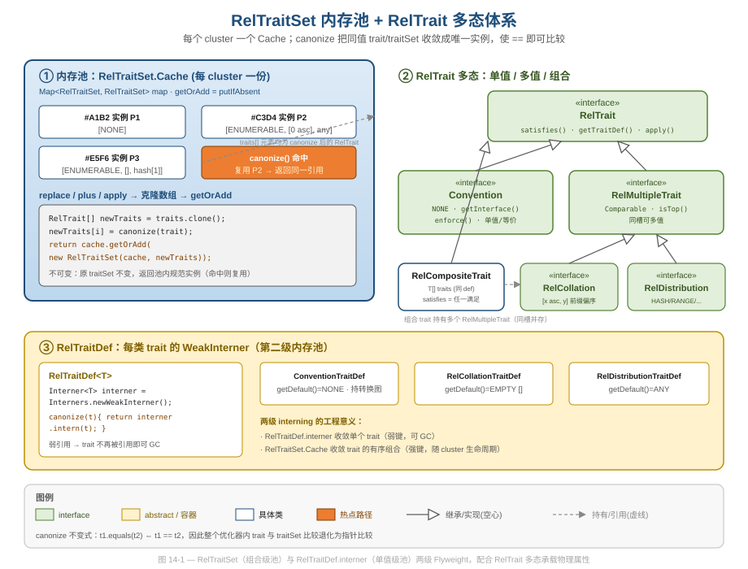
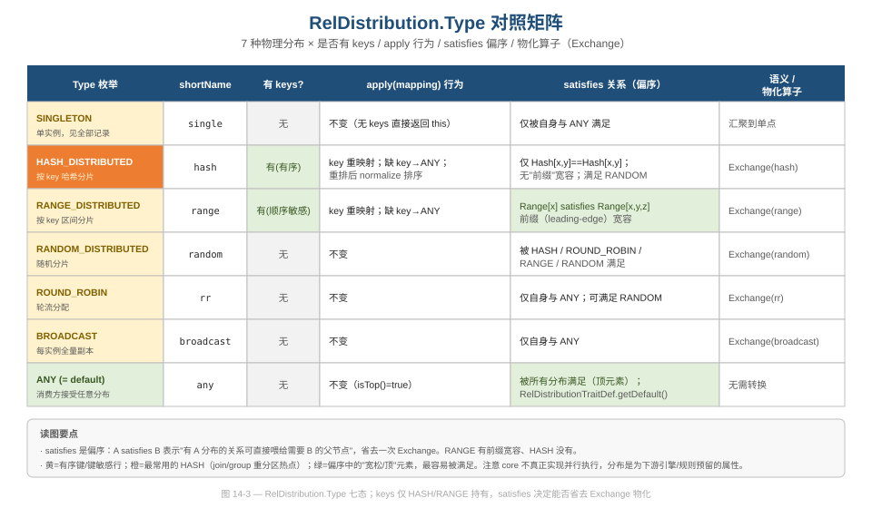
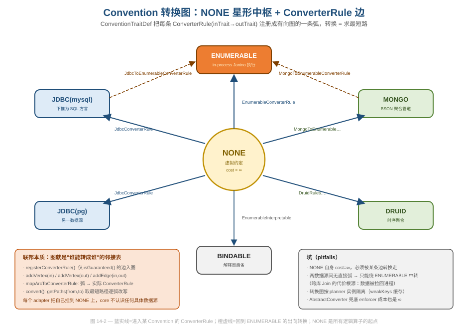

# 第 14 篇 · Trait/Convention 与物理属性传播

> 优化器要回答的从来不只是"哪种计划更便宜"，还有一个更隐蔽的问题：**这个算子到底跑在哪、它的输出长什么样**——是已经按 `[deptno]` 排好序了，还是已经按某个 key 哈希分片了，还是只能在本进程内用 Java 跑？Calcite 把这些"非数据本身、但决定能否衔接的物理性质"统一抽象成 `RelTrait`，把"在哪执行"抽象成一种特殊的 trait——`Convention`，再用一个全局内存池（`RelTraitSet`）把它们组合管理起来。本篇讲透三件事：trait 的两级 interning 为什么让优化器敢用 `==` 比较、`satisfies` 偏序如何让"已有的物理属性"省下一次物化、以及 Convention 转换图为什么就是 Calcite 联邦查询能力的本体（以及它的代价从哪来）。
> 基线 commit `111030383` · 前置阅读：[第 04 篇 · RelNode](04-relnode.md)、[第 11 篇 · VolcanoPlanner](11-volcano.md)

## TL;DR

- **两级 Flyweight**：单个 trait 由 `RelTraitDef.interner`（`Interners.newWeakInterner()`，弱引用可 GC）收敛；trait 的有序组合由 `RelTraitSet.Cache`（每 cluster 一份 `Map<RelTraitSet, RelTraitSet>`）收敛。`canonize` 保证 `t1.equals(t2) ⇔ t1 == t2`，整个优化器内部把 trait/traitSet 比较退化为指针比较。
- **不可变 + 池化的组合**：`RelTraitSet` 的 `replace/plus/apply` 永远 `clone()` 数组、`canonize` 新值、再 `cache.getOrAdd`——返回的是池里的规范实例，原 set 不动。和 `RelNode#copy` 一脉相承的不可变契约（见 [第 04 篇](04-relnode.md)）。
- **satisfies 是偏序，不是相等**：`RelTrait#satisfies` 必须满足自反、反对称、传递。排序 `[x, y]` 满足 `[x]`（前缀宽容）、`RANGE[x]` 满足 `RANGE[x,y,z]`，但 `HASH[x,y]` 只满足自己。优化器靠它判断"现有物理属性能否直接喂给父节点"，从而省掉一次 `Sort`/`Exchange` 物化。
- **Convention 是一种 trait**：`Convention extends RelTrait`，`NONE` 是虚拟约定、cost 为无穷大，所有逻辑算子都从 `NONE` 出发，必须被 `ConverterRule` 转换到某个可执行 convention 才有有限成本。
- **Convention 转换图 = 联邦本质**：`ConventionTraitDef` 把每条 `ConverterRule(in→out)` 注册成有向图的一条弧（`addEdge`），`convert()` 退化为图上**求最短路**。core 不认识任何具体数据源，每个 adapter 把自己挂到图上——这就是 Calcite "无存储、可联邦"的工程根。
- **传播策略可配**：`DeriveMode`（`LEFT_FIRST/RIGHT_FIRST/BOTH/OMAKASE/PROHIBITED`）在 top-down 优化里决定物理算子如何从子节点派生 trait；坑也在这里——`OMAKASE` 用错会推不出可满足的输出属性。

---

## 1. 为什么需要 trait：把"物理性质"从"语义"里剥出来

`RelNode` 描述的是**关系代数语义**——"对 emp 做过滤、再和 dept 连接、再聚合"（见 [第 04 篇](04-relnode.md)）。但同一个语义有无数种**物理实现**：可以哈希连接也可以归并连接，输出可以已排序也可以乱序，可以在 MySQL 里跑也可以拉回本进程用 Java 跑。这些"不改变行集合内容、但改变物理表现"的性质，如果硬塞进 `RelNode` 的字段里，会让每个算子类都背上一堆与代数无关的状态。

Calcite 的选择是：把每一类物理性质抽象成一个 `RelTrait`，把"一个 RelNode 当前具备哪些物理性质"打包成一个 `RelTraitSet`，挂在 `AbstractRelNode` 上。`RelTrait` 接口本身极小（`core/src/main/java/org/apache/calcite/plan/RelTrait.java`）：

```java
public interface RelTrait {
  RelTraitDef getTraitDef();
  @Override int hashCode();
  @Override boolean equals(@Nullable Object o);

  /** A trait satisfies another if it is the same or stricter.
   * For example, {@code ORDER BY x, y} satisfies {@code ORDER BY x}. */
  boolean satisfies(RelTrait trait);

  void register(RelOptPlanner planner);
  default <T extends RelTrait> T apply(Mappings.TargetMapping mapping) {
    return (T) this;
  }
}
```

三个核心能力：`satisfies`（偏序，§3 详述）、`apply`（列重映射时如何变换，§5）、以及 `getTraitDef`（指向定义它的"类"）。Calcite 内置三类 trait：

| trait | 接口 | 语义 | 默认值 |
|---|---|---|---|
| `Convention` | `plan/Convention.java` | 在哪/用什么引擎执行 | `NONE` |
| `RelCollation` | `rel/RelCollation.java` | 物理排序（列序 + 方向） | `EMPTY`（`[]`） |
| `RelDistribution` | `rel/RelDistribution.java` | 物理分布（哈希/区间/广播…） | `ANY` |

这是一次干净的**关注点分离**：`RelNode` 只管代数，trait 体系单独管物理属性，且 trait 体系是**开放的**——`RelTraitDef` 是抽象类，第三方（如 Apache Drill）可以注册自己的 trait 定义，而不必碰 core 的算子类。

---

## 2. 两级内存池：让优化器敢用 == 比较 trait

这是本篇第一个值得细品的工程决策。优化器在 `RelSubset` 分组、`RelTraitSet#equals`、规则匹配里会对 trait 做**海量比较**。如果每次都走 `equals()` 深比较（排序键列表、哈希键列表逐元素比），在百万级的搜索空间里是灾难。Calcite 的解法是 **interning（Flyweight）**：把"值相等"的 trait 收敛成"同一个对象引用"，比较退化为 `==`。

### 2.1 第一级：RelTraitDef.interner（单个 trait）

每个 `RelTraitDef` 持有一个**弱引用** interner（`core/src/main/java/org/apache/calcite/plan/RelTraitDef.java`）：

```java
public abstract class RelTraitDef<T extends RelTrait> {
  /** Cache of traits. Uses weak interner to allow GC. */
  private final Interner<T> interner = Interners.newWeakInterner();

  /** Canonized RelTrait objects may always be compared using ==. */
  public final T canonize(T trait) {
    if (!(trait instanceof RelCompositeTrait)) {
      assert getTraitClass().isInstance(trait) : ... ;
    }
    return interner.intern(trait);
  }
}
```

`canonize` 是整个体系的关键不变式来源——它的契约写在注释里：**canonize 之后，`t1.equals(t2)` 当且仅当 `t1 == t2`**。用 `newWeakInterner()` 而非强引用 Map 是个细节考量：trait 实例可能在运行期动态生成（如 `RelCollations.of([3,1])`），如果用强引用，再也不会有人用到的 trait 会永久驻留——弱键让 GC 在它无人引用时回收，避免内存泄漏。

注意 `RelTrait` 接口在 Javadoc 里专门留了一段 "Note about equals() and hashCode()"：**如果你的 trait 全部定义在 enum 里、运行期不会新增实例，可以不重写 equals/hashCode；但只要会动态生成实例，就必须正确实现两者，否则 interner 无法去重**。这正是 RESEARCH 里点名的坑——自定义 `RelTrait` 忘了实现 `hashCode`/`equals`，内存池直接失效，`==` 比较全部落空，优化器行为诡异且难查。

### 2.2 第二级：RelTraitSet.Cache（trait 的有序组合）

光收敛单个 trait 不够，优化器比较的是**整组 trait**（`[ENUMERABLE, [0 asc], hash[1]]`）。所以 `RelTraitSet` 自己也是一个池化对象。它持有一个 `Cache`，每个 cluster（实际上每条"祖先线"）一份（`core/src/main/java/org/apache/calcite/plan/RelTraitSet.java`）：

```java
public static RelTraitSet createEmpty() {
  // It has a new cache, which will be shared by any trait set created from it.
  return new RelTraitSet(new Cache(), EMPTY_TRAITS);
}

private static class Cache {
  final Map<RelTraitSet, RelTraitSet> map = new HashMap<>();
  RelTraitSet getOrAdd(RelTraitSet t) {
    RelTraitSet exist = map.putIfAbsent(t, t);
    return exist == null ? t : exist;
  }
}
```

`getOrAdd` 就是经典的 intern：`putIfAbsent` 命中就返回老实例，未命中就把新实例存进去。于是任意两个 trait 内容相同的 `RelTraitSet`，在同一 cluster 内必然是同一个对象——`RelTraitSet#equals` 的第一行 `if (this == obj) return true;` 会在绝大多数情况下直接命中。

而 `equals` 的深比较里也用了 trait 已 canonize 的前提：

```java
@Override public boolean equals(@Nullable Object obj) {
  if (this == obj) return true;
  // ... hash 短路、长度短路 ...
  for (int i = 0; i < traits.length; i++) {
    if (traits[i] != that.traits[i]) {   // 注意是 != 而非 !equals()
      return false;
    }
  }
  return true;
}
```

逐元素用的是 `!=` 而不是 `!equals()`——因为每个 trait 都已经被第一级 interner 收敛了，同值即同引用。两级 interning 在这里完成了闭环：**单个 trait 同值同引用 → traitSet 逐元素 == 比较 → traitSet 自身也同值同引用**。



上图把两级池摊开看：左侧是 `RelTraitSet.Cache`（组合级，强键、随 cluster 生命周期），右下是 `RelTraitDef.interner`（单值级，弱键、可 GC），右上是 `RelTrait` 的多态家族。这是一处**有意为之的双层缓存**——为什么不合成一层？因为两层的生命周期诉求不同：单个 trait 可能海量生成且大多短命（弱键更合适），而 traitSet 与 cluster 强绑定、cluster 一散整池一起走（强键更省心）。把"该用强引用还是弱引用"的判断下沉到各自层级，是 §6.2 里"索引该用内容还是身份"那条工程经验的姊妹版。

### 2.3 不可变：所有"修改"都返回池内新实例

`RelTraitSet` 是 `final class extends AbstractList<RelTrait>`，且**完全不可变**。任何看起来像"修改"的方法都返回一个新（池化）实例，原对象纹丝不动。以 `replace(index, trait)` 为例：

```java
public RelTraitSet replace(int index, RelTrait trait) {
  RelTrait canonizedTrait = canonize(trait);
  if (traits[index] == canonizedTrait) {
    return this;                       // 没变化，连数组都不 clone
  }
  RelTrait[] newTraits = traits.clone();
  newTraits[index] = canonizedTrait;
  return cache.getOrAdd(new RelTraitSet(cache, newTraits));
}
```

三步：`canonize` 新值 → `clone` 数组改一格 → `getOrAdd` 池化返回。注意第一道短路 `traits[index] == canonizedTrait`——又是 `==`，又是 interning 在省事：如果替换值和原值同引用，连数组都不复制。`plus`（加一个新 trait def 的槽）、`apply`（对所有 trait 做列映射）走的是同样的模式。这种"不可变值对象 + 池化"的组合，使得 trait set 可以在整个 memo 里被多个 subset 安全共享而无需防御性拷贝——这是 [第 11 篇](11-volcano.md) 里 RelSubset "零拷贝复用"的物理属性基础。

### 2.4 两个被缓存的字段：hash 与 string

不可变还顺带解锁了"安全的惰性缓存"。`RelTraitSet` 有两个会被算一次后缓存的字段：

```java
private @Nullable String string;
/** Caches the hash code for the traits. */
private int hash; // Default to 0
```

`hashCode()` 首次调用时算 `Arrays.hashCode(traits)` 存进 `hash`，之后直接返回；`toString()` 同理缓存 `string`。因为对象不可变，这种"算一次存下来"的惰性缓存天然线程安全且永不失效——这是不可变性最实在的红利之一。`hash` 缓存还被 `equals` 用作快速否决：

```java
if (this.hash != 0 && that.hash != 0 && this.hash != that.hash) {
  return false;     // 两个 hash 都算过且不等 → 必然不等，免去逐元素比
}
```

只有两边都已计算过 hash（`!= 0`）才用它短路，避免为了比较而强行触发哈希计算。这是一个很克制的优化：**只在缓存已暖时才吃缓存红利，不主动加热**。

值得一提的是 `RelTraitSet extends AbstractList<RelTrait>`——它对外就是一个只读的 `List<RelTrait>`，`get(i)`/`size()` 直接走底层数组。让核心数据结构实现标准集合接口，调用方可以用 for-each、stream 等通用手段遍历 trait，而不必学一套私有 API。这是"对外暴露最小且标准的接口"的好例子。

---

## 3. satisfies 偏序：省下一次物化的关键判断

如果 trait 比较只有"相等"一种关系，优化器就只能在物理属性**完全一致**时复用。但现实里"更强的属性"应当能满足"更弱的需求"——已经按 `[deptno, sal]` 排好序的数据，喂给只需要 `[deptno]` 有序的父节点，完全够用，不必再排一次。这就是 `satisfies` 偏序存在的意义。

`RelTrait#satisfies` 的契约（Javadoc）要求它是一个**偏序**：自反（X satisfies X）、反对称、传递。很多 trait "不能放松"，它们的 satisfies 退化成等价关系（只有 X satisfies X，如 `Convention`）。

### 3.1 Collation：前缀即满足

排序的 satisfies 是"前缀宽容"（`core/src/main/java/org/apache/calcite/rel/RelCollationImpl.java`）：

```java
@Override public boolean satisfies(RelTrait trait) {
  return this == trait
      || trait instanceof RelCollationImpl
      && Util.startsWith(fieldCollations,
          ((RelCollationImpl) trait).fieldCollations);
}
```

`[0 asc, 1 asc]` satisfies `[0 asc]`——因为按 `[0,1]` 排好的数据天然也满足"按 `[0]` 排序"。`RelTraitSet#satisfies` 把它推广到整组：

```java
public boolean satisfies(RelTraitSet that) {
  if (this == that) return true;
  final int n = Math.min(this.size(), that.size());
  for (int i = 0; i < n; i++) {
    if (!this.traits[i].satisfies(that.traits[i])) {
      return false;
    }
  }
  return true;
}
```

类注释里给了一个精准的例子：需要 `{enumerable, sorted on [C1 asc]}`，而 R 是 `{enumerable, sorted on [C3], [C1, C2]}`——R 有两个排序键，其中 `[C1, C2]` 的前缀满足 `[C1]`，于是 R 直接可用。这正是多值 trait（§4）与 satisfies 配合的威力。

### 3.2 Distribution：HASH 严格、RANGE 宽容、ANY 是顶

分布的 satisfies 更微妙，不同 Type 规则不同（`core/src/main/java/org/apache/calcite/rel/RelDistributions.java` 的 `RelDistributionImpl#satisfies`）：

```java
@Override public boolean satisfies(RelTrait trait) {
  if (trait == this || trait == ANY) {
    return true;                       // ANY 是顶元素，被所有分布满足
  }
  if (trait instanceof RelDistributionImpl) {
    RelDistributionImpl distribution = (RelDistributionImpl) trait;
    if (type == distribution.type) {
      switch (type) {
      case HASH_DISTRIBUTED:
        // 哈希没有"前缀"概念：只有 Hash[x,y] 满足 Hash[x,y]
        return keys.equals(distribution.keys);
      case RANGE_DISTRIBUTED:
        // Range[x] 满足 Range[x,y,z]，但不满足 Range[x] 之外
        return Util.startsWith(distribution.keys, keys);
      default:
        return true;
      }
    }
  }
  if (trait == RANDOM_DISTRIBUTED) {
    // RANDOM 被 HASH / ROUND-ROBIN / RANGE 满足
    return type == Type.HASH_DISTRIBUTED
        || type == Type.ROUND_ROBIN_DISTRIBUTED
        || type == Type.RANGE_DISTRIBUTED;
  }
  return false;
}
```

这段代码里藏着扎实的分布式语义：哈希分片**没有**前缀宽容（`Hash[x,y]` 的分片方式和 `Hash[x]` 完全不同，不能复用），而区间分片**有**（按 `[x,y,z]` 划区间的数据，对只关心 `[x]` 区间的需求也成立）。`ANY` 是偏序的**顶元素**（`isTop()` 返回 `type == ANY`），被任何分布满足，所以它是 `RelDistributionTraitDef.getDefault()`——"我不在乎分布"是最弱的需求。



上面这张矩阵把七种分布的 `keys / apply / satisfies / 物化算子` 摆在一起。读它的关键在 satisfies 列：**A satisfies B 意味着"有 A 分布的关系可以不加任何 Exchange 直接喂给需要 B 的父节点"**。HASH 严格、RANGE 宽容、ANY 全满足——这条偏序直接决定了优化器何时能省掉一次代价高昂的重分区。需要强调一个数据工程的边界：core 本身不真正做并行执行，`RelDistribution` 是为下游分布式引擎（Drill/Beam 等）和重分区规则**预留的物理属性**——它存在的价值是让"是否需要 Exchange"这个判断能进优化器的成本模型，而不是 Calcite 自己去 shuffle 数据。

### 3.3 apply：列映射时 trait 如何跟着变

`Project` 会改变列序（`SELECT b, a` 把第 0、1 列对调），物理属性必须跟着重映射。`RelTrait#apply(mapping)` 就是干这个的。Collation 的实现很能说明"宽容"的代价边界（`RelCollationImpl#apply` 的 Javadoc 举例）：对 `[0, 1]` 应用 `mapping(2, 0)` 得 `[1]`，应用 `mapping(1)` 得 `[]`（空排序）——一旦映射破坏了排序前缀，排序属性就**坍缩**了。Distribution 的 `apply` 同理：缺了任何一个分布 key 就返回 `ANY`（"我不再保证任何分布"）。这是诚实的设计：物理属性不能凭空保留，列一动就得重新评估，宁可保守地降级也不能撒谎说"还排着序"。

注意 `RelTrait#apply` 的默认实现是 `return (T) this;`——大多数 trait（如 `Convention`、`SINGLETON`/`BROADCAST` 分布）**与列序无关**，列怎么重排都不影响"在哪执行"或"是否广播"。只有依赖列下标的 trait（带 key 的 collation/distribution）才重写 `apply`。这是 Template-method 式的"默认什么都不做，需要的子类才覆盖"——把"绝大多数 trait 不受列映射影响"这条事实编码进默认实现，新增 trait 类型时零成本。

### 3.4 satisfies 不是 matches：两套比较各管一摊

`RelTraitSet` 里有两个长得像、却服务于完全不同目的的方法，初读源码极易混淆，值得单拎出来辨析：

- `satisfies(that)`：**成本/复用判断**。逐位调用 `trait.satisfies()`（偏序），回答"我这套物理属性能不能直接满足你的需求"。用在优化器决定要不要插 enforcer。
- `matches(that)`：**规则触发判断**。`null` 被当作通配符，任何 trait 都能匹配；非 null 时用 `==` 严格比对。用在规则的操作数 trait 过滤（"这条规则只对某 convention 的算子触发"）。

```java
public boolean matches(RelTraitSet that) {
  final int n = Math.min(this.size(), that.size());
  for (int i = 0; i < n; i++) {
    RelTrait thisTrait = this.traits[i];
    RelTrait thatTrait = that.traits[i];
    if ((thisTrait == null) || (thatTrait == null)) {
      continue;                 // null = 通配符，跳过
    }
    if (thisTrait != thatTrait) {
      return false;             // 严格 ==，不走偏序
    }
  }
  return true;
}
```

把"复用判断"（偏序、宽容）和"匹配判断"（严格、带通配）分成两个方法，是关注点分离的细粒度体现：同一组 trait 数据，在"找最优"和"触发规则"两个语境下需要的语义并不一样，硬塞进一个方法只会让两边都别扭。

### 3.5 物化：satisfies 不成立时，谁来补这一刀

当 `satisfies` 返回 false（现有属性不够），就得**物化**——插入一个真正改变物理属性的算子。分布的物化算子是 `Exchange`（重分区）。`RelDistributionTraitDef#convert` 把这件事做得很直白（`core/src/main/java/org/apache/calcite/rel/RelDistributionTraitDef.java`）：

```java
@Override public @Nullable RelNode convert(RelOptPlanner planner, RelNode rel,
    RelDistribution toDistribution, boolean allowInfiniteCostConverters) {
  if (toDistribution == RelDistributions.ANY) {
    return rel;                       // 目标是 ANY → 啥都不用做
  }
  // 否则插一个 LogicalExchange，再让 planner 转换它剩余的 traits
  final Exchange exchange = LogicalExchange.create(rel, toDistribution);
  RelNode newRel = planner.register(exchange, rel);
  final RelTraitSet newTraitSet = rel.getTraitSet().replace(toDistribution);
  if (!newRel.getTraitSet().equals(newTraitSet)) {
    newRel = planner.changeTraits(newRel, newTraitSet);
  }
  return newRel;
}
```

第一行 `if (toDistribution == ANY) return rel;` 又是 `==` 在用 interning 的红利。`canConvert` 直接返回 `true`——分布**总是可以**通过 Exchange 物化（区别只在成本）。对比 `ConventionTraitDef`：convention 的 `canConvert` 取决于图上是否有路径，**不一定可达**。这个对比揭示了两类 trait 的本质差异：分布/排序是"花成本就能补"的物理属性，而 convention 是"没有 ConverterRule 就根本过不去"的能力边界。前者影响成本，后者决定可行性。

---

## 4. 多值 trait：同一个槽里放好几个值

`Convention` 是单值的——一个 RelNode 只能在一个 convention 里。但排序和分布天生可以多值：一张时间维表可能**同时**按 `[year, month, day]` 和按 `[time_id]` 有序。Calcite 用 `RelMultipleTrait` + `RelCompositeTrait` 这对组合来表达"同一个 trait def 槽里并存多个值"。

`RelMultipleTrait` 接口标记"可多值"（`core/src/main/java/org/apache/calcite/plan/RelMultipleTrait.java`）：

```java
public interface RelMultipleTrait extends RelTrait, Comparable<RelMultipleTrait> {
  /** Whether this trait is satisfied by every instance of the trait. */
  boolean isTop();
}
```

它额外要求 `Comparable`——这是为了 `RelCompositeTrait` 能把多个值**排成确定的顺序**存储（否则 `[a,b]` 和 `[b,a]` 会被当成两个不同的 composite，破坏 interning）。`RelCompositeTrait` 就是那个"装一组同类型 trait"的容器（`core/src/main/java/org/apache/calcite/plan/RelCompositeTrait.java`）：

```java
class RelCompositeTrait<T extends RelMultipleTrait> implements RelTrait {
  private final T[] traits;

  static <T extends RelMultipleTrait> RelTrait of(RelTraitDef def, List<T> traitList) {
    if (traitList.isEmpty()) {
      return def.getDefault();          // 空 → 默认值（如 EMPTY collation）
    } else if (traitList.size() == 1) {
      return def.canonize(traitList.get(0));  // 单值 → 退化成裸 trait（不包 composite）
    } else {
      // 多值 → canonize 每个成员，再 canonize 整个 composite
      ...
      return def.canonize(compositeTrait);
    }
  }

  @Override public boolean satisfies(RelTrait trait) {
    for (T t : traits) {
      if (t.satisfies(trait)) {         // 任一成员满足即满足
        return true;
      }
    }
    return false;
  }
}
```

两个设计亮点：其一，`of()` 做了**自动降级**——空列表返回默认值、单值不包 composite 而直接返回裸 trait，只有真正多值时才构造 `RelCompositeTrait`。这避免了"为了统一接口而到处包装"的开销，让常见的单值场景零额外对象。其二，composite 的 `satisfies` 是"**任一**成员满足即满足"——这正好对应 §3.1 那个例子里"R 有两个排序键，只要其一满足需求即可"。

但这套"单值/多值同槽并存"的弹性是有代价的，也是 RESEARCH 点名的坑：`RelTraitSet#getTrait(traitDef)` 在槽里是 composite 时会**抛 `IllegalStateException`**，必须改用 `getTraits(traitDef)`：

```java
public RelTrait getTrait(int index) {
  final RelTrait trait = traits[index];
  if (trait instanceof RelCompositeTrait) {
    throw new IllegalStateException("Trait index " + index
        + " has multiple values in this trait set; "
        + "use getTraits(RelTraitDef) instead of getTrait(RelTraitDef)");
  }
  return trait;
}
```

调用方如果不知道某个槽可能是多值的，就会在运行期踩到这个异常（或在更早的版本里踩 `ClassCastException`）。所以 `RelTraitSet` 又提供了 `getDistributions()`/`getCollations()` 这类"无论单值多值都返回 List"的统一接口来兜底。这是一个典型的**灵活性 vs 易用性**权衡：为了支持多值排序，单值的常见路径被迫多了一层"它会不会是 composite"的心智负担。

---

## 5. Convention：把"在哪执行"做成一种 trait

现在来看本篇的重头戏。`Convention`（调用约定）回答"这个算子用什么引擎、以什么形式执行"——`ENUMERABLE` 表示在本进程用 Janino 编译的 Java 跑，`JDBC` 表示下推成 SQL 交给数据库跑，`MONGO` 表示翻译成 BSON 聚合管道。Calcite 的精妙之处在于：**它没有为 convention 另起炉灶，而是让 `Convention extends RelTrait`**——执行位置只是众多物理属性中的一种，复用了整套 interning / satisfies / 传播机制。

```java
public interface Convention extends RelTrait {
  /** Convention for a relational expression that does not support any
   * convention. It is not implementable... Such expressions always have
   * infinite cost. */
  Convention NONE = new Impl("NONE", RelNode.class);

  Class getInterface();
  String getName();

  /** Returns the corresponding enforcer rel nodes, like physical Sort,
   * Exchange etc. */
  default @Nullable RelNode enforce(RelNode input, RelTraitSet required) { ... }

  /** Whether we should convert from this convention to toConvention. */
  default boolean canConvertConvention(Convention toConvention) {
    return false;
  }
}
```

### 5.1 NONE：虚拟约定与无穷成本

`Convention.NONE` 是全篇最该理解的对象。所有逻辑算子（`LogicalProject`、`LogicalJoin`……）出生时都在 `NONE` 里（见 [第 04 篇](04-relnode.md) 的 RelNode 树，根都是 `Convention.NONE`）。`NONE` 的语义是"**不可执行**"——它的 Javadoc 写得很直白："It is not implementable, and has to be transformed to something else in order to be implemented. Such expressions always have infinite cost."

无穷成本是个关键的设计杠杆。`Convention.Impl#satisfies` 是纯等价关系（`return this == trait`），意味着 `NONE` 只满足 `NONE`，绝不会满足任何可执行 convention。于是在成本驱动的 VolcanoPlanner 里（见 [第 11 篇](11-volcano.md)），任何还停留在 `NONE` 的计划成本都是 ∞，优化器**被迫**去找一条把它转换到有限成本 convention 的路径——否则根本得不到可用的最佳计划。这是用"成本"作为约束来驱动"必须转换"的经典手法：不需要硬编码"你必须转换"，只要让不转换的代价无穷大即可。

### 5.2 enforce：当转换不可得，就插一个物理 enforcer

`enforce(input, required)` 是 convention 的另一个钩子：给定输入和需要的 traitSet，生成一个**物理 enforcer 算子**（如物理 `Sort`、`Exchange`）来强行满足需求。这是 top-down 优化里"差什么属性就补什么算子"的入口——`EnumerableConvention#enforce` 会在需要排序却拿不到时插一个 `EnumerableSort`。`Convention.Impl`（默认实现）的 `enforce` 返回 `null`，表示"我不做 trait 强制"，这是给那些不关心物理属性的简单 convention 的省心默认。

兜底的最后一道防线是 `AbstractConverter`（`core/src/main/java/org/apache/calcite/plan/volcano/AbstractConverter.java`）：

```java
@Override public @Nullable RelOptCost computeSelfCost(RelOptPlanner planner,
    RelMetadataQuery mq) {
  return planner.getCostFactory().makeInfiniteCost();
}
```

它的自身成本也是**无穷大**——它是一个"占位 enforcer"，靠规则把它替换成真实的转换链。RESEARCH 如实记下的坑：`AbstractConverter` 的无穷成本可能**掩盖真实转换成本**，让优化器过度依赖规则触发顺序；它是兜底机制，不是免费的转换。

---

## 6. Convention 转换图：联邦查询的本体

如果说 §5 讲的是"单个 convention 是什么"，这一节讲的是"convention 之间如何转换"——而这恰恰是 Calcite 联邦查询能力的工程根。

### 6.1 ConventionTraitDef：把 ConverterRule 注册成图的边

`ConventionTraitDef` 与众不同：别的 traitDef 的转换逻辑是固定的（如 `RelDistributionTraitDef#convert` 总是插一个 `LogicalExchange`），但 convention 之间能不能转、怎么转，**取决于注册了哪些 `ConverterRule`**。所以它内部维护一张**有向图**（`core/src/main/java/org/apache/calcite/plan/ConventionTraitDef.java`）：

```java
@Override public void registerConverterRule(
    RelOptPlanner planner, ConverterRule converterRule) {
  if (converterRule.isGuaranteed()) {
    ConversionData conversionData = getConversionData(planner);
    final Convention inConvention  = (Convention) converterRule.getInTrait();
    final Convention outConvention = (Convention) converterRule.getOutTrait();
    conversionData.conversionGraph.addVertex(inConvention);
    conversionData.conversionGraph.addVertex(outConvention);
    conversionData.conversionGraph.addEdge(inConvention, outConvention);
    conversionData.mapArcToConverterRule.put(
        Pair.of(inConvention, outConvention), converterRule);
  }
}
```

每注册一条 `isGuaranteed()` 的 `ConverterRule`，就在图里加一条 `in → out` 的弧，并把"这条弧对应哪个具体规则"记进 `mapArcToConverterRule`。于是 convention 转换就退化成**图上的最短路问题**：

```java
@Override public @Nullable RelNode convert(RelOptPlanner planner, RelNode rel,
    Convention toConvention, boolean allowInfiniteCostConverters) {
  final ConversionData conversionData = getConversionData(planner);
  final Convention fromConvention = requireNonNull(rel.getConvention(), ...);
  List<List<Convention>> conversionPaths =
      conversionData.getPaths(fromConvention, toConvention);
  loop:
  for (List<Convention> conversionPath : conversionPaths) {
    RelNode converted = rel;
    Convention previous = null;
    for (Convention arc : conversionPath) {
      RelOptCost cost = planner.getCost(converted, mq);
      if ((cost == null || cost.isInfinite()) && !allowInfiniteCostConverters) {
        continue loop;                  // 这条路上某段成本无穷，换下一条路
      }
      if (previous != null) {
        converted = changeConvention(converted, previous, arc, mapArcToConverterRule);
      }
      previous = arc;
    }
    return converted;
  }
  return null;
}
```

`getPaths` 走的是预构建的 `Graphs.FrozenGraph`（`getPathMap()` 惰性 `makeImmutable`，首次访问时冻结），路径按最短优先。`changeConvention` 在弧上挑出 `ConverterRule` 真正生成转换后的 RelNode。



上图把这张图画出来：中央是 `NONE`（虚拟约定、cost=∞），四周是各 adapter 的 convention，每条 `ConverterRule` 是一条有向弧。读这张图能直接看懂 Calcite 联邦查询的本质与代价：

- **core 不认识任何具体数据源**。`ConventionTraitDef` 初始只有空图，是每个 adapter 在注册阶段把自己的 convention 和 ConverterRule "挂"到 `NONE` 上（`NONE → JDBC`、`NONE → MONGO`……）。这就是 [第 01 篇](01-positioning.md) 讲的"无存储、前端公共化"在优化器层的落地——adapter 是图上的节点，core 只提供图算法。
- **跨数据源 Join 的代价根源**。如果 `JDBC(mysql)` 和 `MONGO` 之间**没有直接弧**（现实里几乎不可能有），那把 MySQL 的表和 Mongo 的集合连接起来，唯一路径是各自先转回 `ENUMERABLE`（`JDBC → ENUMERABLE`、`MONGO → ENUMERABLE`），即把两边数据都拉回本进程再 Java 连接。图上"没有捷径"直接翻译成"数据必须落地中转"的物理代价——联邦查询的下推边界，在这张图的连通性里一目了然。

完整的 adapter 转换案例（JDBC 下推、RelToSql、方言）属于 [第 17 篇](17-extensibility.md) 与 [第 18 篇](18-adapters.md) 的主场，本篇只到"图就是联邦本体"为止。

### 6.2 按 planner 隔离的转换图

一个容易忽略的工程细节：转换图不是全局的，而是**每个 planner 实例一份**，用弱键缓存隔离（`ConventionTraitDef` 字段）：

```java
private final LoadingCache<RelOptPlanner, ConversionData> conversionCache =
    CacheBuilder.newBuilder().weakKeys()
        .build(CacheLoader.from(ConversionData::new));
```

类注释解释了原因：不同 planner 可能注册了不同的 ConverterRule 集合，转换图自然不同；`weakKeys` 保证 planner 被 GC 后对应的转换数据也能回收。这样 `ConventionTraitDef.INSTANCE` 可以安全地做成**单例**（无需为每个 planner 新建 traitDef），同时各 planner 的转换数据又互不干扰——单例的便利与多实例的隔离在这里兼得。

### 6.3 串起来看：一套 traitSet 在优化中如何演变

把前面的零件拼成一条完整的因果链，对一条 `SELECT ... ORDER BY deptno` 走 enumerable 的查询，trait set 大致这样演变：

1. **出生**：sql2rel 产出的逻辑算子全在 `[NONE, [], ANY]`——convention=NONE、无排序、无所谓分布。此时整棵树成本为 ∞（NONE 不可执行）。
2. **要求**：优化器对根节点设定目标 traitSet `[ENUMERABLE, [deptno asc], ANY]`（要 enumerable 执行、要按 deptno 排序）。
3. **convention 转换**：`ConventionTraitDef#convert` 在转换图上找 `NONE → ENUMERABLE` 的路径，逐弧用 `ConverterRule` 把逻辑算子转成 `Enumerable*` 物理算子，convention 槽从 NONE 变 ENUMERABLE。
4. **collation 判断**：物理算子的输出 collation 经 `satisfies` 和目标 `[deptno asc]` 比对。若某个 `EnumerableSort` 或带序输入已满足（前缀宽容），直接复用；否则 §3.5 那套机制插入一个排序 enforcer。
5. **传播**：top-down 模式下，根的"要 deptno 有序"通过 `passThrough` 压给子节点，子节点把"我能提供什么序"通过 `derive`（按 `DeriveMode`）上报，优化器在"子节点自带序 + 不加 Sort"和"子节点乱序 + 父节点加 Sort"之间按成本择优。
6. **收敛**：每一步的 traitSet 都经 `cache.getOrAdd` 池化，相同物理属性的变体落进同一个 `RelSubset`（见 [第 11 篇](11-volcano.md)），`best`/`bestCost` 在 subset 上动规收敛。

整条链里，trait 体系扮演的角色是**给"物理选择"提供可比较、可传播、可省略的语言**：interning 让比较廉价，satisfies 让复用成为可能，转换图让"换执行引擎"变成图算法，DeriveMode 让传播策略可配。这就是为什么 trait 看似是配角，却是 CBO 能在指数空间里高效搜索的底层支撑。

---

## 7. DeriveMode：物理属性的传播策略

最后一块拼图：trait 不只是"声明在节点上"，还要在优化中**传播**。Top-down 优化（Cascades 风格，见 [第 11 篇](11-volcano.md) 的 `TopDownRuleDriver`）有两个方向的传播：

- **passThrough（自上而下）**：父节点把"需要的 traitSet"压给子节点——"我需要按 `[deptno]` 排序的输入"。
- **derive（自下而上）**：子节点把"已经具备的 traitSet"上报给父节点——"我的输出已经按 `[deptno]` 排好了，你能不能利用"。

`DeriveMode` 控制 derive 方向的策略（`core/src/main/java/org/apache/calcite/plan/DeriveMode.java`）：

| 值 | 语义 | 典型场景 |
|---|---|---|
| `LEFT_FIRST` | 用最左子节点的 trait 决定向其他子节点要什么 | 多数算子的默认 |
| `RIGHT_FIRST` | 用最右子节点的 trait 决定 | index nested-loop join |
| `BOTH` | 对每个子节点都试一遍（含 LEFT 和 RIGHT） | 不开启 join 交换律的系统 / 三输入算子 |
| `OMAKASE` | "你看着办"——planner 把所有子节点所有 trait 都传过来，由算子自己决定派生哪些 | 高度定制的算子 |
| `PROHIBITED` | 禁止派生 | 不需要属性传播的算子 |

这些 mode 由 `PhysicalNode#getDeriveMode()` 返回，配合 `passThroughTraits` / `deriveTraits` 一起工作（`core/src/main/java/org/apache/calcite/rel/PhysicalNode.java` 的类注释把使用步骤列得很清楚：开启 top-down → 让 convention 的 rel 接口实现 `PhysicalNode` → 重写 passThrough/derive → 选 deriveMode → 标记 enforcer）。

RESEARCH 点名的坑就在 `OMAKASE`：它把所有可能性都交给算子自己处理，灵活但危险——如果算子的 `derive(List)` 实现没有覆盖某些 trait 组合，可能**推不出任何可满足父节点需求的输出属性**，导致该物理算子永远无法被选中，或优化器在该分支上空转。这是"把控制权全交给用户"的典型代价：弹性最大，但正确性的责任也全压在调用方身上。`LEFT_FIRST` 之所以是默认，正因为它在"够用"和"不容易出错"之间取了平衡。

---

## 设计模式与工程小结

| 机制 | 模式 / 手法 | 好在哪 / 坑在哪 |
|---|---|---|
| `RelTraitDef.interner`（弱键） | Flyweight + 弱引用缓存 | 单 trait 同值同引用，可 GC；坑：自定义 trait 忘实现 equals/hashCode → 池失效 |
| `RelTraitSet.Cache`（强键，每 cluster） | Flyweight（组合级） | traitSet 同值同引用，`equals` 退化为 `==`；与 cluster 同生命周期 |
| `RelTraitSet` 全不可变 | Immutable Value Object | replace/plus/apply 返回池内新实例，可跨 subset 零拷贝共享 |
| `RelTrait#satisfies` | 偏序（自反/反对称/传递） | "更强属性满足更弱需求"省下物化；HASH 严格、RANGE/Collation 前缀宽容 |
| `RelCompositeTrait` | Composite + 自动降级 | 同槽多值；`of()` 空→默认、单值→裸 trait；坑：`getTrait` 遇 composite 抛 ISE |
| `Convention extends RelTrait` | 复用而非另起 | 执行位置复用整套 trait 机制；`NONE` 用 ∞ 成本强制转换 |
| `ConventionTraitDef` 转换图 | 图（最短路）+ Registry | ConverterRule = 图的边；联邦本质；坑：无直接弧 → 绕 ENUMERABLE 中转 |
| `conversionCache`（weakKeys） | 按实例隔离 + 单例 traitDef | 单例便利 + 多 planner 隔离兼得；planner GC 后数据可回收 |
| `DeriveMode` | Strategy（枚举） | 传播方向可配；坑：`OMAKASE` 误用 → 推不出可满足的输出属性 |
| `AbstractConverter` | 占位 enforcer | 兜底 trait 强制；坑：∞ 成本掩盖真实转换成本，依赖规则顺序 |

---

## 对照阅读建议（动手）

- **断点**：`core/src/main/java/org/apache/calcite/plan/RelTraitSet.java` → `RelTraitSet.Cache#getOrAdd`
  - **观察**：同一 cluster 内，对两个内容相同的 traitSet 调用 `replace`，确认返回的是**同一个对象引用**（`==` 为 true）；观察 `map` 大小不随重复构造增长。
  - **运行**：在 `core/src/test/java/org/apache/calcite/plan/` 下的相关单测设断点，或自建一个 `RelTraitSet.createEmpty().plus(...)` 的 main()。

- **断点**：`core/src/main/java/org/apache/calcite/plan/ConventionTraitDef.java` → `ConventionTraitDef#convert`
  - **观察**：跑一个 enumerable 查询，看 `conversionData.getPaths(fromConvention, toConvention)` 返回的路径列表；对比 `NONE → ENUMERABLE` 的直接路径与（若构造跨源）需要中转的多跳路径。
  - **运行**：`./gradlew :core:test --tests org.apache.calcite.test.JdbcTest`（任意会触发 convention 转换的查询）。

- **断点**：`core/src/main/java/org/apache/calcite/rel/RelDistributions.java` → `RelDistributionImpl#satisfies`
  - **观察**：构造 `RelDistributions.hash([0,1])` 与 `hash([0])`，验证前者**不** satisfies 后者（HASH 无前缀宽容）；再用 `RelDistributions.range(...)` 对比 RANGE 的前缀宽容。
  - **运行**：单元断点或 `jshell` 交互验证。

- **断点**：`core/src/main/java/org/apache/calcite/rel/PhysicalNode.java` → `PhysicalNode#passThrough` / `derive`
  - **观察**：开启 `VolcanoPlanner#setTopDownOpt(true)` 后，看父节点的 required traitSet 如何被 `passThroughTraits` 拆给子节点；`getDeriveMode()` 返回什么。
  - **运行**：`./gradlew :core:test --tests org.apache.calcite.test.TopDownOptTest`（如存在）或带排序/聚合的 enumerable 查询。

---

## 延伸阅读

- 本系列：[第 04 篇 · RelNode 关系代数层](04-relnode.md)（trait set 挂在 `AbstractRelNode` 上、copy() 不可变契约）、[第 11 篇 · VolcanoPlanner](11-volcano.md)（RelSubset 按 trait 分组、成本驱动、AbstractConverter 在主循环里的角色）、[第 06 篇 · 类型系统](06-type-system.md)（另一处 Flyweight interning 的实现，可对照本篇两级池）、[第 12 篇 · 规则体系](12-rules.md)（`ConverterRule` 的 inTrait/outTrait 与本篇转换图的边一一对应）。
- 联邦/扩展：[第 17 篇 · 扩展性架构](17-extensibility.md)（adapter 如何把 convention 挂上转换图的 SPI 视角）、[第 18 篇 · Adapter 生态对比](18-adapters.md)（JDBC pushdown、RelToSql、方言的完整案例）。
- 模式归纳：[第 19 篇 · 设计模式全景](19-design-patterns.md)（Flyweight / Strategy 的跨篇汇总）。
- 官方文档：`site/_docs/algebra.md`（关系代数与 trait 概览）、`site/_docs/adapter.md`（Convention 与 ConverterRule 在 adapter 中的角色）。
- 论文：Goetz Graefe, *The Cascades Framework for Query Optimization*（physical property / enforcer / derivation 的理论来源，本篇 satisfies 偏序与 DeriveMode 即其工程化）。
