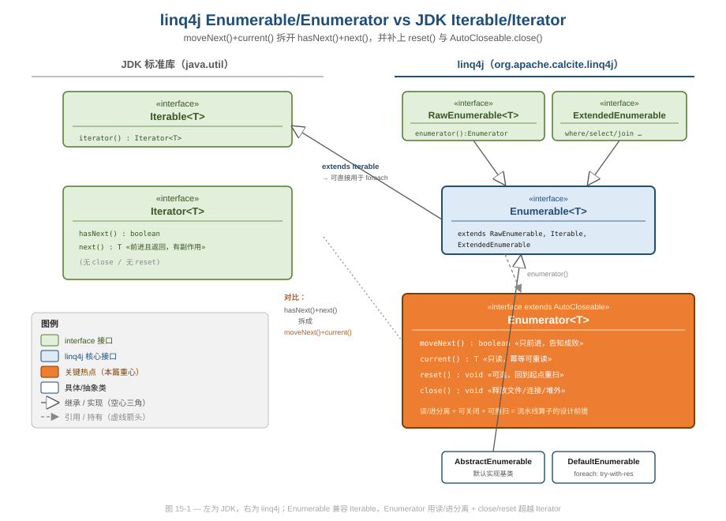
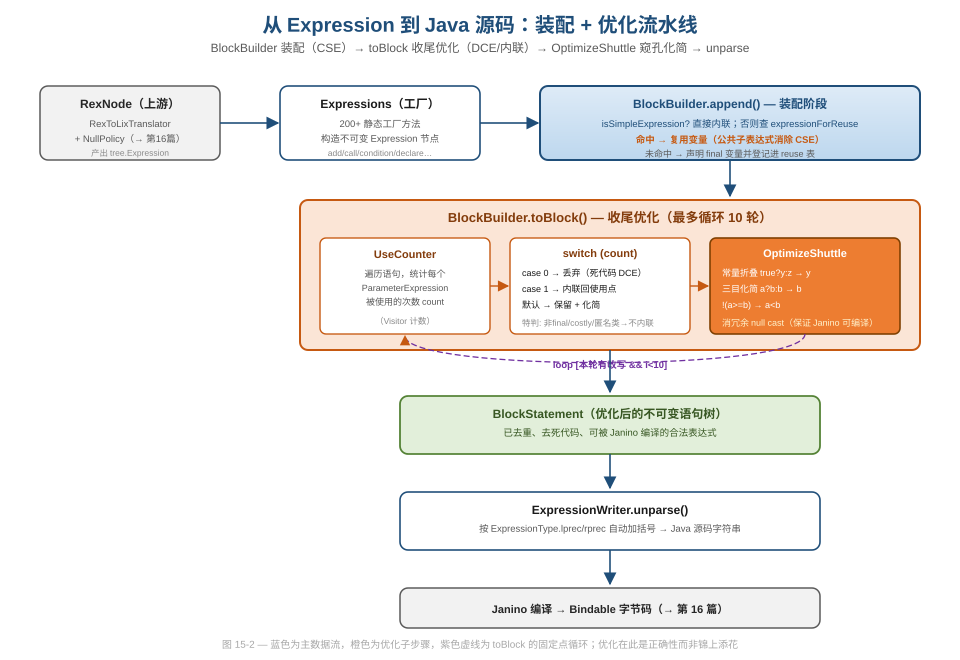
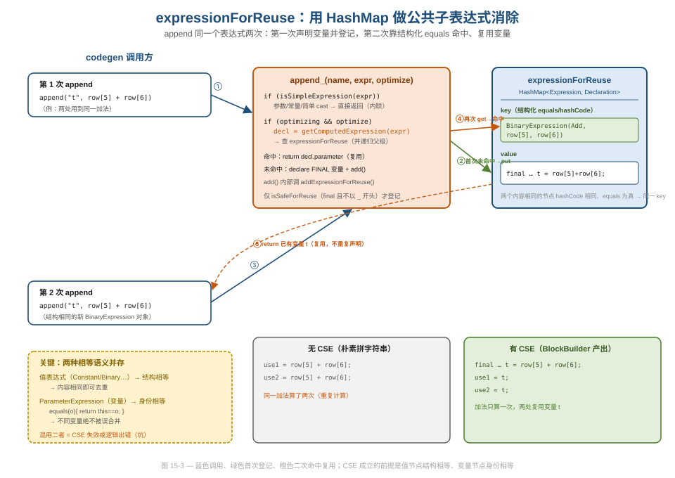

# 第 15 篇 · linq4j 与 Expression Tree（第四层 IR）

> Calcite 从关系代数到"能跑的 Java 代码"之间，还隔着一层很多人不知道的 IR：linq4j 的 Expression Tree。本篇回答两个工程问题——为什么不直接拼字符串生成代码、而要再造一棵语法树？以及这棵树如何用一个 `HashMap` 做出公共子表达式消除（CSE）这种"编译器级别"的优化。
> 基线 commit `111030383` · 前置阅读：[第 02 篇 · 四层 IR 总览](02-ir-overview.md)、[第 05 篇 · RexNode](05-rexnode.md)

## TL;DR（要点速览）

1. **linq4j 是 Calcite 的执行底座**，提供两套东西：运行期的 `Enumerable`/`Enumerator` 拉取模型，和编译期的 `tree.Expression`（第四层 IR）。本篇把它们讲透，算子级 codegen 怎么用这层 IR 留给[第 16 篇](16-codegen-exec.md)。
2. **`Enumerator` 把 JDK `Iterator` 的 `hasNext()+next()` 拆成 `moveNext()+current()`**，再加上 `reset()` 与 `close()`（继承 `AutoCloseable`）。这一拆看似多事，实则是流水线算子、资源释放、列存批处理的设计前提。
3. **Expression Tree 是介于 `RexNode` 与 Janino 源码之间的中间表示**：`Expressions` 是 200+ 静态工厂方法的 fluent builder，每个节点不可变，`ExpressionType` 自带优先级（`lprec`/`rprec`）让 unparse 时自动加括号。
4. **`BlockBuilder` 是这层 IR 的"代码块装配器"**，核心绝活是 `expressionForReuse`——一个 `HashMap<Expression, DeclarationStatement>`，靠节点的**结构化 `equals/hashCode`** 做公共子表达式消除；`toBlock()` 再跑死代码消除与单次使用内联。
5. **`OptimizeShuttle` 是一遍式的窥孔优化器（peephole optimizer）**：常量折叠、三目化简、`!` 下推、冗余 null cast 消除——注释里直说这些优化"不是锦上添花，而是必需的"，否则 Janino 会拒绝 `false == null` 这类表达式。
6. **可借鉴点**：用对象树而非字符串做代码生成，让"生成"与"优化"解耦，让 CSE/DCE 这类优化变成对树的遍历；坑在于 `ParameterExpression` 用身份相等、其他节点用结构相等，混淆二者会让 CSE 失效或误合并。

---

## 1. 为什么需要 linq4j 这一层

走到第 15 篇，前面四层 IR 已经把一条 SQL 降级成了带物理属性的 `RelNode` 树（[第 04 篇](04-relnode.md)）和行级 `RexNode` 表达式（[第 05 篇](05-rexnode.md)）。但 `RelNode` 不能直接执行——Calcite 没有存储层，也没有自己的执行引擎。`enumerable` 约定（convention）的做法是：**把关系算子翻译成 Java 源码，用 Janino 即时编译成字节码，在 JVM 内进程执行**。

问题来了：从 `RelNode` 到 Java 源码，中间要不要再加一层 IR？两条路：

- **直接拼字符串**：`"for (Object[] row : input) { if (row[5] > 1000) { ... } }"`。简单，但优化无从下手——你没法对字符串做常量折叠、没法判断两个子表达式是否相同、没法消除死代码。一旦生成逻辑复杂（嵌套 join、聚合、窗口），字符串拼接会变成无法维护的灾难。
- **再造一棵表达式树**：先生成 `tree.Expression` 这种结构化对象树，在树上做优化，最后才 unparse 成字符串交给 Janino。

Calcite 选了后者。这就是 `linq4j/tree` 包——**第四层 IR**。它的定位非常清晰：

```
RexNode（行表达式，SQL 语义）
   │  RexToLixTranslator（第 16 篇讲）
   ▼
tree.Expression（Java 语义的语法树，第四层 IR）  ← 本篇
   │  ExpressionWriter unparse
   ▼
Java 源码字符串
   │  Janino
   ▼
字节码 / Bindable
```

linq4j 这名字来自 ".NET LINQ for Java"——它移植了 LINQ 的两个核心概念：`IEnumerable`（运行期拉取）与 `Expression`（编译期可检视的表达式树）。Calcite 借这两样东西，分别解决了"算子之间怎么传数据"和"怎么把算子翻译成代码"两个问题。本篇按这两条线展开。

值得先点明它在工程上的"位置感"：linq4j 是一个**独立的 Gradle 模块**（`linq4j/`），不依赖 `core`，反过来被 `core` 当作执行底座依赖。这个依赖方向不是随意的——把"通用的可枚举集合 + 表达式树工具"沉到底层，让它与 Calcite 的 SQL/优化逻辑彻底解耦，意味着 linq4j 本身可以被独立测试、独立演进，甚至被 Calcite 之外的项目复用（[第 01 篇](01-positioning.md)讲模块拓扑、[第 20 篇](20-quality-and-modules.md)讲模块巡礼时会重提这个"底座"定位）。这种"把可复用的基础设施剥离成无业务依赖的底层模块"的分层纪律，本身就是值得借鉴的工程决策。本篇接下来分两条线——先运行期（`Enumerable`/`Enumerator`），再编译期（`tree.Expression` 及其优化器）。

---

## 2. Enumerable / Enumerator：被拆开的 Iterator

### 2.1 类结构：兼容 JDK，又超越 JDK

先看运行期模型。`Enumerable<T>` 的声明只有一行实质内容（`linq4j/src/main/java/org/apache/calcite/linq4j/Enumerable.java`）：

```java
@Covariant(0)
public interface Enumerable<T>
    extends RawEnumerable<T>, Iterable<T>, ExtendedEnumerable<T> {
  @Override Queryable<T> asQueryable();
}
```

注意它 `extends Iterable<T>`——这意味着任何 `Enumerable` 都能直接丢进 Java 的 foreach 循环。这是个刻意的兼容性设计：用户拿到查询结果可以当普通 `Iterable` 用，而 Calcite 内部又能用更强的接口能力。三个父接口职责分明：`RawEnumerable` 只有一个 `enumerator()` 方法（最小核心），`Iterable` 提供 JDK 兼容，`ExtendedEnumerable` 挂着 `where`/`select`/`join` 等几百个 LINQ 风格的扩展算子。

真正有意思的是 `Enumerator<T>`（`linq4j/.../Enumerator.java`）。它**不是** `Iterator` 的子接口，而是另起炉灶：

```java
@Covariant(0)
public interface Enumerator<T> extends AutoCloseable {
  T current();          // 读当前元素，不移动游标
  boolean moveNext();   // 前进一格，返回是否成功
  void reset();         // 回到起点（可选，允许抛 UnsupportedOperationException）
  @Override void close();
}
```

对比 JDK 的 `Iterator`：`hasNext()` + `next()`。`Enumerator` 把它拆成了 `moveNext()` + `current()`，并补上了 `reset()` 和 `close()`。



### 2.2 为什么把 hasNext()+next() 拆成 moveNext()+current()

这是本篇第一个"好在哪、为什么这么设计"的落点。表面看 `moveNext()/current()` 比 `hasNext()/next()` 啰嗦，但它解决了 `Iterator` 几个真实的痛点：

- **状态语义更清晰**。`Iterator.next()` 既前进又返回值，是有副作用的读。而 `Enumerator` 里"前进"（`moveNext`）和"读值"（`current`）彻底分离：`current()` 是幂等的，连续调两次返回同一个对象（接口 javadoc 明确写了这点）。这对**流水线算子**至关重要——上游算子可以反复读同一行的不同字段，不必担心"读一下就被消费掉了"。
- **`hasNext()` 的实现往往很别扭**。对于一个 JDBC `ResultSet` 或网络流，"还有没有下一个"这个问题本身就需要真的去取一次数据（预读）。`Iterator` 的 `hasNext()` 不得不缓存这个预读结果，实现里满是 `hasNextCalled` 之类的状态机。`moveNext()` 把"取下一个并告诉你成不成"合成一个动作，反而贴合底层数据源的真实行为（`rs.next()` 正是这个语义——这也是为什么 [第 03 篇时序图](../../calcite-guide/svg/03-jdbc-sequence.svg) 里 `rs.next()` 直接驱动 `Enumerator.moveNext()`）。
- **`AutoCloseable` + `close()` 是 `Iterator` 缺失的一环**。查询管道经常持有真实资源：文件句柄、网络连接、堆外内存。JDK `Iterator` 没有关闭语义，导致"迭代到一半提前退出"会泄漏资源。`Enumerator` 继承 `AutoCloseable`，`DefaultEnumerable.foreach` 就能用 try-with-resources 安全收尾：

```java
// DefaultEnumerable.java
@Override public <R> @Nullable R foreach(Function1<T, R> func) {
  R result = null;
  try (Enumerator<T> enumerator = enumerator()) {   // 自动 close
    while (enumerator.moveNext()) {
      T t = enumerator.current();
      result = func.apply(t);
    }
    return result;
  }
}
```

- **`reset()` 支持重扫**。嵌套循环连接（nested-loop join）的内表需要被外表的每一行重复扫描。`Iterator` 没有"回到开头"的能力，只能重新创建。`Enumerator.reset()` 把这件事变成接口契约（虽然是可选实现）。

> **设计权衡（坑）**：`Enumerator` 的 javadoc 里反复强调"集合被修改后行为未定义"，并且 `reset()` 标注为"可选，可能抛 `UnsupportedOperationException`"。这就是说，拿到一个 `Enumerator` 不能假设它一定能 `reset`。Calcite 内部对需要重扫的算子会显式物化（materialize）成 list 再迭代，而不是盲目调 `reset`。这是把"能力分级"做进接口契约、而非用一个胖接口假装人人都能 reset 的典型做法。

### 2.3 Enumerable 与 Queryable：运行期与表达式期的桥

`Enumerable.asQueryable()` 把一个运行期的可枚举对象转成 `Queryable<T>`（`linq4j/.../Queryable.java`）。`Queryable` 的特别之处在于它"知道自己是怎么被构造出来的"——它持有一棵表达式树，可以被 `QueryProvider` 解析后下推或重写。这正是 LINQ "可被翻译的查询" 思想的移植：`Enumerable` 是"已经能跑的数据流"，`Queryable` 是"还能被改写的查询描述"。Calcite 的 adapter 用 `Queryable` 这条线把算子下推到外部系统（属于[第 17 篇 SPI 能力分层](17-extensibility.md)的范畴，这里只点到为止）。

### 2.4 实现基类的分层：把"难实现的接口"变好实现

`Enumerable` 挂着几百个扩展算子（`where`/`select`/`groupBy`/`join`…），如果让每个实现类都自己写一遍，没人受得了。linq4j 用一条继承链把这个负担收口：

```
Enumerable<T>            （接口，几百个算子）
  ▲
DefaultEnumerable<T>     （抽象类：把所有算子委托给 Extensions 静态实现）
  ▲
AbstractEnumerable<T>    （抽象类：只剩 enumerator() 一个抽象方法要你填）
```

`DefaultEnumerable` 的注释直说："`Enumerable` has so many extension methods…it is helpful to derive from this class"。它把每个算子的默认实现都转调 `Extensions` 里的静态方法，于是子类**只需实现 `enumerator()`** 这一个核心方法，其余几百个算子白送。`AbstractEnumerable` 再补一刀，用 `Linq4j.enumeratorIterator(enumerator())` 把 `Enumerator` 适配成 JDK `Iterator`，连 `iterator()` 都替你实现了：

```java
public abstract class AbstractEnumerable<T> extends DefaultEnumerable<T> {
  @Override public Iterator<T> iterator() {
    return Linq4j.enumeratorIterator(enumerator());   // Enumerator → Iterator 适配
  }
}
```

这是 **Template Method + Adapter** 的组合：胖接口 `Enumerable` 对外保持丰富，抽象基类把"绝大多数方法"做成可继承的默认实现，只把真正必须由子类决定的 `enumerator()` 留成抽象。代价是这条继承链有点深，但换来的是"写一个新数据源只需实现一个方法"的极低门槛——adapter 作者基本都从 `AbstractEnumerable` 起步。

> **一个值得注意的坑**：`Linq4j.enumeratorIterator` 的 javadoc 写着 **WARNING**——它返回的 `Iterator` **不会**调用 `Enumerator.close()`。也就是说，一旦你用 foreach（走 `Iterator` 那条路）而非 `foreach(Function1)`（走 try-with-resources 那条路），就丧失了自动关闭资源的能力。这正是 §2.2 那个"`Enumerator` 比 `Iterator` 多了 `close`"优势的另一面：兼容 JDK 的桥接处，恰恰是资源管理的缺口。用持有真实资源的 enumerable 时要格外当心走的是哪条路。

---

## 3. Expression Tree：第四层 IR 的形态

### 3.1 一切节点的根：AbstractNode

切到编译期。`tree` 包里所有节点都继承 `AbstractNode`（`linq4j/.../tree/AbstractNode.java`），它只有两个 final 字段：

```java
public abstract class AbstractNode implements Node {
  public final ExpressionType nodeType;   // 节点种类（Add/Equal/Call/Constant…）
  public final Type type;                 // 这个表达式的 Java 静态类型
  // …
  @Override public boolean equals(@Nullable Object o) {
    // …
    AbstractNode that = (AbstractNode) o;
    return nodeType == that.nodeType && type.equals(that.type);
  }
  @Override public int hashCode() {
    return Objects.hash(nodeType, type);
  }
}
```

两个设计决定贯穿全篇：

1. **不可变**：`nodeType`/`type` 都是 `final`，子类的操作数字段（如 `BinaryExpression.expression0`）也都是 `final`。整棵树是不可变的——这是后面 Shuttle 能放心做"改写即重建"、CSE 能放心拿节点当 `HashMap` key 的前提。这与 `RelNode`/`RexNode` 的不可变契约一脉相承（[第 04 篇](04-relnode.md)主讲不可变性）。
2. **结构化 `equals/hashCode`**：`AbstractNode.equals` 比较 `nodeType` 和 `type`；子类（如 `ConstantExpression`、`BinaryExpression`）再 `super.equals` 之上叠加自己的操作数比较。**这意味着两个内容相同的表达式节点是 `equals` 的**——CSE 完全建立在这点之上（§4.2 详谈）。

### 3.2 Expressions：200+ 工厂方法的 fluent builder

你不会直接 `new BinaryExpression(...)`，而是通过 `Expressions` 这个抽象工厂类（`linq4j/.../tree/Expressions.java`，私有构造，纯静态方法）：

```java
public abstract class Expressions {
  private Expressions() {}
  // …
  public static BinaryExpression add(Expression left, Expression right) {
    return makeBinary(ExpressionType.Add, left, right);
  }
  public static BinaryExpression andAlso(Expression left, Expression right) {
    return makeBinary(ExpressionType.AndAlso, left, right);
  }
  // …还有 ~200 个工厂方法：constant / parameter / call / field /
  //   condition / declare / block / lambda / new_ / convert_ …
}
```

这是典型的 **Factory + Fluent Builder** 组合（模式归纳归[第 19 篇](19-design-patterns.md)，这里只看本层的用法）。值得注意的细节：有一批重载方法直接 `throw Extensions.todo();`——比如 `add(left, right, Method)`。这是从 .NET LINQ API 完整移植签名、但 Java 端用不到的部分，保留签名以维持 API 形状、用 `todo()` 显式标记"未实现"，而不是悄悄返回 null。这是一种诚实的"API 占位"做法。

### 3.3 ExpressionType：节点类型自带优先级

`ExpressionType`（`linq4j/.../tree/ExpressionType.java`）是个枚举，但每个枚举值携带运算符优先级与结合性。看构造逻辑：

```java
// ExpressionType.java
final int lprec;
final int rprec;
final boolean modifiesLvalue;
// …
ExpressionType(/* … */ int prec, boolean right, boolean modifiesLvalue) {
  // …
  this.modifiesLvalue = modifiesLvalue;
  this.lprec = (20 - prec) * 2 + (right ? 1 : 0);
  this.rprec = (20 - prec) * 2 + (right ? 0 : 1);
}
```

`lprec`/`rprec`（左/右优先级）把"加法优先级 4、乘法优先级 3、赋值优先级 14、右结合"这套规则编码成了数字。unparse 时 `ExpressionWriter` 比较父子节点的优先级，就能**自动决定要不要加括号**——`a * (b + c)` 会加括号，`a + b * c` 不会。`modifiesLvalue` 则标记 `++`/`+=`/`=` 这类"会修改左值"的运算（`BlockBuilder` 的内联优化要靠它避免把 `t = 1` 误内联成 `1`，见 §4.4 注释）。

把优先级编码进类型本身，而不是散落在 unparse 代码里写一堆 if-else，是个干净的关注点分离：**新增运算符只需给它一个优先级数字，括号逻辑自动正确**。

### 3.4 直观感受：手搓一棵表达式树

把上面这些零件拼起来看一眼。下面这段（与 `ExpressionTest` 里的用法同形）用 `Expressions` 工厂构造一个算术表达式并 `toString()` unparse：

```java
ParameterExpression x = Expressions.parameter(int.class, "x");
// (x + 1) * 2  —— 注意 add 优先级低于 multiply
Expression body =
    Expressions.multiply(
        Expressions.add(x, Expressions.constant(1)),
        Expressions.constant(2));
System.out.println(Expressions.toString(body));
// 输出： (x + 1) * 2
```

三点值得体会：① 全程没有手写一个字符；构造的是对象树，字符串是最后 unparse 出来的。② `add` 的结果被 `multiply` 包住时**自动补了括号**——因为加法优先级低于乘法，`ExpressionWriter` 比对 `lprec/rprec` 后判定需要括号；若写成 `x + 1 * 2` 则不会补。③ 这棵树此刻就可以喂给 `OptimizeShuttle` 或塞进 `BlockBuilder`——优化和装配操作的都是这个对象，而非脆弱的字符串。这正是"再造一棵树"相对"拼字符串"的根本收益：**树是可被程序检视和变换的，字符串不是**。

---

## 4. BlockBuilder：把表达式装配成代码块 + 公共子表达式消除

`BlockBuilder`（`linq4j/.../tree/BlockBuilder.java`）是这层 IR 的"工作台"。codegen 时，每个算子往 `BlockBuilder` 里 `append` 表达式、`add` 语句，最后 `toBlock()` 产出一个 `BlockStatement`。它干两件优化：**装配时**做公共子表达式消除（CSE），**收尾时**做死代码消除（DCE）与单次使用内联。

### 4.1 整体流水线



`BlockBuilder` 的内部状态就三样（构造器默认 `optimizing=true`）：

```java
public class BlockBuilder {
  final List<Statement> statements = new ArrayList<>();      // 已装配的语句
  final Set<String> variables = new HashSet<>();             // 已用变量名（保证唯一）
  /** Contains final-fine-to-reuse-declarations. */
  final Map<Expression, DeclarationStatement> expressionForReuse =
      new HashMap<>();                                       // ← CSE 的核心
  // …
}
```

### 4.2 expressionForReuse：用一个 HashMap 做 CSE

这是本篇的技术高潮。`append(name, expression)` 最终走到 `append_`：

```java
private Expression append_(String name, Expression expression, boolean optimize) {
  if (isSimpleExpression(expression)) {
    return expression;                       // 参数/常量/简单 cast：直接内联，零成本
  }
  if (optimizing && optimize) {
    DeclarationStatement decl = getComputedExpression(expression);   // ← 查表
    if (decl != null) {
      return decl.parameter;                 // 命中：复用已有变量，不重复计算
    }
  }
  DeclarationStatement declare =
      Expressions.declare(Modifier.FINAL, newName(name, optimize), expression);
  add(declare);                              // 未命中：声明一个 final 变量
  return declare.parameter;
}
```

`getComputedExpression` 就是查 `expressionForReuse`（并向上递归父 `BlockBuilder`）：

```java
public @Nullable DeclarationStatement getComputedExpression(Expression expr) {
  if (parent != null) {
    DeclarationStatement decl = parent.getComputedExpression(expr);
    if (decl != null) {
      return decl;
    }
  }
  return optimizing ? expressionForReuse.get(expr) : null;
}
```

而每次 `add` 一个 `DeclarationStatement`，都会把它登记进 `expressionForReuse`：

```java
public void add(Statement statement) {
  statements.add(statement);
  if (statement instanceof DeclarationStatement) {
    DeclarationStatement decl = (DeclarationStatement) statement;
    String name = decl.parameter.name;
    if (!variables.add(name)) {
      throw new AssertionError("duplicate variable " + name);
    }
    addExpressionForReuse(decl);             // ← 登记到 CSE 表
  }
}
```

**为什么这个 `HashMap<Expression, ...>` 能工作？** 因为 §3.1 说的结构化 `equals/hashCode`。两次 `append` 同一个表达式 `row[5] + row[6]`，生成的两个 `BinaryExpression` 节点虽然是不同对象，但 `equals` 为真、`hashCode` 相同——`HashMap` 认为它们是同一个 key，于是第二次 `append` 直接命中已有的 `final t = row[5] + row[6];`，返回那个变量。这就是公共子表达式消除：**重复的计算只算一次**。



这里藏着一个非看不可的细节——**`ParameterExpression`（变量引用）偏偏用身份相等**（`linq4j/.../tree/ParameterExpression.java`）：

```java
@Override public boolean equals(@Nullable Object o) {
  return this == o;                          // 身份相等！
}
@Override public int hashCode() {
  return System.identityHashCode(this);
}
```

这是刻意的。变量 `t1` 和变量 `t2` 即使类型相同也绝不是同一个东西，不能被合并；而表达式 `row[5]+row[6]` 在哪里出现都代表同一个计算，应当合并。**两类节点用两种相等语义，CSE 才正确**：结构相等用于"值表达式去重"，身份相等用于"变量不被误合并"。混用二者是改 codegen 时最容易踩的坑——若给 `ParameterExpression` 也加结构相等，两个不相干的同类型变量会被当成同一个，生成的代码逻辑就错了。

`isSafeForReuse` 还加了一道闸：只有 `FINAL` 且变量名不以 `_` 开头的声明才进 CSE 表：

```java
protected boolean isSafeForReuse(DeclarationStatement decl) {
  return (decl.modifiers & Modifier.FINAL) != 0 && !decl.parameter.name.startsWith("_");
}
```

`final` 保证变量值不会被重新赋值（否则复用就不安全）；`_` 前缀是一个约定俗成的"别动我"标记——调用方想阻止某个变量被内联或复用时，就给它起个下划线开头的名字。这是用命名约定承载语义的小技巧，简洁但也确实是种隐式耦合（你必须知道这个潜规则）。

### 4.3 toBlock()：死代码消除与单次使用内联

`append` 阶段做的是"别重复算"，`toBlock()` 阶段做的是"没用的别留、只用一次的内联回去"：

```java
public BlockStatement toBlock() {
  if (optimizing && removeUnused) {
    // 人为限制 10 轮，防止理论上的死循环
    for (int i = 0; i < 10; i++) {
      if (!optimize(createOptimizeShuttle(), true)) {
        break;
      }
    }
    optimize(createFinishingOptimizeShuttle(), false);
  }
  return Expressions.block(statements);
}
```

`optimize()` 里先用一个 `UseCounter`（一个只统计 `ParameterExpression` 出现次数的 `Visitor`）数每个变量被用了几次，然后按次数处理：

```java
switch (count) {
case 0:
  // 声明了但从没用过：直接丢弃（死代码消除）
  break;
case 1:
  // 只用了一次：把声明内联回使用点
  subMap.put(statement.parameter, normalized);
  break;
default:
  // 用了多次：保留声明，只对它跑 OptimizeShuttle 化简
  // …
}
```

代码里那一串 `count = 100;` / `count = Integer.MAX_VALUE;` 的特判很能说明工程的现实复杂度——它们都是"**别内联这个**"的各种理由，且每个都配了注释：

- 非 final 变量（可能被多次赋值）→ 不内联；
- `new MyFunction()` 这类**昂贵**构造（`isCostly`）→ 不内联，后面还要把它提成 static 字段；
- 名字以 `_` 开头 → 不内联（同 §4.2 的约定）；
- **匿名内部类** → 绝不内联，注释直言"Janino gets confused referencing variables from deeply nested anonymous classes"——这是对下游编译器缺陷的防御式编程，把已知的坑写进代码注释里（这种"为上游/下游 bug 让路"的注释在 Calcite 里很常见，[第 20 篇](20-quality-and-modules.md)讲 `util.Bug` 时还会见到）。

### 4.4 嵌套 BlockBuilder 与跨层复用

`BlockBuilder` 可以有 `parent`。`getComputedExpression` 会先问父级、`hasVariable`/`newName` 也会向上查重名。这让内层代码块能复用外层已经算好的表达式（`BlockBuilderTest#testReuseExpressionsFromUpperLevel` 正是测这个）。对生成嵌套结构（如 join 里套 filter）的 codegen 很关键：内表的计算如果外层已经备好，就不必重算。

变量命名唯一性也是靠这条父链保证的。`newName(suggestion)` 用一个朴素循环找空名：

```java
public String newName(String suggestion) {
  int i = 0;
  String candidate = suggestion;
  while (hasVariable(candidate)) {        // hasVariable 会向上递归父 BlockBuilder
    candidate = suggestion + i++;          // 撞名就追加序号：t、t0、t1…
  }
  return candidate;
}
```

而 `add` 时若发现重名直接 `throw new AssertionError("duplicate variable …")`——这是把"变量名必须唯一"这条不变式做成**断言保护**，一旦 codegen 逻辑出错生成了重名变量，立刻在装配阶段炸出来，而不是把一段编译不过的 Java 拖到 Janino 那里才报一个晦涩的错。在代码生成这种"错误难以定位"的场景里，把不变式前移成 assertion 是非常划算的防御。

---

## 5. OptimizeShuttle：一遍式窥孔优化器

CSE 解决"重复计算"，但还有一类问题：生成出来的表达式本身可能是冗余甚至**非法**的。`OptimizeShuttle`（`linq4j/.../tree/OptimizeShuttle.java`）负责把它们化简。它继承自 `Shuttle`。

### 5.1 Shuttle：本层的 Visitor/改写器

`Shuttle`（`linq4j/.../tree/Shuttle.java`）是 tree 包的访问者——和 `RelShuttle`（[第 04 篇](04-relnode.md)）、`RexShuttle`（[第 05 篇](05-rexnode.md)）、`SqlVisitor`（[第 03 篇](03-sqlnode.md)）一道，构成 Calcite "每层一套 Visitor" 的家族（四层对照归[第 19 篇](19-design-patterns.md)）。`Shuttle` 的特点是**返回改写后的树**，且每个 `visit` 都做"没变就返回原对象"的优化：

```java
public Expression visit(BinaryExpression binaryExpression,
    Expression expression0, Expression expression1) {
  return binaryExpression.expression0 == expression0
         && binaryExpression.expression1 == expression1
      ? binaryExpression                                    // 子节点没变 → 复用原节点
      : Expressions.makeBinary(binaryExpression.nodeType, expression0, expression1);
}
```

这个 `==` 判等（注意是引用相等）+ "没变就复用" 的写法，配合不可变树，让一次遍历**只重建真正发生改写的子树**，其余原样复用——既省内存又让上层能用 `before != after` 廉价地判断"这轮有没有动过"。`preVisit` 钩子则允许在进入子树前替换 Shuttle 本身（用于作用域相关的优化）。这是 Visitor 模式的一个高效变体。

tree 包其实有**两套**遍历抽象，分工清晰：

- `Visitor<R>`（`linq4j/.../tree/Visitor.java`）：泛型返回 `R`，**只读不改**。`BlockBuilder` 里的 `UseCounter` 就是 `Visitor<Void>`，它只想数变量出现次数，不需要重建树，于是返回类型用 `Void`。这是"我只想从树里提取信息"的场景。
- `Shuttle`：返回 `Expression`/`Statement`，**改写并返回新树**。`OptimizeShuttle`、`BlockBuilder` 内的 `SubstituteVariableVisitor`/`InlineVariableVisitor`（变量替换/内联）都是 `Shuttle` 的子类。这是"我要变换这棵树"的场景。

"读用 `Visitor`、改用 `Shuttle`"的分工，避免了用一套接口硬扛两类需求；返回类型从 `Void`（纯统计）到 `Expression`（改写）一目了然地标出了遍历的副作用边界。这与 [第 19 篇](19-design-patterns.md) 归纳的"每层一套 Visitor"是同一思想在 tree 层的落地。

### 5.2 这些优化"不是 tweak，是必需"

`OptimizeShuttle` 的类注释一句话点明了它的定位：

```java
/**
 * Shuttle that optimizes expressions.
 *
 * <p>The optimizations are essential, not mere tweaks. Without
 * optimization, expressions such as {@code false == null} will be left in,
 * which are invalid to Janino (because it does not automatically box
 * primitives).
 */
```

也就是说，`RexToLixTranslator` 在把 null 安全的 SQL 语义翻译成 Java 时，会生成一堆形如 `false == null`、`(Boolean) null != true` 的"过渡表达式"。Java/Janino 不会自动装箱比较，这些表达式**编译不过**。`OptimizeShuttle` 必须把它们化简掉，否则生成的代码根本跑不起来。优化在这里不是性能调优，而是**正确性的一部分**——这是个反直觉但很重要的工程事实。

### 5.3 化简规则一览（窥孔优化）

`OptimizeShuttle` 是典型的 peephole optimizer：针对局部模式做重写。摘几条有代表性的：

**三目表达式化简**（`visit(TernaryExpression …)`）：

```java
case Conditional:
  Boolean always = always(expression0);
  if (always != null) {
    return always ? expression1 : expression2;   // true ? y : z  ===  y
  }
  if (expression1.equals(expression2)) {
    return expression1;                          // a ? b : b  ===  b
  }
  // !a ? b : c  ===  a ? c : b      （把 not 旋转掉）
  // a ? true : b  ===  a || b
  // a ? false : b ===  !a && b
```

**布尔二元式化简**（`visit0`，含 null 安全）：

```java
case Equal:
  if (isConstantNull(expression1) && isKnownNotNull(expression0)) {
    return FALSE_EXPR;                           // 已知非 null == null  →  false
  }
  always = always(expression0);
  if (always != null) {
    return always ? expression1 : Expressions.not(expression1);  // a == true → a; a == false → !a
  }
```

**一元 `!` 下推**（`visit(UnaryExpression …)`，用 `NOT_BINARY_COMPLEMENT` 取反映射）：

```java
case Not:
  // !(a >= b)  →  a < b ；!(a == b)  →  a != b
  if (expression instanceof BinaryExpression) {
    ExpressionType comp = NOT_BINARY_COMPLEMENT.get(bin.getNodeType());
    if (comp != null) {
      return Expressions.makeBinary(comp, bin.expression0, bin.expression1);
    }
  }
```

**冗余 null cast 消除**（`skipNullCast`）：把 `(SomeType) null` 收敛成统一的 `ConstantUntypedNull.INSTANCE`，避免给 Janino 喂带类型的 null 字面量。

`isKnownNotNull` 是这些 null 化简的判据——它认为"基本类型、布尔常量、以及 `Integer.valueOf` 这类已知返回非 null 的方法"是确定非 null 的（`KNOWN_NON_NULL_METHODS` 在静态块里通过反射收集各包装类的 `valueOf`）。这是一份"我知道这些一定非 null"的白名单，简单但有效。

> **关于 null 语义的边界**：把 SQL 的三值逻辑（TRUE/FALSE/UNKNOWN）正确翻译成 Java 的两值布尔 + 装箱 null，是 `RexToLixTranslator` 配合 `NullPolicy` 干的活，属于[第 16 篇](16-codegen-exec.md)。本篇只看 `OptimizeShuttle` 如何在 Java 表达式层面把翻译产生的冗余 null 模式抹掉。

### 5.4 收尾优化：把确定性表达式提成 static 字段

`toBlock()` 在跑完 CSE/DCE/`OptimizeShuttle` 后，还有最后一道 `createFinishingOptimizeShuttle()`：

```java
protected Shuttle createFinishingOptimizeShuttle() {
  return ClassDeclarationFinder.create();
}
```

`ClassDeclarationFinder`（`linq4j/.../tree/ClassDeclarationFinder.java`）的 javadoc 说得很直白——它是"把确定性表达式（deterministic expressions）提取到 final static 字段"的优化入口，默认委托给 `DeterministicCodeOptimizer`。这针对的是 §4.3 里 `isCostly` 标记的那类东西：`new MyFunction()`、各种工具对象的构造。这些表达式只要参数确定就**每次求值结果一样**，没必要在每行数据、每次循环里重新 `new`。`DeterministicCodeOptimizer` 把它们"提"（hoist）成生成类的 `static final` 字段，编译出来的代码就变成"类加载时构造一次，之后全程复用"。

注意这个 finder 的注释还提醒：**实例不可复用，每棵新表达式树要新建一个**（它内部累积 `addedDeclarations`，是有状态的）。这是和无状态、可共享的 `OptimizeShuttle`（`BlockBuilder` 里是 `static` 单例 `OPTIMIZE_SHUTTLE`）形成的鲜明对照——纯函数式的优化器可以共享，带累积状态的优化器必须一次性使用。把这种"能不能复用"的约束写进类注释，是减少误用的好习惯。

从数据工程视角看，这层优化的价值在**热路径**：一条查询可能要处理千万行，循环体里每省下一次对象构造、每消掉一个重复计算，乘以行数就是可观的吞吐差异。Calcite 把这些优化前置到 codegen 阶段、用对树的遍历一次性做掉，而不是寄望 JIT 在运行期帮忙——因为生成的代码越简单干净，JVM 越容易把它 inline 和优化。

---

## 6. 设计模式与工程小结

| 机制 / 类 | 用到的模式 / 手法 | 工程价值（好在哪 / 坑） |
|---|---|---|
| `Enumerator` 拆 `moveNext`/`current` + `AutoCloseable` + `reset` | 接口能力分级 | 状态语义清晰、可关闭、可重扫；坑：`reset` 可选，不能假设人人能重扫 |
| `Enumerable extends Iterable` | 适配器 / 兼容性接口 | 直接用于 foreach；内部仍享用扩展算子 |
| `tree.Expression` 整棵不可变 | Immutable Object | Shuttle 可放心"改写即重建"，节点可当 `HashMap` key |
| `Expressions` 200+ 静态工厂 | Factory + Fluent Builder | 构造与表示解耦；未实现项用 `todo()` 显式占位 |
| `ExpressionType` 自带 `lprec/rprec` | 数据驱动 / 关注点分离 | 优先级编码进类型，unparse 自动括号 |
| `BlockBuilder.expressionForReuse` | 公共子表达式消除（CSE）+ 备忘表 | 一个 `HashMap` 做编译器级优化；坑：依赖结构 vs 身份两种相等语义 |
| `BlockBuilder.optimize()` | 死代码消除 + 单次使用内联 | 用 `UseCounter` 计数驱动；一堆 `count=100` 特判是真实复杂度的体现 |
| `Shuttle` "没变就复用原对象" | Visitor 变体 | 只重建改动子树，`before!=after` 廉价判脏 |
| `OptimizeShuttle` 局部重写 | Peephole Optimizer | 常量折叠/三目化简/null 消除；注释：这是**正确性**而非调优 |
| `Visitor<R>` 只读 vs `Shuttle` 改写 | Visitor 模式双形态 | 返回类型标出副作用边界（`Void` 统计 / `Expression` 重写）|
| `ClassDeclarationFinder` 提升确定性表达式 | 提升不变量（hoisting）+ 有状态优化器 | 热路径少 new 对象；坑：实例不可复用，须每树新建 |
| 防匿名内部类内联 / `_` 前缀约定 | 防御式编程 / 命名承载语义 | 绕开 Janino 缺陷；坑：隐式约定需先知道 |

**一句话总结本篇视角**：linq4j 用"对象树 + 遍历"取代"字符串拼接"，把代码生成变成了一个可优化的编译过程。`Enumerator` 在运行期把迭代拆得更细以支撑流水线与资源管理；`tree.Expression` 在编译期提供可被 CSE/DCE/窥孔优化反复揉捏的 IR。两者合起来，让 Calcite 的 enumerable 后端既能生成正确的 Java，又能把重复计算和冗余表达式压下去。

---

## 7. 对照阅读建议（动手）

- **断点**：`linq4j/src/main/java/org/apache/calcite/linq4j/tree/BlockBuilder.java` → `BlockBuilder#append_`
  - **观察**：第二次 `append` 同一个表达式时，`getComputedExpression(expression)` 是否命中返回已有 `DeclarationStatement`；命中时返回的 `decl.parameter` 名字与第一次声明是否一致——这就是 CSE 生效的瞬间。
  - **运行**：`./gradlew :linq4j:test --tests org.apache.calcite.linq4j.test.BlockBuilderTest`（看 `testReuseExpressionsFromUpperLevel`）。

- **断点**：`linq4j/src/main/java/org/apache/calcite/linq4j/tree/BlockBuilder.java` → `BlockBuilder#optimize`
  - **观察**：`useCounter.map` 里每个 `ParameterExpression` 的 `count`；`switch (count)` 进 `case 0`（死代码丢弃）还是 `case 1`（内联）还是 `default`（保留）；以及 `count = 100` / `Integer.MAX_VALUE` 的各种特判分别被哪种语句触发。
  - **运行**：`./gradlew :linq4j:test --tests org.apache.calcite.linq4j.test.InlinerTest`。

- **断点**：`linq4j/src/main/java/org/apache/calcite/linq4j/tree/OptimizeShuttle.java` → `OptimizeShuttle#visit(TernaryExpression, …)` 与 `visit0(BinaryExpression, …)`
  - **观察**：`always(expression0)` 返回 TRUE/FALSE/null 如何决定走哪条化简分支；`false == null` 这类输入如何被 `skipNullCast` + `isKnownNotNull` 折叠成常量。
  - **运行**：`./gradlew :linq4j:test --tests org.apache.calcite.linq4j.test.OptimizerTest`。

- **断点**：`linq4j/src/main/java/org/apache/calcite/linq4j/DefaultEnumerable.java` → `DefaultEnumerable#foreach`
  - **观察**：try-with-resources 块里 `moveNext()`/`current()` 的交替调用顺序，以及循环结束时 `enumerator.close()` 何时被自动触发——对比 JDK `Iterator` 没有这一步。
  - **运行**：`./gradlew :linq4j:test --tests org.apache.calcite.linq4j.test.Linq4jTest`。

- **断点**：`linq4j/src/main/java/org/apache/calcite/linq4j/tree/DeterministicCodeOptimizer.java`（由 `BlockBuilder#createFinishingOptimizeShuttle` 触发）
  - **观察**：哪些 `new …()`/确定性表达式被判定可提升、最终出现在生成类的 `static final` 字段里；`DeterministicTest` 的断言展示了"提升前 vs 提升后"的差异。
  - **运行**：`./gradlew :linq4j:test --tests org.apache.calcite.linq4j.test.DeterministicTest`。

---

## 8. 延伸阅读

- 本系列：
  - [第 02 篇 · 为什么是四层 IR](02-ir-overview.md)——本篇是第四层；总览解释四层降级的整体动机。
  - [第 05 篇 · RexNode 行表达式](05-rexnode.md)——上游 IR；`RexNode` 经 `RexToLixTranslator` 才变成本篇的 `tree.Expression`。
  - [第 16 篇 · RelNode→Java：Enumerable codegen + Janino](16-codegen-exec.md)——本篇 IR 的**消费者**：算子如何用 `BlockBuilder`/`Expressions` 生成代码、`PhysType`/`JavaRowFormat`、`RexToLixTranslator` 与 `NullPolicy`、Janino 编译。
  - [第 19 篇 · 设计模式全景](19-design-patterns.md)——Sql/Rel/Rex/tree 四层 Visitor 的横向对照、Factory/Builder/Flyweight 的模式归纳。
  - [第 20 篇 · 工程质量保障](20-quality-and-modules.md)——`util.Bug`/防御式注释的全局做法、linq4j 模块定位。
- 入门教材（第 1 卷）：[Calcite Guide README](../../calcite-guide/README.md) 与其架构图 [`01-architecture.svg`](../../calcite-guide/svg/01-architecture.svg)、JDBC 时序图 [`03-jdbc-sequence.svg`](../../calcite-guide/svg/03-jdbc-sequence.svg)（其中 `rs.next()` → `Enumerator.moveNext()` 一步即本篇 §2.2）。
- 官方文档：`site/_docs/` 下的 Adapter 与 Background 文档；linq4j 的设计源自微软 LINQ，背景可参阅 LINQ to Objects / Expression Trees 的公开资料。
