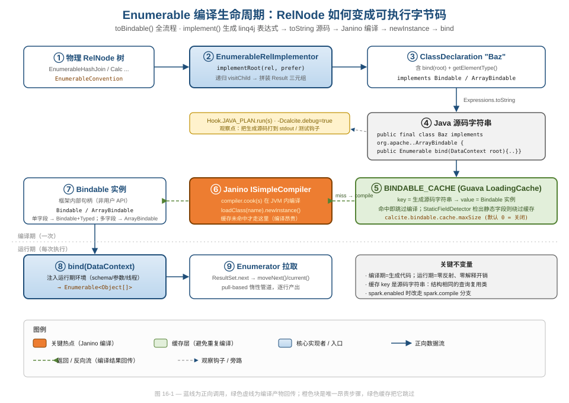
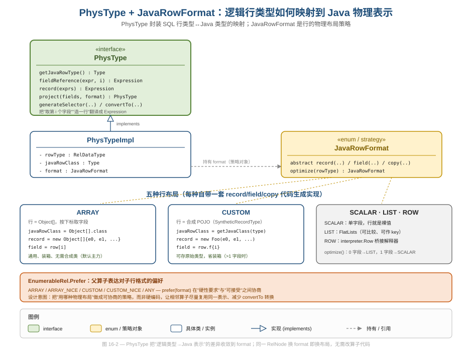
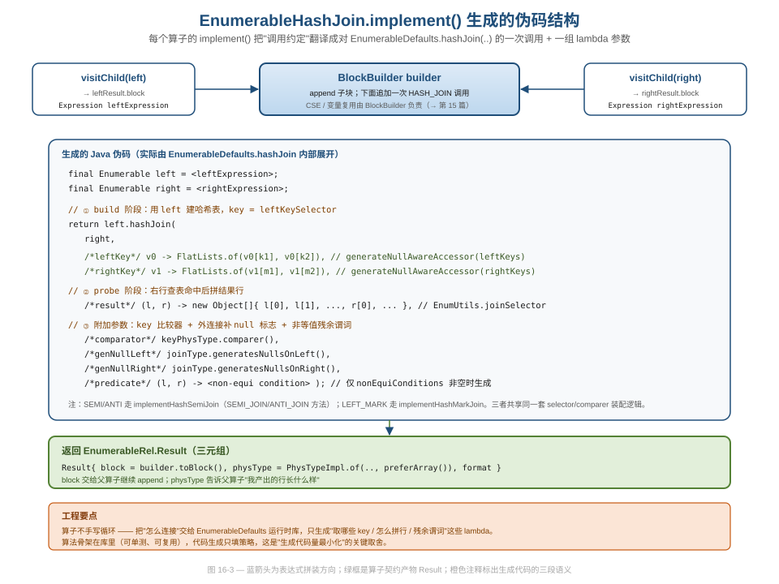
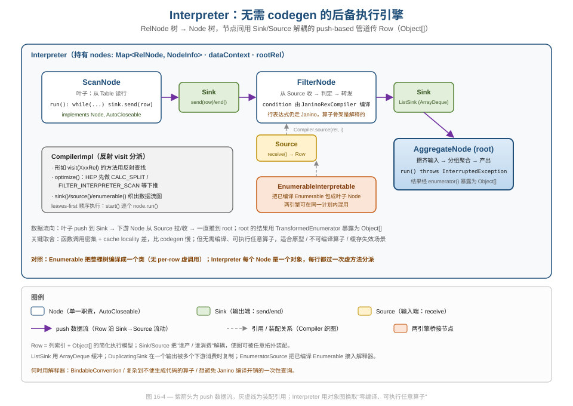

# 第 16 篇 · RelNode→Java：Enumerable codegen + Janino + Interpreter

> 一棵物理 `RelNode` 树要怎么真正跑起来？本篇拆解 Calcite 的执行后端：`EnumerableRel.implement()` 如何把算子翻译成 linq4j 表达式、`EnumerableRelImplementor` 如何把整棵树拼成一个 `Bindable` 类、Janino 如何把源码字符串编译成字节码并缓存，以及当 codegen 不划算时作为后备的 `Interpreter`。落点是工程实现：实现者（Implementor）模式、`PhysType`/`JavaRowFormat` 物理表示、Janino 缓存策略，以及"编译 vs 解释"的双引擎权衡。
> 基线 commit `111030383` · 前置阅读：[第 15 篇 · linq4j 与 Expression Tree](15-linq4j.md)、[第 14 篇 · Trait/Convention](14-trait-convention.md)

## TL;DR（要点速览）

- **实现者模式**：每个 `EnumerableRel` 算子实现 `implement(implementor, pref)`，返回 `Result` 三元组（`BlockStatement` + `PhysType` + `JavaRowFormat`）。父算子递归 `visitChild` 拿到子块，再 append 自己的代码——一棵树自底向上拼成一段 Java。
- **PhysType + JavaRowFormat 把"逻辑行类型→Java 表示"的差异收敛成策略对象**：同一算子换 `JavaRowFormat`（ARRAY / CUSTOM / SCALAR / LIST / ROW）即换物理布局，算子代码不动。`Prefer` 让相邻算子协商行格式，减少转换。
- **Janino 在 JVM 内把生成的源码字符串编译成 `Bindable` 类**；`BINDABLE_CACHE` 以源码字符串为 key 复用编译结果，避开"重复编译同结构查询"的昂贵开销——但缓存默认关闭，且含静态字段的类会被 `StaticFieldDetector` 排除。
- **算子不手写循环**：`EnumerableHashJoin` 只生成"取哪些 key / 怎么拼结果行 / 残余谓词"这些 lambda，连接算法本体在运行时库 `EnumerableDefaults` 里。生成代码量被刻意压到最小。
- **Interpreter 是无 codegen 的后备引擎**：`RelNode` 树 → `Node` 树，节点间用 `Sink`/`Source` 解耦的 push 管道传 `Row`。慢（虚调用 + cache 局部性差），但零编译、可执行任意算子，适合原型 / 不可编译算子 / 一次性查询。
- **行表达式翻译（RexNode→Expression）由 `RexToLixTranslator` + `NullPolicy` 负责**，是连接第 5 篇（RexNode 本体）与本篇（算子 codegen）的桥；本篇只讲它在 codegen 中的角色，RexNode 结构本体见 [第 5 篇](05-rexnode.md)。

---

## 1. 全景：从物理树到字节码的一条流水线

优化器（[第 11 篇](11-volcano.md)）吐出的是一棵带 `EnumerableConvention` 的物理 `RelNode` 树。这棵树还不是可执行的东西——它只是"用什么算法、什么物理属性"的描述。本篇关心的是接下来这一步：**怎么把它变成 JVM 里能跑的代码**。

整条流水线是一次"降级再编译"：物理 `RelNode` → linq4j Expression Tree（第四层 IR，[第 15 篇](15-linq4j.md)）→ Java 源码字符串 → Janino 编译的 `Bindable` 类 → `bind(dataContext)` 得到 `Enumerable` → 逐行拉取。



图 16-1 把这条线分成"编译期（一次）"和"运行期（每次执行）"两段。值得先记住三个事实，后面会逐一展开：

1. **编译期生成代码、运行期零反射零解释**。这是 enumerable 引擎快的根本原因——所有字段访问、类型转换、函数调用都被"焊死"成直接的 Java 代码，JIT 还能进一步内联。
2. **缓存 key 是生成的源码字符串**。结构相同（只是参数不同）的查询会命中同一份编译好的类。
3. **Janino 编译是唯一昂贵的步骤**，缓存的全部意义就是把它跳过。

入口方法是 `EnumerableInterpretable.toBindable()`（`core/src/main/java/org/apache/calcite/adapter/enumerable/EnumerableInterpretable.java:106`）。它把整条流水线串起来：

```java
public static Bindable toBindable(Map<String, Object> parameters,
    CalcitePrepare.@Nullable SparkHandler spark, EnumerableRel rel,
    EnumerableRel.Prefer prefer) {
  EnumerableRelImplementor relImplementor =
      new EnumerableRelImplementor(rel.getCluster().getRexBuilder(), parameters);

  final ClassDeclaration expr = relImplementor.implementRoot(rel, prefer); // ① 生成表达式树
  String s = Expressions.toString(expr.memberDeclarations, "\n", false);   // ② 转源码字符串

  if (CalciteSystemProperty.DEBUG.value()) {
    Util.debugCode(System.out, s);   // -Dcalcite.debug=true 把生成代码打到 stdout
  }
  Hook.JAVA_PLAN.run(s);             // ③ 观察钩子：测试/工具可在此截获源码

  try {
    if (spark != null && spark.enabled()) {
      return spark.compile(expr, s); // Spark 分支
    } else {
      return getBindable(expr, s, rel.getRowType().getFieldCount()); // ④ Janino 编译
    }
  } catch (Exception e) {
    throw Helper.INSTANCE.wrap("Error while compiling generated Java code:\n" + s, e);
  }
}
```

**好在哪**：`Hook.JAVA_PLAN`（`core/src/main/java/org/apache/calcite/runtime/Hook.java:67`）和 `-Dcalcite.debug=true` 是这套黑盒最重要的可观测性入口。生成代码默认看不见，但这两个钩子让你能把它打出来、设断点、甚至在 IDE 里单步——后面"对照阅读建议"会用到。catch 块把"编译失败的源码"原样塞进异常消息，这是个朴素但极有用的防御式设计：codegen 出错时你能直接看到出问题的那段 Java。

---

## 2. 实现者模式：每个算子只管自己那一段

### 2.1 EnumerableRel 契约与 Result 三元组

`EnumerableRel`（`core/src/main/java/org/apache/calcite/adapter/enumerable/EnumerableRel.java`）是所有 enumerable 物理算子的接口。核心方法只有一个：

```java
// EnumerableRel.java:60
Result implement(EnumerableRelImplementor implementor, Prefer pref);
```

它的返回值 `Result`（同文件 `:108`）是一个三元组：

```java
class Result {
  public final BlockStatement block;   // 这段算子生成的代码块（求值出一个 Enumerable）
  public final PhysType physType;      // 输出行的物理类型（Java 类 + 字段映射）
  public final JavaRowFormat format;   // 输出行的物理布局
}
```

这是整个 codegen 体系的"算子契约"。它把"我这个算子怎么执行"完整地打包成一个值对象：`block` 是可执行代码，`physType`/`format` 是"我产出的行长什么样"——后者让父算子知道该怎么从子结果里取字段。

**为什么这么设计**：这是教科书式的 **Implementor / Visitor 变体**。每个算子是一个"知道怎么生成自己代码"的局部专家，不需要知道整棵树。组合（递归）的责任交给 `implementor.visitChild`。这种"局部知识 + 递归组合"正是编译器后端的标准结构，好处是**新增物理算子只需实现 `implement`，无需改动任何中央分派器**——开闭原则的落地。

### 2.2 visitChild 与递归拼装

父算子通过 `EnumerableRelImplementor.visitChild` 拿到子算子的 `Result`（`core/src/main/java/org/apache/calcite/adapter/enumerable/EnumerableRelImplementor.java:99`）：

```java
public EnumerableRel.Result visitChild(EnumerableRel parent, int ordinal,
    EnumerableRel child, EnumerableRel.Prefer prefer) {
  if (parent != null) {
    assert child == parent.getInputs().get(ordinal);
  }
  return child.implement(this, prefer);   // 就是递归调用子算子的 implement
}
```

看似平淡，但这就是整棵树自底向上被"折叠"成一段代码的机制：根算子 `implement` → 调 `visitChild` → 子算子 `implement` → 再调 `visitChild`……一直到叶子（如 `EnumerableTableScan`），然后逐层把子 `block` append 进父 `block`。

### 2.3 implementRoot：给整棵树套上 Bindable 外壳

根节点的 `Result` 还不能直接编译——它只是一个 `Enumerable` 表达式。`implementRoot`（`EnumerableRelImplementor.java:110`）负责把它包装成一个完整的类声明：

```java
public ClassDeclaration implementRoot(EnumerableRel rootRel, EnumerableRel.Prefer prefer) {
  EnumerableRel.Result result = rootRel.implement(this, prefer);
  // ... ARRAY+单字段时的 SLICE0 特化（标量解包） ...

  final List<MemberDeclaration> memberDeclarations = new ArrayList<>();
  new TypeRegistrar(memberDeclarations).go(result);  // 注册合成 record 类（见 §3.2）

  // 把 stashed 常量声明插到方法最前面（编译期常量经 DataContext 传入）
  // ...
  memberDeclarations.add(
      Expressions.methodDecl(Modifier.PUBLIC, Enumerable.class,
          BuiltInMethod.BINDABLE_BIND.method.getName(),  // public Enumerable bind(DataContext root)
          Expressions.list(DataContext.ROOT), block));
  memberDeclarations.add(
      Expressions.methodDecl(Modifier.PUBLIC, Class.class,
          BuiltInMethod.TYPED_GET_ELEMENT_TYPE.method.getName(), ...));  // getElementType()

  return Expressions.classDecl(Modifier.PUBLIC, "Baz", null,
      Collections.singletonList(Bindable.class), memberDeclarations);
}
```

生成的类固定叫 `Baz`，实现 `Bindable`，核心方法是 `bind(DataContext root)`——这就是图 16-1 的 ③。`DataContext` 是运行期环境注入点（schema、查询参数、当前时间、线程上下文），通过 `bind` 的参数传进来。

这里有个值得品味的工程细节：**`stash` 机制**（`EnumerableRelImplementor.java:432`）。不是所有常量都能写成 Java 字面量——比如一个 `ArrayList` 没法 inline 成源码。`stash` 把这类对象放进 `map`（`internalParameters`），在生成代码里写成 `(Integer) root.get("v1stashed")`，运行期再从 `DataContext` 取回。它还用 `Equivalence.identity()` 做去重，相同引用只 stash 一次。这是"代码生成里如何传递非字面量编译期常量"的经典手法——把对象旁路到运行时上下文，源码里只留一个名字。

---

## 3. PhysType 与 JavaRowFormat：物理表示的策略化

### 3.1 一行数据在 JVM 里可以长什么样

SQL 层的"一行"是逻辑概念（`RelDataType`），但在 JVM 里它必须落成某个具体的 Java 对象。Calcite 没有把它硬编码成"行就是 `Object[]`"，而是抽象成了两层：`PhysType`（物理类型）封装"逻辑行类型↔Java 类型"的映射，`JavaRowFormat` 是"行的物理布局"策略。



`PhysType`（`core/src/main/java/org/apache/calcite/adapter/enumerable/PhysType.java`）是个接口，关键方法都返回 `Expression`——它不直接操作数据，而是**生成"如何操作数据"的代码**：

```java
// PhysType.java（节选关键方法）
Type getJavaRowType();                                   // 行的 Java 类型，如 Object[].class
Expression fieldReference(Expression expr, int field);   // 生成 "row[i]" 或 "row.f3"
Expression record(List<Expression> expressions);         // 生成 "new Object[]{...}" 或 "new Foo(...)"
PhysType project(List<Integer> fields, JavaRowFormat fmt);
Expression generateSelector(ParameterExpression p, List<Integer> fields);
```

`PhysTypeImpl`（`core/src/main/java/org/apache/calcite/adapter/enumerable/PhysTypeImpl.java:58`）持有 `rowType`、`javaRowClass` 和一个 `format` 字段——所有"取字段、造行"的具体生成逻辑都委托给 `format`。

### 3.2 JavaRowFormat：同一接口的五种布局

`JavaRowFormat`（`core/src/main/java/org/apache/calcite/adapter/enumerable/JavaRowFormat.java:48`）是个 enum，每个枚举常量重写 `record`/`field`/`copy` 三个抽象方法——这是 **Java enum 实现策略模式**的标准写法。五种布局：

| Format | Java 表示 | `field(i)` 生成 | 适用 |
|---|---|---|---|
| `ARRAY` | `Object[]` | `row[i]` | 通用默认，装箱，无需合成类 |
| `CUSTOM` | 合成 POJO（`SyntheticRecordType`） | `row.f{i}` | 多字段、可存原始类型省装箱 |
| `SCALAR` | 裸值本身 | `row`（即 `field==0`） | 单字段行 |
| `LIST` | `FlatLists.ComparableList` | `row.get(i)` | 0 字段，或需要做 lookup key |
| `ROW` | `interpreter.Row` | `row.getObject(i)` | 桥接解释器 |

以 `ARRAY` 为例（`JavaRowFormat.java:293`）：

```java
ARRAY {
  @Override Type javaRowClass(JavaTypeFactory tf, RelDataType type) {
    return Object[].class;
  }
  @Override public Expression record(Type javaRowClass, List<Expression> exprs) {
    return Expressions.newArrayInit(Object.class, exprs);   // new Object[]{e0, e1, ...}
  }
  @Override public Expression field(Expression expr, int field, Type fromType, Type fieldType) {
    final IndexExpression e = Expressions.arrayIndex(expr, Expressions.constant(field)); // expr[field]
    // ... EnumUtils.convert 处理类型转换 ...
  }
}
```

而 `optimize`（`JavaRowFormat.java:335`）是个画龙点睛的小函数：

```java
public JavaRowFormat optimize(RelDataType rowType) {
  switch (rowType.getFieldCount()) {
  case 0:  return LIST;      // 空行 → 空 list 单例最省
  case 1:  return SCALAR;    // 单字段 → 直接用裸值，省一层数组
  default: return this == SCALAR ? LIST : this;
  }
}
```

**好在哪**：`optimize` 把"边界情况下哪种布局最省"这条规则**收敛到一处**。无论哪个算子，只要它选了一个 format，0/1 字段的特化自动生效，不会散落在各算子里重复判断。这是把"决策逻辑单点化"的典型——降低了出错面，也让"换布局"成为一个纯局部的改动。

### 3.3 Prefer：让相邻算子协商行格式

光有五种 format 还不够——相邻算子如果各用各的布局，中间就得插转换代码。`EnumerableRel.Prefer`（`EnumerableRel.java:63`）解决这个问题：父算子向子算子表达"我希望你产出什么格式"，分"硬性要求"和"可接受"两档：

```java
enum Prefer {
  ARRAY,        // 必须是数组
  ARRAY_NICE,   // 偏好数组，但能接受对象
  CUSTOM,       // 必须是对象
  CUSTOM_NICE,  // 偏好对象，但能接受数组
  ANY;          // 无所谓

  public JavaRowFormat prefer(JavaRowFormat format) {
    switch (this) {
    case CUSTOM: return JavaRowFormat.CUSTOM;
    case ARRAY:  return JavaRowFormat.ARRAY;
    default:     return format;   // *_NICE / ANY 时尊重子算子的选择
    }
  }
}
```

**为什么这么设计**：这是"硬约束 vs 软偏好"的协商协议。`*_NICE` 这一档很关键——它让子算子在没有硬性冲突时自由选最优布局，父算子只在真正必要时（比如哈希表 key 必须是 `Object[]`）才强制。这种"尽量不强加、必要时才约束"的协商，最大化了相邻算子复用同一物理表示的机会，减少了无谓的 `convertTo` 转换。**可借鉴点**：当系统中多个组件对同一数据有不同偏好时，把偏好建模成"必须/偏好/无所谓"三档，比非黑即白的布尔开关更能榨出优化空间。

---

## 4. 一个算子的完整 codegen：EnumerableHashJoin

理论说够了，看一个真算子怎么生成代码。`EnumerableHashJoin.implement`（`core/src/main/java/org/apache/calcite/adapter/enumerable/EnumerableHashJoin.java:172`）先按 join 类型分派：

```java
@Override public Result implement(EnumerableRelImplementor implementor, Prefer pref) {
  switch (joinType) {
  case SEMI:
  case ANTI:      return implementHashSemiJoin(implementor, pref);
  case LEFT_MARK: return implementHashMarkJoin(implementor, pref);
  default:        return implementHashJoin(implementor, pref);
  }
}
```

普通 join 走 `implementHashJoin`（`:331`）。它的结构非常说明问题：

```java
private Result implementHashJoin(EnumerableRelImplementor implementor, Prefer pref) {
  BlockBuilder builder = new BlockBuilder();
  final Result leftResult  = implementor.visitChild(this, 0, (EnumerableRel) left, pref);
  Expression leftExpression  = builder.append("left", leftResult.block);   // 递归拿子块
  final Result rightResult = implementor.visitChild(this, 1, (EnumerableRel) right, pref);
  Expression rightExpression = builder.append("right", rightResult.block);

  final PhysType physType = PhysTypeImpl.of(implementor.getTypeFactory(), getRowType(), pref.preferArray());
  final PhysType keyPhysType = leftResult.physType.project(joinInfo.leftKeys, JavaRowFormat.LIST);

  // 只有非等值残余条件时才生成谓词 lambda
  Expression predicate = Expressions.constant(null);
  if (!joinInfo.nonEquiConditions.isEmpty()) { /* EnumUtils.generatePredicate(...) */ }

  return implementor.result(physType,
      builder.append(
          Expressions.call(
              leftExpression,
              BuiltInMethod.HASH_JOIN.method,   // ← 调运行时库，不是手写循环！
              Expressions.list(
                  rightExpression,
                  leftResult.physType.generateNullAwareAccessor(joinInfo.leftKeys, ...),   // 左 key selector
                  rightResult.physType.generateNullAwareAccessor(joinInfo.rightKeys, ...), // 右 key selector
                  EnumUtils.joinSelector(joinType, physType, ...))                          // 结果行 selector
              .append(Util.first(keyPhysType.comparer(), Expressions.constant(null)))       // key 比较器
              .append(Expressions.constant(joinType.generatesNullsOnLeft()))               // 外连接补 null 标志
              .append(Expressions.constant(joinType.generatesNullsOnRight()))
              .append(predicate))                                                           // 残余谓词
          .toBlock());
}
```



图 16-3 把生成的代码拆成三段语义：build（用 `leftKeySelector` 建哈希表）、probe（右行查表、`joinSelector` 拼结果行）、附加参数（比较器 / 外连接 null 标志 / 残余谓词）。

**最关键的工程取舍**：注意 `BuiltInMethod.HASH_JOIN.method`（`:366`）。`implementHashJoin` **没有生成任何 for 循环、没有手写哈希表**。它只生成了几个 lambda（取 key、拼行、判残余谓词），然后把它们作为参数传给运行时库 `EnumerableDefaults.hashJoin(...)`。连接算法本体（建表、探查、外连接补 null）全在那个库方法里。

为什么这是好设计？

- **算法骨架可单测、可复用**：`EnumerableDefaults.hashJoin` 是普通 Java 代码，能写单元测试、能 debug，不依赖 codegen。如果把循环也生成出来，每次调试都得先生成代码、再编译、再跑。
- **生成代码量最小化**：生成的代码越少，编译越快、缓存命中面越大、JIT 越友好。只生成"随查询变化的部分"（哪些列是 key、结果行什么形状），不变的算法留在库里。
- **关注点分离**：`EnumerableHashJoin` 只关心"这个 join 的 key 是哪些列、结果行怎么拼"，不关心"哈希连接怎么实现"。

**可借鉴点**：做代码生成时，区分"随输入变化的部分"和"固定算法骨架"，只生成前者、把后者沉到运行时库。这是把 codegen 复杂度控制住的核心手法——生成的代码越少越好。`computeSelfCost`（`:130`）里还藏了个细节：join 可以翻转，为了让结果在不同 planner 版本间稳定，故意给一个方向加 epsilon 成本（`RelMdUtil.addEpsilon`）——这是数据工程里"确定性优于绝对最优"的务实选择。

---

## 5. Janino 编译与 BINDABLE_CACHE

### 5.1 源码字符串 → Bindable 类

`getBindable`（`EnumerableInterpretable.java:134`）负责真正的编译。它先把 `implementRoot` 生成的类体包进一个类声明：

```java
final String s = "public final class " + expr.name + " implements "
    + (fieldCount == 1
      ? Bindable.class.getCanonicalName() + ", " + Typed.class.getCanonicalName()
      : ArrayBindable.class.getCanonicalName())
    + " {\n" + classBody + "\n}";
```

这里有个不起眼但合理的分支：**单字段查询实现 `Bindable + Typed`，多字段实现 `ArrayBindable`**（`core/src/main/java/org/apache/calcite/runtime/ArrayBindable.java`，它 `extends Bindable<Object[]>`）。单字段不必把裸值包进 `Object[]`，省一层装箱——和 §3.2 的 `SCALAR` 格式呼应。当上层需要统一的数组视图时，`box()`（`:197`）再用一个匿名 `ArrayBindable` 把标量包成单元素数组。

然后调 Janino：

```java
// EnumerableInterpretable.java:173 compileToBindable
compiler.cook(s);   // Janino 在 JVM 内编译这段源码
return (Bindable<?>) compiler.getClassLoader()
    .loadClass(className).getDeclaredConstructors()[0].newInstance();
```

`compiler.cook(s)` 是图 16-1 的橙色热点——它把字符串源码即时编译成字节码、加载、实例化。这一步昂贵（毫秒级），是整条流水线唯一真正费时的环节。

### 5.2 缓存：以源码字符串为 key

`BINDABLE_CACHE`（`EnumerableInterpretable.java:100`）就是为了把 `cook` 跳过：

```java
private static final Cache<String, Bindable> BINDABLE_CACHE =
    CacheBuilder.newBuilder()
        .concurrencyLevel(CalciteSystemProperty.BINDABLE_CACHE_CONCURRENCY_LEVEL.value())
        .maximumSize(CalciteSystemProperty.BINDABLE_CACHE_MAX_SIZE.value())
        .build();
```

命中逻辑在 `getBindable` 里（`:163`）：

```java
if (CalciteSystemProperty.BINDABLE_CACHE_MAX_SIZE.value() != 0) {
  StaticFieldDetector detector = new StaticFieldDetector();
  expr.accept(detector);
  if (!detector.containsStaticField) {
    return BINDABLE_CACHE.get(classBody, () -> compileToBindable(expr.name, s, compiler));
  }
}
return compileToBindable(expr.name, s, compiler);
```

**为什么 key 是源码字符串而不是 RelNode digest**：因为最终决定字节码的就是这段源码——两个不同的物理计划如果生成了字节一致的源码（比如只是字面常量被 stash 旁路了），它们应该共享同一份编译结果。用源码字符串当 key 是最贴近"编译产物等价性"的选择。

**StaticFieldDetector 这道关卡是个真实的坑**（`:186`）：含静态字段的生成类**不能**被缓存。原因是静态字段是类级共享状态，一份编译类被多个查询实例复用时，静态字段会串味（一个查询的状态泄漏到另一个）。`StaticFieldDetector` 是个 `VisitorImpl`，扫描 AST，发现任何 `Modifier.STATIC` 字段就拒绝缓存、每次重新编译。这是"缓存正确性优先于命中率"的防御式取舍——宁可慢，不可错。

**必须诚实说出来的两个坑**：

1. **`BINDABLE_CACHE` 默认是关闭的**——`BINDABLE_CACHE_MAX_SIZE` 默认值为 0（见 `core/src/main/java/org/apache/calcite/config/CalciteSystemProperty.java:392`），此时整段缓存逻辑被 `!= 0` 跳过，每次执行都重新编译。要享受缓存收益，得显式调大这个属性。这意味着开箱即用的 Calcite 在重复执行同结构查询时，会重复付出 Janino 编译成本。
2. **缓存全局、且 provider 变更不失效**。缓存是 `static` 的，key 只看源码字符串。这套机制不感知"底层 schema/函数实现是否变了"——只要生成的源码一字不差，就复用旧类。对绝大多数场景没问题（源码变了 key 自然变），但在动态替换运行时行为的极端场景下需要留意。

---

## 6. Interpreter：当 codegen 不划算时的后备引擎

### 6.1 为什么需要第二个引擎

Enumerable codegen 快，但有代价：每条查询都要付一次 Janino 编译（除非命中缓存）。对**一次性查询、原型验证、或包含难以生成代码的复杂算子**的场景，"先编译再执行"反而不划算。Calcite 因此保留了一个完全不依赖 codegen 的执行引擎：`Interpreter`。

它的思路朴素得多：不生成代码，而是把 `RelNode` 树翻译成一棵 `Node` 对象树，运行时直接遍历这棵对象树、逐行处理。



### 6.2 Node / Sink / Source：解耦的 push 管道

`Node`（`core/src/main/java/org/apache/calcite/interpreter/Node.java`）极简——单一职责 + 可关闭：

```java
public interface Node extends AutoCloseable {
  void run() throws InterruptedException;
  @Override default void close() {}
}
```

节点之间不直接互相调用，而是通过两个解耦接口传数据：

```java
// Sink.java — 输出端
public interface Sink {
  void send(Row row) throws InterruptedException;
  void end() throws InterruptedException;
}
// Source.java — 输入端
public interface Source extends AutoCloseable {
  @Nullable Row receive();   // null 表示数据结束
  @Override void close();
}
```

每个 `Node.run()` 从它的 `Source` 收行、处理、`send` 到 `Sink`。`Row`（`Object[]` + 列索引）是统一的简化执行模型。

**好在哪**：`Sink`/`Source` 把"谁产数据 / 谁消费数据"彻底解耦——`Node` 不知道它的上下游是谁，只面向接口编程。这让数据流图可以被任意拓扑装配（一个输出喂多个下游时用 `DuplicatingSink` 复制；`ListSink` 用 `ArrayDeque` 缓冲）。这是 push-based 流水线的经典解耦，和 Volcano 火山模型的 pull 迭代器形成有趣对比。

### 6.3 CompilerImpl：反射分派织出数据流图

`Interpreter` 的构造里，`CompilerImpl`（`Interpreter.java:289`）遍历 `RelNode` 树，为每个节点造一个 `Node`：

```java
static class CompilerImpl extends RelVisitor implements Compiler, ReflectiveVisitor {
  // 用反射找形如 visit(XxxRel) 的方法
  private final ReflectiveVisitDispatcher<CompilerImpl, RelNode> dispatcher =
      ReflectUtil.createDispatcher(CompilerImpl.class, RelNode.class);
```

具体的 `visit(Aggregate)`/`visit(Filter)`/`visit(Project)`... 在子类 `Nodes.CoreCompiler` 里。`source()`/`sink()`/`enumerable()` 这几个方法负责把 `Node` 之间的 `Sink`/`Source` 接起来，织成数据流图。要支持新算子，只需加一个 `visit(XxxRel)` 方法——又是开闭原则。

构造时还做了一轮 HEP 优化（`Interpreter.java:93`），把适合解释器的下推规则跑一遍：

```java
private static RelNode optimize(RelNode rootRel) {
  final HepProgram hepProgram = new HepProgramBuilder()
      .addRuleInstance(CoreRules.CALC_SPLIT)
      .addRuleInstance(CoreRules.FILTER_INTERPRETER_SCAN)   // filter 下推到 scan
      .addRuleInstance(CoreRules.PROJECT_INTERPRETER_TABLE_SCAN)
      .addRuleInstance(CoreRules.AGGREGATE_REDUCE_FUNCTIONS)
      .build();
  // ... HepPlanner.findBestExp ...
}
```

执行时 `start()`（`:129`）依赖"节点已按叶子优先排序"，逐个 `node.run()`：

```java
private void start() {
  // We rely on the nodes being ordered leaves first.
  for (Map.Entry<RelNode, NodeInfo> entry : nodes.entrySet()) {
    nodeInfo.node.run();   // 叶子先跑、把数据 push 给下游
  }
}
```

注意一个细节：**行表达式（`condition`、`projects`）在解释器里仍然走 Janino**——`CompilerImpl` 持有 `JaninoRexCompiler` 来编译标量表达式（`:308`）。也就是说"解释器"只是**算子骨架是解释的**，行级表达式求值依旧编译。这是个聪明的折中：算子层的虚调用开销可以忍，但每行每列都解释 `RexNode` 会慢到无法接受，所以表达式还是编译。

### 6.4 两引擎如何混用：EnumerableInterpretable 桥

`EnumerableInterpretable`（图 16-4 橙框）是连接两个引擎的桥。它的 `implement(InterpreterImplementor)`（`EnumerableInterpretable.java:83`）把一段已经编译好的 `Enumerable` 包装成解释器的一个叶子 `Node`：

```java
@Override public Node implement(final InterpreterImplementor implementor) {
  final Bindable bindable = toBindable(...);                 // 先按 enumerable 编译
  final ArrayBindable arrayBindable = box(bindable);
  final Enumerable<Object[]> enumerable = arrayBindable.bind(implementor.dataContext);
  return new EnumerableNode(enumerable, implementor.compiler, this);  // 包成解释器叶子节点
}
```

`EnumerableNode.run()`（`:247`）从这个 `Enumerable` 拉行、`Row.of(values)` 后 `send` 给下游 `Sink`。这意味着**同一个执行计划里可以一部分编译、一部分解释**——能编译的子树编译，难编译的算子交给解释器，两者无缝拼接。

### 6.5 权衡：诚实的代价

| 维度 | Enumerable (codegen) | Interpreter |
|---|---|---|
| 启动成本 | 高（一次 Janino 编译，除非命中缓存） | 低（无编译，行表达式仍编译） |
| 每行开销 | 极低（直接代码，JIT 内联） | 高（每行过一次虚方法分派） |
| cache 局部性 | 好（整树焊成一个方法） | 差（节点是离散对象，跨对象跳转） |
| 算子覆盖 | 需为每个算子写 codegen | 加 `visit(XxxRel)` 即可，更灵活 |
| 适用 | 重复执行、长查询、生产路径 | 原型、一次性查询、不可编译算子、想躲编译开销 |

RESEARCH 里的 pitfall 必须如实记下：**Interpreter 函数调用开销大、cache locality 差**。它不是"更好的引擎"，而是"另一种取舍"——用对象图的灵活性和零编译启动，换运行期吞吐。理解这一点，就理解了为什么 Calcite 默认生产路径走 enumerable，而把 interpreter 留作后备。

---

## 7. RexToLixTranslator 与 NullPolicy（桥接 §05，本篇只点角色）

上面所有算子 codegen 里出现的"取字段、判谓词、算表达式"，最终都要把 `RexNode`（行表达式，[第 5 篇](05-rexnode.md)）翻译成 linq4j `Expression`。这个翻译器是 `RexToLixTranslator`（`core/src/main/java/org/apache/calcite/adapter/enumerable/RexToLixTranslator.java:110`），它是一个 `RexVisitor<Result>`，递归把 `RexCall`/`RexInputRef`/`RexLiteral` 翻成表达式。

它有一处很值得一提的设计——**SQL 三值逻辑的 null 传播被建模成 `NullPolicy`**（`core/src/main/java/org/apache/calcite/adapter/enumerable/NullPolicy.java`）：

```java
public enum NullPolicy {
  ALL,          // 全部参数为 null 才返回 null
  STRICT,       // 任一参数为 null 即返回 null（最常见，如 UPPER/LOWER）
  SEMI_STRICT,  // 任一参数 null 返回 null，但也可能其它时候返回 null
  ARG0,         // 第一个参数 null 即返回 null
  NONE          // 自己处理 null
}
```

`RexImpTable`（函数实现注册表）在 `defineMethod(UPPER, ..., NullPolicy.STRICT)` 时就声明了每个函数的 null 行为（`RexImpTable.java:701`）。翻译器据此自动生成"先判 null、再调函数"的包裹代码——开发者注册新函数时只声明 null 策略，不必手写一遍 null 检查样板。

**为什么这归本篇而非第 5 篇**：第 5 篇讲 `RexNode` 的结构本体（DAG 共享、化简）；NullPolicy 是"翻译成执行代码时如何处理 null"，属于 codegen 阶段的关注点。把它放这里，是因为它只在 RexNode→Expression 这一步才有意义。`RexImpTable` 的 `Map<SqlOperator, ...>` 注册表（`RexImpTable.java:586`）登记了 100+ 函数的实现策略，是 UDF 可扩展的入口——这点和 [第 12 篇的 CoreRules 注册表](12-rules.md)、[第 8 篇的 ConvertletTable](08-sql-to-rel.md) 是同一种"中央注册表"模式，归纳见 [第 19 篇](19-design-patterns.md)。

---

## 设计模式与工程小结

| 模式 / 手法 | 出现位置 | 解决什么问题 | 三问落点 |
|---|---|---|---|
| Implementor / Visitor 变体 | `EnumerableRel.implement` + `visitChild` 递归 | 每算子只管自己 codegen，组合交给递归 | 软件工程：开闭原则，新增算子无需改分派器 |
| 策略对象（Java enum） | `JavaRowFormat` 五种布局重写 record/field/copy | 换物理布局而不改算子代码 | 设计质量：行表示可替换、决策单点化 |
| 协商协议（三档偏好） | `EnumerableRel.Prefer` ARRAY/_NICE/ANY | 相邻算子复用行格式、减少转换 | 设计质量：软硬约束分离榨优化空间 |
| 值对象契约 | `EnumerableRel.Result` 三元组 | 把"算子如何执行"打包成可组合的值 | 软件工程：清晰的算子边界 |
| 旁路常量（stash） | `EnumerableRelImplementor.stash` | 非字面量编译期常量经 DataContext 传入 | 设计质量：codegen 传值的经典手法 |
| 运行时库 + 最小生成 | `BuiltInMethod.HASH_JOIN` 调 `EnumerableDefaults` | 算法骨架可测可复用，生成代码量最小 | 软件工程：复杂度治理的核心取舍 |
| 编译缓存（key=源码） | `BINDABLE_CACHE` + `StaticFieldDetector` | 跳过重复 Janino 编译；保证缓存正确性 | 设计质量：缓存正确性优先于命中率（坑：默认关闭） |
| 解耦管道（Sink/Source） | Interpreter push 数据流 | 节点拓扑可任意装配 | 软件工程：面向接口、关注点分离 |
| 反射 visit 分派 | `Interpreter.CompilerImpl` + `Nodes.CoreCompiler` | 加 `visit(XxxRel)` 即扩展 | 软件工程：开闭原则 |
| 策略注册表 | `RexImpTable` + `NullPolicy` | 函数实现 + null 行为声明式注册 | 设计质量：UDF 可扩展、消除 null 样板 |

**贯穿全篇的一条主线**：Calcite 后端反复用同一个手法——**把"随查询变化的部分"和"固定不变的部分"分开**。生成代码只覆盖前者（哪些列、什么形状、什么 null 策略），不变的部分（连接算法、null 检查、行布局逻辑）沉到运行时库或策略对象里。这是控制 codegen 复杂度、保证可测试性的关键。

---

## 对照阅读建议（动手）

- **断点**：`core/src/main/java/org/apache/calcite/adapter/enumerable/EnumerableInterpretable.java` → `EnumerableInterpretable#toBindable`
  - **观察**：`s` 变量（生成的 Java 源码字符串）长什么样；`expr.name` 是不是 `"Baz"`；走没走 `getBindable` 还是 `spark.compile`。
  - **更省事的看法**：直接在命令行加 `-Dcalcite.debug=true`，生成代码会打到 stdout（`Util.debugCode`）。
  - **运行**：`./gradlew :core:test --tests org.apache.calcite.test.JdbcTest.testWinAgg -Dcalcite.debug=true`

- **断点**：`EnumerableInterpretable.java` → `EnumerableInterpretable#getBindable`
  - **观察**：`BINDABLE_CACHE_MAX_SIZE.value()` 是不是 0（默认关闭，缓存逻辑被跳过）；`detector.containsStaticField` 是否为 true（含静态字段则不缓存）；同一查询第二次执行有没有命中 `BINDABLE_CACHE.get`。
  - **运行**：`./gradlew :core:test --tests org.apache.calcite.test.JdbcTest`（同一 fixture 跑多个相似查询）

- **断点**：`core/src/main/java/org/apache/calcite/adapter/enumerable/EnumerableHashJoin.java` → `EnumerableHashJoin#implementHashJoin`
  - **观察**：`leftResult.physType` / `rightResult.physType` 的 `format`（ARRAY 还是 CUSTOM）；`keyPhysType` 为什么用 `JavaRowFormat.LIST`（key 要可比较可作 lookup）；最终 `Expressions.call(..., HASH_JOIN.method, ...)` 的参数列表如何对应图 16-3 的三段语义。
  - **运行**：`./gradlew :core:test --tests org.apache.calcite.test.JdbcTest.testJoin`

- **断点**：`core/src/main/java/org/apache/calcite/interpreter/Interpreter.java` → `Interpreter.CompilerImpl#visit`
  - **观察**：反射 `dispatcher.invokeVisitor` 如何找到 `visit(FilterRel)` 这类方法；`sink()`/`source()` 如何把 `Node` 接成数据流图；`nodes` 是否按叶子优先排序（`start()` 依赖这点）。
  - **运行**：找一个走 `BindableConvention` 的用例，或 `./gradlew :core:test --tests org.apache.calcite.test.InterpreterTest`

---

## 延伸阅读

- 本系列：
  - [第 15 篇 · linq4j 与 Expression Tree](15-linq4j.md) —— 本篇的 `BlockStatement`/`ClassDeclaration`/`BlockBuilder` 都来自这里；Expression Tree 本体、CSE、`OptimizeShuttle` 是它的主场。
  - [第 5 篇 · RexNode 行表达式](05-rexnode.md) —— `RexToLixTranslator` 翻译的对象；本篇只讲翻译，不讲 RexNode 结构。
  - [第 14 篇 · Trait/Convention](14-trait-convention.md) —— `EnumerableConvention` 是怎么来的、`enforce` 如何插入转换节点。
  - [第 11 篇 · VolcanoPlanner](11-volcano.md) —— 上游：本篇接收的物理树是它选出来的。
  - [第 13 篇 · 元数据与代价](13-metadata-cost.md) —— 同样用 Janino 动态生成代理（`JaninoRelMetadataProvider`），可对照本篇的 `BINDABLE_CACHE` 看 Calcite 两处"Janino + 缓存"的不同取舍。
  - [第 19 篇 · 设计模式全景](19-design-patterns.md) —— `RexImpTable`/`CoreRules` 等"中央注册表"模式的统一归纳。
  - [第 17 篇 · 扩展性架构](17-extensibility.md)、[第 18 篇 · Adapter 生态](18-adapters.md) —— 数据源如何接入；`ScannableTable`/`BindableConvention` 与本篇的执行引擎如何衔接。
- 官方文档：
  - `site/_docs/adapter.md` —— calling convention 与 enumerable 约定的官方说明。
  - `site/_docs/howto.md` —— 含 `-Dcalcite.debug` 与 Janino source debugging（`-Dorg.codehaus.janino.source_debugging.enable=true`）的调试指引。
- 入门教材交叉：`../../calcite-guide/README.md`（第 1 卷）对查询全流程的叙事铺垫。
