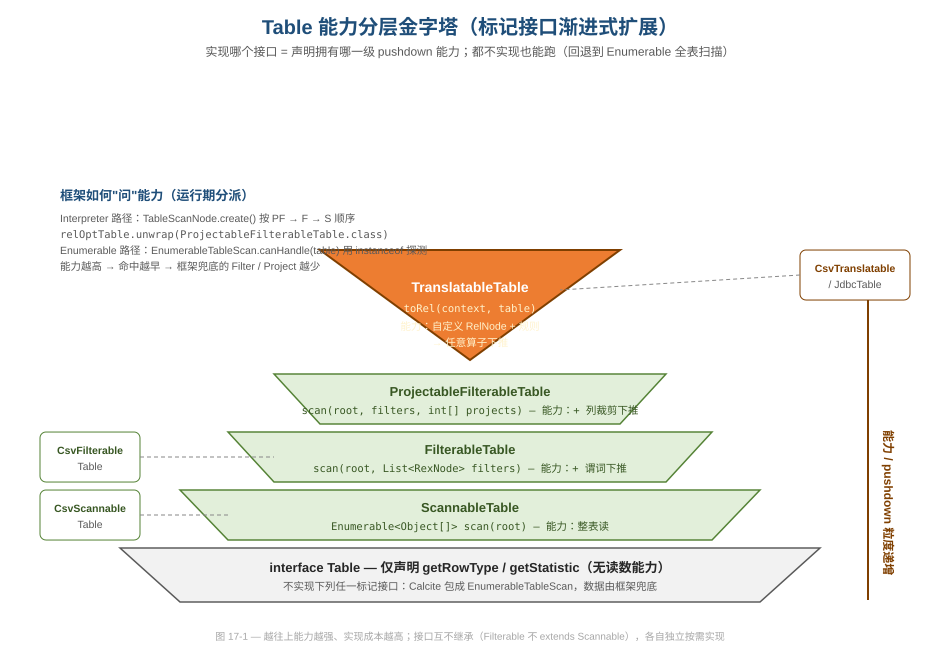
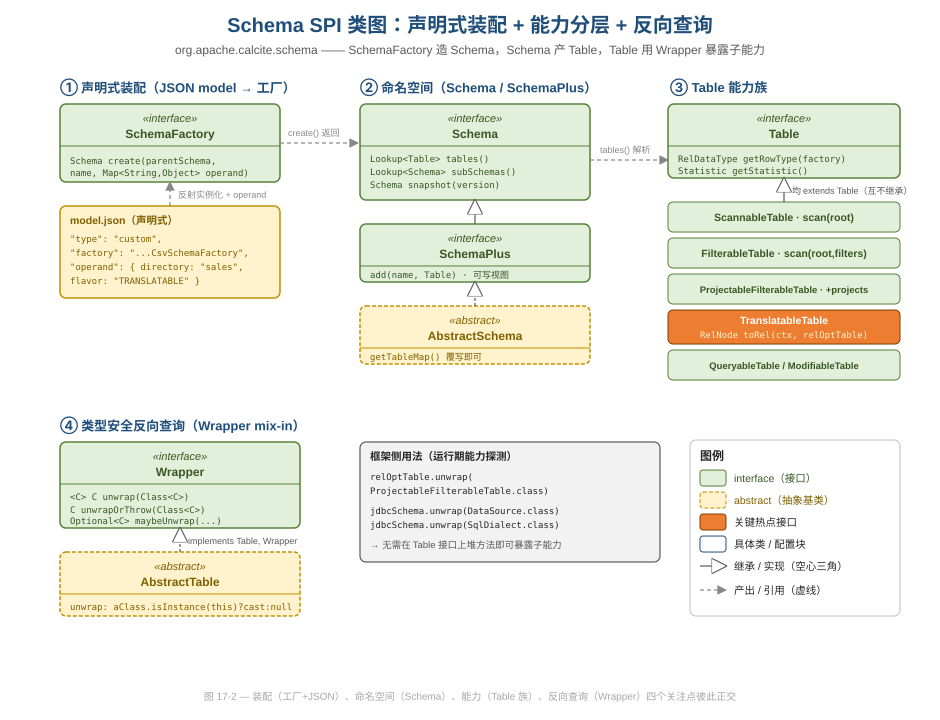
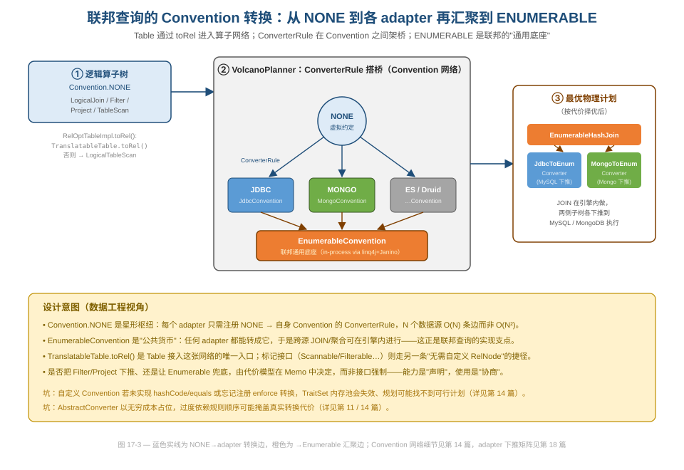

# 第 17 篇 · 扩展性架构：Schema SPI 能力分层

> Calcite 的杀手锏不是某条优化规则，而是"任何数据源都能挂进来当表查"。本篇从软件工程与数据工程的角度拆解这套 SPI：一个 `Table` 怎么用**实现哪个标记接口**来声明自己能下推到什么粒度，怎么用**声明式工厂**把外部系统装配成 schema，又怎么用 `Wrapper` 在不污染接口的前提下暴露子能力，最后接入由 `Convention` 构成的转换网络完成联邦查询。
> 基线 commit `111030383` · 前置阅读：第 01 篇（无存储架构）、第 14 篇（Trait/Convention）

## TL;DR（要点速览）

- **能力分层用"标记接口"而非"配置开关"**：`ScannableTable` / `FilterableTable` / `ProjectableFilterableTable` / `TranslatableTable` 四级，实现哪个就拥有哪一级 pushdown 能力，都不实现也能跑（框架回退到 `EnumerableTableScan` 全表扫描）。
- **接口彼此不继承**：`FilterableTable` 并不 `extends ScannableTable`。这是刻意的——分层是"能力维度"而非"is-a 继承"，避免了"实现 Filterable 就被迫实现 scan()"的耦合。
- **能力是"声明"，使用是"协商"**：`FilterableTable.scan(root, filters)` 传入的是**可变 list**，表实现自己 `removeIf` 掉能处理的谓词，剩下的交回 Calcite 用算子兜底。是否真正下推由代价模型在 Memo 中拍板。
- **声明式装配**：`SchemaFactory.create(parent, name, operand)` + JSON model 的 `operand`，把"怎么连数据源"从代码挪到配置，外部系统接入零编译期依赖。
- **`Wrapper.unwrap(Class)` 是类型安全的反向查询**：框架不在 `Table` 上堆方法，而是问"你能 unwrap 成 `ProjectableFilterableTable` 吗"，把能力探测变成一次类型安全的转型。
- **接入优化器只有一个入口**：`TranslatableTable.toRel()` 让表自产 `RelNode` 并注册规则，进而通过 `ConverterRule` 加入以 `Convention.NONE` 为枢纽、`EnumerableConvention` 为公共底座的转换网络——这是联邦查询的工程支点。
- **坑要如实写**：标记接口的 `scan` 重载签名各不相同、靠 `instanceof` 在多处分派（散弹式），契约（"不得发明新 filter"）只能运行期校验抛异常而非编译期保证。

---

## 0. 本篇看什么

第 01 篇讲过 Calcite "无存储"的哲学：它不存数据，靠 adapter 把外部系统映射成可查询的表。那是宏观的"为什么"。本篇是微观的"怎么做到"——具体到一组接口，看 Calcite 如何用最小的契约面，让一个完全陌生的数据源（CSV 文件、MongoDB 集合、一段 Java 集合）变成能参与 JOIN、能被代价优化、能下推谓词的"一等表"。读的过程中请始终带着系列的"源码工程鉴赏"视角：每一处接口切分、每一个可变参数、每一次 `unwrap`，都是一个可被复用的工程决策，也都有它的代价。

## 1. 为什么是"标记接口分层"而不是一个万能 Table

一个最朴素的设计会让 `Table` 接口长这样：`scan()`、`scanWithFilter()`、`scanWithProjection()`、`toRel()`…… 把所有可能的能力塞进一个接口，实现者用"不支持就抛 `UnsupportedOperationException`"来表态。Calcite 没这么做。它把 `Table` 砍到只剩**元数据**，把每一种"读数能力"拆成一个独立的**子接口（标记接口）**。

先看根接口 `Table`，它故意很瘦——`core/src/main/java/org/apache/calcite/schema/Table.java:47`：

```java
public interface Table {
  /** Returns this table's row type. */
  RelDataType getRowType(RelDataTypeFactory typeFactory);

  /** Returns a provider of statistics about this table. */
  Statistic getStatistic();

  /** Type of table. */
  Schema.TableType getJdbcTableType();
  // ... isRolledUp / rolledUpColumnValidInsideAgg
}
```

注意：`Table` 本身**没有任何读取数据的方法**。它只回答"我有哪些列、什么类型、统计信息如何"。"怎么把数据拿出来"完全交给下面四个子接口去声明。这是一次彻底的**关注点分离**：元数据（validator 和 planner 需要）与执行能力（runtime 才需要）解耦。



如图 17-1，从底到顶能力递增、实现成本递增：

| 接口 | 方法签名（真实） | 声明的能力 |
|---|---|---|
| `Table`（基） | `getRowType` / `getStatistic` | 仅元数据，无读数 |
| `ScannableTable` | `Enumerable<Object[]> scan(root)` | 整表扫描 |
| `FilterableTable` | `scan(root, List<RexNode> filters)` | + 谓词下推 |
| `ProjectableFilterableTable` | `scan(root, filters, int[] projects)` | + 列裁剪下推 |
| `TranslatableTable` | `RelNode toRel(context, relOptTable)` | 自定义 RelNode + 规则（任意下推） |

**这套设计好在哪？** 三点：

1. **渐进式承诺（progressive commitment）**。一个 adapter 作者可以先实现最简单的 `ScannableTable` 让查询跑通，日后再升级到 `FilterableTable`，无需改动调用方一行代码——因为调用方从来不直接调 `scan`，而是先问"你是哪一级"。
2. **能力即类型**。"这张表支不支持谓词下推"不是一个布尔字段，而是"它 `instanceof FilterableTable` 吗"。编译器和 IDE 都能帮你导航。
3. **零成本的默认行为**。一张只实现 `Table`（甚至连标记接口都不实现）的表也是合法的——下文会看到框架会把它兜底成 `EnumerableTableScan`，由引擎做全表扫描。能力是**机会**，不是**义务**。

**对比"万能 Table"反模式**，差异更清楚。如果把所有能力塞进一个胖接口、用 `UnsupportedOperationException` 表态，会有三个问题：(a) 实现者被迫面对一堆与自己无关的方法，可读性差；(b) "支持什么"变成运行期才会炸的异常，而不是编译期可见的类型；(c) 框架想知道"这张表能不能裁列"只能 try-catch 或加布尔标志位，无法用 `instanceof` 干净地分派。Calcite 用"把能力拆成独立标记接口"换掉了这三个问题——代价是接口数量变多、框架侧要多处探测（§3 会展开这个权衡的另一面）。这是一个典型的**接口隔离原则（ISP）**应用：不强迫实现者依赖它用不到的方法。

### 1.1 一个反直觉的细节：接口互不继承

直觉上你会以为 `FilterableTable extends ScannableTable`（"能带过滤地扫，当然也能不带过滤地扫"）。但源码里它们都直接 `extends Table`：

```java
// ScannableTable.java:28
public interface ScannableTable extends Table { ... }
// FilterableTable.java:33
public interface FilterableTable extends Table { ... }
// ProjectableFilterableTable.java:38
public interface ProjectableFilterableTable extends Table { ... }
```

`ProjectableFilterableTable` 的 javadoc 把意图讲得很清楚（`ProjectableFilterableTable.java:30-37`）：

> *If you wish to write a table that can apply projects but not filters, simply decline all filters.*

也就是说，这是**能力维度的笛卡尔积**，不是 is-a 链：`ProjectableFilterable` 不要求你先会 `Filterable`，它有自己**唯一**的三参数 `scan` 方法，"不想过滤就把所有 filter 退回去"。如果强行做成继承，实现者会被迫面对"我 extends 了 ScannableTable，那两个 scan 方法都得实现吗"的尴尬。Calcite 用"扁平的标记接口 + 各自独立的方法签名"换来了实现者的自由。

**代价（坑）也要说清**：因为接口不继承、方法签名各异，框架侧无法用一套统一的虚分派来调用，只能在多处用 `instanceof` / `unwrap` 逐个探测（见 §3）。这是一种"散弹式分派"，新增一级能力要改多处。这是分层灵活性换来的复杂度，下文会指出具体位置。

---

## 2. "能力是声明，使用是协商"——可变 filter list 的精妙

最能体现 Calcite 设计哲学的是 `FilterableTable` 的契约。看签名（`FilterableTable.java:43`）和它的 javadoc：

```java
public interface FilterableTable extends Table {
  /** ...
   * <p>The list of filters is mutable.
   * If the table can implement a particular filter, it should remove that
   * filter from the list.
   * If it cannot implement a filter, it should leave it in the list.
   * Any filters remaining will be implemented by the consuming Calcite
   * operator. */
  Enumerable<@Nullable Object[]> scan(DataContext root, List<RexNode> filters);
}
```

这里的设计眼光在于：**下推不是全有或全无**。表拿到一个**可变的谓词列表**，能处理多少就 `remove` 多少，处理不了的留在 list 里，由 Calcite 在表上方补一个 `Filter` 算子兜底。CSV 教学适配器把这个协议演示得淋漓尽致——`example/csv/.../CsvFilterableTable.java:59`：

```java
@Override public Enumerable<@Nullable Object[]> scan(DataContext root, List<RexNode> filters) {
  // ...
  final @Nullable String[] filterValues = new String[fieldTypes.size()];
  filters.removeIf(filter -> addFilter(filter, filterValues)); // ← 处理掉的就移除
  // ...
}

private static boolean addFilter(RexNode filter, @Nullable Object[] filterValues) {
  if (filter.isA(SqlKind.AND)) {
    // We cannot refine(remove) the operands of AND ...
    ((RexCall) filter).getOperands().forEach(subFilter -> addFilter(subFilter, filterValues));
  } else if (filter.isA(SqlKind.EQUALS)) {
    // 只认 column = literal 这种最简单的等值谓词
    // ... 命中则 filterValues[index] = ...; return true; → 被 removeIf 移除
  }
  return false; // 不认的 filter 留在 list 里，交回 Calcite
}
```

CSV 表只会处理 `列 = 字面量` 这一种最简单的谓词，其余（范围、`OR`、函数）一律 `return false` 留给框架。这里还藏着一个真实的实现取舍：对 `AND` 节点，`addFilter` 会递归处理它的每个操作数，但**对 AND 节点本身始终 `return false`**（源码注释解释了原因：不能"细化"地移除 `AND` 的部分操作数，否则会让 `TableScanNode.createFilterable` 的 filters 子集校验失败）。换句话说，`WHERE a = 'x' AND b > 10` 进来，CSV 内部用 `a = 'x'` 填好 `filterValues`，但**整个 `AND` 谓词仍留在 list 里**交回 Calcite——表把"我已经在底层应用了等值约束"和"我对框架声明我处理了这个谓词"分成了两件事。**数据工程视角**：这正是 pushdown 的本质——尽力下推、优雅降级，而且降级的边界（哪些算移除、哪些必须退回）要和框架的子集校验契约严丝合缝，不能想当然。

### 2.1 契约靠运行期校验，不是编译期保证

可变 list 协议有个隐患：万一某个表实现往 list 里**塞进了原本不存在的 filter**（比如手滑 `add` 而非 `remove`），会怎样？框架在 Interpreter 路径里做了显式校验——`core/.../interpreter/TableScanNode.java:170`：

```java
private static TableScanNode createFilterable(Compiler compiler, ...) {
  final List<RexNode> mutableFilters = Lists.newArrayList(filters);
  final Enumerable<@Nullable Object[]> enumerable =
      filterableTable.scan(root, mutableFilters);
  for (RexNode filter : mutableFilters) {
    if (!filters.contains(filter)) {
      throw RESOURCE.filterableTableInventedFilter(filter.toString()).ex(); // ← 你不能凭空发明 filter
    }
  }
  // ...
}
```

`filterableTableInventedFilter` 这条错误消息定义在 `core/.../runtime/CalciteResource.java:751`。**坑要如实写**：这是一个**只能在运行期发现**的契约违例——类型系统帮不上忙，因为"list 里的元素必须是入参的子集"无法用 Java 泛型表达。这是"用可变集合做双向协商"这种简洁 API 的代价：契约约束力弱，得靠文档 + 运行期断言补。可借鉴的经验是：当你用可变参数做"协商式 API"时，务必在边界处加一道校验，否则下游会以难以追踪的方式出错。

### 2.2 filter 与 project 下推的耦合：一个容易被忽视的协商细节

当一张表同时声明了过滤与列裁剪能力（`ProjectableFilterableTable`），协商会变得微妙：**如果表拒绝了某个谓词，而这个谓词引用的列恰好被裁掉了，框架就没法在上方补 `Filter`——因为那一列已经不在数据里了**。Calcite 在 `TableScanNode.createProjectableFilterable` 用一个重试循环处理这个耦合（`core/.../interpreter/TableScanNode.java:187`，节选）：

```java
for (;;) {
  final List<RexNode> mutableFilters = Lists.newArrayList(filters);
  // ... 调 pfTable.scan 前，先看被拒绝的 filter 用到了哪些列
  final ImmutableBitSet usedFields = RelOptUtil.InputFinder.bits(mutableFilters, null);
  if (projects != null) {
    int changeCount = 0;
    for (int usedField : usedFields) {
      if (!projects.contains(usedField)) {
        // A field that is not projected is used in a filter that the
        // table rejected. We won't be able to apply the filter later.
        // Try again without any projects.
        projects = ImmutableIntList.copyOf(
            Iterables.concat(projects, ImmutableList.of(usedField)));
        ++changeCount;
      }
    }
    if (changeCount > 0) {
      continue; // ← 把缺的列加回投影，重新协商
    }
  }
  final Enumerable<@Nullable Object[]> enumerable1 =
      pfTable.scan(root, mutableFilters, projectInts);
  // ... 之后再把"为了过滤而多读的列"裁掉（rejectedProjects）
}
```

**这段代码的工程含义**：两个独立声明的能力（过滤、裁剪）在使用时并不独立，框架必须做一轮"先暂定投影 → 看表退回了哪些谓词 → 把谓词用到但被裁掉的列补回投影 → 重试"的协商，最后再用一层额外的 `rejectedProjects` 把多读的列裁掉。**好在哪**：复杂度被收敛在框架一侧，adapter 作者完全无感——他只管"能处理就 remove、能裁就裁"，列依赖一致性由 Calcite 兜底。**坑**：这意味着声明 `ProjectableFilterableTable` 比声明两个独立接口要承担更隐蔽的语义，实现者若误以为"filter 和 project 互不影响"，在调试为什么某列被多读时会很困惑。这是"把能力拆细"在使用侧重新耦合的真实代价。

---

## 3. 框架如何"问"能力：`Wrapper.unwrap` 与 `instanceof` 分派

表声明了能力，框架在哪、怎么消费？答案是两条执行路径各有一套**运行期能力探测**。

### 3.1 Wrapper：不污染接口的反向查询

`Wrapper` 是个 mix-in 接口（`core/.../schema/Wrapper.java:29`）：

```java
public interface Wrapper {
  /** Finds an instance of an interface implemented by this object,
   * or returns null if this object does not support that interface. */
  <C extends Object> @Nullable C unwrap(Class<C> aClass);

  default <C extends Object> C unwrapOrThrow(Class<C> aClass) { ... }
  default <C extends Object> Optional<C> maybeUnwrap(Class<C> aClass) { ... }
}
```

`AbstractTable` 给了最朴素的实现（`core/.../schema/impl/AbstractTable.java:51`）——就是一次 `isInstance + cast`：

```java
@Override public <C extends Object> @Nullable C unwrap(Class<C> aClass) {
  if (aClass.isInstance(this)) {
    return aClass.cast(this);
  }
  return null;
}
```

**这有什么好处？** `Wrapper` 解决的是"如何在不把 `getDataSource()` / `getSqlDialect()` 这种 adapter 私有能力塞进公共 `Table` 接口的前提下，让框架拿到它们"。框架想要 JDBC 数据源时不会去强转 `JdbcSchema`（那样就硬依赖了具体类），而是 `schema.unwrap(DataSource.class)`、`schema.unwrap(SqlDialect.class)`。`RelOptTableImpl` 甚至能匿名覆写 `unwrap` 注入 `InitializerExpressionFactory`（`RelOptTableImpl.java:276-282`），让"暴露的子能力"可以按上下文动态拼装。这是**面向能力编程**而非面向类型编程：你问的是"你能做 X 吗"，而不是"你是不是 X 类"。

### 3.2 两条路径的能力分派

**Interpreter 路径**（无 codegen 的后备引擎，见第 16 篇）在 `TableScanNode.create()` 里按"能力从强到弱"顺序探测——`core/.../interpreter/TableScanNode.java:77`：

```java
static TableScanNode create(Compiler compiler, TableScan rel, ...) {
  final RelOptTable relOptTable = rel.getTable();
  final ProjectableFilterableTable pfTable =
      relOptTable.unwrap(ProjectableFilterableTable.class);
  if (pfTable != null) { return createProjectableFilterable(...); }   // 最强：filter + project

  final FilterableTable filterableTable = relOptTable.unwrap(FilterableTable.class);
  if (filterableTable != null) { return createFilterable(...); }      // 次之：filter

  final ScannableTable scannableTable = relOptTable.unwrap(ScannableTable.class);
  if (scannableTable != null) { return createScannable(...); }        // 最弱：整表扫
  // ... 再退到 Enumerable / QueryableTable
  throw new AssertionError("cannot convert table " + relOptTable + " to enumerable");
}
```

顺序很关键：先问最强能力，命中越早，框架需要自己补的 `Filter` / `Project` 算子越少。

**Enumerable 路径**（编译成 Java 执行）则在 `EnumerableTableScan.canHandle()` 用 `instanceof` 判定一张表能否被这条管线处理——`core/.../adapter/enumerable/EnumerableTableScan.java:132`：

```java
return table instanceof QueryableTable
    || table instanceof FilterableTable
    || table instanceof ProjectableFilterableTable
    || table instanceof ScannableTable;
```

`Schemas.java:202`、`EnumerableTableScan.deduceElementType()` 等处也是同一套 `instanceof` 罗列。**坑要如实写**：同一组能力接口在 `TableScanNode`、`EnumerableTableScan`、`Schemas`、`RelOptTableImpl` 多个文件里被反复 `instanceof` 枚举——这是典型的**散弹式修改（shotgun surgery）**信号。要新增第五级能力，得逐处补判断；漏一处就静默走错分支。这是"扁平标记接口 + 运行期分派"为换取灵活性付出的内聚性代价。一个更内聚的替代是让 `Table` 暴露一个 `EnumSet<Capability>`，但 Calcite 选择了"接口即能力"的方案，赌的是新增能力的频率足够低。

---

## 4. 声明式装配：`SchemaFactory` + JSON model

能力分层解决"表能做什么"，`SchemaFactory` 解决"怎么把外部系统接进来当 schema"。看接口（`core/.../schema/SchemaFactory.java:60`）：

```java
public interface SchemaFactory {
  /** Creates a Schema. */
  Schema create(
      SchemaPlus parentSchema,
      String name,
      Map<String, Object> operand);
}
```

它的 javadoc 直接给了一份 model 文件（`SchemaFactory.java:30-51`）：

```json
{
  "version": "1.0",
  "defaultSchema": "SALES",
  "schemas": [ {
    "name": "SALES",
    "type": "custom",
    "factory": "org.apache.calcite.adapter.csv.CsvSchemaFactory",
    "operand": { "directory": "sales", "flavor": "TRANSLATABLE" }
  } ]
}
```

关键设计点是那个 `Map<String, Object> operand`：**工厂不关心连接参数的具体形状，配置文件里写什么就原样递进来**。CSV 工厂从 operand 里取 `directory` 和 `flavor`——`example/csv/.../CsvSchemaFactory.java:42`：

```java
@Override public Schema create(SchemaPlus parentSchema, String name,
    Map<String, Object> operand) {
  final String directory = (String) operand.get("directory");
  // ...
  String flavorName = (String) operand.get("flavor");
  CsvTable.Flavor flavor = (flavorName == null)
      ? CsvTable.Flavor.SCANNABLE
      : CsvTable.Flavor.valueOf(flavorName.toUpperCase(Locale.ROOT));
  return new CsvSchema(directoryFile, flavor);
}
```

**好在哪（软件工程视角）**：

- **配置与代码解耦**。换数据源、改目录、切 flavor 全在 JSON 里完成，不重新编译。SPI 实现方只需保证有"public 默认构造器"（javadoc 明确要求，`SchemaFactory.java:57`），其余靠反射 + operand 注入。
- **控制反转**。`create` 收到 `parentSchema`（`SchemaPlus`），可以往里挂子 schema、注册函数，由框架掌握生命周期。
- **schema 自己再做工厂**。`CsvSchema.createTable()`（`example/csv/.../CsvSchema.java:111`）根据 `flavor` 选择实例化哪一级能力的表：

```java
private Table createTable(Source source) {
  switch (flavor) {
  case TRANSLATABLE: return new CsvTranslatableTable(source, null);
  case SCANNABLE:    return new CsvScannableTable(source, null);
  case FILTERABLE:   return new CsvFilterableTable(source, null);
  default: throw new AssertionError("Unknown flavor " + this.flavor);
  }
}
```

一份 JSON 里的 `"flavor": "..."` 字符串，最终决定了运行期 §3 的能力探测会命中哪条分支——声明式装配与能力分层在这里漂亮地咬合。

`CsvSchema` 继承自 `AbstractSchema`（`core/.../schema/impl/AbstractSchema.java:61`），后者是给 SPI 实现者的便利基类：你只需覆写 `getTableMap()`，`tables()` / `getTableNames()` 等一族方法都有默认实现兜底。这是模板方法的典型用法——把"骨架"留在框架，把"填空"留给实现者。`CsvSchema.getTableMap()` 还顺手做了一次惰性缓存（`example/csv/.../CsvSchema.java:71`，`tableMap == null` 才扫描目录），这是 SPI 实现里常见的"首次访问才物化"模式。

值得单独点一句 `Schema.getExpression(parentSchema, name)`（`Schema.java:169`）：它返回"在生成代码里如何引用这个 schema 的表达式"。这条方法把 schema 接进了 codegen 链路——执行期生成的 Java 通过它拿到 schema 引用，再 `.subSchemas().get(...)` / 取表，最终调到 §3 的 `scan`。`QueryableTable` 也有同名的 `getExpression(schema, tableName, clazz)`（`QueryableTable.java:44`）。这意味着 Schema SPI 不只服务于"规划期的元数据查询"，还**直接参与执行期的代码生成**——又一处 SPI 与执行后端（[第 15/16 篇](15-linq4j.md)）耦合的体现。

> 注：`Schema` 接口本身还承载多级命名空间解析（`subSchemas()` / `tables()` 返回 `Lookup`）与 `SchemaPlus` 可写视图，这部分属于目录解析职责，本篇点到为止；它如何被 validator 消费见 [第 07 篇 · Validator](07-validator.md)。



图 17-2 把四个关注点并置：**装配**（`SchemaFactory` + JSON）、**命名空间**（`Schema` / `SchemaPlus` / `AbstractSchema`）、**能力**（`Table` 族）、**反向查询**（`Wrapper` / `AbstractTable`）。它们彼此正交——这正是这套 SPI 能被十几个 adapter 复用而不打架的根因。

---

## 5. 接入优化器：`TranslatableTable.toRel` 与 Convention 网络

前四级里只有 `TranslatableTable` 真正把表接进了**优化器**。看它的接口（`core/.../schema/TranslatableTable.java:33`）和它那段点睛的 javadoc：

```java
public interface TranslatableTable extends Table {
  /** ...
   * <p>It is optional for a Table to implement this interface. If Table does
   * not implement this interface, it will be converted to an
   * EnumerableTableScan. Generally a Table will implement this interface to
   * create a particular subclass of RelNode, and also register rules that act
   * on that particular subclass of RelNode. */
  RelNode toRel(RelOptTable.ToRelContext context, RelOptTable relOptTable);
}
```

这段 javadoc 是整套扩展性的"宪法条款"：**实现了 `TranslatableTable` 就能自产 `RelNode` 并注册作用于它的规则；不实现就退回 `EnumerableTableScan`。** 分派点在 `RelOptTableImpl.toRel()`（`core/.../prepare/RelOptTableImpl.java:253`，关键分支在 286-289 行）：

```java
@Override public RelNode toRel(ToRelContext context) {
  // ... 处理 dynamic struct / virtual columns ...
  if (table instanceof TranslatableTable) {
    return ((TranslatableTable) table).toRel(context, this);  // 表自产 RelNode
  }
  return LogicalTableScan.create(context.getCluster(), this, context.getTableHints()); // 兜底
}
```

CSV 的 `TranslatableTable` 实现（`example/csv/.../CsvTranslatableTable.java:88`）返回自定义的 `CsvTableScan`：

```java
@Override public RelNode toRel(RelOptTable.ToRelContext context, RelOptTable relOptTable) {
  final int fieldCount = relOptTable.getRowType().getFieldCount();
  final int[] fields = CsvEnumerator.identityList(fieldCount);
  return new CsvTableScan(context.getCluster(), relOptTable, this, fields);
}
```

而 `CsvTableScan` 做了三件让它真正"进入优化器"的事（`example/csv/.../CsvTableScan.java`）：

1. **声明自己属于 `EnumerableConvention`**（构造器 line 59 `cluster.traitSetOf(EnumerableConvention.INSTANCE)`）——它直接就是物理节点；
2. **`register()` 时注册自己的规则**（line 84）：`planner.addRule(CsvRules.PROJECT_SCAN)`；
3. **`implement()` 生成 codegen**（line 103）把 `project(root, fields)` 编进 linq4j 表达式。

注册的 `CsvProjectTableScanRule`（`example/csv/.../CsvProjectTableScanRule.java`）会把上方的 `LogicalProject` 折叠进 `CsvTableScan` 的 `fields` 数组——这就是**列裁剪下推**在"自定义 RelNode + 规则"路线下的实现方式。注意它的代价函数（`CsvTableScan.java:88-101`）按裁剪后字段数打折扣，于是"裁掉更多列的 scan 更便宜"被代价模型自然偏好。

### 5.1 联邦查询的支点：NONE 枢纽 + Enumerable 公共底座

`toRel` 只是把单表接进来，跨多个异构数据源 JOIN 才是联邦查询。它怎么成立？答案在 `Convention` 转换网络。



如图 17-3，机制可分三段：

1. **逻辑层（Convention.NONE）**：`SqlToRel` 产出的逻辑算子树，外加各 `TranslatableTable.toRel` 注入的叶子节点。`NONE` 是一个"虚拟约定"，是所有转换的起点。
2. **转换网络**：每个 adapter 只需注册一条 `NONE → 自身 Convention` 的 `ConverterRule`（如 `JdbcConvention`、`MongoConvention`）。`NONE` 充当**星形枢纽**——N 个数据源只需 O(N) 条转换边，而非两两互转的 O(N²)。同时每个 adapter Convention 都能转成 `EnumerableConvention`。
3. **公共底座（EnumerableConvention）**：因为任何 adapter 都能转成 Enumerable，跨源算子（典型是 `EnumerableHashJoin`）就能在引擎内执行，其左右子树各自下推到 MySQL / MongoDB。**这就是联邦查询的实现支点**：Enumerable 是各数据源之间的"公共货币"。

**为什么这么设计（数据工程视角）**：把"能下推到数据源就下推、推不动的在 Enumerable 引擎里补算"这件事，交给代价模型在 Memo 里逐 `RelSubset` 比较，而不是写死在接口里。能力是**声明**（实现了 `JdbcRules` 就有 Filter/Join 下推潜力），用不用是**协商**（最终由 cost 决定哪条转换链最便宜）。

**坑（如实写，来自 RESEARCH 与第 14 篇）**：

- 自定义 `Convention`/`RelTrait` 若未实现 `hashCode`/`equals`，`RelTraitSet` 的全局内存池（靠 `==` 比较）会失效，规划可能找不到可行计划。
- `AbstractConverter` 以无穷成本作 enforcer 占位，过度依赖规则顺序可能掩盖真实转换代价。

这两点的机制细节属于 [第 14 篇 · Trait/Convention](14-trait-convention.md) 的主场，本篇只在 SPI 接入的语境里点出"它们会咬到 adapter 作者"。

### 5.2 两条接入网络的路径：标记接口 vs 自定义 RelNode

把前面的线索拼起来，一张表接入 Convention 网络其实有**两条互斥的路径**，对应能力分层的上下两段：

1. **标记接口路径（`Scannable`/`Filterable`/`ProjectableFilterable`）**：表不实现 `TranslatableTable`，于是 `RelOptTableImpl.toRel` 落到兜底分支，产出一个 `LogicalTableScan`（仍是 `Convention.NONE`）。随后由框架自带的 `ConverterRule`——`EnumerableTableScanRule`——把它从 `NONE` 转成 `EnumerableConvention`。看这条规则的核心（`core/.../adapter/enumerable/EnumerableTableScanRule.java:38-55`）：

```java
// ConverterRule: Convention.NONE → EnumerableConvention，匹配条件是 canHandle(table)
@Override public @Nullable RelNode convert(RelNode rel) {
  TableScan scan = (TableScan) rel;
  final RelOptTable relOptTable = scan.getTable();
  final Table table = relOptTable.unwrap(Table.class);
  if (table instanceof QueryableTable || relOptTable.getExpression(Object.class) != null) {
    return EnumerableTableScan.create(scan.getCluster(), relOptTable);
  }
  return null;
}
```

`EnumerableTableScan` 在执行期再回过头用 §3 的 `instanceof` 分派去调用表的 `scan(...)`。也就是说，标记接口表完全不碰自定义 `RelNode`/规则，"接入网络"这件事由框架的现成 `ConverterRule` 代劳——这就是 `TranslatableTable` javadoc 说的"不实现就转成 `EnumerableTableScan`"。

2. **自定义 RelNode 路径（`TranslatableTable`）**：表在 `toRel` 里直接产出自己的 `RelNode`（如 `CsvTableScan` 一出生就是 `EnumerableConvention`），并在 `register()` 里挂上作用于它的规则（`CsvRules.PROJECT_SCAN`）。这条路给 adapter 最大自由度——可以引入专属物理算子、专属下推规则、专属代价函数。

**工程取舍**：第一条路"省事但受限"（只能做框架预设的 filter/project 下推粒度，且绑定 Enumerable 执行），第二条路"强大但费力"（要写 RelNode、规则、codegen，还要正确处理 Convention 与 trait）。这正是能力金字塔从下到上"成本递增"在接入层的体现。CSV 适配器三 flavor 同时演示了这两条路：`SCANNABLE`/`FILTERABLE` 走第一条，`TRANSLATABLE` 走第二条——一个教学包把整个谱系铺开了。

> 边界说明：本篇只讲 SPI 接口本身如何接入网络。具体 adapter（JDBC/Mongo/ES/Druid/CSV）的四件套结构、`RelToSql` 反向翻译、方言处理、pushdown 能力矩阵，全部归 [第 18 篇 · Adapter 生态对比](18-adapters.md)。

---

## 6. 旁路：`QueryableTable` / `ModifiableTable`

为完整起见提一句两个"侧向"能力接口，本篇不展开：

- `QueryableTable`（`core/.../schema/QueryableTable.java:28`）：把表暴露成 linq4j 的 `Queryable`，用于"表本身就是 Java 集合/表达式"的场景（如 `ReflectiveSchema`）。`AbstractQueryableTable`（`core/.../adapter/java/AbstractQueryableTable.java:30`）给了便利实现。其底层 `Queryable`/`Enumerable` 机制见 [第 15 篇 · linq4j](15-linq4j.md)。
- `ModifiableTable`（`core/.../schema/ModifiableTable.java:39`，`extends QueryableTable`）：支持 `INSERT`/`UPDATE`/`DELETE`，提供 `getModifiableCollection()` 与 `toModificationRel()`。注意它的 javadoc 自己标注"current API is inefficient and experimental"——**这是 SPI 仍在演进的诚实信号**，引用时要留意它可能变。

这两个接口印证了同一条原则：又一个能力，又一个独立的标记接口，而不是往 `Table` 上加方法。

### 6.1 SPI 正在演进的信号：读源码时要留心

把这套 SPI 当"稳定契约"来抄是有风险的，源码里有几处明确的演进信号，值得 adapter 作者警惕：

- **`Schema` 的旧 API 正在被 `Lookup` 取代**。`Schema.getTable(String)` / `getTableNames()` / `getSubSchema(String)` 都标了 `@Deprecated // to be removed before 2.0`（`core/.../schema/Schema.java:96`、`105`、`149`），新代码应走 `tables()` / `subSchemas()` 返回的 `Lookup`。旧方法还有个被记录在案的局限：`getTable` 无法区分大小写敏感查找（javadoc 自陈，`Schema.java:81-95`）。
- **`ScannableTable` 等标记接口的 `scan` 返回 `Enumerable<Object[]>` 而非更抽象的类型**——这把它绑死在 linq4j 上（见 [第 15 篇](15-linq4j.md)）。这是简洁与抽象之间的取舍：好处是 adapter 直接复用 linq4j 的惰性管道，代价是这层 SPI 与执行后端耦合。
- **`ModifiableTable` 自己声明"inefficient and experimental, will change without notice"**（`ModifiableTable.java:33`）。写入路径远不如读取路径成熟。
- **`EnumerableTableScan.canHandle(Table)`** 标了 `@Deprecated`（`EnumerableTableScan.java:125`），逐步改用 `canHandle(RelOptTable)`——又一处提醒"能力探测的入口本身也在重构"。

**可借鉴的经验**：一套好的 SPI 会用 `@Deprecated`、`@API(status=...)`（见 `Wrapper.unwrapOrThrow` 的 `@API(since="1.27", status=INTERNAL)`）和坦诚的 javadoc 把"哪些能依赖、哪些会变"标出来。阅读时把这些注解当一等线索，比盲信方法签名靠谱。

---

## 设计模式与工程小结

| 机制 | 模式 / 手法 | 落点（好在哪 / 坑） |
|---|---|---|
| `Scannable`/`Filterable`/`ProjectableFilterable`/`Translatable` | 标记接口 + 能力分层（Capability interfaces） | 渐进式承诺、能力即类型、零成本默认；坑：散弹式 `instanceof` 分派、内聚性差 |
| 接口互不继承、各自独立 `scan` 签名 | 组合优于继承 | 避免"实现一个被迫实现另一个"的耦合 |
| `scan(root, List<RexNode> filters)` 可变 list | 协商式 API（双向协商） | 优雅降级的 pushdown；坑：契约只能运行期校验（`filterableTableInventedFilter`） |
| `SchemaFactory.create(..., Map operand)` + JSON model | 抽象工厂 + 声明式装配 + IoC | 配置/代码解耦、零编译期依赖 |
| `AbstractSchema` / `AbstractTable` | 模板方法 + 便利基类 | 框架留骨架、实现者填空 |
| `Wrapper.unwrap(Class<C>)` | mix-in + 类型安全反向查询 | 面向能力而非面向类型，不污染公共接口 |
| `TranslatableTable.toRel()` + `register()` | 桥接到优化器 + 规则自注册 | 表自产 RelNode、自带规则；统一接入 Convention 网络 |
| `Convention.NONE` 枢纽 + `EnumerableConvention` 底座 | 星形转换网络（O(N) 边） | 联邦查询的工程支点；坑：trait 内存池、enforcer 成本（→14） |

**一句话提炼**：这套 SPI 把"扩展性"拆成四个正交维度——**装配**（工厂+JSON）、**命名空间**（Schema）、**能力**（标记接口分层）、**接入优化器**（toRel + Convention）——每个维度都用"实现一个小接口"作为扩展单元，可借鉴的核心经验是**用接口实现来声明能力、用运行期协商来使用能力**。

把视角拉回到"我该从这套设计里学什么"：如果你在做自己的插件化/适配器框架，最值得抄的三条是——(1) **能力用接口分层，而非用胖接口 + 异常**，让"支持什么"在编译期可见、在 IDE 里可导航；(2) **协商优于强制**：用可变集合或返回值让插件"尽力而为、优雅降级"，而不是要求它实现全部能力，但务必在边界加运行期校验补上类型系统的盲区；(3) **用一个虚拟枢纽（NONE）+ 一个公共底座（Enumerable）构建转换网络**，把 O(N²) 的两两互通降成 O(N) 的星形，这是异构能力互联（不止是数据源，任何"多对多能力转换"场景）的通用招式。同时也要清醒地接受它的代价：扁平标记接口带来散弹式 `instanceof` 分派、可变 list 契约只能运行期校验、拆细的能力在使用侧会重新耦合——这些都是为"实现者自由 + 框架可演进"付出的、写得很诚实的账单。

---

## 对照阅读建议（动手）

- **断点**：`core/src/main/java/org/apache/calcite/interpreter/TableScanNode.java` → `TableScanNode#create`
  - **观察**：`relOptTable.unwrap(ProjectableFilterableTable.class)` 等三次 `unwrap` 哪一次先返回非 null；把 CSV model 的 `flavor` 在 `SCANNABLE`/`FILTERABLE`/`TRANSLATABLE` 间切换，看命中分支如何变化。
  - **运行**：`./gradlew :example:csv:test --tests org.apache.calcite.test.CsvTest`

- **断点**：`example/csv/src/main/java/org/apache/calcite/adapter/csv/CsvFilterableTable.java` → `CsvFilterableTable#scan`
  - **观察**：进入时 `filters` 列表内容（如 `WHERE name = 'X' AND ...`），`removeIf` 之后还剩哪些；这些剩余 filter 随后会变成表上方的 `Filter` 算子。对照 `TableScanNode#createFilterable` 里的"发明 filter"校验。
  - **运行**：`./gradlew :example:csv:test --tests org.apache.calcite.test.CsvTest`（含 FILTERABLE flavor 用例）

- **断点**：`core/src/main/java/org/apache/calcite/prepare/RelOptTableImpl.java` → `RelOptTableImpl#toRel`
  - **观察**：`table instanceof TranslatableTable` 是否成立；成立则进入 `CsvTranslatableTable#toRel` 产出 `CsvTableScan`，不成立则落到 `LogicalTableScan.create`。
  - **运行**：同上，或任意 `JdbcTest` 走到表扫描的用例。

- **断点**：`example/csv/.../CsvProjectTableScanRule.java` → `CsvProjectTableScanRule#onMatch`
  - **观察**：`getProjectFields` 把 `LogicalProject` 的列下标抽成 `int[]`，`transformTo` 出一个 `fields` 更窄的 `CsvTableScan`；对照 `CsvTableScan#computeSelfCost` 看裁剪后代价如何变低。
  - **运行**：`./gradlew :example:csv:test`

- **断点**：`core/src/main/java/org/apache/calcite/adapter/enumerable/EnumerableTableScanRule.java` → `EnumerableTableScanRule#convert`
  - **观察**：标记接口表（SCANNABLE flavor）如何由这条 `Convention.NONE → EnumerableConvention` 的 `ConverterRule` 把 `LogicalTableScan` 转成 `EnumerableTableScan`——对照 TranslatableTable 路径（CsvTableScan 不经此规则，因为它出生即 Enumerable）。
  - **运行**：`./gradlew :example:csv:test`

---

## 延伸阅读

- 本系列：
  - [第 01 篇 · 工程定位与"无存储"架构哲学](01-positioning.md)——为什么 Calcite 把存储让给 adapter，本篇是那条哲学的接口级落地。
  - [第 14 篇 · Trait/Convention 与物理属性传播](14-trait-convention.md)——`Convention.NONE` 枢纽、`ConverterRule`、`RelTraitSet` 内存池、enforcer 成本的机制本体。
  - [第 18 篇 · Adapter 生态对比](18-adapters.md)——JDBC/Mongo/ES/Druid/CSV 四件套、`RelToSql`、方言、pushdown 能力矩阵。
  - [第 15 篇 · linq4j 与 Expression Tree](15-linq4j.md)——`QueryableTable`/`Enumerable` 底层、`scan` 返回的 `Enumerable<Object[]>` 如何被消费。
  - [第 16 篇 · RelNode→Java：codegen 与 Interpreter](16-codegen-exec.md)——`TranslatableTable` 自定义 RelNode 的 `implement()` 与 Interpreter 兜底路径。
  - [第 07 篇 · Validator](07-validator.md)——`Schema`/`Table` 元数据如何被名字解析消费。
- 官方文档：
  - `site/_docs/adapter.md`——adapter 编写指南（含 CSV 教程、SchemaFactory/Table 约定）。
  - `site/_docs/model.md`——JSON model 文件格式与 `operand` 语义。
  - `site/_docs/tutorial.md`——CSV adapter 三 flavor 的官方教学，与本篇 §4/§5.2 互为印证。
- 代码入口：
  - `example/csv/src/test/java/org/apache/calcite/test/CsvTest.java`——把三 flavor 都跑一遍的最短可运行入口，配合本篇"对照阅读建议"逐个断点最有效。
