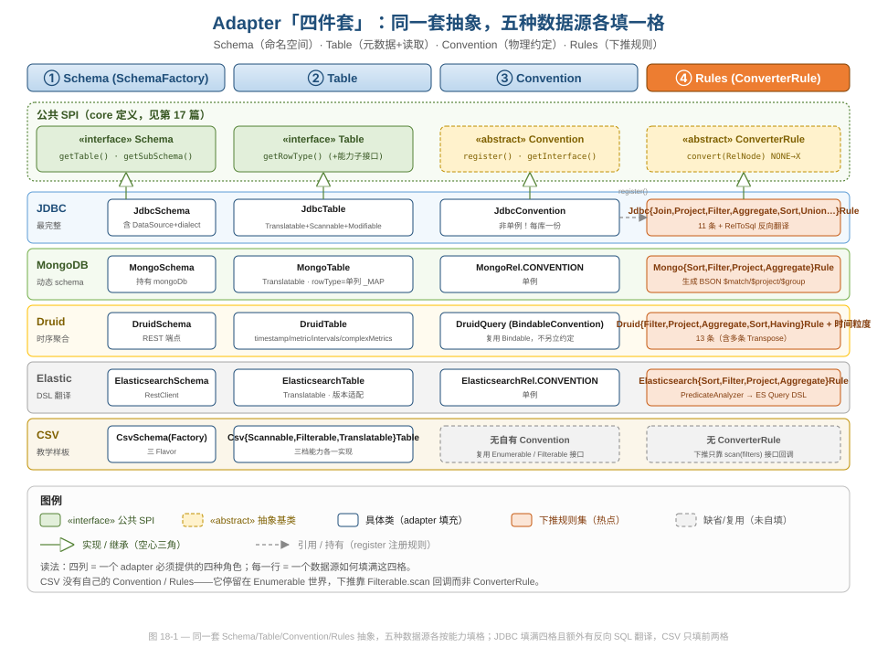
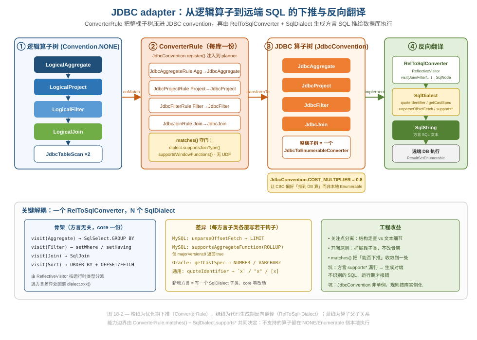
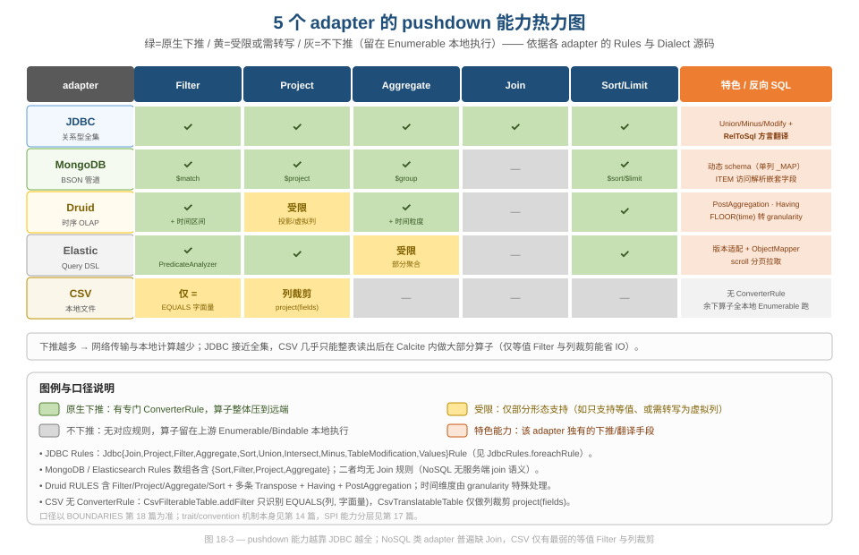

# 第 18 篇 · Adapter 生态对比（数据工程视角）

> Calcite 凭什么能把 MySQL、MongoDB、Druid、Elasticsearch、一个本地 CSV 文件，统统当成可以 `JOIN` 在一起的"表"？答案不是某个魔法类，而是一套被五个数据源反复填充的「四件套」模式，外加一套把关系代数反向翻译成方言 SQL 的体系。本篇从数据工程视角横向对比这五个 adapter，把"下推能力的边界在哪、为什么这么切、踩了会怎样"讲清楚。
> 基线 commit `111030383` · 前置阅读：[第 17 篇 · 扩展性架构：Schema SPI 能力分层](17-extensibility.md)、[第 14 篇 · Trait/Convention](14-trait-convention.md)

## TL;DR（要点速览）

- **四件套是 adapter 的统一骨架**：`Schema`（命名空间 + 连接）、`Table`（元数据 + 读取）、`Convention`（物理约定）、`Rules`（下推用的 `ConverterRule`）。五个数据源各按自己的能力填这四格，多填多得、少填也能跑。
- **下推能力是一条光谱，不是开关**。JDBC 几乎填满（Filter/Project/Aggregate/Join/Sort/Union/Minus/Modify），MongoDB/ES 各支持 Filter/Project/Aggregate/Sort 但**没有 Join**，Druid 偏时序聚合，CSV 只有最弱的等值 Filter + 列裁剪。
- **JDBC adapter 独有"反向翻译"**：`RelToSqlConverter`（一个 `ReflectiveVisitor`）把 `RelNode` 子树重新拼成 `SqlNode`，再交给 `SqlDialect` 输出方言文本。**骨架一份、方言 N 份**是这里最值得抄的解耦。
- **能力边界由两道闸门共同决定**：`ConverterRule.matches()`（语法/算子层面能否转）+ `SqlDialect.supports*()`（目标库能否执行）。任何一道说"不"，算子就留在本地 Enumerable 侧执行。
- **坑**：`JdbcConvention` 是全系列**唯一非单例**的 convention（每个库一份实例），规则必须在 planning 开始时按库实例化；MongoDB 把整张表建模成单列 `_MAP`，灵活但放弃了静态类型检查；`SqlDialect.supports*` 漏判会生成对端不认的 SQL，运行期才炸。

---

## 1. 四件套：一套抽象，五种填法

Calcite 的 adapter 没有"基类继承一切"的上帝类，它走的是**按角色拆接口**的路子。要接入一个新数据源，你需要提供四种角色的实现，业内常戏称"四件套"：

| 角色 | 职责 | 公共 SPI（core 定义，见[第 17 篇](17-extensibility.md)） |
|---|---|---|
| ① Schema | 命名空间，持有连接/数据源，列出表 | `Schema` / `SchemaFactory` |
| ② Table | 暴露 `rowType` 元数据 + 读取数据 | `Table` 及其能力子接口 |
| ③ Convention | 物理执行约定，作为下推的"目的地" | `Convention`（见[第 14 篇](14-trait-convention.md)） |
| ④ Rules | `ConverterRule`，把逻辑算子转成本约定 | `ConverterRule` |

注意：四件套里只有前两件是**接入数据源的必选项**——只要实现 `Schema` + 一个 `ScannableTable`，Calcite 就能把整表读出来在内存里跑完所有算子。后两件（Convention + Rules）是**性能选项**：有了它们，算子才能"下推"到数据源那边算，省去网络传输和本地计算。CSV adapter 就只填了前两件。

下图把五个代表性 adapter 摆成一张表：四列是四种角色，五行是五个数据源，一眼能看出谁填满了、谁留白了。



读图要点：

- **公共 SPI 在最上面一排**（绿色 interface + 黄色 abstract），是 core 定义的契约；下面每一行是某个 adapter 对这四格的具体填充。
- **JDBC 行填满四格**，而且 Rules 那格最重——11 条 `ConverterRule` 加上独有的反向 SQL 翻译。
- **CSV 行只填了前两格**，Convention 和 Rules 是灰色虚线"复用/未自填"——它停留在 Enumerable 世界。

这套设计的工程价值（**软件工程视角**）在于：**接入成本与你想要的优化程度成正比，而不是一刀切**。想快速验证一个数据源？实现 `ScannableTable` 半小时搞定。想要生产级下推？再补 Convention + Rules。这种"渐进式投入"对数据平台团队极友好——你可以先让一个冷门数据源"能查"，再慢慢让它"查得快"。

### 1.1 Schema 这一格：声明式装配 + 连接持有

四件套的入口是 `SchemaFactory`，它把"如何从一段配置造出一个 Schema"标准化为一个方法。CSV 的工厂是最干净的示范（`example/csv/src/main/java/org/apache/calcite/adapter/csv/CsvSchemaFactory.java:42-58`）：

```java
@Override public Schema create(SchemaPlus parentSchema, String name,
    Map<String, Object> operand) {
  final String directory = (String) operand.get("directory");
  // ...
  String flavorName = (String) operand.get("flavor");
  CsvTable.Flavor flavor = flavorName == null ? CsvTable.Flavor.SCANNABLE
      : CsvTable.Flavor.valueOf(flavorName.toUpperCase(Locale.ROOT));
  return new CsvSchema(directoryFile, flavor);
}
```

注意那个 `Map<String, Object> operand`——它来自 JSON model 文件里的声明式配置。一段 `"operand": { "directory": "sales", "flavor": "translatable" }` 就能装配出一个 Schema，**无需写任何 Java 代码**。`flavor` 这个开关尤其有教学意味：同一份 CSV，配 `SCANNABLE`/`FILTERABLE`/`TRANSLATABLE` 三种 flavor，就分别得到第 2 节里那三档能力的 Table。这是"配置驱动能力档位"的最小可运行示范。

JDBC 的 `JdbcSchema`（`core/src/main/java/org/apache/calcite/adapter/jdbc/JdbcSchema.java:83`）则多了一个关键身份——它 `implements Schema, Wrapper`，通过 `unwrap(Class)` 暴露底层 `DataSource`（`JdbcSchema.java:495-502`）；而表级的方言则由 `JdbcTable.unwrap` 暴露 `SqlDialect`（`JdbcTable.java:109-117`）。`Wrapper.unwrap` 是 adapter 向 core 反向暴露"私货"的标准通道（`Wrapper` 机制归[第 17 篇](17-extensibility.md)）：core 的代码生成阶段正是靠 `unwrap` 拿到 `DataSource` 才能在运行时连库取数。Schema 不只是"表的容器"，它还是**连接与方言的持有者**，这也是为什么 `JdbcConvention` 必须按库实例化——每个 `JdbcSchema` 各持一份连接（其 `dialect` 字段也在此，见 `JdbcSchema.java:89`）。

---

## 2. Table 这一格：能力差异的第一现场

四件套里 Table 这一格最能体现"同一抽象、不同填法"。我们对照三种典型填法。

### 2.1 JDBC：一张表同时实现三种能力

`core/src/main/java/org/apache/calcite/adapter/jdbc/JdbcTable.java:79-80`：

```java
public class JdbcTable extends AbstractQueryableTable
    implements TranslatableTable, ScannableTable, ModifiableTable {
```

一口气实现了三个能力接口（能力分层本身归[第 17 篇](17-extensibility.md)，这里只看 adapter 怎么用）：
- `ScannableTable.scan()` —— 兜底：直接 `SELECT *` 读全表（`JdbcTable.java:187`）。
- `TranslatableTable.toRel()` —— 接入优化器：返回 `JdbcTableScan`，把表带进 `JdbcConvention`，从而让 Rules 能在它上面下推（`JdbcTable.java:176`）。
- `ModifiableTable` —— 支持 `INSERT/UPDATE/DELETE` 下推。

最值得玩味的是 `scan()` 兜底路径里那段 `generateSql()`（`JdbcTable.java:149-160`）:

```java
SqlString generateSql() {
  final SqlNodeList selectList = SqlNodeList.SINGLETON_STAR;
  SqlSelect node = new SqlSelect(SqlParserPos.ZERO, ...);
  final SqlWriterConfig config = SqlPrettyWriter.config()
      .withAlwaysUseParentheses(true)
      .withDialect(jdbcSchema.dialect);   // ← 方言在这里就介入了
  final SqlPrettyWriter writer = new SqlPrettyWriter(config);
  node.unparse(writer, 0, 0);
  return writer.toSqlString();
}
```

哪怕是最朴素的"读全表"，JDBC adapter 也走的是"构造 `SqlNode` → 按方言 unparse → 得到 SQL 文本"这条管线。这为第 3 节的反向翻译埋下了伏笔：**JDBC adapter 本质上是个 SQL 生成器**。

### 2.2 MongoDB：把整张表建模成一个 `_MAP` 列

MongoDB 是文档型库，没有固定列。它的 `getRowType` 极有意思（`mongodb/src/main/java/org/apache/calcite/adapter/mongodb/MongoTable.java:67-74`）：

```java
@Override public RelDataType getRowType(RelDataTypeFactory typeFactory) {
  final RelDataType mapType =
      typeFactory.createMapType(
          typeFactory.createSqlType(SqlTypeName.VARCHAR),
          typeFactory.createTypeWithNullability(
              typeFactory.createSqlType(SqlTypeName.ANY), true));
  return typeFactory.builder().add("_MAP", mapType).build();
}
```

整张表对 Calcite 而言就是**一列**，名叫 `_MAP`，类型是 `MAP<VARCHAR, ANY>`。具体字段在查询里通过 `_MAP['city']` 这种 `ITEM` 表达式访问，由 `MongoRules` 在下推时解析成 BSON 字段路径。

这是个典型的**数据工程权衡**：
- **好在哪**：零 schema 维护成本，文档库新增字段不用改任何元数据；天然适配 schema-less 数据。
- **代价/坑**：放弃了静态类型检查与列裁剪的天然支持，`SELECT *` 的语义被推迟到运行期；优化器对单列结构能做的代价估算也很有限。这不是 bug，而是文档库特性逼出来的设计——但用的人要清楚自己失去了什么。

### 2.3 Druid：把"时序"这件事编进 Table 元数据

Druid 是时序 OLAP，它的 Table 携带了关系型表完全没有的维度信息（`druid/src/main/java/org/apache/calcite/adapter/druid/DruidTable.java:63-74`）：

```java
public static final String DEFAULT_TIMESTAMP_COLUMN = "__time";
// ...
final ImmutableSet<String> metricFieldNames;   // 哪些列是「指标」
final ImmutableList<Interval> intervals;        // 默认时间区间
final String timestampFieldName;                // 时间列名
final ImmutableMap<String, List<ComplexMetric>> complexMetrics;  // thetaSketch/hyperUnique
```

`metricFieldNames`（哪些字段是可聚合指标）、`timestampFieldName`（时间主轴）、`intervals`（默认时间窗）、`complexMetrics`（近似聚合的草图列）——这些都是为了让 `DruidRules` 在下推聚合时能区分"维度"和"指标"、能把 `FLOOR(__time TO DAY)` 翻译成 Druid 的时间 granularity。**Table 不只是"列的集合"，它是 adapter 与优化器之间的契约载体**：你想下推什么，就得在 Table 里备好对应的元数据。

> 小结（**设计与代码质量**）：三种填法说明 `Table` 接口的克制——它只规定 `getRowType()`，把"如何描述自己"完全交给 adapter。这种"接口窄、实现宽"的设计让 Calcite 能容纳从关系型到文档型到时序型的迥异数据模型，而 core 一行不用改。

### 2.4 toRel：Table 与优化器的接驳口

三种 `Table` 还有一个共同动作：`toRel()`，把自己变成一个带"目的地约定"的 `TableScan`，这是后续下推的起点。对比三家的 `toRel`：

```java
// JdbcTable.java:176 —— 带进 jdbcSchema.convention（每库一份的非单例）
return new JdbcTableScan(context.getCluster(), context.getTableHints(),
    relOptTable, this, jdbcSchema.convention);

// MongoTable.java:81 —— 带进 MongoRel.CONVENTION（单例）
return new MongoTableScan(cluster, cluster.traitSetOf(MongoRel.CONVENTION),
    relOptTable, this, null);

// CsvTranslatableTable.java:88 —— 留在默认（无自有 convention）
return new CsvTableScan(context.getCluster(), relOptTable, this, fields);
```

差别一眼可见：JDBC/MongoDB 的 `TableScan` 在创建时就声明了自己属于某个 adapter convention，于是 planner 里那一族 `ConverterRule` 才有"靶子"可匹配；CSV 的 `CsvTableScan` 没有专属 convention，它后续只能走 Enumerable 通用规则 + `FilterableTable` 回调。**`toRel()` 返回的 trait，决定了这张表能享受多少下推**——这是四件套里 Table 与 Convention/Rules 两格的接缝。

---

## 3. JDBC 的杀手锏：把 RelNode 反向翻译成方言 SQL

前面铺垫的"JDBC adapter 是 SQL 生成器"，在这一节兑现。这是 JDBC adapter 区别于其他所有 adapter 的核心能力，也是数据工程里最值得学的一段代码。

### 3.1 下推：ConverterRule 把整棵子树压进 JDBC convention

下推的起点是 `JdbcConvention`。它有个反直觉的设计——**全系列唯一的非单例 convention**（`JdbcConvention.java:34, 44-47`）：

```java
public class JdbcConvention extends Convention.Impl {
  /** Cost of a JDBC node versus implementing an equivalent node in a "typical"
   * calling convention. */
  public static final double COST_MULTIPLIER = 0.8d;
  public final SqlDialect dialect;
  // ...
}
```

注释里写得明白："This is the only convention, thus far, that is not a singleton."——因为每个 JDBC 库各有自己的 `dialect` 和 `DataSource`，所以每接一个库就要 new 一个 `JdbcConvention` 实例，对应的 `ConverterRule` 也要按库实例化。这是个**值得记住的坑**：如果你以为 convention 都是单例去做缓存或 `==` 比较，遇到 JDBC 就会出错。

`COST_MULTIPLIER = 0.8` 也很关键：它告诉 CBO，"在数据库里算"比"在本地 Enumerable 里算"便宜 20%，于是优化器会**主动偏好把算子推下去**。代价模型本身归[第 13 篇](13-metadata-cost.md)，这里只看它在 adapter 里的用法。

注册规则在 `register()`（`JdbcConvention.java:64-70`）里完成，规则清单在 `JdbcRules.foreachRule`（`JdbcRules.java:242-255`）：

```java
private static void foreachRule(JdbcConvention out, Consumer<RelRule<?>> consumer) {
  consumer.accept(JdbcToEnumerableConverterRule.create(out));
  consumer.accept(JdbcJoinRule.create(out));
  consumer.accept(JdbcProjectRule.create(out));
  consumer.accept(JdbcFilterRule.create(out));
  consumer.accept(JdbcAggregateRule.create(out));
  consumer.accept(JdbcSortRule.create(out));
  consumer.accept(JdbcUnionRule.create(out));
  consumer.accept(JdbcIntersectRule.create(out));
  consumer.accept(JdbcMinusRule.create(out));
  consumer.accept(JdbcTableModificationRule.create(out));
  consumer.accept(JdbcValuesRule.create(out));
}
```

这 11 条规则就是 JDBC 的下推能力清单。每条 `ConverterRule` 把一个逻辑算子（`Convention.NONE`）转成对应的 `Jdbc*` 物理算子。整个流程见下图。



图里橙线是优化期的下推（`onMatch` → `transformTo`），绿线是代码生成期的反向翻译（`implement` → `RelToSqlConverter` → `SqlDialect`）。注意整棵 `Jdbc*` 子树最终被一个 `JdbcToEnumerableConverter` 包住——它就是"把子树整体翻译成一条 SQL、发给数据库、把结果当成 Enumerable 流回来"的边界节点。

### 3.2 matches()：下推的第一道闸门

不是所有 Join 都能推下去。`JdbcJoinRule.matches()` 和 `JdbcProjectRule.create()` 里藏着精细的守门逻辑（`JdbcRules.java:373-377`、`491-502`）：

```java
// JdbcJoinRule.matches —— 目标库支持这种 join 类型吗？
@Override public boolean matches(RelOptRuleCall call) {
  Join join = call.rel(0);
  JoinRelType joinType = join.getJoinType();
  return ((JdbcConvention) getOutConvention()).dialect.supportsJoinType(joinType);
}

// JdbcProjectRule.create —— 含窗口函数但方言不支持？含 UDF？都不推
.withConversion(Project.class, project ->
        (out.dialect.supportsWindowFunctions() || !project.containsOver())
            && !userDefinedFunctionInProject(project),
    Convention.NONE, out, "JdbcProjectRule")
```

而 `JdbcJoinRule.canJoinOnCondition()`（`JdbcRules.java:337-371`）还会递归检查 join 条件里的每个算子是否可翻译——半连接/反连接（SEMI/ANTI）直接拒绝下推（`JdbcRules.java:279-289`），因为它们的列数与普通 join 不同，没法稳妥地转成标准 SQL。

**这是边界设计的精髓**：能不能下推，不取决于"算子是不是 Join"，而取决于"这个具体的 Join，目标库的方言能不能执行"。把判断收敛在 `matches()` + `dialect.supports*()` 两处，让能力边界**可声明、可测试、可逐库微调**。

### 3.3 反向翻译：一个 ReflectiveVisitor + N 个 Dialect

子树最终要变回 SQL 文本，靠的是 `RelToSqlConverter`。它是个 `ReflectiveVisitor`（`core/src/main/java/org/apache/calcite/rel/rel2sql/RelToSqlConverter.java:134-153`）：

```java
public class RelToSqlConverter extends SqlImplementor
    implements ReflectiveVisitor {
  private final ReflectUtil.MethodDispatcher<Result> dispatcher;

  public RelToSqlConverter(SqlDialect dialect) {
    super(dialect);
    dispatcher =
        ReflectUtil.createMethodDispatcher(Result.class, this, "visit",
            RelNode.class);
  }
  protected Result dispatch(RelNode e) {
    return dispatcher.invoke(e);
  }
```

它为每种算子写了一个 `visit` 重载——`visit(Join)`、`visit(Filter)`、`visit(Aggregate)`、`visit(Sort)` 等约 20 个（`RelToSqlConverter.java:295` 起）。运行时由反射 `MethodDispatcher` 按 `RelNode` 的实际类型分派到最匹配的重载（Visitor 三层对照归[第 19 篇](19-design-patterns.md)，这里只看本层用法）。例如 `visit(Filter)`（`RelToSqlConverter.java:551-591`）会判断输入是不是 `Aggregate`，是则生成 `HAVING`，否则生成 `WHERE`：

```java
public Result visit(Filter e) {
  final RelNode input = e.getInput();
  if (input instanceof Aggregate) {
    // ... setHaving(...)
  } else {
    // ... builder.setWhere(builder.context.toSql(null, e.getCondition()));
  }
}
```

**关键的解耦在于：`RelToSqlConverter` 这套 `visit` 骨架完全是方言无关的**。它只管"`Aggregate` 该生成 `GROUP BY`、`Sort` 该生成 `ORDER BY`"这种结构走查；一旦遇到方言细节（标识符怎么引号、`LIMIT` 还是 `FETCH`、`CAST` 成什么类型名），就回调 `SqlDialect` 的钩子方法。

`SqlDialect` 的钩子族（`core/src/main/java/org/apache/calcite/sql/SqlDialect.java`）非常丰富：
- `quoteIdentifier()`（`SqlDialect.java:362`）—— MySQL 用 `` `x` ``、标准 SQL 用 `"x"`、SQL Server 用 `[x]`。
- `supportsAggregateFunction(SqlKind)`（`SqlDialect.java:762`）—— 默认只认 COUNT/SUM/MIN/MAX。
- `supportsWindowFunctions()` / `supportsJoinType()` / `supportsOffsetFetch()` 等一长串能力探针。
- `getCastSpec()` / `unparseCall()`（`SqlDialect.java:448`）—— 自定义类型名与算子写法。

具体方言只覆写自己不一样的那几个。看 `MysqlSqlDialect`（`core/src/main/java/org/apache/calcite/sql/dialect/MysqlSqlDialect.java:138-165`）：

```java
@Override public void unparseOffsetFetch(SqlWriter writer, ... ) {
  unparseFetchUsingLimit(writer, offset, fetch);   // MySQL 用 LIMIT，不用 OFFSET/FETCH
}

@Override public boolean supportsAggregateFunction(SqlKind kind) {
  switch (kind) {
  case COUNT: case SUM: case SUM0: case MIN: case MAX: case SINGLE_VALUE:
    return true;
  case ROLLUP:
    // MySQL 5 只支持 "GROUP BY x WITH ROLLUP"，标准 ROLLUP(x,y) 要 8.0+
    return majorVersion >= 8;
  default:
    return false;
  }
}
```

注意 `ROLLUP` 那一支——连**版本差异**（MySQL 5 vs 8）都被收进了同一个钩子里。这就是"骨架一份、方言 N 份"的威力：**新增一个方言 = 写一个 `SqlDialect` 子类覆写若干钩子，core 与 `RelToSqlConverter` 零改动**，完美的开闭原则。

> **数据工程视角**：这套 RelToSql + Dialect 体系是 Calcite 做"联邦查询 / 查询联邦化"的地基——它能把一段标准 SQL 改写成 Oracle、PostgreSQL、BigQuery 等各家方言，这也是为什么很多查询加速/数据虚拟化产品直接复用 Calcite 的 `RelToSqlConverter`。联邦查询本质归[第 14 篇](14-trait-convention.md)，这里给的是它在 JDBC adapter 上的具体落地。

---

## 4. 光谱的另一端：CSV 只有最弱的下推

把 JDBC 看完，再看 CSV，对比格外鲜明。CSV adapter 是 Calcite 的教学样板，它**没有 Convention、没有 ConverterRule**，下推完全靠 `FilterableTable` 接口回调。

`CsvFilterableTable.scan()`（`example/csv/src/main/java/org/apache/calcite/adapter/csv/CsvFilterableTable.java:59-72`）：

```java
@Override public Enumerable<@Nullable Object[]> scan(DataContext root, List<RexNode> filters) {
  // ...
  final @Nullable String[] filterValues = new String[fieldTypes.size()];
  filters.removeIf(filter -> addFilter(filter, filterValues));   // ← 处理过的 filter 从 list 里删掉
  // ...
}
```

`scan` 收到一个**可变的** `filters` 列表，能处理的就 `removeIf` 删掉（表示"这个我接管了"），剩下的留给 Calcite 在本地执行。它能处理什么？看 `addFilter`（`CsvFilterableTable.java:74-96`）：

```java
private static boolean addFilter(RexNode filter, @Nullable Object[] filterValues) {
  if (filter.isA(SqlKind.AND)) {
    ((RexCall) filter).getOperands().forEach(subFilter -> addFilter(subFilter, filterValues));
  } else if (filter.isA(SqlKind.EQUALS)) {
    final RexCall call = (RexCall) filter;
    RexNode left = call.getOperands().get(0);
    if (left.isA(SqlKind.CAST)) { left = ((RexCall) left).operands.get(0); }
    final RexNode right = call.getOperands().get(1);
    if (left instanceof RexInputRef && right instanceof RexLiteral) {
      // 只支持「列 = 字面量」
      final int index = ((RexInputRef) left).getIndex();
      // ...
      return true;
    }
  }
  return false;
}
```

CSV 的下推能力就这么点：**只认 `列 = 字面量` 的等值过滤**（外加 `AND` 展开）。范围比较、`OR`、函数调用——一律 `return false`，留给上游处理。列裁剪（projection pushdown）则由另一个 `CsvTranslatableTable.project(fields)`（`CsvTranslatableTable.java:59-72`）实现。

这种"可变 list + `removeIf`"的协议（**设计与代码质量视角**）很聪明：它用一个**可变集合的所有权转移**来表达"哪些工作 adapter 接管了、哪些还得 Calcite 兜底"，比"返回 boolean 全有或全无"灵活得多。代价是这个可变 list 协议有点反直觉——源码里那条注释就警告：不能 `refine`（部分移除）`AND` 的操作数，否则 `TableScanNode.createFilterable` 的 filters 校验会失败（`CsvFilterableTable.java:75-77`）。这是个真实的坑：协议的灵活性是用"调用方必须遵守隐含约束"换来的。

### 4.1 两种"回到 Enumerable"的路径

值得注意的是，无论下推多少，最终结果都要变回一个 Calcite 能消费的数据流。这里有两条路径，正好对应"有没有自己的 Convention"：

- **有专属 Convention 的 adapter**（JDBC/MongoDB/ES）：在 convention 边界放一个 `*ToEnumerableConverter` 节点（如 `JdbcToEnumerableConverter`），它的 `implement()` 负责把下推子树的产物（一条 SQL / 一段 BSON 管道 / 一段 ES DSL）发给远端、把返回结果包装成 `Enumerable`。下推子树内部用什么物理算子是 adapter 自家的事，对外只露出 Enumerable 这一个统一出口。
- **无专属 Convention 的 adapter**（CSV）：没有 converter 节点，直接由 `FilterableTable.scan` / `project` 返回 `AbstractEnumerable`，未被接管的算子由上游 Enumerable 算子继续处理。

Druid 又是一个有趣的特例——它**没有新立一个 `DruidConvention`，而是复用了 `BindableConvention`**（`DruidTable` 引入 `interpreter.BindableConvention`）。也就是说 Druid 把下推结果接到 Interpreter 后备引擎而非 Enumerable codegen 上。这说明 Convention 这一格不是非自创不可：**能复用就复用**，少一个 convention 就少一份转换图维护成本（Convention 转换图机制见[第 14 篇](14-trait-convention.md)）。

> **数据工程视角**：这条"回到 Enumerable/Bindable"的边界，正是 Calcite 联邦查询能跨源 `JOIN` 的物理基础——两个不同数据源各自下推到自己的边界节点产出 Enumerable 流，再在 Calcite 内部用一个 Enumerable join 把它们拼起来。无存储引擎不需要自己存数据，但必须有这么一个统一的"结果流抽象"作为各源汇合点。

---

## 5. 横向对比：pushdown 能力矩阵

把五个 adapter 的下推能力摊成一张热力图，光谱关系一目了然。



口径说明（全部来自源码，非估计）：

- **JDBC**：`JdbcRules.foreachRule` 列出 Filter/Project/Aggregate/Join/Sort/Union/Intersect/Minus/TableModification/Values，是唯一支持 Join 与 DML 下推的 adapter，且独有 RelToSql 反向方言翻译。
- **MongoDB**：`MongoRules.RULES` 数组 = `{Sort, Filter, Project, Aggregate}`（`MongoRules.java:67-72`），分别生成 BSON `$sort/$match/$project/$group`。**无 Join 规则**。
- **Elasticsearch**：`ElasticsearchRules.RULES` = `{Sort, Filter, Project, Aggregate}`（`ElasticsearchRules.java:58-63`），Filter 经 `PredicateAnalyzer` 翻成 ES Query DSL；聚合受限于 ES 的能力，部分形态不下推。**无 Join 规则**。
- **Druid**：`DruidRules.RULES`（`DruidRules.java:156-169`）含 Filter/Project/Aggregate/Sort + 多条 Transpose + Having + PostAggregation；时间维度由 granularity 特殊处理，是聚合能力最复杂的一个。**无 Join 规则**。
- **CSV**：无 `ConverterRule`，仅 `CsvFilterableTable.addFilter` 的等值 Filter + `CsvTranslatableTable.project` 的列裁剪。

一个值得点出的**结构性规律**：NoSQL 类 adapter（MongoDB/ES/Druid）**普遍没有 Join 下推**。原因不是偷懒，而是这些引擎本身就没有服务端 join 语义——多表关联只能拉回 Calcite 用 Enumerable join 来做。这恰恰反向印证了 Calcite "无存储 + 可下推可兜底"架构的价值：**能推的推下去省 IO，推不动的本地补上保证语义完整**，两端都不丢。

### 5.1 为什么"绿格越多"对数据平台越重要

把这张矩阵翻译成数据工程的语言：每一个绿格，意味着一类算子可以在**离数据最近的地方**执行，从而砍掉一段网络传输和一段本地内存计算。

- **Filter 下推**最值钱：它在源头就减少行数，下游所有算子的输入都变小。这也是为什么连最弱的 CSV 都要支持等值 Filter——哪怕只能省一点 IO，也是 cache-friendly 的第一刀。
- **Aggregate 下推**对 OLAP 类源（Druid/ES）尤其关键：把 `GROUP BY ... COUNT(*)` 推到对端，回传的是聚合后的几十行而非原始的几亿行，数量级的差距。
- **Join 不下推**是 NoSQL 源的硬约束：用这些源做多表关联时，要清醒地知道关联发生在 Calcite 进程内存里——选择驱动表、控制回传行数、必要时先各自聚合再 join，都是使用者要主动做的优化，框架替不了。

### 5.2 边界判定踩坑清单

下推这件事最隐蔽的坑，是**"以为推下去了，其实没有"或"推了但对端不认"**：

- `ConverterRule.matches()` 返回 `false` 时算子**静默**留在本地——没有报错、没有警告，只在 `EXPLAIN PLAN` 里看得出某个算子还在 `Logical*`/`Enumerable*` 而非 `Jdbc*`。养成查执行计划的习惯，是验证下推是否生效的唯一可靠手段。
- `SqlDialect.supports*()` 判断**过于乐观**会生成对端不识别的 SQL，错误推迟到运行期才暴露；判断**过于保守**则白白丧失下推机会。两边都不好，所以 `RelToSqlConverterTest` 里对每个方言都有大量 golden-file 用例兜底（测试体系见[第 20 篇](20-quality-and-modules.md)）。
- CSV 的可变 `filters` list 协议（第 4 节）是另一类坑：协议靠纪律而非类型系统保证，新写 `FilterableTable` 时极易违反"AND 操作数不可部分移除"的隐含约束。

> 一句话总结这张矩阵的设计哲学：**Calcite 不强求每个 adapter 都"全能"，而是让每个 adapter 诚实地声明自己能做什么，剩下的由统一的 Enumerable 兜底**。能力的不均衡被显式建模、可被优化器感知，而不是藏起来假装一致——这正是"无存储联邦引擎"区别于"伪装成数据库的胶水层"的根本。

---

## 设计模式与工程小结

| 模式 / 手法 | 出现位置 | 解决什么 / 工程价值 |
|---|---|---|
| 四件套（角色拆接口） | `Schema`/`Table`/`Convention`/`Rules` | 接入成本与优化程度成正比，渐进式投入 |
| Template Method | `ConverterRule.convert()`，各 `Jdbc*Rule` 填充 | 转换骨架固定，差异点下放子类 |
| Reflective Visitor | `RelToSqlConverter` 的 `visit(Xxx)` 重载 + `MethodDispatcher` | 按运行时类型分派，新增算子加一个重载即可 |
| Strategy（方言策略） | `SqlDialect` + 各 `*SqlDialect` 子类 | 骨架一份、方言 N 份；新方言不改 core（开闭） |
| 能力探针（capability probe） | `dialect.supports*()` + `rule.matches()` | 把"能否下推"收敛成可声明、可测的两道闸门 |
| 所有权转移协议 | `CsvFilterableTable.scan` 的可变 `filters` + `removeIf` | 表达"部分下推"，比全有全无灵活 |
| Cost 引导下推 | `JdbcConvention.COST_MULTIPLIER = 0.8` | 让 CBO 自动偏好"推到数据源算" |

负面教训（如实记录）：

- **`JdbcConvention` 非单例**是全系列特例，按库实例化规则；任何"convention 必单例"的假设遇 JDBC 失效。
- **MongoDB 的 `_MAP` 单列建模**牺牲静态类型与列裁剪，把 schema 问题推迟到运行期。
- **`SqlDialect.supports*` 漏判**会生成对端不识别的 SQL，运行期才报错——方言适配的测试覆盖必须跟上（参见 `RelToSqlConverterTest`）。
- **CSV 可变 list 协议的隐含约束**（不能部分移除 `AND` 操作数）写在注释里，靠纪律保证，容易踩。

---

## 对照阅读建议（动手）

- **断点**：`example/csv/src/main/java/org/apache/calcite/adapter/csv/CsvFilterableTable.java` → `CsvFilterableTable#addFilter`
  - **观察**：`SELECT * FROM EMPS WHERE name = 'Fred' AND age > 30` 进来时，`filterValues` 数组只被等值条件填充；`age > 30` 这条 `filter` 是否**没有**被 `removeIf` 删掉（即返回 `false`，留给 Calcite 本地执行）。
  - **运行**：`./gradlew :example:csv:test --tests org.apache.calcite.adapter.csv.CsvTest`（关注带 filter 的用例）。

- **断点**：`core/src/main/java/org/apache/calcite/rel/rel2sql/RelToSqlConverter.java` → `RelToSqlConverter#visit(Filter)`
  - **观察**：输入是 `Aggregate` 时走 `setHaving`、否则走 `setWhere`；换一个 `dialect`（MySQL vs Oracle）再跑，看 `quoteIdentifier` 与 `unparseOffsetFetch` 输出的差异。
  - **运行**：`./gradlew :core:test --tests org.apache.calcite.rel.rel2sql.RelToSqlConverterTest`。

- **断点**：`core/src/main/java/org/apache/calcite/adapter/jdbc/JdbcRules.java` → `JdbcRules.JdbcJoinRule#matches`
  - **观察**：把 join 类型在 SEMI/ANTI 与 INNER 之间切换，看 `dialect.supportsJoinType()` 与 `canJoinOnCondition()` 如何决定能否下推；不能下推时 join 是否留在 `Convention.NONE` 侧。
  - **运行**：`./gradlew :core:test --tests org.apache.calcite.test.JdbcAdapterTest`。

---

## 延伸阅读

- 本系列：
  - [第 17 篇 · 扩展性架构：Schema SPI 能力分层](17-extensibility.md) —— 四件套里 Schema/Table 接口的定义与能力金字塔（本篇直接用，不重述接口）。
  - [第 14 篇 · Trait/Convention 与物理属性传播](14-trait-convention.md) —— Convention 转换图、联邦查询本质、`ConverterRule` 机制。
  - [第 13 篇 · 元数据与代价](13-metadata-cost.md) —— `COST_MULTIPLIER` 背后的代价模型。
  - [第 12 篇 · 规则体系](12-rules.md) —— `ConverterRule` / `RelRule.Config` / `matches()` 的通用机制。
  - [第 19 篇 · 设计模式全景](19-design-patterns.md) —— Reflective Visitor、Strategy、三层 Visitor 的模式视角归纳。
  - [第 20 篇 · 工程质量保障 + 全模块巡礼](20-quality-and-modules.md) —— arrow/cassandra/kafka/spark 等其余 adapter 的逐个短评。
- 官方文档：
  - `site/_docs/adapter.md` —— 各 adapter 配置与连接串。
  - `site/_docs/tutorial.md` —— CSV adapter 教学（四件套的最小可运行实例）。
  - `site/_docs/howto.md` —— 开发者指南。
