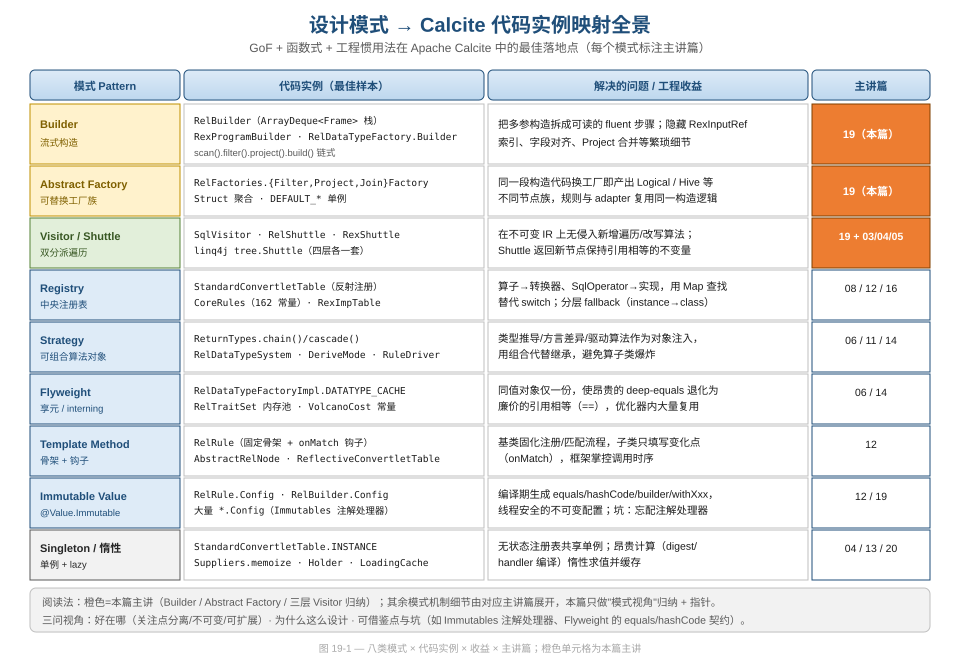
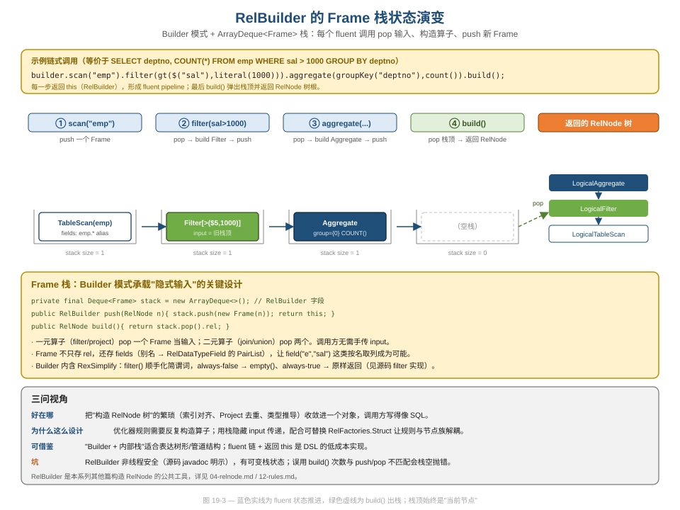
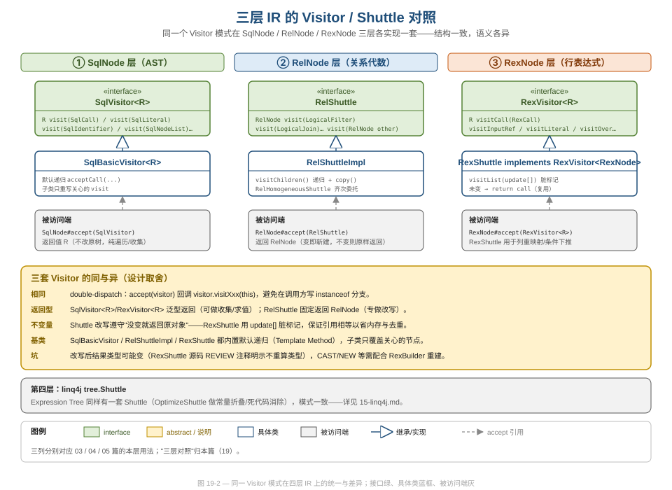

# 第 19 篇 · 设计模式全景

> 这一篇换一个"横切"的视角：不再沿着查询流水线纵向走，而是横向扫描整套代码，问一个问题——一个工业级 SQL 引擎到底用了哪些设计模式？它们各自解决了什么真实痛点？哪些写法值得抄进你自己的项目，哪些是踩过的坑？我们以 Builder / Abstract Factory / 三层 Visitor 为主讲，其余模式做"指针式"归纳。
> 基线 commit `111030383` · 前置阅读：第 02 篇（四层 IR）、第 04 篇（RelNode 不可变）、第 12 篇（规则体系）

## TL;DR（要点速览）

- Calcite 是一本"活的设计模式教科书"：`RelBuilder`（Builder）、`RelFactories`（Abstract Factory）、三层 `Visitor`/`Shuttle`、`StandardConvertletTable`/`CoreRules`（Registry）、`ReturnTypes`（Strategy）、`RelDataTypeFactoryImpl`（Flyweight）、`RelRule`（Template Method）、各种 `*.Config`（Immutable Value）。
- **模式不是为了炫技，而是为了治理复杂度**：不可变 IR + Visitor 让"加遍历算法"零侵入；可替换工厂让"同一段构造代码产出不同节点族"；Registry 把巨大的 `switch` 换成可扩展的 `Map`。
- **Builder（本篇主讲一）**：`RelBuilder` 用一个 `ArrayDeque<Frame>` 栈隐藏算子之间的 input 传递，把"构造 RelNode 树"写得像 SQL。代价是有可变状态、非线程安全。
- **Abstract Factory（本篇主讲二）**：`RelFactories` 的 `Struct` 把十几个工厂打包，`RelBuilder` 通过它在不改一行构造逻辑的前提下，让 `filter()` 产出 `LogicalFilter` 还是 `HiveFilter`。
- **三层 Visitor（本篇主讲三）**：`SqlVisitor` / `RelShuttle` / `RexShuttle` 结构一致、语义各异；`Shuttle` 系遵守"没变就返回原对象"的不变量，这是与不可变 IR 配合省内存、保证去重的关键。
- **single-owner 原则**：每个模式的机制细节归其主讲篇，本篇只做"模式视角"的归纳与对照。

---

## 1. 为什么用"模式视角"再扫一遍源码

前面 18 篇是"纵向"的：跟着一条 SQL 从 parse 到 codegen 走一遍。但当你真正读 Calcite 源码时会发现，无论翻到哪个包，总有几种"手法"反复出现——栈式 Builder、可替换工厂、Visitor 双分派、`Map` 注册表、不可变 `Config`。

这不是巧合。一个成熟的编译器/优化器，本质上是在**反复地构造、遍历、改写树形结构**，并且要求这些结构**不可变**（便于回溯、去重、并发）。这两个约束几乎"逼出"了一组固定的设计模式组合。换句话说，当你看到 Calcite 里某个模式反复出现时，更值得问的不是"它用了什么模式"，而是"什么样的底层约束让这个模式成了几乎必然的选择"——这才是能迁移到你自己系统里的真知。把它们单独拎出来看，能帮你回答三个工程问题：

1. **软件工程**：这些模式如何实现关注点分离、可扩展性、复杂度治理？
2. **数据工程**：它们如何支撑方言适配、pushdown、可插拔优化？
3. **设计与代码质量**：哪些是值得借鉴的范式，哪些是不得不接受的权衡甚至坑？

下图是本篇的"地图"：八类模式 × 代码实例 × 收益 × 主讲篇。橙色单元格是本篇要展开讲的三个；其余模式给出指针，机制细节去对应主讲篇。



读图要点：模式与"机制细节"是两件事。比如 Flyweight 的 interning 实现细节在第 06 篇（类型系统）和第 14 篇（TraitSet）里，本篇只负责把它们归纳为同一个模式、点出共同的工程收益（把昂贵的 deep-equals 退化为 `==`）。下面三节把橙色的三个模式逐一讲透。

需要先打一个预防针：本篇刻意不重讲任何模式的机制内幕——那是各主讲篇的职责（single-owner 原则）。本篇的增量价值是**横向归纳**：把散落在 `tools`、`rel.core`、`sql.type`、`plan` 等不同包里的代码，按"它们其实是同一个模式"重新组织一遍，让你建立"看到 `Deque<Frame>` 就想到 Builder""看到 `Interner` 就想到 Flyweight""看到 `chain/cascade` 就想到 Strategy"的条件反射。读完这一篇，再回头看任何一个 Calcite 模块，都会多一层"它在用哪个模式、为了治理什么复杂度"的视角。

---

## 2. Builder：RelBuilder 的栈式流式构造（主讲一）

### 2.1 问题：手搓 RelNode 树有多痛

逻辑算子树是手写的。如果不借助工具，构造 `SELECT deptno, COUNT(*) FROM emp WHERE sal > 1000 GROUP BY deptno` 对应的树，你要：先建 `LogicalTableScan`，再建 `LogicalFilter` 并手动把 scan 传进去当 input，再建 `LogicalAggregate` 把 filter 传进去……每一步都要手算 `RexInputRef` 的字段下标、对齐 rowType、必要时插 `Project` 去重。这是典型的"构造逻辑繁琐、参数多、易错"场景——正是 Builder 模式的用武之地。

`RelBuilder` 的类头就开宗明义（`core/src/main/java/org/apache/calcite/tools/RelBuilder.java:176-190`）：

```java
/**
 * Builder for relational expressions.
 *
 * <p>{@code RelBuilder} does not make possible anything that you could not
 * also accomplish by calling the factory methods ... But it makes common
 * tasks more straightforward and concise.
 * ...
 * <p>It is not thread-safe.
 */
@Value.Enclosing
public class RelBuilder {
  protected final RelOptCluster cluster;
  private final Deque<Frame> stack = new ArrayDeque<>();   // ← 核心：Frame 栈
```

注意最后一句 `It is not thread-safe`——这是 Builder 模式的固有代价（见 §2.4 的坑）。

### 2.2 核心机制：用一个栈隐藏"input 传递"

`RelBuilder` 最巧的设计是那个 `ArrayDeque<Frame>` 栈。所有 fluent 方法都遵守同一套约定：**pop 需要的输入 Frame → 构造算子 → push 新的 Frame**，并返回 `this` 以便链式调用。最小的两个端点是 `push` 和 `build`（`RelBuilder.java:367-398`）：

```java
public RelBuilder push(RelNode node) {
  stack.push(new Frame(node));
  return this;
}

public RelNode build() {
  return stack.pop().rel;   // 弹出栈顶，作为树根返回
}
```

一元算子 `filter` 的实现把这套约定演示得很清楚（`RelBuilder.java:1957-1962`）：

```java
final Frame frame = stack.pop();                       // 1. 取出当前输入
final RelNode filter =
    struct.filterFactory.createFilter(frame.rel,       // 2. 经工厂构造算子
        conjunctionPredicates, ImmutableSet.copyOf(variablesSet));
stack.push(new Frame(filter, frame.fields));           // 3. 压回新 Frame
return this;
```

调用方完全不需要手传 input——栈顶永远是"当前节点"。一元算子 pop 一个，二元算子（`join`/`union`）pop 两个。这套"栈顶即当前节点"的约定还衍生出一组只读辅助方法（`RelBuilder.java:400-432`），供算子构造时窥探输入而不破坏栈：

```java
public RelNode peek() {              // 看栈顶，不弹出
  return castNonNull(peek_()).rel;
}
public RelNode peek(int n) {         // 看从栈顶往下第 n 个（多输入算子用）
  return peek_(n).rel;
}
public RelNode peek(int inputCount, int inputOrdinal) {
  return peek_(inputCount, inputOrdinal).rel;   // join 时定位左/右输入
}
```

`peek(inputCount, inputOrdinal)` 是二元/多元算子的关键：构造 `join` 的条件时，需要知道"右表的某列在合并后行类型里的下标偏移"，它通过窥探栈上多个 Frame 来计算 `inputOffset`，调用方写 `builder.field(2, 1, "deptno")` 即可定位"两输入中第 1 个输入的 deptno 列"。**这再次体现 Builder 模式的价值：把"跨输入的字段下标计算"这种最容易写错的逻辑，藏进 Builder 内部。**

还有一个私有的 `replaceTop`（`RelBuilder.java:374-377`）用于"原地替换栈顶但保留字段命名"：

```java
private void replaceTop(RelNode node) {
  final Frame frame = stack.pop();
  stack.push(new Frame(node, frame.fields));   // 换 rel，留 fields
}
```

它在做等价改写（比如 `aggregate` 内部发现某个 `Project` 可以下沉合并）时被用到——保留 `frame.fields` 意味着改写不会丢失用户起的别名。下图把 `scan().filter().aggregate().build()` 这条链上栈的演变逐帧画了出来：



从图里能看出三件事：(1) 前三步栈深度始终是 1，因为一元算子"消费 1 个、产出 1 个"；(2) `build()` 是绿色虚线的"出栈"，把栈顶弹出当树根；(3) 返回的不是单个节点而是一整棵已经连好 input 的树。

### 2.3 Frame 不只是包装器：它携带"字段命名上下文"

如果 `Frame` 只存一个 `RelNode`，那 `RelBuilder` 就只是个语法糖。真正让它好用的是 `Frame` 同时缓存了"别名 → 字段"的映射（`RelBuilder.java:5145-5168`）：

```java
private static class Frame {
  final RelNode rel;
  final ImmutablePairList<ImmutableSet<String>, RelDataTypeField> fields;

  private Frame(RelNode rel) {
    String tableAlias = deriveAlias(rel);   // TableScan → 表名作别名
    ...
    for (RelDataTypeField field : rel.getRowType().getFieldList()) {
      fields.add(aliases, field);
    }
    ...
  }
}
```

正因为 `Frame` 记住了字段和别名，你才能写 `builder.field("e", "sal")` 这种按名取列的代码，而不必去数 `$5` 是第几列。**这是 Builder 模式承载"隐式上下文"的典型用法**：栈不仅传递树，还顺带传递了构造下一层时需要的元信息。

### 2.4 三问小结

- **好在哪（软件工程）**：把树形结构的繁琐构造收敛进一个对象，调用方代码可读性接近 SQL；规则（`RelRule`）里反复构造算子的场景因此大幅简化。
- **为什么这么设计**：优化器规则需要在 `onMatch` 里高频地重建子树。用栈隐藏 input 传递 + 内置 `RexSimplify`（`filter()` 会顺手化简谓词，恒假返回 `empty()`、恒真原样返回，见 `RelBuilder.java:1950-1955`），把样板代码降到最低。
- **坑（代码质量）**：`RelBuilder` 有可变栈状态、**非线程安全**（类 javadoc 明示）；`build()` 次数与 `push`/算子调用不匹配会导致栈空抛错。它适合"局部、单线程、用完即弃"的构造场景，不要把一个 `RelBuilder` 实例长期共享。

值得一提的是 `RelBuilder` 不是 Calcite 里唯一的 Builder——它代表的是一类设计取舍。`RexProgramBuilder` 用同样的 fluent 思路构造 `RexProgram`（行表达式 DAG，把公共子表达式提取成 `RexLocalRef` 共享，见 [第 05 篇](05-rexnode.md)）；`RelDataTypeFactory.Builder` 用流式 `add(name, type)` 构造结构类型。三者的共同点是：**目标对象（`RelNode` 树 / `RexProgram` / `RelDataType`）都不可变，构造过程都繁琐，于是都用一个可变的 Builder 把繁琐封起来、最后 `build()` 出一个不可变结果**。"可变 Builder 产出不可变对象"是贯穿整个 Calcite 的一致范式，认准它能帮你快速读懂任何一处构造代码。

---

## 3. Abstract Factory：RelFactories 让"同一段代码产出不同节点族"（主讲二）

### 3.1 问题：规则不该和具体节点类绑死

`RelBuilder.filter()` 上面调用的是 `struct.filterFactory.createFilter(...)`，而不是 `LogicalFilter.create(...)`。为什么多此一举？因为 Calcite 想做到：**同一段规则/构造代码，换一组工厂就能产出 `LogicalFilter`、`HiveFilter` 或任意自定义节点族**。这正是 Abstract Factory 模式的标准动机——"创建一系列相关对象，而不指定具体类"。

`RelFactories` 为每一类算子定义了一个工厂接口，例如 `FilterFactory`（`core/src/main/java/org/apache/calcite/rel/core/RelFactories.java:354-369`）：

```java
public interface FilterFactory {
  RelNode createFilter(RelNode input, RexNode condition,
      Set<CorrelationId> variablesSet);
}

private static class FilterFactoryImpl implements FilterFactory {
  @Override public RelNode createFilter(RelNode input, RexNode condition,
      Set<CorrelationId> variablesSet) {
    return LogicalFilter.create(input, condition,
        ImmutableSet.copyOf(variablesSet));   // 默认产出逻辑节点
  }
}
```

每个工厂都有一个 `DEFAULT_*` 单例（`RelFactories.java:82-135`），默认全部产出 `Logical*` 节点：

```java
public static final ProjectFactory DEFAULT_PROJECT_FACTORY = new ProjectFactoryImpl();
public static final FilterFactory  DEFAULT_FILTER_FACTORY  = new FilterFactoryImpl();
public static final JoinFactory    DEFAULT_JOIN_FACTORY    = new JoinFactoryImpl();
// … 共 20 个 DEFAULT_* 工厂
```

注意这些工厂接口的 javadoc 措辞——`ProjectFactory` 说它"can create a `LogicalProject` **of the appropriate type for this rule's calling convention**"。换言之，工厂的存在就是为了让"创建哪种 Convention 的节点"这件事可配置。`FilterFactory` 接口还体现了一个细节：它的 javadoc 提醒"某些 `Filter` 实现不支持相关变量，传入非空 `variablesSet` 会抛错"——工厂接口同时承担了"声明契约"的职责。

### 3.2 Struct：把十几个工厂打包成一个"工厂族"

单个工厂还不够——`RelBuilder` 要用到十几种算子。Calcite 用 `Struct` 把它们聚合成一个整体（`RelFactories.java:774-795`）：

```java
public static class Struct {
  public final FilterFactory filterFactory;
  public final ProjectFactory projectFactory;
  public final AggregateFactory aggregateFactory;
  public final JoinFactory joinFactory;
  ...                                       // 共 20 个工厂字段
}
```

`Struct` 就是 Abstract Factory 的"工厂族对象"。`RelBuilder` 持有一个 `struct` 字段，所有 `filter/project/join` 都委托给它。要把整套构造换成另一个节点族，只需替换 `struct`，**构造逻辑一行不改**。

为什么要打包成 `Struct`，而不是把 20 个工厂逐个作为参数传给 `RelBuilder`？两点考量：一是参数爆炸——20 个工厂逐个传递会让构造函数和每个 `proto`/`create` 重载都臃肿不堪；二是"族一致性"——这些工厂是配套使用的（一个 Hive 适配会同时换掉 Filter/Project/Join），用一个对象打包能保证它们成组替换、不会出现"Filter 是 Hive 的、Project 还是 Logical 的"这种半截子状态。`Struct` 把"一族相关对象"显式建模成一个类型，正是 Abstract Factory 的精髓。

更妙的是 `Struct.fromContext` 的逐字段降级（`RelFactories.java:840-852`）：

```java
public static Struct fromContext(Context context) {
  Struct struct = context.unwrap(Struct.class);
  if (struct != null) {
    return struct;                          // 上下文里有整族，直接用
  }
  return new Struct(
      context.maybeUnwrap(FilterFactory.class)
          .orElse(DEFAULT_FILTER_FACTORY),  // 否则逐个降级到默认
      context.maybeUnwrap(ProjectFactory.class)
          .orElse(DEFAULT_PROJECT_FACTORY),
      ...);
}
```

这是个值得抄的细节：**允许只覆盖工厂族里的某几个工厂，其余自动降级到默认**。Hive 适配只想换 `FilterFactory`，就不必重新提供另外 19 个。

### 3.3 与 Builder 协作：LOGICAL_BUILDER

Abstract Factory 与 Builder 在这里咬合：`RelFactories` 暴露一个用默认工厂族预配好的 `RelBuilderFactory`（`RelFactories.java:164-165`）：

```java
public static final RelBuilderFactory LOGICAL_BUILDER =
    RelBuilder.proto(Contexts.of(DEFAULT_STRUCT));
```

而 `RelRule.Config` 默认就用它（`core/src/main/java/org/apache/calcite/plan/RelRule.java:150-152`）：

```java
@Value.Default default RelBuilderFactory relBuilderFactory() {
  return RelFactories.LOGICAL_BUILDER;
}
```

于是整条链路串起来了：规则默认拿到一个"产出逻辑节点"的 `RelBuilder`；想让规则产出物理节点族，只需在 `Config` 里换一个 `RelBuilderFactory`——这就是 §3.1 那个"同一段代码、不同节点族"承诺的兑现处。

### 3.4 三问小结

- **好在哪（数据工程）**：adapter 与优化规则可以共享同一套构造/重写代码，却产出各自 Convention 下的节点，是 pushdown 与方言适配的底层支撑。
- **为什么这么设计**：Calcite 的规则数以百计（`CoreRules` 有 162 个常量），若每条规则都硬编码 `LogicalXxx.create`，就无法被复用到自定义节点体系上。工厂族把"创建"这件事抽象成可注入的依赖。
- **可借鉴**：当你有"一组必须配套使用的对象（一个工厂族）"且希望整族可替换时，用一个 `Struct` 把它们打包、并提供逐字段降级，比逐个传参优雅得多。

---

## 4. Visitor / Shuttle：三层 IR 各一套（主讲三）

### 4.1 为什么不可变 IR 几乎必然走向 Visitor

Calcite 的四层 IR（`SqlNode` / `RelNode` / `RexNode` / `Expression`，见 [第 02 篇](02-ir-overview.md)）都是不可变的。不可变意味着：你不能往节点类里随便加方法来实现新算法（每加一个就要改一遍所有子类，且污染数据类）。Visitor 模式正是为此而生——**把"遍历/改写算法"从"数据结构"里分离出去**，新增算法只需写一个新的 Visitor，不碰节点类。

Calcite 在三层 IR 上各实现了一套结构一致的 Visitor。下图把它们并排放在一起：



### 4.2 三套的"骨架"完全同构

最顶层都是一个泛型/特化接口，列出每类节点一个 `visit` 方法：

- `SqlVisitor<R>`（`core/src/main/java/org/apache/calcite/sql/util/SqlVisitor.java:45-102`）：`R visit(SqlCall)` / `visit(SqlLiteral)` / `visit(SqlIdentifier)` …
- `RelShuttle`（`core/src/main/java/org/apache/calcite/rel/RelShuttle.java:41-79`）：`RelNode visit(LogicalFilter)` / `visit(LogicalJoin)` … 兜底 `visit(RelNode other)`
- `RexVisitor<R>`，其改写子类 `RexShuttle implements RexVisitor<RexNode>`（`core/src/main/java/org/apache/calcite/rex/RexShuttle.java:38`）

每层都配一个内置默认递归的基类（Template Method），子类只覆盖关心的节点：`SqlBasicVisitor`（`SqlBasicVisitor.java:39`）、`RelShuttleImpl`（`RelShuttleImpl.java:50`）、以及 `RexShuttle` 自身。被访问端则是各 IR 的 `accept` 方法，构成经典的 **double-dispatch**：调用方 `node.accept(visitor)`，节点回调 `visitor.visitXxx(this)`，从而避免在调用方写一长串 `instanceof`。

为什么需要"双"分派？Java 的方法重载是**静态**绑定的——`visitor.visit(node)` 在编译期就按 `node` 的静态类型选重载，运行期是 `SqlCall` 还是 `SqlLiteral` 它分不清。Visitor 模式用两跳解决：第一跳靠 `node.accept(visitor)` 的虚方法分派确定"是哪种节点"（运行期多态），第二跳由该节点在自己的 `accept` 里显式调用 `visitor.visitXxx(this)`，此时 `this` 的静态类型已确定，重载也就选对了。`SqlVisitor` 还提供了一个 `default` 的便捷入口（`SqlVisitor.java:104-107`）：

```java
default R visitNode(SqlNode n) {
  return n.accept(this);   // 把"发起 accept"也收进接口
}
```

这是一个小而实用的设计：让调用方既能 `node.accept(visitor)`，也能 `visitor.visitNode(node)`，读起来更自然。`SqlBasicVisitor` 的默认实现把递归逻辑（`acceptCall` 遍历操作数）一并提供，于是子类"只写关心的节点"成为可能——这正是 Template Method 与 Visitor 的叠加。

### 4.3 关键差异：返回类型，以及 Shuttle 的"不变量"

三套同构，但有两处刻意的不同，值得细品：

**(1) 返回类型反映用途。** `SqlVisitor<R>` 和 `RexVisitor<R>` 是泛型返回——可以拿来做"收集"（返回 `List`）、"求值"（返回某个值）、或"改写"（返回新节点）。而 `RelShuttle` 固定返回 `RelNode`——它专为"改写"而生，名字里的 *Shuttle*（穿梭机）就暗示了"进去一棵树、出来一棵树"。

**(2) Shuttle 遵守"没变就返回原对象"的不变量。** 这是与不可变 IR 配合的精髓。看 `RexShuttle.visitCall` 怎么用一个 `update[]` 脏标记数组（`RexShuttle.java:118-130`）：

```java
@Override public RexNode visitCall(final RexCall call) {
  boolean[] update = {false};
  List<RexNode> clonedOperands = visitList(call.operands, update);
  if (update[0]) {
    return call.clone(call.getType(), clonedOperands);   // 变了才新建
  } else {
    return call;                                          // 没变就原样返回
  }
}
```

为什么要这么抠？因为 RexNode 大量参与 digest 去重和 Flyweight 复用（见 [第 05 篇](05-rexnode.md)）。如果每次遍历都无脑 clone，会产生海量"值相同但引用不同"的对象，破坏引用相等优化、徒增 GC 压力。**"没变就复用原对象"既省内存，又让上层可以用 `==` 快速判断"这次改写是否真的动了表达式"。**

### 4.4 一个被源码注释点破的坑

`RexShuttle` 的源码里有一处反复出现的 `REVIEW` 注释（`RexShuttle.java:122-126`），诚实地标出了一个限制：

```java
// REVIEW jvs 8-Mar-2005: This doesn't take into account
// the fact that a rewrite may have changed the result type.
// ... we would need to take a RexBuilder and watch out for
// special operators like CAST and NEW where the type is
// embedded in the original call.
```

意思是：`visitCall` 用 `call.getType()` 沿用原类型，但如果改写实际改变了结果类型（典型如 `CAST`），这里**不会重算类型**。需要正确处理类型的场景，得改用持有 `RexBuilder` 的改写器（如 `RexSimplify`）来重建节点。这是一个真实的权衡：默认 `Shuttle` 选择"快而薄"，把"类型可能漂移"的责任留给调用方——读源码时务必留意。

为什么不让基类 `RexShuttle` 默认就持有 `RexBuilder`、总是重算类型？因为绝大多数 `Shuttle` 用途（列重映射、引用替换）根本不改类型，强制重算只会平白增加开销，还要求每个调用方都准备一个 `RexBuilder`。Calcite 的选择是：基类做最廉价、最常见的事；少数需要类型感知的改写，由 `RexSimplify` 这类"重量级"改写器承担。这是"为常见情况优化、为特殊情况留扩展点"的典型权衡，但它也意味着——**如果你写了一个会改变类型的自定义 `RexShuttle` 却没意识到这条限制，产出的节点类型就是错的，而且往往要到很后面的阶段才暴露。** 源码里那条 2005 年的 `REVIEW` 注释，正是把这个隐患明明白白写在了它最可能伤人的地方。

### 4.5 三问小结

- **好在哪（软件工程）**：在不可变 IR 上"零侵入"地新增遍历/改写算法；三层结构一致，学会一套就会三套，降低认知负担。
- **为什么这么设计**：不可变 + 树形 + 需要海量变换，几乎必然导向 Visitor；double-dispatch 消灭了调用方的 `instanceof` 长链。
- **坑（代码质量）**：`Shuttle` 默认不重算类型（见 §4.4）；写自定义 `Shuttle` 时若忘了遵守"没变返回原对象"，会破坏引用相等优化。

---

## 5. 其余模式：指针式归纳（机制细节见主讲篇）

按 single-owner 原则，下面几个模式的实现细节归各自主讲篇，这里只点出"它是这个模式、好在哪、去哪看"。

### 5.1 Registry：把巨型 switch 换成可扩展 Map

两个最佳样本：

- **`StandardConvertletTable`**（`core/src/main/java/org/apache/calcite/sql2rel/StandardConvertletTable.java`）：算子 → "如何把 `SqlCall` 转成 `RexNode`" 的注册表。它的单例构造函数就是一长串"登记"动作（`StandardConvertletTable.java:128-152`），既登记别名又登记转换器：

  ```java
  // 别名：行为完全相同的算子，转换时归一
  addAlias(SqlLibraryOperators.LEN, SqlStdOperatorTable.CHAR_LENGTH);
  addAlias(SqlStdOperatorTable.IS_UNKNOWN, SqlStdOperatorTable.IS_NULL);
  // 转换器：算子 → lambda
  registerOp(CAST, this::convertCast);
  registerOp(SqlLibraryOperators.SAFE_CAST, this::convertCast);
  ```

  查找时 `ReflectiveConvertletTable.get` 做**三级 fallback**（`ReflectiveConvertletTable.java:152-184`）：

  ```java
  convertlet = (SqlRexConvertlet) map.get(op);     // 1. 按算子实例
  if (convertlet != null) return convertlet;
  Class<?> clazz = op.getClass();
  while (clazz != null) {                           // 2. 沿算子类继承链上溯
    convertlet = (SqlRexConvertlet) map.get(clazz);
    if (convertlet != null) return convertlet;
    clazz = clazz.getSuperclass();
  }
  // 3. 再按表达式类（SqlCall 等）兜底
  ```

  这种"实例 → 类 → 超类"的分层查找，让"特例算子有专属 convertlet、通用算子复用类级 convertlet"自然共存——`CAST` 命中第 1 层，而普通二元算子靠第 2 层落到 `SqlBinaryOperator` 级别的通用规则。机制细节见 [第 08 篇](08-sql-to-rel.md)。
- **`CoreRules`**（162 个 `public static final` 规则常量）：中央规则注册表。机制见 [第 12 篇](12-rules.md)。
- **`RexImpTable`**：`SqlOperator → CallImplementor` 的 codegen 注册表，见 [第 16 篇](16-codegen-exec.md)。

收益：用 `Map` 替代 `switch`，新增算子/规则只需"登记"，不必修改集中分发代码（开闭原则）。

### 5.2 Strategy：把算法做成可组合的对象

`ReturnTypes` 是策略模式 + 组合器的范本（`core/src/main/java/org/apache/calcite/sql/type/ReturnTypes.java:64-76`）：

```java
public static SqlReturnTypeInferenceChain chain(SqlReturnTypeInference... rules) {
  return new SqlReturnTypeInferenceChain(rules);
}
public static SqlTypeTransformCascade cascade(SqlReturnTypeInference rule,
    SqlTypeTransform... transforms) {
  return new SqlTypeTransformCascade(rule, transforms);
}
```

`chain` 把多个推导策略串成"返回第一个非 null 结果"（`SqlReturnTypeInferenceChain.java:54-62`）：

```java
@Override public @Nullable RelDataType inferReturnType(SqlOperatorBinding opBinding) {
  for (SqlReturnTypeInference rule : rules) {
    RelDataType ret = rule.inferReturnType(opBinding);
    if (ret != null) {        // 第一个给出结果的策略胜出
      return ret;
    }
  }
  return null;
}
```

`cascade` 则在一个策略后接一串变换（如 `ARG0.andThen(TO_NULLABLE).andThen(TO_VARYING)`，`ReturnTypes.java:171-173`），语义是"先推出基础类型，再依次套用'转可空''转变长'等变换"。这是策略 + 装饰器的组合：每个 `SqlTypeTransform` 都是一个可独立测试、可任意拼装的小对象。

每个 `SqlOperator` 把"返回类型/操作数类型/类型推断"三个策略**注入**而非继承。设想另一种实现：为 `SUM`、`COUNT`、`CONCAT`… 各派生一个算子子类，在里面 override `inferReturnType`——那将是几百个只为承载一条类型规则而存在的子类。策略对象把这些规则做成可组合的值，算子只是"持有"它们，类的数量因此从"算子数 × 规则维度"坍缩为"算子数 + 规则数"。同属策略模式的还有 `RelDataTypeSystem`（方言类型差异，如 Hive 把 DECIMAL 最大精度设为 38）、`DeriveMode`（trait 传播方向）、Volcano 的 `RuleDriver`（Iterative/TopDown 双驱动可插拔）。机制见 [第 06 篇](06-type-system.md)、[第 11 篇](11-volcano.md)、[第 14 篇](14-trait-convention.md)。

### 5.3 Flyweight：让 deep-equals 退化为 ==

`RelDataTypeFactoryImpl` 用 Guava 的 `Interner` 做类型享元（`core/src/main/java/org/apache/calcite/rel/type/RelDataTypeFactoryImpl.java:76-77, 446-447`）：

```java
private static final Interner<RelDataType> DATATYPE_CACHE =
    Interners.newWeakInterner();
...
protected RelDataType canonize(final RelDataType type) {
  return DATATYPE_CACHE.intern(type);   // 同值类型全局只留一份
}
```

注意 `Interners.newWeakInterner()` 用的是**弱引用**——当某个类型不再被任何 RelNode 引用时，可以被 GC 回收，避免缓存无限膨胀。这是把 Flyweight 与 JVM 内存管理结合的细节：享元池不该成为内存泄漏源。除了弱引用全局池，`RelDataTypeFactoryImpl` 还有一个 `KEY2TYPE_CACHE`（`RelDataTypeFactoryImpl.java:68`）用 Guava `LoadingCache` 缓存"按 (kind, names, types, nullable) 键构造结构类型"的结果，两级缓存分别服务于"已有类型的去重"与"结构类型的按需构造"。

收益：同一个类型在整个进程里只有一个对象，类型比较从昂贵的递归 `equals` 退化为 `==`。`RelTraitSet` 的内存池是同一思路（见 [第 14 篇](14-trait-convention.md)）。**坑**：interning 依赖正确的 `equals`/`hashCode`——自定义 `RelTrait` 若忘了实现，内存池会失效甚至产生重复对象，而且这种 bug 极隐蔽：功能正确但优化器变慢、内存上涨，很难定位。

### 5.4 Template Method：固定骨架 + 子类填钩子

`RelRule`（`core/src/main/java/org/apache/calcite/plan/RelRule.java:119-127`）的构造函数把"如何从 `Config` 装配 operand、builder、description"这套骨架固化在基类：

```java
public abstract class RelRule<C extends RelRule.Config> extends RelOptRule {
  public final C config;
  protected RelRule(C config) {
    super(OperandBuilderImpl.operand(config.operandSupplier()),  // 骨架：装配 operand
        config.relBuilderFactory(), config.description());       // 骨架：注入 builder/描述
    this.config = config;
  }
}
```

子类只需实现 `onMatch` 这个变化点（继承自 `RelOptRule`），完全不必关心 operand 是怎么从 `Config` 拼出来的。`RelRule` 的 javadoc 甚至写了一份"五步写规则"的操作手册（`RelRule.java:46-115`），把这套 Template Method 的填空格式标准化到了文档级别。再进一步，`MatchHandler`（`RelRule.java:338-340`）是一个 `BiConsumer<R, RelOptRuleCall>`，让你"连子类都不写"——把 `onMatch` 的逻辑作为一个函数对象塞进 `Config`，框架在匹配时回调它。机制见 [第 12 篇](12-rules.md)。

### 5.5 Immutable Value：用注解处理器生成不可变配置

Calcite 大量使用 [Immutables](https://immutables.github.io/) 库的 `@Value.Immutable`。`RelRule.Config`、`RelBuilder.Config`（`RelBuilder.java:5223-5226`）等都是接口 + 注解，由注解处理器在编译期生成 `Immutable*` 实现类（含 `equals`/`hashCode`/`builder`/`withXxx`）：

```java
@Value.Immutable
public interface Config {
  Config DEFAULT = ImmutableRelBuilder.Config.of();
  ...
}
```

`RelRule.Config` 的 javadoc 给了一个标准用法（`RelRule.java:93-99`），用生成的 `ImmutableXxx.Config.builder()` 构造默认配置：

```java
Config DEFAULT = ImmutableCsvProjectTableScanRule.Config.builder()
    .withOperandSupplier(b0 ->
        b0.operand(LogicalProject.class).oneInput(b1 ->
            b1.operand(CsvTableScan.class).noInputs()))
    .build();
```

这里的 `ImmutableCsvProjectTableScanRule` 完全是注解处理器生成的——你只写了那个 `@Value.Immutable` 接口。收益：线程安全的不可变配置、零样板的 `withXxx` 流式修改、自动正确的 `equals`/`hashCode`（让 `Config` 也能进缓存/集合）。**坑（RESEARCH 实测）**：忘配 Immutables 注解处理器会在运行时报 `ClassNotFound`（找不到 `Immutable*`），因为生成类根本没产出——这是新手接 Calcite 模块时最常见的构建陷阱。另一个细节：嵌套层级深时要配合 `@Value.Enclosing`（见 `RelBuilder` 类头的 `@Value.Enclosing` 注解），否则生成类名会冲突。机制总览见本篇，具体 Config 用法见 [第 12 篇](12-rules.md)。

### 5.6 Singleton 与惰性求值：共享无状态、缓存有代价的计算

无状态的注册表天然是单例。`StandardConvertletTable` 把构造函数设为 `private`，只暴露一个 `INSTANCE`（`StandardConvertletTable.java:117-119`）：

```java
public static final StandardConvertletTable INSTANCE =
    new StandardConvertletTable();
private StandardConvertletTable() { ... }   // 私有构造，杜绝多实例
```

因为它注册完就只读，全进程共享一份既安全又省内存。与单例互补的是**惰性求值**：对"昂贵但不一定用得上"的计算，Calcite 普遍延迟到首次使用并缓存。典型如 `RelNode` 的 digest（延迟计算并 memoize，见 [第 04 篇](04-relnode.md)）、`JaninoRelMetadataProvider` 的 handler 用 `LoadingCache` 编译后缓存（见 [第 13 篇](13-metadata-cost.md)）、以及大量 `Suppliers.memoize` 包裹的字段。**坑**：缓存一旦以"生成源码字符串"或"类型键"为 key 全局共享，provider/配置变更后不会自动失效（RESEARCH 在 Janino 编译缓存处实测到此问题），需要清楚缓存的失效语义再用。机制见 [第 20 篇](20-quality-and-modules.md) 对 `Hook`/`util` 的巡礼。

---

## 6. 模式的"反面"：Calcite 在哪里克制

读到这里容易产生一种错觉——好像 Calcite 处处都是模式。恰恰相反，一个成熟代码库的可贵之处在于**知道什么时候不用模式**。几个观察：

- **热路径上避免过度抽象**。`RexShuttle.visitCall` 没有为"是否改写"引入策略对象，而是用一个朴素的 `boolean[] update`（§4.3）。表达式遍历是优化器里调用最频繁的代码之一，一个原始布尔数组比任何"优雅"的封装都快、都省内存。模式的开销（多一层间接、多一个对象）在热路径上是要付费的。

- **数据类保持"贫血"**。`SqlCall` 只存操作数和位置，语义全部委托给 `SqlOperator`（数据/行为分离，详见 [第 03 篇](03-sqlnode.md)）。这意味着 Calcite 没有把"行为"硬塞进每个节点类——否则 Visitor 模式就没有立足之地。是先有"不可变 + 贫血数据类"的决定，才水到渠成地引出 Visitor。

- **注册表用最朴素的 `HashMap`**。`ReflectiveConvertletTable` 的核心就是 `private final Map<Object, Object> map = new HashMap<>()`（`ReflectiveConvertletTable.java:49`）。没有自定义容器、没有花哨的索引结构——分层 fallback 的"智能"全在 `get` 的几行循环里，数据结构本身极简。

- **Builder 不追求不可变**。Builder 模式有"不可变 Builder"的变体（每步返回新 Builder），但 `RelBuilder` 故意选了可变栈——因为它的生命周期短、单线程、追求构造性能。这是一个清醒的权衡：把不可变性留给 IR（`RelNode`/`RexNode`），把可变性限制在用完即弃的 Builder 里。

**这给我们的借鉴是：模式是治理复杂度的工具，不是目标。**该抽象的地方（IR 的遍历、算子的类型规则、节点族的创建）大胆抽象；该直白的地方（热路径、数据类、容器）就保持直白。Calcite 的代码质量很大程度上来自这种"分寸感"。

一个判断"该不该上模式"的实用启发：问"这个变化点未来会不会有多个实现/被外部扩展？"如果会（算子的类型规则、adapter 的节点族、规则的匹配逻辑），就值得抽象成策略/工厂/模板；如果不会（一次性的脏标记、内部容器选型），朴素实现反而更易读、更快。Calcite 几乎每一处"上模式"都对应着一个真实的扩展需求——方言、adapter、自定义规则——而不是凭空的"为了灵活而灵活"。这是它和很多"过度设计"代码库的本质区别。

## 7. 这些模式如何"合奏"

单独看每个模式只是教科书条目，Calcite 的价值在于它们的**协同**。把 §2–§5 串起来：

- 规则匹配后，框架（Template Method 的 `RelRule`）调用你的 `onMatch`；
- 你在 `onMatch` 里用 `RelBuilder`（Builder）重建子树；
- `RelBuilder` 通过 `RelFactories.Struct`（Abstract Factory）决定产出逻辑还是物理节点；
- 重建过程中对表达式的改写走 `RexShuttle`（Visitor，遵守"没变返回原对象"）；
- 新节点的类型由 `ReturnTypes` 策略链（Strategy）推导，并经 `RelDataTypeFactoryImpl`（Flyweight）interning；
- 规则本身的配置是 `@Value.Immutable` 的 `Config`（Immutable Value）。

一次规则触发，六七个模式各司其职。这正是"模式视角"的意义——它让你看清这套庞大代码库底层那张**互相咬合的设计骨架**。

值得强调的是这张骨架的**约束传导**：因为 IR 不可变（[第 02 篇](02-ir-overview.md)），所以遍历必须外置成 Visitor；因为要在 Visitor 里高频重建子树，所以需要 Builder 收敛构造样板；因为 Builder 不该和具体节点类绑死，所以需要可替换的工厂族；因为节点要去重、要被代价模型反复比较，所以需要 Flyweight 把 equals 退化为 ==。**一个核心决策（不可变）像多米诺骨牌一样推倒了后面一连串模式选择。** 这也是为什么"模式视角"不能脱离"为什么分层""为什么不可变"这些前置决策来读——模式是决策的结果，不是起点。

如果你正在设计自己的编译器、规则引擎或任何"反复构造 + 遍历 + 改写不可变树"的系统，这套组合拳几乎可以照搬：不可变数据类 + Visitor/Shuttle 遍历 + Builder 构造 + 可替换工厂 + Registry 分发 + Flyweight 去重。Calcite 已经替你把这些模式如何咬合验证过一遍了。

---

## 设计模式与工程小结

| 模式 | 代码实例（最佳样本） | 解决的问题 | 三问落点 | 主讲篇 |
|---|---|---|---|---|
| Builder | `RelBuilder`（`Deque<Frame>` 栈）、`RexProgramBuilder` | 树形结构构造繁琐、参数多、易错 | 好在可读性接近 SQL；坑在非线程安全/可变状态 | 19（本篇） |
| Abstract Factory | `RelFactories.{Filter,Project,Join}Factory` + `Struct` | 同一构造代码产出不同节点族 | 好在 adapter/规则复用；逐字段降级值得抄 | 19（本篇） |
| Visitor / Shuttle | `SqlVisitor` / `RelShuttle` / `RexShuttle` / tree.Shuttle | 不可变 IR 上零侵入加算法 | double-dispatch 消除 instanceof；Shuttle 不重算类型是坑 | 19 + 03/04/05 |
| Registry | `StandardConvertletTable`、`CoreRules`、`RexImpTable` | 用 Map + 分层 fallback 替代巨型 switch | 开闭原则；登记即扩展 | 08 / 12 / 16 |
| Strategy | `ReturnTypes.chain/cascade`、`RelDataTypeSystem`、`DeriveMode`、`RuleDriver` | 算法可组合、可注入，避免子类爆炸 | 组合优于继承 | 06 / 11 / 14 |
| Flyweight | `RelDataTypeFactoryImpl.DATATYPE_CACHE`、`RelTraitSet` 池 | 同值对象只留一份，deep-equals → == | 坑在 equals/hashCode 契约 | 06 / 14 |
| Template Method | `RelRule`（骨架 + `onMatch`）、`AbstractRelNode` | 框架掌控时序，子类只填变化点 | 控制反转 | 12 |
| Immutable Value | `RelRule.Config`、`RelBuilder.Config`、大量 `*.Config` | 编译期生成不可变配置 + builder | 坑：忘配注解处理器 → 运行时 ClassNotFound | 12 / 19 |
| Singleton / 惰性 | `StandardConvertletTable.INSTANCE`、`LoadingCache`、`Holder` | 无状态共享 + 昂贵计算惰性缓存 | 注意缓存失效语义 | 04 / 13 / 20 |

---

## 对照阅读建议（动手）

- **断点**：`core/src/main/java/org/apache/calcite/tools/RelBuilder.java` → `RelBuilder#filter`（约 1957 行）
  - **观察**：进入前后看 `stack` 的 `size()` 是否守恒（pop 一个、push 一个）；`frame.fields` 如何被原样传给新 `Frame`；`config.simplify()` 为 true 时 `conjunctionPredicates` 是否被化简。
  - **运行**：`./gradlew :core:test --tests org.apache.calcite.test.RelBuilderTest`（或直接跑 `core/src/test/java/org/apache/calcite/examples/RelBuilderExample.java` 的 `main`）。

- **断点**：`core/src/main/java/org/apache/calcite/rex/RexShuttle.java` → `RexShuttle#visitCall`（约 118 行）
  - **观察**：`update[0]` 在操作数未改写时是否保持 false，从而 `return call`（同一对象）；用一个改了列下标的 `Shuttle`（如列重映射）触发 `update[0]=true`，确认返回的是 clone 出的新 `RexCall`。
  - **运行**：`./gradlew :core:test --tests org.apache.calcite.test.RexShuttleTest`（表达式层改写的专项用例；`org.apache.calcite.rex.RexProgramTest` 覆盖更广）。

- **断点**：`core/src/main/java/org/apache/calcite/sql2rel/ReflectiveConvertletTable.java` → `ReflectiveConvertletTable#get`（约 152 行）
  - **观察**：对 `CAST` 调用，第一层 `map.get(op)` 即命中；对一个未单独注册的二元算子，观察循环如何沿 `clazz.getSuperclass()` 向上找到 `SqlBinaryOperator` 级别的通用 convertlet（三级 fallback）。
  - **运行**：`./gradlew :core:test --tests org.apache.calcite.test.SqlToRelConverterTest`。

- **断点**：`core/src/main/java/org/apache/calcite/rel/core/RelFactories.java` → `RelFactories.Struct#fromContext`（约 840 行）
  - **观察**：传入只覆盖了 `FilterFactory` 的 `Context`，确认其余 19 个工厂逐字段降级到 `DEFAULT_*`；对比 `RelBuilder` 用不同 `Struct` 时 `filter()` 产出的节点类型差异。

---

## 延伸阅读

- 本系列：[第 02 篇 · 四层 IR 总览](02-ir-overview.md)（Visitor 范式的前提：不可变分层降级）
- 本系列：[第 04 篇 · RelNode 关系代数层](04-relnode.md)（`RelShuttle` 本层用法、`copy()` 不可变契约）
- 本系列：[第 05 篇 · RexNode 行表达式](05-rexnode.md)（`RexShuttle` 本层用法、digest 去重与 Flyweight 的前因）
- 本系列：[第 06 篇 · 类型系统](06-type-system.md)（Flyweight interning 与 `ReturnTypes` 策略链的实现）
- 本系列：[第 08 篇 · SqlToRel](08-sql-to-rel.md)（`StandardConvertletTable` 注册表与分层 fallback）
- 本系列：[第 12 篇 · 规则体系](12-rules.md)（`RelRule.Config` 的 Immutables、Template Method、Operand 匹配树）
- 本系列：[第 14 篇 · Trait/Convention](14-trait-convention.md)（`RelTraitSet` 内存池、`DeriveMode` 策略）
- 官方文档：`site/_docs/algebra.md`（RelBuilder 官方教程）、`site/_docs/adapter.md`（Convention 与工厂替换）
- 库文档：[Immutables](https://immutables.github.io/)（`@Value.Immutable` 注解处理器，理解 §5.5 的坑）
- 入门教材：`../../calcite-guide/README.md`（第 1 卷，纵向查询流程视角，与本篇横向模式视角互补）
