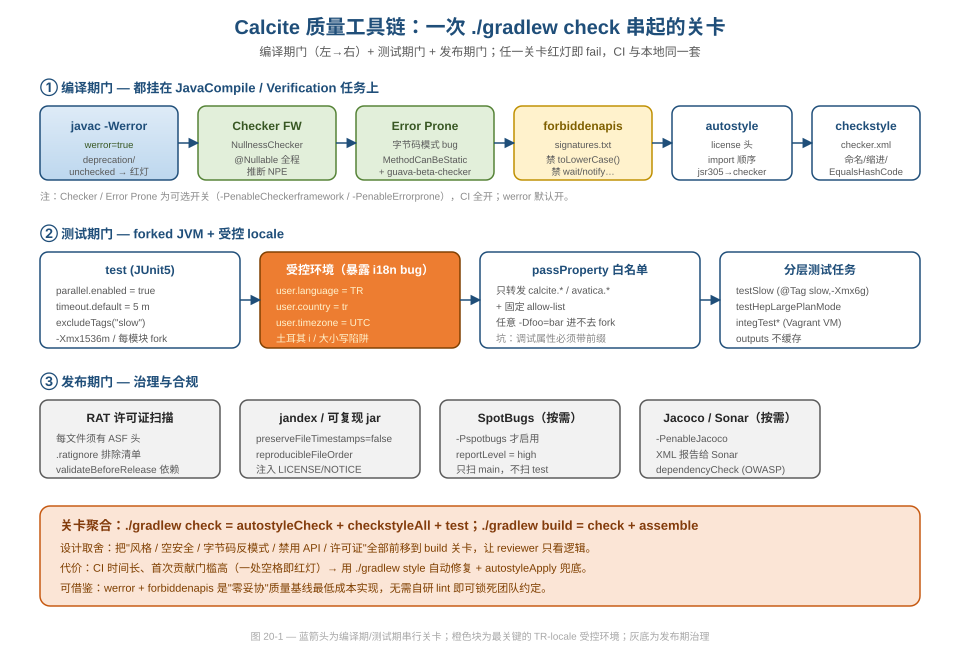
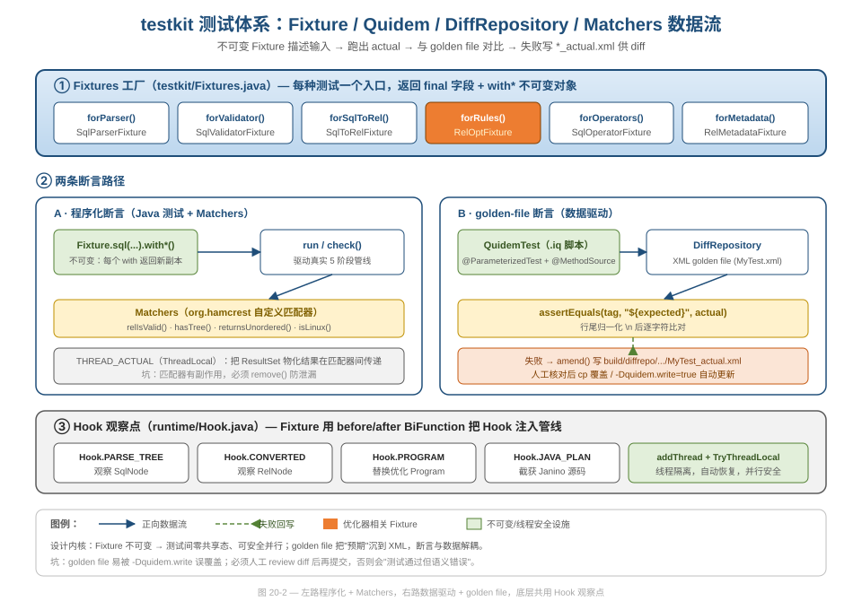
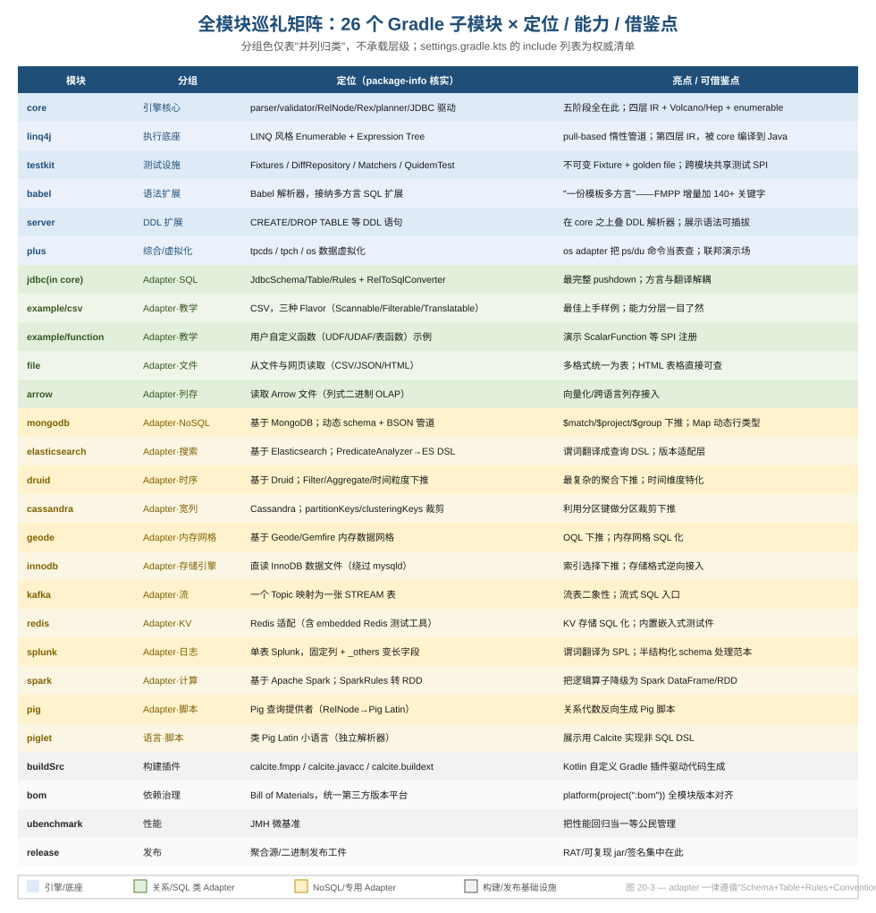

# 第 20 篇 · 工程质量保障 + 全模块巡礼

> 一套近百万行的编译器/优化器框架，靠什么把"质量"变成不可绕过的工程约束、又靠什么把 26 个子模块组织成一个可演进的整体？本篇从构建关卡、测试体系、util 精品三处看 Calcite 的"代码质量工程"，再用一张矩阵给所有模块逐个短评。
> 基线 commit `111030383` · 前置阅读：[第 01 篇 · 工程定位](01-positioning.md)、[第 09 篇 · Parser 代码生成](09-parser-codegen.md)

## TL;DR

1. **质量左移到 build**：`werror=true` 把 javac 警告升级为错误，Checker Framework 查空安全、Error Prone 查字节码反模式、forbiddenapis 禁危险 API、autostyle+checkstyle 锁风格、RAT 查许可证——全部挂在 `./gradlew check` 上，reviewer 只看逻辑。
2. **TR-locale 受控测试**：测试 fork 出的 JVM 强制 `user.language=TR / user.country=tr / user.timezone=UTC`，用土耳其语的大小写规则主动暴露 i18n bug；属性转发有 `calcite.*/avatica.*` 前缀白名单这个坑。
3. **测试体系两条路**：不可变 `Fixture` + `Matchers` 走程序化断言；`QuidemTest`(.iq) + `DiffRepository`(XML golden file) 走数据驱动断言。两者底层共用 `Hook` 观察点。
4. **util 是被低估的精品**：`Bug` 用常量自文档化追踪上游缺陷；`Litmus` 把"校验失败怎么办"抽象成两种策略；`TryThreadLocal` 用 try-with-resources 保证线程局部值自动恢复；`ImmutableBitSet` 用 `long[]` 做位运算 + 拓扑序比较器；`Hook` 是全生命周期的可观察性骨架。
5. **26 个子模块**围绕 `core` 同心展开：`linq4j` 底座、`testkit` 设施、一圈 adapter（关系/NoSQL/流/文件/列存）、外加 `buildSrc/bom/ubenchmark/release` 这些基础设施模块，每个都遵循统一约定。

---

## 1. 质量工具链：把"红线"焊死在编译期

数据工程里最贵的不是写新功能，而是回归——一个被悄悄改坏的类型推断、一个本地能跑 CI 挂掉的 locale bug、一个忘了加许可证头的文件卡住整个 release。Calcite 的应对是把这些全部前移成 build 关卡：任一关卡红灯，`./gradlew check` 就失败，本地与 CI 用同一套配置。



### 1.1 werror：零妥协的最低成本实现

整个质量基线的"地基"是一个布尔开关，定义在 `build.gradle.kts`：

```kotlin
// build.gradle.kts:89
val werror by props(true) // treat javac warnings as errors
```

它在 `JavaCompile` 任务里被消费：

```kotlin
// build.gradle.kts:870-880（configureEach<JavaCompile>）
options.compilerArgs.add("-Xlint:deprecation")
options.compilerArgs.add("-Xlint:-options")
if (werror) {
  options.compilerArgs.add("-Werror")
}
```

**好在哪**：不需要自研任何 lint，`javac -Werror` 就让"新的 deprecation / unchecked 警告"无法进入主干。CLAUDE.md 里那句"新的弃用和 unchecked 警告会导致编译失败"，根就在这三行。**可借鉴**：团队想要"零警告"基线，最便宜的实现就是打开 `-Werror`,代价是任何第三方库升级带来的新 deprecation 都会立刻让你停下来处理——但这恰恰是它的价值，把"技术债积累"变成"立即可见"。

### 1.2 四层静态检查：各管一段，互不重叠

`build.gradle.kts` 在 `plugins.withType<JavaPlugin>` 里依次装配了四个互补的检查器：

- **Checker Framework**（`build.gradle.kts:802-841`）：只启用 `NullnessChecker`,在编译期做 `@Nullable` 数据流分析。注意配置里有务实的取舍——注释里写明 Optional/Regex checker "耗时却收益不大",所以**没有**启用；并对 `:core` 的生成 parser 包 `-AskipDefs` 跳过分析。这就是[第 06 篇](06-type-system.md)、[第 11 篇](11-volcano.md)那些 `castNonNull`/`requireNonNull` 约定的执法者（空安全规约见 CLAUDE.md「Null safety」节）。
- **Error Prone**（`build.gradle.kts:770-801`）：基于字节码模式抓 bug，这里主动 `enable("MethodCanBeStatic")`,又 `disable` 了一串与 Calcite 风格冲突的检查（如 `ReferenceEquality`——因为 `RelTraitSet`/`RelDataType` 故意用 `==` 比较 interned 对象，见[第 14 篇](14-trait-convention.md)）。还额外挂了 `guava-beta-checker`,防止误用 Guava 的 `@Beta` API。
- **forbiddenapis**（`build.gradle.kts:756-768`）：用签名文件 `src/main/config/forbidden-apis/signatures.txt` 禁掉一批"看起来无害但有坑"的 API。实地核对该文件，被禁的包括：

```
java.lang.String#toUpperCase()        // Use toLowerCase(Locale.ROOT)...
java.lang.String#toLowerCase()
java.lang.String#replaceAll(...)      // If you want regex use Pattern.compile...
java.lang.Object#wait() / notify()    // 用并发原语代替
```

这正好和下一节的 TR-locale 形成闭环：先用 forbiddenapis 禁掉不带 `Locale` 的 `toLowerCase()`,再用土耳其 locale 在测试里抓漏网之鱼。

- **autostyle + checkstyle**（`build.gradle.kts:435-534`）：`autostyle` 负责"能自动改的"——license 头、import 顺序（那一长串 `importOrder(...)`）、把 `javax.annotation.Nullable` 自动替换成 `checkerframework` 版、甚至把 `org.hamcrest.Matchers.is` 规整为 `CoreMatchers.is`；`checkstyle` 负责"必须人改的"命名/缩进等。`./gradlew style` 跑前者的 apply,`./gradlew autostyleCheck checkstyleAll` 只报告。

**为什么这么设计**：四层各管一段——空安全归 Checker、字节码反模式归 Error Prone、危险 API 归 forbiddenapis、格式归 autostyle/checkstyle，职责不重叠。**坑**：首次贡献者的门槛被推高了，一个多余空格、一个 import 乱序都会红灯；缓解手段是 `autostyleApply` 能自动修复绝大多数格式问题。

### 1.3 autostyle：把风格指南写成可执行的 replace 规则

`build.gradle.kts` 里 `java { ... }` 那段（`build.gradle.kts:618-731`）是最容易被略读、却最值得细看的一块——它不是"配置一个格式化器",而是把团队约定逐条编码成可执行的字符串/正则替换规则。挑几条有代表性的：

```kotlin
// build.gradle.kts:640-641
replaceRegex("jsr305 nullable -> checkerframework",
    "javax\\.annotation\\.Nullable",
    "org.checkerframework.checker.nullness.qual.Nullable")
// build.gradle.kts:724
replaceRegex("use static import: requireNonNull",
    "Objects\\.(requireNonNull\\()", "$1")
// build.gradle.kts:668
replaceRegex("require message for requireNonNull",
    """(?<!#)requireNonNull\(\s*(\w+)\s*(?:,\s*"(?!\1")\w+"\s*)?\)""",
    "requireNonNull($1, \"$1\")")
```

第一条自动把 jsr305 的 `@Nullable` 改成 Checker 版（呼应 CLAUDE.md「Null safety」里"用 `org.checkerframework...Nullable`,不用 `javax.annotation`"的铁律）；第二条强制 `requireNonNull` 走静态导入；第三条更狠——它会自动给 `requireNonNull(x)` 补上消息参数变成 `requireNonNull(x, "x")`,把"加诊断信息"这件容易忘的事变成保存时自动完成。后面还有一长串把 hamcrest 各种 `Matchers.is`/`CoreMatchers.is` 归一、把 `Integer.parseInt` 改成静态导入的规则,以及一个自定义的"括号平衡"检查 `ParenthesisBalancer`(`build.gradle.kts:728-730`)。

**好在哪**：传统的"风格指南"是一篇 wiki 文档,靠 reviewer 人肉对照;Calcite 把绝大多数条目变成 `autostyleApply` 一跑就生效的代码变换,**风格指南从"建议"变成"事实"**。**可借鉴**:与其写长篇 CONTRIBUTING 再指望大家读,不如把能自动化的约定沉到 autostyle/spotless 这类工具里——团队的"品味"于是有了可执行的载体。

### 1.4 Checker Framework 的 astub：给第三方 API 补空安全契约

Checker 能查出 NPE 的前提是它知道每个方法"接受/返回 nullable 还是 non-null"。JDK 和 Guava 这些第三方库没标注怎么办？Calcite 用 stub 文件补:`build.gradle.kts:829-833` 把 `src/main/config/checkerframework/*.astub` 全部喂给 javac。实地核对该目录,有 `Collection.astub`、`Map.astub`、`Objects.astub`、`Proxy.astub` 等十来个文件——它们各自声明对应 JDK 类型的方法签名的空安全契约,等于给没注解的标准库"打补丁"。

而在确实无法静态证明、又确知非空的地方,代码里会用 `org.apache.calcite.linq4j.Nullness.castNonNull(x)`(见 CLAUDE.md「Null safety」节);在边界做运行时检查则用 `Objects.requireNonNull(x, "x")`——前者是"信我,不空"的零成本断言,后者是真正的运行时护栏。**坑**:astub 是手工维护的,第三方库升级、签名变化时 stub 不会自动跟进,可能产生假阴性或假阳性。这是"给别人的代码补契约"这条路天然的维护成本。

### 1.5 依赖治理:bom 平台 + 一致解析

跨模块一致性还有一块隐形地基——依赖版本。`allprojects` 块里,每个用到 java-library 的模块都被强制引入 bom 平台:

```kotlin
// build.gradle.kts:406-411
plugins.withId("java-library") {
    dependencies {
        "annotationProcessor"(platform(project(":bom")))
        "implementation"(platform(project(":bom")))
        "testAnnotationProcessor"(platform(project(":bom")))
    }
}
```

`:bom` 模块发布一个 BOM(Bill of Materials),集中声明所有第三方库的版本;每个子模块声明依赖时**不写版本号**,由 bom 统一约束。再叠加 `consistentResolution { useCompileClasspathVersions() }`(`build.gradle.kts:585-589`),保证编译期和运行期解析到同一版本,避免"编译用 A 版、运行加载到 B 版"的经典幽灵 bug。`allprojects` 还统一 `exclude` 掉了 `org.jetbrains:annotations` 和一个旧 bouncycastle(`build.gradle.kts:398-403`),从源头杜绝注解冲突。可选的 dependency-analysis 插件(`-PenableDependencyAnalysis`)甚至能报告"声明了却没用 / 用了却没声明"的依赖。

**可借鉴**:多模块工程最容易在"版本漂移"上翻车。把版本收口到一个 BOM 模块、子模块只写坐标不写版本,是 Maven/Gradle 生态里成本最低的统一手段;Calcite 把它和 `useCompileClasspathVersions` 配合用,连"编译/运行版本不一致"这种更隐蔽的坑也一并堵死。

### 1.6 RAT 与可复现构建：发布期治理

发布期还有两道门。`rat`（`build.gradle.kts:145-154`）扫描每个文件是否带 ASF 许可证头，用 `.ratignore` 维护排除清单（实地核对约 56 行排除项），并被 `validateBeforeBuildingReleaseArtifacts` 依赖——也就是说**没许可证头就发不了版**。另外所有 archive 任务（`build.gradle.kts:536-546`）都设了 `isPreserveFileTimestamps = false` 与 `isReproducibleFileOrder = true`,保证产物字节级可复现,这对 ASF 的发布投票（任何人都要能从源码重建出同样的 jar）是硬要求。`afterEvaluate` 里还会给每个 jar 注入 `LICENSE`/`NOTICE`(`build.gradle.kts:966-981`)——合规不是发布时补的,而是构建时自动满足的。

---

## 2. 测试期门：用受控环境主动制造失败

### 2.1 TR-locale：把 i18n bug 从"线上偶发"变成"本地必现"

`build.gradle.kts` 的 `configureEach<Test>` 块（`build.gradle.kts:886-919`）是整个测试体系最值得抄的一段：

```kotlin
// build.gradle.kts:905-919
passProperty("java.awt.headless")
passProperty("junit.jupiter.execution.parallel.enabled", "true")
passProperty("junit.jupiter.execution.parallel.mode.default", "concurrent")
passProperty("junit.jupiter.execution.timeout.default", "5 m")
passProperty("user.language", "TR")
passProperty("user.country", "tr")
passProperty("user.timezone", "UTC")
// ...
val props = System.getProperties()
for (e in props.propertyNames() as `java.util`.Enumeration<String>) {
  if (e.startsWith("calcite.") || e.startsWith("avatica.")) {
    passProperty(e)
  }
}
```

**好在哪**：土耳其语里 `'I'.toLowerCase()` 不是 `'i'` 而是无点的 `'ı'`,`'i'.toUpperCase()` 是带点的 `'İ'`。任何忘了传 `Locale.ROOT` 的大小写转换（比如把 SQL 关键字归一化、把标识符 casing、把 `SqlDialect` 的 quoting/casing 规则套到 identifier 上）在 TR locale 下都会立刻产生错误结果——`SELECT` 可能被错误地归一成 `selеct`(那个 i 不是 ascii i),于是关键字识别、列名匹配集体翻车。在英文环境下这些 bug "侥幸正确",到了某个真实土耳其用户手里才爆——TR-locale 测试把这个时间差从"上线后"提前到了"提交前"。再叠加 `user.timezone=UTC`,时间相关的测试(`CURRENT_TIMESTAMP`、interval 运算)也有了确定基准,不再随 CI 机器时区漂移。这是一种"用最不友好的环境逼出隐藏假设"的思路——**可借鉴**:做国际化的产品，CI 故意用一个边界 locale 跑测试，比写一堆 i18n 单测更省力,而且能抓到你根本没想到要测的那条路径。它和 §1.2 的 forbiddenapis 禁 `toLowerCase()` 是同一套防线的两端:一个静态拦截、一个运行时兜底。

**坑（passProperty 白名单）**:如 CLAUDE.md 所警告,测试跑在 forked JVM 里,只有 `calcite.*`/`avatica.*` 前缀（外加固定 allow-list）的系统属性才会被转发进去。命令行上随手写个 `-Dfoo=bar` **到不了测试**。调试时（如 `-Dcalcite.debug=true`）必须带对前缀。

### 2.2 分层测试任务：快慢分离、大计划单列

`build.gradle.kts` 默认的 `test` 用 `excludeTags("slow")`(`build.gradle.kts:891`)、堆 `-Xmx1536m`;慢测单独成任务并加堆：

```kotlin
// build.gradle.kts:923-930
register<Test>("testSlow") {
  description = "Runs the slow unit tests."
  useJUnitPlatform { includeTags("slow") }
  jvmArgs("-Xmx6g")
}
```

还有 `testHepLargePlanMode`(`build.gradle.kts:931-945`)——只对一组优化器重测试类（`HepPlannerTest`/`RelOptRulesTest`/`SqlToRelConverterTest`…见 `build.gradle.kts:93-113` 的 `hepLargePlanModeTestIncludes`）打开 `calcite.hep.large.plan.mode=true`,专门给[第 10 篇](10-hep-planner.md)的 HepPlanner 跑大计划回归。它用 `shouldRunAfter("test")` 排在普通测试之后,且通过 `rootProject.tasks.named("testHepLargePlanMode")` 把各子模块的同名任务聚合到根任务,一条命令跑全。

集成测则是另一条隔离链:`*IT.java` 类不在默认 `test` 里,而是用 `core/build.gradle.kts:277-287` 的 `integTestAll`/`integTestPostgresql` 等任务驱动,且依赖外部数据库(`-Dcalcite.test.db=...`,需 `vlsi/calcite-test-dataset` 的 Vagrant VM)。

**工程视角**:把"快测""全量慢测(`testSlow`,`@Tag("slow")` + `-Xmx6g`)""大计划压力测(`testHepLargePlanMode`)""集成测(`integTest*`)"四档拆开,是用任务粒度把"反馈速度"和"覆盖面"解耦——日常迭代只跑前者保速度,CI/发布前跑后者保完整。再加一个细节:`configureEach<Test>` 里 `outputs.cacheIf(...) { false }`(`build.gradle.kts:887-889`)显式禁用了测试结果缓存,理由是"测试结果依赖数据库配置,不该缓存",避免换 db 后拿到旧的绿灯。

---

## 3. 测试设施：testkit 的两条断言路

测试任务只是"怎么跑",真正决定测试可维护性的是 `testkit` 模块提供的设施。



### 3.1 不可变 Fixture：测试间零共享态

`testkit/src/main/java/org/apache/calcite/test/Fixtures.java` 是统一入口，每种测试一个工厂方法：

```java
// testkit/.../Fixtures.java
public static SqlValidatorFixture forValidator() { ... }
public static SqlToRelFixture forSqlToRel() { ... }
public static RelOptFixture forRules() { ... }
public static SqlOperatorFixture forOperators(boolean execute) { ... }
public static RelMetadataFixture forMetadata() { ... }
```

关键在于这些 Fixture 都是**不可变**的。看 `RelOptFixture`（`testkit/.../RelOptFixture.java`）的字段全是 `final`,连 `Hook` 都是 `ImmutableMap`:

```java
// testkit/.../RelOptFixture.java:95-104
final SqlTester tester;
final RelSupplier relSupplier;
final SqlTestFactory factory;
final @Nullable DiffRepository diffRepos;
final @Nullable HepProgram preProgram;
final RelOptPlanner planner;
final ImmutableMap<Hook, Consumer<Object>> hooks;
final BiFunction<RelOptFixture, RelNode, RelNode> before;
final BiFunction<RelOptFixture, RelNode, RelNode> after;
```

每个 `with*()` 返回一个新副本，起点是一个 `static final DEFAULT` 单例（`RelOptFixture.java:82`）。**好在哪**:因为 Fixture 不可变,JUnit5 并行执行（上一节那个 `parallel.enabled=true`）时多个测试方法共享同一个 `DEFAULT` 也不会互相污染——这是把[第 04 篇](04-relnode.md)讲的"不可变 + copy 契约"用到测试基础设施上的同一思路。**可借鉴**:测试 fixture 设计成 builder 风格的不可变对象，是支撑并行测试最稳的办法。

### 3.2 DiffRepository：golden file 把"预期"沉到 XML

第二条路是数据驱动。`testkit/.../DiffRepository.java` 维护一份 XML golden file（如 `MyTest.xml`,结构是 `<Root><TestCase name=..><Resource name=..><![CDATA[..]]>`),断言时把实际值和 XML 里的预期值逐字符比对：

```java
// testkit/.../DiffRepository.java:504-528
public void assertEquals(String tag, String expected, String actual) {
  final String testCaseName = getCurrentTestCaseName(true);
  String expected2 = expand(tag, expected);
  if (expected2 == null) {
    update(testCaseName, expected, actual);
    throw new AssertionError("reference file does not contain resource '"
        + expected + "' for test case '" + testCaseName + "'");
  } else {
    try {
      String expected2Canonical = expected2.replace(Util.LINE_SEPARATOR, "\n");
      String actualCanonical = actual.replace(Util.LINE_SEPARATOR, "\n");
      Assertions.assertEquals(expected2Canonical, actualCanonical, tag);
    } catch (AssertionFailedError e) {
      amend(expected, actual);   // 失败时把 actual 记下来
      throw e;
    }
  }
}
```

失败路径调用的 `amend`(`DiffRepository.java:356-362`)会把实际输出写进内存文档,最终落到 `build/diffrepo/.../MyTest_actual.xml`。开发者核对 diff 后,要么手动 `cp` 覆盖,要么对 `.iq` 用 `-Dquidem.write=true` 让框架自动重写预期（[第 09 篇](09-parser-codegen.md)讲 parser 测试、CLAUDE.md「Quidem SQL tests」节都依赖这个流程）。

Quidem `.iq` 脚本是这条路里更轻量的一种 golden file。它就是"SQL + 预期结果"交替排布的纯文本,`!use`/`!set outputformat` 等指令控制运行环境,例如 `core/src/test/resources/sql/agg.iq` 开头:

```
!use post
!set outputformat mysql

# count(*) returns number of rows in table
select count(ename) as c from emp;
+---+
| C |
+---+
```

`QuidemTest`(`testkit/.../QuidemTest.java`)用 `@ParameterizedTest + @MethodSource` 把目录下每个 `.iq` 变成一个参数化用例,文件路径还会按约定映射到方法名——`findMethod`(`QuidemTest.java:192`)的注释直说"path `sql/agg.iq` gives method `testSqlAgg`"。运行时它执行每条 SQL、把实际结果和脚本里那段"预期表格"比对;`-Dquidem.write=true` 则把实际结果直接重写回 `.iq`。

**为什么这么设计**:优化器输出的 RelNode 树、生成的 SQL、执行计划这类大块文本，写进 Java 字符串里既难读又难维护;沉到 XML/`.iq`,断言代码（`assertEquals`）和预期数据彻底解耦,改一条规则的预期只需改数据文件,SQL 行为测试甚至不必写一行 Java。**坑（务必如实写）**:`-Dquidem.write=true` 会**无条件覆盖**预期文件——如果你的改动其实引入了语义错误,write 之后测试照样"绿",错误被固化进 golden file。所以纪律是:write 之后必须人工 review 那份 diff 再提交,绝不能盲跑盲提。

### 3.3 Matchers：自定义 hamcrest 匹配器

程序化那条路靠 `testkit/.../Matchers.java` 提供领域匹配器:`relIsValid()`(校验 RelNode 合法性)、`hasTree()`(比对计划树)、`returnsUnordered()`(忽略顺序比 ResultSet)、`isLinux()`(归一化行尾)。这里有个值得注意的实现细节——`returnsUnordered` 用 `ThreadLocal` 在匹配器之间传递物化结果:

```java
// testkit/.../Matchers.java:74,108-114
private static final ThreadLocal<Object> THREAD_ACTUAL = new ThreadLocal<>();
// ...
THREAD_ACTUAL.set(actualList);
// 取用后立即 remove，防止线程复用时泄漏
```

这是为了在 hamcrest 的 `matches` / `describeMismatch` 两次回调之间共享"已经消费过的 ResultSet",代价是匹配器有了副作用,所以必须及时 `remove()`。又是一个"为了 API 优雅，把状态藏进 ThreadLocal"的例子——下一节的 `TryThreadLocal` 就是把这种模式做成了安全的通用设施。

---

## 4. util 精品：被低估的防御式编程

`org.apache.calcite.util` 包里有一批"小而锋利"的工具类，它们不在任何流程的聚光灯下，却是整个代码库防御式编程的底色。

### 4.1 Bug：用常量自文档化地追踪上游缺陷

`core/.../util/Bug.java` 是一个全静态布尔常量的集合，每个常量对应一个"尚未修复的 bug",类注释（`Bug.java:19-46`）讲得很清楚:这些常量用来"控制代码流程",当某 bug 修复后,把常量和它的所有引用一起删掉,从而追踪修复在各分支的传播。

```java
// core/.../util/Bug.java:202-205
/** Whether [CALCITE-6611]
 * Rules that modify the sort collation cannot be applied in VolcanoPlanner
 * is fixed. */
public static final boolean CALCITE_6611_FIXED = false;

// core/.../util/Bug.java:210
public static final boolean TODO_FIXED = false;
```

还有两个方法把"临时代码"显式化:`remark`(`Bug.java:227`)给临时代码打标记,`upgrade`(`Bug.java:240`)标记"升级某组件后要回访的代码"。

**好在哪**:把"我们知道这里有问题、在等上游修"这个**隐性知识**变成可被 grep、可被编译器看到的常量。`if (Bug.CALCITE_xxx_FIXED) { ... }` 形式的死代码（因为常量恒为 `false`）会被静态分析标出,反而成了"修复后记得回来删我"的活书签。类注释还特意说明 `This class depends on no other classes`——曾经依赖 `Util` 导致类加载循环,这是个真实踩过的坑。**可借鉴**:与其在代码里散落 `// FIXME: waiting for upstream`,不如做一个 `Bug` 常量表,让"已知缺陷"可检索、可统计、可在修复时一键清理。

### 4.2 Litmus:把"校验失败怎么办"抽象成策略

`core/.../util/Litmus.java` 解决一个很常见的纠结:一个校验方法,有时希望失败就抛异常（生产/断言路径），有时只希望返回 `false`(探测路径)。Calcite 把这个"失败后的动作"抽象成一个函数式接口的两个内置实例:

```java
// core/.../util/Litmus.java:28-51
Litmus THROW = (message, args) -> {
  final String s = message == null
      ? null : MessageFormatter.arrayFormat(message, args).getMessage();
  throw new AssertionError(s);
};

Litmus IGNORE = new Litmus() {
  @Override public boolean fail(@Nullable String message, @Nullable Object... args) {
    return false;
  }
  // ...
};
```

调用方写一个 `check`,把策略当参数传:

```java
// core/.../util/Litmus.java:71-78
default boolean check(boolean condition, @Nullable String message,
    @Nullable Object... args) {
  if (condition) {
    return succeed();
  } else {
    return fail(message, args);
  }
}
```

最典型的消费者就是 `RelNode#isValid(Litmus litmus, @Nullable Context context)`(`core/.../rel/RelNode.java:360`,`AbstractRelNode.java:169` 实现)。`AbstractRelNode` 内部断言写成 `assert r.isValid(Litmus.THROW, null);`(`AbstractRelNode.java:287`)——开断言时它会在第一处不一致就抛出带消息的 `AssertionError`,定位精准;而[第 11 篇](11-volcano.md)的优化器在注册节点时也会调同样的 `isValid`,只是那里更关心"通不通过"而非"在哪挂",于是同一份校验逻辑两种用法都成立。**同一份校验逻辑,两种失败语义**正是 Strategy 模式最干净的一种用法（模式总览见[第 19 篇](19-design-patterns.md)）。**可借鉴**:任何"既要能 fail-fast 又要能静默探测"的校验 API,与其提供两套方法或加一个 `boolean throwOnError` 参数,不如传一个 `Litmus` 风格的回调,把"怎么失败"的决定权交给调用方。

### 4.3 TryThreadLocal:把"用完恢复"做成 try-with-resources

`core/.../util/TryThreadLocal.java` 解决线程局部变量最容易出错的地方——临时改了值,忘了改回去。它的核心是 `push` 返回一个 `AutoCloseable`:

```java
// core/.../util/TryThreadLocal.java:76-80
public Memo push(T value) {
  final T previous = get();
  set(value);
  return () -> restoreTo(previous);
}

// core/.../util/TryThreadLocal.java:124-127
public interface Memo extends AutoCloseable {
  /** Sets the value back; never throws. */
  @Override void close();
}
```

用法就是 `try (var memo = TL.push(x)) { ... }`,块结束自动恢复到 `previous`。还有 `letIn`(`TryThreadLocal.java:90-121`,名字取自 ML 的 `let ... in` 构造)直接接受一个 `Runnable`/`Supplier`,在临时值下执行后保证恢复。

实现里有个精巧的不可变性细节:`FixedTryThreadLocal.initialValue()` 被声明为 **final**(`TryThreadLocal.java:148`),注释解释——只有保证子类不能改初始值,`restoreTo` 才能靠"previous 是否等于 initialValue"来决定调 `remove()` 还是 `set()`(`TryThreadLocal.java:157-163`),从而在恢复到初值时彻底清掉 ThreadLocal、避免内存泄漏。

**好在哪**:它把"对称的成对操作"(set/restore)用 RAII（try-with-resources）变成不可能漏掉的一对,正是上一节 `Matchers.THREAD_ACTUAL` 那种"裸 ThreadLocal + 手动 remove"的安全升级版。**可借鉴**:凡是"临时改全局/线程态"的场景,把它包成返回 `AutoCloseable` 的 `push`,让编译器和 IDE 帮你保证恢复。

### 4.4 ImmutableBitSet:long[] 位运算 + 拓扑序

[第 04 篇](04-relnode.md)的 `Aggregate` 的 group key、[第 13 篇](13-metadata-cost.md)的列集合到处用 `ImmutableBitSet`(`core/.../util/ImmutableBitSet.java`)。它把位集打包进 `long[]`(`words`,`ImmutableBitSet.java:100`,每个 long 64 位),不可变、可比较、可迭代。最有意思的是它的 `COMPARATOR`:

```java
// core/.../util/ImmutableBitSet.java:62-75
/** Compares bit sets topologically, so that enclosing bit sets come first,
 * using natural ordering to break ties. */
public static final Comparator<ImmutableBitSet> COMPARATOR = (o1, o2) -> {
  if (o1.equals(o2)) {
    return 0;
  }
  if (o1.contains(o2)) {
    return -1;
  }
  if (o2.contains(o1)) {
    return 1;
  }
  return o1.compareTo(o2);
};
```

它不是简单的字典序,而是**拓扑序**:包含关系上更"大"(包住别人)的集合排在前面,无包含关系时再退化到自然序。这在优化器里很关键——比如处理 grouping sets 时,需要先看大的分组集合。

底层的位打包也做得很干净。`wordIndex(bit)` 就是 `bit >> 6`(`ImmutableBitSet.java:289-292`,`ADDRESS_BITS_PER_WORD=6` 即每个 long 64 位),`of(bit)` 把对应位 `|= 1L << bit`。构造器(`ImmutableBitSet.java:103-108`)还用 assert 维持一条不变量——最高位所在的 word 必须非零,即没有"尾部全零的多余 word",这保证了同一个位集合只有唯一的 `long[]` 表示,`equals`/`compareTo` 才能逐 word 直接比。

**数据工程视角**:用 `long[]` 位运算表达列集合,比 `Set<Integer>` 省一个数量级的内存且交并补都是单条 CPU 指令;不可变又让它能安全地当 map key、当 `RelNode` digest 的一部分([第 04 篇](04-relnode.md))。"唯一表示 + 不可变 + 高效位运算"三者叠加,正是它能在优化器热路径里被海量创建却不拖垮性能的原因。

### 4.5 Hook:全生命周期的可观察性骨架

最后回到把测试与运行时连起来的 `core/.../runtime/Hook.java`。它是一个 `enum`,每个枚举值是查询准备过程中的一个观察点:`PARSE_TREE`(拿到 SqlNode)、`CONVERTED`(sql2rel 输出)、`PROGRAM`(优化 Program)、`JAVA_PLAN`(Janino 编译前的源码,[第 16 篇](16-codegen-exec.md))等。它的可观察性实现同时考虑了全局与线程隔离:

```java
// core/.../runtime/Hook.java:107-113
private final List<Consumer<Object>> handlers =
    new CopyOnWriteArrayList<>();

private final TryThreadLocal<List<Consumer<Object>>> threadHandlers =
    TryThreadLocal.withInitial(ArrayList::new);
```

`add`(全局,`Hook.java:135`)已被 `@Deprecated` 标注并在 javadoc 里直白警告"这是跨线程全局 hook,影响可能超出预期,优先用线程局部";`addThread`(`Hook.java:155`)才是推荐入口,它把 handler 加进 `threadHandlers`——而后者正是用上一节的 `TryThreadLocal` 构建的。`run`(`Hook.java:209-216`)依次触发全局和线程局部的 handler。

Hook 还有一种"属性 hook"用法值得一提:`propertyJ(v)`(`Hook.java:202`)返回一个把值写进 `Holder` 的 consumer,配合 `get(defaultValue)`(`Hook.java:220-224`)就能让 hook "返回"一个值。比如 `Hook.REL_BUILDER_SIMPLIFY`/`Hook.ENABLE_BINDABLE` 这类开关,默认值由调用方给、测试可临时覆盖——这把"观察点"顺手做成了"可注入的配置点"。注意 handler 列表带 `@SuppressWarnings("ImmutableEnumChecker")`(`Hook.java:107`/`:111`):enum 实例本应不可变,但这里故意持有可变的 handler 列表,所以显式压掉 Error Prone 的告警——一个"知道在破例、并留痕"的范例。

**好在哪**:`Hook` 让测试能在不改产线代码的前提下,在管线任意阶段插入观察/篡改逻辑(`RelOptFixture` 的 `ImmutableMap<Hook, ...>` 就是这么用的,见 §3.1);`CopyOnWriteArrayList` 保证遍历 handler 时并发安全;线程局部版本保证并行测试互不干扰。**坑**:全局 `add` 的跨线程副作用是真实陷阱,框架自己把它废弃掉就是教训的结晶——这也是为什么 `addThread` + `TryThreadLocal` 的组合是默认姿势。

### 4.6 Pair 与 Util:把"少量样板"消灭在源头

最后两个看似平淡却无处不在的类。`core/.../util/Pair.java`(`Pair.java:47-57`)同时实现了 `Comparable` 与 `Map.Entry`,并持有两个 `public final` 字段:

```java
// core/.../util/Pair.java:47-57
public class Pair<T1, T2>
    implements Comparable<Pair<T1, T2>>, Map.Entry<T1, T2>, Serializable {
  public final T1 left;
  public final T2 right;
```

它的价值不在"凑一个二元组"——Java 缺二元组人人皆知——而在于:因为它实现了 `Map.Entry`,可以直接喂给任何接受 entry 的 API;因为它实现了 `Comparable` 且 `equals`/`hashCode` 基于内容,可以安全地放进 `Set`、当 map key、参与排序;再配上 `Pair.zip(ks, vs)`(`Pair.java:169`)把两个并列 list 拉成 `List<Pair>`,优化器里"列名↔类型""左输入↔右输入"这类成对数据的遍历就特别顺手。

`core/.../util/Util.java` 则是一组消灭样板的小函数:`first(v0, v1)`(`Util.java:2130`,一组重载覆盖各原始类型,等价于"v0 为 null 就取 v1"的空安全合并)、`first(list)`/`last(list)`(`Util.java:2190`/`:2198`,取首末元素)、`transform(list, fn)`(`Util.java:2749`,惰性 `List` 视图变换)、以及前面 `Hook.functionConsumer` 用到的 `discard(...)`(`Util.java:225` 起一组重载,专门用来"显式丢弃返回值",压掉 Error Prone 的 `ReturnValueIgnored` 警告)。

**好在哪/可借鉴**:这两个类体现了一种克制——不引入重型工具库,而是用一小撮带 `@Nullable`/`@PolyNull` 精确标注的纯函数,把"取首元素""空安全取值""丢弃返回值"这些每天写几十遍的样板收敛成一处、且对 Checker 友好。`discard` 尤其有意思:它把"我故意忽略这个返回值"从一句注释升级成一次方法调用,让静态检查器闭嘴的同时也向读者表明了意图。

---

## 5. 全模块巡礼:26 个子模块逐个短评

`settings.gradle.kts` 的 `include(...)`(`settings.gradle.kts:63-89`)是模块清单的权威来源,外加 `buildSrc`(独立构建)。下面这张矩阵把它们按"引擎/底座、关系类 adapter、NoSQL/专用 adapter、构建/发布基础设施"分组,逐个给"定位 + 亮点/可借鉴点"。



几条横向观察:

- **同心圆结构**:`core` 是引擎本体(五阶段全在此),`linq4j` 是其下的执行底座([第 15 篇](15-linq4j.md)),`testkit` 横向支撑所有模块的测试。其余全是外围 adapter 或基础设施。这正是[第 01 篇](01-positioning.md)讲的"前端公共化、后端专业化"在模块层的投影。
- **adapter 四件套统一**:无论 jdbc(在 core 内)、mongodb、druid 还是 cassandra,每个 adapter 都是 `Schema + Table + Rules + Convention(+Dialect)` 的同构组合(接口本体见[第 17 篇](17-extensibility.md),五个 adapter 的 pushdown 能力对比见[第 18 篇](18-adapters.md))。`example/csv` 是最好的入门样例,用三种 Flavor 演示 Table 能力分层。
- **pushdown 能力梯度**(实地核对各 adapter 的 Rules 类):jdbc 最完整(Filter/Project/Join/Sort/Aggregate),druid 的聚合下推最复杂(带时间粒度),mongodb 走 BSON 管道,elasticsearch 把谓词翻成 ES DSL,cassandra 利用分区键裁剪,而 csv 只做最简单的下推。这条梯度本身就是一份"如何渐进式给数据源加优化能力"的路线图。
- **专用 adapter 的巧思**:`kafka` 把一个 Topic 当成一张 STREAM 表(流表二象性);`splunk` 用"固定列 + `_others` 变长 map"处理半结构化日志;`innodb` 直读 InnoDB 数据文件、绕过 mysqld;`plus` 里的 os adapter 甚至把 `ps`/`du` 命令的输出当表来查——这些都是"万物皆可 SQL"的极佳案例。
- **基础设施模块**:`buildSrc` 用 Kotlin 写了 `calcite.fmpp`/`calcite.javacc`/`calcite.buildext` 三个自定义 Gradle 插件来驱动 parser 代码生成(细节见[第 09 篇](09-parser-codegen.md));`bom` 用 `platform(project(":bom"))` 把全模块第三方依赖版本对齐;`ubenchmark` 用 JMH 把性能回归当一等公民;`release` 集中处理 RAT/可复现 jar/签名;`babel`/`server` 则展示了解析层的可插拔(分别加方言关键字、加 DDL)。

再挑几个"读源码时单独翻一翻很有收获"的模块,补一句它们各自最值得学的点:

- **`example/csv`**:学 adapter 的不二起点。它用 `Flavor`(SCANNABLE/FILTERABLE/TRANSLATABLE)一个枚举切换出三种实现,把[第 17 篇](17-extensibility.md)讲的 Table 能力金字塔从抽象接口落成可运行的对照实验——同一份 CSV,换个 Flavor 就从"全表扫描"升级到"谓词下推",最适合理解"渐进式增强"这条 SPI 设计哲学。
- **`linq4j`**:它是唯一不依赖 `core` 的纯库,可以脱离 SQL 单独用(LINQ-to-Java)。读它能把"惰性求值的 pull-based 管道"和"Expression Tree 作为第四层 IR"两件事和 JDK 的 `Iterator`/`Stream` 做直接对照([第 15 篇](15-linq4j.md))。
- **`kafka`/`splunk`/`innodb`**:三种"非典型数据源 SQL 化"的范式。kafka 把流当表(STREAM 语义)、splunk 用 `_others` map 兜住开放 schema、innodb 直接逆向存储引擎文件格式——它们一起说明 Calcite 的 Table SPI 抽象边界有多宽。
- **`testkit`**:它本身是个被发布的工件,adapter 模块都依赖它跑 `CalciteAssert`/`Matchers`。把"测试基础设施"当成一等模块来维护、而非散落在各 `src/test` 里,是大型项目里被严重低估的工程投资。

**数据工程视角的总结**:这套模块布局的可借鉴之处在于——把"公共编译/优化能力"收敛到极少数核心模块(`core`+`linq4j`),把"对接外部系统的脏活"用统一 SPI 切成一圈可独立演进的 adapter,再用 `bom`/`buildSrc` 这类基础设施模块兜住跨模块一致性。新增一个数据源 = 新增一个遵循四件套约定的模块,不动核心。

---

## 6. 三问回顾:质量是怎样被"工程化"的

把前面的零件拼回去,本篇的主线其实是一个问题——**质量如何从"靠自觉"变成"靠机制"**。用本系列的三个视角各收一句:

- **软件工程视角(复杂度治理)**:近百万行代码不可能靠 code review 守住一致性。Calcite 的答案是"把可机械验证的约束全部机械化":风格→autostyle,空安全→Checker,字节码反模式→Error Prone,危险 API→forbiddenapis,许可证→RAT。人的注意力被解放出来,只投到"逻辑对不对"上。代价是构建链长、首贡门槛高——这是用"机器时间"换"人的注意力",在大型协作项目里几乎总是划算的。

- **数据工程视角(可演进的边界)**:26 个模块的同心圆 + adapter 四件套,让"接入一个新数据源"变成纯加法操作。`bom` 锁版本、`buildSrc` 锁代码生成方式、`testkit` 锁测试范式——这三道"横切关注点"被收口到基础设施模块,使得外围 adapter 可以各自演进而不互相牵扯。这正是无存储框架"前端公共化、后端专业化"哲学在工程治理上的落地。

- **设计与代码质量视角(防御式编程的底色)**:`Bug`/`Litmus`/`TryThreadLocal`/`ImmutableBitSet`/`Hook`/`Pair`/`Util` 这批 util,单看都很小,合起来却定义了整个代码库"出错时怎么办"的默认姿势——已知缺陷用常量追踪、校验失败用策略切换、临时态用 RAII 自动恢复、可观察性用 enum + 线程隔离。它们不解决任何业务问题,只是让其余几十万行代码"更难写错"。**最值得抄走的一条**:好的基础库不是功能堆叠,而是把团队反复踩的坑,一次性铸成"踩不进去"的 API。

---

## 设计模式与工程小结

| 机制 | 模式/手法 | 工程价值 | 坑 / 权衡 |
|---|---|---|---|
| `werror=true` + 四层静态检查 | 质量左移 / 关卡(Gate) | 警告即错误,reviewer 只看逻辑 | 首次贡献门槛高(格式即红灯) |
| forbiddenapis + TR-locale | 受控环境暴露假设 | 主动制造失败比写 i18n 单测省力 | passProperty 白名单:`-Dfoo` 进不去 fork |
| 不可变 `Fixture`(`with*` 返新) | Builder + 不可变对象 | 支撑 JUnit5 并行、测试间零污染 | 链式 with 调用较啰嗦 |
| `DiffRepository` golden file | 数据/断言解耦 | 大块预期沉到 XML/.iq,易维护 | `-Dquidem.write` 无条件覆盖,须人审 diff |
| `Bug.CALCITE_xxx_FIXED` | 常量自文档化 | 已知缺陷可检索、可一键清理 | 恒为 false 的死代码需静态分析配合 |
| `Litmus.THROW/IGNORE` | Strategy(策略) | 一份校验逻辑、两种失败语义 | 调用方需理解传哪个策略 |
| `TryThreadLocal.push` → `Memo` | RAII / try-with-resources | "改了自动恢复",杜绝漏恢复 | `initialValue` 必须 final 才能正确 remove |
| `ImmutableBitSet` (`long[]`+COMPARATOR) | Flyweight 思路 + 不可变 | 位运算高效、可当 key、拓扑序 | 位下标语义需调用方约定 |
| `Hook`(enum + CopyOnWriteArrayList + TryThreadLocal) | Observer + 线程隔离 | 不改产线即可观察/篡改管线 | 全局 `add` 跨线程副作用(已废弃) |
| adapter 四件套 + bom/buildSrc | 模块同构 + 依赖治理 | 加数据源不动核心 | 模块数多,首次构建慢 |

---

## 对照阅读建议(动手)

- **断点**:`build.gradle.kts` → `configureEach<Test>` 块(`build.gradle.kts:886-919`)
  - **观察**:在某个用到 `toLowerCase()` 的测试里临时去掉 `Locale.ROOT`,看它在 `user.language=TR` 下如何失败;再确认 `passProperty` 只放行 `calcite.*`/`avatica.*`。
  - **运行**:`./gradlew :core:test --tests org.apache.calcite.test.SqlOperatorTest`(注意:`-Dcalcite.debug=true` 能进 fork,`-Dfoo=bar` 不能)。

- **断点**:`testkit/src/main/java/org/apache/calcite/test/DiffRepository.java` → `DiffRepository#assertEquals`(`DiffRepository.java:504`)
  - **观察**:故意改坏一条规则的预期,看 `amend`(`:356`)把 actual 写到 `build/diffrepo/.../*_actual.xml`;对比 `expected2Canonical` 与 `actualCanonical` 的逐字符断言。
  - **运行**:`./gradlew :core:test --tests org.apache.calcite.test.RelOptRulesTest`。

- **断点**:`core/src/main/java/org/apache/calcite/util/TryThreadLocal.java` → `TryThreadLocal#push` / `FixedTryThreadLocal#restoreTo`(`:76` / `:157`)
  - **观察**:`push` 返回的 `Memo` 在 `close()` 时如何根据 `previous == initialValue` 决定调 `remove()` 还是 `set()`;配合 `Hook.addThread`(`Hook.java:155`)看线程局部 handler 的安装与自动清理。
  - **运行**:任一带 `Hook.JAVA_PLAN.addThread(...)` 的测试,如 `./gradlew :core:test --tests org.apache.calcite.test.JdbcTest`。

- **断点**:`core/src/main/java/org/apache/calcite/util/Litmus.java` → `Litmus#check`(`:71`)
  - **观察**:同一处 `isValid(...)` 分别传 `Litmus.THROW` 与 `Litmus.IGNORE` 时,`fail` 的两种行为(抛 `AssertionError` vs 返回 false)。
  - **运行**:`./gradlew :core:test --tests org.apache.calcite.test.RelOptUtilTest`(或在 `RelNode#isValid` 调用处下断点)。

---

## 延伸阅读

- 本系列:
  - [第 01 篇 · 工程定位与"无存储"架构](01-positioning.md)——模块同心圆结构的由来。
  - [第 09 篇 · Parser 代码生成(FMPP+JavaCC)](09-parser-codegen.md)——本篇 `buildSrc` 构建插件是其全局视角的子集。
  - [第 17 篇 · 扩展性架构:Schema SPI 能力分层](17-extensibility.md)、[第 18 篇 · Adapter 生态对比](18-adapters.md)——模块矩阵里每个 adapter 的接口与下推细节。
  - [第 19 篇 · 设计模式全景](19-design-patterns.md)——`Litmus`(Strategy)、`TryThreadLocal`(RAII)、`Hook`(Observer)在模式视角下的归纳。
  - [第 15 篇 · linq4j](15-linq4j.md)、[第 16 篇 · codegen 与执行](16-codegen-exec.md)——`Hook.JAVA_PLAN` 截获的正是这里生成的源码。
- 官方文档:
  - `site/_docs/howto.md`——权威开发者指南(构建、IDE、提交流程)。
  - `site/_docs/contributing.md`——贡献规范,与本篇的 build 关卡呼应。
- 仓库内:`CLAUDE.md`(根目录)——「Build & test」「Null safety」「Quidem SQL tests」「Test JVM properties — gotcha」四节是本篇的运行手册。
