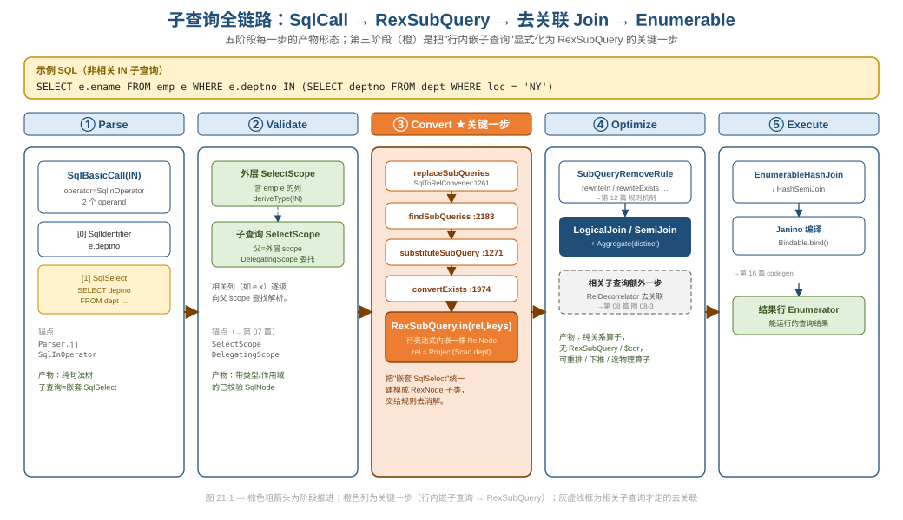
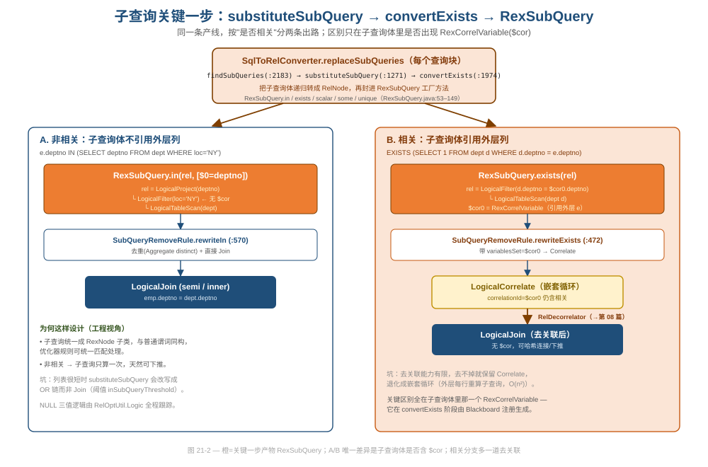
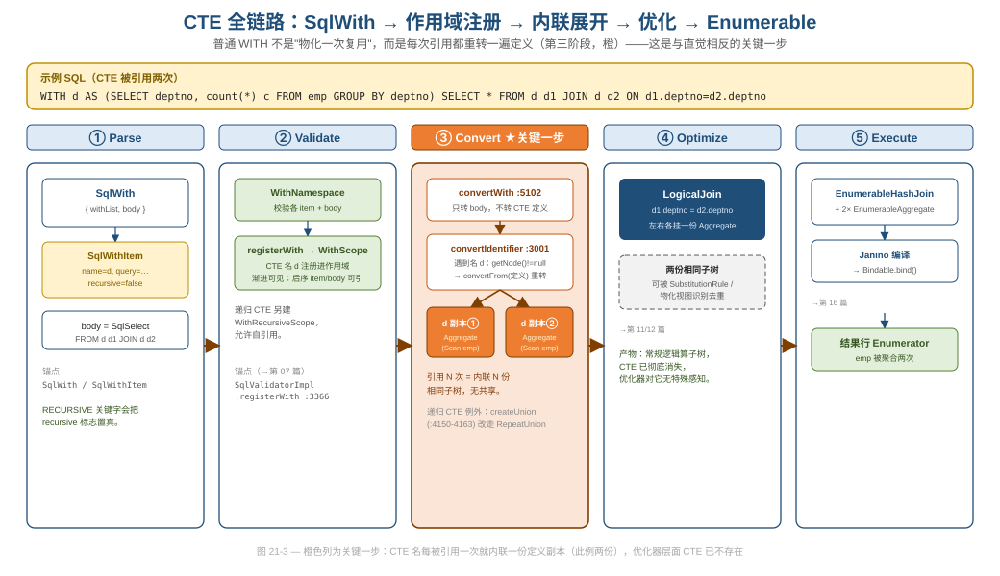
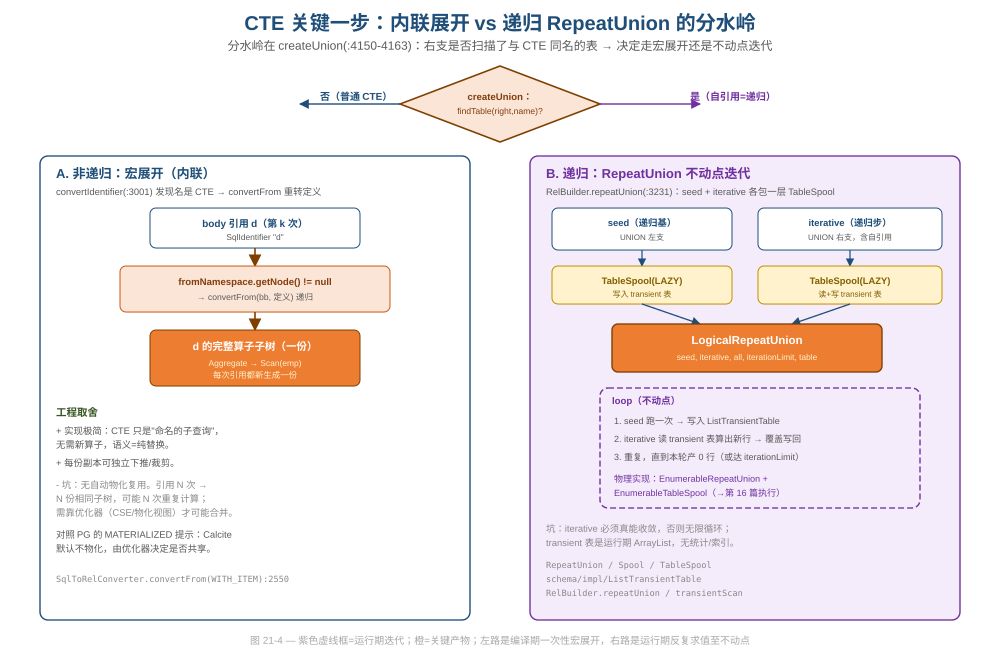
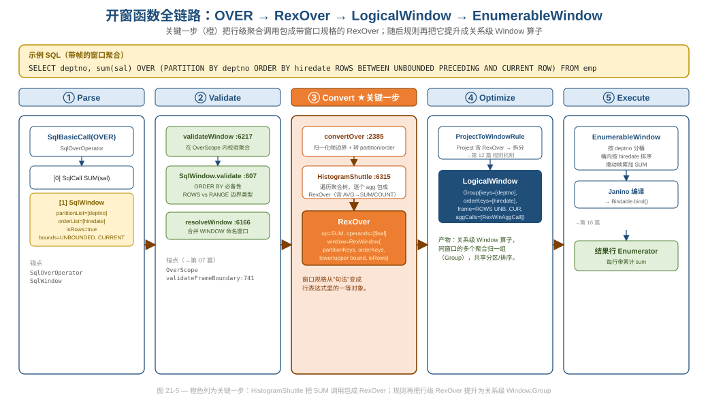
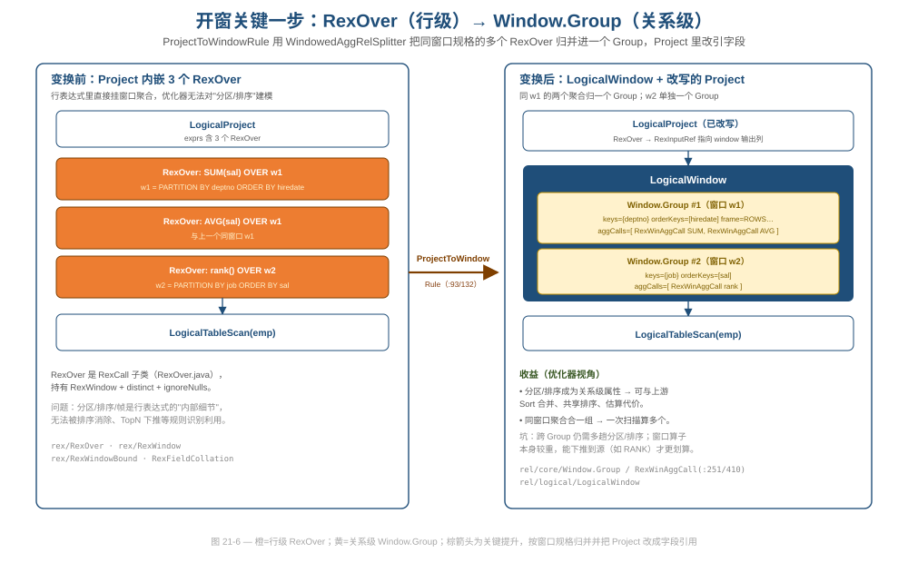
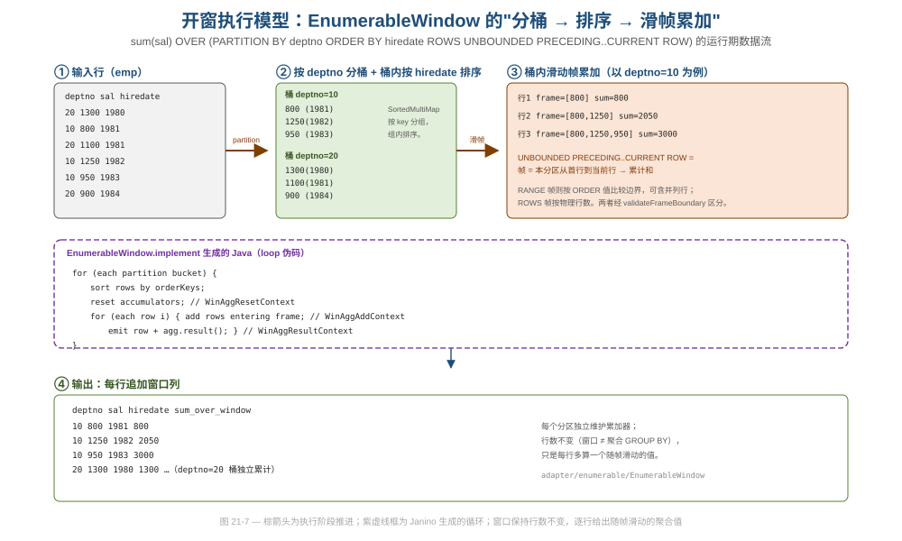
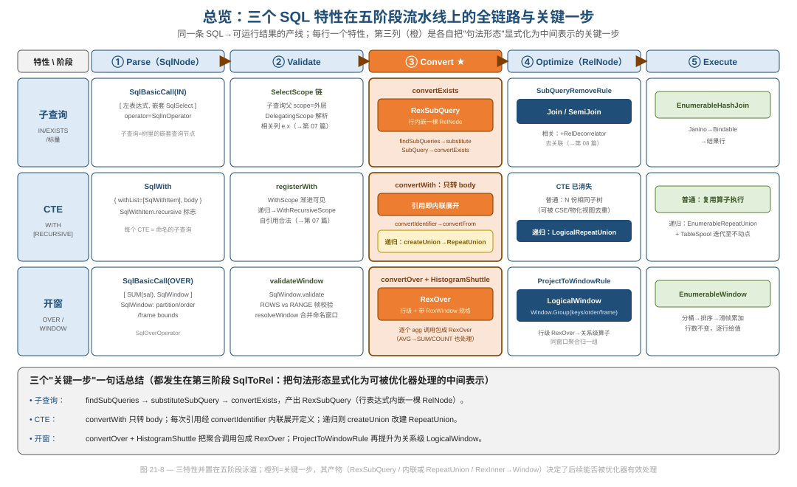

# 第 21 篇 · 三道硬菜的全链路：子查询 / CTE / 开窗函数（综合篇）

> 前 20 篇是"按机制横切"的源码鉴赏；本篇反过来"按特性纵切"：挑三个最难、也最能把五阶段流水线串起来的 SQL 特性——**子查询、CTE、开窗函数**——各自从一条 SQL 走到能运行的结果，并在途中标出**关键一步**。
> 它不复述任何通用机制（那是各主讲篇的事），只聚焦每个特性**专属**的装置；每个阶段的公共机制都一句话带过 + 链接到主讲篇。
> 基线 commit `111030383` · 前置阅读：[第 02 篇 · 四层 IR](02-ir-overview.md)、[第 07 篇 · Validator](07-validator.md)、[第 08 篇 · SqlToRel](08-sql-to-rel.md)、[第 11 篇 · VolcanoPlanner](11-volcano.md)、[第 12 篇 · 规则体系](12-rules.md)、[第 16 篇 · codegen](16-codegen-exec.md)

## TL;DR（要点速览）

- **三个关键一步都发生在第三阶段（`SqlToRelConverter`）**——把"句法形态"显式化为优化器能处理的中间表示。这正是四层 IR 中"`SqlNode → RelNode`/`RexNode`"那一次降级最脏、最关键的地方。
- **子查询**：`replaceSubQueries → findSubQueries → substituteSubQuery → convertExists`，产物是 `RexSubQuery`——一个**行表达式里内嵌了一整棵 `RelNode`** 的奇特对象；之后 `SubQueryRemoveRule`/`RelDecorrelator` 把它消解成 `Join`。
- **CTE**：`convertWith` 只转 body（一行：`return convertQuery(with.body, …)`）；普通 CTE **每次被引用就内联展开一遍定义**（`convertIdentifier` 递归），**不是物化一次复用**；只有 `WITH RECURSIVE` 例外，`createUnion` 检测到自引用后改建 `RepeatUnion` 做不动点迭代。
- **开窗**：`convertOver` + `HistogramShuttle` 把聚合调用包成 `RexOver`（行级、带窗口规格）；`ProjectToWindowRule` 再把 `Project` 里的 `RexOver` 提升为关系级 `LogicalWindow`（`Window.Group`），执行期由 `EnumerableWindow` 做"分桶→排序→滑帧累加"。
- **一句话对比**：子查询是"行内嵌关系→提升为关系"；CTE 是"命名子查询→编译期宏展开（或运行期迭代）"；开窗是"行级聚合→关系级窗口算子"。三者的共性是：**先在 sql2rel 阶段造一个特殊 IR 节点占位，再交给优化器规则消解**。

---

## 0. 公共底座：五阶段与四层 IR（一句话回顾）

三个特性都流过同一条产线：**Parse（`SqlParser`→`SqlNode`）→ Validate（`SqlValidator`）→ Convert（`SqlToRelConverter`）→ Optimize（`RelOptPlanner` + 规则）→ Execute（Enumerable codegen + Janino）**。这条线的总叙事见[第 01 篇](01-positioning.md)，四层 IR 的降级哲学见[第 02 篇](02-ir-overview.md)，本篇不再展开。

要先记住一个判断：**真正区分这三个特性"难在哪"的，几乎都集中在第三阶段**。前两阶段（解析、校验）只是忠实地把语法记成树、把作用域和类型补全；第四、五阶段（优化、执行）则把它们和普通算子一视同仁地处理。所以本篇每个特性都用同一节奏推进，但会把笔墨压在 `③ Convert ★` 那一格。

---

## 1. 子查询：从 SqlCall 到去关联后的 Join

子查询的难点在于它**打破了"行表达式只算标量、关系算子只算关系"的分层**：`WHERE x IN (SELECT …)` 里，一个关系（子查询结果集）出现在了本该是布尔标量的谓词位置上。Calcite 的处理思路是：先用一个特殊的 `RexNode` 把这棵"内嵌关系"原样接住，再交给规则把它"拍平"成关系级的 `Join`。



图 21-1 把这条链摊在五个阶段上：左两格是忠实记录与校验，橙色的第三格是关键一步（行内嵌子查询 → `RexSubQuery`），第四格才把它消解成 `Join`，最后落到 `EnumerableHashJoin`。注意第四格里灰色虚线框——**只有相关子查询**才需要额外的去关联一步。

### 1.1 Parse —— 子查询就是树里的一棵嵌套查询

解析阶段没有任何特殊处理：`x IN (subquery)` 被记成一个 `SqlBasicCall`，算子是 `SqlInOperator`（`core/src/main/java/org/apache/calcite/sql/fun/SqlInOperator.java`），两个 operand 分别是左表达式和右侧的 `SqlSelect`；`EXISTS (subquery)`、标量子查询 `(SELECT …)` 同理，分别对应 `SqlKind.EXISTS`、`SqlKind.SCALAR_QUERY`。`SOME`/`ALL` 量化比较走 `SqlQuantifyOperator`（继承自 `SqlInOperator`）。

换句话说，**子查询在 AST 里就是普通的嵌套 `SqlSelect`**，没有占位符、没有特殊节点。这是一处"延迟决策"的工程取舍：解析器不关心它将来是要内联还是要 Join，只忠实记形。

### 1.2 Validate —— 相关列靠 Scope 链向外查找

校验阶段，子查询对应自己的 `SelectScope`，但它的**父 scope 是外层查询的 scope**。当子查询体里出现 `e.deptno` 这种对外层表的引用时，`DelegatingScope` 会把解析请求逐级委托给父 scope，直到找到 `e`。这套"位置语境 vs 数据源行类型"的双抽象是[第 07 篇](07-validator.md)的主题，这里只点明：**子查询是否"相关"，本质就是它的体里有没有解析到一个属于外层 scope 的列**。这个判断的后果会一直延续到第四阶段。

### 1.3 Convert ★关键一步 —— convertExists 产出 RexSubQuery

这是全篇第一个关键一步。每个查询块在转 `WHERE`/`SELECT` 等子句前，会先调用 `replaceSubQueries` 把其中的子查询统一处理掉（`core/src/main/java/org/apache/calcite/sql2rel/SqlToRelConverter.java:1261`）：

```java
private void replaceSubQueries(Blackboard bb, SqlNode expr, RelOptUtil.Logic logic) {
  findSubQueries(bb, expr, logic, false);          // 1. 递归发现：EXISTS/IN/SCALAR_QUERY… 登记进 bb.subQueryList
  for (SubQuery node : bb.subQueryList) {
    substituteSubQuery(bb, node);                  // 2. 逐个替换：把 SqlNode 子查询变成一个 RexNode
  }
}
```

`substituteSubQuery`（`…:1271`）按 `SqlKind` 分派，最终都殊途同归地调用 `convertExists`（`…:1974`）——它把子查询体**递归地**转成一棵独立的 `RelNode`，再用 `RexSubQuery` 的工厂方法封装起来。`RexSubQuery`（`core/src/main/java/org/apache/calcite/rex/RexSubQuery.java`）的设计是这一步的灵魂：

```java
public class RexSubQuery extends RexCall {
  public final RelNode rel;                        // ← 一个"行表达式"里，公开持有一整棵 RelNode
  // 工厂方法按子查询种类区分：
  public static RexSubQuery in(RelNode rel, ImmutableList<RexNode> nodes) { … }     // :53
  public static RexSubQuery some(RelNode rel, …) { … }                              // :66
  public static RexSubQuery exists(RelNode rel) { … }                               // :96
  public static RexSubQuery unique(RelNode rel) { … }                               // :104
  public static RexSubQuery scalar(RelNode rel) { … }                               // :112
}
```

**为什么这是关键一步**：`RexSubQuery` 是一个 `RexCall`（行表达式），却 `public final RelNode rel`（内嵌一棵关系树）。这个"跨层"对象让子查询在 `WHERE`/`SELECT` 里能像普通谓词一样被携带、被 `RexShuttle` 遍历、被规则匹配——而不必在 sql2rel 阶段就纠结怎么 Join。它把"难"推迟到了优化阶段，且推迟得很干净。

相关性也在这一步定型：若子查询体引用了外层列，`Blackboard` 会注册一个 `CorrelationId`（前缀 `$cor`，见 `core/src/main/java/org/apache/calcite/rel/core/CorrelationId.java:35`）并在子查询体里用 `RexCorrelVariable` 代表"外层那一行"。**非相关子查询的 `rel` 里没有 `$cor`，相关子查询的 `rel` 里有**——这一个差异决定了下一阶段走 `Join` 还是先走 `Correlate`。



图 21-2 把这条产线和它的两条出路画在一起：橙色是关键产物 `RexSubQuery`；左路（非相关）的 `rel` 干净无 `$cor`，规则直接 `rewriteIn` 成 `Join`/`SemiJoin`；右路（相关）的 `rel` 里有 `$cor0`，规则先产出 `LogicalCorrelate`（嵌套循环语义），再由去关联补一刀。两条路唯一的差别，就是子查询体里那一个 `RexCorrelVariable`。

### 1.4 Optimize —— SubQueryRemoveRule 与去关联

`RexSubQuery` 不能直接执行，必须被消解。`SubQueryRemoveRule`（`core/src/main/java/org/apache/calcite/rel/rules/SubQueryRemoveRule.java`）的 `apply`（`…:96`）按种类分派到 `rewriteScalarQuery`（`:132`）、`rewriteExists`（`:472`）、`rewriteUnique`（`:536`）、`rewriteIn`（`:570`）、`rewriteSome`（`:177`）等：标量子查询包一层 `SINGLE_VALUE` 聚合后 `LEFT JOIN`；`IN` 去重后半连接；`SOME`/`ALL` 还要小心 NULL 的三值逻辑。规则机制本身（`RelRule.Config`、Operand 匹配）是[第 12 篇](12-rules.md)的主题。

相关子查询多一步：`SubQueryRemoveRule` 带着 `variablesSet` 产出 `LogicalCorrelate` 后，`RelDecorrelator.decorrelateQuery`（`core/src/main/java/org/apache/calcite/sql2rel/RelDecorrelator.java:205`）把"行级相关"提升为"关系级 `Join`"。**去关联的机制本体属于[第 08 篇](08-sql-to-rel.md)**（见其图 08-3），这里只强调它的价值与代价：去关联后子查询只算一次（按 key 聚合），可走哈希连接、可重排下推；但去关联能力有限，去不掉就保留 `Correlate`，退化成外层每行重算一次的嵌套循环（O(n²)）。

### 1.5 Execute —— 落到 Enumerable Join

到第五阶段，计划里已经没有 `RexSubQuery` 也没有 `$cor` 了，就是一棵普通的 `Join`/`Aggregate` 树，由 `EnumerableHashJoin` 等物理算子接管，经 Janino 编译成 `Bindable` 执行（→[第 16 篇](16-codegen-exec.md)）。子查询至此"消失"——它从未作为一个独立概念活到执行期。

---

## 2. CTE：内联展开与递归 RepeatUnion 的分水岭

CTE（`WITH d AS (…) SELECT …`）最反直觉的地方是：**普通 CTE 不是"算一次、存起来、多处复用"，而是每次被引用就把定义重新转换一遍**。很多人以为 `WITH` 是性能优化（共享子结果），但在 Calcite 默认实现里它纯粹是**语法便利 / 命名的子查询**，是否共享完全交给优化器。

### 2.1 Parse —— SqlWith 包住一串 SqlWithItem

`WITH` 子句解析为 `SqlWith`（`core/src/main/java/org/apache/calcite/sql/SqlWith.java`），它只有两个字段：

```java
public class SqlWith extends SqlCall {
  public SqlNodeList withList;   // 一串 SqlWithItem
  public SqlNode body;           // 主查询
}
```

每个 CTE 是一个 `SqlWithItem`（`core/src/main/java/org/apache/calcite/sql/SqlWithItem.java`），字段为 `name`、可选的 `columnList`、`query`，以及一个 `recursive` 标志（`SqlLiteral`）。`WITH RECURSIVE` 会把 `recursive` 置真——这个标志是后面所有"递归特殊处理"的总开关。

### 2.2 Validate —— WithScope 的渐进可见性

校验阶段，`SqlValidatorImpl.registerWith`（`core/src/main/java/org/apache/calcite/sql/validate/SqlValidatorImpl.java:3366`）为每个 CTE 建一个 `WithScope`，串成链：**第 k 个 CTE 能看见前 k-1 个 CTE，body 能看见所有 CTE**。`validateWith`/`validateWithItem`（`…:4888`/`…:4893`）负责校验列数匹配、列名不重等。

递归 CTE 额外建一个 `WithRecursiveScope`，让 CTE 的定义体里能合法地引用"自己"（普通作用域里这是前向引用，非法）。自引用被包装成一个特殊节点 `SqlWithItemTableRef`，为第三阶段的 `RepeatUnion` 转换埋下伏笔。这套作用域设计的通用原理见[第 07 篇](07-validator.md)。

### 2.3 Convert ★关键一步 —— 内联展开 vs 递归改写

这是全篇第二个关键一步，也是最容易踩坑的认知点。`convertWith` 本体只有一行：

```java
public RelRoot convertWith(SqlWith with, boolean top) {
  return convertQuery(with.body, false, top);   // 只转 body！CTE 定义这里根本没碰
}
```

CTE 的定义是**在 body 引用到它时才被转换的**。当 `convertFrom` 遇到一个标识符，走到 `convertIdentifier`（`…:2998`），它先解析命名空间，然后是点睛之笔（`…:3001`）：

```java
final SqlValidatorNamespace fromNamespace = getNamespace(id).resolve();
if (fromNamespace.getNode() != null) {        // 这个名字解析到了一个"定义节点"（即 CTE）
  convertFrom(bb, fromNamespace.getNode());    // → 递归把 CTE 的定义重新转一遍
  return;
}
```

也就是说，**body 里每出现一次 CTE 名，就触发一次 `convertFrom(CTE 定义)`，生成一份全新的算子子树副本**。`FROM` 分支里对 `WITH_ITEM`/`WITH` 的处理（`…:2550`/`…:2554`）也是同样的"直接递归进内部查询"——纯粹的内联展开。引用 N 次 = N 份相同子树，没有任何共享。



图 21-3 用一个把 CTE `d` 引用两次（自连接）的查询演示：橙色的第三格里，`d` 被内联成两份独立的 `Aggregate(Scan emp)`；到第四格优化阶段，CTE 这个概念已经彻底消失，优化器看到的只是两棵碰巧相同的子树。

**递归 CTE 是唯一的例外**。递归 CTE 的体一定是个 `UNION [ALL]`（递归基 ∪ 递归步）。`createUnion`（`…:4145`）在建并集前会做一次检测（`…:4150-4163`）：

```java
SqlNode enclosingNode = nameSpace.getEnclosingNode();
if (enclosingNode != null) {
  String name = "";
  if (enclosingNode.getKind() == SqlKind.WITH_ITEM) {
    name = ((SqlWithItem) enclosingNode).name.getSimple();
  }
  if (RelOptUtil.findTable(right, name) != null) {   // 右支扫描了与 CTE 同名的表 = 自引用
    return this.relBuilder.push(left).push(right)
        .repeatUnion(name, all).build();             // → 改建 RepeatUnion，而非普通 union
  }
}
```

只要 `UNION` 的右支里出现了对 CTE 自身的扫描，就改走 `repeatUnion`。这一步把"编译期宏展开"切换成了"运行期不动点迭代"。



图 21-4 把两条路并排：左路是编译期一次性的宏展开（`convertIdentifier` 递归），右路是 `RelBuilder.repeatUnion` 搭出的运行期迭代结构。注意紫色虚线框——那是真正在运行期反复求值的循环。

### 2.4 递归执行模型 —— RepeatUnion + TableSpool + TransientTable

`RelBuilder.repeatUnion`（`core/src/main/java/org/apache/calcite/tools/RelBuilder.java:3231`）是递归 CTE 的物理建模核心。它的文档注释把语义讲得很清楚：

```java
RelNode iterative = tableSpool(Spool.Type.LAZY, Spool.Type.LAZY, table).build();
RelNode seed = tableSpool(Spool.Type.LAZY, Spool.Type.LAZY, table).build();
RelNode repeatUnion =
    struct.repeatUnionFactory.createRepeatUnion(seed, iterative, all, iterationLimit, table);
```

三个角色：
- **`TransientTable`**（`core/src/main/java/org/apache/calcite/schema/TransientTable.java`，实现 `core/src/main/java/org/apache/calcite/schema/impl/ListTransientTable.java`）——一张只在查询执行期存在、底层是 `ArrayList` 的临时表，存放每轮迭代的中间结果。
- **`TableSpool`**（`core/src/main/java/org/apache/calcite/rel/core/TableSpool.java`，继承 `Spool`）——把数据"溢写/读取"到那张临时表的物化算子。`seed` 和 `iterative` 各包一层。
- **`RepeatUnion`**（`core/src/main/java/org/apache/calcite/rel/core/RepeatUnion.java`）——驱动器：先把 `seed`（递归基）跑一次写入临时表，再反复跑 `iterative`（递归步，它会扫描临时表），每轮覆盖写回，直到本轮产 0 行或达到 `iterationLimit`。

`SqlToRelConverter.convertTransientScan`（`…:2990`）负责为自引用建那张临时表的扫描。执行期由 `EnumerableRepeatUnion` + `EnumerableTableSpool`（`core/src/main/java/org/apache/calcite/adapter/enumerable/EnumerableRepeatUnion.java`、`…/EnumerableTableSpool.java`）落地。

### 2.5 Optimize / Execute 小结

普通 CTE 在优化阶段就是普通子树，能否去重（避免重复计算）取决于优化器是否识别出相同子结构（如 `SubstitutionRule`、物化视图匹配，→[第 11](11-volcano.md)/[12 篇](12-rules.md)）。**坑很明确**：默认不物化、不复用，多次引用的重计算需要使用方自己警惕（或显式拆成临时表）。递归 CTE 则始终是 `RepeatUnion`，**坑是收敛性**——`iterative` 必须真能减少到 0 行，否则无限循环，且临时表无统计无索引，代价模型对它估计很弱。

---

## 3. 开窗函数：从 RexOver 到 EnumerableWindow

开窗函数（`sum(sal) OVER (PARTITION BY … ORDER BY … ROWS …)`）的难点是：它既不是普通标量（要看一整个分区的多行），又不是 `GROUP BY` 聚合（不缩减行数）。Calcite 的解法和子查询异曲同工：**先在行表达式层造一个特殊节点 `RexOver` 占位，再用规则把它提升成关系级算子 `Window`**。



图 21-5 摊开五个阶段：橙色第三格把聚合调用包成 `RexOver`，第四格把它提升成 `LogicalWindow`，第五格由 `EnumerableWindow` 物理执行。

### 3.1 Parse —— SqlOverOperator 接住 OVER

`agg(...) OVER (...)` 解析成一个 `SqlBasicCall`，算子是 `SqlOverOperator`（`core/src/main/java/org/apache/calcite/sql/SqlOverOperator.java`），operand[0] 是聚合调用、operand[1] 是 `SqlWindow`（`core/src/main/java/org/apache/calcite/sql/SqlWindow.java`）。`SqlWindow` 持有 `partitionList`、`orderList`、`isRows`（`ROWS` 还是 `RANGE`）、上下帧边界、`exclude` 等纯句法信息。命名窗口 `WINDOW w AS (...)` 也记录在这里，引用时再合并。

### 3.2 Validate —— 帧边界与 ROWS/RANGE 校验

校验阶段，聚合在 `OverScope` 内被校验；`SqlValidatorImpl.validateWindow`（`…:6217`）与 `SqlWindow.validate`（`core/src/main/java/org/apache/calcite/sql/SqlWindow.java:607`）一起做大量约束检查：`RANK`/`ROW_NUMBER` 必须有 `ORDER BY` 且不允许显式帧；`ROWS` 帧的边界必须是整型字面量，`RANGE` 帧的边界必须与排序列类型相容（`validateFrameBoundary`，`…:741`）；上界不得早于下界等。命名窗口的合并由 `resolveWindow`（`…:6166`）+ `SqlWindow.overlay`（`…:496`）按 SQL 标准的覆盖规则完成。校验机制通用原理见[第 07 篇](07-validator.md)。

### 3.3 Convert ★关键一步 —— convertOver + HistogramShuttle 产出 RexOver

第三个关键一步。`convertOver`（`core/src/main/java/org/apache/calcite/sql2rel/SqlToRelConverter.java:2385`）先解析窗口、归一化帧边界（不支持帧的算子自动补成"到当前行为止"），再把分区/排序键转成 `RexNode`/`RexFieldCollation`：

```java
private RexNode convertOver(Blackboard bb, SqlNode node) {
  SqlCall call = (SqlCall) node;
  SqlCall aggCall = call.operand(0);                 // 聚合函数调用，如 SUM(sal)
  // … 处理 IGNORE NULLS / RESPECT NULLS …
  SqlNode windowOrRef = call.operand(1);
  final SqlWindow window = validator().resolveWindow(windowOrRef, bb.scope);
  boolean rows = window.isRows();
  // … 归一化 lower/upper bound、转换 partition/order 列 …
}
```

收尾交给内部的 `HistogramShuttle`（`…:6315`）：它遍历转换后的聚合表达式树，把遇到的每个聚合函数调用包装成一个 `RexOver`。"遍历"而非"直接包一层"是必要的——`AVG` 这类聚合在转换中可能被拆成 `SUM/COUNT`，`HistogramShuttle` 要确保拆出来的每个子聚合都正确地戴上同一套窗口规格。

产物 `RexOver`（`core/src/main/java/org/apache/calcite/rex/RexOver.java`）是个 `RexCall`，额外持有 `RexWindow`（分区键、排序键、帧边界）、`distinct`、`ignoreNulls`：

```java
public class RexOver extends RexCall {
  public SqlAggFunction getAggOperator() { … }   // :118  底层聚合函数
  public RexWindow getWindow() { … }              // :122  分区/排序/帧规格
}
```

**为什么这是关键一步**：和 `RexSubQuery` 一样，`RexOver` 是把一个"超出普通标量能力"的语义塞进行表达式层的占位对象。它让窗口聚合先以行级形式存在，待优化阶段再被提升——分层因此得以保持，sql2rel 不必在此就处理分区与排序。

### 3.4 Optimize —— ProjectToWindowRule 提升为 LogicalWindow

`RexOver` 留在 `Project` 里优化器是没法好好处理的（分区/排序被埋在行表达式内部）。`ProjectToWindowRule`（`core/src/main/java/org/apache/calcite/rel/rules/ProjectToWindowRule.java`，含 `CalcToWindowRule`(`:93`)、`ProjectToLogicalProjectAndWindowRule`(`:132`)）用内部的 `WindowedAggRelSplitter`（`:211`）把含 `RexOver` 的 `Project` 拆成 `LogicalWindow` + 改写后的 `Project`。

`LogicalWindow`（`core/src/main/java/org/apache/calcite/rel/logical/LogicalWindow.java`，继承 `core/src/main/java/org/apache/calcite/rel/core/Window.java`）的核心是 `Window.Group`（`Window.java:251`）：

```java
public static class Group {
  public final ImmutableBitSet keys;          // 分区列
  public final boolean isRows;                 // ROWS / RANGE
  public final RexWindowBound lowerBound;
  public final RexWindowBound upperBound;
  public final RelCollation orderKeys;         // 排序键
  public final ImmutableList<RexWinAggCall> aggCalls;   // 同窗口的多个聚合归一组
}
```

**关键在归并**：`PARTITION BY`/`ORDER BY`/帧完全相同的多个 `RexOver`（如 `SUM(sal) OVER w` 与 `AVG(sal) OVER w`）会被收进**同一个 `Group`**，这样它们能共享一次分区与排序、一趟扫描算多个聚合。`Project` 里原来的 `RexOver` 则被改写成对 `Window` 输出列的 `RexInputRef`。



图 21-6 演示了这次提升：变换前 `Project` 内嵌 3 个 `RexOver`（两个同窗口 `w1`、一个 `w2`）；变换后 `w1` 的两个聚合归入 `Group #1`、`w2` 单独 `Group #2`，分区/排序成了关系级属性，优化器可与上游 `Sort` 合并、估代价。

### 3.5 Execute —— EnumerableWindow 分桶、排序、滑帧累加

物理执行由 `EnumerableWindow`（`core/src/main/java/org/apache/calcite/adapter/enumerable/EnumerableWindow.java`）生成 Java：按分区键把行分桶（`SortedMultiMap`），桶内按排序键排序，然后逐行滑动窗口帧、调用累加器，最后**保持行数不变**地为每行追加窗口列。`ROWS` 帧按物理行数滑动、`RANGE` 帧按排序值比较边界（可含并列行）。



图 21-7 用 `sum(sal) OVER (PARTITION BY deptno ORDER BY hiredate ROWS UNBOUNDED PRECEDING..CURRENT ROW)` 走了一遍运行期数据流：分桶 → 桶内排序 → 滑帧累加得到逐行的"累计和"，输出行数与输入一致。**坑**：跨 `Group` 仍需多趟分区/排序，窗口算子本身偏重；能把 `RANK` 等下推到数据源时更划算（→[第 16 篇](16-codegen-exec.md) 讲 codegen 与执行）。

---

## 4. 三特性对照：关键一步在五阶段上的位置

把三条链并起来看，结构惊人地一致：**都在 sql2rel 阶段先造一个"特殊 IR 节点"占位，再交给规则消解/提升**。



图 21-8 是本篇的压轴总览：三行分别是子查询、CTE、开窗，五列是五个阶段，橙色第三列是各自的关键一步。读这张图的正确方式是横向看产物的"形变"——

| 特性 | 关键一步（都在 `SqlToRelConverter`） | 产物 | 消解者 |
|---|---|---|---|
| 子查询 | `findSubQueries → substituteSubQuery → convertExists` | `RexSubQuery`（行内嵌 `RelNode`） | `SubQueryRemoveRule` + `RelDecorrelator` → `Join` |
| CTE（普通） | `convertWith` 只转 body；`convertIdentifier` 逐次内联 | N 份内联子树 | 优化器（可选去重） |
| CTE（递归） | `createUnion` 检测自引用 → `repeatUnion` | `RepeatUnion` + `TableSpool` | `EnumerableRepeatUnion` 不动点迭代 |
| 开窗 | `convertOver` + `HistogramShuttle` | `RexOver`（行级带窗口规格） | `ProjectToWindowRule` → `LogicalWindow` |

一个统一的设计观感：**Calcite 偏好"先占位、后消解"**。在最脏的 sql2rel 阶段，它不急于把难特性彻底解决，而是造一个能被现有 IR 体系（`RexNode`/`RelNode`）携带、能被 `Shuttle` 遍历、能被规则匹配的中间形态；真正的重写交给职责单一的规则去做。这让 sql2rel 保持线性可读，也让难特性的优化与普通算子复用同一套规则/代价/Trait 基础设施。

---

## 设计模式与工程小结

| 模式 / 手法 | 出现位置 | 解决什么 |
|---|---|---|
| **占位 + 延迟消解**（核心共性） | `RexSubQuery`、`RexOver`、`RepeatUnion` | sql2rel 阶段不彻底解决难特性，先造可被携带/匹配的 IR 节点，难点推迟到规则阶段 |
| **跨层内嵌** | `RexSubQuery.rel`（行表达式持有 `RelNode`） | 让关系出现在标量位置而不破坏分层接口 |
| **Visitor / Shuttle** | `HistogramShuttle`（包 `RexOver`）、`RexShuttle` 遍历 `RexSubQuery` | 对表达式树做结构化改写（三层 Shuttle 对照见[第 19 篇](19-design-patterns.md)） |
| **宏展开（macro expansion）** | `convertIdentifier` 内联 CTE 定义 | 用纯替换实现"命名子查询"，零新增算子 |
| **物化 / Spool** | `TableSpool` + `TransientTable` | 为递归 CTE 提供运行期可读写的中间存储 |
| **不动点迭代** | `RepeatUnion` | 把递归语义降级为"反复求值至收敛"的可执行结构 |
| **规则化重写** | `SubQueryRemoveRule`、`ProjectToWindowRule` | 把特殊 IR 节点消解/提升成普通算子（机制见[第 12 篇](12-rules.md)） |
| **分组归并** | `Window.Group` 收同窗口聚合 | 共享分区/排序，一趟算多个窗口聚合 |

**诚实地说坑**：① 普通 CTE 默认不物化，多次引用会重复计算；② 相关子查询去关联能力有限，去不掉就退化成嵌套循环；③ 递归 CTE 依赖使用者保证收敛，且临时表无统计、代价估计弱；④ 窗口算子较重，跨 `Group` 需多趟分区/排序。

---

## 对照阅读建议（动手）

- **断点（子查询关键一步）**：`core/src/main/java/org/apache/calcite/sql2rel/SqlToRelConverter.java` → `SqlToRelConverter#substituteSubQuery`（`:1271`）与 `#convertExists`（`:1974`）。
  - **观察**：`SubQuery.expr` 如何从 null 被填成一个 `RexSubQuery`；对相关子查询，`bb.mapCorrelateToRex` 是否新增了 `$cor` 项；`RexSubQuery.rel` 这棵内嵌树长什么样。
  - **运行**：`./gradlew :core:test --tests org.apache.calcite.test.SqlToRelConverterTest`（含大量 IN/EXISTS/标量子查询用例）。
- **断点（CTE 内联）**：`SqlToRelConverter#convertIdentifier`（`:2998`，重点 `:3001` 的 `fromNamespace.getNode() != null` 分支）。
  - **观察**：对 `WITH d AS (…) SELECT … FROM d d1 JOIN d d2 …`，该分支被命中**两次**，每次都重新 `convertFrom` 出一份相同子树（内联，无共享）。
  - **运行**：在 `SqlToRelConverterTest` 里跑一个含被多次引用 CTE 的用例，看输出计划里出现两份相同子树。
- **断点（递归 CTE 分水岭）**：`SqlToRelConverter#createUnion`（`:4145`，重点 `:4157` 的 `RelOptUtil.findTable(right, name)`）。
  - **观察**：普通 `UNION` 该判断为 null（走 `union`）；`WITH RECURSIVE` 时非 null（走 `repeatUnion`，产 `LogicalRepeatUnion` + 两个 `TableSpool`）。
- **断点（开窗关键一步）**：`SqlToRelConverter#convertOver`（`:2385`）及内部 `HistogramShuttle`（`:6315`）。
  - **观察**：`RexOver.getWindow()` 的分区/排序/帧边界；再在 `ProjectToWindowRule` 触发后，观察 `Window.Group.aggCalls` 是否把同窗口的多个聚合归进了一组。
  - **运行**：`./gradlew :core:test --tests org.apache.calcite.test.SqlToRelConverterTest`（搜 `testWindow*`/`Over` 相关用例）。

## 延伸阅读

- [第 02 篇 · 为什么是四层 IR](02-ir-overview.md)——本篇三个关键一步都是"`SqlNode` → `RexNode`/`RelNode`"那次降级的具体战场。
- [第 07 篇 · Validator：Scope/Namespace 双抽象](07-validator.md)——相关列解析、`WithScope`、`OverScope`/窗口校验的机制本体。
- [第 08 篇 · SqlToRel：Blackboard + Convertlet](08-sql-to-rel.md)——`Blackboard` 共享状态、子查询**去关联机制本体**（图 08-3）。
- [第 12 篇 · 规则体系](12-rules.md)——`SubQueryRemoveRule`、`ProjectToWindowRule` 背后的 `RelRule`/Operand 匹配机制。
- [第 16 篇 · codegen + Janino + Interpreter](16-codegen-exec.md)——`EnumerableHashJoin`/`EnumerableWindow`/`EnumerableRepeatUnion` 的执行与代码生成。
- 官方文档：`site/_docs/reference.md`（`WITH`/`WINDOW`/子查询语法与语义）、`site/_docs/algebra.md`（`RelBuilder` 的 `repeatUnion`/`transientScan` 用法）。
